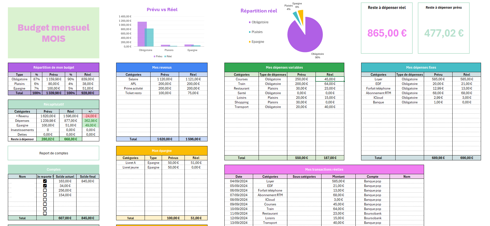
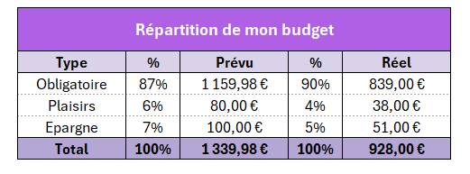
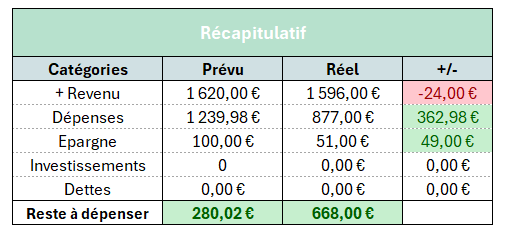
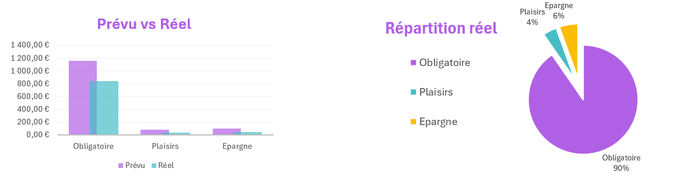



Aucun prérequis



[Cours Excel Pratique](https://excel-pratique.com/fr/formation-excel)


## Reprendre les bases d’Excel

### Contexte

De par mes divers stages, je savais utiliser Excel mais sans vraiment avoir eu de réel cours, donc c’était plus de la bidouille qu’une réelle maîtrise de l’outil. Je voulais donc profiter de ce MON pour reprendre les bases avec un vrai cours afin de mieux comprendre comment fonctionne réellement Excel.

### Cours suivi

J’ai alors, comme beaucoup d’élèves de Do-It, suivi le cours [Excel Pratique](https://excel-pratique.com/fr/formation-excel), qui est assez synthétique et qui contient quelques exercices pour pratiquer en même temps que l’on apprend.

Je suis aussi tombée sur une [Notice Microsoft](https://support.microsoft.com/fr-fr/office/raccourcis-clavier-dans-excel-1798d9d5-842a-42b8-9c99-9b7213f0040f)  qui rassemble tous les raccourcis clavier pour Excel. Je n’ai pas tout pratiqué, mais dans l’utilisation régulière d’Excel, cela constitue une ressource très utile, notamment pour gagner du temps.

### Retour critique

Ce cours était intéressant car il permet de balayer efficacement les notions de base d’Excel, mais ne rentre pas forcément dans un niveau de détail qui aurait pu m’intéresser davantage. Cependant, la partie "astuces" du cours est presque plus utile que les cours eux-mêmes (bien qu’elle soit moins mise en avant), car elle donne plein de petites astuces pratiques.

## Création d’un business planner

### Contexte

Je voulais trouver une application pour pratiquer sur Excel qui sorte du cadre de mon alternance. J’ai alors pensé à me créer un **budget planner**, car j’en vois souvent passer en reels sur Instagram et que j’avais envie d’en tester un. Cependant, ils sont souvent payants, alors je me suis dit que j’allais le fabriquer moi-même en m’inspirant de ce que j’avais vu.

### Étapes de création

#### Réalisation d’un brouillon

En m'inspirant de ce que j’avais vu sur les réseaux et de mon précédent cahier de comptes, j’ai écrit sur papier les différentes pages que je voulais réaliser ainsi que les diverses informations qu’elles allaient contenir :

- Un vision board annuel
- Un budget par mois (un pour chaque mois)
- Les objectifs
- Un onglet de planification
- Un onglet “caché” contenant des listes utiles

Le but est de créer ce **template** pour qu’il soit utilisable ensuite toute l’année et pour chaque année, sans avoir besoin de modifier la structure. Il est aussi conçu pour que d’autres puissent théoriquement l’utiliser : après avoir rempli l’onglet de planification, les autres onglets se remplissent automatiquement.

#### Mise en page

J’ai alors commencé par créer tous mes onglets et à créer les tableaux et les zones qui les composent.


Une astuce que j’avais vue passer sur les réseaux : comme mes feuilles comportent plusieurs tableaux les uns sous les autres, et afin d’éviter des **problèmes de dimensions**, avant de commencer je redimensionne tout mon tableau en **“petits carrés”**, puis je fusionne les cellules pour créer des tableaux aux tailles souhaitées.


Je voulais à la fois un outil pratique mais aussi esthétique. J’ai alors joué sur les **bordures**, les **couleurs**, les **polices**, etc., afin de manipuler ce que j’avais appris dans les cours et améliorer le rendu de mon budget planner.

#### Les formats

Une fois mes onglets et leurs tableaux de valeurs structurés, j’ai appliqué des formats à mes données : partout où je voulais un format particulier, j’ai appliqué un format spécifique à mes données, comme nombre, pourcentage, date, ou monétaire.

#### Les listes

Je me suis rendu compte, en voulant créer des listes déroulantes à sélectionner pour certaines données, que j'avais besoin d'avoir ces informations dans des listes qui ne correpondait pas forcément à la logique de mon onglet de planification notamment :

- Type de dépense (Obligatoire, Plaisirs, Épargne)
- Catégories de dépenses (Courses, Loyer, Transport, …)
- Compte en banque (Compte courant, Livret épargne, …)

J'ai donc créer ces listes  dans un onglet caché, en prenant les données dans mon onglet de plannification.

Une fois ces listes créées, j’ai fait une validation des données pour les tableaux correspondants afin de n’avoir que les valeurs de ces listes sélectionnables, car on en aura besoin par la suite dans nos formules.

#### Les formules

La partie la plus technique a ensuite été de rédiger les formules afin d’automatiser les calculs. Je n’ai, dans un premier temps, eu le temps que de réaliser mon budget par mois. Il me faudra plus de temps pour réaliser mon vision board annuel.

La fonction que j’ai le plus utilisée est la **SOMME.SI (plage; critères; [somme_plage])**. J’ai cependant été confrontée à un problème qui limite l’automatisation de mon tableur.

J’aurais aimé pouvoir, dans ma fonction, tester le critère sur la valeur de ma colonne. Or, celle-ci étant du texte, cela ne fonctionne pas sur Excel. J’ai cherché des solutions sur des forums, mais je n’ai rien trouvé de concluant.


J’ai donc pour le moment utilisé le mot que j’ai copié à la main et mis entre guillemets, mais je garde espoir de trouver une meilleure solution :

=SOMME.SI(I18:I20;"Obligatoire";J18:J20)+SOMME.SI(N7:N12;"Obligatoire";O7:O12)+SOMME.SI(T7:T13;"Obligatoire";U7:U13)


Ce type de fonction est utilisé pour l’instant pour tout ce qui est réel. Il faut saisir toutes les informations dans un tableur en bas de page, pour que, ensuite, tous les tableurs plus hauts puissent se remplir automatiquement.

#### Valeur de test

Une fois toute cette structure montée, j’ai ajouté des valeurs de test pour pouvoir visualiser le résultat pour la suite. Il faudra par la suite faire une opération de nettoyage de ces données.

#### Mise en forme conditionnelle

Comme vu dans le cours, les mises en forme conditionnelle permettent de mettre en avant certaines valeurs. Je les ai donc utilisées dans mon récapitulatif afin de visualiser si j’étais dans le rouge ou pas. J’ai donc surligné en rouge les valeurs négatives et en vert les positives pour pouvoir voir en un coup d’œil l’état de mes finances.

#### Les graphiques

Toujours dans une idée de meilleure visualisation des données, j’ai ajouté divers graphiques à ma template du mois, notamment un graphique prévu vs réel en barre et un camembert de la répartition réelle. J’ai cependant eu un peu de mal avec le camembert, car comme j’ai fusionné des cellules, je ne sais pas trop pourquoi, mais j’avais plein de données parasites. J’ai donc dû nettoyer à la main pour avoir un camembert propre.

### Ce qu’il reste à faire

Sur tous les onglets que j’avais prévus de faire, j’ai donc pu réaliser les suivants :

- Un vision board annuel ❌
- Un budget par mois (un pour chaque mois) ✅
- Les objectifs ❌
- Un onglet de planification ✅
- Un onglet “caché” contenant des listes utiles ✅

Je suis déjà contente d’avoir réussi à faire tout cela en 6 heures, et je compte continuer sur mon temps perso pour notamment faire le vision board annuel et, si possible, aussi les objectifs, afin de pouvoir suivre les projets d’épargne et d’investissement dans le futur.

### Horodatage

| Date | Heures passées | Indications |
| -------- | --------- | --------|
| Jeudi 14/11 | 0h45 | Les bases |
| Jeudi 14/11 | 0h20 | Les bordures |
| Jeudi 14/11 | 0h15 | Les formats |
| Jeudi 14/11 | 0h15 | Insertion d’objets |
| Jeudi 14/11 | 0h30 | Recopie incrémentée |
| Jeudi 14/11 | 1h | Les formules |
| Jeudi 14/11 | 0h20 | Les graphiques |
| Jeudi 14/11 | 0h20 | Les mises en forme conditionnelle |
| Jeudi 14/11 | 0h15 | Trier et filtrer |
| Jeudi 14/11 | 0h15 | Validation de données |
| Jeudi 14/11 | 0h30 | TCD |
| Jeudi 14/11 | 0h30 | Astuces |
| Jeudi 14/11 | 6h| Réalisation du budget planner |

### Bibliographie



- [Cours Excel Pratique](https://excel-pratique.com/fr/formation-excel)
- [Raccourcis clavier Excel](https://support.microsoft.com/fr-fr/office/raccourcis-clavier-dans-excel-1798d9d5-842a-42b8-9c99-9b7213f0040f)

