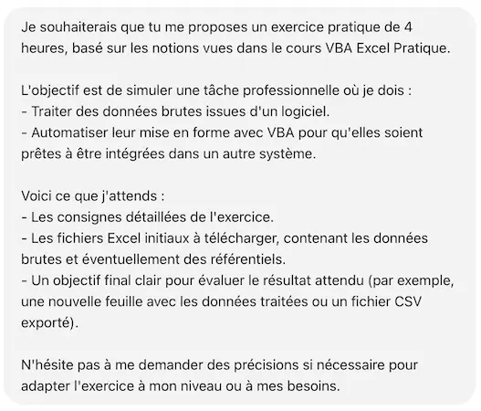
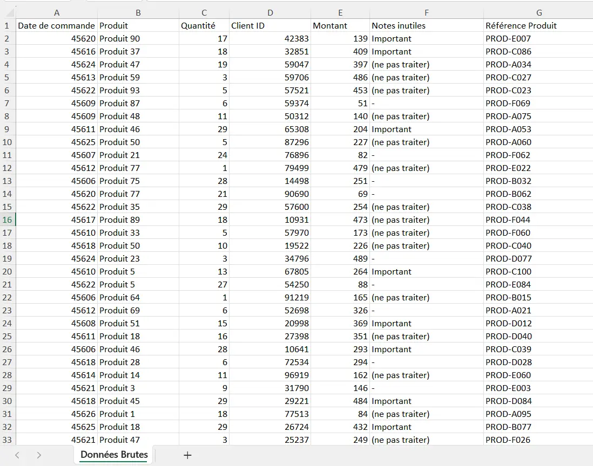
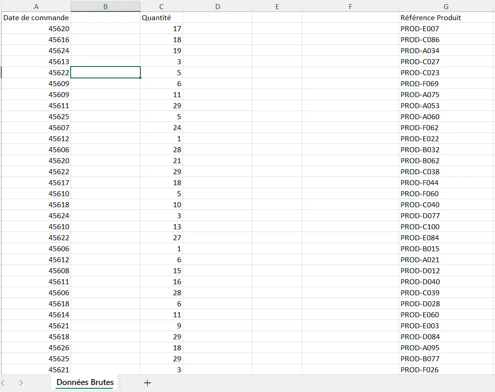
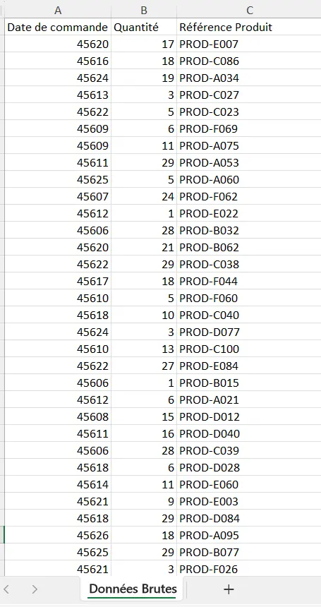
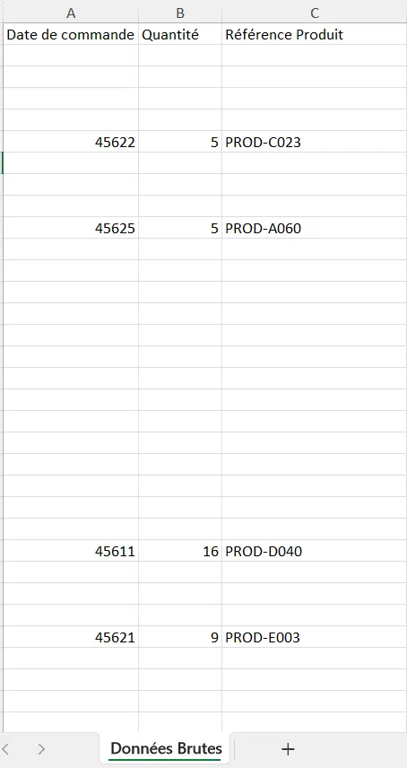
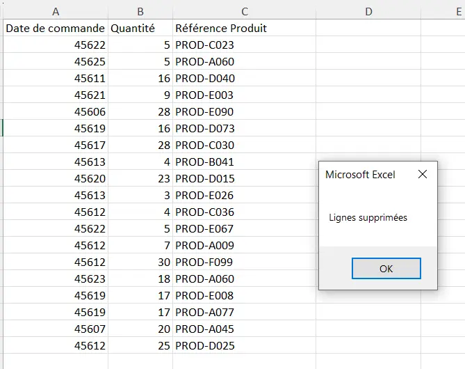
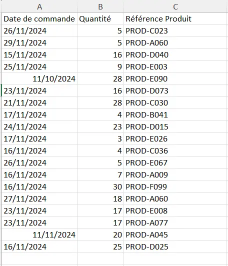
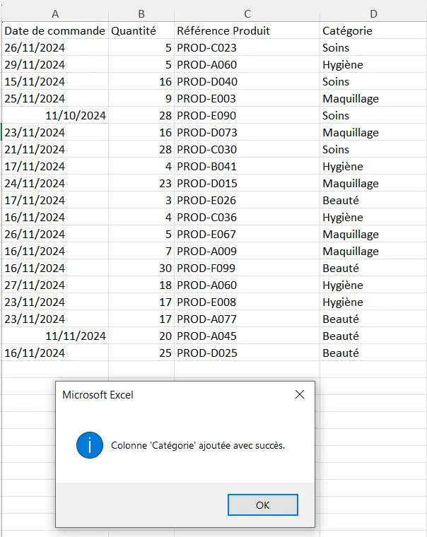



Aucun prérequis



## Découvrir VBA

### Contexte

Lors de mon précédent stage, afin d’optimiser un outil de travail sur Excel, j’ai dû créer une macro. N'ayant aucune connaissance en VBA, je l’ai réalisée en utilisant l’enregistrement automatique, ce qui complique la modification et la maintenance ultérieures.

Aussi, dans mes missions en alternance, je suis amenée à traiter un fichier Excel de données assez complexe, et je suis convaincue qu’à l’aide de macros simples, ce traitement pourrait se faire de manière beaucoup plus performante.

J’aimerais donc apprendre les bases de VBA pour être capable de créer, par exemple, une macro simple permettant de modifier l’affichage d’une page et/ou d’automatiser des tâches de mise en forme de données.

### Cours suivi

En faisant le tour des différents MON déjà existants sur le site de Do-It sur le sujet de VBA et des macros, et grâce aux retours de mes camarades sur les cours qu’ils avaient suivis, j’ai choisi de suivre le cours VBA de **Excel Pratique**, car c’est celui qui me paraissait le plus complet et le plus adapté à mon mode d’apprentissage. En plus, j’avais déjà suivi leur cours sur Excel et je savais qu’il était bien expliqué, surtout pour les débutantes comme moi en VBA.

J’ai alors suivi les 8 premiers modules de formation, en partie par manque de temps, car je voulais avoir le temps de pratiquer ce que j’avais appris, et parce que, dans un premier temps, je n’estime pas avoir besoin d’utiliser des forms. Je m’y formerai plus tard.

### Retour critique

Là où, dans mon MON 2.1, j’avais trouvé le cours d’Excel Pratique parfois un peu superficiel sur certaines notions (du moins à mon niveau), j’ai trouvé que leur cours de VBA est vraiment complet et permet aux débutantes comme moi de bien comprendre les différents concepts et de les manipuler simplement sur de petits exemples.

Je recommande donc ce cours pour les personnes comme moi, n’étant pas des pros de l’informatique, mais maîtrisant déjà bien les fondamentaux d’Excel.

## S’entraîner sur un exemple professionnalisant

### Consignes

Mon objectif pour ce MON était à la fois de découvrir les bases du VBA, mais aussi de pouvoir les appliquer à un cas simple auquel j’ai été plusieurs fois confrontée dans le monde professionnel : j’aimerais savoir automatiser des tâches afin de faciliter le traitement de certaines données sur Excel, notamment pour faire passer des données d’un logiciel à un autre.

Cependant, dans l’optique de pouvoir présenter mon travail sur le site, je ne pouvais pas le faire sur des données réelles de mon entreprise. J’ai alors choisi de demander à ChatGPT de me fournir un exercice pratique via le prompt suivant :





**Exercice : Mise en forme et traitement des données pour intégration inter-logiciels**

**Contexte :**
Vous travaillez dans une entreprise qui utilise deux logiciels différents pour gérer les ventes et les stocks. Chaque mois, vous recevez un fichier Excel brut contenant les données des ventes du mois précédent, qu'il faut préparer pour l'importer dans le logiciel de gestion des stocks.

**Objectif :**
Écrire un programme VBA pour automatiser le traitement des données brutes et produire un fichier final prêt à être importé.

**Fichiers fournis :**

- Feuille "Données Brutes"
- Feuille "Produits"

**Consignes :**

**1. Création d'un module VBA :** Créez un programme VBA pour automatiser les étapes suivantes :

- Suppression des colonnes inutiles :
Conservez uniquement les colonnes nécessaires : Date de commande, Référence Produit, Quantité.
- Validation des données :
Vérifiez que chaque "Référence Produit" existe dans la feuille "Produits".
Supprimez les lignes contenant des références produits non valides.

- Mise en forme des dates :
Convertissez toutes les dates au format JJ/MM/AAAA.
- Ajout de colonnes calculées :
Ajoutez une colonne "Catégorie" en récupérant cette information depuis la feuille "Produits".

**2. Exportation des données :** Une fois le traitement terminé :

- Créez une nouvelle feuille "Données Finales" avec les données nettoyées.
- Enregistrez cette feuille en tant que fichier CSV nommé Export_YYYYMM.csv, où YYYYMM correspond au mois et à l'année des données.

**3. Documentation :**

- Ajoutez des commentaires dans votre code pour expliquer chaque étape.
- Fournissez un résumé dans la feuille "Documentation" décrivant le fonctionnement de votre programme.


### Résolution

J’ai résolu ce problème par étapes :

#### Suppression des colonnes inutiles :

```vba
Sub effacer()
 
'Sélection des colonnes à supprimer
Columns("B").Clear
Columns("D:F").Clear
End Sub
```

On passe alors de :



À :



```vba
Sub deplacer()
 
    ' Selectioner et deplacer les colonnes restantes pour les rassembler
    Columns("C").Cut Destination:=Columns("B")
    Columns("G").Cut Destination:=Columns("C") 
End Sub
```

On passe alors à :



#### Validation des données :

On commence par effacer le contenu de chacune des lignes n'ayant pas une référence existante dans le référentiel produit :

```vba
Sub reference()
 
    'Vérifier que chaque reference produit existe dans le referentiel
    Dim p As Integer, r As Integer
    Dim nbligne As Integer, nbref As Integer
    Dim exist As Boolean
    Dim wsBrutes As Worksheet
    Dim wsProduits As Worksheet
 
    ' Définir les feuilles
    Set wsBrutes = ThisWorkbook.Sheets("Données Brutes")
    Set wsProduits = Workbooks("Produits_100.xlsx").Sheets("Produits")
 
    ' Nombre de lignes
    nbligne = wsBrutes.Cells(wsBrutes.Rows.Count, 3).End(xlUp).Row
    nbref = wsProduits.Cells(wsProduits.Rows.Count, 1).End(xlUp).Row
   
    ' Boucle sur chaque ligne des données brutes
    For p = 2 To nbligne
    exist = False
        ' Vérification dans le référentiel
        For r = 2 To nbref
            If wsBrutes.Cells(p, 3).Value = wsProduits.Cells(r, 1).Value Then
                exist = True
            Exit For 
            End If
        Next r
        ' Si la référence n'existe pas : effacer le contenu de la ligne
        If Not exist Then
            wsBrutes.Rows(p).Clear        End If
    Next p
   
    ' Message de fin
    MsgBox "Vérification terminée", vbInformation
   
End Sub
```

On passe alors à :



Puis on vient supprimer les lignes vides :

```vba
Sub reorganiser()
 
'Vérifier que chaque reference produit existe dans le referentiel
    Dim p As Integer
    Dim nbligne As Integer
    Dim wsBrutes As Worksheet
 
    ' Définir les feuilles
    Set wsBrutes = ThisWorkbook.Sheets("Données Brutes")
 
    ' Nombre de lignes
    nbligne = wsBrutes.Cells(wsBrutes.Rows.Count, 3).End(xlUp).Row
 
    ' Parcourir les lignes de bas en haut
    For p = nbligne To 2 Step -1
        If wsBrutes.Cells(p, 1).Value = "" Then
            wsBrutes.Rows(p).Delete
        End If
    Next p
   
    
' Message de fin
    MsgBox "Lignes supprimées"
End Sub
```

Ce qui donne :




Ici, pour ne pas créer de décalage en raison de la suppression des lignes, il est essentiel de commencer par la dernière ligne puis de remonter, d'où le “Step -1” dans la boucle For.


#### Mise en forme des dates :

```vba
Sub DateCorrecte()
 
Dim p As Integer
Dim nbligne As Integer
   
    Dim wsBrutes As Worksheet
 
    ' Définir les feuilles
    Set wsBrutes = ThisWorkbook.Sheets("Données Brutes")
 
    ' Nombre de lignes
    nbligne = wsBrutes.Cells(wsBrutes.Rows.Count, 3).End(xlUp).Row
   
    'Parcourir la colonne A
    For p = 2 To nbligne
        wsBrutes.Cells(p, 1).Value = Format(wsBrutes.Cells(p, 1).Value, "dd/mm/yyyy")
    Next p
   
' Message de fin
    MsgBox "Date corrigées"
End Sub
```

 On passe alors à :



#### Ajout de colonnes calculées :

```vba
Sub AjoutCategories()
 
    'Vérifier que chaque reference produit existe dans le referentiel
    Dim p As Integer, r As Integer
    Dim dernierbrut As Long, dernierproduit As Long
    Dim trouve As Boolean
    Dim wsBrutes As Worksheet
    Dim wsProduits As Worksheet
 
    ' Définir les feuilles
    Set wsBrutes = ThisWorkbook.Sheets("Données Brutes")
    Set wsProduits = Workbooks("Produits_100.xlsx").Sheets("Produits")
 
   
    ' Dernières lignes dans les deux feuilles
    dernierBrutes = wsBrutes.Cells(wsBrutes.Rows.Count, 3).End(xlUp).Row
    dernierProduits = wsProduits.Cells(wsProduits.Rows.Count, 1).End(xlUp).Row
 
    ' Ajouter un en-tête Catégorie dans la feuille Données Brutes
    wsBrutes.Cells(1, 4).Value = "Catégorie"
 
    ' Parcourir chaque référence produit
    For i = 2 To dernierBrutes
    refProduit = wsBrutes.Cells(i, 3).Value
      categorieTrouvee = False
    ' Chercher la catégorie correspondante dans "Produits"
        For j = 2 To dernierProduits
           
            If wsProduits.Cells(j, 1).Value = refProduit Then
                wsBrutes.Cells(i, 4).Value = wsProduits.Cells(j, 3).Value
                categorieTrouvee = True
                Exit For
            End If
        Next j
       
        ' Gérer les cas où la catégorie n'existe pas
        If Not categorieTrouvee Then
            wsBrutes.Cells(i, 4).Value = "Inconnue"
        End If
    Next i
' Message de confirmation
MsgBox "Colonne 'Catégorie' ajoutée avec succès", vbInformation
End Sub
```

 On passe alors au résultat final :




Autant VBA permet d'automatiser pas mal d'opérations, mais je pense qu'ici une rechercheV (qu'on aurait pu enregistrer à la main) aurait sûrement été plus efficace. Le résultat est le même, mais coder en VBA est assez complexe pour une fonction déjà existante sur Excel.


### Conclusion

Je suis contente d’avoir pu apprendre à coder en VBA et de m’être exercée sur un exemple simple mais assez **concret** et similaire à ce pour quoi VBA pourrait être utile dans ma vie professionnelle.

J’ai pu balayer les **concepts principaux** et les pratiquer, même si je suis bien consciente qu'il y aurait moyen de rendre cela plus efficace (par exemple, en imbriquant les fonctions pour tout faire en une seule étape). Cependant, je suis maintenant **capable d’écrire quelques lignes de VBA pour automatiser des tâches répétitives** du quotidien et surtout de pouvoir maintenir ces programmes en cas de changement de données.

### Horodatage

| Date | Heures passées | Indications |
| -------- | --------- | --------|
| Samedi 30/11 | 0h20 | Introduction |
| Samedi 30/11 | 1h | Les feuilles et les cellules |
| Samedi 30/11 | 0h40 | Les variables |
| Samedi 30/11 | 1h | Les conditions |
| Samedi 30/11 | 1h | Les boucles |
| Samedi 30/11 | 1h | Procédures et Fonctions |
| Samedi 30/11 | 0h30 | MsgBox |
| Samedi 30/11 | 0h30 | Les événements |
| Dimanche 01/12 | 2h | Création exercice & début résolution |
| Jeudi  12/12 | 2h | Fin exercice |

### Bibliographie


[Cours VBA Excel Pratique](https://excel-pratique.com/fr/vba)

