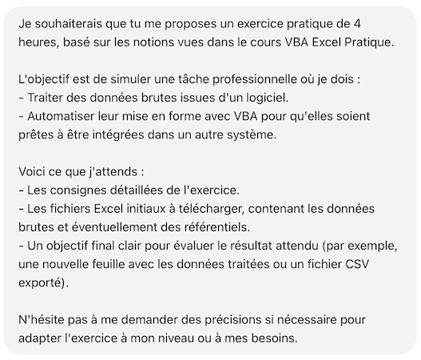



Liste des prérequis du POK ET/OU MON





Les lien utiles pour la compréhension de celui-ci.



## Découvrir VBA

### Contexte

Lors de mon précédent stage, afin d’optimiser un outil de travail sur Excel, j’ai dû créer une macro. N'ayant aucune connaissance en VBA, je l’ai réalisée en utilisant l’enregistrement automatique, ce qui complique la modification et la maintenance ultérieures.

Aussi, dans mes missions en alternance, je suis amenée à traiter un fichier Excel de données assez complexe, et je suis convaincue qu’à l’aide de macros simples, ce traitement pourrait se faire de manière beaucoup plus performante.

J’aimerais donc apprendre les bases de VBA pour être capable de créer, par exemple, une macro simple permettant de modifier l’affichage d’une page et/ou d’automatiser des tâches de mise en forme de données.

### Cours suivi

En faisant le tour des différents MON déjà existants sur le site de Do-It sur le sujet de VBA et des macros, et grâce aux retours de mes camarades sur les cours qu’ils avaient suivis, j’ai choisi de suivre le cours VBA de **Excel Pratique**, car c’est celui qui me paraissait le plus complet et le plus adapté à mon mode d’apprentissage. En plus, j’avais déjà suivi leur cours sur Excel et je savais qu’il était bien expliqué, surtout pour les débutantes comme moi en VBA.

J’ai alors suivi les 8 premiers modules de formation, en partie par manque de temps, car je voulais avoir le temps de pratiquer ce que j’avais appris, et parce que, dans un premier temps, je n’estime pas avoir besoin d’utiliser des forms. Je m’y formerai plus tard.

### Retour critique

Là où, dans mon MON 2.1, j’avais trouvé le cours d’Excel Pratique parfois un peu superficiel sur certaines notions (du moins à mon niveau), j’ai trouvé que leur cours de VBA est vraiment complet et permet aux débutantes comme moi de bien comprendre les différents concepts et de les manipuler simplement sur de petits exemples.

Je recommande donc ce cours pour les personnes comme moi, n’étant pas des pros de l’informatique, mais maîtrisant déjà bien les fondamentaux d’Excel.

## S’entraîner sur un exemple professionnalisant

### Contexte

Mon objectif pour ce MON était à la fois de découvrir les bases du VBA, mais aussi de pouvoir les appliquer à un cas simple auquel j’ai été plusieurs fois confrontée dans le monde professionnel : j’aimerais savoir automatiser des tâches afin de faciliter le traitement de certaines données sur Excel, notamment pour faire passer des données d’un logiciel à un autre.

Cependant, dans l’optique de pouvoir présenter mon travail sur le site, je ne pouvais pas le faire sur des données réelles de mon entreprise. J’ai alors choisi de demander à ChatGPT de me fournir un exercice pratique via le prompt suivant :



**Exercice : Mise en forme et traitement des données pour intégration inter-logiciels**

**Contexte :**
Vous travaillez dans une entreprise qui utilise deux logiciels différents pour gérer les ventes et les stocks. Chaque mois, vous recevez un fichier Excel brut contenant les données des ventes du mois précédent, qu'il faut préparer pour l'importer dans le logiciel de gestion des stocks.

**Objectif :**
Écrire un programme VBA pour automatiser le traitement des données brutes et produire un fichier final prêt à être importé.

**Fichiers fournis :**

- Feuille "Données Brutes"
- Feuille "Produits"

**Consignes :**

**1. Création d'un module VBA :** Créez un programme VBA pour automatiser les étapes suivantes :

- Suppression des colonnes inutiles :
Conservez uniquement les colonnes nécessaires : Date de commande, Référence Produit, Quantité.
- Validation des données :
Vérifiez que chaque "Référence Produit" existe dans la feuille "Produits".
Supprimez les lignes contenant des références produits non valides.

- Mise en forme des dates :
Convertissez toutes les dates au format JJ/MM/AAAA.
- Ajout de colonnes calculées :
Ajoutez une colonne "Catégorie" en récupérant cette information depuis la feuille "Produits".

**2. Exportation des données :** Une fois le traitement terminé :

- Créez une nouvelle feuille "Données Finales" avec les données nettoyées.
- Enregistrez cette feuille en tant que fichier CSV nommé Export_YYYYMM.csv, où YYYYMM correspond au mois et à l'année des données.

**3. Documentation :**

- Ajoutez des commentaires dans votre code pour expliquer chaque étape.
- Fournissez un résumé dans la feuille "Documentation" décrivant le fonctionnement de votre programme.


### Horodatage

| Date | Heures passées | Indications |
| -------- | --------- | --------|
| Samedi 30/11 | 0h20 | Introduction |
| Samedi 30/11 | 1h | Les feuilles et les cellules |
| Samedi 30/11 | 0h40 | Les variables |
| Samedi 30/11 | 1h | Les conditions |
| Samedi 30/11 | 1h | Les boucles |
| Samedi 30/11 | 1h | Procédures et Fonctions |
| Samedi 30/11 | 0h30 | MsgBox |
| Samedi 30/11 | 0h30 | Les événements |

### Bibliographie


[Cours VBA Excel Pratique](https://excel-pratique.com/fr/vba)

