

Pas de prérequis



## Plan d’action

### Objectifs

1. Découvrir les ERP et leur fonctionnement en s'appuyant sur l'exemple de SAP
2. Comparer les promesses d'un ERP avec la réalité d'utilisation de ses utilisateurs

### Sprint 1

- [x] Définition d'un ERP
- [x] C’est quoi SAP ?
- [x] Quelles sont ses promesses utilisateurs ?
- [x] Apprendre à réaliser un questionnaire en SHS
- [x] Préparation du questionnaire des avis d'utilisateurs de SAP dans le secteur cosmétique 

### Sprint 2

- [x] Finir la préparation du questionnaire
- [x] Faire un pré-test
- [x] Publier le questionnaire
- ~~Analyse des réponses au questionnaire~~
- [x] Partager le questionnaire aux experts
- [x] Analyser les réponses experts vs promesses

## Comprendre le sujet

### Définition d’un ERP


[un MON utile pour plus de détails sur les ERP](https://francoisbrucker.github.io/do-it/promos/2023-2024/Sarah-Sebastien/mon/temps-1.1/)


Un **ERP** (Enterprise Resource Planning), ou progiciel de gestion intégré (PGI) en français, est un système logiciel qui permet de gérer et d'intégrer les principales fonctions d'une entreprise au sein d'une seule plateforme. Il est structuré sous la forme d'un groupe de modules indépendants et constitue une base de données unique.

Les principales fonctions incluses sont généralement :

- **Gestion des approvisionnements** : achats, gestion des stocks, logistique.
- **Gestion de la production** : planification, gestion de la production, gestion de la qualité.
- **Gestion des ventes et de la relation client** : gestion des commandes, service client, CRM (Customer Relationship Management).
- **Gestion des finances** : comptabilité, gestion des coûts, budgétisation.
- **Gestion des ressources humaines** : paie, recrutement, gestion des talents.

L'objectif d'un ERP est donc de centraliser les données et les processus de l'entreprise, ce qui permet de partager l'information en temps réel entre les différentes parties prenantes, d'améliorer l'efficacité, de réduire les coûts opérationnels et d'aider à la prise de décision stratégique.

## SAP

### SAP, c'est quoi ?

L’acronyme SAP pour Systems, Applications, and Products for Data Processing se réfère à la fois à la société SAP SE et aux logiciels d’ERP SAP.

- SAP SE est une compagnie allemande créée en 1972 à Weinheim, qui conçoit et vend des logiciels, et notamment des ERP à destination des entreprises du monde entier. SAP est premier sur le marché européen et quatrième au rang mondial. L’entreprise est implantée sur tous les continents, compte plus de 68 000 employés déployés dans 188 pays, et travaille avec plus de 400 000 clients.

- SAP est aussi utilisé, par abus de langage, pour désigner le progiciel développé et vendu par la compagnie SAP SE. C’est ce que l’on appelle un ERP propriétaire.

**Timeline de l’évolution de SAP de sa création à nos jours**

- **R/1 :**
  - C’est la première version de SAP, c'est-à-dire sa version de développement.
  - Pour les plus verts d’entre nous : cette première version tournait sur des serveurs IBM et le système d'exploitation DOS.
  - Cette version était orientée essentiellement vers les fonctions de gestion des finances et de comptabilité.

- **R/2 :**
  - C'est la deuxième version, qui est une version plus opérationnelle et stable de l'ERP sur des gros systèmes.
  - Toujours pour les verts d'entre nous, on parle de la version mainframe, le logiciel est alors conditionné pour être traité sur un ordinateur central.
  - Cette version s'ouvre à plus de fonctions comme la fabrication, la chaîne d'approvisionnement et les ressources humaines.

- **R/3 :**
  - Cette version se décline en plusieurs versions, de 2.1 à 4.7, et la version SAP R/3 4.6c est l'une des plus connues.
  - Cette version est structurée sur une architecture à trois niveaux : le client, le serveur d'application et le serveur de base de données (ce qui en fait une véritable révolution pour le développement de logiciels d'ERP).
  - Elle est plus abordable et évolutive, permettant à un seul système de couvrir les activités d'une organisation à l'échelle régionale ou mondiale. 
  - Elle est également compatible avec diverses plateformes et systèmes d'exploitation, tels que Microsoft Windows.

- **ECC :**
  - Version dite ECC ou ERP Central Component (version 5.0 puis 6.0), encore utilisée en entreprise.
  - La stratégie de SAP se centre sur les PME et ETI.
  - SAP utilise maintenant une technologie appelée NetWeaver, qui repose sur un client léger, en incluant un portail web, offrant tous les avantages d'un outil accessible en ligne via le web.
  - Et pour les verts : NetWeaver est une plateforme d'intégration pour les applications SAP, intégrant une architecture de type SOA (Service-Oriented Architecture). Ainsi, SAP NetWeaver facilite l'interopérabilité avec les technologies DotNet, Java EE et WebSphere.

- **S/4HANA :**
  - C'est la toute dernière version de SAP et marque une nouvelle révolution.
  - Elle est dotée de technologies intelligentes intégrées, notamment de l'IA, du Machine Learning et d'analytique avancée.
  - Elle se base sur le "in-memory system" et l'intégration. 


Un "in-memory system" est une technologie de gestion des données qui stocke l'intégralité des données en mémoire vive (RAM) plutôt que sur des disques durs traditionnels. Cela permet un accès et un traitement des données beaucoup plus rapides, améliorant ainsi les performances des applications en temps réel, comme les bases de données, l'analyse des données, et le calcul transactionnel.


À l'heure actuelle, les versions de SAP ECC sont encore utilisables jusqu'en **2027** avec maintenance, et l'entreprise accompagne ses clients vers la transition jusqu'à SAP S/4HANA.

### Les promesses de SAP pour ses ERP

#### Les avantages de l'ERP SAP pour l’entreprise

- **Des solutions adaptées à toutes les entreprises** : Quelque soit la taille de votre entreprise, SAP propose une gamme complète d'outils et de systèmes ERP conçus pour répondre à tous les besoins spécifiques, ainsi qu'une assistance continue pour aider en cas de difficultés des utilisateurs.

- **Une expertise technologique reconnue** Avec ses 40 ans d’expertise dans le domaine du développement et du déploiement de solutions d’ERP, SAP intervient dans un large champ de secteurs d’activités. Leur expertise technologique leur permet de vendre des ERP toujours à la pointe de la technologie (comme avec SAP S/4HANA actuellement).

- **Des solutions flexibles** : De par la structuration de ses ERP, SAP promet de proposer aux entreprises des solutions adaptées à leurs besoins précis, car les entreprises peuvent trouver tous les modules nécessaires à la gestion de leur activité mais en pouvant acheter uniquement ceux dont elles ont réellement besoin. SAP promet aussi une expérience utilisateur intuitive grâce à son interface pratique.

- **Sécurité des données** : SAP promet une expertise dans la sécurisation des données stockées dans ses ERP, notamment pour les dernières versions cloud.

#### SAP pour renforcer la position des entreprises sur le marché : au-delà du simple ERP

- **Booster la croissance du chiffre d’affaires** : SAP permet de créer de nouveaux modèles économiques basés sur une gestion axée sur le service et non plus sur le produit. Et avec HANA, SAP permet de s’adapter en temps réel à des changements en fonction de l’analyse des données clients.

- **Améliorer les résultats** : Grâce à son expertise métier, SAP permet de collaborer plus efficacement mais aussi d'améliorer la marge des entreprises grâce à une optimisation des processus opérationnels.

- **Renforcer la durabilité** : SAP permet d’adapter son activité en fonction de ses diverses émissions et de son impact sur l'environnement, mais aussi de gérer de manière efficace les différentes réglementations.

- **Bénéficier d’une croissance illimitée** : Grâce à une mise à jour automatique des règles de conformité, SAP permet de s’adapter au contexte local tout en étant déployé à l’international.

## Préparation d’un questionnaire

L’objectif est de préparer un questionnaire permettant de recueillir l’avis d’un panel d’utilisateurs de SAP dans le secteur cosmétique (au minimum de l’industrie chimique) sur leur expérience en tant qu'utilisateur de SAP, afin de confronter ces résultats aux promesses faites par SAP.

### Méthodologie de réalisation du questionnaire

Afin de réaliser un questionnaire conforme aux attendus des sciences humaines et sociales (SHS) et pour que les résultats soient significatifs, j'ai décidé de lire le MON de Lola Bourdon : [Sciences sociales pour élaborer un questionnaire](https://francoisbrucker.github.io/do-it/promos/2023-2024/Lola-Bourdon/mon/temps-3.1/).

Ce document devrait me fournir les connaissances essentielles pour la création d’un questionnaire adapté à mon étude.


Étant donné le temps limité à ma disposition, j'ai décidé de suivre sa méthode en 12 étapes, tout en sachant qu'en 20 heures, je ne pourrai pas produire une enquête parfaite. Je prévois notamment d'alléger la partie pré-test.


#### Phase préparatoire

1. **Tracer les objectifs et définir l'objet :** L'objectif principal de cette enquête est de mener une étude comparative entre l'expérience réelle des utilisateurs de SAP dans le secteur cosmétique et les promesses formulées par l'entreprise SAP concernant ses solutions ERP.

2. **Circonscrire le terrain :** L'enquête se concentrera sur le marché français, tout en conservant un champ d'investigation suffisamment large pour recueillir un nombre significatif de réponses à analyser.

3. **Définir la population d'enquête :** La population ciblée comprend tous les professionnels travaillant dans le secteur cosmétique.

4. **Choisir la méthode d'enquête :** Choix d’une enquête quantitative afin de recueillir les opinions des utilisateurs sur un échantillon représentatif.

#### Construire l’échantillon


Cette notion est certainement l'une des principales limites de mon enquête, car mon échantillon ne sera pas représentatif (détails ci-dessous).


La taille d’un échantillon représentatif dépend de plusieurs facteurs :

- **Taille de la population totale :** 66 700 employés dans des entreprises de fabrication de produits cosmétiques en France (Statistica, 2021).
- **Marge d’erreur acceptée :** Classiquement entre 1 % et 5 % maximum.
- **Niveau de confiance :** Classiquement de 95 % ou 99 %.

Dans notre cas, en se positionnant sur les normes basses en termes de marge d’erreur (5 %) et de niveau de confiance (95 %), il nous faudrait un échantillon de 382 personnes, ce qui me paraît irréalisable à notre échelle d’étude.

Ainsi, l’objectif ici ne sera donc pas d’avoir un échantillon respectant ces critères mais plutôt d’avoir un échantillon le plus large possible, notamment en termes d'âge, de métiers, et de genre (bien que le domaine de la cosmétique soit majoritairement féminin), afin d’essayer d’être le plus représentatif possible avec un échantillon réduit.


La **marge d’erreur** est l'écart maximal attendu entre les résultats d'un échantillon et la valeur réelle de la population, reflétant l'incertitude des estimations statistiques. Par exemple, avec une marge d'erreur de 2 %, si 37 % de l'échantillon donne une certaine réponse, on peut estimer qu'entre 35 % (37 - 2) et 39 % (37 + 2) de la population totale auraient répondu de la même manière. Une marge d'erreur plus petite nécessite un échantillon plus grand.



Le **niveau de confiance** est la probabilité, exprimée en pourcentage, que l'intervalle calculé autour d'une estimation d'échantillon contienne la valeur réelle de la population. Par exemple, un niveau de confiance de 95 % signifie que l'on s'attend à ce que l'intervalle soit correct dans 95 % des cas.


#### Concevoir le questionnaire

L’objectif est de concevoir un questionnaire sous forme de **Google Form** à publier sur **LinkedIn** afin de toucher le plus grand nombre de personnes. Celui-ci sera structuré de la manière suivante :

- Une introduction concise pour présenter le sujet (sans influencer les réponses)
- Des questions démographiques (qui interroge-t-on ?)
- Des questions sur les comportements (que font-ils ?)
- Des questions d’opinions (que pensent-ils ?)
- Des questions de connaissances (que savent-ils ?)
- Une partie commentaire optionnelle pour recueillir des retours sur le questionnaire

#### Planifier la durée, la fréquence et les modalités d'exécution de l'enquête

En raison de la structure d’un POK, cette enquête se réalisera sur environ **10 heures** de travail de ma part entre la publication du questionnaire et l’analyse des résultats, le tout dans un délai d’environ trois semaines.

Pour ce faire, je prévois de diffuser mon questionnaire via le réseau professionnel **LinkedIn**, en le postant avec un message incitatif pour encourager mon réseau à y répondre. Mon réseau étant principalement composé d'élèves de Centrale et de personnes travaillant dans le domaine de la cosmétique (grâce à mes précédents stages), j'espère que cette seconde catégorie de répondants me permettra de recueillir un maximum de réponses dans un délai relativement court (environ 10 jours), afin de me laisser suffisamment de temps pour l'analyse.

#### Procéder à un pré-test

Avant de diffuser le questionnaire sur LinkedIn, je vais le faire tester par un échantillon de personnes afin qu'elles puissent me donner des retours et ainsi m'aider à apporter des ajustements avant sa publication. L’idéal serait de le faire tester par un groupe de 3 à 5 personnes, puis d’apporter les modifications nécessaires en fonction de leurs retours. Cette étape permet de rendre le questionnaire aussi clair et compréhensible que possible pour les répondants.

J'ai alors effectué un **pré-test avec trois utilisateurs de SAP** (encore merci à eux !). Ils ont répondu au questionnaire et m'ont fourni leurs impressions, ce qui m’a permis d’ajuster certaines questions afin d’optimiser la précision du questionnaire avant sa publication définitive.


Le **questionnaire en détail** est disponible en annexe à la fin de cette page.


## Réaliser l’enquête : publication du questionnaire

### Rédaction du post LinkedIN

Pour obtenir un maximum de réponses à un questionnaire publié sur un réseau social professionnel, il est essentiel de l'accompagner d'un message percutant afin de capter l'attention de votre réseau.
**Voici le post en question**

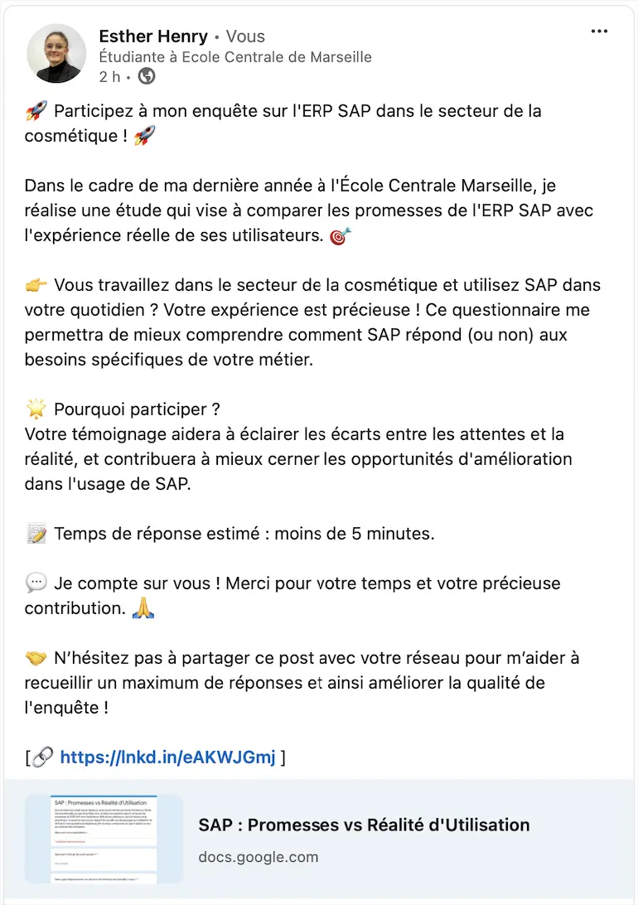

### Flop du questionnaire

Une semaine après la publication, mon questionnaire n’avait obtenu qu’**une seule réponse** malgré une relance (en ajoutant une photo au post pour le rendre plus visible), plus de **600 impressions** et environ **300 membres touchés**.

Ainsi, je n'avais que 4 réponses en prenant en compte les pré-tests, ce qui est beaucoup trop peu pour faire une analyse et en tirer quelque chose de représentatif.

J'en tire déjà la **conclusion** que diffuser un questionnaire de cette manière sur LinkedIn n'a pas été efficace et qu'il aurait fallu envisager **un autre moyen de transmettre le questionnaire** afin d'obtenir les réponses voulues.

### Rebondir

Il a donc fallu trouver un autre moyen d’obtenir une idée de la perception de SAP par ses utilisateurs en cosmétique.

Les réponses que j'avais venaient uniquement d'ingénieurs travaillant dans divers secteurs de la cosmétique, mais n'étant pas du tout des spécialistes de SAP, simplement des utilisateurs.

J'ai donc pensé qu'il pouvait être intéressant d'envoyer mon questionnaire directement à des **experts SAP dans le secteur cosmétique** afin de recueillir leurs avis et de voir si **la perception des experts diverge des promesses de SAP**.

J'ai donc envoyé personnellement mon questionnaire sur SAP à des experts SAP de mon réseau travaillant dans le secteur cosmétique, et j’ai obtenu deux réponses.

## Étude comparative : perception d’expert vs promesses de SAP


Gardons à l'esprit que **cette étude n'est pas représentative**, car elle se base sur un échantillion trop petit pour être représentatif. Par conséquent, **les conclusions ne peuvent en aucun cas être généralisées**.


### Présentation de nos experts

Notre **premier expert** est un **chef de projet SI** dans une grande entreprise du secteur cosmétique, qui utilise SAP depuis **plus de 10 ans**, et actuellement la version **SAP ECC**. À propos de son utilisation de SAP, notre premier expert répond : “**Toujours** - SAP est essentiel et utilisé pour toutes mes tâches quotidiennes.”

Notre **second expert** est un **responsable de pôle SAP** dans une grande entreprise du secteur cosmétique, qui utilise SAP depuis **plus de 10 ans**, et actuellement la version **SAP ECC**. À propos de son utilisation de SAP, notre second expert répond : “**Occasionnellement** - J'utilise SAP de temps en temps, lorsque c'est nécessaire pour certaines tâches.”

### Les bases de l’ERP

#### Base de données unique

Comme vu dans la partie “Comprendre le sujet”, on attend d’un ERP qu’il constitue une base de données unique.

Ici, le point de vue des experts diverge à ce sujet, car à la question : *Dans votre travail, êtes-vous amené à devoir chercher des données ailleurs que dans SAP ?*, l’un répond **Non** et l’autre **Oui**, en précisant à la question : *Si oui, où ?* : “Dans d'autres systèmes de reporting ou d'autres outils”.

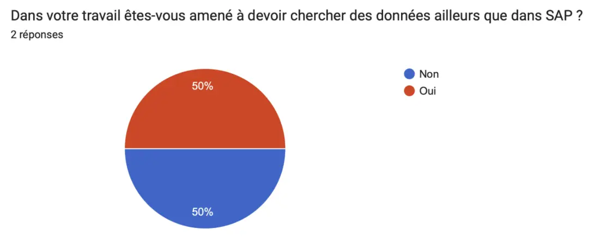

Ainsi, même si pour certains, **SAP peut constituer une base de données unique**, il semblerait que cela ne puisse **pas être une généralité** et que dans les faits, dans certaines entreprises, d’autres bases de données existent. Cela peut amener à se questionner sur la vérification des données (avoir des données qui soient uniques, utilisées et utilisables), ainsi que sur les facteurs qui amènent à utiliser d’autres outils pour stocker des données (s'agit-il des mêmes données stockées dans deux endroits différents, ou de données différentes qui ne peuvent pas être stockées dans SAP tel qu’il est dans cette organisation).

#### Interface utilisateur

Lorsque l’on s'intéresse à un logiciel SI, et donc aussi à un logiciel d’ERP comme SAP, la notion d’interface utilisateur est très importante. En effet, même avec les meilleures fonctionnalités possibles, si l’interface utilisateur est inutilisable, le logiciel le sera aussi pour le plus grand nombre. On cherche donc à s’assurer ici que l’interface de SAP est fonctionnelle, comme le promet SAP : une expérience utilisateur intuitive grâce à son interface pratique.

On mesure l’interface utilisateur grâce à la question :

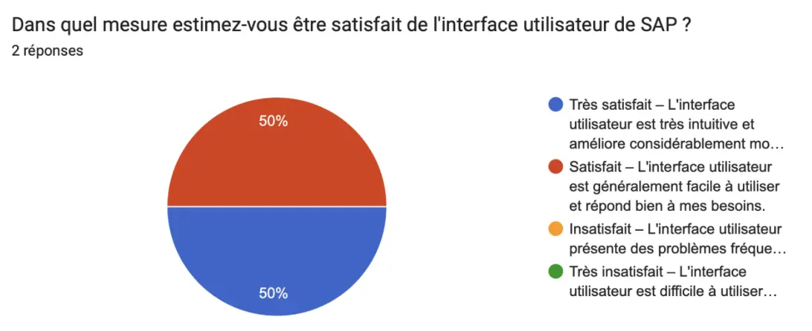

Les avis de nos experts sont **globalement satisfaits de l’interface de SAP**, on peut donc dire que l’interface utilisateur de SAP semble tout du moins être assez facilement utilisable pour une grande partie des utilisateurs, et permet donc une bonne utilisation de ce logiciel.

### Des solutions adaptées pour tous

#### Répondre à tous les besoins

Comme on l’a vu dans les promesses de SAP, celui-ci propose une gamme complète d'outils et de systèmes ERP conçus pour répondre à tous les besoins spécifiques. Dans notre questionnaire, nous avons deux approches pour répondre à cette question : une explicite en demandant directement : *Estimez-vous que SAP répond bien aux besoins spécifiques de votre métier ?* Ce à quoi nos experts répondent différemment, mais l’on peut dire qu’à minima, **SAP répond à la majorité des besoins métiers** de ceux-ci.

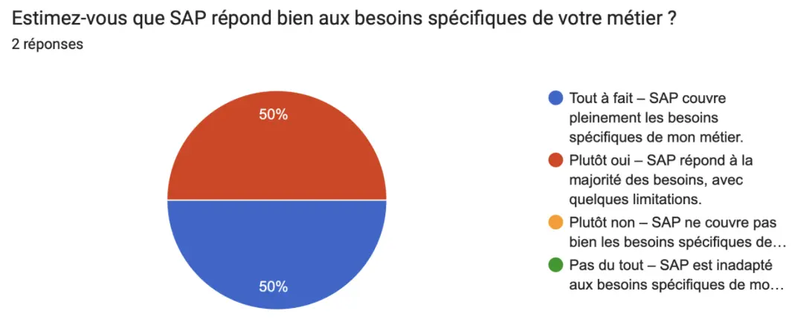

Ainsi, en interrogeant directement les experts, on voit qu’ils sont globalement satisfaits de SAP pour ce qui est de la couverture de la quasi-totalité de leurs besoins métier.

Cependant, si l’on pose directement la question des **fonctionnalités manquantes de SAP**, les deux s’accordent à dire qu’il y a des fonctions qui manquent. Pour le premier, il manque :

- Prévision des tendances
- Gestion des réclamations

Et pour le second :

- Reporting fastidieux
- Manque de souplesse dans la création de rapports inter-domaines

Ainsi, bien que SAP semble être globalement un logiciel qui s’adapte aux besoins de chacun grâce à une variété de fonctionnalités très importante, on peut tout de même s’interroger sur l'exhaustivité de celles-ci que SAP semble prôner, alors que dans les faits cela ne semble pas être le cas.

On peut aussi se demander si ces fonctionnalités existent dans d'autres versions de SAP, mais pas dans la version choisie par les entreprises. Ce sont donc des questions qui, de mon point de vue, semblent intéressantes à se poser lorsque l’on implémente un SI dans une organisation.

#### Assistance continue

Aussi, dans les promesses de SAP, on retrouve la notion d’une **assistance continue pour aider en cas de difficultés des utilisateurs**, ce que l’on a essayé d’évaluer avec la question : *Comment évalueriez-vous le support technique de SAP ?* À laquelle, la réponse de nos experts est unanimement : “**Satisfait – Le support technique est généralement efficace et répond bien aux demandes.**”

Ainsi, du point de vue des experts, qui sont plus fréquemment que les utilisateurs amenés à être en contact avec le support de SAP, celui-ci semble globalement être efficace, comme l’affirme SAP.

### Sécurité des données

Comme on l’a vu, SAP promet une expertise dans **la sécurisation des données stockées dans ses ERP**, notamment pour les dernières versions cloud. Ici, nous ne pourrons pas avoir d’avis sur les dernières versions cloud, car nos experts utilisent la version **SAP ECC**.

Pour mesurer cette dimension, nous avons demandé : **Avez-vous connaissance d'une expérience de fuite de données liée à SAP ?** Question à laquelle nos deux experts ont répondu “**Non**”. Ainsi, on ne peut pas vraiment conclure sur cette donnée, si ce n’est que, effectivement, les fuites de données via SAP ne doivent à minima pas être très fréquentes.

### Booster la croissance du CA

SAP promet aussi de booster la croissance du chiffre d'affaires des entreprises grâce à la création de nouveaux modèles économiques basés sur une gestion axée sur le service et non plus sur le produit.

Ainsi, avec la question : **“Selon vous, dans quelle mesure l'utilisation de SAP contribue-t-elle à la croissance financière de votre entreprise ?”**, l’idée était d’évaluer le ressenti des utilisateurs sur cette notion de croissance. Bien qu’on suppose qu’il n’est pas évident pour un collaborateur d’évaluer le lien entre l'utilisation de SAP et la croissance du chiffre d'affaires (sauf si c’est une donnée mesurée par des indicateurs au sein de l’entreprise, ce qui après coup aurait pu être intéressant de demander à nos experts).

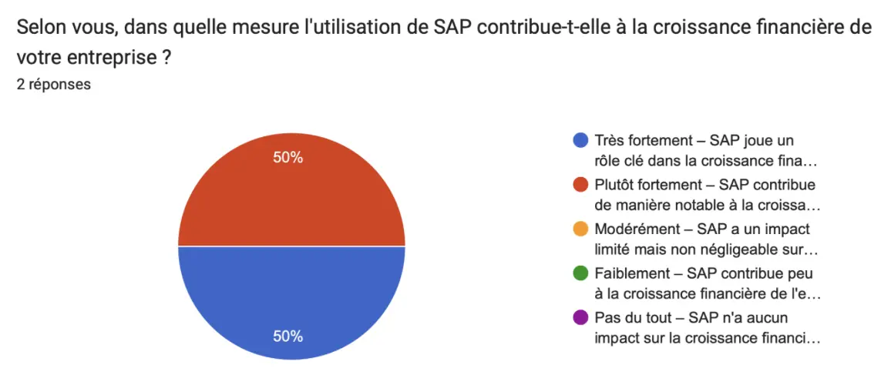

Finalement, nos experts ont globalement la sensation que tout du moins **l’utilisation de SAP a une influence bénéfique sur la croissance économique de l’entreprise**.

### Améliorer les résultats

#### Collaboration efficace

SAP nous promet aussi que grâce à son expertise métier, SAP permet de collaborer plus efficacement. C’est alors ce que nous avons voulu essayer de mesurer en demandant : **Selon vous, SAP favorise-t-il efficacement la collaboration au sein de votre organisation ?**

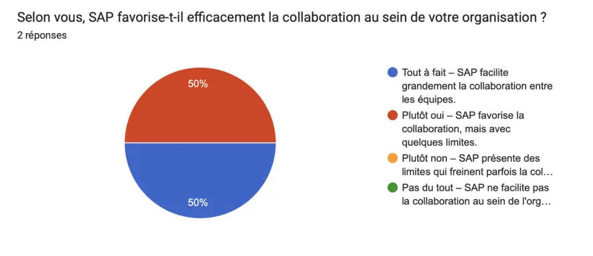

Une fois de plus, nos experts sont globalement d’accord. Il semblerait donc que **SAP ait plutôt tendance à favoriser la collaboration** au sein des équipes, même si cela comporte des limites.

#### Productivité

SAP, en tant qu'ERP, est censé, grâce à son utilisation en entreprise, permettre aux utilisateurs d’améliorer leur productivité au travail, notamment en augmentant l’efficacité de nombreuses tâches. Nous avons alors directement demandé : **“Quel est l'impact de SAP sur votre productivité au travail ?”**, afin d’obtenir directement le point de vue de l’utilisateur sur sa productivité au travail face à son utilisation de SAP.

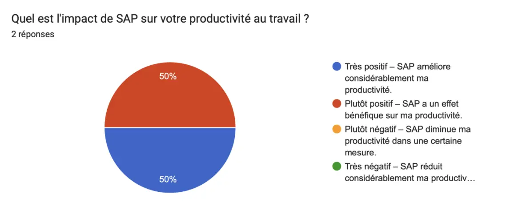

Nos experts s’accordent alors sur le fait que **SAP a plutôt tendance à avoir un effet positif sur leur productivité au travail**, ce qui est en accord avec les promesses de SAP.


On constate que nos deux experts ont globalement tendance à répondre la même chose, mais notre **premier expert** est toujours **plus tranché dans ses choix**, là où notre **second expert** va avoir tendance à être un peu **plus nuancé**.


## Apporter des nuances à l’analyse

### Les divergences entre les avis des experts et des utilisateurs

#### Les utilisateurs

Pour mieux comprendre, nous allons dans cette partie essayer de voir si la perception de SAP change entre des utilisateurs quotidiens de SAP et des experts du sujet.

Notre **groupe d’utilisateurs** est composé de quatre ingénieurs de divers secteurs (Chef de projet développement, Chef de projet packaging, Chargé d’expertise matières premières, et Process owner) de diverses entreprises françaises du secteur cosmétique.

Aucun de ces quatre utilisateurs ne connaît réellement SAP en dehors de son utilisation dans le cadre de leurs postes. En effet, d’après leurs réponses aux questions, ils n’ont ni été réellement formés, ni ne sont informés de l’évolution de SAP, contrairement à notre expert. Il est à noté que tous utilisent **SAP ECC**, comme nos experts.

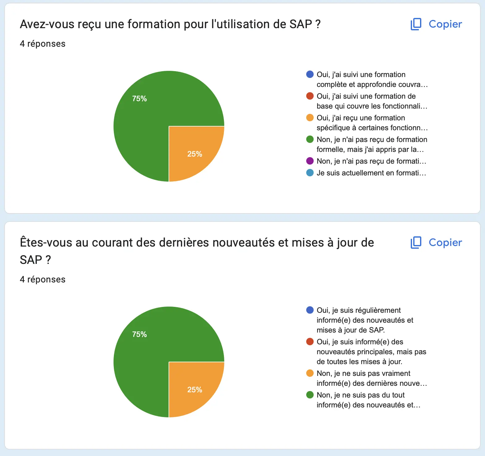

Encore une fois, notre étude ne pouvant pas être représentative tant l’échantillon est réduit, nous allons nous concentrer uniquement sur certaines questions pour lesquelles l’avis des utilisateurs diverge avec celui des experts, afin de nuancer nos conclusions précédentes.

#### Interface utilisateur

Là où **nos experts avaient tendance à trouver l’interface SAP fonctionnelle, nos utilisateurs sont plus divisés**. En effet, la moitié est satisfaite, mais on note tout de même que l’autre moitié ne l’est pas. Étant donné que tous utilisent une version assez similaire de SAP, on peut se demander si cette différence de perception de l’interface utilisateur est influencée par l'absence de formation à l’outil.

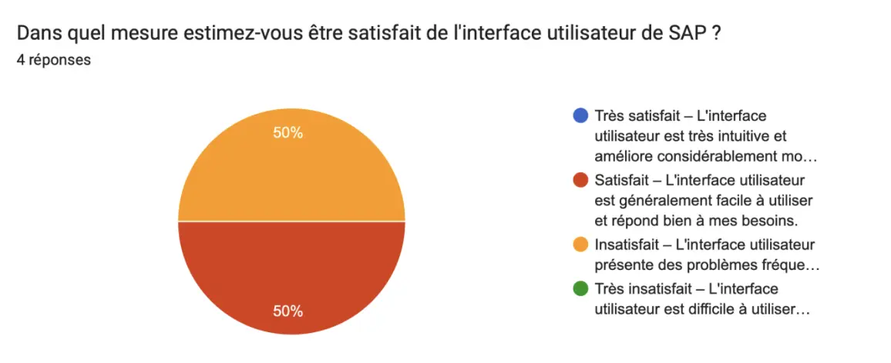

#### Assistance continue

Il est là aussi intéressant de prendre en compte l’avis de nos utilisateurs, car il semblerait que **les utilisateurs ne l'utilisent finalement pas**, là où nos experts avaient tendance à en être satisfaits et semblaient donc l’utiliser régulièrement. Cela nous amène à nous poser des questions sur la pertinence du support client. Si la majorité des utilisateurs quotidiens de SAP ne s'en servent pas, et que ce support semble être utilisé principalement par des personnes déjà considérées comme expertes du sujet, on peut se demander **s’il répond vraiment aux besoins des utilisateurs moins expérimentés**.

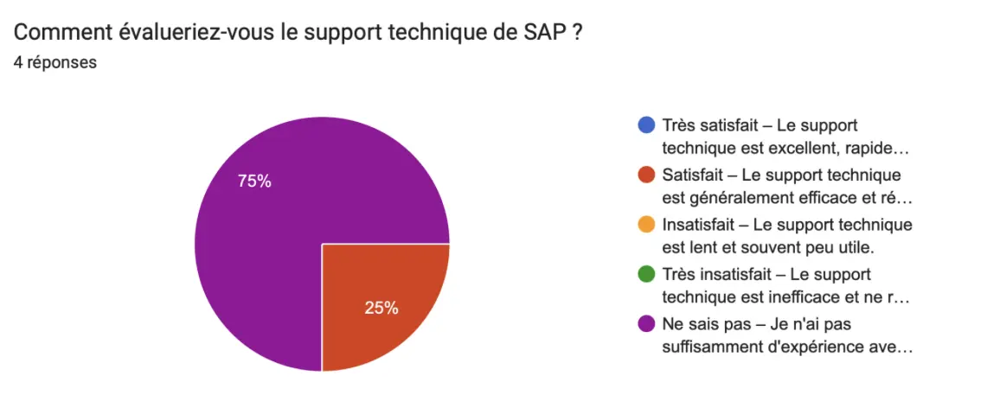

#### Collaboration efficace

Ici encore, on constate que **nos utilisateurs perçoivent SAP comme ayant un impact plutôt négatif sur la collaboration au sein de leurs équipes**, ce qui diverge de l’avis des experts. On peut alors se demander si ces limites ressenties dépendent réellement de l’utilisation de SAP ou plutôt des tâches pour lesquelles il est utilisé, ou encore de l’organisation de l’entreprise, qui diffère entre nos répondants. 

Ainsi, il pourrait être intéressant de pousser l’étude sur ce sujet, car les facteurs à prendre en compte sont sûrement multiples, et l’on sait que l’aspect collaboratif est un point essentiel lors du déploiement des systèmes d’ERP.

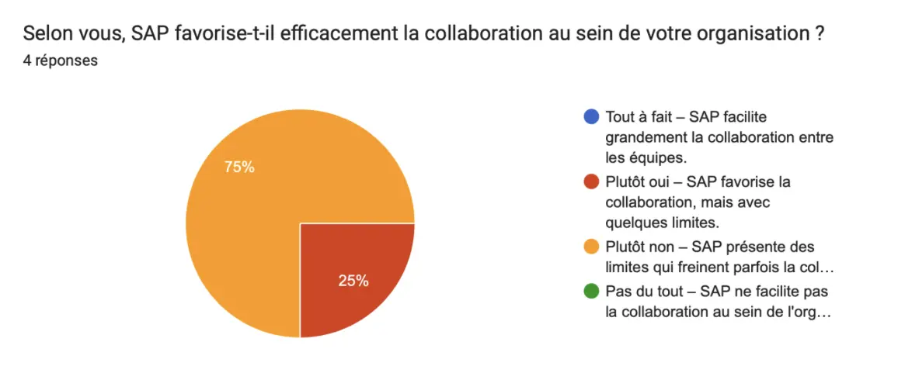

#### Booster la croissance du CA

Ici, on constate que **l’opinion de nos utilisateurs diverge au sein du groupe**. On peut alors se demander **si les utilisateurs quotidiens de SAP ont les outils pour mesurer cet impact sur la croissance du chiffre d’affaires**, alors que nos experts, de leur côté, sont sûrement plus amenés à définir des critères de réussite de leurs systèmes d’information (SI). On peut également imaginer qu’on leur demande de mesurer notamment l’impact de SAP sur la croissance du chiffre d’affaires de leur organisation.

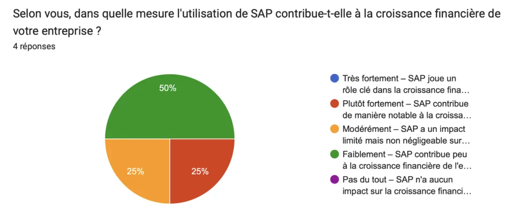

#### Productivité

Là où nos experts trouvaient que SAP avait un impact plutôt positif sur leur productivité, on constate que **les utilisateurs, eux, ont plutôt tendance à penser que l’utilisation de SAP a un impact négatif sur leur productivité**. On peut alors se demander si, dans son utilisation quotidienne et pour des tâches plus opérationnelles, SAP a vraiment un impact positif sur la productivité. Cela amène à s’interroger sur l’adaptation de l’outil aux besoins des utilisateurs, et si SAP est vraiment conçu dans une optique d’efficacité d’utilisation.

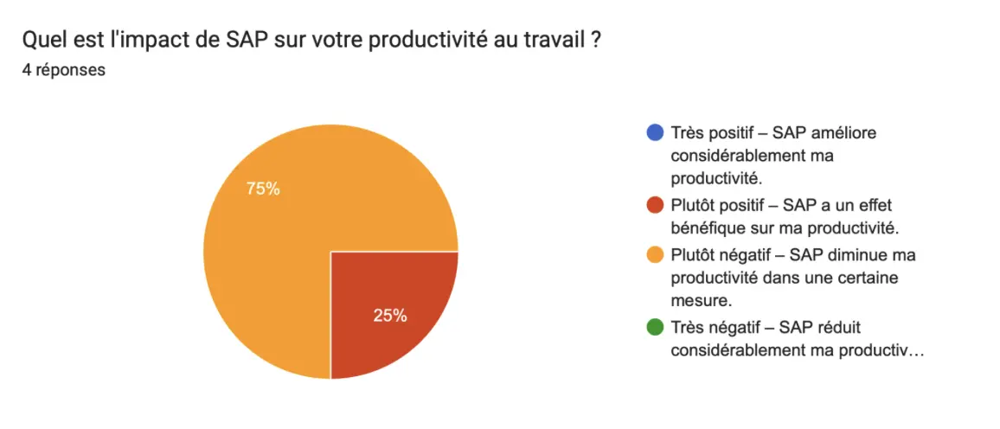

#### Interessés par SAP ?

Un autre point intéressant à relever est que, **là où nos experts disaient se tenir informés des nouveautés de SAP, on constate que les autres utilisateurs, eux, ont plutôt tendance à ne pas être informés sur le sujet**.

**Avis des experts**

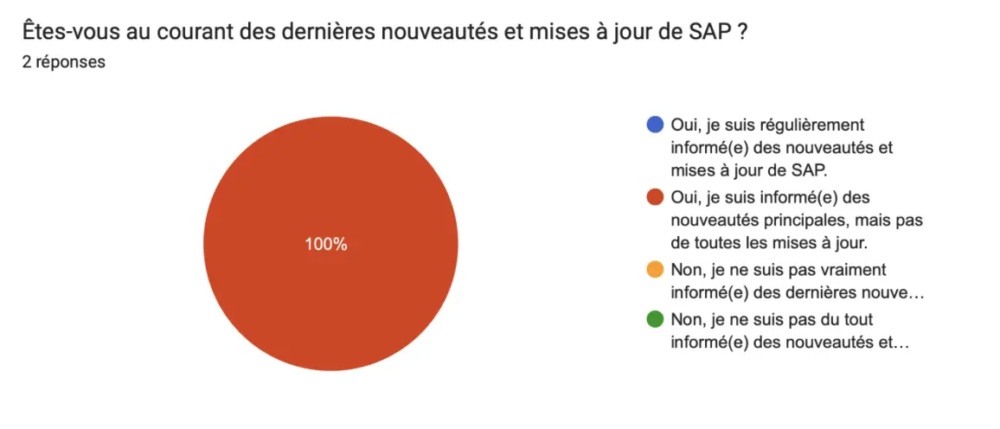

**Avis des utilisateurs**

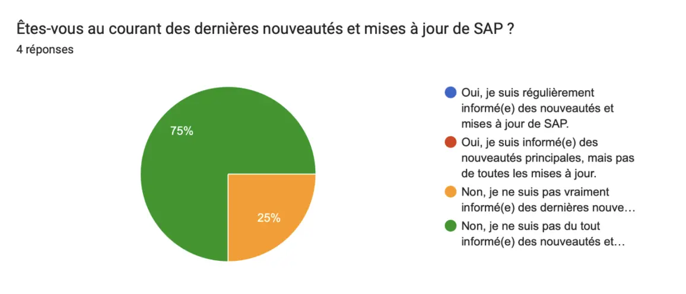

On peut alors se questionner sur l’implication entre être intéressé ou non par le fonctionnement d’un logiciel ERP et son point de vue sur celui-ci. Ainsi, il serait pertinent de se demander si l’utilisateur est objectif dans sa perception de SAP. Cela permettrait de mieux comprendre si la divergence de perception par rapport aux promesses de SAP est liée à un manque d’information ou d’intérêt pour l’outil.

### Les domaines non étudiés

#### SAP pour toutes les tailles d’entreprise

Parmi les promesses de SAP, il y a l'affirmation que **quelle que soit la taille de votre entreprise**, SAP propose une gamme complète d'outils et de systèmes ERP conçus pour répondre à tous les besoins spécifiques, notamment avec ses solutions SAP Business One et SAP Business ByDesign. 

Nous n'avons pas pu vérifier cette donnée, car tous nos répondants travaillent dans des entreprises de plus de 250 employés.

#### SAP S/4HANA

Cette technologie **S/4HANA est l’avenir de SAP**, car comme vu précédemment, dans quelques années, seule cette version de SAP sera utilisable. Il aurait donc été intéressant de pouvoir avoir l’avis d’utilisateurs sur cette nouvelle version de SAP, notamment sur la partie Cloud. En effet, les promesses de SAP pourraient être majoritairement basées sur leur technologie la plus récente.

### Conclusion de l’analyse

Cette étude révèle des **divergences notables entre les perceptions des experts et des utilisateurs vis-à-vis des promesses de SAP**. Les **experts**, mieux formés et informés sur les évolutions de l'ERP, jugent que **SAP tient en grande partie ses promesses**, notamment en termes de productivité et de collaboration. À l'inverse, les **utilisateurs** réguliers, moins informés et davantage confrontés à des tâches opérationnelles, trouvent **SAP parfois moins intuitif** et estiment qu'il n'apporte pas toujours les gains de productivité escomptés. Cette divergence soulève notamment des questions sur l’importance d’une meilleure formation et sur l’adaptation de l'outil aux besoins quotidiens des utilisateurs. 

Même si, encore une fois, cette étude n’est pas représentative, les résultats permettent de soulever des questions intéressantes, notamment sur la perception de SAP selon les profils d'utilisateurs. Cependant, il ne serait pas pertinent de tirer des conclusions globales sur l’expérience utilisateur de SAP à partir de ces données limitées. 

## Conclusion

Ce POK m’aura permis d’en apprendre plus sur les ERP, et notamment sur SAP, qui est l’un des plus utilisés dans les entreprises aujourd’hui, ce qui me sera sûrement utile dans mon parcours professionnel.

Par ailleurs, j’aurai pu prendre le temps d’apprendre en détail comment réaliser un questionnaire pour ce type d’enquête. Cela peut paraître simple à première vue, mais en réalité, cela demande de se poser beaucoup de questions sur la pertinence des questions posées par rapport aux problématiques auxquelles on souhaite répondre. Il faut aussi bien formuler les questions pour éviter toute confusion et gérer les propositions de réponses de manière à concevoir des questions fermées tout en permettant de recueillir un avis pertinent sur des notions parfois complexes.

Je suis cependant déçue de ne pas avoir obtenu plus de réponses, et donc de ne pas avoir pu pratiquer réellement l’analyse des réponses à ce type de questionnaire, car je pense que cela aurait été très formateur et utile pour la suite. Au moins, pour mes prochains projets, je saurai que partager sur LinkedIn n’implique pas réellement les gens et qu’il est plus pertinent de partager directement avec les personnes ciblées.

Je suis finalement quand même contente d’avoir pu obtenir l’avis de mes “experts”, ce qui a permis de donner un peu de relief à mon enquête, qui sans cela n’aurait vraiment pas eu de conclusion.

### Horodatage

| Date | Heures passées | Indications |
| -------- | --------- | --------|
| Samedi 07/09 | 1H | Définition d’un ERP |
| Dimanche 08/09 | 2H | C’est quoi SAP ? |
| Lundi 09/09 | 2H45 | Promesses SAP - préparation de l'enquête |
| Mardi 10/09 | 2H | Lecture du MON et début de préparation du questionnaire |
| Mercredi 11/09 | 3H | Préparation du questionnaire |
| Jeudi 12/09 | 2H | Conception du questionnaire |
| Dimanche 22/09 | 1H | Ajustement du questionnaire |
| Lundi 23/09 | 1H | Ajustement du questionnaire suite |
| Mardi 24/09 | 1H | Pré-tests |
| Lundi 30/09 | 1H | Publication du questionnaire |
| Lundi 07/10 | 0H30 | Envoie du questionnaire aux experts |
| Jeudi 10/10 | 2H | Début analyse |
| Samedi 12/10 | 3H | Fin analyse |

## Sources



- [SAP](https://www.sap.com/france/products/erp/what-is-erp.html)
- [SAP wikipédia](https://fr.wikipedia.org/wiki/SAP_(progiciel))
- [Sciences sociales pour élaborer un questionnaire](https://francoisbrucker.github.io/do-it/promos/2023-2024/Lola-Bourdon/mon/temps-3.1/)
- [Calculateur taille échantillion](https://fr.checkmarket.com/calculateur-taille-echantillon/)





Les MON utiles :

[L'ERP, du concept à son intégration en entreprise](https://francoisbrucker.github.io/do-it/promos/2023-2024/Sarah-Sebastien/mon/temps-1.1/)
[Sciences sociales pour élaborer un questionnaire](https://francoisbrucker.github.io/do-it/promos/2023-2024/Lola-Bourdon/mon/temps-3.1/).



## Annexes

Voici mon questionnaire en détail :

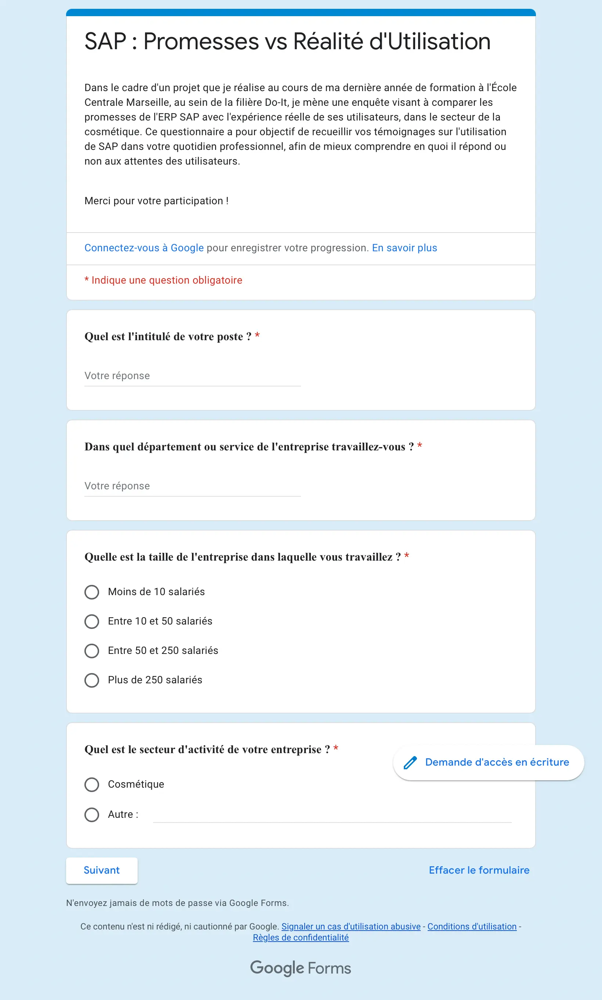
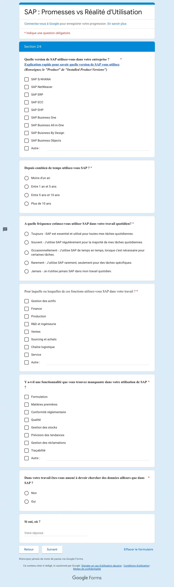
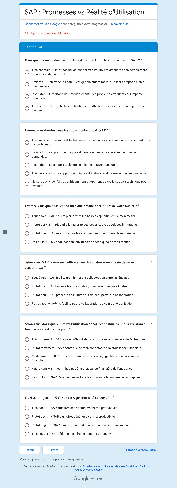
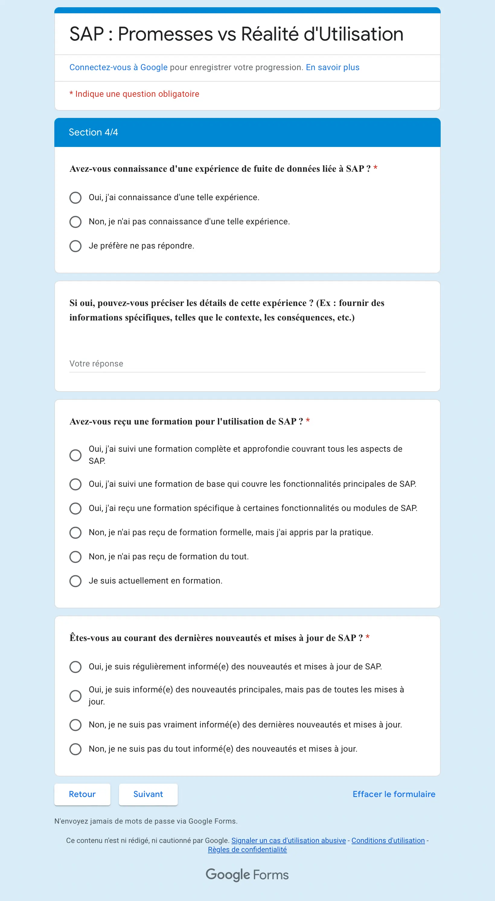
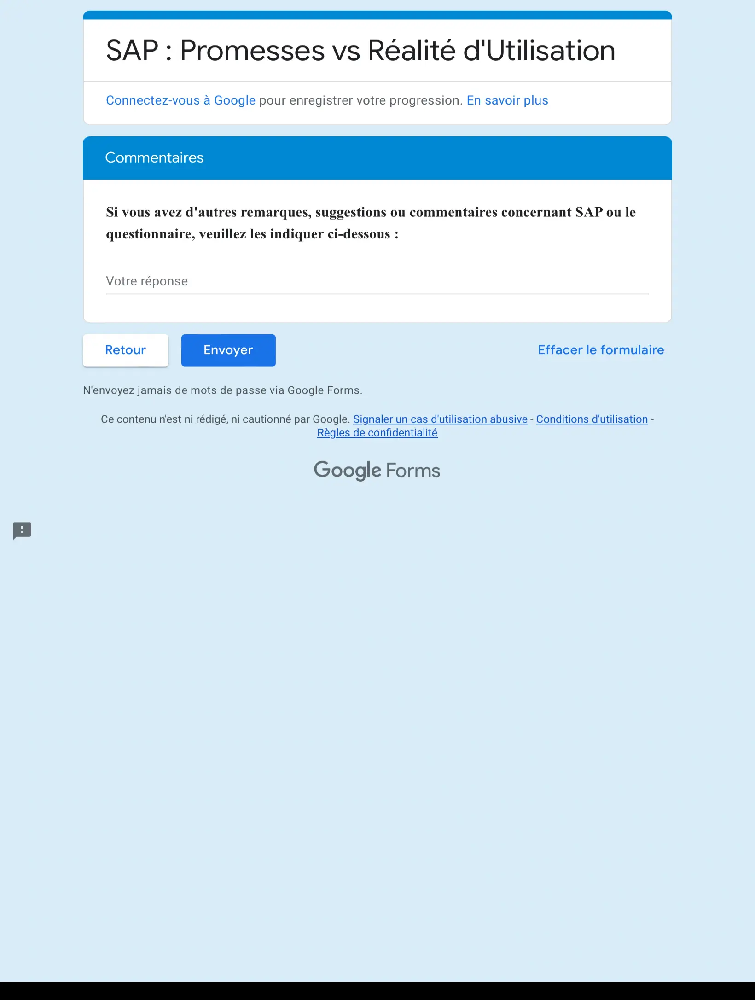
