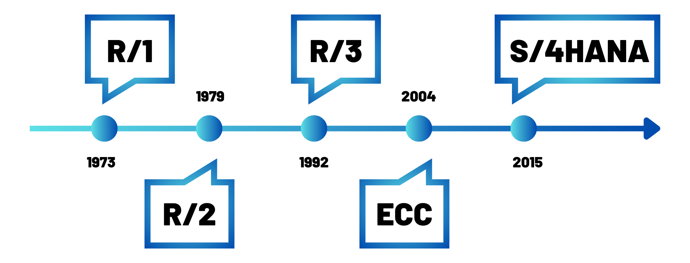


Pas de prérequis



Les liens utiles pour la compréhension de celui-ci.



Quelques phrases permettant de connaître, sans jargon ni blabla, le contenu de ce POK. On n'oubliera pas de donner :

- le niveau et les prérequis nécessaires en utilisant la balise [`prerequis`](/cs/contribuer-au-site/#prerequis)
- les autres POK & MON en rapport en utilisant la balise [`lien`](/cs/contribuer-au-site/#lien)

## Tâches

### Sprints

1. Découvrir les ERP et leur fonctionnement en s'appuyant sur l'exemple de SAP
2. Comparer les promesses d'un ERP avec la réalité d'utilisation de ses utilisateurs

#### Sprint 1

- [x] Définition d'un ERP
- [x] C’est quoi SAP ?
- [x] Quelles sont ses promesses utilisateurs ?
- [x] Apprendre à réaliser un questionnaire en SHS
- [x] Préparation du questionnaire des avis d'utilisateurs de SAP dans le secteur cosmétique 

#### Sprint 2

- [ ] ~~Recueillir d'autres avis plus généraux via un réseau social professionnel~~
- [ ] Finir la préparation du questionnaire 
- [ ] Faire un pré-test
- [ ] Publier le questionnaire
- [ ] Analyse des réponses au questionnaire
- [ ] Comparer ces résultats aux promesses de SAP

## Comprendre le sujet

### Définition d’un ERP


[un MON utile pour plus de détails sur les ERP](https://francoisbrucker.github.io/do-it/promos/2023-2024/Sarah-Sebastien/mon/temps-1.1/)


Un **ERP** (Enterprise Resource Planning), ou progiciel de gestion intégré (PGI) en français, est un système logiciel qui permet de gérer et d'intégrer les principales fonctions d'une entreprise au sein d'une seule plateforme. Il est structuré sous la forme d'un groupe de modules indépendants et constitue une base de données unique.

Les principales fonctions incluses sont généralement :

- **Gestion des approvisionnements** : achats, gestion des stocks, logistique.
- **Gestion de la production** : planification, gestion de la production, gestion de la qualité.
- **Gestion des ventes et de la relation client** : gestion des commandes, service client, CRM (Customer Relationship Management).
- **Gestion des finances** : comptabilité, gestion des coûts, budgétisation.
- **Gestion des ressources humaines** : paie, recrutement, gestion des talents.

L'objectif d'un ERP est donc de centraliser les données et les processus de l'entreprise, ce qui permet de partager l'information en temps réel entre les différentes parties prenantes, d'améliorer l'efficacité, de réduire les coûts opérationnels et d'aider à la prise de décision stratégique.

## SAP

### SAP, c'est quoi ?

L’acronyme SAP pour Systems, Applications, and Products for Data Processing se réfère à la fois à la société SAP SE et aux logiciels d’ERP SAP.

- SAP SE est une compagnie allemande créée en 1972 à Weinheim, qui conçoit et vend des logiciels, et notamment des ERP à destination des entreprises du monde entier. SAP est premier sur le marché européen et quatrième au rang mondial. L’entreprise est implantée sur tous les continents, compte plus de 68 000 employés déployés dans 188 pays, et travaille avec plus de 400 000 clients.

- SAP est aussi utilisé, par abus de langage, pour désigner le progiciel développé et vendu par la compagnie SAP SE. C’est ce que l’on appelle un ERP propriétaire.

**Timeline de l’évolution de SAP de sa création à nos jours**

- **R/1 :**
  - C’est la première version de SAP, c'est-à-dire sa version de développement.
  - Pour les plus verts d’entre nous : cette première version tournait sur des serveurs IBM et le système d'exploitation DOS.
  - Cette version était orientée essentiellement vers les fonctions de gestion des finances et de comptabilité.

- **R/2 :**
  - C'est la deuxième version, qui est une version plus opérationnelle et stable de l'ERP sur des gros systèmes.
  - Toujours pour les verts d'entre nous, on parle de la version mainframe, le logiciel est alors conditionné pour être traité sur un ordinateur central.
  - Cette version s'ouvre à plus de fonctions comme la fabrication, la chaîne d'approvisionnement et les ressources humaines.

- **R/3 :**
  - Cette version se décline en plusieurs versions, de 2.1 à 4.7, et la version SAP R/3 4.6c est l'une des plus connues.
  - Cette version est structurée sur une architecture à trois niveaux : le client, le serveur d'application et le serveur de base de données (ce qui en fait une véritable révolution pour le développement de logiciels d'ERP).
  - Elle est plus abordable et évolutive, permettant à un seul système de couvrir les activités d'une organisation à l'échelle régionale ou mondiale. 
  - Elle est également compatible avec diverses plateformes et systèmes d'exploitation, tels que Microsoft Windows.

- **ECC :**
  - Version dite ECC ou ERP Central Component (version 5.0 puis 6.0), encore utilisée en entreprise.
  - La stratégie de SAP se centre sur les PME et ETI.
  - SAP utilise maintenant une technologie appelée NetWeaver, qui repose sur un client léger, en incluant un portail web, offrant tous les avantages d'un outil accessible en ligne via le web.
  - Et pour les verts : NetWeaver est une plateforme d'intégration pour les applications SAP, intégrant une architecture de type SOA (Service-Oriented Architecture). Ainsi, SAP NetWeaver facilite l'interopérabilité avec les technologies DotNet, Java EE et WebSphere.

- **S/4HANA :**
  - C'est la toute dernière version de SAP et marque une nouvelle révolution.
  - Elle est dotée de technologies intelligentes intégrées, notamment de l'IA, du Machine Learning et d'analytique avancée.
  - Elle se base sur le "in-memory system" et l'intégration. 


Un "in-memory system" est une technologie de gestion des données qui stocke l'intégralité des données en mémoire vive (RAM) plutôt que sur des disques durs traditionnels. Cela permet un accès et un traitement des données beaucoup plus rapides, améliorant ainsi les performances des applications en temps réel, comme les bases de données, l'analyse des données, et le calcul transactionnel.


À l'heure actuelle, les versions de SAP ECC sont encore utilisables jusqu'en **2027** avec maintenance, et l'entreprise accompagne ses clients vers la transition jusqu'à SAP S/4HANA.

### Les promesses de SAP pour ses ERP

#### Les avantages de l'ERP SAP pour l’entreprise

- **Des solutions adaptées à toutes les entreprises** : Quelle que soit la taille de votre entreprise, SAP propose une gamme complète d'outils et de systèmes ERP conçus pour répondre à tous les besoins spécifiques, ainsi qu'une assistance continue pour aider en cas de difficultés des utilisateurs.

- **Une expertise technologique reconnue** Avec ses 40 ans d’expertise dans le domaine du développement et du déploiement de solutions d’ERP, SAP intervient dans un large champ de secteurs d’activités. Leur expertise technologique leur permet de vendre des ERP toujours à la pointe de la technologie (comme avec SAP S/4HANA actuellement).

- **Des solutions flexibles** : De par la structuration de ses ERP, SAP promet de proposer aux entreprises des solutions adaptées à leurs besoins précis, car les entreprises peuvent trouver tous les modules nécessaires à la gestion de leur activité mais en pouvant acheter uniquement ceux dont elles ont réellement besoin. SAP promet aussi une expérience utilisateur intuitive grâce à son interface pratique.

- **Sécurité des données** : SAP promet une expertise dans la sécurisation des données stockées dans ses ERP, notamment pour les dernières versions cloud.

#### SAP pour renforcer la position des entreprises sur le marché : au-delà du simple ERP

- **Booster la croissance du chiffre d’affaires** : SAP permet de créer de nouveaux modèles économiques basés sur une gestion axée sur le service et non plus sur le produit. Et avec HANA, SAP permet de s’adapter en temps réel à des changements en fonction de l’analyse des données clients.

- **Améliorer les résultats** : Grâce à son expertise métier, SAP permet de collaborer plus efficacement mais aussi d'améliorer la marge des entreprises grâce à une optimisation des processus opérationnels.

- **Renforcer la durabilité** : SAP permet d’adapter son activité en fonction de ses diverses émissions et de son impact sur l'environnement, mais aussi de gérer de manière efficace les différentes réglementations.

- **Bénéficier d’une croissance illimitée** : Grâce à une mise à jour automatique des règles de conformité, SAP permet de s’adapter au contexte local tout en étant déployé à l’international.

## Préparation d’un questionnaire

L’objectif est de préparer un questionnaire permettant de recueillir l’avis d’un panel d’utilisateurs de SAP dans le secteur cosmétique (au minimum de l’industrie chimique) sur leur expérience en tant qu'utilisateur de SAP, afin de confronter ces résultats aux promesses faites par SAP.

### Méthodologie de réalisation du questionnaire

Afin de réaliser un questionnaire conforme aux attendus des sciences humaines et sociales (SHS) et pour que les résultats soient significatifs, j'ai décidé de lire le MON de Lola Bourdon : [Sciences sociales pour élaborer un questionnaire](https://francoisbrucker.github.io/do-it/promos/2023-2024/Lola-Bourdon/mon/temps-3.1/).

Ce document devrait me fournir les connaissances essentielles pour la création d’un questionnaire adapté à mon étude.


Étant donné le temps limité à ma disposition, j'ai décidé de suivre sa méthode en 12 étapes, tout en sachant qu'en 20 heures, je ne pourrai pas produire une enquête parfaite. Je prévois notamment d'alléger la partie pré-test.


#### Phase préparatoire

1. **Tracer les objectifs et définir l'objet :** L'objectif principal de cette enquête est de mener une étude comparative entre l'expérience réelle des utilisateurs de SAP dans le secteur cosmétique et les promesses formulées par l'entreprise SAP concernant ses solutions ERP.

2. **Circonscrire le terrain :** L'enquête se concentrera sur le marché français, tout en conservant un champ d'investigation suffisamment large pour recueillir un nombre significatif de réponses à analyser.

3. **Définir la population d'enquête :** La population ciblée comprend tous les professionnels travaillant dans le secteur cosmétique.

4. **Choisir la méthode d'enquête :** Choix d’une enquête quantitative afin de recueillir les opinions des utilisateurs sur un échantillon représentatif.

#### Construire l’échantillon


Cette notion est certainement l'une des principales limites de mon enquête, car mon échantillon ne sera pas représentatif (détails ci-dessous).


La taille d’un échantillon représentatif dépend de plusieurs facteurs :

- **Taille de la population totale :** 66 700 employés dans des entreprises de fabrication de produits cosmétiques en France (Statistica, 2021).
- **Marge d’erreur acceptée :** Classiquement entre 1 % et 5 % maximum.
- **Niveau de confiance :** Classiquement de 95 % ou 99 %.

Dans notre cas, en se positionnant sur les normes basses en termes de marge d’erreur (5 %) et de niveau de confiance (95 %), il nous faudrait un échantillon de 382 personnes, ce qui me paraît irréalisable à notre échelle d’étude.

Ainsi, l’objectif ici ne sera donc pas d’avoir un échantillon respectant ces critères mais plutôt d’avoir un échantillon le plus large possible, notamment en termes d'âge, de métiers, et de genre (bien que le domaine de la cosmétique soit majoritairement féminin), afin d’essayer d’être le plus représentatif possible avec un échantillon réduit.


La **marge d’erreur** est l'écart maximal attendu entre les résultats d'un échantillon et la valeur réelle de la population, reflétant l'incertitude des estimations statistiques. Par exemple, avec une marge d'erreur de 2 %, si 37 % de l'échantillon donne une certaine réponse, on peut estimer qu'entre 35 % (37 - 2) et 39 % (37 + 2) de la population totale auraient répondu de la même manière. Une marge d'erreur plus petite nécessite un échantillon plus grand.



Le **niveau de confiance** est la probabilité, exprimée en pourcentage, que l'intervalle calculé autour d'une estimation d'échantillon contienne la valeur réelle de la population. Par exemple, un niveau de confiance de 95 % signifie que l'on s'attend à ce que l'intervalle soit correct dans 95 % des cas.


#### Concevoir le questionnaire

L’objectif est de concevoir un questionnaire sous forme de Google Form à publier sur LinkedIn afin de toucher le plus grand nombre de personnes. Celui-ci sera structuré de la manière suivante :

- Une introduction concise pour présenter le sujet (sans influencer les réponses)
- Des questions démographiques (qui interroge-t-on ?)
- Des questions sur les comportements (que font-ils ?)
- Des questions d’opinions (que pensent-ils ?)
- Des questions de connaissances (que savent-ils ?)
- Une partie commentaire optionnelle pour recueillir des retours sur le questionnaire

### Horodatage

| Date | Heures passées | Indications |
| -------- | --------- | --------|
| Samedi 07/09 | 1H | Définition d’un ERP |
| Dimanche 08/09 | 2H | C’est quoi SAP ? |
| Lundi 09/09 | 2H45 | Promesses SAP - préparation de l'enquête |
| Mardi 10/09 | 2H | Lecture du MON et début de préparation du questionnaire |
| Mercredi 11/09 | 3H | Préparation du questionnaire |

## Sources



- [SAP](https://www.sap.com/france/products/erp/what-is-erp.html)
- [SAP wikipédia](https://fr.wikipedia.org/wiki/SAP_(progiciel))
- [Calculateur taille échantillion](https://fr.checkmarket.com/calculateur-taille-echantillon/)

