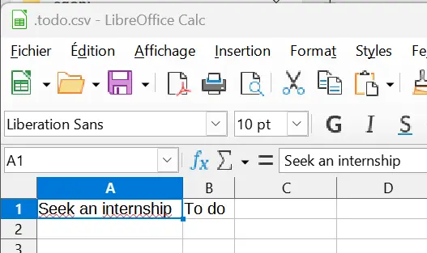



Pas de prérequis spécifique, juste de la curiosité pour le langage. 



## Introduction
Le *Go*, ou *Golang*, est un langage de programmation open source créé par Google en 2009. Il se revendique simple d'utilisation avec une rapidité et efficacité d'exécution. Il est multi-platformes et a permis le développement d'outils pour le Cloud (Docker, Kubernetes), d'outils CLI (Terraform) ou pour le développement de jeux vidéos (Ebitengine).

## Table des matières

- [Introduction](#introduction)
- [Table des matières](#table-des-matières)
- [Installation de Go sur son ordinateur ](#installation-de-go-sur-son-ordinateur-)
- [Faire sa propre application CLI (Command Line Interface) ](#faire-sa-propre-application-cli-command-line-interface-)
- [Notions basiques du langage Go ](#notions-basiques-du-langage-go-)
  - [Les variables ](#les-variables-)
  - [Arrays ou slices ](#arrays-ou-slices-)
  - [Les déclarations ](#les-déclarations-)
  - [Les pointeurs ](#les-pointeurs-)
  - [Structures et interfaces ](#structures-et-interfaces-)
  - [Goroutines et channels ](#goroutines-et-channels-)
- [Petite application CLI pour gérer sa todo list ](#petite-application-cli-pour-gérer-sa-todo-list-)
- [Petit exemple de mise en place d'un protocole HTTP avec Go ](#petit-exemple-de-mise-en-place-dun-protocole-http-avec-go-)
- [Ressources](#ressources)

## Installation de Go sur son ordinateur <a id="#installation-de-go-sur-son-ordinateur-"></a>
Pour installer Go sur son ordinateur, on télécharge le [fichier d'installation de Go](https://go.dev/dl/) selon son système d'exploitation.
Si on n'a pas d'IDE, on télécharge VSCode et on installe l'extension Go pour VScode.

Pour faire notre première utilisation de Go, on va faire un affichage classique de `Hello world !` sur notre terminal !
On crée un fichier *main.go* dans lequel on écrit :
```
package main

import (
  "fmt"
)

func main() {
  fmt.Println("Hello world ! ")
}
```
On exécute le fichier dans le Powershell (à l'emplacement du fichier) en tapant la commande
```
go run main.go
```
Et normalement on peut observer un `Hello world !` dans notre terminal, bravo !

   
## Faire sa propre application CLI (Command Line Interface) <a id="#faire-sa-propre-application-cli-command-line-interface-"></a>
J'ai voulu me familiariser avec le langage en suivant un [tutoriel](https://spf13.com/presentation/building-an-awesome-cli-app-in-go-oscon/) pour faire ma propre application à interface ligne de commandes. 

Pour créer cette interface de manière plutôt simple, on télécharge [Cobra](https://github.com/spf13/cobra/blob/main/README.md) en exécutant les lignes de commandes :
```
go mod init name-project
go get github.com/spf13/cobra@latest
go install github.com/spf13/cobra-cli@latest
```
Cela nous permet d'installer Cobra ainsi que Cobra-CLI pour notre projet. Ce sont des librairies qui permettent de créer facilement des applications CLI en Go. Pour initialiser l'appli on lance : 
```
cobra-cli init
go build
```

Notre projet a l'architecture suivante : 
```
└── /cmd
	├── root.go
└── name-project.exe
└── go.mod
└── go.sum
└── main.go
```
Dans le dossier /cmd, il y aura tous les fichiers relatifs aux commandes que l'on souhaite créer.
Pour créer une nouvelle commande au nom new-cmd, on lance 
```
cobra-cli add new-cmd
```
Et sur notre terminal doit s'afficher "new-cmd created at chemin\du\projet". 
Pour appeler cette commande, on lance sur le terminal à l'emplacement du projet : 
```
.\name-project.exe new-cmd
``` 
On aura alors écrit sur le terminal : "new-cmd called".

Pour pouvoir customiser nos commandes, il est mieux de faire un tour des bases du langage Go avant de se lancer.

## Notions basiques du langage Go <a id="#notions-basiques-du-langage-go"></a>

### Les variables <a id="#les-variables-"></a>

Pour déclarer une variable en Go, on utilise `var`. Les types de variables sont les booléens `bool`, les entiers `int`, les `bytes` (qui sont des uint8), les `runes` (qui sont des int32 et qui représentent les caractères), les `strings` qui sont des slices de bytes qu'on peut uniquement lire, les flottants `float` et les complexes. 
On peut utiliser la syntaxe `:=` pour déclarer et initier une variable.

### Arrays ou slices <a id="#arrays-ou-slices"></a>

Un `array` est de longueur fixe, avec un seul type et qu'on parcourt avec les indexs. `[n]T` est un array de n valeurs de type T mais en Go on utilise plus souvent une structure de données qui s'appelle "slice". 
Un slice est une version avec longueur variable d'un array. On peut les initier seulement avec leur type, par exemple `[]string` est une slice vide de longueur 0 de chaîne de caractères. On utilise la fonction make pour initier une slice vide de longueur non-nulle. `c:=make([]int, 3, capacity)` est une slice d'entiers de longueur 3. La capacity est la capacité d'int que pourrait contenir c, cela augmente les performances de mémoire.

### Les déclarations <a id="#les-declarations"></a>

En Go, il y a seulement un opérateur boucle : la boucle *`for`*, qui a la syntaxe suivante : 
```
for i := 0; i < 10; i++ {
  sum += i
}
```
Remarque : il n'y a pas de parenthèses après le for contrairement au C, JavaScript ou Java. 
Les déclarations *`if`* et *`else`* ont la syntaxe suivante : 
```
if 7%2 == 0 {
    fmt.Println("7 est pair")
} else {
    fmt.Println("7 est impair")
}
```
On peut utiliser la déclaration *`switch/case`* comme en C, C++, JavaScript... La seule différence c'est qu'on n'a pas à déclarer de break entre chaque cas car Go le fait automatiquement.

### Les pointeurs <a id="#les-pointeurs"></a>

Go a des pointeurs comme en C++, C... Ils stockent l'adresse mémoire d'une valeur mais peuvent aussi être nuls (nil). On les initie comme ceci, avec une astérisque : 
```
var p *int32 = new(int32)
```
`*p` déréférence le pointeur et est la valeur vers laquelle le pointeur pointe.
`&v` est l'adresse mémoire de la variable v.

### Structures et interfaces <a id="structures-et-interfaces"></a>
En Go, on peut créer des structures personnalisées, une structure est une collection de champs. Par exemple : 
```
type Vector struct {
    X int
    Y int
}
```
est la structure d'un vecteur.
Go n'a pas de classes mais on peut créer des méthodes relatives à des types.  
Par exemple : 
```
func (r rect) perim() int {
    return 2*r.width + 2*r.height
}
```
est une méthode associée à la structure rect qui représente un rectangle d'hauteur height et de largeur width.
Une interface est une collection de méthodes. 
Par exemple :
```
type geometrie interface {
    aire() float64
    perim() float64
}
```
L'interface géométrie contient les méthodes qui permettent de calculer l'aire et le périmètre. La méthode aire peut être déclarée pour plusieurs types : on peut avoir une `aire()` pour les rectangle et une autre fonction `aire()` pour les cercles.

### Goroutines et channels <a id="goroutines-et-channels"></a>
Une *goroutine* permet de lancer plusieurs fonctions en même temps et de les exécuter de manière concurrente. Attention, l'exécution concurrente n'est pas la même chose qu'une exécution parallèle. Un seul CPU gère les tâches de manière concurrente dans l'exécution concurrente tandis que deux CPUs gèrent les tâches en parallèle dans l'execution parallèle. Une goroutine est la plus petite unité d'exécution en Golang. 

Il est important d'utiliser les méthodes `lock()` et `unlock()` pour préserver les données lors de l'appel de plusieurs fonctions qui vont accéder à ces données, pour éviter qu'elles n'y accèdent en même temps. 

Pour créer une goroutine, on ajoute le mot `go` devant l'appel de la fonction qu'on souhaite lancer en concurrence.

par exemple : 
```
package main
 
import (
    "fmt"
    "time"
)
 
func f() {
    time.Sleep(10 * time.Millisecond)
    fmt.Print("Hello")
}
 
func main() {
    go f()
    f()
}
```
La fonction `Sleep()` permet à la goroutine d'avoir le temps de finir de s'exécuter. 
On peut utiliser des goroutines lorsqu'on fait plusieurs requêtes API différentes, lorsqu'on lit un fichier SQL et qu'on souhaite mettre les données dans des tableurs...

Les canaux (*channels*) sont un moyen utilisé par les goroutines pour communiquer de manière efficace.
Ils gardent des données, sont thread-safe et on peut "écouter" les données qui arrivent sur ce canal. Un canal (channel) dépend du type de données qu'il contient, on ne peut pas envoyer une chaîne de caractères sur un canal d'entiers. 
```
var c = make(chan int)
```
Pour envoyer et recevoir des données, on utilise l'opérateur channel qui est `<-`
```
c <- 3 // On envoie l'entier 3 sur le canal c
v := <-c // On reçoit et stocke l'entier 3 dans la variable v
```
Un canal non initialisé est `nil` :
```
var ch chan int
```
Après avoir envoyé les données, on peut fermer le canal avec la fonction `close()`.


## Petite application CLI pour gérer sa todo list <a id="#petite-application-cli-pour-gérer-sa-todo-list"></a>
Après ce petit tour des fondamentaux du langage Go, on peut s'attaquer à un mini-projet pour mettre en pratique la théorie. J'ai regardé des idées de projets en Go faciles à mettre en place et l'une des idées qui est revenue était la création d'une application CLI de todo lists.
J'ai ainsi créé une commande `add`, une commande `init` et une commande `list`.

* La commande `init` permet d'initier le fichier *todo.csv* dans le dossier Utilisateur
* La commande `add` doit permettre d'ajouter une tâche au fichier *todo.csv* 
* La commande `list` doit permettre de lister les tâches qui se trouvent dans le fichier *todo.csv*

Pour cette application, j'ai installé les packages suivants : `encoding/csv` pour la gestion du fichier csv (création, écriture et lecture), `os` pour la gestion des fichiers dans le système d'exploitation, `log` pour garder des logs des erreurs et `path/filepath` pour la gestion des chemins d'accès au fichier.  

Dans le fichier *add.go*, j'ai créé une structure qui s'appelle Task représentant la tâche avec son contenu et sa catégorie. La fonction principale sert à écrire les données relatives à la tâche dans le fichier *todo.csv*.
```
package cmd

import (
	"encoding/csv"
	"fmt"
	"log"
	"os"
	"path/filepath"

	"github.com/spf13/cobra"
)

// Fonction principale
func AppendToCSV(filename string, data []Task) error {
  //On ouvre le fichier csv
	file, err := os.OpenFile(filename, os.O_APPEND|os.O_WRONLY, 0644)
	if err != nil {
		return err
	}
	defer file.Close()

  //On crée une instance qui va écrire dans le fichier
	writer := csv.NewWriter(file)
	defer writer.Flush()

	for _, task := range data {
    // Le writer va écrire les données sous forme de chaînes de caractères dans le csv et renvoie une erreur si il y en a une lors de l'écriture dans le fichier
		if err := writer.Write([]string{task.Content, task.Category}); err != nil {
			return err
		}
	}
  // on retourne 0, pas besoin de retourner une variable
	return nil
}

//Création de la structure de la tâche
type Task struct {
	Content  string
	Category string
}

// la commande Cobra add va appeler la fonction appendToCsv 
var addCmd = &cobra.Command{
	Use:   "add",
	Short: "Add a task to the todo.csv file",
	Long: `Add a task to the todo.csv file that is located in the home directory`,
	Run: func(cmd *cobra.Command, args []string) {
    // Dans le terminal va s'afficher "add called"
		fmt.Println("add called")
    // On va chercher le fichier todo.csv qui est dans la Maison (si il y a une erreur, elle se retrouvera dans les logs)
		homeDir, err1 := os.UserHomeDir()
		if err1 != nil {
			log.Fatal(err1)
		}
		filepath := filepath.Join(homeDir, ".todo.csv")
    // On crée une liste de tâches avec les arguments que l'utilisateur a écrit dans le terminal
		tasks := []Task{
			{Content: contentFlag, Category: catFlag},
		}
    // On appelle la fonction AppendToCSV avec pour arguments le chemin d'accès du todo.csv et la liste des tâches que l'utilisateur souhaite ajouter au fichier
		err := AppendToCSV(filepath, tasks)
		if err != nil {
			log.Fatal(err)
		}
	},
}
// On crée les flags relatifs au contenu et à la catégorie de la tâche
var (
	contentFlag string
  catFlag string
)

// On initialise la commande
func init() {
  //On ajoute la commande au fichier root.go qui répertorie toutes les commandes du projet grâce à Cobra-CLI
	rootCmd.AddCommand(addCmd)
  //On définit les flags de la commande add
	addCmd.Flags().StringVarP(&contentFlag, "content", "", "", "The content of the new task")
	addCmd.Flags().StringVarP(&catFlag, "category", "c", "", "The category of new task")
}
```
Ainsi, lorsqu'on écrit et lance sur le terminal la ligne `.\name-project.exe add -content "Seek an internship" -category "To do"`, normalement, le fichier *todo.csv* est mis à jour avec une nouvelle ligne contenant "Seek an internship, To do" !


Si vous êtes intéressés, je vous conseille de jeter un coup d'oeil au github de [Gtodo](https://github.com/heybran/gtodo) de heybran qui a un projet similaire complet. Le point positif de son projet, c'est qu'il n'a pas utilisé Cobra donc la structure du code est probablement plus intuitive. Il manipule des JSON et pas des CSV également donc les packages à installer seront différents mais son ReadMe.md est assez clair. 

## Petit exemple de mise en place d'un protocole HTTP avec Go <a id="#petit-exemple-de-mise-en-place-dun-protocole-http-avec-go"></a>

Petit exemple pour créer un serveur web avec un protocole HTTP. On importe le package `net/http` en lançant dans le terminal de VSCode : 
```
go install net/http
```
Dans un fichier *main.go*, on importe ce package ainsi que le package `fmt` qui servira à print.
```
import (
  "fmt",
  "net/http"
)
```

On va créer un gestionnaire de requêtes, cela peut être une fonction basique qui écrit une réponse au client HTTP. HandleHello est un gestionnaire de requêtes qui a deux paramètres : `w http.ResponseWriter` et `r *http.Request`. `http.ResponseWriter` est utilisé pour écrire la réponse au client et `*http.Request` contient toutes les informations à propos de la requête.
```
func handleHello(w http.ResponseWriter, r *http.Request) {
    fmt.Fprintf(w, "<html><body><h1>Hello, World!</h1></body></html>")
}
```

On utilise la fonction HandleFunc suivante : 
```
http.HandleFunc("/hello", handleHello)
```
La fonction http.HandleFunc accepte deux arguments : le premier est le chemin URL de la requête et le second est la fonction qui va traiter la requête.

Lorsque l'on va faire une requête `http://localhost/hello` à ce serveur, le serveur va nous renvoyer une page html avec marqué "Hello, World!". 

Pour répondre à quelconque client HTTP, le serveur doit écouter les requêtes entrantes sur un port. 
```
http.ListenAndServe(":80", nil)
```
Cette ligne de code va démarrer le serveur HTTP et écouter les connexions entrantes sur le port 80. 

On lance cette commande à l'emplacement du fichier :
```
go run main.go
```
Enfin, vous pouvez aller sur http://localhost/hello et voir comment le serveur gère votre requête ! 

Pour aller plus loin, on pourrait créer une méthode qui différencie les requêtes GET des requêtes POST. On pourrait inclure une ou des variables dans l'URL de la requête avec une route dynamique. 

## Ressources

- Pour toutes les questions générales ou précises relevant du langage Go, je conseille d'aller lire la documentation officielle qui est assez fournie : [Documentation officielle Go](https://go.dev/docs)
- Le site officiel de Golang propose un tutoriel pour se familiariser au langage, je me suis servie de ce tutoriel pour faire ce MON et vous résumer les principaux axes de ce langage : [Tour de Go](https://go.dev/tour/welcome/1)
- J'ai suivi un tutoriel vidéo qui retrace en 1h les bases du Go, je conseille cette vidéo : [Learn GO Fast: Full Tutorial d'Alex Mux](https://www.youtube.com/watch?v=8uiZC0l4Ajw&ab_channel=AlexMux)
- Le [POK](https://francoisbrucker.github.io/do-it/promos/2022-2023/Adelain-thibault/pok/Go/) de Thibault Adelain 
- [The Go Playground](https://go.dev/play/) permet de lancer un programme dans une sandbox, les templates de programmes vont du classique "Hello, World!" à l'envoi de requêtes sur un serveur en passant par une fonction de test... 
- [Golang Web Server](https://www.golinuxcloud.com/golang-web-server/) pour apprendre le protocole HTTP avec Go


