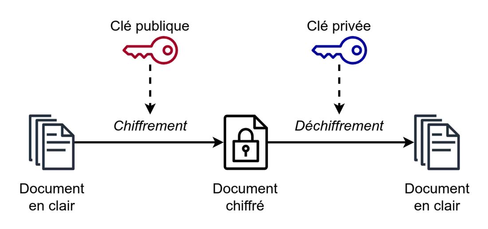
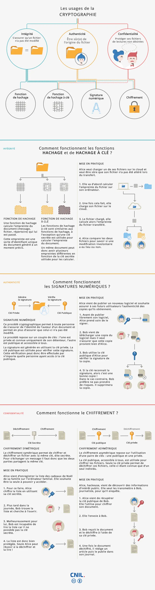
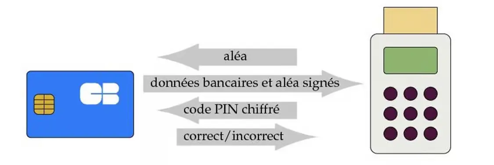



Pas de prérequis, seulement de la curiosité pour la cybersécurité.


Le but de ce MON 1.2 est d'apprendre les bases de la cryptologie, en continuité du [MON d'Arthur Louradou](https://francoisbrucker.github.io/do-it/promos/2023-2024/Louradou-Arthur/mon/temps-1.2/). Lors de mon stage de césure j'ai dû m'initier à la cryptographie pour protéger les communications intralogicielles avec le hachage des messages. Je me suis basée pour ce MON sur deux livres empruntés au CDI : [La fracture cryptologique de Serge Vaudenay](https://catalogue.univ-amu.fr/cgi-bin/koha/opac-detail.pl?biblionumber=760022) et [La cryptologie, l'art des codes secrets de Phillipe Guillot](https://catalogue.univ-amu.fr/cgi-bin/koha/opac-detail.pl?biblionumber=833921)

## Introduction

Ce MON est une vue d'ensemble des deux domaines composants la cryptologie : la cryptographie et la cryptanalyse. Étymologiquement, la cryptologie est la science (λόγος) du secret (κρυπτός) ! La cryptographie est la discipline du chiffrement de messages, respectant les principes d'intégrité, confidentialité et authentification tandis que la cryptanalyse est l'ensemble des attaques pour déchiffrer les messages interceptés. 

## Cryptographie

### Principe de Kerckhoffs
En 1883, Auguste Kerckhoffs publie l'article "La cryptographie militaire" dans lequel il énonce plusieurs principes dont celui qui se fait appeler LE principe de Keerckhoffs : 
"Il faut que le système de chiffrement n'exige pas le secret et qu'il puisse sans inconvénient tomber entre les mains de l'ennemi."

### Cryptographie symétrique/à clé privée

Un système de chiffrement à clé privée est composé de trois algorithmes : le générateur de clé, l'algorithme qui chiffre le message à l'aide de la clé générée et l'algorithme qui le déchiffe à l'aide de cette même clé. Il y a deux grandes familles de procédés de chiffrement symétrique :

#### Le chiffrement à flot
Le chiffrement à flot, en anglais appelé _stream cipher_, consiste à combiner chaque symbole du message avec un symbole d'une séquence pseudo-aléatoire. Cette séquence désordonnée est reproduite à l'identique par l'émetteur et le destinataire. Le message en clair est une suite de symboles binaires transmis 1 à 1, chaque symbole est additionné modulo 2 avec un terme de la suite aléatoire de symboles binaires. 

Par exemple :
- Message         : m = 00110001 
- Suite aléatoire : k = 11010111 
- Cryptogramme    : c = 11100110

#### Le chiffrement par blocs
Avec le chiffrement par blocs, le message est divisé en blocs de même taille et une transformation dépendante de la clé est appliquée sur chaque bloc afin d'avoir un seul bloc de cryptogramme à la fin du chiffrement. La transformation inverse est appliquée pour le déchiffrement.
Le chiffrement par blocs comprend une fonction de transformation simple opérée sur un bloc et un générateur de sous-clés à partir de la clé, ces sous-clés servent de paramètres pour la transformation. 

L'algorithme de chiffrement DES (Data Encryption Standard) est un algorithme basé sur du chiffrement par blocs. Il a été remplacé par du triple DES à cause de la taille initiale de la clé devenue insuffisante (56 symboles binaires => 112 symboles binaires avec triple DES). L'algorithme AES (Advanced Encryption Standard) est devenu le standard avec une clé à 128 symboles binaires. 

### Cryptographie assymétrique/à clé publique

L'émetteur peut calculer le cryptogramme d'un message donné mais pour inverser le calcul il faut disposer de la clé privée. La cryptographie à clé publique est utilisée pour résoudre les problèmes d'[authentification](https://francoisbrucker.github.io/cours_informatique/cours/syst%C3%A8me-et-r%C3%A9seau/cryptographie/authentification/).

#### Factorisation grand entier
Le chiffrement de Rabin utilise la factorisation d'un grand entier. La clé privée est un couple d'entiers premiers p et q tandis que la clé publique est n le produit de p et q. p et q doivent être choisis suffisamment grands. Le message est élevé au carré modulo n et le déchiffrement est une racine carrée du cryptogramme modulo p et q.

Le [code RSA](https://francoisbrucker.github.io/cours_informatique/cours/syst%C3%A8me-et-r%C3%A9seau/cryptographie/authentification/RSA/) suit le même principe, mais n est associé à un exposant e public. 
La clé publique est donc le résultat d'une fonction (à sens unique) appliquée sur la clé privée.

#### Courbes elliptiques
Une courbe elliptique est une courbe $$`y^2=x^3+ax+b`$$. a et b sont ici des entiers modulo un grand nombre entier. Ce type de courbe est utilisée en cryptographie grâce à l'existence d'une façon de composer 2 points pour en obtenir un troisième : trois points alignés sur la courbe ont une somme nulle. Les courhes elliptiques remplacent les nombres entiers dans de multiples procédés cryptographiques !

### Hachage
La fonction de hachage transforme un fichier en un nombre de taille fixe. Elle permet de signer un document. Le hachage peut aussi servir à fabriquer des clés cryptographiques à partir d'une _semence_, c'est-à-dire une clé de base. Le hash produit une "empreinte digitale" du document, qui se veut unique : pas de collisions ! Les fonctions de hashage MD5 et SHA-1 sont standardisées, pourtant en 2004 une chercheuse nommée Xiaoyun Wang a mis en lumière une collision sur MD5, ce qui a rendu la fonction de hachage obsolète. 

Infographie de la [CNIL](https://www.cnil.fr/fr/cybersecurite/comprendre-les-grands-principes-de-la-cryptologie-et-du-chiffrement) sur la cryptographie

## Cryptanalyse
La cryptanalyse est l'attaque d'un tiers d'un procédé de cryptographie dans le but de retrouver le sens caché d'un message ou de trouver des failles dans le procédé et de les exploiter.

### Loi de Moore

Le progrès des performances des calculs des ordinateurs est décrit empiriquement par la loi de Moore. Cette loi énoncée en 1965 stipule que la vitesse des machines double à chaque génération (tous les 18 mois). Aujourd'hui, les hackers injectent des vers dans des machines infectées qui peuvent effectuées une tâche au service des hackers. Ces machines peuvent par exemple effectuer des recherches sur une clé secrète de 60 bits.

### Cryptanalyse des chiffrements modernes

Les attaques se classent selon l'information à laquelle le cryptanalyste a accès.

#### Attaque à clair connu 
Le cryptanalyste a un certain nombre de paires de messages en clair et leur cryptogramme correspondant. Cette attaque était fréquente pendant la Seconde Guerre Mondiale : les Alliés récupéraient des formulaires que les autorités allemandes envoyaient à leur marine, sachant que c'était toujours le même formulaire. 

#### Attaque à clair choisi
L'adversaire choisit les messages en clair. Ce type d'attaque a lieu si il y a un espion dans le camp ennemi par exemple. 

#### Attaque à cryptogramme choisi
L'adversaire a un dispositif (oracle de déchiffrement) qui lui permet d'avoir le message en clair du cryptogramme de son choix. 

L'attaque la plus basique pour tout ces types d'informations est l'[attaque par force brute](https://www.cnil.fr/fr/definition/force-brute-attaque-informatique) ou l'attaque exhaustive. Toutes les clés possibles de l'algorithme de chiffrement sont essayées jusqu'à trouver la bonne. Sinon, le cryptanalyste exploite des failles structurelles des algorithmes. 

### Factorisation des entiers et logarithme discret
Les méthodes de chiffrement à clé publique reposant majoritairement sur la factorisation des entiers ou sur les courbes elliptiques, il suffirait de la découverte d'un algorithme qui résoudrait ces deux problèmes mathématiques pour casser complètement les méthodes de chiffrement à clé publique. Des algorithmes ont déjà été trouvés mais le problème est : comment les exécuter? La réponse se trouverait dans les ordinateurs quantiques. 

## Cryptologie au quotidien

### Infrastructure de gestion des clés publiques
Comment s'assurer de la véracité de la clé publique reçu par mon correspondant ? Grâce à un tiers de confiance, ici nommé l'infrastructure de gestion des clés publiques (_Public Key Infrastructure (PKI) en anglais_) qui est une autorité de certification. Lorsqu'on effectue un paiement en ligne avec notre carte bancaire, notre banque fait guise d'autorité de certification pour vérifier la signature présente dans le certicat de la clé publique de la carte. VeriSign ou Entrust sont des entreprises reconnues comme autorités de certification. 

### Carte bancaire
La carte bancaire envoie ses données signées par la banque émettrice de la carte au terminal bancaire. La signature de la carte est chiffrée à l'aide de l'algo RSA. Le terminal bancaire contient la clé publique de l'autorité de certification (la banque) et va vérifier la validité du certificat de la clé publique de la carte et vérifie la signature des données à l'aide de la clé publique se trouvant dans le certificat de la carte.

 ©P. Guillot

## Ressources
- Vaudenay, Serge. La fracture cryptographique. Lausanne : Presses polytechniques et universitaires romandes, 2011. 978-2-88074-830-2.
- Guillot, Philippe, La cryptologie, l'art des codes secrets, Les Ulis, EDP Science, 2013, 182 p. ISBN 978-2-759-80811-3.
- [Cours de Cryptographie de François Brucker](https://francoisbrucker.github.io/cours_informatique/cours/syst%C3%A8me-et-r%C3%A9seau/cryptographie/)
- [MON d'Arthur Louradou](https://francoisbrucker.github.io/do-it/promos/2023-2024/Louradou-Arthur/mon/temps-1.2/)
- [MON de Thibault Adelain](https://francoisbrucker.github.io/do-it/promos/2022-2023/Adelain-thibault/mon/HachageChiffrement/)

