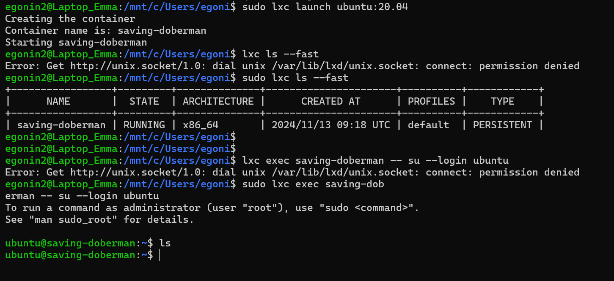



Ce MON serait à priori plutôt pour quelqu'un qui a des bases en Linux






Un MON pour faire de la conteneurisation avec les environnements jail. 

## Introduction

## C'est quoi le confinement de processus et à quoi ça sert ?

## Jail et chroot, késako?

## Comment faire son propre environnement jail

Alors, cette étape fut plus compliquée que prévue mais après visionnage d'une vidéo qui explique le pourquoi du comment LXC ne fonctionne pas vraiment sur les distributions Ubuntu 20.04 et 22.04, j'ai pu lancer mon propre premier conteneur sous la distribution Ubuntu 18.04 avec WSL.



Tout d'abord, j'avais simplement suivi la documentation en installant lxc avec sudo sur mon terminal Ubuntu 22.04 mais au moment de démarrer mon conteneur, j'enchaînais les erreurs, quelles soient liées à systemd, snap, un pont réseau qui n'est pas initialisé etc etc. Après avoir essayé de débugger toutes ces erreurs à la main pendant 2h, j'ai pris l'air et je suis tombée par hasard sur la vidéo miracle qui va changer la tournure de ce MON. Le monsieur chargé de nous expliquer les méandres de LXC sous Ubuntu 22.04 m'informe déjà que je n'ai pas systemd d'activé sur ma machine. Il nous fournit les lignes de commande pour activer systemd :
```
ACTIVATE SYSTEMD

curl -L -O "https://raw.githubusercontent.com/nullpo-head/wsl-distrod/main/install.sh"
chmod +x install.sh
sudo ./install.sh install

sudo /opt/distrod/bin/distrod enable
``` 
Puis il nous montre pourquoi le wizard d'initialisation de lxd sous la version 22.04 d'Ubuntu ne marche pas alors qu'il fontionne parfaitement sous la version 18.04. Alors, je prends mon courage à deux mains et j'installe la version 18.04 d'Ubuntu et je suis le tutoriel. J'initialise lxd avec `lxd init`, tout va bien alors qu'on avait précédemment une erreur obscure au niveau de la création du `local network bridge`. Pour ce MON je pense que la version d'Ubuntu n'est pas très importante, donc je vais continuer mes expérimentations sous Ubuntu 18.04. 

La commande `sudo lxc launch ubuntu:20.04` me permet de créer et démarrer un conteneur (qui ici s'appelle saving-doberman) avec une image de distribution Ubuntu 20.04 ! Je vérifie quels sont mes conteneurs et quel est leur état avec la commande `sudo lxc ls --fast`. Pour me connecter à mon conteneur, je lance ` sudo lxc exec saving-doberman -- su --login ubuntu`. Et me voilà dans le conteneur ! Miracle. 

Pour plus tard : voir des scripts bash qui automatisent la gestion des conteneurs (démarrage, arrêt...).

## Ressources
- https://connect.ed-diamond.com/GNU-Linux-Magazine/glmf-118/confinement-de-processus-sous-freebsd-jail-et-linux-openvz
- https://www.redhat.com/fr/topics/containers/whats-a-linux-container?pfe-c5mxvyqqb=resources
- [Video sur chroot Linux](https://youtu.be/8_5vXRA7sRs?feature=shared)
- [Documentation FreeBSD sur les prisons 'jails'](https://docs.freebsd.org/fr/books/handbook/jails/)
- Vincent Autefage. Firejail: Le couteau suisse du confinement sous Linux. JRES 2022: 14èmes
 Journées Réseaux, RENATER, May 2022, Marseille, France. pp.Article 31. (￿hal-03640803v2￿)(https://hal.science/hal-03640803/document)
- https://lightcode.fr/article/conteneurs-linux/
- https://www.youtube.com/watch?v=xmZcsq8Mqk4&ab_channel=MikeLevin%2CSEOinNYC