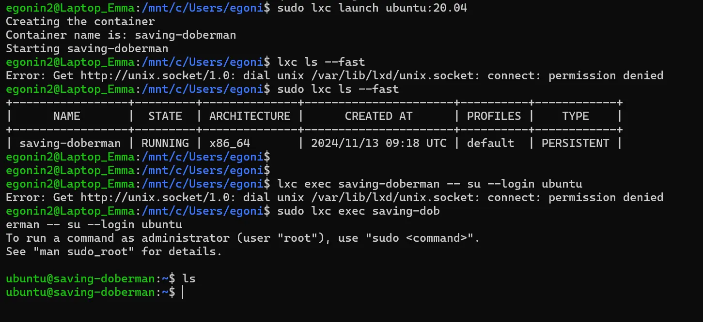



Ce MON serait à priori plutôt pour quelqu'un qui a des bases en Linux !






Un MON pour faire de la conteneurisation avec les environnements jail. 

## Introduction

Je suis curieuse et cherche à monter en compétences notamment dans le domaine DevOps. Avant d'étudier Docker, je souhaite apprendre à quoi servent les conteneurs et m'exercer sur Linux grâce à ce MON !  

## C'est quoi le confinement de processus et à quoi ça sert ?

Le confinement de processus est un concept clé en sécurité informatique qui vise à isoler des processus ou des applications de manière à ce qu'ils ne puissent pas interférer ou compromettre d'autres processus ou parties du système d'exploitation hôte. Il s'agit de limiter l'accès d'un processus à ses propres ressources et d'empêcher toute interaction indésirable avec le système ou d'autres applications en dehors de son environnement. C'est important notamment en cas de cyberattaques, si un conteneur est touché, l'attaquant ne va pas pouvoir accéder à la machine hôte, si et seulement si le conteneur est bien protégé (à priori ce n'est pas toujours le cas !).

## Jail et chroot, késako?

Le concept de jail a été introduit dans FreeBSD en 2000. Un jail est une forme d'isolement au niveau du système d'exploitation dans FreeBSD. Il repose sur des mécanismes du noyau FreeBSD, notamment des concepts comme les chroot, jails, et virtualisation de réseau. Chaque jail est un environnement d'exécution avec son propre arbre de système de fichiers et des ressources spécifiques (comme le réseau).

Avec le cours d'Unix de François Brucker et Dgeo, j'ai installé une machine Ubuntu sur mon PC Windows (magie), ainsi j'ai voulu m'essayer à la conteneurisation sous Linux et non pas sous FreeBSD (qui est un autre système d'exploitation).

### Conteneur LXC (Linux Containers) :
LXC est une technologie de conteneurisation sous Linux qui est apparue autour de 2008. LXC repose sur des technologies du noyau Linux comme les `namespaces` et les  `cgroups` pour isoler les environnements d'exécution et permettre à chaque conteneur de fonctionner de manière indépendante, bien qu'il partage le même noyau. Il est populaire pour les applications qui nécessitent une isolation légère (telles que des environnements de développement ou des services web), mais ne nécessitent pas la lourdeur d'une machine virtuelle. LXC est également utilisé comme une base pour des solutions plus complètes comme Docker et LXD.

## Comment faire son propre conteneur LXC : Linux Containers

Alors, cette étape fut plus compliquée que prévue mais après visionnage d'une vidéo qui explique le pourquoi du comment LXC ne fonctionne pas vraiment sur les distributions Ubuntu 20.04 et 22.04, j'ai pu lancer mon propre premier conteneur sous la distribution Ubuntu 18.04 avec WSL.



Tout d'abord, j'avais simplement suivi la documentation en installant lxc avec sudo sur mon terminal Ubuntu 22.04 mais au moment de démarrer mon conteneur, j'enchaînais les erreurs, quelles soient liées à systemd, snap, un pont réseau qui n'est pas initialisé etc etc. Après avoir essayé de débugger toutes ces erreurs à la main pendant 2h, j'ai pris l'air et je suis tombée par hasard sur la vidéo miracle qui va changer la tournure de ce MON. Le monsieur chargé de nous expliquer les méandres de LXC sous Ubuntu 22.04 m'informe déjà que je n'ai pas systemd d'activé sur ma machine. Il nous fournit les lignes de commande pour activer systemd :
```
ACTIVATE SYSTEMD

curl -L -O "https://raw.githubusercontent.com/nullpo-head/wsl-distrod/main/install.sh"
chmod +x install.sh
sudo ./install.sh install

sudo /opt/distrod/bin/distrod enable
``` 
Puis il nous montre pourquoi le wizard d'initialisation de lxd sous la version 22.04 d'Ubuntu ne marche pas alors qu'il fontionne parfaitement sous la version 18.04. Alors, je prends mon courage à deux mains et j'installe la version 18.04 d'Ubuntu et je suis le tutoriel. J'initialise lxd avec `lxd init`, tout va bien alors qu'on avait précédemment une erreur obscure au niveau de la création du `local network bridge`. Pour ce MON je pense que la version d'Ubuntu n'est pas très importante, donc je vais continuer mes expérimentations sous Ubuntu 18.04. 

La commande `sudo lxc launch ubuntu:20.04` me permet de créer et démarrer un conteneur (qui ici s'appelle saving-doberman) avec une image de distribution Ubuntu 20.04 ! Je vérifie quels sont mes conteneurs et quel est leur état avec la commande `sudo lxc ls --fast`. Pour me connecter à mon conteneur, je lance ` sudo lxc exec saving-doberman -- su --login ubuntu`. Et me voilà dans le conteneur ! Miracle. 

Pour plus tard : voir des scripts bash qui automatisent la gestion des conteneurs (démarrage, arrêt...).

Ce que j'ai voulu faire, c'est copier mon application React de mon site web (la version de mon POK1) en suivant ce tutoriel https://medium.com/@anuragabcr/hosting-react-app-in-docker-container-a753ba2ec21d en adaptant le fait que j'utilise un conteneur LXC et non pas Docker, mais il me semble que je me suis trompée. 
Ce que j'ai fait : 
* copier tous les fichiers de mon application (sauf les node_modules) avec la commande `sudo lxc file push -r /home/egonin2/portfolio-art/ saving-doberman/portfolio-art/`
* vérifier le contenu de mon conteneur avec ls 
  
* `npm install` pour installer les dépendances de mon projet
* run mon application avec `npm start` comme je le fais dans mon PowerShell
Cela m'a rendu une erreur car npm start souhaite lancer un powershell, j'aurais du build mon application en local et copier le dossier de build sur mon conteneur. Ce n'est pas grave ! J'ai pu installer nodejs, npm et nginx sur mon conteneur, cela me servira pour la deuxième partie de mon POK2. J'ai pu copier des fichiers de ma machine hôte à mon conteneur et me servir du conteneur comme d'une machine virtuelle classique. 

## Conclusion
J'ai un peu tâtonner pour ce MON dans un monde où LXC est en train d'être remplacé par Docker donc le peu de documentation qui existe est noyée dans les millions d'articles sur les conteneurs Docker. Je vais pour le MON 2.2 m'intéresser à Docker et voir si c'est vraiment plus simple que Linux. Pour plus tard, m'intéresser aux Firejail et voir la différence avec LXC.

## Ressources
- https://connect.ed-diamond.com/GNU-Linux-Magazine/glmf-118/confinement-de-processus-sous-freebsd-jail-et-linux-openvz
- https://www.redhat.com/fr/topics/containers/whats-a-linux-container?pfe-c5mxvyqqb=resources
- [Video sur chroot Linux](https://youtu.be/8_5vXRA7sRs?feature=shared)
- [Documentation FreeBSD sur les prisons 'jails'](https://docs.freebsd.org/fr/books/handbook/jails/)
- Vincent Autefage. Firejail: Le couteau suisse du confinement sous Linux. JRES 2022: 14èmes
 Journées Réseaux, RENATER, May 2022, Marseille, France. pp.Article 31. (￿hal-03640803v2￿)(https://hal.science/hal-03640803/document)
- https://lightcode.fr/article/conteneurs-linux/
- Mike Levin, celui qui m'a sauvé mes expérimentations avec LXC (les conteneurs Linux) https://www.youtube.com/watch?v=xmZcsq8Mqk4&ab_channel=MikeLevin%2CSEOinNYC