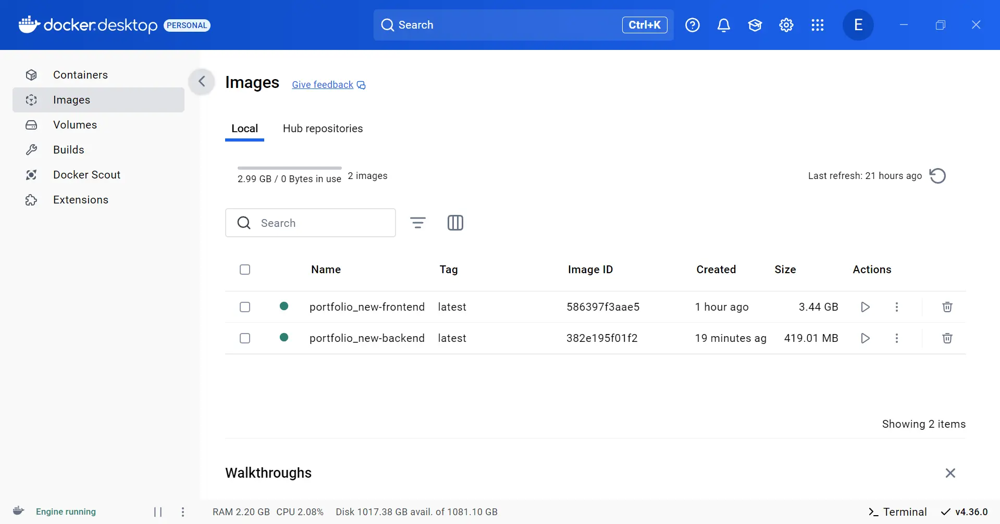
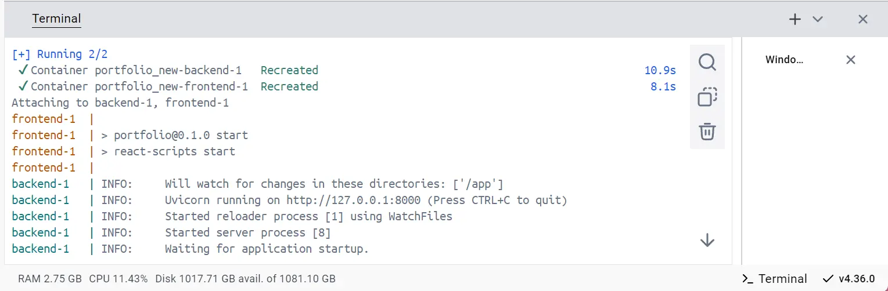
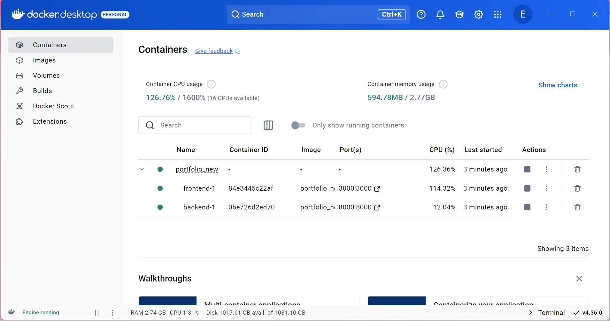
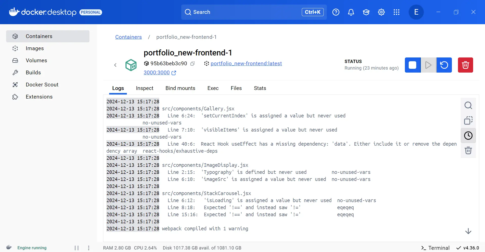
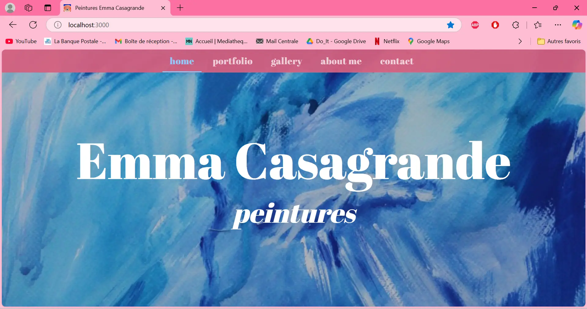



Novice




Les lien utiles pour la compréhension de celui-ci.
[MON de Tuncay Bilgi](https://francoisbrucker.github.io/do-it/promos/2022-2023/Bilgi-Tuncay/mon/Docker/), le 
[MON de Victor Ory](https://francoisbrucker.github.io/do-it/promos/2023-2024/Victor-Ory/mon/Docker/) et le
[MON d'Arthur Louradou](https://francoisbrucker.github.io/do-it/promos/2023-2024/Louradou-Arthur/mon/temps-2.1/)



Un MON pour se familiariser avec Docker. J'ai déjà utilisé un peu Docker pendant mon stage mais je souhaite approfondir mes connaissances pour monter en compétences DevOps.

## Contenu

Dans un premier temps, j'installe [Docker Desktop](https://docs.docker.com/desktop/setup/install/windows-install/) sur mon Windows, ce qui me servira à orchestrer mes conteneurs. Je manque de stockage sur ma machine et j'ai eu des problèmes avec WSL mais j'ai réussi à lancer Docker Desktop pour travailler dessus. J'ai lu le [MON de Tuncay](https://francoisbrucker.github.io/do-it/promos/2022-2023/Bilgi-Tuncay/mon/Docker/) pour me familiariser avec Docker puis je me suis lancée le défi de dockeriser mon application web de mon portefolio qui consiste à un frontend React et un backend Fastapi avec un script NodeJs pour orchestrer le tout. Je vais créer seulement deux conteneurs : un pour le frontend et un pour le backend.


#### a. Structure de mon projet

Voici la structure de mon projet :
```
/portfolio
    /frontend (ReactJS)
    /frontend/Dockerfile
    /backend (FastAPI)
    /backend/Dockerfile
  package.json (Scripts Node.js pour démarrer les serveurs)
  docker-compose.yml
  .dockerignore
  Dockerfile
```

#### b. Dockeriser le frontend (ReactJS)

Je crée un `Dockerfile` dans le dossier `frontend` :

```dockerfile
# Utilisation de l'image Node.js officielle pour construire l'application
FROM node:18

# Définir le répertoire de travail
WORKDIR /app

# Copier les fichiers package.json et package-lock.json
COPY package.json package-lock.json ./

# Installer les dépendances
RUN npm install

# Copier le reste des fichiers de l'application React
COPY . .

# Exposer le port utilisé par le serveur React (généralement 3000)
EXPOSE 3000

# Lancer le serveur de développement React
CMD ["npm", "start"]

```

#### c. Dockeriser le backend (FastAPI)

Je crée un `Dockerfile` dans le dossier `backend` :

```dockerfile
FROM python:3.10-slim

# Crée un répertoire pour l'application
WORKDIR /app

# Copie les fichiers de l'application dans le conteneur
COPY . /app

# Installe les dépendances
RUN pip install --no-cache-dir -r requirements.txt

# Expose le port
EXPOSE 8000

# Démarrer Uvicorn en utilisant l'environnement virtuel
CMD ["uvicorn", "api.main:app", "--reload"]

```
Je n'ai pas besoin de créer de venv car Docker installe directement les dépendances dans le conteneur. 

#### d. Créer le fichier `.dockerignore`

Dans chaque dossier, je crée un fichier `.dockerignore` pour éviter de copier des fichiers inutiles dans l'image Docker. Exemple pour `frontend/.dockerignore` :

```
node_modules
build
```

### e. Créer le fichier `docker-compose.yml`

À la racine du projet, je crée un fichier `docker-compose.yml` pour orchestrer les conteneurs du projet :

```yaml
version: '3.8'

services:
  frontend:
    build:
      context: ./frontend
    ports:
      - "3000:3000"
    networks:
      - app-network

  backend:
    build:
      context: ./backend
    ports:
      - "8000:8000"
    networks:
      - app-network
  networks:
    app-network:
      driver: bridge
```

J'ai lancé `docker-compose build` dans mon terminal et dans un premier temps ça prenait beaucoup trop de temps tout simplement car j'ai oublié le .dockerignore donc j'étais en train de créer des images Docker des modules Node... Dans un second temps j'ai donc créé ce fichier là et relancé ma commande. 

Docker va alors construire les images pour chaque service. L'image pour le frontend s'appelle "nom-du-projet-frontend" et est très lourde (3,5 Go), ça doit être parce qu'elle contient tous les modules Node qu'on a installé précédemment.


  
Pour démarrer les conteneurs pour ces services, je lance `docker-compose up`.



On voit dans Docker Desktop que 2 conteneurs sont créés : un pour le frontend et un pour le backend. On peut aussi voir les logs en temps réel pour chaque service.




J'accède à `http://localhost:3000` dans mon navigateur pour voir l'application React puis à `http://localhost:8000` pour tester l'API FastAPI. J'ai eu quelques problèmes avec mon conteneur backend mais le frontend fonctionne. 



J'utilise l'interface de **Docker Desktop** pour :

- **Voir les conteneurs** : Sur l'interface Docker Desktop, on peut voir l'état de tous nos conteneurs (en cours d'exécution, arrêtés, etc.).
- **Gérer les conteneurs** : on peut démarrer, arrêter ou redémarrer nos conteneurs directement depuis l'interface graphique.
- **Consulter les logs** : Docker Desktop permet de visualiser les logs de chaque conteneur. Cela peut être utile pour le débogage.
- **Supprimer des conteneurs** : Si on souhaite supprimer les conteneurs ou les images, on peut également le faire via l'interface.

On peut arrêter vos conteneurs avec :

```
docker-compose down
```

Cela arrêtera les conteneurs et les supprimera, mais gardera les images intactes.

### Conclusion
Docker Desktop est un outil facile à prendre en main, malgré mes soucis avec WSL, tout s'est bien déroulé et j'ai désormais 2 conteneurs pour mon application et je pourrais utiliser cet outil dans ma vie professionnelle.

### Ressources
- Documentation Docker : https://docs.docker.com/
- https://lightcode.fr/article/introduction-docker-serveur/