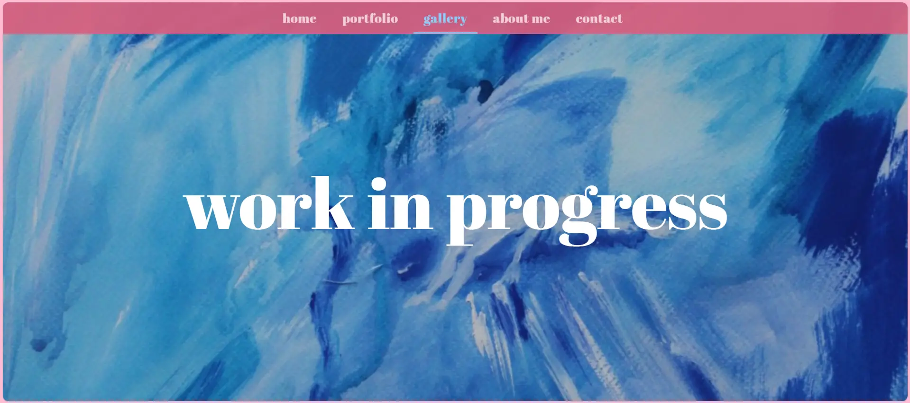
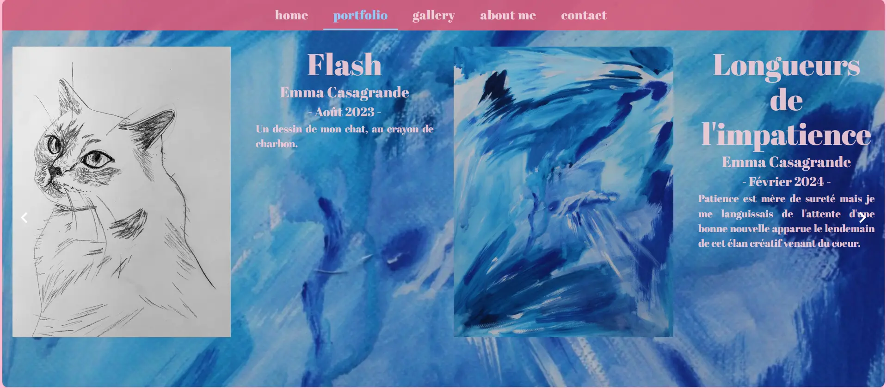
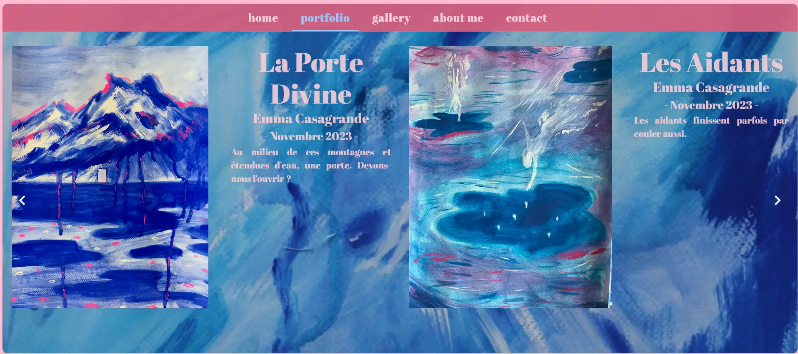
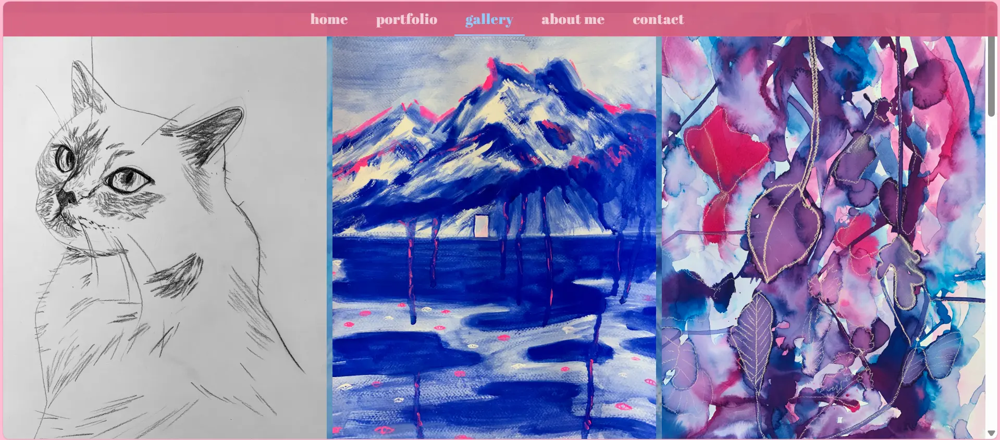
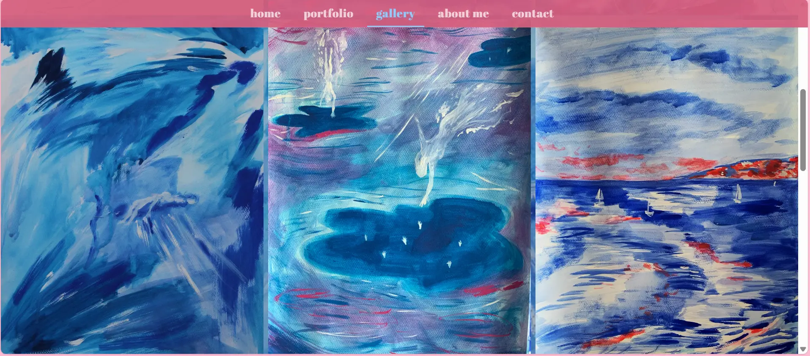
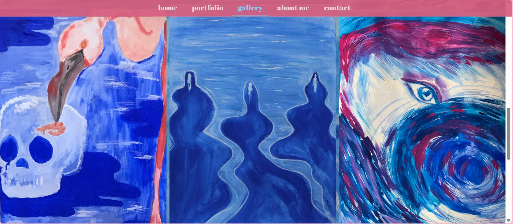
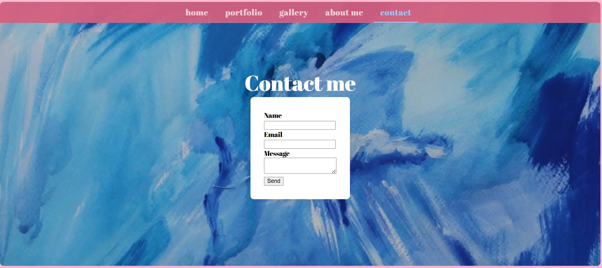

L'un de mes objectifs personnels de ma césure était de peindre à la gouache et de pouvoir partager mes peintures par la suite. Ce second objectif peut être atteint grâce à un site web que je peux développer à l'occasion de ce POK. Pour ce premier POK, je vais créer l'interface graphique du site avec ReactJs, une librairie que j'ai pu apprendre à utiliser lors de ma césure.

## Tâches

### Sprints

L'objectif à la fin de ces 20 heures est d'avoir réalisé l'interface graphique du site web.

#### Sprint 1

- [x] Etude de l'état de l'art : sites web de peintres qui marchent
- [x] Schémas de plusieurs vues (page d'accueil, a propos, contact, galerie de peintures)
- [x] Reunir les peintures dans un dossier et stocker les données dans un fichier JSON
- [x] Créer l'environnement de travail sur cet ordinateur

- [x] Créer la page d'accueil
- [x] Créer la page portfolio carousel avec mes peintures, leurs titres et descriptifs 
- [x] Faire la page a propos
- [x] Lier les différentes vues dans l'App.js


#### Sprint 2

- [x] Faire la page contacts
- [x] Faire la page galerie photo
- [x] Finir les différentes pages et harmoniser le rendu
- [x] Faire tester le site a mes proches pour avoir un retour utilisateur
- [] Ameliorer le site selon leurs retours si j'ai le temps


### Horodatage

| Date | Heures passées | Indications |
| -------- | -------- |-------- |
| Mardi 03/09  | 30 MIN  | Création de la base de données des peintures + fichier JSON |
| Mercredi 04/09  | 2H  | Création de l'application et mise en page de la page d'accueil + choix charte graphique |
| Lundi 09/09  | 3H  | Création des différentes pages, liaison des vues avec les onglets de l'en-tête, première ébauche de la page portfolio avec la création d'un carousel |
| Jeudi 12/09  | 4H30  | Mise en page du portfolio et de la page à propos |
| Lundi 23/09 | 30 MIN | Mise en place de la galerie photo : assez rapide grâce à un composant React qui existe déjà |
| Lundi 23/09 | 1H15 | Mise en phase du formulaire de contact avec EmailJS : assez sympa à faire, rapide et efficace. |
| Mercredi 25/09 | 1H | Travail sur l'affichage des images |
| Samedi 12/10 | 2H | Travail sur la gestion des évènements clavier |
| Dimanche 13/10 | 3H | Tests à ma famille : retours négatifs sur le préloading des images + Travail sur ce dit préchargement des images |
| Lundi 14/10 | 2H | Refactor du carousel |

## Contenu

Le contenu du POK. Le lien du projet est sur mon [github](https://github.com/egonin/art-portfolio).

### Premier Sprint
La première tâche que j'ai réalisée pour démarrer ce projet a consisté au choix des peintures que je souhaitais présenter dans ce portfolio en ligne. J'ai créé un fichier JSON pour contenir les données de chaque peinture. Le contenu du JSON ressemble à ça :

```
{
    "paintings": [
        {
            "img_url": "../data/paintings/NAME.webp",
            "date":"MONTH YEAR",
            "title":"TITLE",
            "artist": "Emma Casagrande",
            "size": "",
            "description": "DESCRIPTION"
        },
        ....]
}
```

Au début de ce premier sprint, j'ai créé l'application React en lançant la commande suivante dans mon terminal à l'emplacement de mon projet :
```
npx create-react-app portfolio
```
Cette commande crée directement mon application avec une architecture simple, à laquelle j'ai ajouté le dossier /data qui contiendra les photos qui apparaitront sur le site et le dossier /fonts qui contient la police que j'ai choisie :
```
└── /src
	├── /data
	├── /components
	├── /fonts
	├── App.jsx
	├── index.js
  ├── index.css
└── /public
  ├── /data
  ├── index.html
  ├── logo.webp
└── ./node_modules
```

J'ai également installé les librairies dont j'avais besoin pour le design de mon projet, à savoir les librairies mui/material et emotion/styled. La librairie mui/material me permet d'avoir accès à des composants React qui sont interactifs, qui ont déjà un design avec une certaine charte graphique et dont je peux modifier le style grâce à emotion/styled. 

J'ai dessiné une maquette rapidement sur une feuille avec les différentes vues de mon site. Cela m'a permis de savoir comment je vais devoir diviser mes différentes vues en composants. Par exemple, j'ai divisé ma page d'accueil en deux composants : le fond (background) qui sera défini dans le fichier Home.jsx et l'en-tête qui sera défini dans le fichier Header.jsx. Cet en-tête sera utilisé dans toutes mes autres pages. 

Après cette étape rapide de maquettage, j'ai entrepris le code des différents composants, notamment ceux qui composent la page Home, la page AboutMe et la page Portfolio, puisque c'était mes objectifs pour ce premier sprint.

La partie qui m'a pris le plus de temps était la création du Carousel de la page Portfolio. Qu'est-ce qu'un carousel ? Un carousel est un dispositif qui permet de visualiser un ou plusieurs éléments en même temps et de changer les éléments visualisés lorsque l'utilisateur clique sur les boutons fléchés du carrousel. 

A la fin de ce premier sprint, j'ai donc produit ces quatre pages :

1. En attendant d'avoir les pages gallery et contact, j'affiche ceci :

<br>
1. La page d'accueil "home" ressemble à ceci :

<br>
1. Le rendu de quelques vues du portfolio-carousel est le suivant : 



J'ai créé un composant StackCarousel qui contient la mise en page image/texte et un Carousel qui affiche deux StackCarousel simultanément afin de montrer deux peintures à la fois. Pour l'instant la mise en forme est faite pour des peintures de format portrait, il faudra que je change le code pour inclure des peintures de format paysage afin de visualiser un seul paysage à la fois. 
<br>
1. La dernière page effectuée lors de ce sprint, une description du contexte de ce site et brève description de moi (avec un pseudonyme, ce nom de famille est celui de mon grand-père maternel)


### Second Sprint

J'ai démarré ce second sprint par la page galerie photo qui fût fort rapide à mettre en place à l'aide d'un composant React qui s'appelle [ImageList](https://mui.com/material-ui/react-image-list/). Voici des photos du rendu final : 





Pour la page Contact, je crée un formulaire grâce à la mise en page https://www.copycat.dev/blog/material-ui-form/. Pour éviter pour l'instant de faire un système back-end avec des API etc, j'ai suivi le tutoriel [React Contact Form w/ EmailJS](https://medium.com/@thomasaugot/create-a-react-contact-form-with-email-js-cad2c8606f33) pour apprendre à utiliser EmailJS de manière temporaire afin de recevoir les messages via cette plateforme. 



J'ai travaillé sur la navigation avec les flèches du clavier pour le portfolio. J'ai eu des problèmes avec la gestion des keyEvent et de la gestion du state de l'item courant. 

<video controls src="demo.mp4" title="Demo"></video>