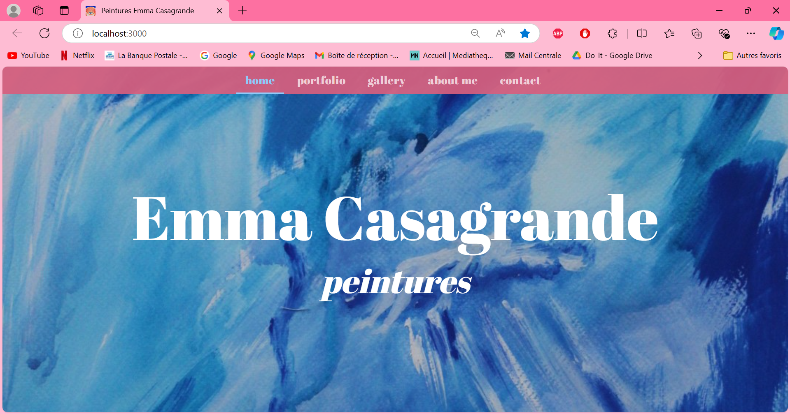
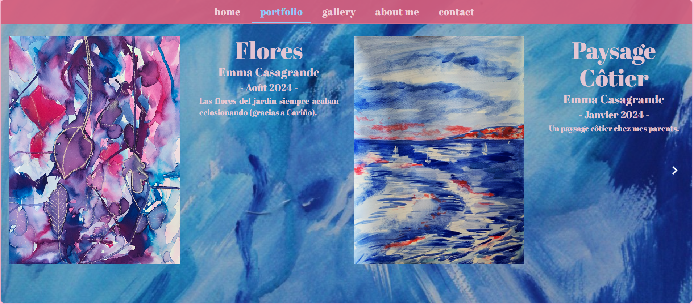
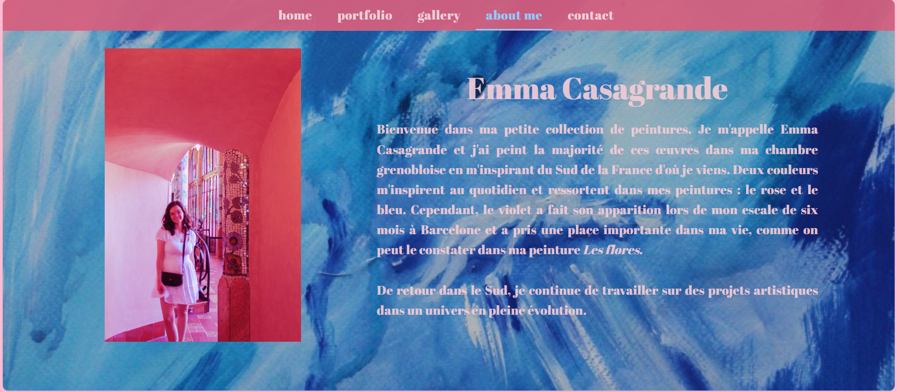

L'un de mes objectifs personnels de ma césure était de peindre à la gouache et de pouvoir partager mes peintures par la suite. Ce second objectif peut être réalisé grâce à un site web que je peux développer à l'occasion de ce POK. Pour ce premier POK, je vais faire l'interface graphique du site avec ReactJs, un framework que j'ai pû apprendre à utiliser lors de ma césure.

## Tâches

### Sprints

L'objectif à la fin de ces 20 heures est d'avoir réalisé l'interface graphique du site web.

#### Sprint 1

- [x] Etude de l'état de l'art : sites web de peintres qui marchent
- [x] Schémas des plusieurs views (page d'accueil, a propos, contact, galerie peintures)
- [x] Reunir les peintures dans un dossier, stocker les données dans un json
- [x] Créer l'environnement de travail sur cet ordinateur

- [x] Faire la page d'accueil
- [ ] Faire la page portfolio carousel avec mes peintures + titres + descriptifs 
- [ ] Faire la page a propos
- [x] Lier les différentes vues dans l'App.js


#### Sprint 2

- [ ] Faire la page contacts
- [ ] Faire la page galerie photo
- [ ] Finir les différentes pages et harmoniser le rendu
- [ ] Faire tester le site a mes proches pour avoir un retour utilisateur
- [ ] Ameliorer le site selon leurs retours si j'ai le temps


### Horodatage

| Date | Heures passées | Indications |
| -------- | -------- |-------- |
| Mardi 03/09  | 30 MIN  | Création de la base de données des peintures + fichier json |
| Mercredi 04/09  | 2H  | Création de l'application et mise en page de la page d'accueil + choix charte graphique |
| Lundi 09/09  | 3H  | Création des différentes pages, lier les vues avec les onglets, première ébauche de la page portfolio avec la création d'un carousel |
| Jeudi 12/09  | 4H30  | Mise en page du portfolio et de la page à propos |

## Contenu

Le contenu du POK.

### Premier Sprint
La première chose que j'ai faite pour débuter ce projet c'est choisir les peintures que je souhaitais montrer dans ce portfolio web. J'ai créé un fichier JSON pour contenir les données de chaque peinture. Le contenu du JSON ressemble à ça :

```
{
    "paintings": [
        {
            "img_url": "../data/paintings/NAME.jpg",
            "date":"MONTH YEAR",
            "title":"TITLE",
            "artist": "Emma Casagrande",
            "size": "",
            "description": "DESCRIPTION"
        },
        ....]
}
```

Au début de ce premier sprint, j'ai créé l'application react en lançant la commande suivante dans mon terminal à l'emplacement de mon projet :
```
npx create-react-app portfolio
```
Cette commande crée directement mon application avec une architecture simple, à laquelle j'ai rajouté le dossier /data qui va contenir les photos qui apparaitront sur le site et /fonts qui contient la police que j'ai choisi :
```
└── /src
	├── /data
	├── /components
	├── /fonts
	├── App.jsx
	├── index.js
  ├── index.css
└── /public
  ├── /data
  ├── index.html
  ├── logo.png
└── ./node_modules
```

J'ai également installé les librairies dont j'ai besoin pour le design de mon projet, c'est-à-dire les librairies mui/material et emotion/styled. La librairie mui/material me permet d'avoir accès à des composants React qui sont interactifs, qui ont déjà un design avec une certaine charte graphique et dont je peux modifier le style grâce à emotion/styled. 

J'ai dessiné une maquette rapidement sur une feuille avec les différentes vues de mon site, cela m'a permis de savoir comment je vais devoir diviser mes différentes vues en composants. Par exemple, j'ai divisé ma page Home en deux composants : le fond (background) qui sera défini dans le fichier Home.jsx et l'en-tête qui sera définie dans le fichier Header.jsx et que je vais pouvoir récupérer pour toutes mes autres pages. 

Après cette étape rapide de maquettage, j'ai entrepris le code des différents composants, notamment ceux qui composent la page Home, la page AboutMe et la page Portfolio, puisque c'était mes objectifs pour ce premier sprint.

La partie qui m'a pris le plus de temps était la création du Carousel de la page Portfolio. Qu'est-ce qu'un carousel ? Un carousel permet de visualiser un ou plusieurs items en même temps et de changer les items visualisés lorsque l'utilisateur clique sur les boutons fléchés du carousel. 

A la fin de ce premier sprint, j'ai donc produit ces quatre pages :

1. En attendant d'avoir les pages gallery et contact, j'affiche ceci :

<br>
2. La page d'accueil "home" ressemble à ceci :

<br>
3. Le rendu de quelques vues du portfolio-carousel est le suivant : 



J'ai créé un composant StackCarousel qui contient la mise en page image/texte et un Carousel qui affiche deux StackCarousel au même moment afin de montrer deux peintures à la fois. Pour l'instant la mise en forme est faite pour des peintures de format portrait, il faudra que je change le code pour inclure des peintures de format paysage afin de visualiser un seul paysage à la fois. 
<br>
4. La dernière page effectuée lors de ce sprint, une description du contexte de ce site et brève description de moi (avec un pseudonyme, ce nom de famille est celui de mon grand-père maternel)


### Second Sprint
