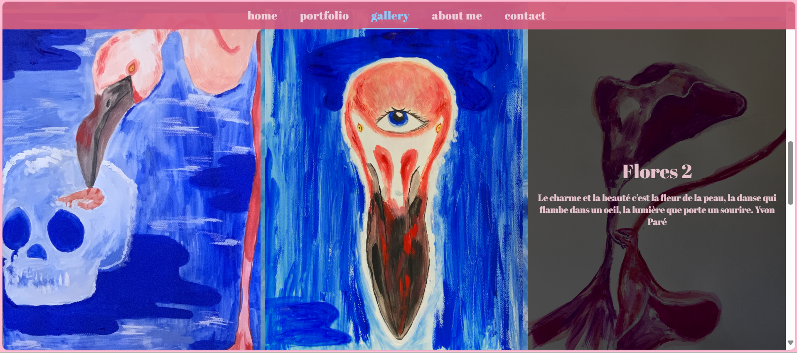
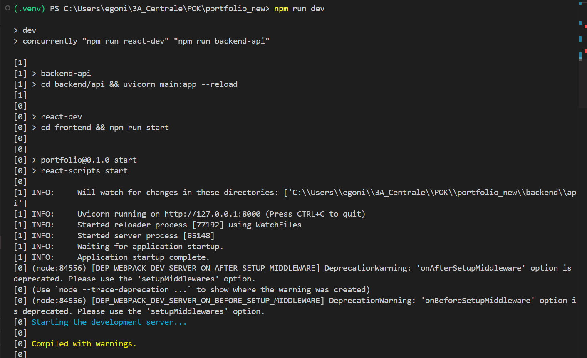
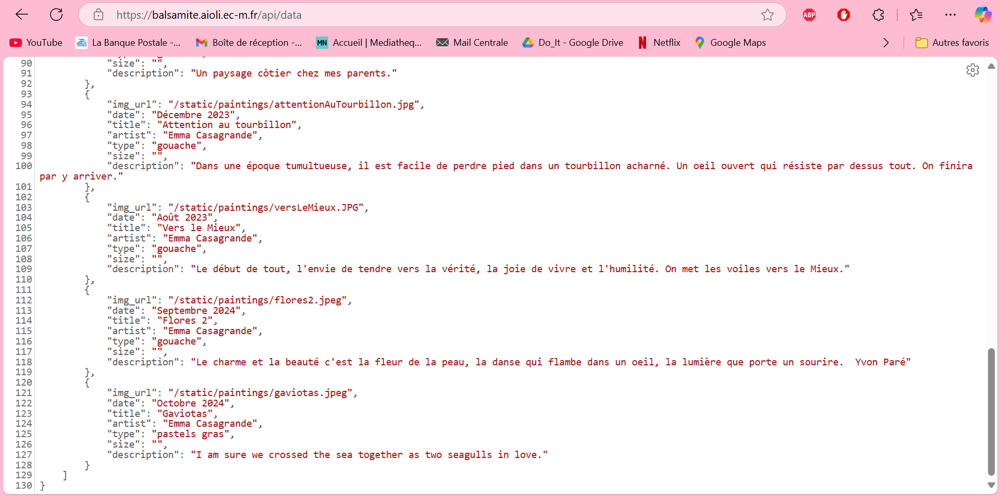
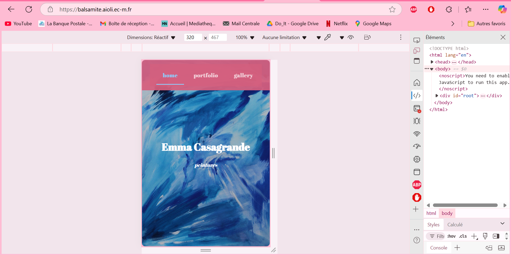
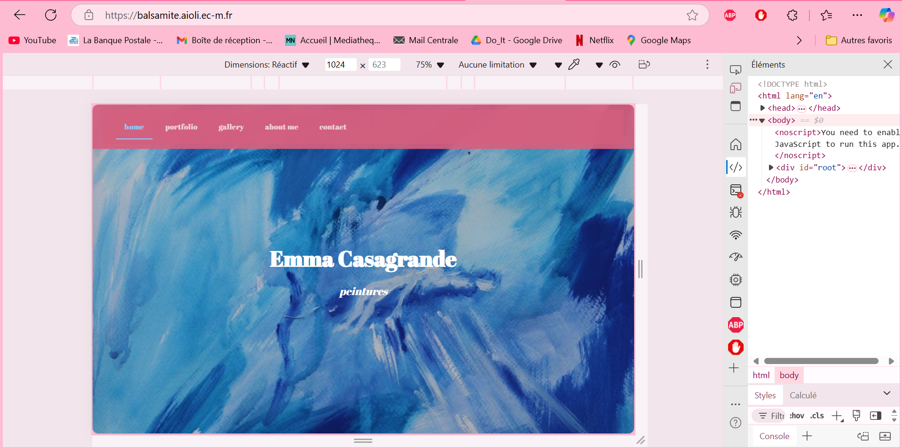
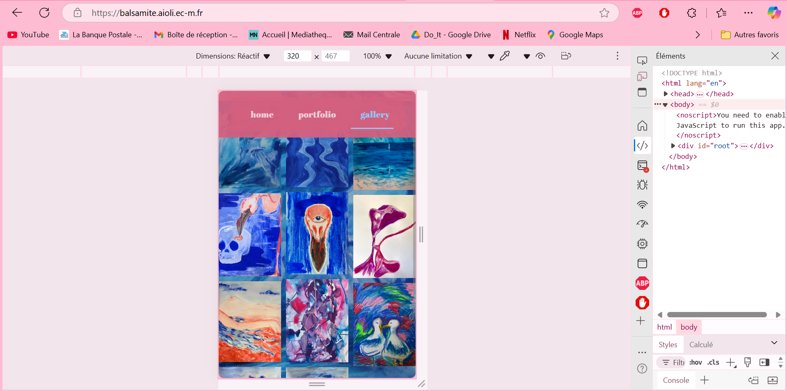
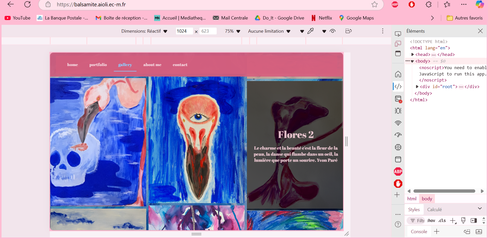
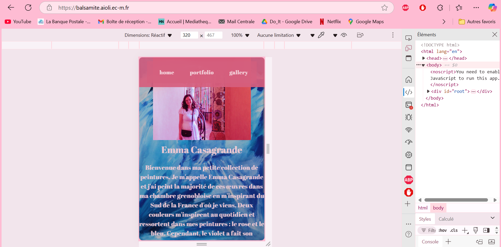
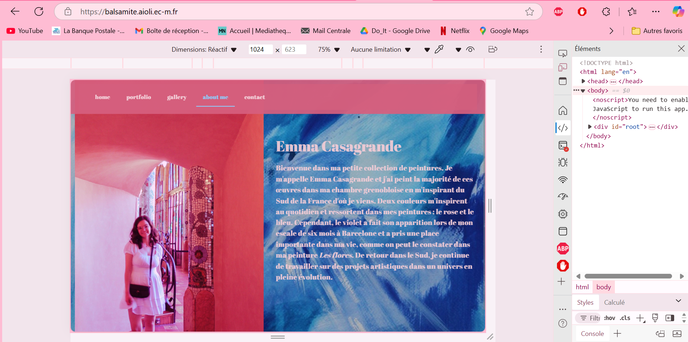

Mon objectif est de mettre en production mon site web React à l'adresse suivante : [https://balsamite.aioli.ec-m.fr]. Dans un premier temps lors du premier sprint je souhaite terminer le développement de mon site web et dans un second temps le déployer de deux manières différentes. 

## Tâches

### Sprints

But final.

#### Sprint 1 : Fin du développement

- [x] Améliorer la page portefolio
- [ ] Changer le système de mail si possible
- [x] Modifier la galerie pour pouvoir visualiser le titre de la peinture lorsqu'on passe la souris dessus
- [ ] Ajouter la navigation clavier pour le portefolio et le scroll => décalé au sprint 2 après de nombreux tatônnements
- [x] Voir où stocker mes peintures : au lieu d'un json créer une collection sur MongoDB et faire une API avec FastAPI ou SQLite

#### Sprint 2 : Déployement !

- [x] Déployer le site sur aioli à la main, en créant mon serveur et en utilisant tmux pour survivre à la déconnexion.
- [ ] Tester une seconde manière de déployer, cette fois en dockerisant mon appli en parallèle de mon MON 2.2 sur Docker.
- [ ] Rajout post-sprint 1 : Trouver comment forcer le rafraichissement du DOM après un clic sur les flèches gauche ou droite pour enfin mettre en place la navigation clavier dans le portfolio. 

### Horodatage

Toutes les séances et le nombre d'heure que l'on y a passé.

| Date | Heures passées | Indications |
| -------- | -------- |-------- |
| Lundi 11/11  | 4H  | Amélioration de la page portefolio, rajout de deux peintures à la bdd, rajout de la fonctionnalité "hovering" dans la galerie photo |
| Mardi 12/11 | 1H | Essais pour la navigation clavier et débuggage, essai avec un nouveau carousel qui aurait pû être navigué avec le clavier plus facilement mais le rendu ne m'a pas plu du tout |
| Mercredi 13/11 | 2H | Essais pour la navigation clavier/Mise en pause de cette navigation là : j'ai nettoyé le code et décalé cette tâche au sprint 2, deux heures peu productives |
| Jeudi 14/11 | 2H30 | Après la session peu productive de la veille et le cours de dev web sur Flask, je me suis décidée à implémenter ma propre API avec FastAPI. J'ai changé l'arborescence de mon projet pour séparer backend et frontend  |
| Lundi 18/11 | 1H | J'ai créé mon nouveau repo git et j'ai push mon projet ainsi que fini de rédiger cette synthèse. | 
| Lundi 09/12 | 2H | Copie du frontend et du backend depuis ma version locale au serveur aioli |
| Mercredi 11/12 | 5H | Déployement et mise en production |
| Dimanche 15/12 | 3H30 | Essai de rendre le frontend responsive |
| Lundi 16/12 | 3H | Rédaction compte-rendu et diapo pour restitution |

## Contenu

Le contenu du POK.

### Premier Sprint

### Amélioration du chargement des images
J'ai amélioré le carousel avec le chargement des images, ce qui m'ennuyait avec la version précédente du carousel c'était le chargement lent des images. Pour améliorer ceci, j'ai d'abord essayé de refaire le carousel de manière plus simple en faisant des tests mais je préférais le visuel que j'avais déjà, donc je suis repartie du code que j'avais à la fin du POK 1 et j'ai rajouté ces lignes de code qui chargent les images de manière asynchrone : 

```
useEffect(() => {
    const preloadImages = async () => {
      const visibleItemIndices = [currentIndex, (currentIndex + 1) % items.length];
      
      const preloadPromises = visibleItemIndices.map(index => 
        loadImage(items[index])
      );

      await Promise.all(preloadPromises);

      setIsLoading(false);
      setVisibleItems(visibleItemIndices.map(index => items[index]));
    };

    preloadImages();
  }, [currentIndex]);

  const loadImage = async (item) => {
    return new Promise((resolve, reject) => {
      const img = new Image();
      img.onload = () => resolve(img);
      img.onerror = () => reject(new Error(`Failed to load image: ${item.img_url}`));
      img.src = item.img_url;
    });
  };
```

### Rajout nouvelles peintures / hovering Galerie
Une fois que j'étais satisfaite du résultat, j'ai rajouté deux peintures/dessins récents dans ma base de données. J'ai ensuite rajouté une fonctionnalité dans ma galerie photo qui est que lorsque l'utilisateur passe la souris sur une des images, s'affiche alors le titre et la description de l'image. Pour se faire, j'ai rajouté un state `hoveredItem` et une Box noire transparente qui se superpose à l'image.  



### Séparation backend/frontend
Après l'ajout de cette nouvelle fonctionnalité, j'ai voulu séparer le backend du frontend. 
Avant, je stockais mes peintures et mon fichier `data.json` directement dans le dossier src de mon app React et j'importais le fichier dans mes composants : ce n'est pas propre ! Mais en faisant cela, je n'avais pas besoin de backend, mes fichiers étaient statiques. 

Pour mon backend et préparer la migration des données à un autre endroit que directement dans mon application React, j'ai créé une API avec **FastAPI** afin de récupérer les données de mon fichier `data.json` qui se trouve dans le dossier backend. Pour déployer mon API sur le port *8000* et mon application React sur le port *3000* j'ai créé un script dans mon `package.json` dans mon application globale : 
```
"scripts": {
        "dev": "concurrently \"npm run react-dev\" \"npm run backend-api\"",
        "react-dev": "cd frontend && npm run start",
        "backend-api": "cd backend/api && uvicorn main:app --reload"
    },
    "devDependencies": {
        "concurrently": "^9.1.0"
    }
```
Ainsi, lorsque je lance la commande `npm run dev`, npm appelle mon script `concurrently \"npm run react-dev\" \"npm run backend-api\"`. Le script `react-dev` va permettre de lancer mon application React et le script `backend-api` va permettre de lancer l'API avec Uvicorn. 



J'ai créé un nouveau repo Git pour mon portfolio 2.0 avec le backend et le frontend séparés : https://github.com/egonin/art-portfolio-2.0.

### Sprint 1 analyse post-mortem

Je suis contente de mon travail, je n'ai pas fini toutes mes tâches mais j'ai fait des choses que je n'avais pas envisagé clairement dans ma to-do list. Le dimensionnement de mes tâches est peut-être trop laxiste, pas assez explicite. Pour le sprint 2, j'espère que mes tâches sont raisonnables et la tâche sur l'amélioration du système de mails va passer à la trappe pour l'instant

Concernant la gestion de mon temps, j'ai fait 10h30, en réalité mon horodatage de ma session du jeudi 14/11 est peut-être erroné car j'ai été prise d'un élan et je n'ai pas vu l'heure passer, sachant également que je me suis interrompue au milieu de ma session de travail. Il y a donc une part d'incertitude sur cette session là, je pense +/- 1 heure.

J'ai eu de très bons retours de la part de mes proches sur l'avancée de mon site et j'ai hâte de voir ce que cela peut donner une fois mis en production. 

Pour déployer le site, j'ai plusieurs idées, si je n'avais pas créer d'API il m'aurait suffit de builder mon application React et de copier le dossier /build/ dans ma machine virtuelle et le serveur Nginx aurait servi à déployer ce build. Maintenant il faut que je me renseigne sur comment faire en ayant l'API qui tourne en arrière-plan.

### Second Sprint

Lors de ce second sprint, j'ai d'abord créer un dossier .tar.gz de mon application React sans les modules node afin de pouvoir modifier le code directement avec nano sur le serveur et effectuer le build depuis la machine virtuelle. J'ai copié ce dossier sur balsamite avec `scp -r \chemin\local\dossier mon-herbe@aioli-ec-m.fr:./paintings/`. J'ai pu build mon application sur le serveur et copier ces fichiers de build dans mon dossier /static/ pour qu'ils soient servis par nginx.

J'ai également copié mon dossier de backend de la même manière, sans l'environnement python que j'ai créé depuis aioli. J'ai modifié mon API pour qu'elle puisse servir l'application React directement, sans avoir à passer par un script node comme je le faisais auparavant et j'ai changé les path et les ports dans le main.py. Les url de mes images étaient configurées pour être utilisées en local mais pas sur un serveur donc j'ai dû les adapter en utilisant la route /static/paintings. 

Avant modification :


Après modification :


Pour survivre à la déconnexion, je lance mon serveur uvicorn (pour servir le backend) depuis une session `tmux` cf [les cours d'Unix de François Brucker](https://francoisbrucker.github.io/cours_informatique/enseignements/ecm/3A/do-it/devOPS/).

Je me suis rendue compte en ouvrant mon site web balsamite.aioli.ec-m.fr qu'il n'est pas du tout responsive, ainsi j'ai passé un peu plus de 3 heures à rendre le site web plus responsive grâce à un des outils de développement de chrome mais je ne suis pas tout-à-fait satisfaite du résultat. Après je ne suis pas tant frustrée car en un peu plus que 40 heures j'ai beaucoup appris, que ce soit sur le frontend, sur le backend et sur le déployement sur un serveur. 

#### Essai adaptabilité téléphone pour la page d'accueil




#### Essai adaptabilité pour la galerie




#### Essai adaptabilité pour la page "à propos"





### Post-mortem sprint 2

J'ai passé plus de temps de prévu car je n'avais pas prévu une vue mobile de mon site web à la base. J'ai dû changer aussi le code de mon backend pour que cela fonctionne hors de localhost. Pour conclure ce POK, j'ai mis les mains dans le cambouis et j'ai pu toucher à plusieurs technologies web qui me serviront plus tard.

### Ressources
- Pour la gestion du backend et du frontend (les faire tourner en parallèle) : Stackoverflow, how to put backend and frontend together - returning react frontend from fastapi backend endpoint, https://stackoverflow.com/questions/62928450/how-to-put-backend-and-frontend-together-returning-react-frontend-from-fastapi
- Pour mes questions spécifiques au code, j'utilise l'extension VSCode de https://phind.com
  
En prévision du sprint 2 :
- https://stacklima.com/comment-dockeriser-une-application-reactjs/
- https://www.youtube.com/watch?v=4xj8N4a36Zs&ab_channel=chillotech

Ressources réellement utilisées pour le sprint 2 : 
- [Tutoriel tmux](https://www.hostinger.fr/tutoriels/comment-utiliser-tmux-plus-cheatsheet#:~:text=La%20fen%C3%AAtre%20tmux%20en%20cours,utilisant%20Ctrl%2Db%20%2B%20p)