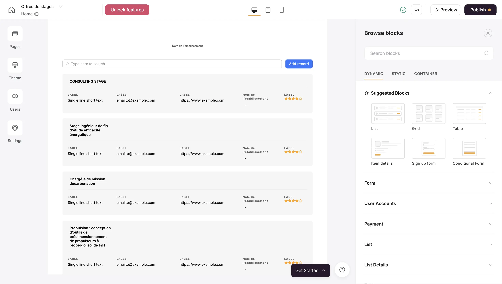
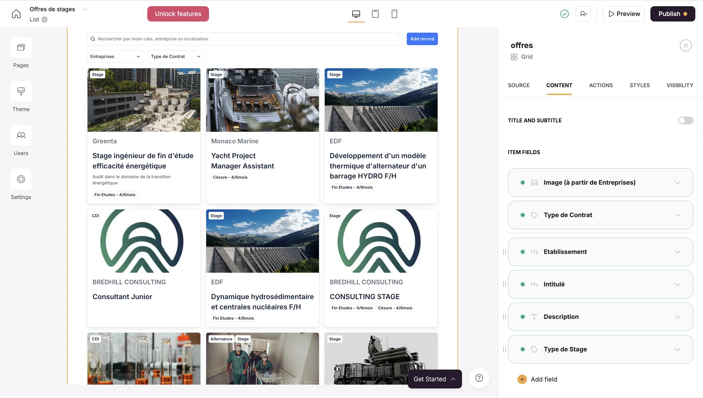



Pré-requis : Aucun



## Contenu

### Sommaire
1. Introduction
2. Airtable
3. Softr

### Introduction

Airtable est une plateforme en ligne permettant de créer et gérer des bases de données sans coder, plus puissante et intuitive qu'un simple tableur. Il est possible d'intégrer des automatisations directement dans la base de données. Plusieurs utilisateurs pouvant travailler sur un même projet en temps réel, tout en suivant les modifications instantanément. L'interface est très conviviale et agréable à utiliser. Airtable permet par exemple de créer des calendriers de contenu, des outils de suivi de projets, des systèmes CRM, des feuilles de route produit, etc

Softr, quant à lui, est une plateforme no-code permettant de créer des applications web, des sites dynamiques ou des portails en ligne, en intégrant les données stockées dans Airtable. Les sites peuvent prendre la forme de portails clients, marketplaces, ou intranets.

On peut voir Softr comme la partie front-end d'une application web (l'interface visible et interactive), tandis qu’Airtable fait office de back-end (là où les données sont enregistrées et stockées).


Tout en expliquant ce que j'ai appris au fil du MON, je présente la création d'un projet pour une application web.


### Airtable

Pour en apprendre plus sur Airtable, j'ai suivi les 3 vidéos de [Rémi OJR](https://www.youtube.com/@remiojr) ci-dessous à propos des notions de base, des CRM et de l'utilisation des interfaces.



https://www.youtube.com/watch?v=oIeZWL9Lsm0 \
https://www.youtube.com/watch?v=OpBcnhEjMJg \
https://www.youtube.com/watch?v=hb5zvNQvka0



En parallèle, je créais ma propre base de données **Offres de stage** ayant pur but de mettre à disposition des offres de stages, les renseignements associés et le moyen de postuler.

Dans Airtable, une base est l'élément fondamental où sont stockées et organisées les informations. Elle se compose de plusieurs tables, qui fonctionnent comme des feuilles de calcul dans un tableur, mais avec plus de puissance et de flexibilité.

Une base est composée de plusieurs tables, chacune dédiée à une catégorie de données. 
Par exemple, dans ma base, j'ai fait une table pour les **Offres** et une autre pour les **Entreprises**.

Une des fonctionnalités puissantes d’Airtable, que j'apprécie particulièremnt, est la possibilité de créer des relations entre tables en utilisant des champs liés. Cela permet de relier les données et de mieux les organiser. Par exemple, dans la table **Offres**, j'ai lié chaque offre à une entreprise de la table **Entreprise**, et j'en ai récupérer l'information à propos du type de structure : champ nommé "Structure (à partir de Entreprises)".

On peut créer plusieurs vues pour une même table, afin de visualiser les données de différentes manières selon les besoins. Il est possible d'afficher la base de données sous forme de tableau, kanban, ou galerie d'images (exemples ci-dessous).


Le **Kanban** permet d'organiser les offres par colonnes, les regroupant par entreprise. \
La **Galerie** permet d'afficher les enregistrements sous forme de cartes visuelles défilant.


Airtable permet de configurer des automatisations afin d'effectuer des actions automatiquement, comme envoyer des emails, mettre à jour des enregistrements, ou déclencher des workflows dans d'autres applications, à partir de conditions spécifiques définies. Cependant, pour l'instant je n'ai pas encore utilisé d'automatisations avec d'autres applications.

J'ai mis en place une petite automatisation au sein d'Airtable qui assure la liaison entre la table **Offres** et la table **Entreprises**. Lorsque un nouvelle entrée est créé dans la table **Offres** et que le nom de l'Entreprise y est renseigné, le champ "liaison à la table Entreprises" se remplit automatiquement. Ainsi, le champ "Structure" dans la table **Offres** se remplit automatiquement également. De plus, si l'entreprise n'existe pas encore dans la table **Entreprises**, une nouvelle entrée y est automatiquement ajoutée. 

Airtable s'intègre avec de nombreux outils via des connecteurs tels que Zapier et Integromat (Make). Lors de mes précédentes utilisations d'Airtable, j'ai eu l'occasion d'automatiser des flux de travail entre Airtable et diverses applications comme Slack, Google Sheets, Typeform, ou encore Trello, facilitant ainsi la synchronisation et la gestion des données.

les vidéos abordaient également ce qu'il est possible de faire avec les interfaces et formulaires sur Airtable. Je prévois de les mettre en pratique prochainement dans mon POK.

Ayant déjà travaillé quelquefois avec Airtable, je maîtrisais quelques notions de base, mais j'avais la volonté de les approfondir pour optimiser mon utilisation. Pour réaliser mon POK, je prévoyais initialement d'explorer plus en détail les vues et les interfaces d'Airtable. Cependant, au cours de mon MON, j'ai rapidement découvert Softr, une plateforme vivement recommandée par la communauté Airtable. 

J'ai appris que Softr permettait de créer l'interface d'une application web connectée à une base de données Airtable. Cet outils correspondait exactement à mon besoin, et j'ai donc décidé de me renseigner au sujet de cette plateforme no-code pour développer mon projet.

### Softr

Pour découvrir Softr, j'ai suivi la vidéo de "Premiers pas avec Softr" de [Contournement](https://www.youtube.com/@Contournement), puis les 5 vidéos de [Caastor](https://www.youtube.com/@caastor_nocode) "Lance ta plateforme web sans coder avec Softr" accessibles aux liens ci-dessous.


https://www.youtube.com/watch?v=a36OFSK0JsU \
https://www.youtube.com/@caastor_nocode



Les applications et sites créés avec Softr sont constitués de plusieurs pages, similaires à un site web traditionnel. On peut y ajouter des pages d'accueil, des pages de contact, des listes de produits, des tableaux de bord, etc.

Softr propose une bibliothèque de blocs prêts à l’emploi qu'il est possible d'insérer dans les pages :

- Formulaires : Pour collecter des informations ou créer des inscriptions.
- Listes dynamiques : Pour afficher des données issues d’Airtable (par exemple, une liste d'articles, de produits, ou de tâches).
- Boutons CTA (Call to Action) : Inciter les utilisateurs à prendre des actions comme s’inscrire, acheter, ou contacter.
- Galeries et tableaux : Pour présenter visuellement des images ou des collections de données.
Ces blocs sont entièrement personnalisables pour s'adapter à l'apparence et à la fonctionnalité souhaitée.

L'un des points les plus importants est que Softr peut se connecter directement à une base Airtable. Les données sont alors synchronisées dynamiquement, ce qui signifie que chaque mise à jour dans Airtable se reflète automatiquement dans l'application. C'est très pratique !

On peut ajouter des filtres dynamiques et des barres de recherche aux pages pour permettre aux utilisateurs de trouver rapidement des informations. Par exemple, dans le cas des offres de stage, les utilisateurs pourraient filtrer les produits par entreprise, types de stage, localisation ou secteur d'activité. 

De plus, les formulaires peuvent alimenter directement Airtable pour stocker les données collectées.

Voici d'autres fonctionnalités que j'ai vues mais que je n'ai pas encore pu tester.
Softr propose des fonctionnalités d'authentification et de gestion des utilisateurs : créer des espaces membres, des portails sécurisés, ou des applications où les utilisateurs peuvent s’inscrire, se connecter, et accéder à du contenu personnalisé. 

La dernière étape est la publication du site web. Softr se charge de l'hébergement de l'application ou site web. Il est possible de choisir d’utiliser un sous-domaine fourni par Softr ou connecter son propre domaine personnalisé. Une fois l'application prête, elle est déployée en ligne et accessible aux utilisateurs sans qu'il y ait à gérer l’infrastructure technique.

### Sources
https://support.airtable.com/docs/fr/airtable-training-and-resources \
https://www.youtube.com/watch?v=oIeZWL9Lsm0 \
https://www.youtube.com/watch?v=OpBcnhEjMJg \
https://www.youtube.com/watch?v=hb5zvNQvka0 \
https://www.youtube.com/watch?v=a36OFSK0JsU \
https://www.youtube.com/@caastor_nocode
