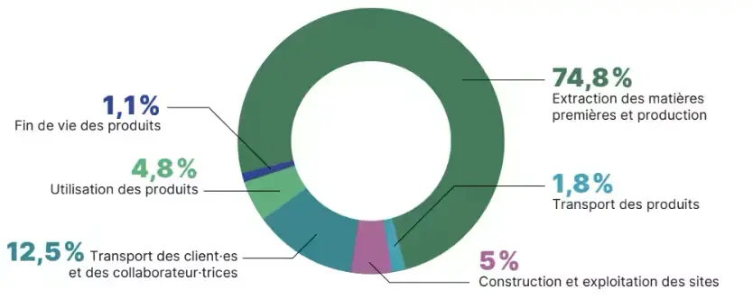
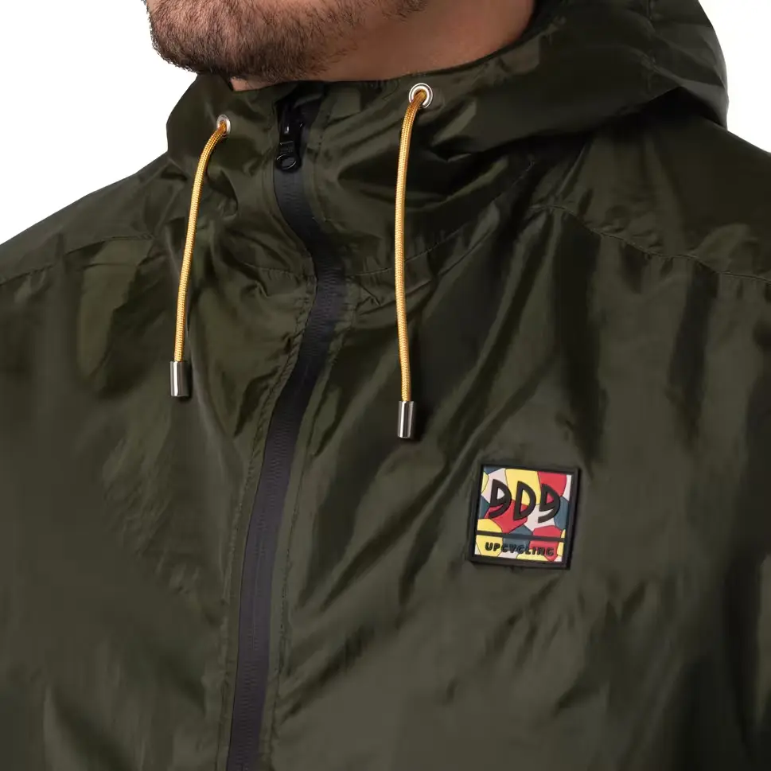
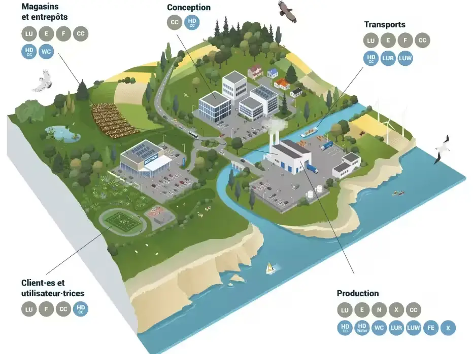
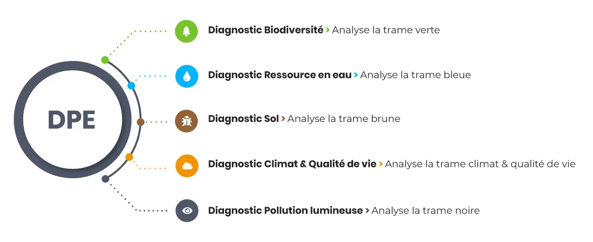



Pré-requis : Aucun



## Contenu

### Sommaire
1. Introduction
2. Stratégie
3. Management
4. Engagement écologique

### Introduction

Marque de sport mondiale multi-spécialiste s’adressant aux débutants comme aux athlètes de haut niveau, DECATHLON est un fabricant d’articles de sport innovants pour toutes les compétences. Avec 101 000 coéquipiers et 1750 magasins dans le monde entier, DECATHLON et ses équipes travaillent depuis 1976 pour atteindre une ambition continue : Move people through the wonders of sport (Faire bouger l’Humanité grâce à la magie du sport), pour aider les personnes à être en meilleure santé et plus heureuses dans un futur durable.

Decathlon dévoile en 2023 un nouveau plan stratégique pour les 5 prochaines années. Engagée à parvenir à la neutralité carbone d’ici 2050, les fondements de cette nouvelle stratégie quinquennale reposent sur trois piliers : rentabilité, digitalisation et préservation de l’environnement.

Decathlon consacre d'importants moyens techniques, financiers et humains à sa transformation vers un modèle durable. Toutes les branches de l'entreprise intègrent des personnes dédiées au développement durable. De plus, une partie des bonus des salariés, à tous les niveaux, est liée à ces objectifs. Les employés sont sincèrement engagés et soutenus par un management qui valorise les initiatives locales.


Comment Decathlon se positionne-t-elle parmi les entreprises les plus appréciées des Français ? Quelles sont les particularités qui la rende si attractive auprès des jeunes ?

.

<strong style="color:#3542ba; font-size:40px;"> 
STRATEGIE
</strong>

#### Nouvelle identité de marque et nouvelle ambition

Decathlon embrasse avec audace une nouvelle stratégie animée par la volonté de réaliser ses objectifs de croissance et de répondre aux impératifs écologiques et sociaux actuels.

Decathlon met en place un plan stratégique pour faire face à la concurrence croissante dans le secteur des équipements sportifs, accentuée par le rachat de Go Sport par Intersport. Ce repositionnement vise à renforcer la position de Decathlon sur le marché, notamment en simplifiant son offre. L’entreprise a décidé de réduire son portefeuille de 49 à environ 12 marques, afin d'améliorer l'efficacité de sa stratégie numérique, sa logistique et sa structuration, tout en clarifiant l’offre pour les consommateurs.

Du côté des clients, cette simplification permettra de mieux identifier les marques, rendant l’expérience en magasin plus fluide et moins déroutante face à une multitude de marques dans un même rayon.

Decathlon mise également sur quatre secteurs à forte croissance : le bien-être, le fitness, les mobilités douces et la randonnée, afin d'accentuer son développement dans ces domaines clés, tout en accélérant sa présence dans le e-commerce. Cette réorientation stratégique est conçue pour améliorer à la fois l'efficacité interne et l'expérience des clients.

#### Plan de transition 2020-2026

Selon le GIEC, atteindre la neutralité carbone d’ici le milieu du siècle est essentiel pour limiter le réchauffement à 1,5 °C, conformément à l’Accord de Paris. Decathlon s’inscrit dans cette stratégie en visant une réduction de 90 % de ses émissions de CO2 d’ici 2050 sur l’ensemble de sa chaîne de valeur, tout en prenant en compte l'augmentation des ventes.

Dans un premier tant, Decathlon vise à réduire de 42 % les émissions de gaz à effet de serre (GES) des scopes 1, 2 et 3 d'ici 2030, par rapport à 2021. 

Pour réaliser un bilan GES, les entreprises analysent les émissions de gaz à effet de serre selon trois périmètres appelés scopes :

Scope 1 : émissions directes (ex. : combustion de gaz dans les magasins).
Scope 2 : émissions indirectes liées à la consommation d’électricité.
Scope 3 : autres émissions indirectes provenant de la chaîne de valeur (fabrication, transport, déplacements, etc.).

Le bilan carbone de Decathlon est principalement lié aux produits (production, manufacture et utilisation) représentant près de 80% de son impact global. L'entreprise s'est fixée pour objectif que 100 % de ses produits soient éco-conçus d'ici 2026 pour réduire drastiquement son impact environnemental.

A court terme, elle s’est engagé à réduire de 20% des émissions de gaz à effet de serre, sans compensation, entre 2021 et 2026. Près d’un tiers de ces réductions doivent provenir de l’écoconception.


https://www.planetegrandesecoles.com/nouvelle-strategie-decathlon \
https://www.la-croix.com/economie/developpement-durable-decathlon-se-reve-en-champion-de-l-economie-circulaire-20241008 \
https://engagements.decathlon.fr/quel-plan-daction-pour-une-baisse-des-emissions-absolues-de-co2-eq

.

<strong style="color:#3542ba; font-size:40px;"> 
MANAGEMENT
</strong>

Decathlon fonctionne avec un management responsabilisant. C'est à dire qu'ils ont pour objectif de libérer le travail et l’esprit d’entreprise en responsabilisant ses salariés afin de développer leur potentiel entrepreneurial. Ce modèle de gestion favorise l'autonomie et la prise d'initiative, permettant à chaque collaborateur de prendre des décisions rapidement sans les lourdeurs d'une hiérarchie traditionnelle. 

Les employés ont la possibilité de s'impliquer activement dans la vie de l'entreprise, ce qui stimule leur créativité et leur engagement. 
Pour renforcer cet investissement, Decathlon a créé une plateforme interne regroupant toutes les offres d'emploi vacantes, accessibles à tous les collaborateurs, quelle que soit leur filière. Cela permet aux jeunes talents d'accéder à des postes à responsabilités, répondant ainsi à leurs aspirations professionnelles. Cette approche contribue à la **forte attractivité de Decathlon pour les nouvelles générations**.

Cependant, ce modèle présente également des inconvénients. En magasin, la pression pour atteindre des résultats entraîne une classification de ceux jugés comme "ni, ni" (ni potentiels, ni experts). Les managers ont ensuite la responsabilité d'identifier les erreurs répétitives commises par ces individus. Par ailleurs, les autres collaborateurs contribuent à l'évaluation de ces situations de manière indirecte, en observant et en écoutant. Cette dynamique peut créer un environnement de travail stressant où les employés craignent pour leur emploi si leurs performances ne sont pas à la hauteur. Il arrive que certains collaborateurs finissent par dépasser les 50 heures de travail par semaine.

Un talent à fort potentiel est donc également un salarié qui ne compte pas ses heures. Ainsi, il semble que la "libération d'entreprise" promue par la marque française, ainsi que son approche de management responsabilisant, favorisent le bien-être des employés. Cependant, cette dynamique soulève également des enjeux d'aliénation au travail.

Finalement, le management responsabilisant de Decathlon représente une avancée vers une organisation du travail plus autonome et engageante, mais il doit également faire face à des défis liés à la pression sur les performances et au risque d'une surcharge de travail pour certains employés.


https://changethework.com/management-responsabilisant-decathlon/

.

<strong style="color:#3542ba; font-size:40px;"> 
ENGAGEMENT ÉCOLOGIQUE
</strong>

.

<strong style="color:#3542ba; font-size:20px;"> 
LA CIRCULARITE
</strong>

#### Pionnière et Engagée avec des acteurs externes

Decathlon est reconnu comme l'une des entreprises pionnières en développement durable, selon Raphaël Guastavi, directeur adjoint à l'Ademe. 

Le premier "trocathlon", permettant aux particuliers de revendre leur ancien matériel, a été organisé en 1986, et des recherches sur l’écoconception ont débuté en 2006.

Après le Grenelle de l'environnement en 2007, l'entreprise a collaboré avec l’Ademe pour mettre en place un étiquetage informatif sur les impacts environnementaux des produits.

Bien que, Romain Demissy,spécialiste du développement durable au laboratoire de recherches Atemis, souligne que ces efforts ne sont pas suffisants face à l'urgence environnementale, Decathlon houe un rôle important en étant actif dans les groupes de travail en France et en Europe, puisqu'il influence d'autres acteurs grâce à sa taille et sa réputation. 

En 2023, Decathlon a déployé 46 référentiels de durabilité dans ses lignes de produits. Puis, elle partage ses recherches au sein d'un comité de l’AFNOR, qui travaille sur une norme de durabilité à venir en 2024. 

Enfin, Decathlon participe à un groupe de travail pour établir une méthodologie de calcul de l'impact carbone évité grâce à la durabilité, prévue pour 2024.

#### Durabilité, Réparabilité et Seconde vie

##### Allonger la durée de vie des produits

Decathlon a fait des avancées importantes en matière de durabilité et de réparabilité de ses produits.

Durabilité : Depuis 2020, des critères de résistance, fiabilité, performance et intemporalité des designs sont intégrés dès la conception des produits via un cahier des charges précis. Les ingénieurs disposent d’une feuille de route basée sur des tests, incluant des standards de durabilité comme le choix de composants plus résistants.

Réparabilité : Inspiré de l’indice de réparabilité français, Decathlon a défini des critères pour garantir la réparabilité de ses produits : accessibilité de la documentation, disponibilité des pièces détachées, démontabilité et coût de réparation inférieur à 30 % du prix d’achat. Cette démarche permet de couvrir une large part des pannes et défaillances.

Ces efforts en durabilité, réparabilité et recyclabilité contribuent à améliorer la performance des produits écoconçus et à soutenir l’économie d’usage, qui exige des articles robustes et facilement réparables.

##### Développer la réparation des produits

Decathlon mise sur la réparation en autonomie grâce à l'élargissement de l'offre de pièces détachées et l'intégration de la durabilité dès la conception des produits. L'objectif est d'atteindre 30 % de produits réparables d'ici 2026. La "réparation complète" repose sur quatre critères : démontabilité, disponibilité des pièces, coût, et documentation, selon les mêmes standards que l’indice de réparabilité de l’ADEME.

En 2023, moins de 3 % des produits atteignaient un taux de couverture de 80 % des défaillances, mais l’objectif pour 2030 est de 25 %. Certains produits, comme les trottinettes ou les trampolines, se concentreront sur la réparabilité, tandis que d'autres (ex. casques de vélo) privilégieront la recyclabilité ou la durabilité.

##### Améliorer de la recyclabilité des produits

Depuis plusieurs années, Decathlon s'efforce de concevoir des produits plus durables, en intégrant dès la conception des critères de résistance, fiabilité, performance à long terme et réparabilité. Depuis 2020, ces critères sont systématiquement inclus dans les produits écoconçus, avec des méthodologies et tests spécifiques. Un cahier des charges clair, basé sur des standards de durabilité, aide les ingénieurs à choisir des composants plus résistants, renforçant ainsi la longévité des produits.

##### Favoriser l'usage à la propriété

Decathlon vise à transformer son modèle économique pour aligner ses activités avec les limites planétaires tout en maintenant sa viabilité financière. Cela passe par le développement de l'économie d'usage et de la fonctionnalité, où l'usage prime sur la propriété. L'objectif est de permettre la réparation, la location, la revente et la réutilisation des produits aussi longtemps que possible, et de les recycler en dernier recours. Cette transformation nécessite une refonte complète de la chaîne de valeur, basée sur les besoins des utilisateurs. L'expansion de services comme la location, la réparation et la seconde vie permettra à Decathlon de réduire son impact environnemental et de promouvoir un accès plus responsable au sport.

##### Développer la seconde vie des produits

Decathlon accélère le développement de l'économie circulaire en intégrant le chiffre d'affaires circulaire dans ses reportings financiers. En 2023, 43 pays proposent des produits de seconde vie, avec des solutions digitales pour encourager l'économie circulaire. Les articles remis sur le marché sont soumis à des contrôles qualité stricts.

*Upcycling* : Des produits comme les [vestes softshell 909](https://www.decathlon.fr/p/mp/909/veste-upcyclee-impermeable-et-coupe-vent-softshell-graphite-homme/_/R-p-5acf8dc7-b2d3-4106-a847-c42e2f4b2894) sont créés à partir de matériaux upcyclés, tels que des toiles de tente(marque [909-upcycling](https://www.909-upcycling.com/blogs/communique-de-presse/les-tentes-devenues-vestes)).

*Système de reprise (buy back)* : Le système de reprise permet aux clients de revendre leurs articles, disponible dans 11 pays, dont la Belgique, la France, et plus récemment, l'Allemagne et le Royaume-Uni.

*Location de produits* : En 2023, Decathlon propose deux types de location :

- Location de courte durée (17 pays), générant 14 millions d’euros de chiffre d'affaires.
- Location mensuelle par abonnement (5 pays), ciblée sur les vélos pour enfants.
Ces initiatives contribuent à un modèle d'affaires plus durable.

**Chiffre d'affaires circulaire** : 2,27 % du chiffre d'affaires mondial provient de la seconde vie, de la location et de la réparation des produits.

##### Etablir l'indicateur de durabilité et réparabilité

Les sources d'informations pour l'analyse des défauts chez Decathlon incluent :

- Retours clients : Lorsqu'un produit est retourné, l'entreprise identifie les causes du retour, ce qui constitue la principale source d'information en termes de quantité.
- Produits loués : retournés par les clients, cela permet de collecter des données sur leur durée de vie, les points de casse ou d'usure, et les coûts de nettoyage et de réparation. 
- Analyse approfondie : Certains retours sont envoyés aux équipes de conception pour des analyses plus détaillées.
- Études clients : Des études spécifiques sont menées sur certains types de produits pour comprendre leur utilisation au-delà de la période de garantie, y compris sur les produits endommagés qui ne sont pas retournés.
- Pièces détachées : Pour certains produits, les données sur les ventes de pièces détachées peuvent également servir d'indicateur.

Ces informations aideront à prolonger la durée de vie des produits et à améliorer leur réparabilité.

#### Label d'écoconception

Pour qu'un produit soit labellisé écoconçu par Decathlon, il doit respecter au moins un critère, tel que réduire l'impact carbone de 10 % par rapport à un modèle précédent ou prolonger sa durée de vie de plus de 30 %. Un produit est également considéré comme écoconçu si ses matières principales contiennent au moins 70 % de polyester recyclé ou 90 % de coton biologique. 

Cependant, en septembre 2022, l'Autorité des marchés de consommation aux Pays-Bas a rappelé Decathlon à l'ordre pour un usage abusif du terme "écoconception", ce qui a conduit l'entreprise à clarifier ses critères en attendant une réglementation gouvernementale. 

De plus, pour qu'un produit soit reconnu comme écoconçu, il doit couvrir 80 % des casses et pannes liées à sa nature, avec une distinction entre les produits facilement réparables, comme les vélos, et ceux ayant subi des améliorations en matière de réparabilité. En 2023, 6 % de l'ensemble des produits de Decathlon ont bénéficié d'une démarche d'écoconception. Toutefois, 39 % des produits vendus ont bénéficié d'une approche d'écoconception, contre 23 % en 2022.

#### Contradictions

##### Concilier l’écoconception et la performance sportive

L'équilibre entre l'écoconception et la performance sportive est délicat. Pour améliorer la durabilité, les matières imperméables doivent être épaissies, ce qui alourdit les produits, tandis que le coton recyclé, moins résistant, est limité à 30 % dans les produits en coton de DECATHLON. Depuis 2018, la marque a converti toute sa gamme de vestes en polyester au polyester recyclé, mais cette matière pose toujours le problème des fuites de microplastiques. Pour y remédier, DECATHLON analyse les "hotspots" dans le cycle de vie des produits, identifiant les moments clés pour intervenir, que ce soit lors de la fabrication ou des lavages.

##### Doutes

Malgré les avancées vers une économie circulaire, des inquiétudes subsistent quant à un ralentissement des efforts de Decathlon. La montée de l'inflation a conduit l'entreprise à se concentrer sur la logique du volume pour maintenir ses résultats, ce qui pourrait nuire à ses initiatives durables, selon Emmanuelle Ledoux de l’Institut national de l’économie circulaire. Un rapport de Bain&Company révèle que l'intérêt des dirigeants pour la transition écologique a diminué de 30 %. Ledoux souligne qu'adopter un modèle circulaire implique souvent d'accepter des performances économiques inférieures, du moins durant la phase de transition, et il reste à voir si les actionnaires sont prêts à ce renoncement. De plus, le départ en 2018 de Matthieu Leclercq de la présidence du groupe a mis en lumière des tensions internes, la famille Mulliez, majoritaire au capital, favorisant les performances économiques aux objectifs environnementaux, tandis que les Leclercq sont plus sensibles à ces enjeux.

Decathlon est confronté à des contradictions inhérentes à sa transformation vers l’écoconception. Bien que l'enseigne maîtrise ce domaine, elle continue de produire un grand nombre de nouveaux articles (1 800 par an), ce qui entraîne une demande croissante de matières premières et limite son impact environnemental. Romain Demissy, spécialiste du développement durable, souligne qu'à moins de rompre avec la logique de volumes, Decathlon ne pourra pas dépasser un "plafond de verre" en matière d'impact écologique.

En réponse à ces critiques, l'entreprise met en avant sa hausse de l'utilisation de matières recyclées, comme le coton, et affirme vouloir devenir un leader de l'économie circulaire. Anna Turrell indique que cette approche devrait réduire progressivement la vente de nouveaux produits, en raison de l'augmentation de la demande pour des solutions de seconde vie et de location. Cependant, Decathlon n'a pas encore défini de trajectoire chiffrée pour diminuer ses volumes, une étape essentielle pour atteindre la neutralité carbone.

De plus, la stratégie de Decathlon de proposer des produits à bas prix, alignée avec son engagement "sport pour tous", encourage l'achat de nouveaux articles, ce qui n'est pas propice à la durabilité ou à la réparation. L’ambition de devenir une marque emblématique, comparable à Nike ou Adidas, pourrait également inciter à une consommation accrue, selon des sources internes. Malgré ces contradictions, Romain Demissy estime qu'un changement de paradigme est observable, notamment avec le chiffre d'affaires circulaire de Decathlon, qui a atteint 2,3 % du chiffre d'affaires total en 2023, avec un objectif de 3 % d'ici fin 2024.

#### Résultats d'une évolution vers une économie circulaire

En 2023, Decathlon a réalisé 40 % de ses ventes grâce à des produits écoconçus. Rappelons qe l'entreprise à pour objectif que 100 % de ses articles soient écoconçus d'ici 2026. Elle a ainsi réduit ses émissions de CO2 de 10 % par rapport à 2022, tout en augmentant son chiffre d'affaires.

Pour la deuxième année consécutive, Decathlon a réussi à dissocier sa croissance de ses émissions de CO2, marquant une accélération de la tendance amorcée en 2022.

Parmi les résultats marquants de 2023 :

- Le système de reprise en magasin est disponible dans 11 pays.
-L'abonnement mensuel a atteint 60 000 contrats dans 5 pays, générant 6 millions d’euros (contre 20 000 contrats et 1,3 million en 2022).
- 70,6 % des produits réparables ont été réparés (vs 66,5 % en 2022).
- Les ventes circulaires ont représenté 420 millions d’euros, soit une augmentation significative de +27% par rapport à 2022.


https://www.la-croix.com/economie/developpement-durable-decathlon-se-reve-en-champion-de-l-economie-circulaire-20241008 \
https://www.planetegrandesecoles.com/decathlon-we-play-circular \
https://engagements.decathlon.fr/circulariser-evoluer-vers-une-economie-circulaire \
https://engagements.decathlon.fr/lindex-de-reparabilite-chez-decathlon\
https://www.novethic.fr/actualite/environnement/economie-circulaire/isr-rse/comment-decathlon-veut-atteindre-100-de-produits-ecoconcus-en-2026-151436.html \
https://engagements.decathlon.fr/quel-plan-daction-pour-une-baisse-des-emissions-absolues-de-co2-eq \
https://www.decathlon.fr/p/mp/909/veste-upcyclee-impermeable-et-coupe-vent-softshell-graphite-homme/_/R-p-5acf8dc7-b2d3-4106-a847-c42e2f4b2894 


#### ZOOM : We play circular

Le projet *We Play Circular*, lancé par Decathlon en 2020 en Belgique, visait à explorer un modèle d’économie circulaire basé sur un système d'abonnement pour la location d’équipements sportifs. Proposant trois formules mensuelles, les clients pouvaient louer du matériel d’une valeur comprise entre 400 € et 2 000 €, pour un coût allant de 20 € à 80 €. Ce modèle était particulièrement adapté aux familles, qui ont souvent besoin de renouveler ou d'adapter leur matériel en fonction de la croissance des enfants et de la variété des activités pratiquées.

Les avantages de ce modèle étaient multiples. Il permettait aux familles de réduire leurs dépenses, en accédant à du matériel coûteux pour une fraction du prix d’achat, tout en offrant une grande flexibilité dans l'utilisation des équipements. Du point de vue écologique, cette initiative participait à la transition vers l’économie circulaire, en favorisant la réutilisation et la mutualisation des ressources. Cela réduit la production de nouveaux articles et donc l'impact environnemental. De plus, les premiers résultats ont montré que ce modèle était potentiellement très rentable pour Decathlon, avec des marges de profit trois à dix fois supérieures à celles du modèle classique de vente.

Cependant, malgré ces avantages apparents, le projet a été abandonné, soulevant des interrogations sur sa viabilité à long terme. Anne Turrell, porte-parole de Decathlon, n'a pas donné les raisons exactes de l'abandon, sans préciser si la baisse des ventes ou la rentabilité à long terme avaient joué un rôle dans cette décision. Un des défis principaux de ce type de modèle est la nécessité de maintenir un équilibre entre la location et la vente, surtout pour un acteur dont le modèle historique repose sur la vente de produits neufs et qui ne souhaite pas changer cet aspect.


L’abandon du projet *We Play Circular* illustre les défis rencontrés par les entreprises lorsqu’elles tentent de concilier rentabilité, durabilité et transition écologique. Bien que l'initiative ait montré un fort potentiel, elle pose la question de savoir si les entreprises sont prêtes à adopter des modèles véritablement durables à long terme, même lorsque ceux-ci perturbent leurs modèles économiques traditionnels. Elle soulève également la question de la capacité des entreprises à faire évoluer leurs offres de manière suffisamment rapide pour répondre aux enjeux environnementaux tout en assurant leur pérennité économique.



https://www.la-croix.com/economie/developpement-durable-decathlon-se-reve-en-champion-de-l-economie-circulaire-20241008 \
https://www.planetegrandesecoles.com/decathlon-we-play-circular

.

<strong style="color:#3542ba; font-size:20px;"> 
LA BIODIVERSITE
</strong>

Les 2 principaux impacts de Decathlon sur la biodiversité sont :

- Production des articles : Ce processus englobe l'extraction des matières premières, la fabrication des produits et leur transport, engendrant une consommation significative de ressources planétaires et des émissions de CO2.

- Magasins : Avec une surface de vente totale de 14 millions de m², les magasins de Decathlon contribuent à l'artificialisation des terres, ce qui a des conséquences néfastes sur les écosystèmes locaux.

Le calcul de l'empreinte sur la biodiversité avec l'outil [GBS®](https://www.cdc-biodiversite.fr/le-global-biodiversity-score/) permet de distinguer l'impact cumulé, qui tient compte des activités passées de l'entreprise, de l'impact annuel, qui se rapporte aux actions de DECATHLON sur l'année précédente. Cet outil se concentre sur les écosystèmes terrestres et d'eau douce (car les écosystèmes marins ne sont pas encore inclus). Il couvre toutes les activités de DECATHLON sur les scopes 1, 2 et 3, ainsi que sur la Marketplace depuis 2023.

EN 2023, DECATHLON a établi pour la première fois un objectif de réduction de son impact annuel sur les écosystèmes terrestres, visant une diminution de 6 % d'ici 2026 par rapport aux mesures de 2021 pour les scopes 1, 2 et 3.

#### Réduire l'impact des magasins

DECATHLON s'engage à réduire l'impact de ses magasins sur la biodiversité en adoptant des aménagements favorables à l'écosystème. Avant chaque nouvelle construction, l'entreprise effectue un diagnostic basé sur 74 critères de biodiversité prenant notamment en compte les continuités écologiques, les ressources en eau, la densité végétale, la pollution lumineuse, le climat, la qualité de vie.

**Exemple du** [**site expérimental de Saint-Jouan-des-Guérêts**](https://www.youtube.com/watch?v=yUV9sjUXFoA) **à St-Malo** :

Saint-Jouan-des-Guérêts est un site pilote où plusieurs mesures de préservation de la biodiversité ont été mises en place. Ce projet vise à limiter les effets négatifs de l'urbanisation en utilisant des friches ou des terres agricoles en monoculture.

Les aménagements se concentrent sur quatre axes principaux pour favoriser les corridors écologiques. \
La trame *verte* : elle permet de favoriser la circulation et les habitats des espèces, avec un terrain non clôturé, du fauchage tardif 🌾, ainsi qu’une densité et une variété de la flore. 🌱 De cette manière, les animaux sont libres de circuler, de se nourrir, de se reproduire et de se cacher dans la végétation, dans les nichoirs 🐦‍⬛ ou hôtels à insectes 🦗 disposés sur la parcelle. La végétation permet de filtrer les polluants (séquestration carbone) et de créer des îlots de fraîcheur. \
La trame *bleue* : il s’agit ici de lutter contre l’imperméabilisation des surfaces et de réduire la vitesse d’écoulement des eaux, pour une meilleure gestion des eaux pluviales. Le fossé végétalisé et le bassin d’infiltration, véritables zones d’habitat humide, permettent aux espèces aquatiques 🐟 de se développer. Ils limitent également les risques d’inondation et permettent de recharger les nappes phréatiques. \
La trame *brune* : 25 % de la diversité se trouve dans les sols. De la même manière, le pari était de préserver une continuité dans le sous-sol afin de favoriser le développement des champignons 🍄‍🟫 et bactéries. Sans une terre aérée, il n’y a pas non plus de trame verte en bon état. C’est pourquoi la zone est entretenue en écopâturage. Un troupeau de moutons 🐏 broute la parcelle, plutôt que de faire appel à de lourdes tondeuses qui tasseraient le terrain. \
La trame *noire* : il s’agit ici de préserver la faune nocturne. L’éclairage a été pensé pour la gêner le moins possible. Cela se traduit par des éclairages orientés vers le bas, équipés de capteur pour s’allumer lorsqu’il y a du passage. Des refuges à chauve-souris 🦇 ont également été prévus.

Enfin, 2 ruches ont été installées. 🐝 Elles sont un bon indicateur de la naturalité de la parcelle et des alentours. À Saint-Jouan, elles produisent 22 kg de miel 🍯, quand 3,5 kg sont attendus en moyenne ailleurs. Cela signifie qu'elles ont un ecosystème varié à proximité, car elles ont peu de kilomètres à parcourir.

Des aménagements similaires ont été menés sur le site de Lorient et 14 dossiers sont en cours de déploiement selon cette même démarche L’objectif est d’obtenir le label ["Signature Biodiversité"](https://signature-biodiversite.com/dpe/), certification environnementale, pour 100 % des futurs aménagements fonciers neufs en France. Les efforts de l’entreprise se poursuivent pour atteindre l’ambition de 10 % du parc immobilier français intégrant la démarche de renaturation ["Signature Biodiversité"](https://signature-biodiversite.com/dpe/).

#### Réduire l'impact des matières premières

En 2023, DECATHLON a mis en lumière les matières premières les plus impactantes de sa chaîne de valeur grâce à l'outil [GBS®](https://www.cdc-biodiversite.fr/le-global-biodiversity-score/), permettant ainsi à ses équipes de mieux prioriser les actions de remédiation. Les résultats préliminaires ont identifié le **coton** et le **métal** comme des matières clés à cibler pour réduire l'impact de l'entreprise sur les écosystèmes. Ce projet vise à améliorer la fiabilité des données et à identifier d'autres matières premières ainsi que leurs alternatives, tout en définissant les procédés industriels nécessaires pour atteindre ces objectifs.

DECATHLON met l'accent sur l'économie circulaire et l'écoconception comme principaux leviers pour réduire son empreinte carbone, qui provient à 74 % de l'extraction de matières premières et de la fabrication de ses articles en 2023. L'entreprise s'efforce d'utiliser moins de matières premières tout en privilégiant celles qui sont durables et peu émettrices de CO2. Ses principaux champs d'action incluent :

- Investir dans des matières premières plus durables : Cela contribue à réduire significativement les émissions de CO2, notamment dans les secteurs du métal, du textile et de la chaussure.

- Concevoir avec moins de matières premières : L'optimisation fonctionnelle et technique est au cœur de cette démarche.

- Préférer des matières premières moins émettrices de GES : Par exemple, utiliser du bois plutôt que du métal.

- Augmenter la part recyclée des matières premières : Cette augmentation doit se faire jusqu'à la limite technique, sans compromettre la qualité des produits.

- Privilégier les matières premières recyclables en fin de vie : Cela renforce la durabilité des produits.

Cette année, DECATHLON a également commercialisé la première combinaison en caoutchouc naturel au monde, illustrant son engagement envers des matériaux innovants et durables.

Dans le cadre de sa stratégie d'écoconception, l'entreprise modifie également sa palette de couleurs en abandonnant les teintes flashy au profit de couleurs pastel, plus économes en énergie et en ressources. Estelle Laboulle, ingénieure produit chez Quechua, explique que cette approche permet d'économiser jusqu'à 15 % de CO2 et 12 % d'eau grâce à l'utilisation de couleurs brutes comme le grège et à des techniques de teinture innovantes telles que la teinture "dope-dyed".

En outre, la gamme "Minimal editions local", produite en Europe à partir de matières recyclées et conçue pour minimiser les déchets, permet de réduire les émissions de CO2 de 70 % par rapport à une production traditionnelle en Asie. Bien que la production en Europe engendre des coûts plus élevés, DECATHLON s'efforce de ne pas répercuter entièrement ces augmentations sur les consommateurs. L'intégration de l'écoconception dans le processus habituel de conception garantit également que ces changements ne prolongent pas le délai de production.


https://engagements.decathlon.fr/la-biodiversite-et-decathlon \
https://www.la-croix.com/economie/developpement-durable-decathlon-se-reve-en-champion-de-l-economie-circulaire-20241008 \
https://engagements.decathlon.fr/quel-plan-daction-pour-une-baisse-des-emissions-absolues-de-co2-eq \
https://www.novethic.fr/actualite/environnement/economie-circulaire/isr-rse/comment-decathlon-veut-atteindre-100-de-produits-ecoconcus-en-2026-151436.html


### Sources
https://signature-biodiversite.com/dpe/ \
https://www.cdc-biodiversite.fr/le-global-biodiversity-score/ \
https://www.decathlon.fr/p/mp/909/veste-upcyclee-impermeable-et-coupe-vent-softshell-graphite-homme/_/R-p-5acf8dc7-b2d3-4106-a847-c42e2f4b2894 \
https://www.909-upcycling.com/blogs/communique-de-presse/les-tentes-devenues-vestes \
https://www.decathlon.media/Static/dossier-presse/2024/new-identity/v1.7.1/--livrables--/pdf/Decathlon-Media_La-Nouvelle-ambition-de-Decathlon_DP-FR.pdf \
https://fr.wikipedia.org/wiki/Decathlon_(entreprise) \
https://www.la-croix.com/economie/developpement-durable-decathlon-se-reve-en-champion-de-l-economie-circulaire-20241008 \
https://www.planetegrandesecoles.com/decathlon-we-play-circular \
https://engagements.decathlon.fr/la-biodiversite-et-decathlon \
https://engagements.decathlon.fr/circulariser-evoluer-vers-une-economie-circulaire \  
https://engagements.decathlon.fr/lindex-de-reparabilite-chez-decathlon \
https://engagements.decathlon.fr/quel-plan-daction-pour-une-baisse-des-emissions-absolues-de-co2-eq \
https://www.novethic.fr/actualite/environnement/economie-circulaire/isr-rse/comment-decathlon-veut-atteindre-100-de-produits-ecoconcus-en-2026-151436.html \
https://changethework.com/management-responsabilisant-decathlon/ \
https://www.planetegrandesecoles.com/nouvelle-strategie-decathlon

