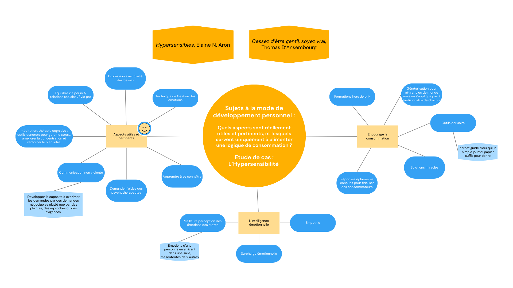
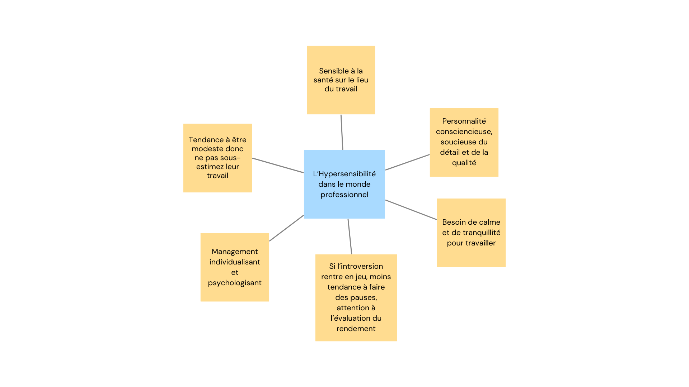



Pré-requis : Aucun




**Références**
- Aron, Elaine N., et Marie-Luce Constant. *Hypersensibles: mieux se comprendre pour s’accepter.* Marabout, 2017.
- D’Ansembourg, Thomas, et Guy Corneau. *Cessez d’être gentil, soyez vrai ! être avec les autres en restant soi-même.* Éd. limitée, les Éd. de l’homme [diff. Messageries ADP], 2010.


## Contenu

Je me suis orientée vers la lecture de ces deux ouvrages, considérés comme les références de ce MON, car j'ai considéré qu’en management, il est essentiel de commencer par une meilleure connaissance de soi pour ajuster ses réactions. Ensuite cela permet également de mieux comprendre les comportements des autres.

Cependant, comme les thèmes liés au développement personnel sont populaires et largement médiatisés en ce moment, ils soulèvent des interrogations : comment distinguer ce qui est véritablement utile de ce qui relève d’un simple effet de mode ou d’une logique commerciale ? Il s’agit d'avancer dans ces lectures sans se laisser influencée de manière excessive ou biaisée, mais ce n'est pas forcémenent simple ...

J’ai donc écrit quelques clés pour garder un esprit critique à la lecture de ces livres et ai extrait des éléments de réponse à cette question. Ces réflexions sont synthétisées et présentées sous forme de schéma, afin de mieux visualiser les idées leurs liens.

Pour introduire brièvement le sujet, l’**hypersensibilité** se définit par une plus grande réceptivité aux stimuli extérieurs, qu'ils soient sensoriels (bruits, lumières, textures), émotionnels (relations, réactions) ou environnementaux (changement, stress). Elle se manifeste par une intensité émotionnelle plus élevée et une facilité à être submergé mais également par un soucis du travail de qualité et une grande empathie.

L'**hypersensibilité au travail** est un sujet que j'ai choisi d'explorer davantage, car il représente une dimension pertinente pour le management des années à venir. J'ai approfondi mes recherches pour mieux comprendre les enjeux et les implications pratiques de ce trait dans le contexte professionnel.

