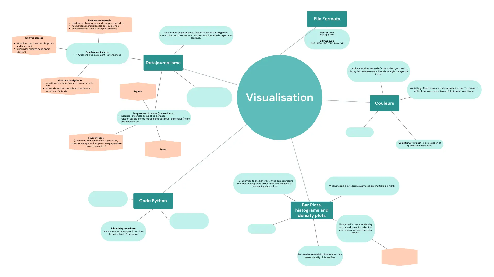
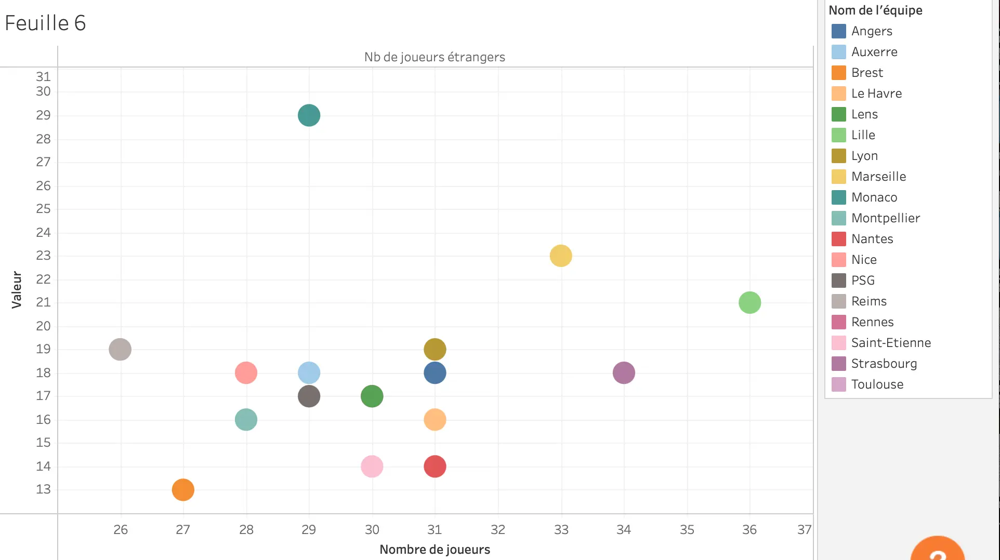
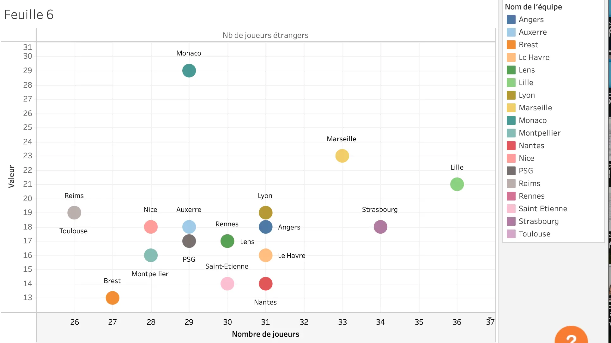
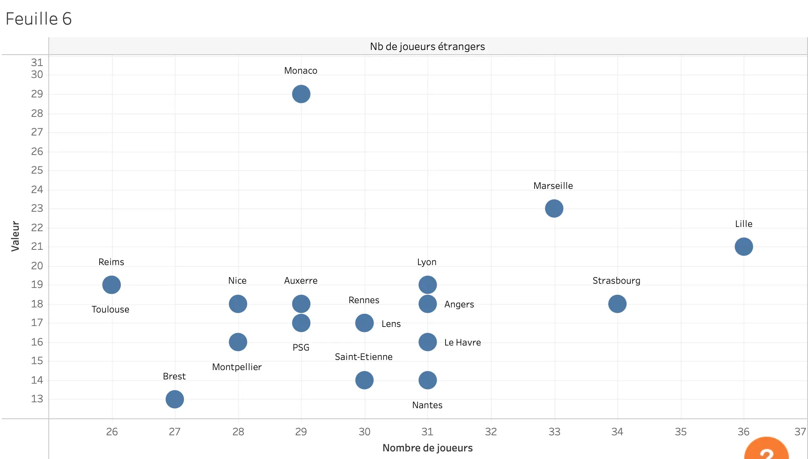
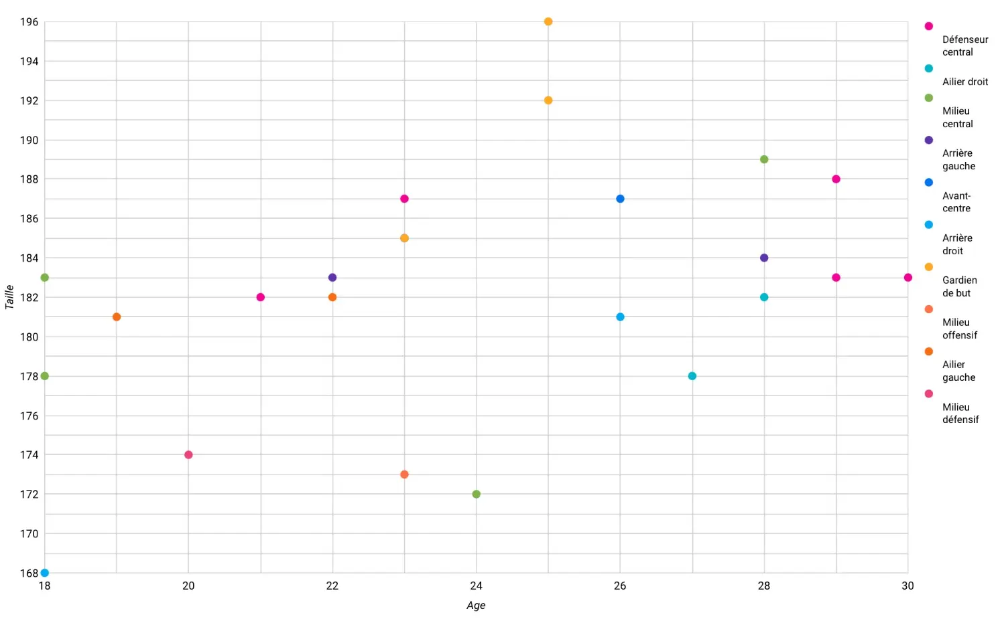



Pré-requis : Aucun




**Références** 
- Wilke, Claus. *Fundamentals of Data Visualization: A Primer on Making Informative and Compelling Figures.* First edition, O’Reilly, 2019. 
- Bertin, Jacques. *La graphique et le traitement graphique de l’information.* Flammarion, 1977.
- Yikun, Liu, et Dong Zhao. *La datavisualisation au service de l’information.* Pyramyd, 2016.


## Contenu

J’ai souhaité approfondir le sujet de la datavisualisation et de la représentation des données afin qu’elles soient non seulement percutantes, mais surtout compréhensibles rapidement et sans risque d’erreurs d’interprétation. Une datavisualisation mal interprétée équivaut à un échec de communication, compromettant le but même de ce travail.

Mon objectif était de me familiariser avec la théorie de la datavisualisation pour pouvoir ensuite l’appliquer dans un futur projet, en créant des visualisations qui servent efficacement un message. Pour cela, je me suis concentrée sur la théorie et les principes fondamentaux de la **datavisualisation** et de la **sémiologie** à travers les trois ouvrages de référence cités plus haut.


**Datavisualisation** : Discipline qui consiste à transformer des données complexes en représentations visuelles claires et compréhensibles. Elle vise à faciliter l’analyse, la compréhension et la prise de décision en exploitant des graphiques, diagrammes ou cartes adaptés au contenu et au public cible.

**Sémiologie** : Etude des signes, de leurs significations et de leurs usages dans un système de communication donné. En datavisualisation, elle examine comment les formes, couleurs, tailles ou symboles graphiques sont interprétés par l’utilisateur pour transmettre une information de manière intuitive et efficace. *(Exemple : Jacques Bertin, pionnier en sémiologie graphique)*.



Cette carte mentale n’est pas exhaustive, mais elle rassemble les éléments clés que je retiens de mes lectures et que je considère comme des outils essentiels à emporter dans mes futures réalisations. Je laisse de la place à disposition pour la compléter au fur et à mesure de mes expériences futures. Bien sûr, ces ouvrages contiennent d’autres informations précieuses, et il serait pertinent de s'y référer à chaque nouvelle situation nécessitant la création de visualisations et de graphiques à partir de données, pour faire le moins d'erreur possible.

### Exemples d'application

Voici quelques exemples concrets où j’ai pu transmettre à mes camarades les conseils issus des lectures sur la datavisualisation. Ces échanges ont eu lieu alors qu’ils réalisaient des graphiques d’analyse de données.

#### Exemple 1

Jeanne avait produit un graphique illustrant le nombre de joueurs étrangers par rapport au nombre total de joueurs dans différents clubs de football français. Nous avons constaté qu’il était difficile d’identifier quel point correspondait à quel club.

Son graphique utilisait plus de huit couleurs différentes, rendant la lecture confuse. En nous appuyant sur l’un des principes de [`Fundamentals of Data Visualization`](https://clauswilke.com/dataviz/s) "Utilisez des étiquettes directes plutôt que des couleurs lorsque vous devez distinguer plus de huit catégories.", nous avons ajouté des étiquettes directement sur les points. Le résultat était nettement plus clair, permettant une identification rapide et précise des clubs.

En poursuivant les tests, nous avons même constaté que les couleurs n’étaient pas nécessaires : les étiquettes seules suffisaient à rendre le graphique compréhensible. La couleur, bien qu’esthétique, peut parfois ajouter de la confusion plutôt que de la clarté si elle n’est pas utilisée judicieusement.

#### Exemple 2

Dans un autre graphique, qui classait les joueurs par âge et par taille tout en établissant une cohérence avec leur poste dans l’équipe, très chargé en couleurs, j’ai proposé de regrouper les catégories en utilisant des nuances similaires pour une meilleure lisibilité.

Ce qu'elle a fait dans cet exemple :
- Jaune pour les gardiens de but,
- Bleu pour les attaquants,
- Rose pour les défenseurs.

Cela a permis une meilleure organisation visuelle, mais deux points méritaient encore d’être améliorés :

1. Augmenter la taille des points pour rendre les catégories plus visibles.
2. Améliorer la distinction entre les nuances de bleu, qui restaient trop proches visuellement.

Ces ajustements ont aidé à mieux transmettre l’information tout en restant fidèle aux principes d’une visualisation efficace et intuitive.
