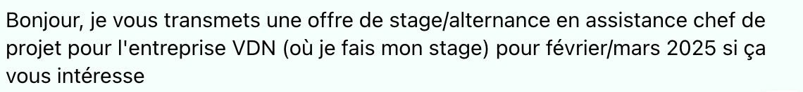
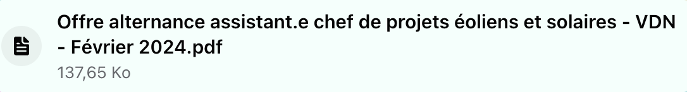
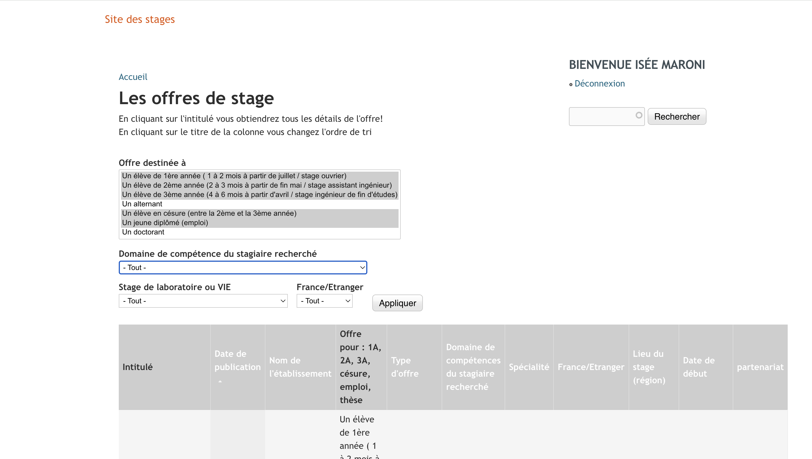
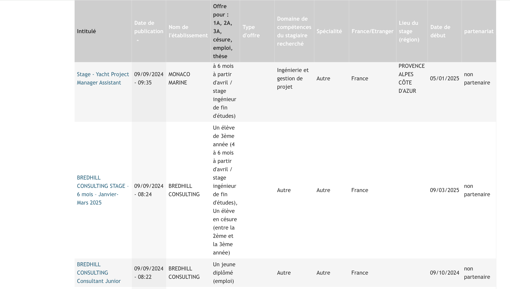
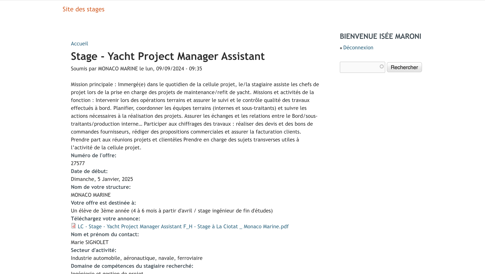
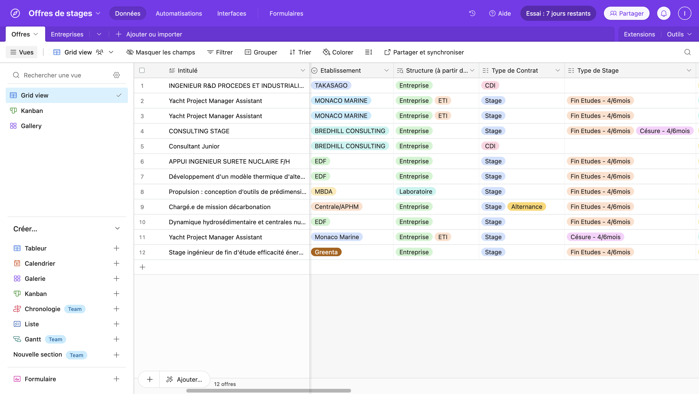
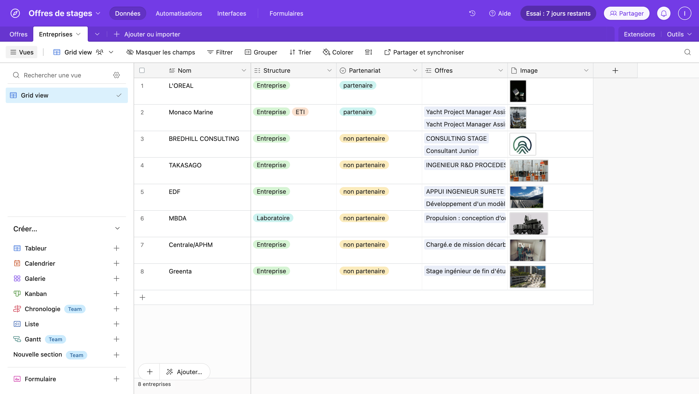
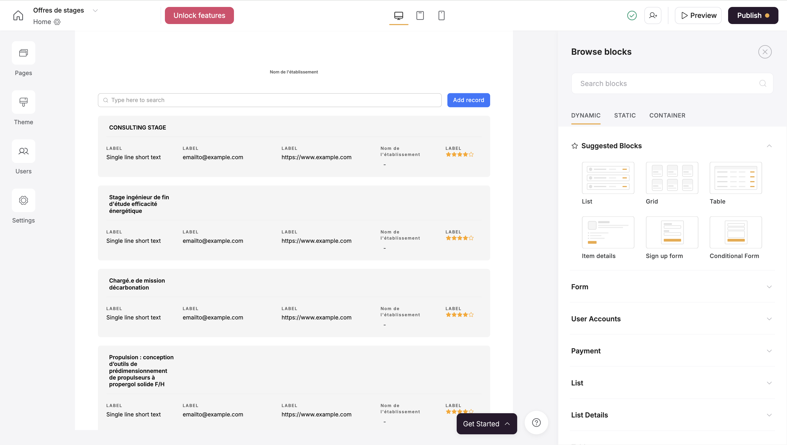



Niveau débutant

Connaitre les bases de Airtable et Softr.




[`MON Apprentissage Airtable & Softr `](././mon/temps-1.1/)



## Tâches

#### Sprint 1

Liste des taches que l'on pense faire. On coche si la tache est réalisée. A la fin du sprint on fait une petite étude post-mortem pour voir ce qui s'est passé et les ajustement à faire pour le prochain sprint, pok.

- [x] Définition des utilisateurs et usages de l'application web.
- [x] Construction de la base de données sur *Airtable* (tables **Offres** et **Entreprises**).
- [x] Supprimer et rajouter les champs nécessaires.
- [x] Lier les bases et automatiser l'ajout d'une nouvelle entreprise dans la table dès qu'une offre associée à une entreprise inédite est créée.
- [x] Création de l'application web *Softr* et connexion à *Airtable*
- [x] Réalisation de la page **Offres** : affichages, photos, choix des informations, filtres.
- [ ] Configurer le formulaire conditionnel pour l'ajout de nouvelles offres

*Note post-mortem :*
Le formulaire pour l'ajout de nouvelles offres créé avec Softr ne m'a pas convaincu, c'est pourquoi j'ai décidé de ne pas le conserver. Lors du prochain sprint, je vais créer un formulaire avec Airtable, qui permettra d'intégrer des conditions. Cela signifie que l'affichage des questions suivantes dépendra des réponses apportées aux questions précédentes, offrant ainsi une expérience plus dynamique et personnalisée.

### Premier Sprint

### Sommaire
1. Etude du besoin
2. Base de données *Airtable*
3. Début de l'application web avec *Softr*

## 1. Etude du besoin

**Utilisateurs:**
- C*entralien à la recherche d'un stage* : cherche de l'inspiration, à voir ce qui existe autour OU a un objectif de secteur d'activité, de mission et de ville bien précise
- *Centralien transmettant une offre de son entreprise* : rend service à l'entreprise chez qui il a été en stage pendant 1 à 6 mois, dépanne d'autres camarades dont il partage la situation
- *Centralien recrutant pour son entreprise* : jeune diplômé à la tête d'une start-up OU cadre profitant du réseau Alumnis
- *Membre de l'administration* : poste une offre d'une entreprise partenaire de l'école

Voici un exemple d'offres de stages transmises par des centraliens sur des groupes Facebook ou conversation de promotion qui sont vites perdues.

## 2. Base de données *Airtable*
Pour cette étape, je suis d'abord allée sur le site des stages pour examiner les offres mises en ligne destinées aux centraliens. Je souhaitais voir quelles informations étaient fournies, lesquelles étaient pertinentes pour l'utilisateur principal (le centralien) ainsi que pour les gestionnaires du site, en l'occurrence l'administration de Centrale.

Un exemple du site des stages de Centrale Méditerranée :

À partir de là, j'ai réfléchi aux informations que j'allais conserver, celles que je supprimerais, et celles qu'il serait utile d'ajouter.

Puis j'ai créé la base de données Offres de stages contenant les tables **Offres** et **Entreprises**

## 3. Début de l'application web avec *Softr*

La première page que j'ai créée pour l'application web est la page des **Offres**. Je voulais qu'elles soient toutes visibles sur la même page, que l'on puisse défiler et que les informations les plus importantes soient visibles en un coup d'oeil. Les informations les plus importantes à mes yeux sont l'intitulé, l'entreprise, le secteur d'activité, la durée du stage et le type de missions (parfois présent dans l'intitulé)
Pour améliorer la page des offres et optimiser l'expérience utilisateur, j'ai ajouté les tags, des images et des filtres, y compris des filtres conditionnels, afin de . En m'inspirant de sites spécialisés dans les offres d'emploi, j'ai observé quelles informations étaient mises en avant et quelles sections étaient accessibles aux utilisateurs pour répondre au mieux à leur besoin.

Voici quelques étapes intermédiaires de la page Offres liée à la base de données *Airtable* :

Les pages suivantes que je vais créer sont les pages **Home** et **Offre-Details** auquelle on accèdera en cliquant sur la vignette correspondante de la page **Offres**.

#### Sprint 2

Airtable
-champ lieu : automatisation ville, région et vice versa
-choisir les données pertinentes à mettre dans un questionnaire (le moins possible)

Softr
- Rajouts de filtres : lieu, secteur, profil étudiant
- Rajouter date de publication ?
- Page Home 
- Page Details offre ( offres cliquables)
- Ajouter header et footer
- Choix des couleurs et du logo

- [ ] Une tâche non réalisée
- [x] Une tâche réalisée

Liste des taches que l'on pense faire. On coche si la tache est réalisée. A la fin du sprint on fait une petite étude post-mortem pour voir ce qui s'est passé et les ajustement à faire pour le prochain sprint, pok.

### Horodatage

Toutes les séances et le nombre d'heure que l'on y a passé.

| Date | Heures passées | Indications |
| -------- | -------- |-------- |
| Mardi 10/09  | 1H  | Etude du besoin et définition des utilisateurs |
| Mardi 10/09  | 1H  | Récupération des informations pertinentes sur le site des stages Centrale |
| Mercredi 11/09  | 2H  | Création de la table *Airtable*, modifications et automatisations |
| Mercredi 11/09  | 1H  | Création de l'application web *Softr* |
| Dimanche 15/09  | 3H30  | Page **Offres** tests et améliorations |
| Mercredi 18/09  | 1H30  | Test formulaire *Softr* qui je ne garde pas |

### Second Sprint
