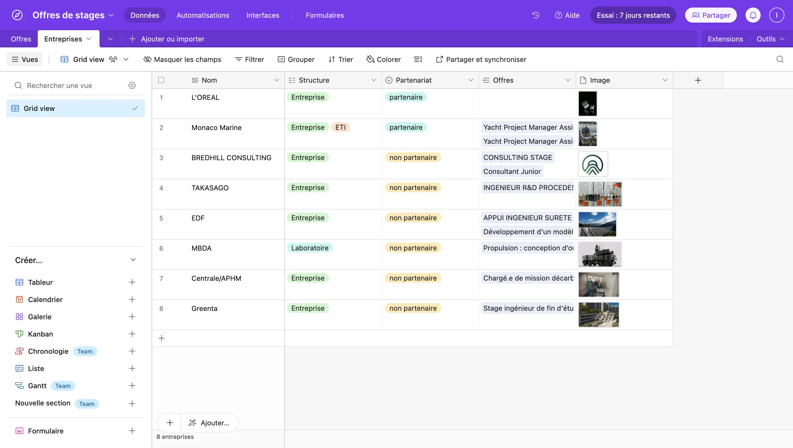



Niveau débutant

Connaitre les bases de Airtable et Softr.




[`MON Apprentissage Airtable & Softr `](https://francoisbrucker.github.io/do-it/promos/2024-2025/Isee-Maroni/mon/temps-1.1/)



## Tâches

### Sommaire
1. Identification du besoin
2. Base de données *Airtable*
3. Début de l'application web avec *Softr*
4. Amélioration de la page Offres
5. Création de la page Offres-Details

#### Sprint 1

Liste des taches que l'on pense faire. On coche si la tache est réalisée. A la fin du sprint on fait une petite étude post-mortem pour voir ce qui s'est passé et les ajustement à faire pour le prochain sprint, pok.

- [x] Définition des utilisateurs et usages de l'application web.
- [x] Construction de la base de données sur *Airtable* (tables **Offres** et **Entreprises**).
- [x] Supprimer et rajouter les champs nécessaires.
- [x] Lier les bases et automatiser l'ajout d'une nouvelle entreprise dans la table dès qu'une offre associée à une entreprise inédite est créée.
- [x] Création de l'application web *Softr* et connexion à *Airtable*
- [x] Réalisation de la page **Offres** : affichages, photos, choix des informations, filtres.
- [ ] Configurer le formulaire conditionnel pour l'ajout de nouvelles offres

### Premier Sprint

## 1. Identification du besoin

**Utilisateurs:**
- C*entralien à la recherche d'un stage* : cherche de l'inspiration, à voir ce qui existe autour OU a un objectif de secteur d'activité, de mission et de ville bien précise
- *Centralien transmettant une offre de son entreprise* : rend service à l'entreprise chez qui il a été en stage pendant 1 à 6 mois, dépanne d'autres camarades dont il partage la situation
- *Centralien recrutant pour son entreprise* : jeune diplômé à la tête d'une start-up OU cadre profitant du réseau Alumnis
- *Membre de l'administration* : poste une offre d'une entreprise partenaire de l'école

Voici des **exemples** d'offres de stages transmises par des centraliens sur des groupes Facebook ou conversation de promotion qui sont vites perdues :

  <!-- Première colonne -->
  

    
    
  

  <!-- Deuxième colonne -->
  

    
    
  

  <!-- Première colonne -->
  

    
  

## 2. Base de données *Airtable*
Pour cette étape, je suis d'abord allée sur le site des stages pour examiner les offres mises en ligne destinées aux centraliens. Je souhaitais voir quelles informations étaient fournies, lesquelles étaient pertinentes pour l'utilisateur principal (le centralien) ainsi que pour les gestionnaires du site, en l'occurrence l'administration de Centrale.

Un exemple du site des stages de Centrale Méditerranée :

À partir de là, j'ai réfléchi aux informations que j'allais conserver, celles que je supprimerais, et celles qu'il serait utile d'ajouter.

Puis j'ai créé la base de données Offres de stages contenant les tables **Offres** et **Entreprises**

## 3. Début de l'application web avec *Softr*

La première page que j'ai créée pour l'application web est la page des **Offres**. Je voulais qu'elles soient toutes visibles sur la même page, que l'on puisse défiler et que les informations les plus importantes soient visibles en un coup d'oeil. Les informations les plus importantes à mes yeux sont l'intitulé, l'entreprise, le secteur d'activité, la durée du stage et le type de missions (parfois présent dans l'intitulé). \
Pour améliorer la page des offres et optimiser l'expérience utilisateur, j'ai ajouté les tags, des images et des filtres, y compris des filtres conditionnels. En m'inspirant de sites spécialisés dans les offres d'emploi, j'ai observé quelles informations étaient mises en avant et quelles sections étaient accessibles aux utilisateurs pour répondre au mieux à leur besoin.

Voici quelques étapes intermédiaires de la page **Offres** liée à la base de données *Airtable* :

Les pages suivantes que je vais créer sont les pages **Home** et **Offre-Details** auquelle on accèdera en cliquant sur la vignette correspondante de la page **Offres**.

### Horodatage

Toutes les séances et le nombre d'heure que l'on y a passé.

| Date | Heures passées | Indications |
| -------- | -------- |-------- |
| Mardi 10/09  | 30min  | Etude du besoin et définition des utilisateurs |
| Mardi 10/09  | 1H  | Récupération des informations pertinentes sur le site des stages Centrale |
| Mercredi 11/09  | 2H  | Création de la table *Airtable*, modifications et automatisations |
| Mercredi 11/09  | 1H  | Création de l'application web *Softr* |
| Dimanche 15/09  | 3H  | Développement page **Offres** tests et améliorations |
| Mercredi 18/09  | 2H30  | Rédaction |

#### Sprint 2

Airtable
- [x] Champ lieu : automatisation ville, région et vice versa
- [ ] Choisir les données pertinentes à mettre dans un questionnaire (le moins possible)
- [ ] Réalisation du questionnaire conditionnel pour l'ajout d'offre (étudiant, membre de l'administration, entreprise)

Softr
- [x] Rajouts de filtres : lieu, secteur, profil étudiant
- [ ] Rajouter date de publication ?
- [ ] Page Home 
- [x] Page Details offre ( offres cliquables)
- [x] Ajouter header
- [ ] Ajouter footer
- [x] Choix des couleurs et du logo
- [ ] Publication de l'application web

*Note post-mortem :*

La gestion de la base de données comprenant toutes les villes, départements et régions de France dans Airtable s'est avérée plus compliquée que ce que j'imaginais, notamment en raison de la limite de 1 000 lignes imposée par la version gratuite *Airtable*. Je ne pourrai donc pas continuer à utiliser cette version.

J'avais trop d'idées pour le temps imparti, ce qui m'a malheureusement empêché de réaliser le formulaire pour l'ajout d'une nouvelle offre, par exemple. J'ai dû prioriser mes tâches et en laisser certaines de côté au profit d'autres plus urgentes.

Je ne suis pas allée jusqu'à la publication de l'application web car je n'ai pas encore pu aborder les questions de sécurité, confidentialité et RGPD sur la plateforme.

### Second Sprint

## 4. Amélioration de la page Offres

Pour améliorer la page **Offres** j'ai ajouté plusieurs filtres basés sur la localisation, le secteur d'activité et le type de travail proposé. Cela a nécessité l'importation de la base de données des villes de France dans *Airtable* avec une automatisation pour associer chaque ville à son département et sa région.

Il est possible de sélectionner plusieurs villes pour une même offre. 

J'ai également mis en place une barre de recherche où l'on peut rechercher les résultats par entreprise, intitulé de l'offre, type de contrat, spécialité, ainsi que par ville ou département. 

Enfin, un menu déroulant a été ajouté, affichant uniquement les villes proposées parmi les offres à disposition, pour simplifier la recherche.

Voilà à quoi ressemble la nouvelle page **Offres** du côté de sa construction, lorsque je la conçois en no-code, avant d'entrer dans l'expérience utilisateur :

## 5. Création de la page Offres-Details

Pour la page **Offres-Details**, j'ai conçu une mise en page présentant les informations principales de l'offre, accompagnée d'un lien direct vers l'annonce sur le site de l'entreprise pour obtenir plus de détails.

Voilà un aperçu de l'expérience utilisateur étape par étape :
 

### Horodatage

Toutes les séances et le nombre d'heure que l'on y a passé.

| Date | Heures passées | Indications |
| -------- | -------- |-------- |
| Jeudi 10/10  | 4h10  | Ajout d'une base de données *Villes* dans Airtable, et paramètres de *localisation* dans Softr |
| Mardi 15/10  | 2h20 | Amélioration page **Offre**, notamment avec les filtres |
| Mercredi 16/10   | 1h40  | Développement page **Offres-Details** |
| Mercredi 16/10  | 1H30  | Rédaction |

