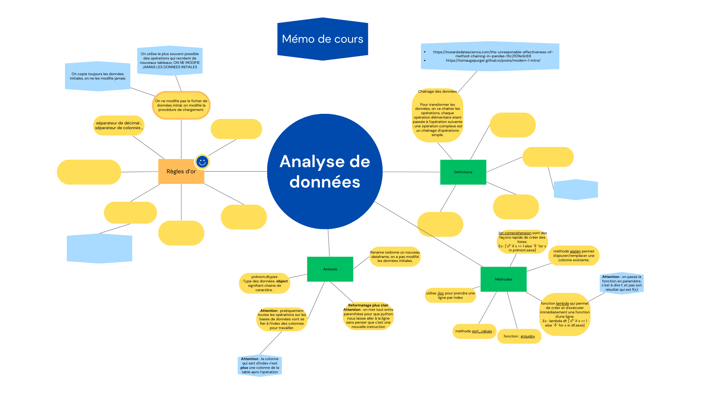
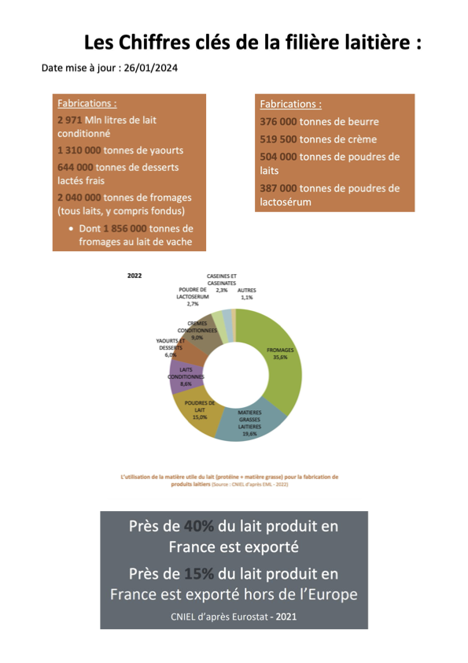
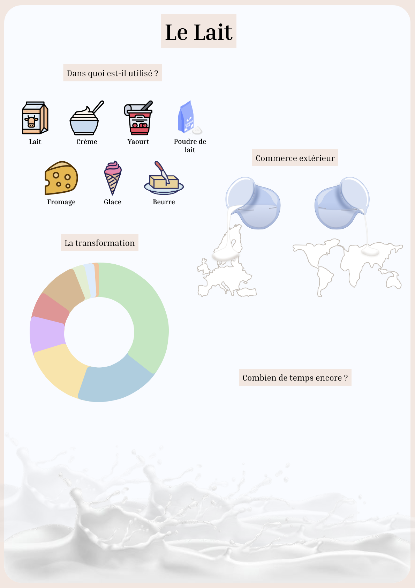
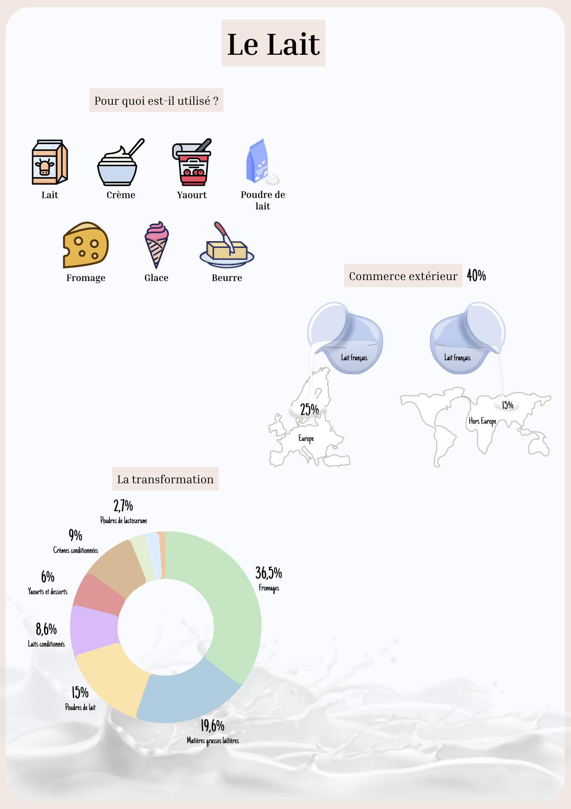
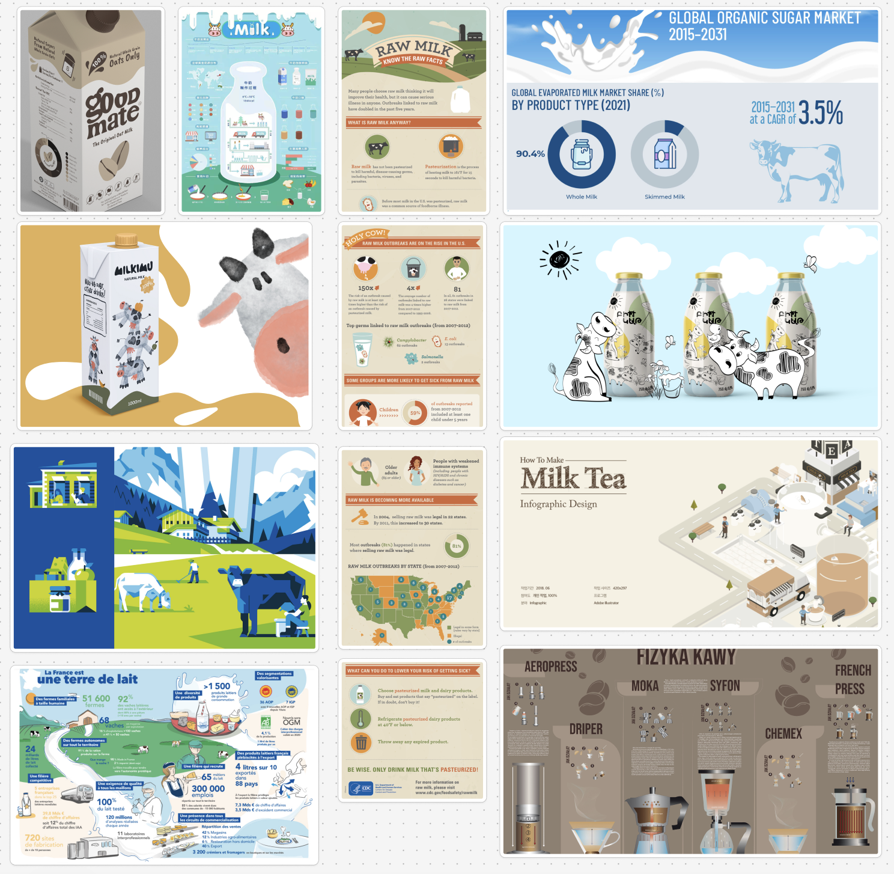



Pré-requis : Aucun





[`Cours Analyse de données`](https://francoisbrucker.github.io/cours_informatique/cours/analyse-donn%C3%A9es/)



## Tâches

Analyse de données, exploitation, visualisation et infographie avec des Open Data sur une thématique choisie.

### Sprints

#### Sprint 1

Liste des taches que l'on pense faire. On coche si la tache est réalisée. A la fin du sprint on fait une petite étude post-mortem pour voir ce qui s'est passé et les ajustement à faire pour le prochain sprint, pok.

- [ ] Choisir la thématique à analyser
- [ ] Se former sur l'analyse de données avec python (non fini)

### Premier Sprint

Je fais le cours Analyse de données avec python réalisé par M.Brucker. Je suis les étapes d'apprentissages proposées, alternant cours et entraînements avec correction.

En parallèle je réalise une carte mentale des outils que je voudrais pouvoir retrouver rapidement. En voici un extrait ci-dessous.

#### Sprint 2

Liste des taches que l'on pense faire. On coche si la tache est réalisée. A la fin du sprint on fait une petite étude post-mortem pour voir ce qui s'est passé et les ajustement à faire pour le prochain sprint, pok.

- [ ] Terminer formation Analyse de données
- [ ] Formation visualisation des données
- [ ] Analyse de données sur une thématique
- [ ] Exploitation
- [ ] Visualisation
- [x]Infographie

### Second Sprint

Je me suis finalement aperçue que ce qui me m'intéressait réellement, c’était la visualisation des données, l’infographie et la manière de rendre un contenu clair, pertinent et accessible d’un simple coup d’œil. Cependant, j’ai rapidement réalisé que les étapes préalables, comme l’analyse, le tri et l’exploitation des données nécessaires pour produire une visualisation, représentaient un travail trop conséquent avant d’atteindre la partie qui m’intéressait le plus.

Pour cette raison, j’ai décidé de simplifier le processus en sélectionnant directement un catalogue de données déjà structuré, avec des chiffres, pourcentages et statistiques pertinents. 

Mon choix s’est porté sur un document du CNIEL, contenant des informations sur le lait et la filière laitière. Ce sujet m’a semblé intéressant car, bien que la France soit le 2ᵉ producteur de lait en Europe avec près de 25 milliards de litres produits chaque année, il reste encore méconnu du grand public. Inspirée par ce thème propre à la France, j’ai décidé d’en faire une infographie pour mieux valoriser ces données.


PDF - Les Chiffres clés de la filière laitière - 2024. https://presse.filiere-laitiere.fr/assets/les-chiffres-cles-de-la-filiere-laitiere-2024-pdf-3072-ef05e.html


Pour réaliser mon infographie, j'ai fait une sélection des données spécifiques sur la filière laitière que voici :

Je me suis ensuite appliquée à les représenter de manière visuelle afin que le message principal soit compris d’un coup d’œil, avec un minimum de texte explicatif. Mon objectif était que les éléments graphiques portent la majeure partie de la signification.

#### Ébauche et progression

1. Première étape : J'ai réalisé une version intermédiaire avec les principaux visuels disposés en vrac, comme une esquisse. Cette version, non finalisée, présente des emplacements vides pour intégrer d’autres données ultérieurement.

2. Ajout des données brutes : J’ai ensuite enrichi cette version avec les chiffres et statistiques nécessaires pour données les informations clés portées par l’infographie.

#### Difficultés majeures rencontrées

- *Temps de création* : La conception visuelle et le design se sont révélés extrêmement chronophages. Je ne m’attendais pas à ce que le processus prenne autant de temps, ce qui a limité mes avancées.
- *Accessibilité des ressources* : Trouver des illustrations et objets gratuits au format SVG a été un véritable défi. Bien que de nombreuses bibliothèques gratuites existent, elles sont souvent restrictives et ne proposent pas exactement ce que l'on recherche. Dessiner soi-même les visuels demandés est une alternative, mais elle rallonge considérablement le temps de travail.

Cette expérience m’a permis de comprendre à la fois les exigences techniques et créatives liées à la réalisation d’une infographie impactante.

#### Ce que j’aurais souhaité faire de plus dans cette première ébauche, mais le temps m’a manqué :

3. Amélioration graphique : 
J’ai appliqué les principes d’UI Design vus en cours,  j'ai rassemblé une banque d’illustrations et de visuels dont je souhaite m'inspirer pour le design.
J'ai également prévu de faire un brief graphique pour déterminer mes polices, mes titres et ma palette de couleurs finales.

#### Infographie en grand

### Horodatage

Toutes les séances et le nombre d'heure que l'on y a passé.

| Date | Heures passées | Indications |
| -------- | -------- |-------- |
| 17/11/24  | 1H  | Etudier anciens projet ADAD et données à dispo par la Métropole, recherche thématique|
| 17/11/24  | 2H  | Cours Analyse de données|
| 18/11/24  | 3H  | Cours Analyse de données et premières manipulations|
| 13/12/24  | 2H30  | Recherche dataset + Documentation sur commment faire Infographie avec Figma (vidéos) |
| 14/12/24  | 30min  | Recherche de références et illustrations |
| 14/12/24  | 2H30  | Design |
| 15/12/24  | 4H30  | Design |
| 16/12/24  | 1H  | Design |
| 18/12/24  | 1H  | Ajout données chiffrées design |
| 18/12/24  | 2H  | Rédaction |

