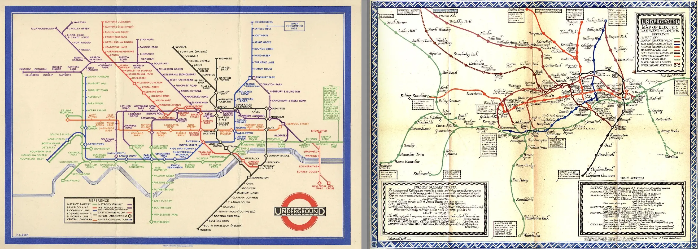
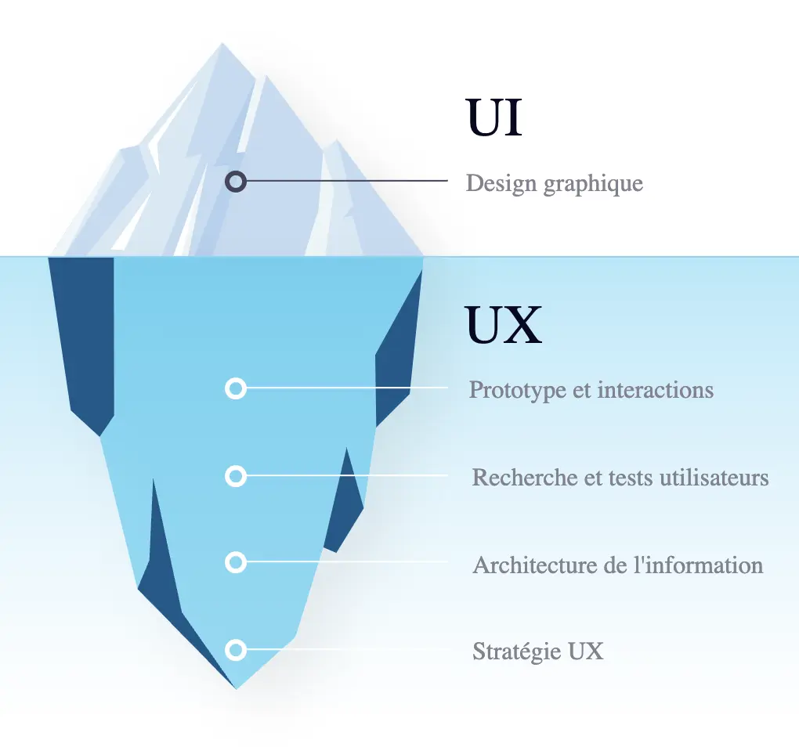
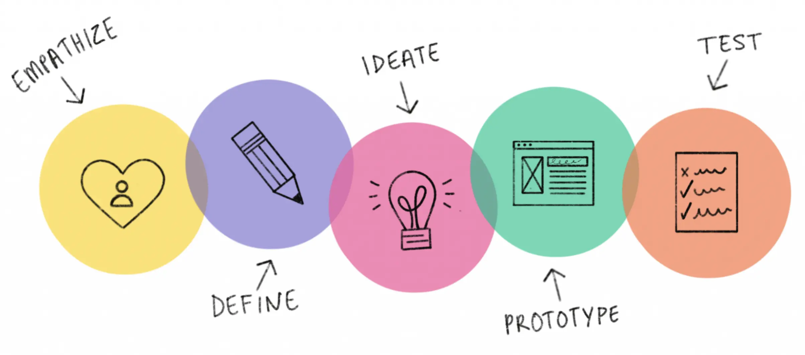
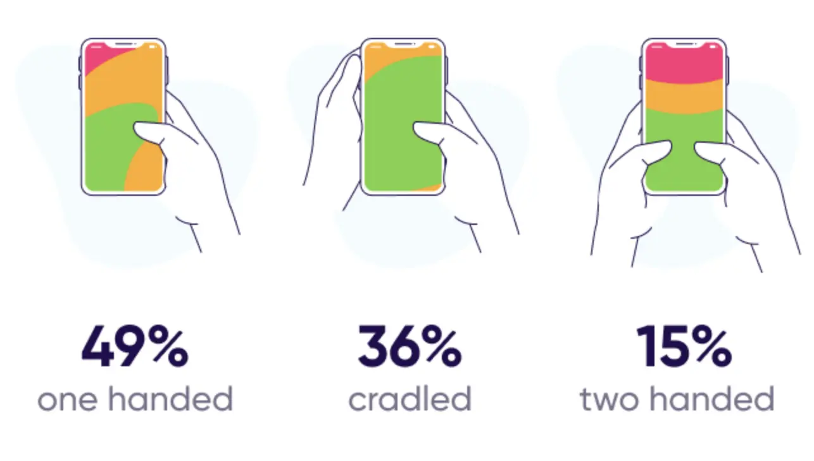
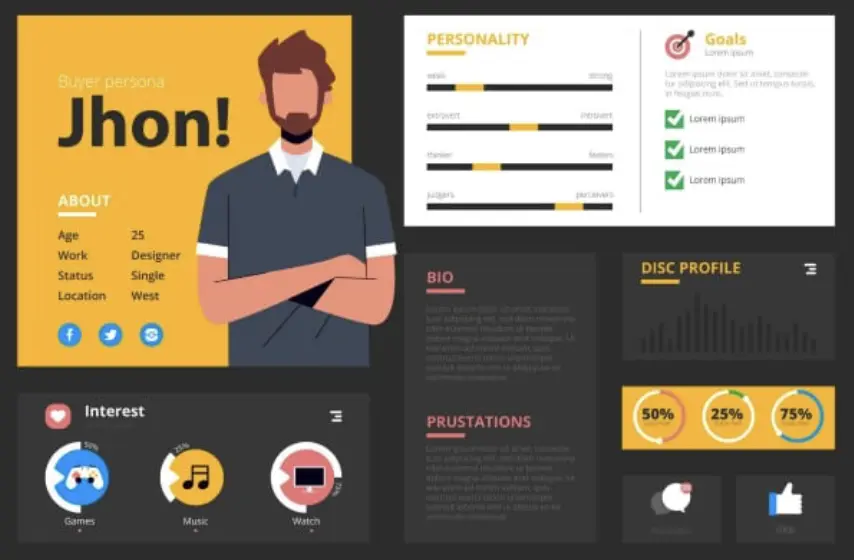

Ce MON est une introduction au design thinking et à l'UX design. Il permet d'appréhender ces notions et d'avoir les bases nécessaires pour comprendre les enjeux de l'expérience utilisateur.

- Niveau : Débutant
- Prérequis : Avoir quelques notions de Design Thinking

## Sommaire

- [Définition de l'Ux](#ux)
- [Quelques notions essentielles](#notions)
- [Le métier d'Ux designer](#metier)

<h2 id=ux> Définir l'Ux</h2>


Ux signifie en anglais **User Experience ou Expérience Utilisateur**.


C'est un **ensemble de normes et bonnes pratiques** pour concevoir un produit, un site web ou une application mobile mais aussi l'expérience de ce produit. Autrement dit, c'est la **conception de l'humain et de l'expérience qu'il va vivre**. Cela peut s'appliquer à tous domaines où l'on vit une expérience mais généralement lorsqu'on parle d'Ux on fait référence au monde du web.

L'Ux designer doit concevoir un produit offrant la meilleure expérience possible en prenant en compte l'**ergonomie**, la **simplicité**, la **praticité** et la **facilité d'utilisation** du produit. Il est nécessaire, pour cela, d'**anticiper les usages, les attentes et les besoins** de l'utilisateur pour savoir ce qu'il veut mais avant tout ce qu'il ne veut pas.


**Aimer** un produit, c'est l'**adopter**.


Il y a un vrai enjeu **psychologique** derrière l'Ux car l'objectif premier est de rendre l'utilisateur heureux ce qui nécessite de le connaître parfaitement.


Historiquement les professionnels de l'Ux étaient des **psychologues**, des **ethnologues** et des **statisticiens** et **analystes** qui travaillaient avec les designers.


Prenons par exemple les plans de métros. A l'origine les plans des lignes de métros étaient très réalistes, conformes à leur disposition géographique ce qui les rendaient peu lisibles pour les utilisateurs. Mais en 1933, Henry Beck a décidé de prendre de son temps libre pour revoir le design des plans de métro londonien. D'abord critiqué par l'entreprise, ils ont finalement dû l'adopté face à l'engouement des utilisateurs trouvant ces plans beaucoup plus lisibles et compréhensible. Aujourd'hui ce format de plan existe partout dans le monde.

Il faut bien différencier l'Ux de l'Ui. L'Ui est l'**user interface ou interface utilisateur**. L'interface est le **point de rencontre** entre la personne et le produit, elle permet l'interaction avec le produit.

En Ux, c'est l'**expérience globale** de l'utilisateur qui compte alors que l'Ui est la partie perceptible, visible. L'Ui est donc la partie émergée de l'iceberg représenté par l'Ux. Si on prend l'exemple d'une voiture, le produit est la voiture et l'utilisateur est le conducteur. L'interface correspond alors à l'intérieur de la voiture et l'expérience est la conduite.

La complexité d'un bon produit est donc de réaliser une interface **visuelle et attractive** tout en restant **simple et efficace**, c'est-à-dire combiner l'Ui et l'Ux.

### L'utilisateur au centre de l'Ux design

L'Ux est une approche centrée sur **l'humain** et ses activités. Tous les choix de design doivent se faire à partir et en fonction des utilisateurs. Steve Krug, un des pères fondateurs de l'Ux design dit qu'*un bon design commence par une bonne compréhension de la psychologie humaine*.


Le plus difficile en Ux est de toujours se rappeler qu'on créer pour les autres et non pour soi.


Les autres ne sont pas comme nous. Il est primordiale de regarder **son environnement**, les autres, ce qui les dérange ou leur pose problème et ce dont ils ont besoin. Nos goûts personnels ne sont pas ceux des autres.

Un autre point d'attention est de ne pas chercher à plaire à tout le monde. Il est faux de croire qu'une expérience est positive si elle est universelle, qu'elle correspond à tous. Ça serait bien mais dans la réalité c'est souvent un échec car tout le monde est différent.


Une Ux pour tous est une Ux pour personne.


Même pour les grosses applications, des choses plaisent à certains mais pas à d'autres. Par exemple, il a fallu des mois à Facebook pour designer le pouce bleu permettant de liker une publication car l'objectif était de faire un outil qui plaise au plus grand nombre. Le risque dans cette situation est finalement de décevoir beaucoups. Le changement devient alors très compliqué.

### Concevoir un produit simple

Pour satisfaire les utilisateurs, il faut concevoir **un produit simple**. Autrement dit un produit qui requiert peu ou pas d'informations. Il n'a pas besoin d'être expliqué pour être utilisé, on doit comprendre directement à quoi il sert.

L'utilisateur sait immédiatement qui on est, à quoi on sert et ce que c'est. Il n'y a pas besoin de tutoriels qui sont souvent contournés par les utilisateurs.

Plus il y a de fonctionnalités, plus le produit est compliqué ce qui perd en usabilité réduisant l'intérêt du produit. Souvent une Ux doit son succès à une caractéristique déterminante. Par exemple Facebook est devenu incontournable pour son service de messagerie instantannée pour concurrencer Whatsapp.

<h3 id=responsive> L'utilisateur mobile</h3>

Lors de la conception d'une Ux, il est important d'intégrer **la notion de mobilité**. La mobilité concerne le smartphone ou la tablette mais également les utilisateurs de ceux-ci. On se concentre avant tout sur **l'utilisateur qui est mobile** car lui et ses appareils sont mobiles. Joël de Ronsay, futurologue français nous dit qu'*on ne va pas sur internet, on est dans internet*.

L'utilisateur mobile se définit ainsi :

- il se déplace avec son smartphone
- il prend les transports
- il communique en temps réel
- il prend et partage des photos et informations instantanément

Il possède plusieurs applications pour des besoins différents, donc il doit **diviser son temps** entre plusieurs applications mobiles. C'est là que se trouve le premier challenge. Il faut capter l'attention de l'utilisateur sans l'accaparer pour ne pas le distraire dans son déplacement, lorsqu'il marche par exemple. Il ne doit pas devenir un danger pour lui ou les autres.

Il faut ensuite garder à l'esprit que l'utilisateur mobile se sert avant tout de son smartphone. Bien que la version ordinateur d'un site web peut être complexe, il faut donc ne pas négliger **la version mobile**. Pour cela, il faut intégrer l'approche de mobile first.


**Mobile First** : concevoir pour le mobile en premier car la majorité des utilisateurs d'aujourd'hui sont mobiles.


 Cette approche permet d'éliminer beaucoup de contrainte dès le début comme la taille de l'écran qui varie entre mobile et ordinateur ou le curseur de l'ordinateur qui devient le pouce de la main sur le mobile. Il est donc nécessaire de penser **responsive** (adapté pour le mobile). L'interaction est la même et elle doit le rester, c'est la disposition qui peut varier. Google punit même les sites non responsives, il ne les remonte pas dans les résultats de recherche, car c'est une caractéristique primordiale pour les utilisateurs.

Le mobile first nécessite donc de prendre en compte de nouvelles contraintes liées à l'appareil mobile : la taille de l'écran, l'autonomie de 24h max, le réseau aléatoire, l'utilisation en mouvement. A ce niveau, on peut déjà créer un produit simple et responsive.

### Intégrer l'approche Design Thinking

Popularisé par des designers de la Silicon Valley, le design thinking se base sur 5 étapes clés :

- **l'empathie** : se mettre à la place des autres pour comprendre un problème
- **la définition** : définir le problème à résoudre
- **l'idéation** : trouver des solutions créatives
- **le prototype** : choisir la solution adaptée et concevoir une première version
- **le test** : tester le concept puis l'améliorer

L'Ux design, quant à lui, s'articule autour de 3 étapes :

- la recherche utilisateur
- le prototypage
- le test utilisateur

Ces étapes s'intègrent dans la démarche de Design Thinking, qui s'applique à tout le processus de conception et de design. En Ux, l'**empathie** est fondamentale, ça passe par la réalisation de recherches très approfondies et abouties sur l'utilisateur. Le **prototypage** prend en compte les notions d'[usabilité](#usabilite), d'[affordance](#affordance) et de [responsive](#responsive). Enfin, le **test** n'est pas une phase finale mais une routine sous forme de mini-tests très réguliers tout au long du processus.

Contrairement au Design Thinking où les 5 étapes forment une boucle, en Ux l'**itération** se fait sur **le prototype et le test**, qui forment un binôme. Cela permet de valider qu'à chaque étape, on avance dans la bonne direction. Il faut alors partir d'un brouillon très simple pour se rapprocher étape après étape du produit final tel qu'on l'imagine.

**Les outils incontournables :**

- Zoning (croquis) : papier-crayon
- Wireframe (schéma de la répartition du contenu) : Balsamiq, Axure, PowerPoint…
- Mock-up (maquette intégrant la charte graphique) : Sketch, Photoshop, Experience Design…
- Interaction (simulation dynamique du chemin de navigation) : InVison, Experience Design…

#### La recherche utilisateur

La **recherche utilisateur** est essentielle pour bien comprendre les besoins des futurs utilisateurs et offrir un produit qui va plaire à la cible.

Il faut se poser la question qu'est-ce qu'on conçoit et pour qui. Cela touche aux notions de **psychologie** et **sociologie**. On peut par exemple faire de l'**ethnologie**, observation sur le terrain ou de l'**immersion** qui permet de rentrer vraiment dans cette phase de recherche. Si le temps manque, des **solutions numériques** existent comme les sondages. Ça permet de comprendre ce que les utilisateurs veulent et surtout ce qu'ils ne veulent pas.

Quand on veut cibler un utilisateur, on cherche à viser un trait de caractère ou de personnalité mais c'est une erreur. Il vaut mieux viser une activité commune à un grand nombre de personnes.

Une recherche utilisateur pertinente se base sur deux approches. L'approche quantitative, qui passe par des recherches google sur les caractéristiques du public cible et l'approche qualitative par le contact direct avec les utilisateurs sélectionnés.

#### Le prototypage

Lors du prototypage, le **principe du 80/20** permet de se focaliser sur **un produit simple**. Cela signifie que 80% des actions observées sont réalisées en utilisant seulement 20% des fonctionnalités du site.


En Ux, un dessin vaut mille mots.


Les bonnes pratiques du prototypage passent par un modèle **responsive** ou **mobile friendly**. Cela veut dire pas trop d'info sur l'écran, une page claire et lisible, qui navigable avec les doigts et où les éléments de friction qui empêche la fluidité ont été retirés. Il faut donc **placer le contenu là où l'utilisateur s'attend à le trouver**, ce qui simplifie les choses et permet par exemple aux utilisateurs d'utiliser un site dans une langue étrangère grâce aux automatismes de navigation. Le produit doit être construit simplement de façon reconnaissable (les boutons en forme de bouton cliquable, ...).

L'utilisateur mobile a apporté un nouveau concept, **le design pour le pouce**. Ça correspond à la zone qui est facilement accessible avec le pouce sur un smartphone. Il est alors nécessaire d'avoir des éléments de taille adaptée qui soient hiérarchisés, avec des noms explicites pour ne pas avoir à chercher l'information.

#### Le test utilisateur

Tester les prototypes a pour objectif d'**observer les utilisateurs interagir**, de **détecter les problèmes** et de **comprendre ce qui est apprécié** dans le produit. Attention, il ne faut **jamais intervenir**, ni aider le testeur à utiliser le produit lors de ce processus.


On teste le produit et non les personnes.


S'ils ont des difficultés, c'est qu'il y a des choses à retravailler. L'important est de ne pas y mettre d'ego mais plutôt de l'utiliser comme un guide de correction. Pour réaliser les tests utilisateur, il faut être **agile** pour ne pas décourager le client.

Pour mener à bien une séance de test, il faut avant tout **un petit nombre d'utilisateurs** pour pouvoir les observer correctement. **Un facilitateur** est également nécessaire pour animer la séance et qui sait être patient pour être à l'écoute des besoins des utilisateurs. Enfin **une salle avec le confort minimum** pour les bonnes conditions du test. Le but est de comprendre ce que les utilisateurs font avec le produit, il est donc nécessaire de les voir et les entendre. Il faut les faire penser à voix haute.

Un des problèmes que l'on peut facilement rencontrer est justement **le silence** des utilisateurs. Lorsque le silence est présent, le facilitateur ne doit pas intervenir, il doit essayer de faire parler les personnes en posant des questions pour comprendre ce qu'il est en train de faire. Il se peut également qu'un utilisateur soit **bloqué** et demandent de l'aide. Encore une fois, le facilitateur ne doit pas intervenir dans la démarche et l'aider. Il peut en revanche poser des questions pour comprendre ce qui le dérange afin de faire remonter le problème à corriger. Enfin, si un utilisateur s'**énerve** c'est sûrement que quelque chose dans l'application n'est pas adapté. S'il n'est pas adapté à une personne, il se peut que de nombreuses personnes rencontrent ce problème plus tard c'est donc un problème prioritaire. Dans ce cas, le facilitateur doit rester patient et ne pas montrer d'égo, il doit rester à l'écoute et comprendre ce qu'il faut améliorer.

A la fin de la séance de test, il est important de **sélectionner les problèmes à résoudre**. Les problèmes d'usabilité sont prioritaires, tandis que les problèmes de détail ne sont pas à prendre en compte car si un utilisateur préfère par exemple la couleur bleue, ça ne sera pas le cas pour d'autres. Ces problèmes seront à prendre en compte uniquement s'ils remontent énormément de fois au cours des différents tests. Il est impératif de résister à la tentation de rajouter des choses qui compliquent le produit.

Une fois que tous les problèmes sont **notés et priorisés**, il est important de faire un **planning de résolution**. Et une fois les problèmes résolus, une nouvelle phase de test est nécessaire pour permettre d'offrir la meilleure expérience possible.

<h2 id=notions> Quelques notions essentielles</h2>

<h3 id=usabilite> La notion d'usabilité</h3>


**Norme ISO 9241-11 :**
L'usabilité, c'est « le degré selon lequel un produit peut être utilisé, par des utilisateurs identifiés, pour atteindre des buts définis avec efficacité, efficience et satisfaction, dans un contexte d’utilisation spécifié ».


Le terme **usabilité** se compose de 'usage' et 'abilité'. C'est la capacité d'un utilisateur à interagir avec un produit, à le prendre en main, comprendre à quoi il sert et comment l'utiliser. L'objectif est d'améliorer l'expérience globale de l'utilisateur en le guidant dans l'utilisation du produit.

Les principes de l'usabilité se définissent par un produit :

- simple
- facile
- utile
- utilisable
- navigable
- accessible
- compréhensible

L'usabilité n'est pas synonyme d'Ux, c'est une **composante** de celle-ci. L'Ux améliore positivement l'expérience en prenant en compte **les émotions** alors que l'usabilité permet à l'utilisateur d'accomplir un certain nombre d'actions de façon simple et rapide.

### Le taux de rétention

Pour mesurer **le succès d'une Ux** on utilise deux types de méthodes. La **méthode qualitative** comme les notes ou commentaires sur les stores d'application et la **méthode quantitative** qui utilisent des données plus parlantes et plus concrètes comme la fidélité des utilisateurs.

Pour cela, on peut mesurer **le taux de rétention** qui correspond au pourcentage d'utilisateurs qui continue d'utiliser une application ou un site plus de trois mois après l'avoir installé et utilisé pour la première fois. Aujourd'hui, les meilleurs taux sont ceux des messageries instantanées comme Facebook (98%) ou Whatsapp (77%) car le côté instantanné augmente la fréquence d'usage, l'utilisateur se rapproche d'un comportement d'addiction.


En moyenne, un taux de rétention lambda est de **11%** et on considère cela comme un succès à partir de **30%**.


### Le persona

Pour déterminer les caractéristiques de l'utilisateur visé, on crée **un profil utilisateur**, appelé persona. C'est un modèle d'utilisateur avec des **caractéristiques précises** déterminant des **cas d'usages**.

Un cas d'usage est l'**ensemble de situations** où l'utilisateur va **interagir** avec le produit, dans lesquelles il en a besoin et comment il l'utilise. Pour faire un persona, il est important d'inclure des choses qui vont décrire des activités de l'utilisateur et non de se centrer uniquement sur des caractéristiques personnelles comme le revenu ou l'âge.

On veut comprendre les besoins d'un utilisateur pour développer une application qui empêche tout **élément de friction** dans le but d'améliorer l'usabilité et de prendre en compte l'utilisateur mobile.

Le persona est un outil polyvalent visant à **générer de l'empathie** lors du processus de conception. Il se fait une fois les recherches utilisateurs réalisées. Le format doit être visuel et assez simple et les personnalités marquantes. **Un maximum de 10 persona** permet de se concentrer sur un type de population et de les exploiter au mieux car une Ux ne peut pas être designer pour plair à tous.

<h3 id=affordance> Le principe d'affordance</h3>

Les utilisateurs sont de plus en plus exigeants, **s'habituant aux progrès**. Quand le design progresse, l'utilisateur et sa capacité à comprendre un produit et à interagir avec, progresse aussi. L'utilisateur devient exigeant.

L'affordance ou affordability est la capacité à se permettre de prendre en main un produit, comprendre comment on s'en sert et pourquoi.


C'est la capacité d'un produit à être **en accord avec son temps**.


Si une application est trop en avance sur son temps, cela peut provoquer de la confusion chez l'utilisateur. On parle alors de manque d'affordance. Si l'innovation est calquée sur une précédente, l'utilisateur pourra s'adapter plus facilement. Le but de l'Ux design est alors de fabriquer **non pas un produit futuriste** mais **le meilleur produit pour ses utilisateurs**.

Un exemple plutôt contradictoire est l'Ux de Snapchat. C'est une **exception** rare car elle représente une grosse innovation mais pourtant elle est devenue très populaire. Cela a fonctionné car c'est un produit destiné majoritairement aux jeunes. La plupart des fonctionnalités sont 'cachées', accessibles par des actions adaptées à la jeune génération comme le swipe. Cette combinaison est très bien perçue par la jeunesse. Le fait de partager des astuces d'utilisation entre amis plaît davantage. C'est ce qui fait le succès de cette Ux malgré sa complexité. Aujourd'hui, ce modèle d'application s'est popularisé et pousse les jeunes à devenir plus créatifs (ex TikTok).

#### L'approche "Hook Canvas"

Ce modèle se base sur un cadre conceptuel qui permet d'**accrocher l'utilisateur**. Les designers créent en nous **des habitudes** voire **des automatismes d'usage** de ces applications comme les ouvrir au réveil ou lors de moments de solitude, c'est ce comportement qui fait le succès de ces applications. On parle de relation "haute fréquence".

L'approche du crochet ou modèle de Hook a été développé par Nir EYAL un professeur à l'école de commerce de Stanford. Il suggère que pour être accrocheur, le flow de l'application s'articule autour de **4 phases** auxquelles l'utilisateur va faire face. Ces étapes se suivent et idéalement se répètent en boucle pour créer des habitudes comportementales voire **des addictions**.

1. **L'élément déclencheur**

   L'expérience utilisateur commence par un élément déclencheur. Il peut être interne comme un état psychologique (la peur du manque, la solitude, l'ennui) ou externe par les pubs, les notifications ou les boutons d'appel à l'action.

2. **L'action**

   L'utilisateur doit ensuite passer à l'action. Elle doit être la plus simple possible donc les designers essaient de réduire toutes les frictions, par exemple l'action de scroller. Cela permet d'avoir une récompense instantanée et imprévisible.

3. **La récompense variable**

   L'effet de surprise, de ne pas savoir ce qu'on va trouver en réalisant l'action fascine l'utilisateur, lui donnant envie de revenir. On a par exemple l'espoir de trouver un nouvel article, une photo plus intéressante ou une nouvelle mention j'aime. Les éléments variables poussent alors l'utilisateur à prolonger l'expérience.

4. **L'investissement**

   Plus on utilise une application, plus on y stocke de la valeur en y entrant des données, en s'abonnant à une page, en publiant une photo ou encore en envoyant des messages. On investit dans l'application puis on cherche de nouveau déclencheur, ce qui ramène à l'étape 1.

Pour certains, ce cadre s'apparente à de la **manipulation** car on fait face à un cercle vicieux. Il y a donc **une responsabilité** évidente envers les utilisateurs qu'on accroche, d'où la nécessité de trouver un juste milieu. **L'éthique** de l'Ux designer est donc un enjeu de taille.

<h2 id=metier> Le métier d'Ux designer</h2>

Les **qualités** nécessaires pour un Ux designer sont principalement :

- l'empathie
- la curiosité
- l'humilité
- le travail d'équipe
- la capacité à se déconstruire, à dire je ne sais pas


[Tristan Harris : éthique de l'Ux designer](https://youtu.be/D55ctBYF3AY?si=lSDMO4h1za5Z5Xcm)


L'éthique de l'Ux designer est un point très sensible, car la conception d'expérience utilisateur n'est pas altruiste mais souvent liée au business. Tristan Harris, designer pour les plus grands groupes comme Apple ou Google, explique lors d'une conférence comment le design peut contribuer à rendre les technologies et les applications mobiles moins intrusives, et donc plus appréciables pour les utilisateurs. Finalement quel rôle l'Ux designer doit adopter face à cette question éthique de l'addiction de l'utilisateur face au modèle économique de l'application.


On passe beaucoup de temps à penser à ce qu'on fait de notre temps.


Le temps semble souvent nous échapper particulièrement lorsqu'on le passe sur certaines applications. Il nous arrive d'ouvrir une application sachant pertinemment qu'on va y perdre 20 min alors qu'on voulait juste lire un message, ou encore rafraîchir nos emails toutes les 15 secondes sans raison particulière. Ce comportement est représentatif de l'addiction.


Aux Etats-Unis l'industrie des machines à sous rapporte plus que le cinéma, les parcs d'attraction et le baseball réunis.


Bien qu'ils ne jouent qu'avec des pièces l'addiction les pousse à jouer encore et encore. On peut faire le même parallèle avec **le téléphone**. Quand on ouvre une application, on attend une récompense. Cela traduit **une vraie dépendance**. On le sait pertinemment mais on ne peut pas s'en défaire. Finalement l'utilisateur se trouve toujours dans un de ces deux états : **connecté mais distrait** ou **déconnecté mais avec le sentiment de rater quelque chose**.

L'éthique de l'Ux designer est de restaurer ce choix. Bien que le modèle économique de beaucoup d'applications vit à travers ce phénomène d'addiction, il est primordial de permettre à l'utilisateur de choisir ce qu'il veut faire de son temps. Ça peut passer par des fonctionnalités supplémentaires comme le mode concentration dans une messagerie instantanée.


Selon une étude de Microsoft, il faut en moyenne **23 minutes** pour se **reconcentrer** sur une tâche et plus on est interrompu plus on s'habitue jusqu'à **s'auto-déconcentrer** toutes les **3,5 minutes**.


Partant de ce constat, le statut ne pas déranger ou occupé permet à l'utilisateur de ne pas recevoir de pop-up de messagerie instantannée ou autres notifications, pour ne pas être dérangé dans son travail sauf en cas d'urgence. Ainsi l'utilisateur **reprend le contrôle** sur ses choix et son temps.

Cette pensée implique de mettre **les valeurs humaines au premier plan**. Dans l'économie actuelle, le temps est un facteur clé du succès d'une application. Plus un a d'utilisateur, plus ils passent du temps dessus, mieux c'est. En réalité, il y a différentes échelles de valeur. L'objectif idéal serait de créer **une contribution nette et positive vis-à-vis de l'humanité face à la technologie**. Pour cela, il faudrait mesurer le succès de manière différente. Si on prend l'exemple du bio, l'objectif est de mieux manger, on ne peut pas juste comparer l'aspect financier car c'est une catégorie d'alimentation complètement différente. On met en avant un aspect différent, la qualité de l'alimentation, donc l'échelle de valeur est repensée. On peut appliquer cela à la technologie en redéfinissant les KPIs. Mais cela voudrait dire **redéfinir les valeurs de l'UX design**, sur le même exemple que le serment d'Hippocrate en médecine qui est le fondement de l'éthique du médecin et qui rappelle la responsabilité envers le patient.

Un exemple concret de l'évolution des KPIs en Ux est le **taux de convivialité**. L'entreprise Couchsurfing a créé ce taux permettant de mesurer la réussite du site en se basant sur le bonheur procuré aux gens. Il prend en compte le temps que passe l'utilisateur chez l'hôte qu'il rencontre sur le site moins le temps passé sur le site. Il n'est donc pas basé sur l'addiction de l'utilisateur face au site.

Aujourd'hui l'utilisateur doit **lui-même exiger un changement** pour passer d'un monde frustré par le temps à un monde où le temps est bien utilisé. De plus en plus d'entreprises repense leur produit ou leur façon de l'utiliser suite aux exigences faites par le client.

## Conclusion

L'UX design, ou design de l'expérience utilisateur, est essentiel dans le développement de produits numériques. En se concentrant sur les besoins et les comportements des utilisateurs, il vise à créer des interfaces intuitives et engageantes qui maximisent la satisfaction. Ce processus va au-delà de l'esthétique, intégrant fonctionnalité et accessibilité, pour garantir une interaction fluide avec la technologie. Dans un contexte où les utilisateurs sont de plus en plus exigeants, une bonne expérience utilisateur peut déterminer le succès ou l'échec d'un produit.

L'éthique est également un aspect crucial de l'UX design, car il est impératif de concevoir des expériences qui respectent les utilisateurs et leur temps, évitant ainsi l'addiction numérique. En plaçant les valeurs humaines au centre du processus, les designers ont la responsabilité de créer des produits qui répondent aux attentes des entreprises tout en contribuant à un environnement numérique plus sain. À mesure que la technologie évolue, l'importance d'une expérience utilisateur bien conçue continuera de croître, façonnant l'avenir des interactions humaines avec le numérique.

## Bibliographie

[**MOOC.** UX design : découvrez les fondamentaux !](https://www.my-mooc.com/fr/mooc/decouvrez-les-fondamentaux-ux-design/)

[**Youtube.** Design Thinking - Explications](https://youtu.be/I7pD0U3JUvs?si=brm5xM3ZsI-wZo-K)

[**Youtube.** Le design thinking, c'est quoi](https://www.youtube.com/watch?v=3p4zWmI8rg8)

[**Youtube.** Tristan Harris : éthique de l'Ux designer](https://youtu.be/D55ctBYF3AY?si=lSDMO4h1za5Z5Xcm)

[**Blog Ux.** Différence entre Ux et Ui](https://blog-ux.com/quelle-difference-entre-ux-design-et-ui-design/)

[**Creads.** L'Ux design, qu'est-ce que c'est?](https://www.creads.com/blog/decryptage/tendance-design-graphique/ux-design/)