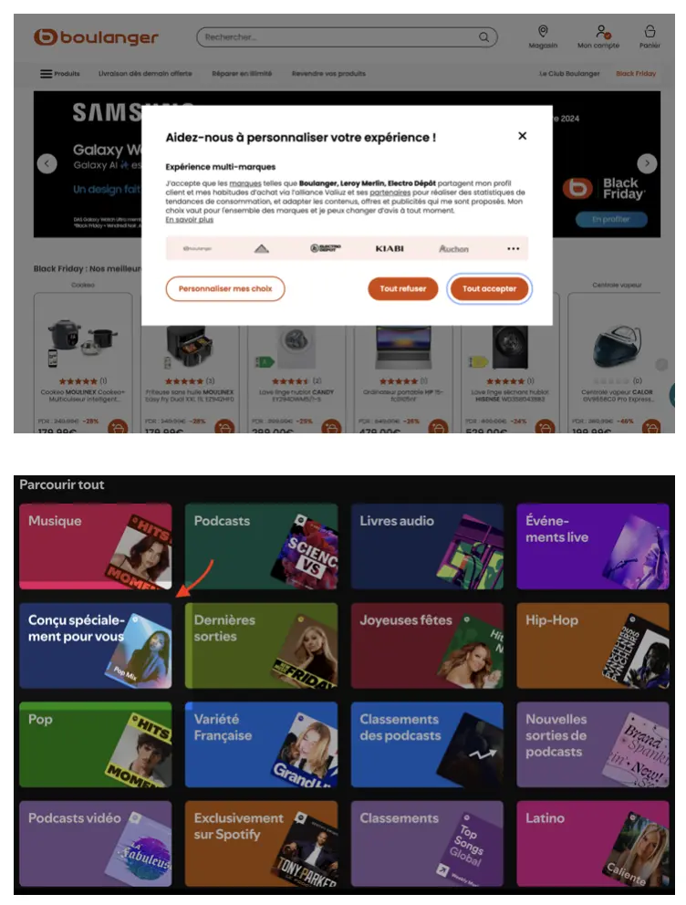
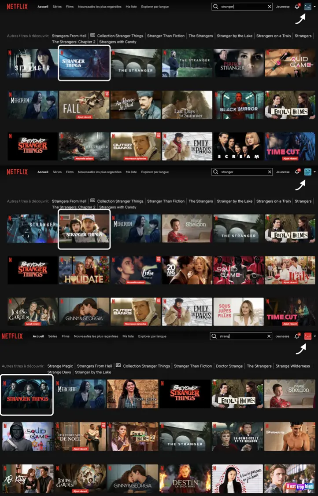
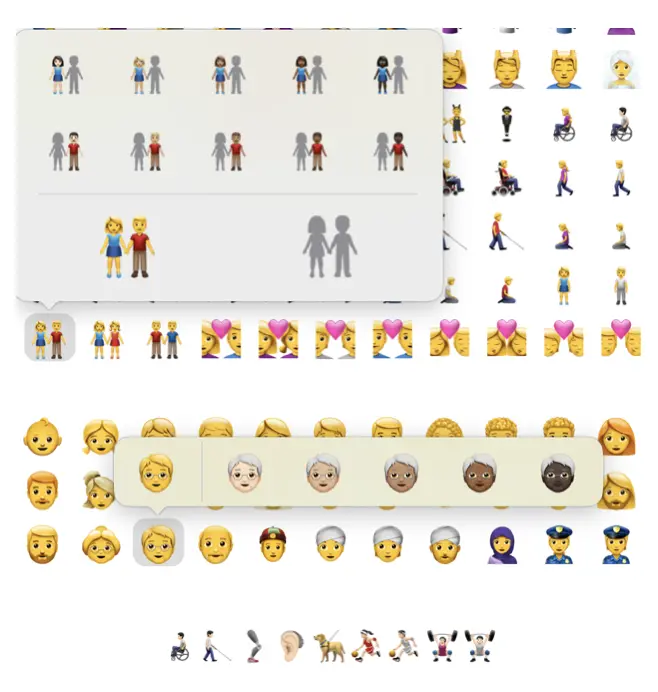
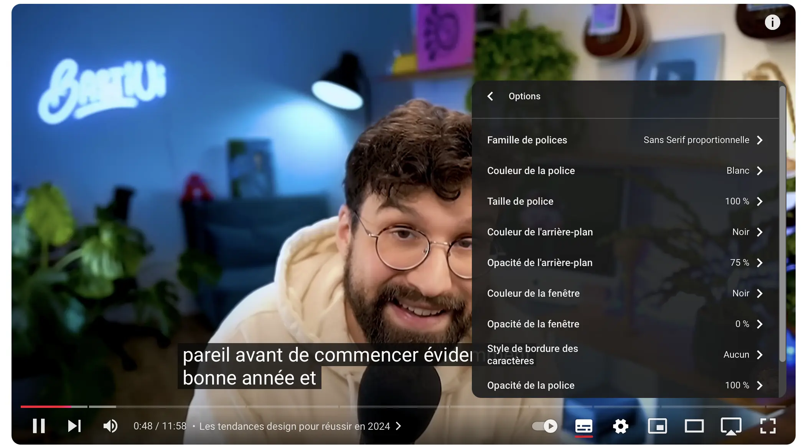
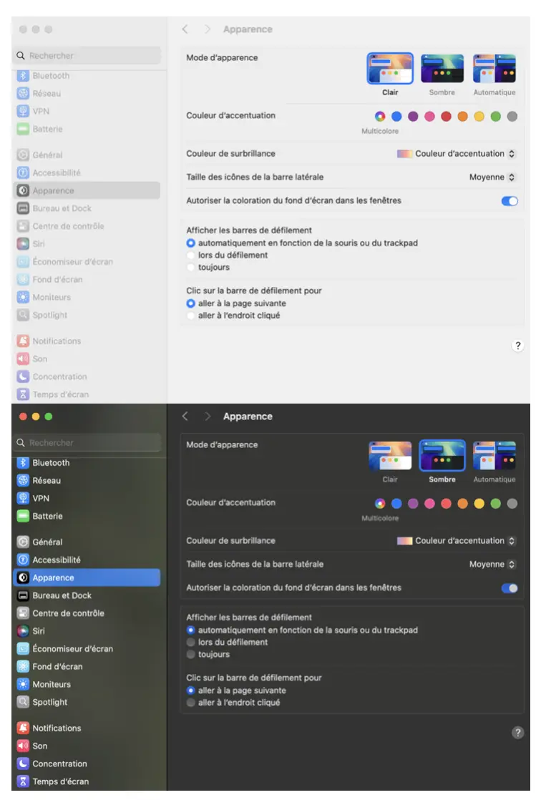
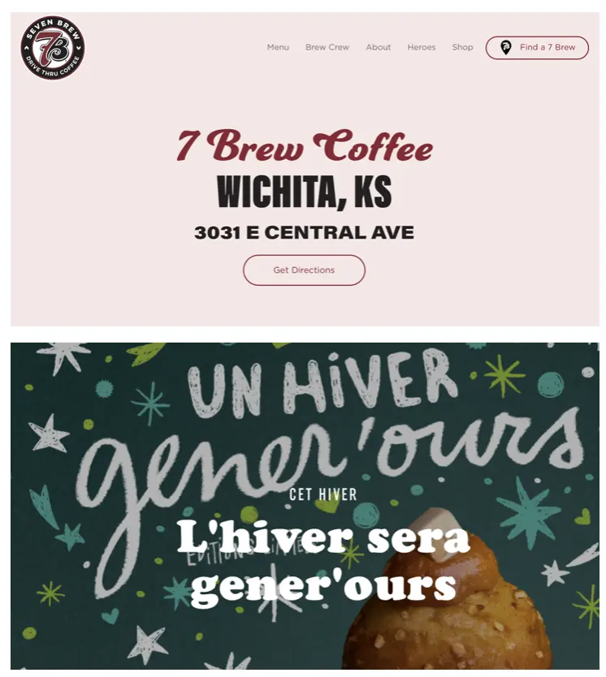
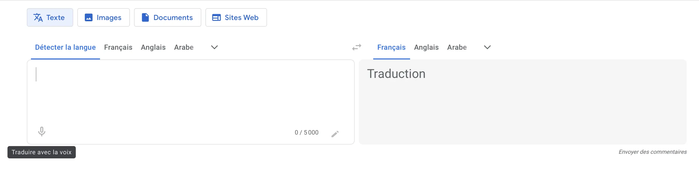
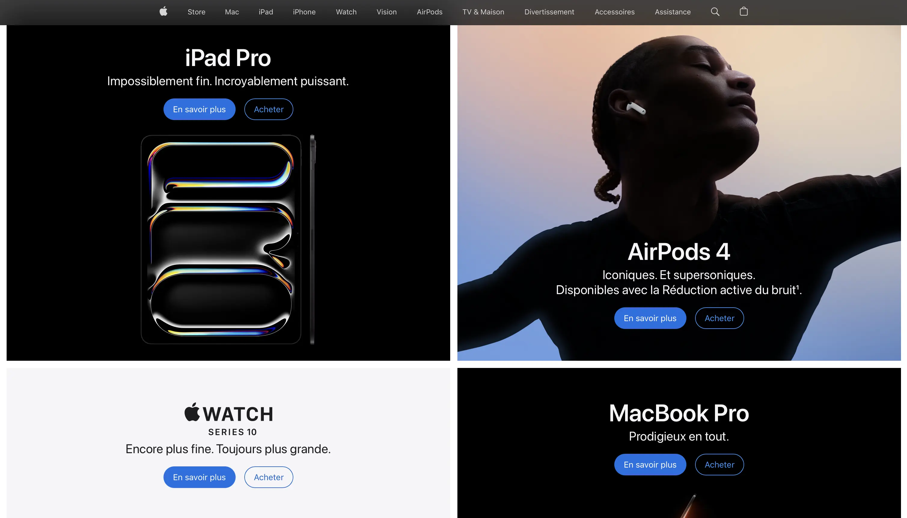



[Introduction à l'UX Design](/promos/2024-2025/Juliette-Kocupyr/mon/temps-1.2/)



## Les tendances UX/UI de 2024

Les tendances UX évoluent chaque année en fonction des préférences des utilisateurs. Ce MON répertorie certaines des plus grosses tendances de l'année 2024 mais il en existe de nombreuses autres. Il faut également garder en tête que ces pratiques vont généralement à l'encontre de l'éthique car les designers utilisent ces méthodes pour capter les utilisateurs et augmenter le profit des entreprises. Mon POK [*Dark patterns et manipulation de l'esprit : la face cachée de l'UX?*](/promos/2024-2025/Juliette-Kocupyr/pok/temps-2/) met en lumière ces techniques de manipulation.

##### 1. Expérience personnalisée 🎨

**La personnalisation des produits et services** est une tendance qui ne cesse de croître à mesure que les marques cherchent de nouvelles façons de satisfaire et de fidéliser leurs clients. Les données récoltées permettent aujourd’hui de proposer **une expérience utilisateur sur-mesure**, anticipant et répondant aux désirs spécifiques de chaque individu, pour créer un lien émotionnel avec les clients et augmenter la valeur perçue des produits et services.


D’après une étude de Epsilon, **80% des consommateurs** sont plus enclins à acheter auprès d’une marque qui offre une expérience personnalisée.


Les stratégies de personnalisation incluent l'utilisation de **l'intelligence artificielle** pour recommander des produits en fonction des achats passés, **des campagnes d'emailing ciblées** selon les préférences des utilisateurs, et des sites web ou applications qui **adaptent leur contenu en temps réel** selon les intérêts et le parcours de chaque utilisateur.

Les recommandations de séries sur Netflix, les suggestions de produits sur Amazon et les playlists pré-faites sur Shopify ne sont que quelques exemples qui montrent que nous vivons dans une ère d'hyper-personnalisation. Ces géants numériques ont prouvé que la personnalisation poussée est un puissant levier d’engagement client.

Il réside tout de même un enjeu de libre arbitre car cela enferme l'utilisateur dans un univers de contenus spécifique, en rendant invisible certains contenus.

##### 2. Le design inclusif ♿️

Avec la prise de conscience croissante des **enjeux d'accessibilité**, de plus en plus d'entreprises intégrent **l'accessibilité et l'inclusivité** dans leurs produits. Cela exige des designers UX une bonne maîtrise des meilleures pratiques en matière d'accessibilité et la capacité de **concevoir pour un large éventail d'utilisateurs**, y compris les personnes en situation de handicap.

Le focus sur un design inclusif et accessible se traduit par une satisfaction client accrue. Les retours d’utilisateurs montrent **une préférence marquée** pour les interfaces qui prennent en compte les besoins variés. Les clients se sentent **valorisés et respectés** lorsque les produits qu’ils utilisent ont été conçus avec une pensée pour leur facilité d’usage.

**La Directive Européenne sur l’Accessibilité (EAA)** est un ensemble de normes adoptées par tous les États membres de l'UE pour garantir un accès égal à l'information, aux produits et aux services pour les personnes handicapées. Ces standards doivent être appliqués à tous les designs d'ici 2024, même en dehors de l'UE, afin d'améliorer l'utilisabilité et l'accessibilité des produits.

Parmi les bonnes pratiques, on retrouve l'utilisation de **texte alternatif** (ALT) pour les images, les **sous-titres** et les **transcriptions** pour les vidéos, les **options de lecture** d'écran, ainsi que des **typographies lisibles et adaptables** aux différentes tailles d'écrans.

##### 3. Green design ♻️

À l’heure où les préoccupations environnementales sont plus présentes que jamais, le green design incite à créer **des sites web plus éco-responsables**. En optimisant les ressources et en favorisant des pratiques durables, les designers contribuent à **réduire l’empreinte écologique du web**.

 Les entreprises, soucieuses de leur impact écologique, intègrent désormais dans leur stratégie UX des solutions qui réduisent leur empreinte carbone tout en répondant aux attentes d’un marché de plus en plus sensible à l’écologie.

L'éco-conception web passe par **l'optimisation des codes et des images** et **des hébergeurs écoresponsables**. Une **UX simplifiée** permet également de **réduire les temps de chargement** et la consommation énergétique. En matière de design durable et éthique, des éléments comme **le mode sombre**, qui **diminue la consommation d'énergie** sur les écrans OLED, ou le choix de **matériaux virtuels plus économes** en ressources, contribuent à une approche plus verte.

Les utilisateurs sont de plus en plus à la recherche de produits et de services qui non seulement répondent à leurs besoins mais qui sont aussi en accord avec leurs valeurs environnementales. En intégrant l’éco-responsabilité dans leur UX, les entreprises ne font pas seulement un geste pour la planète, elles construisent également **une relation de confiance et de fidélité** avec leurs clients.

##### 4. Interaction et animation avancées 💈

L'évolution du design en 2024 met l'accent sur **les interactions et animations avancées**, qui sont devenues des éléments cruciaux dans le design d'interface et le design web. Les animations, en particulier, sont devenues un outil essentiel pour la **narration visuelle** et la communication d'idées complexes de manière simple et compréhensible.

Les **micro-interactions** sont devenues un moyen clé pour captiver l'audience. Elles incluent des éléments comme des **retours tactiles** dans les applications mobiles, des **changements de teinte** selon les états du programme, la **visualisation du chargement des pages**, des animations pendant les transitions, et des **réactions uniques** lors de clics sur certains boutons.

Ces petites touches apportent une dimension plus **chaleureuse** à l’interaction utilisateur, renforçant ainsi la **fluidité** de la navigation et encourageant les visiteurs à passer plus de temps sur le site ou l’application.

Les animations 3D, les animations de réalité augmentée et virtuelle et les animations interactives sont devenues des tendances majeures. Les technologies comme les animations CSS, les transitions et les animations JavaScript sont des outils courants pour créer des animations web. Ces technologies permettent de créer des expériences utilisateur plus immersives et engageantes.

##### 5. Des typographies audacieuses 🖋️

Après une grande vague de "**blanding**", quand de nombreuses marques ont choisi de redesigner leur logo de manière plus épuré, la **typographie audacieuse** revient le devant de la scène avec des polices de caractères **colorées** et **imposantes**, ramenant un peu de spontanéité dans les marques.

Loin des subtiles serif et sans-serif, les designers préfèrent opter pour des “bold typography” qui font une déclaration forte, **captant instantanément l’attention** de l’utilisateur. Cette nouvelle orientation de style, souligne l’importance de la hiérarchie visuelle tout en guidant l’utilisateur à travers le contenu, de manière intuitive.

##### 6. Les interfaces vocales 🔉

**L'interaction sans contact** est une autre tendance de l'UI et de l'UX qui a vu le jour dans le sillage de la pandémie. L'utilisation des **assistants vocaux** et des **enceintes intelligentes** croît lentement, mais la tendance pour les années à venir est à la hausse, avec des prévisions suggérant qu'en 2026, près de la moitié de la population américaine les utilisera.

Cette prolifération de dispositifs activés par la voix incite de plus en plus d'entreprises à intégrer des **interfaces vocales (VUI)** dans leurs produits et services. Cela demande aux designers UX de réfléchir à des expériences vocales efficaces et intuitives. Ils doivent trouver des moyens créatifs d'intégrer les VUI dans leurs conceptions pour les rendre plus **efficaces et conviviales**.

Les services leaders dans ce domaine sont Apple Siri, Google et Amazon Alexa, et bien que de nouveaux concurrents n'arriveront peut-être pas immédiatement, les designers peuvent déjà envisager d'intégrer ces services existants de manière appropriée dans leurs produits.

##### 7. Le Bento design 🔲

Nouvelle tendance UI qui commence à émerger, le **Bento design** s’inspire des **boîtes à repas japonaises**. Ces boîtes **segmentent** les différents ingrédients dans des petites boîtes. Esthétiquement ce rangement est censé dégager un **sentiment de satisfaction**, tout en **hiérarchisant** les éléments et apportant une **clarté visuelle**.

Le concept de segmentation et de clarté visuelle avec une touche de satisfaction a été repris version digital, pour apporter une expérience utilisateur unique. De grandes marques utilisent déjà le Bento design pour leurs sites web : Apple, Spotify, Netflix, Todoist… Le Bento design est **déclinable à l’infini** en fonction des besoins et idées de chacun.

**Les avantages** sont nombreux comme l'optimisation de l’accessibilité, la simplification de la navigation, l'expérience utilisateur intuitive, ou l'adaptabilité à de nombreux supports.

Ces 7 exemples font partie des tendances les plus présentes en ligne, mais lors de mes recherches j'en ai trouvé de nombreuses autres avec parfois des contradictions comme la tendance du maximalisme et du minimalisme. Ce qui m'amène à penser que ces tendances peuvent être bénéfiques mais il faut garder un esprit critique.

#### Suivre les tendances : bonne ou mauvaise idée ?

Naviguer dans l'univers du design UI/UX nécessite **une approche réfléchie et stratégique**. Bien que l'innovation soit essentielle, il est important de ne pas adopter **aveuglément** toutes les nouvelles tendances.

Avant d'intégrer une tendance, il faut d'abord s'assurer qu'elle **répond aux besoins du public cible** et **s'aligne avec l'identité de la marque**. De plus, certaines tendances étant éphémères, il est préférable de privilégier des **designs intemporels** ou facilement **adaptables** pour garantir la durabilité du site.

Il est également crucial de prendre en compte l'impact de ces tendances sur **la performance du site**, car certaines peuvent nuire à la vitesse de chargement et à l'expérience utilisateur. En somme, l'équilibre entre l'innovation et la stabilité est essentiel pour créer une expérience utilisateur efficace et pérenne.

## Bibliographie

[**WS Interactive**. *Les tendances UI/UX 2024*.](https://www.ws-interactive.fr/blog/les-tendances-ui-ux-2024/)

[**Source Group Marketing**. *Tendances UX/UI design*.](https://sourcegroup.marketing/blog/tendances-ux-ui-design/#elementor-toc__heading-anchor-0)

[**Blog UX**. *Quelles sont les dernières tendances UX design ?*.](https://blog-ux.com/quelles-sont-les-dernieres-tendances-ux-design/)

[**UserGuiding**. *Tendances UX/UI*.](https://userguiding.com/fr/blog/tendances-ux-ui)

[**Wix**. *UX design trends*.](https://www.wix.com/blog/ux-design-trends#viewer-aaom7)

[**Graphiste.com**. *Tendances UX/UI*.](https://graphiste.com/blog/tendances-ux-ui/)

[**Lyssna**. *UX design trends*.](https://www.lyssna.com/blog/ux-design-trends/#1-the-continued-rise-of-voice-interfaces)

[**Esokia**. *Tendances design UX/UI 2024*.](https://esokia.com/fr/blog/tendances-design-ux-ui-2024)

[**Studio Nvzt**. *Les tendances UX/UI 2024* [Vidéo].](https://www.youtube.com/watch?v=GvV1QJfM8wo&t=357s&ab_channel=StudioNvzt)

[**BastiUi**. *Top UX/UI Trends to Follow in 2024* [Vidéo].](https://www.youtube.com/watch?v=QqvW6jlH8KA&t=17s&ab_channel=BastiUi)

[**Baptiste Création**. *Tendances UX/UI 2024* [Vidéo].](https://www.youtube.com/watch?v=-HvrtfETxuM&t=464s&ab_channel=baptistecr%C3%A9ation)
