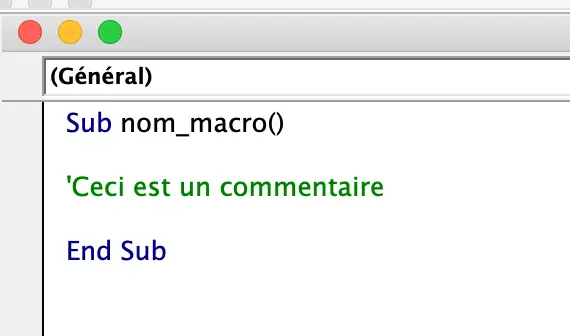
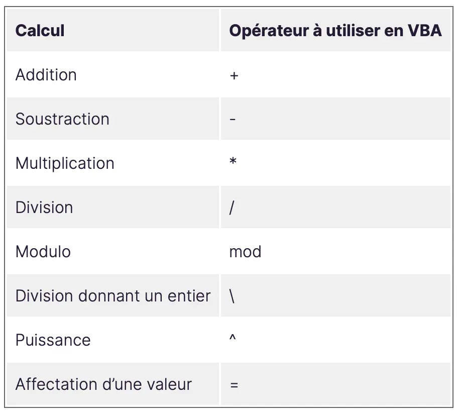
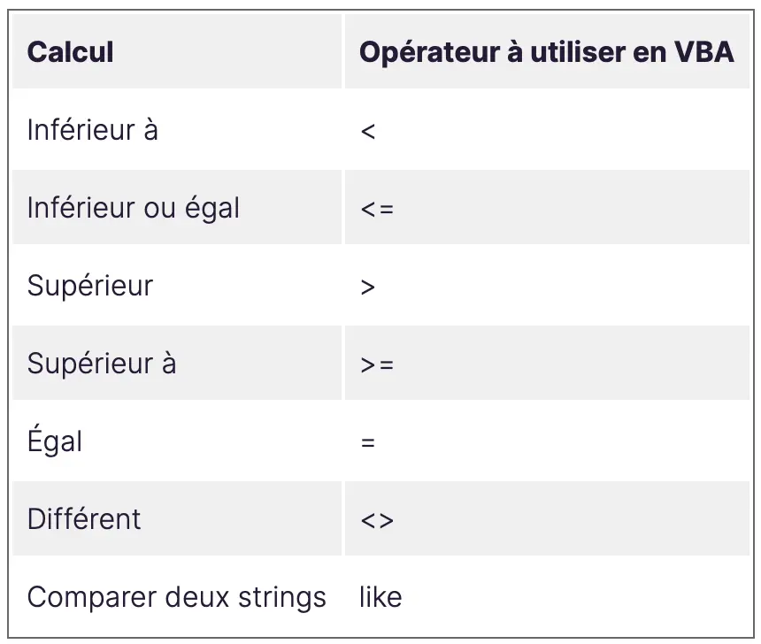
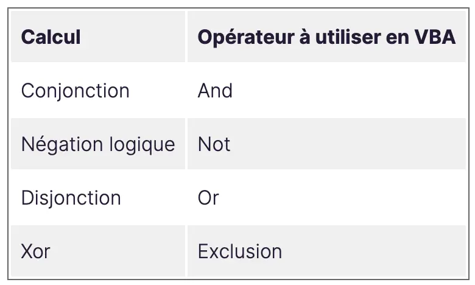
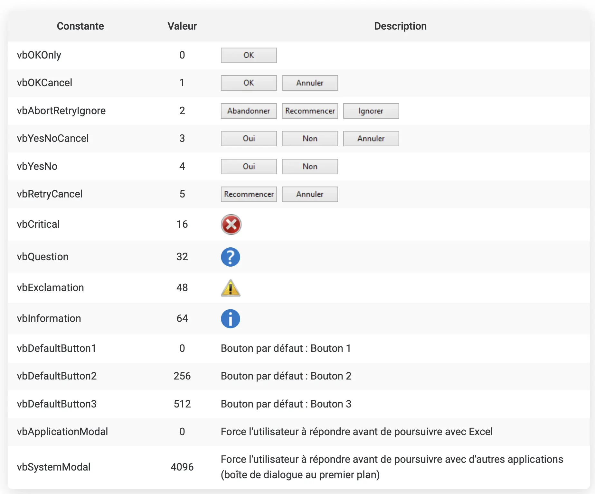

- Niveau : débutant
- Prérequis : Aucun

Étant un outil du quotidien en entreprise, j’y ai souvent été confrontée lors de mes stages et j'ai eu du mal à l'exploiter au mieux. J’ai donc voulu, avec ce MON, reprendre les bases d’Excel et apprendre les fondamentaux de VBA.

## Les bases d'excel

Pour réaliser ce travail, j’ai suivi les vidéos de la formation [Microsoft Excel 365](https://www.youtube.com/playlist?list=PL8sQnj6qF1Lv6ejdklq25MGfPJFxThMw6), car ce sont des vidéos de 3 à 10 minutes, qui peuvent être regardées en accéléré. C’est assez pratique et cela reprend pas à pas les bases d’Excel et les fonctions utiles. Cela peut paraître très basique, mais ça ne fait pas de mal de repartir du début, car je me suis aperçu qu’il me manquait certaines notions. J’ai appliqué de petits exercices simples pour travailler chaque notion. Étant assez rapide, j’ai regardé en complément la formation [Excel-pratique](https://excel-pratique.com/fr/formation-excel), car de nombreux MON existants sur le sujet ont suivi cette formation. Cela m’a permis de refaire des exercices pour compléter les notions des vidéos.

Parmis les notions abordées dans ces vidéos, on retrouve notamment :

- Les notions de bases (ajouter, copier, déplacer, agrandir, ajuster, fusionner …) des feuilles, lignes, colonnes et cellules
- Gérer l'affichage et l'impression des feuilles Excel
- La création de tableaux, graphiques et graphiques sparklines esthétiques
- Les formules et calculs de base (+,-,x,/) et la notion de pourcentages
- L'utilisation de la mise en forme conditionnelle
- Trier et filtrer des listes et trouver le maximum et le minimum automatiquement
- Le comptage automatique avec ou sans condition avec les fonctions NBVAL et NB.SI
- L'utilisation des fonction SI, SI imbriqués, ET et OU
- L'utilisation des fonctions ALEA, ALEA.ENTRE.BORNES et TABLEAU.ALEA pour générer des nombres aléatoires
- Créer des listes déroulantes
- La validation de données, la recherche de données et l'utilisation de la fonction RANG
- Créer et gérer des tableaux et graphiques croisés dynamiques
- Générer une carte géographique (statistique par pays) et convertir des devises automatiquement

## Découvrir VBA

Après avoir repris les bases d’Excel, j’ai voulu approfondir avec VBA, que je ne connaissais pas du tout. J’ai également suivi la formation [Excel-pratique](https://excel-pratique.com/fr/vba), car c’est celle qu’ont suivie une majorité de personnes ayant fait un MON VBA. Tout n’étant pas toujours très clair, j’ai pris le temps de regarder également la formation [Découvrez les fondamentaux de VBA](https://openclassrooms.com/fr/courses/8039296-decouvrez-les-fondamentaux-vba) d’OpenClassrooms. Cette dernière reprend de manière plus simplifiée le VBA, ce qui permet une introduction plus claire, en particulier lorsqu’on ne maîtrise pas bien ce sujet. Elle propose des exercices simples pour mieux appréhender ces notions.

**VBA (Visual Basic for Applications)** est un langage de programmation intégré dans Microsoft Excel qui permet d'**automatiser des tâches**, de **personnaliser des fonctions** et d'**interagir avec des données** dans des feuilles de calcul. Grâce à VBA, vous pouvez **créer des macros** qui exécutent des séries d'instructions, gérer des objets Excel (comme des feuilles de calcul, des cellules, des graphiques, etc.) et ajouter de la logique conditionnelle pour des traitements complexes.

### Les notions clés

**L’enregistreur de macro** est un outil qui va retranscrire tout ce que vous allez faire sur Excel en code VBA automatiquement. Ainsi, vous n’avez pas besoin d’écrire du code, le logiciel le fait pour vous.
Mais il y a quand même une limitation à cela, le code n’est pas optimisé et il ne permet pas d’utiliser des variables, des boucles, des tests, etc.

Il est important de comprendre que le VBA est une programmation qu’on appelle **programmation orientée objet (POO)**. Les principaux objets pour Excel sont : Workbook, Sheets, Range, Windows, Chart. Un objet en VBA peut contenir un autre objet, des caractéristiques, des méthodes ou des événements.

- **une caractéristique** est une propriété de notre objet:
   police : Times, couleur : bleu, gras : non, etc.
- **une méthode** est un verbe, une action que nous allons faire:
  les différentes méthodes peuvent être remplacer, ajouter, trier, couper, coller, etc. ce sont des actions que nous allons faire sur une cellule (avec l’objet range)
- **un événement** est une action qui va se produire quand une condition va être remplie:
  par exemple l'événement “newsheet” de l’objet “application” permet de déclencher le lancement d’un sous-programme à chaque fois qu’on ajoute une feuille

Dans la fenêtre de code, certains mots sont écrits en bleu, en noir ou en vert.

- Bleu : Ce sont les mots-clés.
- Vert : Ce sont les commentaires.
- Noir : C'est le code classique.



En cas d'erreur de code, une fenêtre d’erreur apparaît lors de l'execution. Objectivement, l’erreur décrite n’est pas vraiment parlante mais vous pouvez par contre appuyer sur **“Débogage”** pour voir la ligne avec l’erreur surlignée.

**Le format de base d’Excel**, le XLSX, ne prend pas en charge les macros. C'est-à-dire que si vous créez une macro et que vous enregistrez le fichier en classeur Excel (.xlsx), votre macro ne sera pas sauvegardée dans le fichier Excel. C’est une mesure de sécurité pour excel. Pour enregistrer une macro, **il faut passer en XLSM.**

Voici la liste des différentes extensions Excel :

- classeur Excel (.xlsx)
- classeur Excel prenant en charge les macros (.xlsm)
- classeur Excel binaire (.xlsb)
- classeur Excel 93 - 2003 (.xls)

Une bonne pratique en VBA est de mettre **un mot de passe** aux macros pour être le seul à pouvoir les éditer.

### Les variables

Le VBA ne fait pas exception à la règle : comme tous les langages de programmation, il utilise des variables. Prenons une définition simple : une variable, c’est un élément auquel on affecte une valeur.

Déclarer une variable :

```vba
Dim [NomVariable] As [TypeDeDonnée]
```

### Les opérateurs conditionnels

Parmis les opérateurs conditionnels, on retrouve des opérateurs arithmétiques, de comparaison, de logiques et de concaténation.

**Les opérateurs arithmétiques :**

Toutes les opérations arithmétiques classiques s’utilisent avec des nombres (integer, float, etc.)



**Les opérateurs de comparaison :**



**Les opérateurs logiques :**



**Les opérateurs de concaténation :**

La concaténation se fait généralement sur du **texte** (donc des strings). On peut utiliser l’opérateur **+** ou **&** . L’opérateur  +  s’utilise pour additionner des nombres, donc par convention on va plutôt utiliser le  &  et laisser le  +  aux nombres, même si les deux versions fonctionnent.

### Quelques fonctions de base

<br>

##### Les conditions

**If...Then...Else :** Permet de tester une ou plusieurs conditions et d'exécuter des actions en fonction de ces conditions.

```vba
If [Condition] Then
    [Instructions si la condition est vraie]
ElseIf [AutreCondition] Then
    [Instructions si la deuxième condition est vraie]
Else
    [Instructions si aucune des conditions n'est vraie]
End If
```

**Select Case :** Alternative plus lisible à plusieurs If...ElseIf pour couvrir toutes les valeurs d'une variable.

```vba
Select Case [Variable]
    Case [Valeur 1]
        [Instructions pour la valeur 1]
    Case [Valeur 2], [Valeur 3]
        [Instructions pour la valeur 2 et 3]
    Case Else
        [Instructions si aucune des valeurs ne correspond]
End Select
```

##### Les boucles

**For...Next :** Utilisé pour répéter un bloc d'instructions un nombre spécifique de fois.

```vba
For [Compteur] = [ValeurInitiale] To [ValeurFinale] [Step [Incrément]]
    [Instructions]
Next [Compteur]
```

**For...Each :**  Permet d'itérer à travers une collection d'objets ou une plage de données, sans avoir à se soucier de l'index (numéro de ligne ou de colonne).

```vba
For Each [Élément] In [Collection] [Instructions]
Next [Élément]
```

**Do...Loop  :** Boucles qui exécutent un bloc d'instructions tant qu'une condition est vraie. Le  Do  a un fonctionnement assez similaire au  For, à la nuance près qu’il n’y a pas d’incrémentation automatique.

```vba
Do While [Condition]
    [Instructions]
Loop
```

```vba
Do Until [Condition]
    [Instructions]
Loop
```

Il existe des instructions pour sortir des boucles en cas de blocage notamment : **Exit For** pour les boucles For et **Exit Do** pour les boucles Do.

##### Les boîtes de dialogue

**MsgBox :** Affiche une boîte de message dans Excel pour informer l'utilisateur ou récupérer une réponse.

```vba
MsgBox ([Message], [Bouton], [Titre])
```

Voici les différents boutons existant :



## Conclusion

Revoir les bases d’excel s'est avéré très utile mais découvrir VBA m’a pris beaucoup de temps je n’ai pas pu réellement appliquer toutes les notions parcourues. Ce travail sera donc l'objectif d’un prochain projet.