

[Introduction à l'UX et éthique du designer](/promos/2024-2025/Juliette-Kocupyr/mon/temps-1.2/)




<a href="./image2/carte.pdf"
   download="Dark_Patterns.pdf">N'hésitez pas à cliquer pour télécharger la carte mentale en PDF</a>



## Objectifs

Ce POK sera une aide pour déceler les pièges des UX designers pour éviter de se faire piéger sur les sites et applications que nous utilisons au quotidien. C'est également une manière de dénoncer la manipulation et l'influence de l'économie pour ces entreprises.

### Sprint 1

- [x] Comprendre les enjeux des dark patterns
- [x] Étudier les dark patterns existants
- [x] Trouver des exemples pour illustrer mes propos

##### Horodatage

| Date | Heures passées | Indications |
| -------- | -------- |-------- |
| Mercredi 23/10  | 3H  | Étude de vidéos et sites pour comprendre le design non éthique |
| Jeudi 24/10  | 1H  | Travail sur des exemples de sites utilisant des dark patterns |
| Jeudi 14/11  | 3H  | Comprendre les enjeux des dark patterns |
| Vendredi 15/11  | 3H  | Synthèse des premières recherches sous forme de carte mentale |

### Sprint 2

- [x] Trouver le format le plus optimal et compréhensible pour le rendu
- [x] Synthétiser les recherches
- [x] Rédiger le guide visuel des dark patterns

##### Horodatage

Toutes les séances et le nombre d'heure que l'on y a passé.

| Date | Heures passées | Indications |
| -------- | -------- |-------- |
| Lundi 25/11  | 3H  | Recherche d'exemples pour chaque dark pattern |
| Mercredi 27/11  | 2H  | Étude de la captologie et des nudges |
| Jeudi 12/12  | 1H  | Étude des lois contre les dark patterns |
| Vendredi 13/12  | 4H  | Mise en forme visuelle de la carte mentale |

## Contenu

### Premier Sprint

Lors du premier sprint j'ai essayé de définir ce qu'est le design non éthique en définissant les termes clés et en apportant un maximum d'exemples de dark patterns. Le format qui m'a semblé le plus compréhensible et synthétique est une carte mentale pour avoir toutes les notions facilement accessibles pour qu'un utilisateur puisse rapidement savoir s'il se fait manipuler sur un site.

Pour mes objectifs du sprint 1, j'ai rempli en partie toutes les tâches car il y a beaucoup plus de technique de manipulation que je ne le pensais. Il y a aussi une quantité très importante d'exemples donc ma recherche n'est pas entièrement aboutie. Mais le format du rendu m'a semblé évident lors de mes premières recherches alors que je pensais le faire une fois l'ensemble des données récoltées. Je pense avoir mal réparti mes tâches plutôt que mal estimé leur durée car ce qu'il reste sera réalisable dans le temps imparti.

##### Les enjeux éthiques de l'UX design

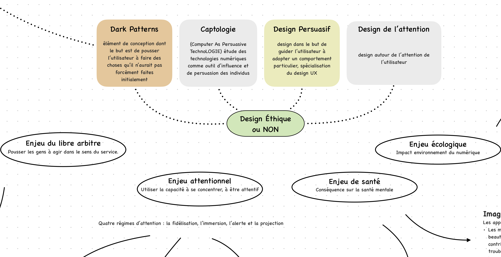

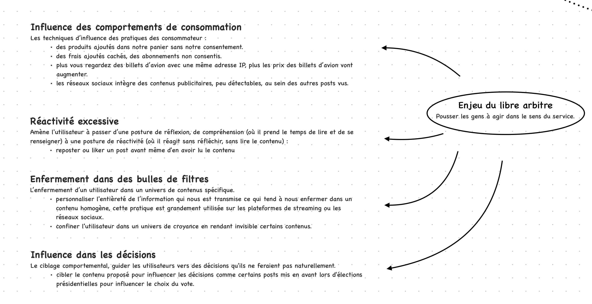

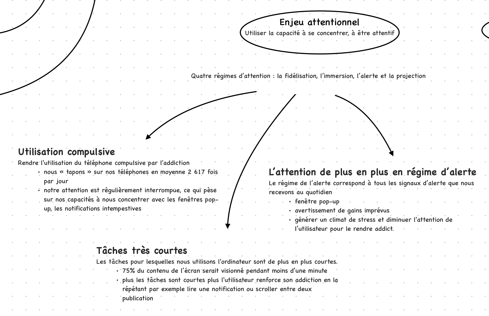

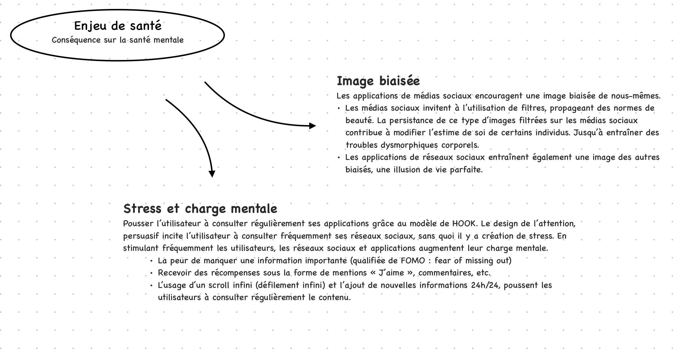

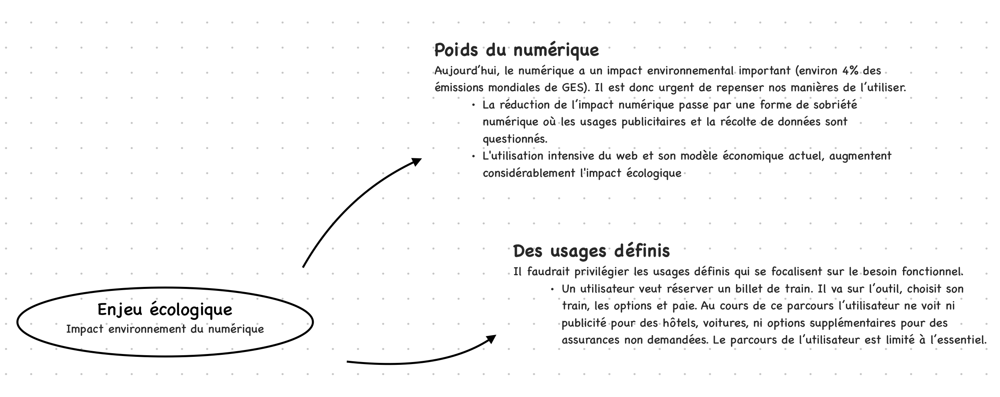

##### Le design persuasif

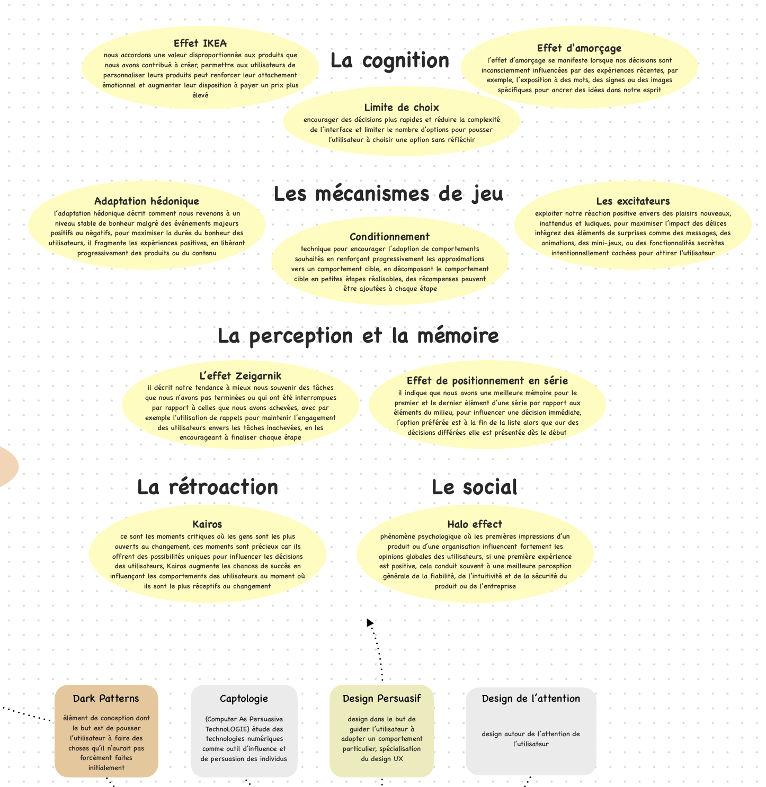

##### Les dark patterns

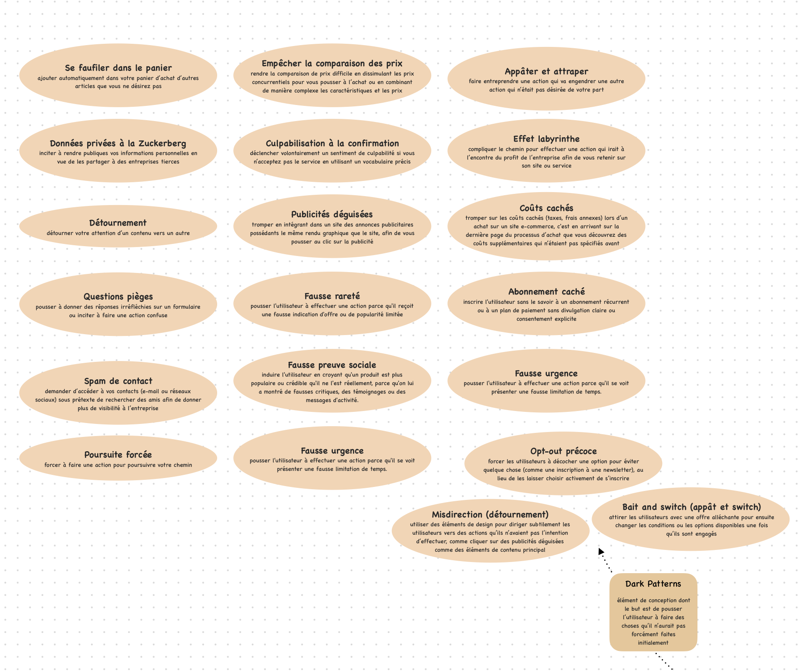

### Second Sprint

Durant ce second sprint, j'ai pu achever mon travail de recherche et de mise en forme pour obtenir une carte mentale. L'objectif de cette carte est de condenser les notions principales sur le sujet et de rester accessible afin de pouvoir aider n'importe quel utilisateur à savoir réagir face aux dark patterns. En la téléchargeant, l'utilisateur peut la conserver pour l'avoir sous la main en cas de besoin. Un des points importants que j'ai découvert durant ce travail est que la loi est très floue sur ces sujets  aujourd'hui. Donc la meilleure façon de se protéger, au-delà de faire attention en naviguant sur Internet, c'est la prévention et la communication sur le sujet. Cela permettra aux designers de mieux se rendre compte de l'impact de leur travail pour viser un web plus éthique.

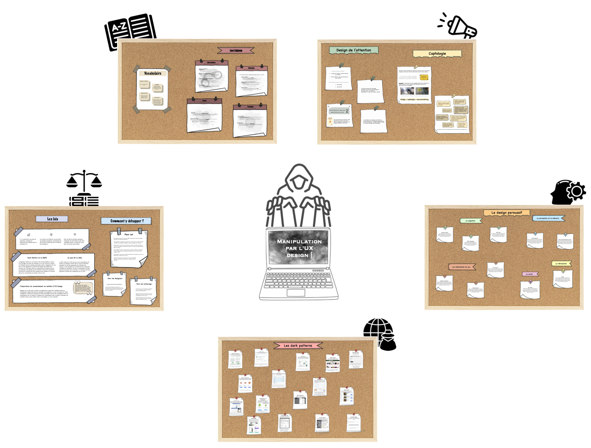

La carte se compose de cinq tableaux, chacun abordant une notion clé mise en avant un peu plus bas. Si vous le souhaitez, cliquez sur le lien ci-dessous pour la télécharger en format PDF, pour en faciliter la lecture (pensez à zoomer!).

<a href="./image2/carte.pdf"
   download="Dark_Patterns.pdf">Télécharger la carte en PDF</a>

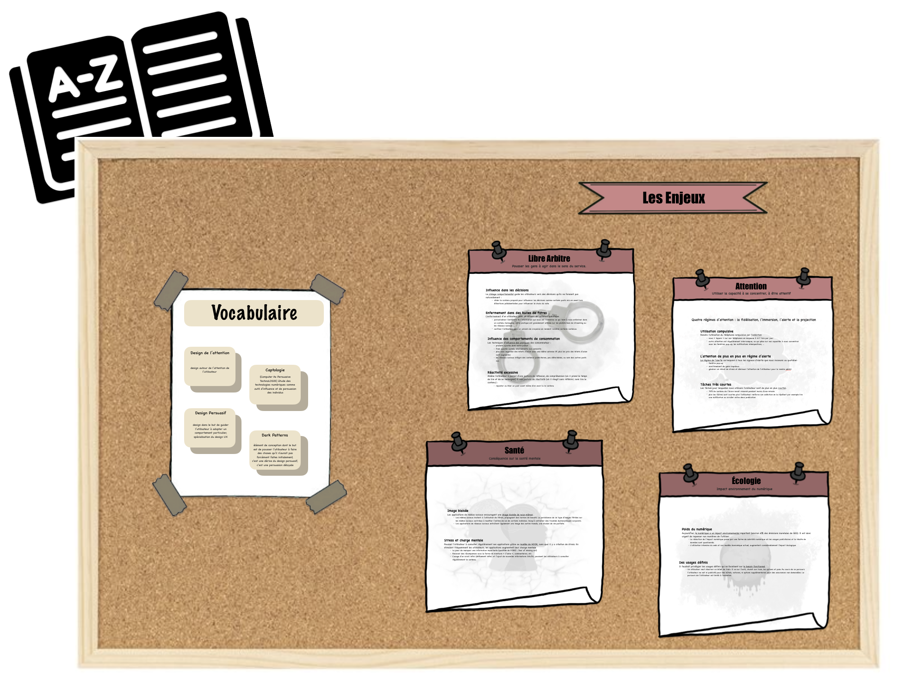

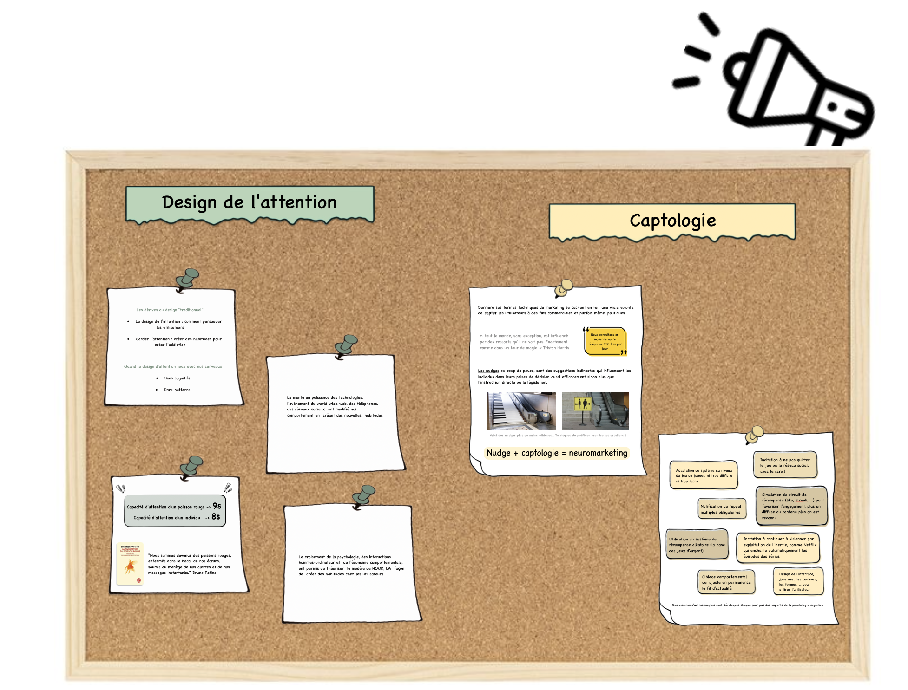

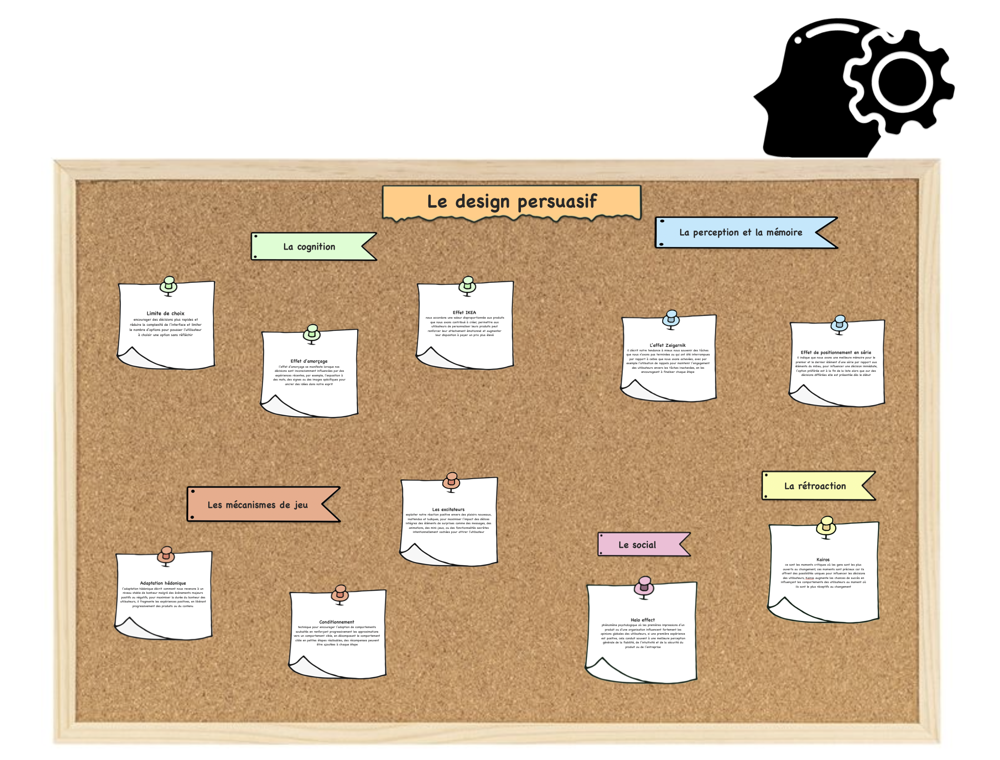

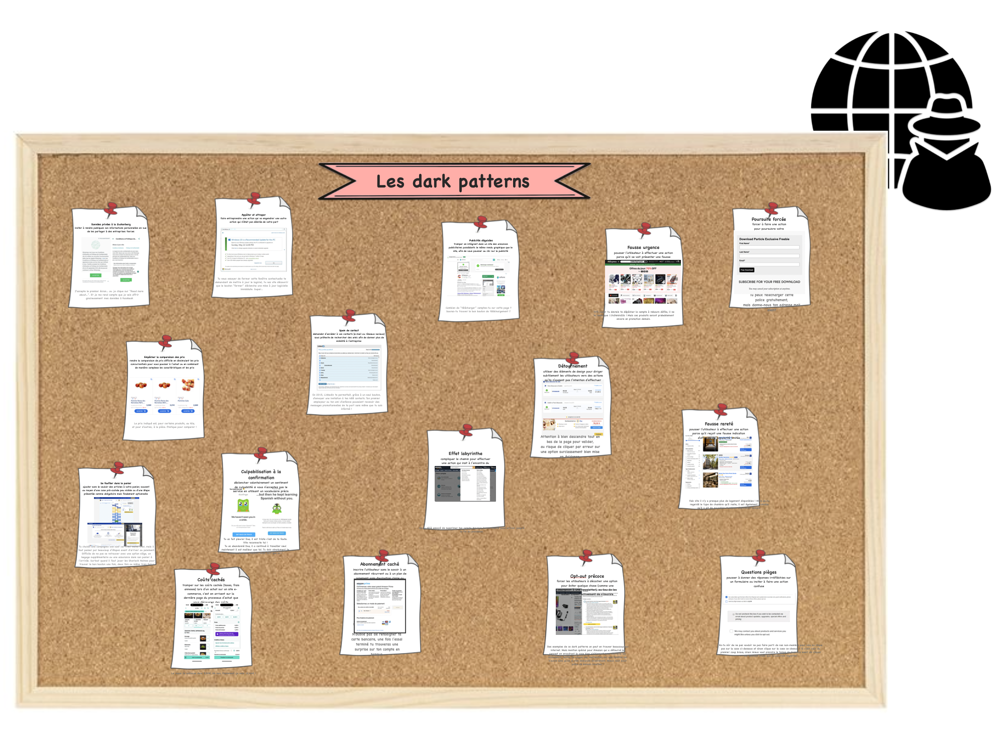

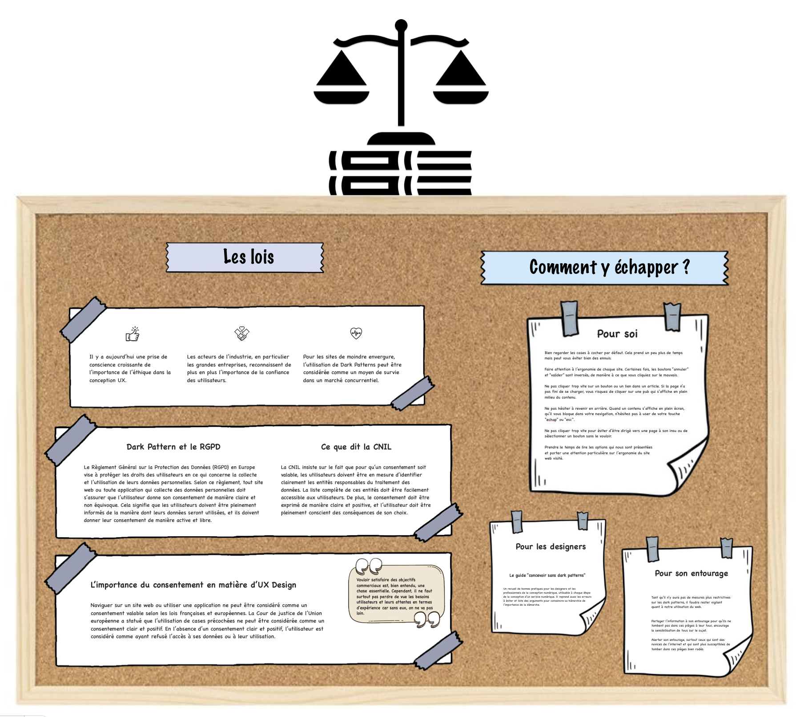

##### Les enjeux éthiques de l'UX design

<video width="80%" controls>
  <source src="./image2/enjeux.mp4" type="video/mp4">
</video>

##### Le design de l'attention et la captologie

<video width="80%" controls>
  <source src="./image2/attention.mp4" type="video/mp4">
</video>

##### Le design persuasif

<video width="80%" controls>
  <source src="./image2/biais.mp4" type="video/mp4">
</video>

##### Les dark patterns ou deceptive design

Le site [Deceptive Design](https://www.deceptive.design) est une référence mondiale en dark patterns. Son fondateur Dr. Harry Brignull est un expert des manipulations trompeuses, il dénonce les sites utilisant ces méthodes sur son "mur de la honte" et présente les lois internationales sur le sujet. *Malheureusement, il n'est plus tout à fait à jour et ne recense pas tous les exemples existants.*

<video width="80%" controls>
  <source src="./image2/dp.mp4" type="video/mp4">
</video>

##### Les lois anti-dark patterns et les bonnes pratiques pour se protéger

<video width="80%" controls>
  <source src="./image2/loi.mp4" type="video/mp4">
</video>

## Bibliographie

- [**Designers Éthiques**. *Concevoir sans dark patterns*.](https://beta.designersethiques.org/fr/thematique-design-persuasif/concevoir-sans-dark-patterns/1-introduction#Enjeu-attentionnel)

- [**UX Republic**. *Maximiser l'impact du design UX avec les persuasive design patterns*.](https://www.ux-republic.com/maximiser-limpact-du-design-ux-avec-les-persuasive-design-patterns/)

- [**La Grande Ourse Design**. *Les dark patterns et le nudge en UX*.](https://lagrandeourse.design/blog/les-dark-patterns-et-le-nudge-en-ux/)

- [**Atipik**. *Définition des dark patterns en design UX*.](https://www.atipik.ch/fr/blog/definition-dark-patterns-design-ux)

- [**Novaway**. *Dark Pattern et expérience utilisateur : définition et exemples*.](https://www.novaway.fr/blog/ui-ux-design/dark-pattern-experience-utilisateur)

- [**YouTube**. *Les Dark Patterns : comprendre leur fonctionnement et leurs enjeux* [Vidéo].](https://www.youtube.com/watch?v=fx5VZFdkuf4)

- [**UX Design Institute**. *What are dark patterns in UX? UX Design Institute*.](https://www.uxdesigninstitute.com/blog/what-are-dark-patterns-in-ux/)

- [**Blog-UX**. *Les dark patterns, pièges de l'UX*.](https://blog-ux.com/les-dark-patterns-pieges-de-lu/)

- [**HEC Digital**. *La face cachée du design UX : les dark patterns*.](https://digital.hec.ca/blog/la-face-cachee-du-design-ux-les-dark-patterns/)

- [**Youtube**. *Dark Patterns in UX Design* [Vidéo].](https://www.youtube.com/watch?v=R6ncqTAGVGk)

- [**Bejamas**. *10 dark patterns in UX design*.](https://bejamas.com/blog/10-dark-patterns-in-ux-design)

- [**Notre COP21**. *Mieux comprendre le design de l'attention et les dark patterns : interview de Flora Brochier.*](https://www.notrecop21.fr/mieux-comprendre-le-design-de-lattention-et-les-dark-patterns-interview-de-flora-brochier-des)

- [**Deceptive Design**. *Deceptive Design*.](https://www.deceptive.design)