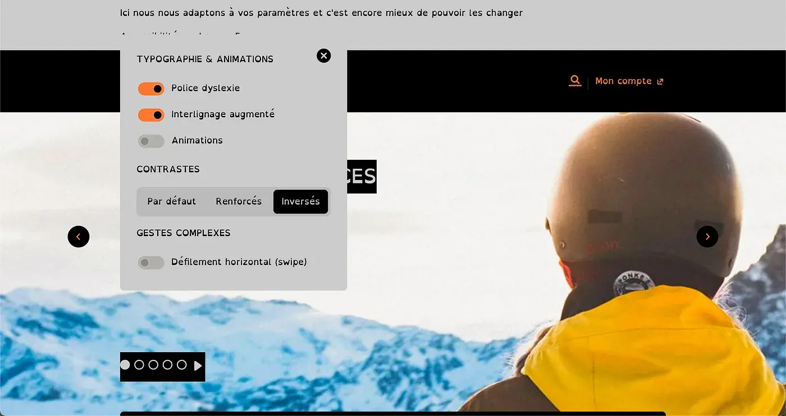
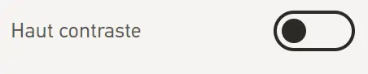
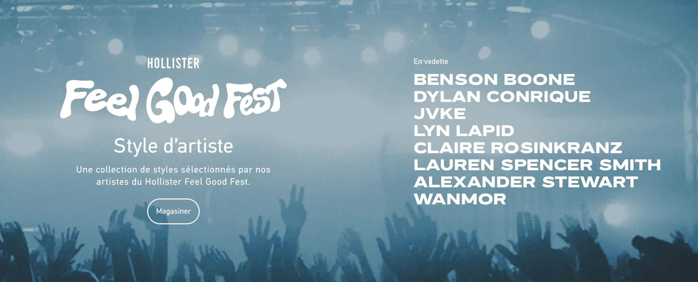
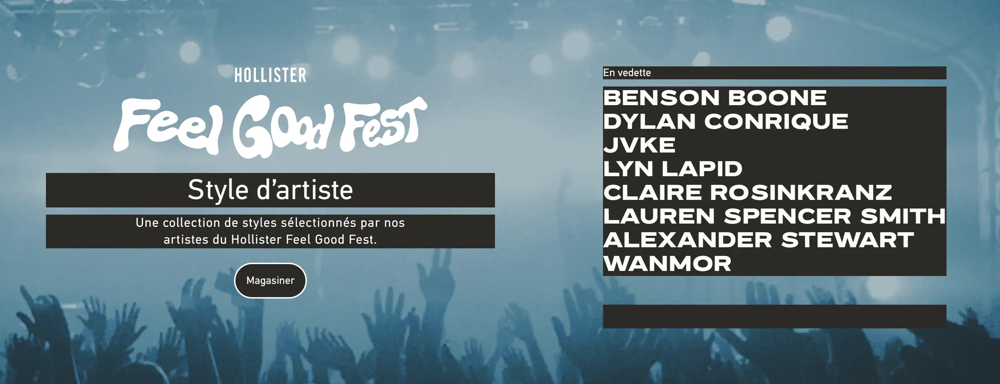
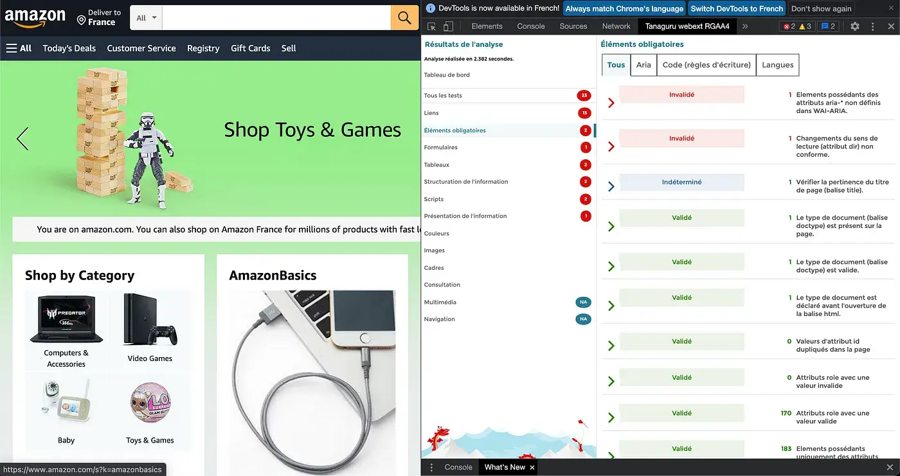



Avoir déjà utilisé Figma ou une maquette d'interface.



L'objectif de ce MON est de comprendre comment penser et adapter les interfaces pour une expérience plus inclusive, notamment pour les utilisateurs en situation de handicap.

Le MON s'adresse aux débutants 

## Objectifs du MON

L'étude se découpera en deux temps : comprendre et réaliser.

1. **Comprendre :** 

   * **Les aspects théoriques :** typologie des différents handicaps et difficultés à prendre en compte (auditifs, visuels, troubles dys...), statistiques...
   * **Les bonnes pratiques :** comment rendre un site adapté aux différents utilisateurs et les erreurs à éviter ; [méthode FALC](https://www.culture.gouv.fr/Thematiques/developpement-culturel/Culture-et-handicap/Facile-a-lire-et-a-comprendre-FALC-une-methode-utile) ; design, notion de contraste, choix graphiques...
   * **Quelques études de cas :** identification et analyse critique de quelques sites inclusifs et d'exemples de sites peu adaptés.
   * **Les limites possibles.**

2. **Réaliser une interface inclusive**, via une maquette Figma en apportant des corrections et/ou améliorations à des components et ainsi s'approprier les bonnes pratiques. ()

À noter, le prisme du handicap permet de répondre aussi à d'autres types de réflexions pour penser une UI/UX accessible au plus grand nombre de persona (âge et fracture générationnelle, niveaux d'éducation variés, niveaux de langues...).
F

## Introduction

### A - C’est quoi l’accessibilité ?

Certains composants des interfaces web excluent les utilisateurs porteurs d’un handicap (permanent ou temporaire) : ce nombre est estimé à **15% des utilisateurs**… soit près d**’1 milliard d’internautes** pour lesquels le web n’est pas un long fleuve tranquille !

Concrètement, le terme handicap désigne “la **limitation des possibilités d’interaction d’un individu avec son environnement, causée par une déficience provoquant une incapacité, permanente ou non**. Il exprime une déficience vis-à-vis d’un environnement, que ce soit en termes d**’accessibilité, d’expression, de compréhension ou d’appréhension**. Il s’agit donc plus d’une notion sociale que d’une notion médicale.” (source : Comité national Coordination Action Handicap - CCAH) 

Un handicap est d’ailleurs le plus souvent **invisible** (80% des handicaps) et **s’acquiert au cours de la vie** (85% VS 15% à la naissance) : tout le monde pourrait donc un jour être concerné par ces sujets.

Dans un monde où le digital est toujours plus important, pour s’informer ou un besoin administratif en passant aux interactions sociales, il est nécessaire que ces supports soient adaptés à tous. Pour cela, il est important de d’abord prendre conscience de ce qui se cache concrètement derrière ce terme, très vaste.

**Concrètement, il y a 4 principes fondamentaux autour d’un contenu inclusif (site ou appli) :**

1. Le site doit être **perceptible** (image, son et toucher) ;
2. Le site doit être **utilisable** (avec des alternatives à la souris) ;
3. Le site doit être **compréhensible** et clair (il guide les utilisateurs si nécessaire) ;
4. Le site doit être **robuste** et pouvoir être compatible à différents contextes ou outils (comme un lecteur d’écran par exemple).

### B - Les types de handicap

Il y a différentes typologies de handicap :

- **Handicap moteur** (ou déficience motrice) qui recouvre l’ensemble des troubles pouvant entraîner une atteinte partielle ou totale de la motricité (troubles de la dextérité, paralysie, amputation, difficultés pour se déplacer, conserver ou changer une position, prendre et manipuler, effectuer certains gestes,…).
- **Handicap auditif ou surdité**, totale ou partielle. Les personnes peuvent être appareillées ou non, certaines personnes s’expriment uniquement en langage des signes (LSF) tout comme d’autres peuvent s’exprimer verbalement (oralisme). Concrètement, faire passage un message qu’au travers du son d’une vidéo sur votre site sans sous-titre pourrait limiter les utilisateurs.
- **Handicap visuel**, comme la cécité (aveugle) ou la malvoyance. Les personnes développent généralement davantage leurs autres sens, notamment le sens du toucher. Il y a aussi les handicaps tel que le daltonisme ou l’achromatopsie (pas de vision des couleurs).
- **Handicap psychique,** issue d’une maladie psychique (phobie, anxiété généralisée, peur panique, agora-phobie, trouble obsessionnel compulsif (TOC), bipolarité...). Il peut être durable ou épisodique et peut apparaitre à tout âge. À la différence du handicap mental, le handicap psychique n’affecte pas la capacité intellectuelle de la personne.
- **Handicap cognitif,** conséquence d’une déficience des grandes fonctions cérébrales supérieures que sont l’attention, la mémoire, les fonctions exécutives et perceptives, le raisonnement, le jugement, le langage. Cela se manifeste par différentes difficultés sur des fonctions cognitives très précises comme le langage (écrit, oral), la mémorisation, la motricité fine (en cas d’apraxie) comme sur des fonctions plus larges telles que les interactions sociales ou l’attention (dans certains cas d’autisme). *Ex. Troubles du déficit de l’attention/hyperactivité (TDAH), troubles DYS comme la dyslexie ou la dysorthographie, troubles du spectre de l’autisme (TSA),..*.
- **Handicap mental** ou déficience intellectuelle, qui se caractérise par une réduction des facultés intellectuelles sous des formes très variables (difficulté à comprendre, développement psychologique plus ou moins perturbé, difficultés d’ordre spatio-temporel). *Ex. Trisomie 21.*
- **Maladies chroniques évolutives ou invalidantes**, qui peuvent entrainer une restriction d’activité  ou des contraintes plus ou moins importantes. Elles peuvent être momentanées, permanentes ou évolutives. Ex. Épilepsie, maladie d’Alzheimer,…

À noter, la notion de **comorbidité** (présence de plusieurs troubles en simultanée), notamment dans les handicaps cognitifs et psychiques (TDAH, autisme,…).

### C - Pourquoi l’accessibilité est incontournable ?

Tout d’abord, **un design accessible n’est pas uniquement bénéfique à une minorité, mais bien à l’ensemble des utilisateurs** : privilégier une interface claire, simple, prévisible et offrant une expérience fluide, c’est faire une interface qui sera davantage utilisée. De même, l’ajout de sous-titres au vidéo ajoute généralement un confort supplémentaire aux utilisateurs. On notera aussi l’importance d’avoir une interface aérée avec des textes légers (a contrario de pavés de textes denses) parmi les bonnes pratiques pour une bonne expérience UX, et non uniquement pour les personnes porteurs d’un trouble cognitif ou mental.

Si cela ne vous a pas convaincu, peut-être que l’influence de la prise en compte des enjeux d’accessibilité dans le **référencement sur les moteurs de recherche** vous motivera davantage (aka le SEO). Les balises textes Alt pour les images ou les transcripts pour les vidéos sont d’autant plus de contenus où injecter ses mots clés en SEO, tout comme les balises titres si elles sont bien hiérarchisées… Google a des critères liés à l’accessibilité dans son algorithme de SEO pour le référencement naturel.

Et si vous n’êtes toujours pas prêt à franchir le pas, c’est bien dommage car la loi française impose des obligations légales en matière d’accessibilité numérique avec le **Référentiel Général d’Accessibilité pour les Administrations (RGAA)** pour les organisations publiques, d’intérêt général et les entreprises dont le chiffre d’affaires dépasse 250 millions d’euros . Ce cadre est restreint et plus généralement, on observe que seulement 50% des sites de l’internet français répondent aux critères… Néanmoins, pour les chanceux soumis au RGAA, on notera que le manquement à ces obligations déclaratives peut entraîner une sanction financière d’un montant de 20 000 euros par service en ligne.

**Alors, prêt(e) à créer des interfaces plus inclusives ?**

## Quelles sont les règles pour un web accessible ?

L’accessibilité du web, ce n’est pas un sujet nouveau : la première initiative internationales, la **Web Accessibility Initiative (WAI)**, est lancée dès 1997 par la Word Wide Web Consortium (W3C).

La **WAI** (ou WCAG) est un ensemble de recommandations pour faciliter l’accès aux personnes en situation de handicap ou les seniors. En France, le **RGAA** traduit le WAI en 106 critères opérationnels à respecter pour un site.

S’il s’agit généralement de bon sens ou d’utiliser certains outils à bon escient, d’autres solutions sont plus complexes à implémenter dans les sites. À noter, il est généralement plus simple de prendre en compte l’accessibilité dès le début d’un projet pour ne pas avoir à revenir dessus plus tard.

### A- Les règles pour des contenus webs accessibles (WCAG)

Il existe 13 règles différentes pour la version 2 du référentiel (à noter, une version 3 est en construction mais est encore à l’état de brouillon), organisées dans les 4 principes présentées précédemment : Perceptible, Utilisable, Compréhensible, Robuste. [**Lire les 13 règles en bref à ce lien.**](https://www.w3.org/WAI/standards-guidelines/wcag/glance/fr)

Il propose aussi un détail de ces 13 règles, les techniques et conseils pour l’implémenter et les choses à ne pas faire : cela permet aussi de questionner comment on aborde toutes les fonctionnalités et les interactions. [Retrouvez le détail de comment suivre les recommandations de la WCAG 2.2 à ce lien.](https://www.w3.org/WAI/WCAG22/quickref/)

A chaque règle, des critères de succès sont proposés pour s’évaluer par rapport à trois niveaux : A, AA et AAA (le A étant le plus bas et le AAA le plus “réussi”).

D’autres règles existent, notamment l’ATAG davantage à destination des développeurs et l’UAAG tournés davantage vers l’utilisateur (les navigateurs, les agents d’accessibilité, les lecteurs de médias).

### **B - C’est quoi le WAI-ARIA ?**

C’est un nouveau système d’attributs (à glisser dans HTML CSS) qui ajoute de la sémantique pour mieux appréhender les contrôles d’interface complexes (souvent en Javascript), cela permet de pouvoir annoncer et décrire les actions exécutées et permettre d’avoir une arborescence plus accessible (’Accessibility Tree’). Par exemple, cela permet d’avoir une indication sonore lorsqu’on coche ou décoche une checkbox.

Néanmoins, cela ne permet ni de modifier l’apparence de l’élément, de modifier son fonctionnement, d’ajouter un “focus” ou de gérer la gestion au clavier des actions.

Il se base sur :

1. Les rôles (navigation, search,..) qui généralement définit ce que l’élément est ou fait ; 
2. Les propriétés qui définissent les éléments et ne changent pas selon l’interaction (ex. “`aria-required="true"` indiquera qu'un champ doit être renseigné afin que le formulaire soit valide);
3. Les états qui définissent les conditions actuelles de l’élément (case cochée ou décochée par exemple). Comme ces conditions peuvent changer, les états sont généralement mis à jour à l’aide d’un script Javascript.

Les fonctionnalités WAI-ARIA sont généralement prise en charge par tous les navigateurs, néanmoins tous les lecteurs d’écrans ne sont pas compatibles.

De plus, il faut veiller à utiliser ces fonctionnalités à bon escient (et pas dans tous les éléments HTML), qui auront une utilité pour un usage pratique.

Certains langages les ont aussi adapté pour avoir des components implémentant automatiquement les fonctionnalités ARIA pour l’accessibilité, comme le REACT-ARIA. Pour rendre un site accessible, il faut à la fois une attention dans le design UI mais aussi un effort pour les développeurs, en bref, c’est un travail d’équipe !

### C- C’est quoi le WAI-Adapt ?

WAI-Adapt permet aux utilisateurs d’adapter (ou « personnaliser ») la manière dont le contenu est présenté pour satisfaire leurs besoins et préférences. Parmi les exemples, on verra plus tard l’ancien site de la SCNF qui proposait de personnaliser la police, les contrastes, désactiver les animations… Le plus commun est de proposer de régler la taille de la police sur les pages.

De plus, cela peut se révéler utile comme certains utilisateurs ont des besoins contradictoires : certains utilisateurs comprendront mieux une information sous forme de texte et d’autres sous forme de symboles ou d’images.

## **Les bonnes pratiques**

### **A - Une vue d’ensemble en 7 affiches : qu’en retenir ?**

Les affiches de l’UK Home Office illustrent en 7 affiches les bonnes pratiques pour différents types d’utilisateurs :

- Pour les utilisateurs sur le spectre autistique ;
- Pour les lecteurs d’écran ;
- Pour les malvoyants ;
- Pour les dyslexiques ;
- Pour les personnes à mobilité réduite ou des handicaps moteurs ;
- Pour les sourds et malentendants ;
- Pour les personnes souffrant d’anxiété.

On retrouve notamment des recommandations valables pour plusieurs utilisateurs :

- Des pages simples, par blocs définis et espacés et des structures linéaires.
- Avoir des boutons explicites sur les actions (”cliquer ici” VS “joindre des fichiers par exemple).
- Des phrases simples et courtes, plutôt que des blocs de textes.
- Des designs pour navigation possible au clavier uniquement.
- Laisser suffisamment de temps aux utilisateurs de faire l’action et expliquer les prochaines étapes, les conséquences de telle action.

Parfois, certaines recommandations sont contradictoires :

- Utiliser des bullets points pour les TSA ;
- Utiliser des mots plutôt que des images /icônes pour les TSA et les malentendants mais l’inverse pour les dyslexies.
- La production audio ou vidéo pour les dyslexies VS les enjeux de proposer du texte / transcripts pour les sourds et malentendants.
- Des couleurs simples (pour les TSA) VS l’enjeu d’avoir de bons contrastes pour les troubles de la vision, bien que le mieux soit de laisser le choix à l’utilisateur de modifier le contraste (entre texte et fond).

Il est aussi important de laisser le choix du mode de communication préféré pour les utilisateurs (dans les formulaires de contact notamment), ou de fournir un support suffisant aux utilisateurs pour les aider dans leurs démarches.

### **B - En HTML, le diable se cache dans les détails…**

- Pour la navigation au clavier, l’élément sélectionné est mis en avant par rapport au reste : on appelle cela un “focus”. Pour avoir une navigation fluide, il faut s’assurer que l’ordre est bien linéaire et logique en hiérarchisant ses contenus dans la page HTML (en CSS, on peut donner une position “absolue” qui bouleverse l’ordre dans lequel on a écrit la page).
- Pour nous aider à la navigation au clavier et la gestion du focus, on peut aussi ajouter en CSS l’attribut “tabindex” pour forcer un ordre de parcours précis.
- Pour la navigation au clavier, le hamburger menu (notamment avec le contenu navbar) ne s’ouvre pas : le focus de l’élément sur lequel on navigue disparaît car il navigue dans le contenu de la navbar qui est masqué. La solution est notamment d’utiliser l’attribut “inert” pour permettre de soit passer le contenu de la navbar masqué, soit d’ouvrir le menu.
- Utiliser la balise “button” (plutôt qu’un div) - pour une meilleure interprétation par les lecteurs d’écrans, et avoir les bonnes interactions au clavier (en cliquant sur espace par exemple).
- Mettre en place des alertes (visuelles, et “screen reader friendly”), à l’aide de petit script JS. Ceci est en lien avec la notion d’Aria Live Regions. Pour illustrer, c’est pour une action du type “on va faire ça, il faut l’annoncer à l’utilisateur (notamment pour les infos importantes)”.
- Utiliser des “labels” (libellé) pour avoir des alternatives de textes (avec un “name”, son “role” et son état “state” dans certains cas), notamment sur les champs de formulaire.
- Avoir un autocomplete ou une recherche de champ textuel “intelligente” (ex. comprendre que “dsylexie” est pour “dyslexie” avec une intervention de caractères…)
- Mais aussi, les alternatives aux Captchas d’images,

Finalement, les différents éléments ne sont pas sorciers : il s’agit de se forcer à utiliser les balises et le HTML pour structurer et le CSS pour la forme, comme prévu par l’esprit des deux langages !

### **C - Et en terme de design, à quoi faire attention ?**

- **Hiérarchisation de contenu :**
    - Avoir une structure claire ;
    - Laisser de l’espace vide et aérer ces pages.
- **Polices et texte :**
    - Utiliser une police sans serif (c’est à dire sans empattement), plus faciles à lire pour les dyslexiques par exemple. Éviter les polices fantaisie, avec des courbes ou manuscrites.
    - Permettre l’augmentation de la taille du texte.
    - Paradoxalement, la mise en gras limite l’accessibilité en rapprochant les lettres entre elles. De même, l’italique peut complexifier la lecture.
    - Ne pas utiliser de texte justifié qui augmente les espaces et diminue la lisibilité (on repère moins les retours à la ligne). De même, préférer un texte aligné à gauche plutôt que centré pour faciliter la lecture.
- **Couleurs et contrastes :**
    - Utiliser un contraste fort entre le texte et l’arrière-plan.
    - Privilégier texte sombre sur fond clair.
    - Choisir des tons qui offrent un ratio de 4.5 minimum (norme recommandée par le WCAG), à l’aide du site [Contrast Finder](https://app.contrast-finder.org/?lang=fr), [Contrast Checker](https://contrastchecker.com/) ou [Colour Constrast Check](https://snook.ca/technical/colour_contrast/colour.html).
- **Contenus alternatifs :** fournir un texte alternatif pour tous les éléments visuels (images, vidéos etc…) et tous les contenus audio, renseigner la balise alt sur toutes les balises img, proposer les transcripts sur les vidéos, podcasts etc.
- **Effets et animations :**
    - Ne pas proposer qu’un bouton en drag & drop ou d’interactions à la souris.
    - Réduire ou éviter le lancement automatique de contenu et d’animations, ou laisser le choix aux utilisateurs (pause, stop, cacher).
    - Éviter les carrousels automatiques, blocs qui défilent car ils peuvent entraîner des difficultés de lecture, être imprévisible, créer une gêne ou de la fatigue.
    - Réduire les animations à l’essentiel : “more is less”, éviter les animations sans valeur ajoutée. Ne pas avoir des animations intrusives.
    - NB. L’idée n’est pas de supprimer les animations, mais de questionner la tendance des sites “qui claquent”. Parfois, des sites plus statiques sont plus adaptés et il faut utiliser les animations de manière intelligente.
- **Responsive :** s’assurer que le rendu est optimal sur toutes les plateformes (mobile, pc, lecteur etc…).

### **D - Une information “Facile À Lire et à Comprendre” (FALC) : que retenir ?**

Pour la compréhension des informations, des règles ont été pensé pour notamment faciliter la compréhension aux personnes en situation de handicap (mais pas que, cela est aussi utile pour les personnes dont la langue du texte n’est pas leur langue maternelle). Ces règles sont notamment utilisées sur les sites du gouvernement français pour faciliter la compréhension aux différents utilisateurs. Il existe un logo pour repérer si le texte est FALC et respecte les recommandations.

La liste complète des recommandations dépasse la rédaction de texte, elle interroge aussi le système d’information choisi pour transmettre une information. [Retrouvez la liste complète sur ce PDF](https://www.inclusion-europe.eu/wp-content/uploads/2017/06/FR_Information_for_all.pdf), à parcourir pour les intéressés. Bien que beaucoup semblent être des règles de bons sens, il peut d’agir de rappels utiles (ex. éviter des documents trop longs).

Parmi elles, on trouve des conseils sur le choix des mots, sur des phrases qui s’adressent directement aux utilisateurs (”vous”)

Un conseil important est qu’il ne faut pas oublier de faire valider les supports par les personnes visées (notamment en cas de situation de handicap) et ne pas le présupposer pour eux ! Plusieurs associations proposent notamment ce genre de relecture.

---

## **Comment check si son site est accessible ?**

### **Les problèmes majeurs :**

- Navigation au clavier + Bouton “accéder au contenu” (et check le clavier notamment si navbar show/hidden dans un burger menu selon la taille de l’écran).
- Test avec le screen reader (vérifier notamment les alt des images, si on a bien les bonnes “catégories” de balise).
    - **Comprendre les lecteurs d’écrans (Screen Reader) :** Voiceover sur Mac et NVDA sur Windows, et avec la vidéo A11Y ([MAC](https://youtu.be/5R-6WvAihms?si=6ZtBzJlCTP7mEFOx)/[Windows](https://youtu.be/Jao3s_CwdRU?si=eyvLVXOtFxC6xTR2)), il existe aussi Jaws.
- Tester les fonctionnalités importantes (ex. site de shopping, que la mise en panier se déroule bien…).
- Squelette de la page et hiérarchie (des titres H1, H2…) correcte.
- Couleur et constrate (avec l’extension aXe par exemple ou l’extension Chrome Accessibility Developer Tools qui en plus suggère une couleur pour corriger).

### Les outils :

**Attention néanmoins, si de nombreux outils existent, il est toujours pertinent de faire vérifier l’accessibilité de notre site par un humain et de le faire tester par les personnes concernées !**

Les outils Axe Core pour tester en développement (sur Github).

Il y a aussi le site [**Accessibility Checker**](https://www.accessibilitychecker.org/) pour vérifier la conformité avec la loi (en France ou à l’étranger) ou le site [**HTML_Code Sniffer**](https://squizlabs.github.io/HTML_CodeSniffer/) pour la réglementation WCAG.

Des plugins Figma permettent aussi d’accompagner les web designers pour un design inclusif. En voici quelques uns qui me semblent pertinent :

- [**Stark - Contrast & Accessibility Checker**](https://www.figma.com/community/plugin/732603254453395948/stark-contrast-accessibility-checker)
- [**axe for Designers: A Free Accessibility Plugin**](https://www.figma.com/community/plugin/1085612091163821851/axe-for-designers-a-free-accessibility-plugin)
- [**A11y - Focus Order**](https://www.figma.com/community/plugin/731310036968334777/a11y-focus-order) pour aider au design pour navigation au clavier et au lecteur d’écran.
- [**Able – Friction free accessibility**](https://www.figma.com/community/plugin/734693888346260052/able-friction-free-accessibility) pour les contrastes notamment ou [**A11y - Color Contrast Checker**](https://www.figma.com/community/plugin/733159460536249875/a11y-color-contrast-checker) et/ou [**Color Blind**](https://www.figma.com/community/plugin/733343906244951586/color-blind)
- [**Text Resizer - Accessibility Checker**](https://www.figma.com/community/plugin/892114953056389734/text-resizer-accessibility-checker)
- [**WCAG Plugin**](https://www.figma.com/community/plugin/1373362852131056921/wcag-plugin)
- Un [**design system accessible (pour Tailwind)**](https://www.figma.com/community/file/1131891137727824106/free-accessible-design-system) pour commencer sa maquette.
- [**Web Accessibility Annotation Kit**](https://www.figma.com/community/file/1311421011482282592)

Sur Wordpress, le CMS le plus utilisé, des plugins proposent aussi de résoudre les problèmes courants d’accessibilité.

Les extensions Chrome [**Tanaguru**](https://chromewebstore.google.com/detail/tanaguru-webext/hhopdkekcmkdfpdjbpajmmfbheglcaac?hl=fr) (audit accessibilité), ou [**Chrome Lens**](https://chromewebstore.google.com/detail/chromelens/idikgljglpfilbhaboonnpnnincjhjkd) (simuler un handicap visuel). (NB. à condition qu’elles soient maintenues dans le temps)

### **Pour aller plus loin :**

Le référentiel **RGAA propose notamment avec ces 106 critères des tests et des méthodologies**, parfaites pour les dev test-driven ! (Cela concerne les images, cadres, liens, couleurs, multimédias, tableaux, liens, scripts, la structure et présentation de l’information, les formulaires, la navigation et la consultation du site). [Découvrez la liste complète sur leur site.](https://accessibilite.numerique.gouv.fr/methode/criteres-et-tests/)

---

## Quelques exemples :

- L’ancien site de la SCNF 👍
    - **La typographie** peut être changée pour la **Police Dyslexie [(Open Dyslexic)](https://www.bloghoptoys.fr/la-police-dyslexie-liens-et-nouveautes-2).**
    - **L’interlignage** peut être augmenté pour laisser respirer le contenu et faciliter la lecture.
    - **Les animations** peuvent être **désactivées.**
    - **Les contrastes** ont **trois niveaux de lisibilité** : par défaut, renforcés et inversés.
    - **Le défilement horizontal** (swipe) peut être désactivé pour garder un seul mouvement vertical tout au long de la navigation
    - En plus des changements visuels, nous remarquons que la **navigation au clavier** (grâce aux touches : tabulation, espace et entrée) est **disponible**
    
    
    
- Hollister : réglages “Hauts Contraste” (correction de texte blanc sur fond noir). 👍
    
    

    

    
    
- Amazon 👎
    - Grâce à **l’extension Chrome [Tanaguru](https://chrome.google.com/webstore/detail/tanaguru-webext/hhopdkekcmkdfpdjbpajmmfbheglcaac/related)**, nous pouvons voir qu’il y a un certain nombre de **conflits et d’éléments invalidés** par l’outil concernant l’accessibilité :
        - Par exemple, sur cette capture d’écran, il est précisé qu’il y a un **changement de sens de lecture non-conforme** qui peut amener à perdre l’utilisateur·rice lors de sa navigation sur le site.
    - En étudiant un peu plus le site, on peut remarquer que **les formulaires n’ont pas d’étiquettes associées**. Cette négligence entraîne une navigation et une **compréhension impossible** par les **personnes aveugles ou malvoyantes** qui utilisent des **lecteurs d’écran**.
    
    
    
- **Un site promotionnel d’une [Renault Twingo](https://www.experience-nouvelletwingo.renault.fr/) 👎:** bien que primé à l’époque, le site propose un jeu qui n’est accessible qu’à la souris et avec un choix de couleurs très peu contrastés.
    - Même si ici le jeu est surtout une pub, il est intéressant aussi de se questionner sur les jeux en général et l’approche que l’on aura (notamment si l’on veut créer des jeux ludiques pour transmettre une information, pour gamifier des expériences).
- **Le site de Centrale: quelles sont les améliorations à faire ?**
    - Après avoir fait passé un audit d’accessibilité au site de l’école avec le site [www.accessibilitychecker.org](http://www.accessibilitychecker.org/), l’évaluation semble nous indiquer 3 erreurs qui renderaient le site non conforme : qu’en est-il réellement ?
        
        
        
    - *“Ensures aria-hidden elements are not focusable nor contain focusable elements”* : on a un carrousel de photos pour la couverture avec deux flèches qui permettent de passer de l’image “bachelor” à l’image “Digital Lab” (au clavier si on clique sur Enter). Hors en naviguant au clavier, la navigation fait un aller retour entre les éléments focusables du carrousel et les flèches. On pourrait ne pas avoir de focus sur les flèches du carrousel pour améliorer la fluidité.
    - *“Ensures buttons have discernible text”* : comme il s’agissait des boutons cachés “Rechercher” et celui du Burger Menu (lorsque la fenêtre est plus petite), a priori on est bon ! Il faut simplement s’assurer que les boutons ont un label adapté qui indique l’action qu’il va faire, ce qui est aussi a priori bon.
    - *“Ensures the contrast between foreground and background colors meets WCAG 2 AA minimum contrast ratio thresholds” :*  cela était indiqué pour le texte de l’inscription à la newsletter qui semble respecter les contrastes. Néanmoins, j’ai remarqué que dans la bannière d’accueil, le texte et le fond peuvent être difficile à distinguer (pour l’image avec le bachelor), de même que les flèches blanches que j’ai découvert en naviguant au clavier (et non visuellement). On pourrait proposer une option “Haut contraste” pour régler cela ou assombrir la photo en fond pour améliorer le contraste.
    - On pourrait aussi proposer, lors de la navigation au clavier de skipper directement au contenu.
    - De plus, je n’ai pas réussi au clavier à entrer dans les différents menus et sous-menus et j’ai repéré quelques améliorations possibles (certains “sous-sous menus ne s’ouvrent pas alors qu’on navigue dedans au, comme présenté plus haut). De plus, l’arborescence est très vaste. D’autres options de contact pourraient aussi être proposer en alternative au téléphone (et aux réseaux sociaux).
    - Néanmoins, nous pouvons reconnaître les efforts faits sur le site pour appliquer le référentiel RGAA (niveau AA) ! Et contrairement à l’audit, il semble bien conforme.

---

## Pour aller plus loin

[**Les bases de WAI-ARIA - mdn**](https://developer.mozilla.org/fr/docs/Learn/Accessibility/WAI-ARIA_basics)

[**Évaluer l’accessibilité Web - W3C**](https://www.w3.org/WAI/test-evaluate/fr), avec des outils et comment choisir ses outils (en anglais notamment)

https://webaim.org/

https://www.w3schools.com/accessibility/index.php

---

## **Bibliographie**

https://ukhomeoffice.github.io/accessibility-posters/ (et [VF ici](https://github.com/UKHomeOffice/posters/tree/master/accessibility/dos-donts/posters_fr) par Vincent Valentin, à afficher dans vos bureaux pour y penser !)

https://accessibilite.numerique.gouv.fr/

https://www.w3.org/WAI/tips/developing/

https://www.w3.org/Translations/NOTE-UNDERSTANDING-WCAG20-fr/conformance.html#uc-levels-head

https://developer.mozilla.org/fr/docs/Learn/Accessibility/What_is_accessibility

https://web.dev/articles/accessibility?hl=fr

https://www.youtube.com/playlist?list=PLNYkxOF6rcICWx0C9LVWWVqvHlYJyqw7g

https://app.daily.dev/tags/accessibility?ref=roadmapsh

https://falc.unapei.org/

https://www.inclusion-europe.eu/wp-content/uploads/2017/06/FR_Information_for_all.pdf Règles Européenne du FALC

https://blog.lachouette.company/laccessibilité-web-au-sein-d-un-studio-de-design-et-de-développement-numérique-partie-n-2-61206134a296
