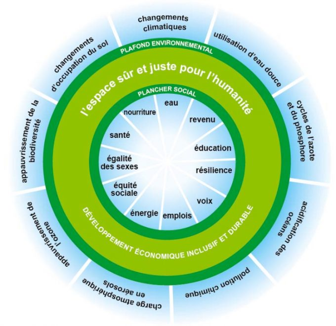
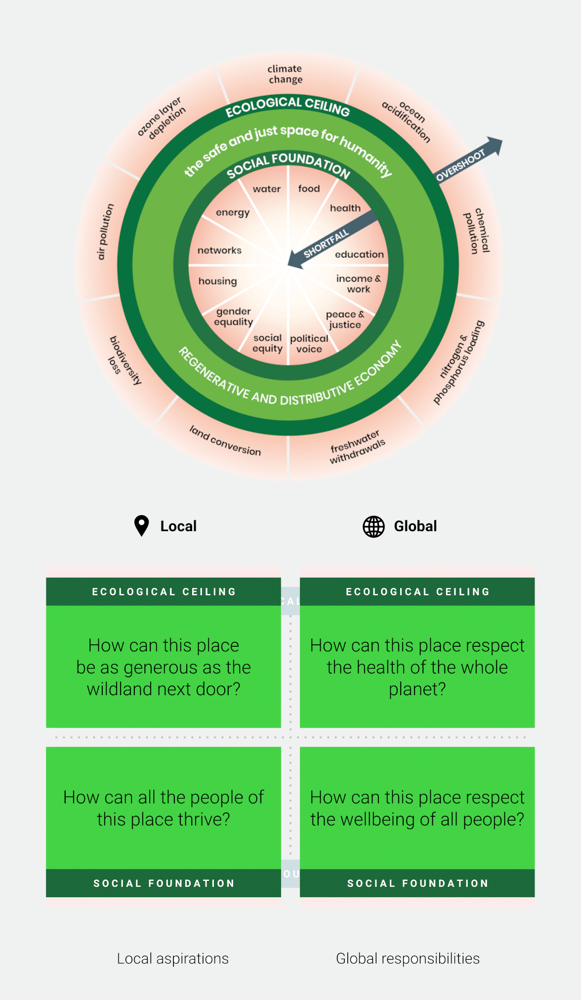
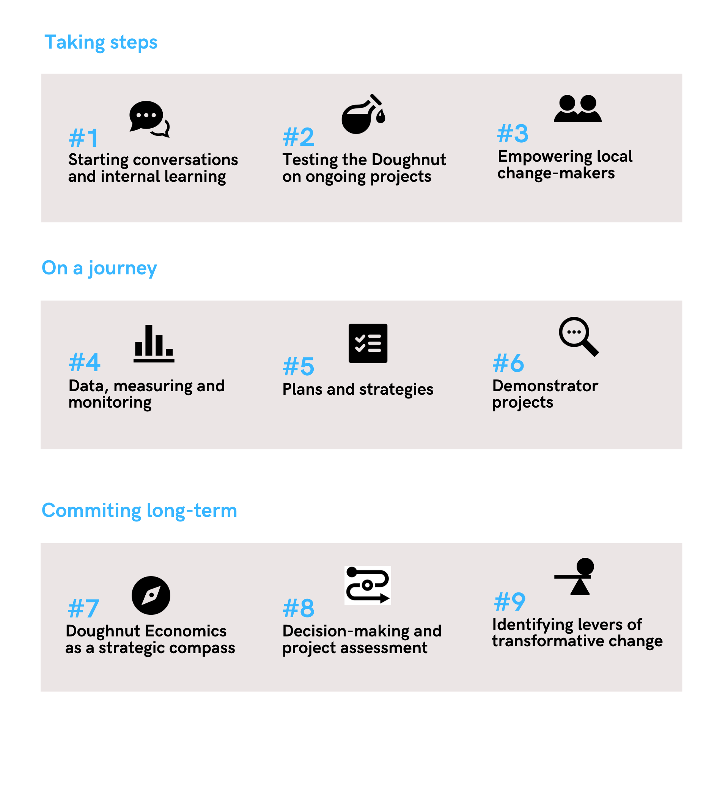

Cette étude de cas a pour but de comprendre comment traduire un concept abstrait et complexe en une stratégie concrète et pratique pour une ville ou une entreprise. 

Concrètement, il s'agira de : 
1. Décrypter les approches et méthodes présentées dans les ressources du ["Doughnut Economics Action Lab", ou DEAL](https://doughnuteconomics.org/) ;
2. Identifier les enjeux, difficultés et différences d'un point de vue organisationnel (public VS privé) ;
3. Questionner sur les éventuels besoins SI et d'outils digitaux pour simplifier l'appropriation du concept et/ou le suivi des indicateurs utiles dans les organisations dans le cadre de leurs stratégies RSE.

Il n'est pas nécessaire de connaître en profondeur le principe économique pour comprendre le MON, un rappel sera fait si besoin.
*ajouter le niveau, pré-requis et liens éventuels vers d'autres MON*

## Quelques éléments de contexte

La Théorie du Donut est une conception de l'économiste Kate Raworth qui invite à repenser l'économie actuelle pour l'inscrire dans un cadre nouveau prenant en compte les limites planétaires et les "besoins" minimums sociaux à satisfaire pour une économie plus durable.

Ce concept, bien que très intéressant pour comprendre les enjeux RSE/ESG, semble complexe à utiliser et reste encore marginal pour penser des stratégies ESG d'entreprises à cause du manque d'outils à disposition. Quelques villes, comme Amsterdam ou Bruxelles, se sont déjà lancés dans l'aventure... mais il n'y a pas encore de réel outil ou référentiel basé sur le Donut pour le traduire en une stratégie ESG concrète dans les entreprises. 

Comment expliquer cette différence entre la mise à l'échelle d'une ville et la mise à l'échelle dans une  entreprise ?

De plus, comment ont été implémentés ces projets à l'échelle d'une ville et quels sont les enjeux sous-jacents en terme de change management ?

Est-ce qu'un outil digital et/ou un système d'informations plus adapté pourraient permettre de démocratiser ce concept, le rendre plus pratique et en simplifier l'accès ?

## Contenu

### Qu’est-ce que la théorie du donut ?

Comme expliqué plus haut, le concept se base sur les limites planétaires ainsi que les objectifs du développement durable de l'ONU pour définir les éléments du plancher social. Ainsi, au-delà de l'abstrait de la théorie économique, le concept du donut propose de réinscrire l'économie dans un cadre concret et de prendre en compte les indicateurs suivants (et étudiés sur une base scientifique pour les limites planétaires).

#### Les indicateurs

D'un point de vue environnemental, le plafond écologique et les indicateurs de dépassement (au-delà desquelles la préservation des conditions de vie actuelles n'est pas garantie) :
  * Le **changement climatique**, via la mesure la concentration en CO2 dans l'atmosphère ;
  * L'**acidification des océans**, via la mesure de la saturation des océans ;
  * La **pollution chimique** (indicateurs non définis) ;
  * La **charge d'azote et de phosphore**, via la mesure des quantités appliquées à la terre (ex. enengrais) ;
  * Les **retraits d'eau douce**, via la mesure de consommation d'eau bleue;
  * La **conversion des terres**, en comparant la surface boisée à la surface des forêts avant l'intervention humaine;
  * La **perte de biodiversité**, via la mesure du taux d'extincition d'espèces par an ;
  * La **pollution de l'air** (indicateurs non définis) ;
  * L'**épuisement de la couche d'ozone**, via la concentration d'ozone dans la stratosphère.

D'un point de vue social, sur la base des objectifs du développement durable (ODD) de l'ONU qui constitue le plancher social:
  * Accès à la **nourriture** (part de la population sous-nourrie);
  * Accès à la **santé** (taux de mortalité, espérance de vie);
  * Accès à l'**éducation** (population adulte illettrée, enfants non scolarisés);
  * **Revenu et travail** (seuil de pauvreté, taux de chômage);
  * **Eau et assainissement** (part de la population sans accès à l'eau potable, sans accès à un assainissement amélioré);
  * Accès à l'**énergie** (accès non suffisant à l'électricité, à des installations de cuisine propre);
  * **Réseaux** (aide sociale, accès à Internet);
  * **Logement** (part de la population vivant dan un bidonville dans un pays);
  * **Égalité des sexes** (écart de représentation au Parlement, écart salarial);
  * **Représentation politique** (via l'indicateur "Voix et Responsabilité");
  * **Garantie de la paix et de la justice** (indicateur de la corruption, taux d'homicide).

#### Les 7 principes de la théorie du donut :
Kate Raworth développe dans son livre "L'économie du Donut : l'économie de demain en 7 principes". Si je vous invite à lire le livre pour mieux comprendre les concepts, le travail de l'économiste se résume en 7 propositions :

1. Changer le but/le cap de l'économie (de l'obsession du PIB à la poursuite du Donut) ;
2. Voir l'ensemble du tableau, en déconstruisant l'image d'un marché autonome (comme un circuit fermé entre ménages et entreprises) vers une économie intégrée (prenant en compte l'état, les "communs" en plus du marché et des ménages);
3. Cultiver la culture humaine (d'un homme économique rationnel vers des humains sociaux et adaptables);
4. Mieux connaître les systèmes, en revisitant le schéma de l'équilibre offre/demande - prix/quantité vers des mécanismes prenant davantage en compte la complexité des échanges économiques ;
5. Redessiner pour redistribuer, en remettant en cause le mythe de la croissance qui à terme réduira les inégalités et proposer des mécanismes redistributifs des revenus ;
6. Créer dans le cadre de l'économie régénérative, en remettant en cause le mythe de la croissance économique qui permettra de réduire la pollution avec le revenu par tête, vers des organisations qui prennent en compte le vivant et diriger par une mission ou raison d'être ;
7. Être agnostique en matière de croissance, pour questionner la faisabilité d'une course à la croissance exponentionnelle du PIB, sans limites ou asymptotes.

## Acteurs publics et théorie du donut

*Comment les acteurs publiques définissent leur stratégie en se basant sur cette théorie ?*

### Les bases pour commencer

Pendant le Covid en 2020, la ville d'Amsterdam s'est engagé dans le cadre de la théorie du donut pour répondre au mieux aux enjeux sociaux et environnementaux suite à la crise.

Mais concrètement, comment un gros livre d'économie peut être traduit en politique publique ?

Le DEAL (Donut Economics Action Lab) propose des outils gratuits pour accompagner les acteurs dans leurs démarches. Les acteurs doivent s'engager à respecter le coeur de la théorie : avoir une vision hollistique et donc prendre en compte des enjeux/impacts sociaux et environnementaux, à l'échelle locale (de la ville, région) et à l'échelle globale/mondiale. Tout en faisant un état des lieux de leurs impacts, les politiques brainstorment avec un maximum de parties prenantes (citoyens, entreprises, associations, écoles...) sur les politiques et actions prioritaires à mener pour atteindre l'espace sûr pour l'humanité prévu par le donut.

Si on on observe rarement des donuts calculés à l'échelle d'une ville, l'échelle étant trop petite pour avoir tous les indicateurs, il est possible de réaliser un donut par pays et ainsi comprendre les enjeux d'un pays (par exemple en France, nous devons faire attention aux dimensions écologiques et certains indicateurs sociaux relatifs au chômage, à l'éducation et parfois les enjeux de représentants politiques). L'Université de Leeds propose un [comparateur entre pays et de nombreuses analyses sur son site](https://goodlife.leeds.ac.uk/national-snapshots/countries/).

### La démarche

Après avoir testé sur quelques projets l'esprit du donut, les villes font un état des lieux en étudiant les impacts au local et ceux à l’échelle globale, en s’appuyant sur des données collectées (soit dans des bases pour les impacts mondiaux, soit celles locales). Un guide pour dresser le [“Portrait analytique d’un endroit”](https://doughnuteconomics.org/tools/doughnut-unrolled-data-portrait-of-place) (ou Data Portrait of Place) est généralement utilisé à cette étape (avec un template excel de la ville d'Amsterdam). La récupération des données et indicateurs (nombreux) peut être pénibles, des informations peuvent manquer.

C’est à cette étape généralement où sont définis les indicateurs cibles pour chaque des 4 cibles (plafond environnement local/global et plancher social local/global). Le Data Portrait est ensuite proposé comme outil de référence pour le suivi et le reporting pour mesurer l’état et le progrès des différents indicateurs et objectifs. Ces indicateurs sont issus de (plus ou moins) nombreux ateliers avec les parties prenantes, qui se proposent aussi de prioriser 5 actions/indicateurs par thématique.

Une des limites principales de l'outil à mes yeux est sur la troisième grande étape : le passage à l'action et la prise de décision. Il est proposé que le donut soit un compas pour diriger les décisions, mais si les analyses et les résultats issus du portrait semblent trop complexes (dans des excels avec des chiffres, peu de vision stratégique et quantifiées des actions proposées). Il serait ici pertinent d'inclure des outils "standardisés" de Data Visualisation (et de tableau de bord) ou alors de simplifier les données en infographies (comme a pu le faire le groupe du Brussels Donut).

[Retrouvez le détail de la démarche à ce lien.](https://doughnuteconomics.org/tools/cities-regions-let-s-get-started)

### L'exemple du Brussels Donut

Bien qu'Amsterdam soit l'exemple le plus connu, la lecture de leurs rapports et outils méthodogiques / stratégie data me semblait encore peu aboutis et trop abstrait. D'après le retour d'une personne experte ayant pu participer à une présentation du projet, il semble en effet manquer quelque chose pour rendre le projet plus concret (et moins "bullshit").

L'exemple de la région de Brussels me semble plus prometteur avec un prisme d'ingénieur et stratégique. La démarche semble plus rigoureuse et ambitieuse en terme de suivi des indicateurs/KPIs, et plus pragmatique face aux limites actuelles qui se présentent à eux.

L’équipe a rendu publique son Data Portrait sous un format visuel de slides interactifs pour consulter les indicateurs via des infographies (cf [le site](https://prezi.com/view/dl7c8rEg0RqqiP4sIB4e/)). Ils souhaitent aussi mettre en récit l’ensemble des indicateurs retenus (et identifiés comme les plus pertinents).

**Les résultats :** [analyse des résultats](https://donut.brussels/wp-content/uploads/2021/05/Cahier1_FR.pdf) ; [les leçons](https://donut.brussels/wp-content/uploads/2021/05/Cahier2_FR.pdf) ; [les outils méthodologiques](https://donut.brussels/wp-content/uploads/2021/05/Cahier3_FR.pdf) ;[le Data Portrait of Place](https://donut.brussels/wp-content/uploads/2024/06/Rapport-BrusselsDonut-II_FR.pdf)

**Méthodes suivies :** [le résumé](https://donut.brussels/wp-content/uploads/2024/04/Resume-executif-FR.pdf), ou le [rapport complet](https://donut.brussels/wp-content/uploads/2024/06/Rapport-BrusselsDonut-II_FR.pdf) avec un très beau [excel final](https://onedrive.live.com/edit?id=7E4A7DB512DA5157!4278&resid=7E4A7DB512DA5157!4278&ithint=file%2Cxlsx&redeem=aHR0cHM6Ly8xZHJ2Lm1zL3gvcyFBbGRSMmhLMWZVcC1vVGJSUnlzNGlHVG5wSmpnP2U9eWhnVDBL&migratedtospo=true&wdo=2&cid=7e4a7db512da5157) [(+ un tuto)](https://donut.brussels/wp-content/uploads/2024/04/Mode-demploi_Excel_Portrait-simplifie.pdf)

**Les limites identifiées :**
* Il manque d’indicateurs solides pour évaluer l’impact global-social, et il est tributaire de données insuffisantes pour certaines dimensions.
* Les résultats sont également sensibles aux choix méthodologiques et la représentation du portrait ne prend pas en compte les besoins spécifiques des sous-populations vulnérables.
* De plus, les projections futures reposent sur des extrapolations et ne tiennent pas compte des évolutions politiques. Pour surmonter ces lacunes, un engagement institutionnel solide et des recherches complémentaires sont nécessaires

**Le + :

À partir de cette matière première, il faut à la fois sélectionner les indicateurs lesplus pertinents et les plus parlants pour chaque dimension et pour le territoire considéré, et . Cf page 11 du cahier 3 sur la participation et les indicateurs

### Quels besoins et enjeux en système d’informations ?

#### Un enjeu Data

L’exemple de Yerevan ([source](https://doughnuteconomics.org/stories/yerevan-embraces-doughnut-mindset)) :

> During the process data challenges were faced both for designing local lenses and global ones. In case of local lenses there was available data at either country or city level but the challenges were mainly related to the quality of data (problems with timeliness, consistency, continuity, validity); in case of global lenses, lots of data is not available for Armenia on planetary boundaries, especially for forming global-ecological lense. So, Yerevan City Portrait has some missing or incomparable data on all of its lenses.
> 
> 
> Nevertheless, these data challenges are not viewed as something negative and unsolvable but rather something to give a thought to, an adversity to be turned into opportunity; to move on with identification of further data challenges and *providing innovative solutions in achieving data-driven city development.*
> 

**Base de données:**

Des objectifs et des indicateurs sociaux pertinents au niveau local sont souvent disponibles sur les sites internet des autorités municipales et des services statistiques nationaux et internationaux, d’autres données (notamment sur le gloabl social et écologique) sont déjà collectées par certains organismes. 

Il y a donc un enjeu derrière de qualité des données et de centralisation d’un large set de données de différents ministères ou acteurs sur les aspects sociaux (l’égalité des genres, sur le travail, la santé, l’éducation, la justice…) mais aussi sur les aspects environnementaux (biodiversité, émissions de GES, océan, qualité de l’air, qualité des sols…) ainsi que ceux impactant les deux aspects (nourriture, énergie, eau…).

Ainsi que des enjeux de **open data** et de **bases communes** pour avoir plus facilement. De même, les tableaux collectées et résultats doivent être pouvoir être facilement consultés par les résidents et les autres politques (comme Brussels).

Comme énoncé précédemment, c'est il y enjeu de **data viz** et de consolidation des données (elles sont collectées via des excels basiques généralement). Il manque actuellement d’un outil qui permette de suivre ses indicateurs et de créer sa matrice du donut. Parmi les outils que j’ai pu trouvé, il y a une [calculatrice graphique open source](https://www.desmos.com/calculator/qpldeoh5n7?lang=fr) pour générer un Donut Interactif ainsi qu’un [outil en ligne allemand](https://donut.nexteconomylab.de/donut/) du Next Economy Lab mais cela n’est pas comparable aux autres outils RSE (pour le calcul Carbone, l’ACV ou la création de matrice de matérialité simple ou double comme le permettent les outils sur le marché).

**Vision stratégique et enjeux financiers**

Malgré une dimension économique, il n’y a peu d’indicateurs et d’outils qui permettent de faire des estimations financières.

En 2020, Chelsea Lawson propose un calculateur d’impact social propose d’estimer les différents retours sur investissement des actions publiques engagées, afin d’avoir une approche visuelle et holistique des coûts et bénéfiques des politiques sociales menées : [l’outil est disponible à ce lien](https://doughnuteconomics.org/tools/social-impact-calculator). Cet outil est donc utile autant aux acteurs publiques (contraints par des budgets serrés) et les entreprises (ayant un enjeu de rentabilité).

Pourtant, ce concept de retours sur investissement (ou ROI) dans les projets environnementaux et sociaux est d’autant plus pertinent si on considère que ces coûts paraissent souvent importants aujourd’hui pour anticiper et préparer nos territoires au changement climatique (voir aussi l’idée d’adaptation au changement climatique), mais sont bien moindres que les coûts qui se présenteront aux acteurs qui n’auront pas anticipé ces changements et devront alors réparer les conséquences et dégâts engendrés. A ce sujet, lire l’étude “**Road to Net Zero**” de l’Institut Rousseau.

⇒ **Il pourrait être intéressant de mettre en face de chaque item de la théorie du donut et chaque objectif des KPIs financiers (notamment le ROI).**

**Absence d’un outil tout en un, qui permettent notamment de solliciter les parties prenantes**

À l’instar d’autres outils qui permettent d’établir des stratégies ESG et/ou une analyse de matérialité, il est souvent intégré un outil pour créer des sondages aux collaborateurs, les envoyer et les relancer si besoin. Ils permettent ensuite de traiter les résultats directement sur la plateforme.

Ces outils proposent aussi de créer ou exporter un rapport quasi automatiquement. Cela permet aussi un gain de temps et éviter de réaliser des présentations Power Point superflus.

D'autres sujets SI peuvent être soulevés (outils de consultation des citoyens notamment) mais ne seront pas détaillés ici.

#### Outils pour la gestion de projet pour appliquer le Donut

- [**Doughnut impact assessment for development project**](https://doughnuteconomics.org/tools/doughnut-impact-assessment-for-development-project)

    - **Que retenir ?** Les deux questions sur les impacts sociaux et les impacts environnementaux. + Canvas pour le projet (ici public, mais peut être exporter pour tout type de projet avec une adaptation
- L’atelier [Powers to Act](https://doughnuteconomics.org/tools/powers-to-act-deep-design-of-cities-and-places), créé par la team DEAL

## Entreprises et théorie du donut

*Pourquoi les acteurs privés n’utilisent pas la théorie pour élaborer leur stratégie RSE et quelles solutions imaginer ?*

Un outil est proposé par le DEAL pour les entreprises, tout en encadrant les conditions d'appropriation du concept du donut pour des enjeux business.

Il comprend également des considérations clés pour certains types de participants : [start-ups](https://docs.google.com/presentation/d/1JD1GsVs8Iih16Wcx_rLWLfdAbQaUUDqDLXl-xMNXzOw/edit#slide=id.p84), [grandes entreprises](https://docs.google.com/presentation/d/1JD1GsVs8Iih16Wcx_rLWLfdAbQaUUDqDLXl-xMNXzOw/edit#slide=id.p85), [entreprises familiales](https://docs.google.com/presentation/d/1JD1GsVs8Iih16Wcx_rLWLfdAbQaUUDqDLXl-xMNXzOw/edit#slide=id.p86) et [entreprises éthiques](https://docs.google.com/presentation/d/1JD1GsVs8Iih16Wcx_rLWLfdAbQaUUDqDLXl-xMNXzOw/edit#slide=id.p87). 

### La méthode :

1. On étudie le Donut, les impacts positifs ou négatifs que l’on a sur les items + ceux qui menaçent notre activité d’entreprise
2. Identifier des idées ambitieuses pour l’entreprise et les relier aux enjeux concernés.
3. Identifier la configuration actuelle de l’entreprise par rapport aux 5 enjeux. ⭐
4. Challenger son entreprise actuelle (avec les idées de transformations, les “enablers” et les “blockers”) ⭐

### Analyse

Pour les entreprises, ils semblent d’abord important que la ville se soit déjà engagée ou d’avoir une coalition entre acteurs publics et privés pour lancer une dynamique. En effet, l’estimation des enjeux locaux et globaux peut sembler redondante et il serait pertinent d’avoir une base qui permettent déjà de repérer les enjeux principaux selon le secteur de l’entreprise et sa localité.

Le principal défaut des outils disponibles pour les entreprises est qu'il manque d'une traduction des indicateurs adaptés à l'échelle d'une entreprise ou d'une organisaton. A cela s'ajoute les mêmes limites que celles identifiées pour les acteurs publics.

Des questions différentes se posent dans le cadre d'une entreprise ayant plusieurs sites (voire plusieurs pays), les échelles d’étude sont largement différentes de celle d’une municipalité.

Aussi, on observe des redits avec d’autres concepts de la RSE, comme la raison d’être (ce n'est pas une mauvaise chose, c'est aussi le cas avec la démarche proposée par la régulation de reporting extra-financier). Il serait intéressant de croiser les indicateurs de la théorie du donut avec les autres indicateurs déjà collectés par les entreprises.

De plus, le lien avec les autres sujets ESG pertinent en entreprise n'est pas explicite (économie circulaire, Business Models à impact, économie de la fonctionnalité)... La considération des enjeux financiers pour les entreprises semble complètement effacé.

Néanmoins, la théorie du donut peut rester un outil intéressant d’aide à la décision, il reste tout à fait possible d'analyser et challenger les projets selon les 4 focus à avoir (environnement et social locaux, environnement et social globaux).

Pour le monde professionnel, l'outil semble pourtant pertinent pour sensibiliser le personnel sur la question de la transition durable. Hors les principes de fonctionnement de la théorie du donut invite à une gouvernance et à un management plus participatif, pour faire preuve d'intelligence collective.

Un dernier frein non négligeable à l'utilisation de la théorie du donut : la résistance au changement, notamment sur les enjeux socio-environnementaux.

**Mais, comment faire travailler les entreprises et acteurs publiques en coalition ?** 
Voici quelques pistes :
- Des programmes d’open innovation, 
- Des programmes de co-design de filières, 
- L’auto-évaluation ESG obligatoire pour demander des subventions aux acteurs publiques (ex. Métropole de Lyon). 

D’autres types d’acteurs comme des syndicats peuvent faire le lien entre les entreprises et les acteurs publiques locaux (ex. Bretagne et compétences RH). 

De plus, les entreprises et les acteurs locaux ont des intérêts communs à discuter (formation et emplois, compétences nécessaires au local…)

Voir aussi : [article de Le Monde - 02/10/2024](https://www.lemonde.fr/emploi/article/2024/10/02/les-lecons-de-management-du-secteur-public-au-prive-et-inversement_6341197_1698637.html)

### Le mot de la fin

Pour faire face aux enjeux socio-environnementaux de demain, la théorie du donut est un outil intéressant qui permet de questionner de nombreux enjeux en terme de management, gestion de projet et systèmes d'informations. 

Certaines organisations s'en s'ont emparés pour créer les stratégies à l'échelle d'un territoire (d'une ville). Ils utilisent notamment des méthodes d'idéation proche de l'intelligence collective et proposent de mettre en relation toutes les parties prenantes (ce qui d'après moi, est une approche à la bonne échelle pour répondre aux enjeux de demain).

Néanmoins, après analyse, il manque d'après moi encore aujourd'hui une plateforme (idéalement open source) qui permette réellement d'avoir un suivi des indicateurs (avec Data Viz VS les excels actuels) et permettant d'élaborer puis mesurer la portée du plan d'actions (ou de la stratégie RSE, comme d'autres entreprises le propose déjà comme Good Steps).

De plus, les outils du DEAL gagnerait à être croisés et réadaptés avec d'autres référentiels ayant déjà investis les entreprises comme le référentiel européen des indicateurs de durabilité, les ESRS, qui est déjà pris en main par les entreprises dans le cadre de la CSRD, la régulation européenne de reporting extra-financier.

>“We cannot solve our problems with the same thinking we used when we created them.”
>
>– Albert Einstein

## Bibliographie

[Ailleurs dans le Monde - Donut Brussels](https://donut.brussels/ailleurs/)

[Yerevan embraces “Doughnut mindset” - DEAL](https://doughnuteconomics.org/stories/yerevan-embraces-doughnut-mindset)

[Donut factsheets on tackling municipal challenges - DEAL (exemple sur l'agriculture et le monde de la construction)](https://doughnuteconomics.org/tools/donut-factsheets-on-tackling-municipal-challenges)

[Road to Net Zero - Institut Rousseau](https://institut-rousseau.fr/road-2-net-zero/)

[Social Impact Calculator, Chelsea Lawson - Deal](https://doughnuteconomics.org/tools/social-impact-calculator)

[Public policies to foster regenerative businesses](https://doughnuteconomics.org/tools/public-policies-to-foster-regenerative-businesses)