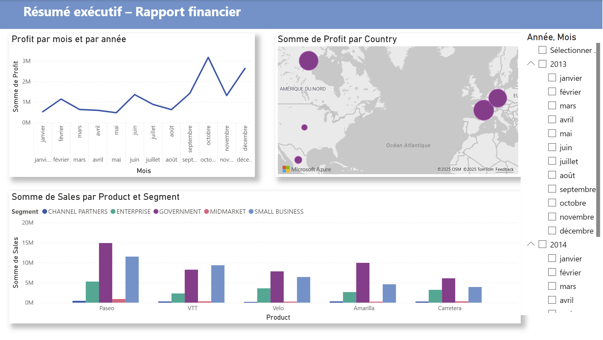
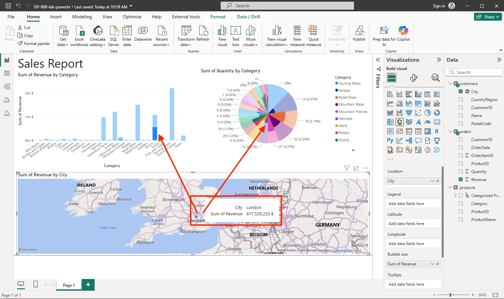

Tiraillée dans mon choix de filière métier, je souhaitais consacrer un MON sur ce qui peut être vu en ADAD : à partir des bases de données consituées lors de mon POK3, j'aimerais apprendre à utiliser quelques outils de data visualisation (type PowerBI).

L'objectif est de comprendre quel outil utilisé selon le besoin du projet. Ayant fait un stage chez Oresys en 2A, j'ai conscience que ce type d'outils est largement répandu en entreprises, avec des besoins en tableau de bord qui peuvent se révéler utile dans le suivi et la gestion de projet, notamment dans les processus d'aide à la décision.

## Contenu

### Lecture des POK&MON en lien
J'ai commencé par lire les différents POK & MON en lien : mon objectif est de pouvoir tester quelques outils différents.
- J'ai apprécié la comparaison claire proposée par Clarisse, entre Looker Studio et PowerBI;
- Les rappels en bonnes pratiques d'Isée étaient les bienvenus ;
- Le MON de Mathis Schultz sur la Business Intelligence permet de se faire une bonne idée de l'intérêt des tableaux de bord et des enjeux d'une représentation graphique "honnête", de respect du RGPD et cybersécurité, tout en permettant de voir des fonctionnalités de Power BI ;
- Celui de Lola Bourdon permet de bien comprendre que derrière l'outil Power BI, il existe différentes étapes primordiales avant la data visualisation (pour mettre en cohérence les données et les rendre exploitable) ;
- Le MON de Lola Perdrix souligne l'importance de combiner data et émotions pour avoir un storytelling puissant et être percutant.

### Power BI

J'ai suivi le cours de la plateforme [Learn](https://learn.microsoft.com/fr-fr/training/modules/get-started-with-power-bi/?WT.mc_id=powerbi_home_inproduct_introcard) de Microsoft, celle proposée lorsqu'on ouvre Power BI Desktop pour la première fois.

Les différentes étapes :
1. **Rôle de Power Query :** collecter et nettoyer les données.
2. **Applications :** Il est possible de créer une application qu'on met à disposition dans son entreprise pour que les personnes puissent visualiser les données et notre tableau de bord.
3. **Expressions DAX** ou Data Analysis Expressions, ces expressions servent à transformer les données brutes en analyses dynamiques et pertinentes : elles permettent de créer des mesures personnalisées (totaux, moyennes, pourcentages, comparaisons…), de manipuler facilement le temps (cumul, variations entre périodes), d’adapter les résultats aux filtres et aux segments, et d’optimiser la modélisation sans alourdir les sources.

J'ai trouvé la structuration des ressources Microsoft assez peu intuitive. Certaines fonctionnalités ne me paraissent pas évidente (surprimer un filtre ou revenir en arrière) ou le paramétrage de l'ordre dans lequel les données s'affichent (Ex. pas le même résultat si on sélectionne dans un ordre différent les champs Sales, Produit, et Segment).

Cependant j'ai beaucoup apprécié les résultats dynamiques et les capacités de personnalisation.

Pour mon premier tableau, j'ai utilisé un[ exemple de Microsoft](https://learn.microsoft.com/fr-fr/power-bi/create-reports/desktop-excel-stunning-report) pour comprendre comment fonctionne l'application : je suis surprise néanmoins du temps nécessaire pour obtenir un résultat très minimaliste.

J'ai ensuite suivi un[ autre tuto de Microsoft](https://learn.microsoft.com/fr-fr/power-bi/create-reports/desktop-dimensional-model-report?source=recommendations) pas à pas.

#### Autres tutos et cours Microsoft pas à pas:

1. Écrire des formules DAX pour des modèles sémantiques : [lien](https://learn.microsoft.com/fr-fr/training/modules/dax-power-bi-write-formulas/). 

Même si cette partie reste assez abstraite, ce sont vraiment des formules utiles. La bibliothèque de fonctions comprend près de centaines de fonctions, chacune conçue pour atteindre un objectif spécifique. La majorité des fonctions sont en commun avec Excel, mais deux sont spécifiques aux fonctions DAX : DIVIDE et DISTINCTCOUNT (assez transparente sur leurs usages). Divide va notamment gérer la division par 0 et ne pas renvoyer une simple erreur.

Le module permet finalement de se rendre compte de l'intérêt d'utiliser ces expressions ; en commençant le module, je pensais qu'il serait inutile, mais cela permet de comprendre en profondeur le système de formules (conversion implicite, gestion des "BLANK"...).

2.  Exploration des notions de base de la visualisation des données : [lien](https://learn.microsoft.com/fr-fr/training/modules/explore-fundamentals-data-visualization/)

De même, au début, j'ai trouvé ce module répétitif. La fin est plus intéressante car elle permet d'avoir une vision d'ensemble des différents visuels disponibles et l'exemple est assez intéressant. On peut voir lors de l'import le nombre sidérant de connecteurs avec Power BI depuis lesquels on peut importer/exporter de la donnée pour nos tableaux (ici on devait se connecter des données depuis le web, pour récupérer trois jeux de données utiles à notre rapport). A la fin, nous pouvons obtenir ce rapport (le cycle représente les répartitions par ville).

J'ai ensuite parcouru ce [parcours](https://learn.microsoft.com/fr-fr/training/paths/prepare-visualize-data-power-bi/) plus complet sur Microsoft Learn. Il comporte les 7 modules suivants :

1. Prise en main de la création avec Power BI
2. Obtenir des données dans Power BI 
3. Nettoyer, transformer et charger des données dans Power BI
4. Configurer un modèle sémantique
5. Concevoir des états Power BI
6. Prise en main de Copilot dans Power BI
7. Présentation de l’analytique de bout en bout à l’aide de Microsoft Fabric

### Comparaison à Looker Studio

Au tout début du MON, je me suis d'abord perdue dans mes recherches : je souhaitais rentrer dans le vif du sujet sans suivre de tutos pas à pas, avec mes propres données. J'avais téléchargé des bases de données de films et séries de plateformes de streaming.

Je trouve, avec du recul, que Looker Studio a une interface plus simple mais moins user-friendly par rapport à Power BI : en effet, les ajouts sont plus basiques et les liens sont moins dynamiques.

Cependant, il reste à noter que le plus important reste qu'il faut partir à point et non en courant... pour réussir à y voir plus clair dans la data.

### Construction du Dashboard d'analyse de films

Sur le temps qu'il me restait et comme je manquais d'inspirations sur ce que je souhaitais représenter, j'ai demandé de l'aide à ChatGPT. Voici les idées que j'ai retenu pour tenter de les implémenter dans mon tableau :

1. **Comparaison des notes (IMDB vs Sens Critique)**
   - Graphique en barres ou scatter plot : comparer Note_IMDB et Note_SC pour les films communs.
   - Indice de corrélation → montrer si les deux classements sont alignés ou divergents.

2. **Top & Classements**
   - Classement Top 10 par Note_IMDB 🏆
   - Classement Top 10 par Note_SC 🏆
   - Films présents uniquement dans un des deux classements (NYT exclusifs vs SC exclusifs).

3. **Analyse temporelle**
   - Histogramme par année ou décennie → nombre de films sélectionnés.
   - Évolution de la note moyenne par décennie.

4. **Réalisateurs:** Nombre de films par réalisateur 🎬.
5. **Durée des films:** Distribution de la durée (en minutes, il faudra convertir).

Une première étape préalable consiste à nettoyer la donnée pour permettre d'avoir une donnée exploitable.

## Conclusion

J'ai beaucoup apprécié découvrir les outils de DataViz dont notamment Power BI : je retiendrais notamment les efforts qu'ils ont fait pour rendre cet outil no/low-code aussi dynamique. Même si certaines fois cela m'a semblé contre intuitif dans ma prise en main, je n'ai aucun mal à imaginer qu'une fois qu'on a compris toutes les logiques de Power BI, l'outil révèle tout son potentiel et devient très satisfaisant (et prédictible). J'aimerais continuer à me perfectionner pour pourvoir l'utiliser aisément si j'en ai un jour besoin.

Car en effet, en dehors de certains besoins spécifiques pour le travail ou des missions stratégiques (avec d'importants jeux de données), je me vois finalement mal réutiliser de la dataviz régulièrement (la majorité de mes "indicateurs" sont simples à calculer en règle générale et des graphiques Excel font généralement l'affaire). 

De plus, je ne pense pas que cela ne peut se substituer à d'autres outils d'analyse plus fine de données, d'autant plus qu'il reste nécessaire de traiter les données en amont pour avoir un résultat exploitable et ne pas se prendre la tête pour rien dans Power BI.

Aussi, mes tests m'ont permis d'observer qu'il est important d'avoir une vision claire et précise de ce que l'on souhaite modéliser et des différents liens entre nos données : au début de mon idée sur les films, j'avais des idées pêle-mêles mais je ne savais pas comment les représenter concrètement (règles, filtres,...).

Finalement, ce que je retiendrais le plus au quotidien de ce MON, c'est ce que j'ai pu apprendre en lisant les différents POK&MON de mes camarades sur la sémantique et le Data Storytelling, comment on fait parler des graphiques pour les rendre plus clair (couleurs, labels,...) ou comment on les manipule pour défigurer un propos (cf MON de Mathis).