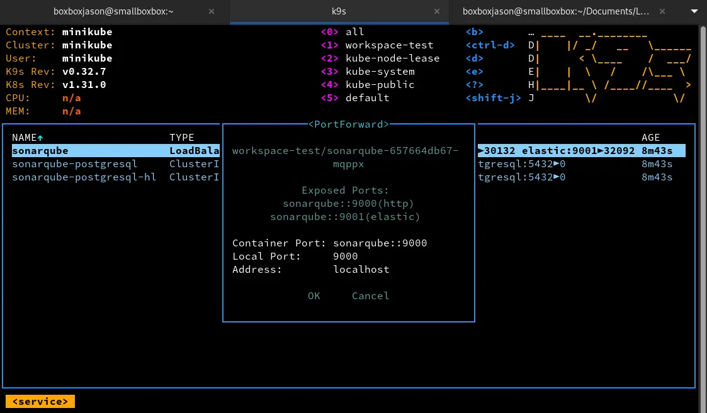

<head>
  <link rel="icon" href="https://github.com/BoxBoxJason/resume/blob/d07f37a66e2a583832533a10a9a4bf73b020be6f/src/assets/avatar.png?raw=true" type="image/x-icon">
</head>


- [Kubernetes](https://kubernetes.io/)
- [Helm](https://helm.sh/)



- [k9s](https://k9scli.io/)


## Introduction
Tout DevOps qui se respecte est amené à travailler avec un orchestrateur de conteneurs: **Kubernetes**. Il doit être capable de naviguer dans les ressources de son cluster afin de débugger, déployer, ou simplement observer ce qui s'y passe.
La CLI **kubectl** est très puissante, mais elle n'est pas forcément la plus ergonomique pour toutes les opérations du quotidien. On y passe beaucoup de temps dès qu'il faut faire quoi que ce soit. Afin de gagner en productivité, il existe un outil formidable d'interface graphique en CLi pour Kubernetes : **k9s**.

Dans ce MON, nous allons voir comment devenir un maître de **k9s**, afin de ne plus jamais perdre de temps pour nos opérations de tous les jours.


## Cas d'usage
Nous allons nous baser sur un exemple concret de déploiement de service (**SonarQube**) sur un cluster Kubernetes, en passant par une helm chart. L'idée est de suivre le workflow de déploiement complet afin de s'assurer que le déploiement fonctionne sans encombre. En cas de problème, nous devrons être capables de débugger rapidement et efficacement, uniquement avec **k9s**.

Nous allons supposer que <u>k9s est déjà installé</u> sur votre machine <u>sans plugins</u>. Si ce n'est pas le cas, vous pouvez suivre les instructions sur le [site officiel](https://k9scli.io/).\
De plus nous allons supposer que vous avez un <u>cluster Kubernetes fonctionnel</u>, et que vous avez les droits pour déployer des ressources dessus. (Si ce n'est pas le cas, vous pouvez suivre le [tutoriel d'installation de Kubernetes](https://kubernetes.io/docs/setup/))

<p style="background-color: #ffb1a8; border: 2px solid #ba1300; padding: 10px; border-radius: 10px">
Enfin, nous n'expliquerons ni le fonctionnement de kubernetes et de ses ressources, ni d'une helm chart, ni le flow de déploiement de SonarQube. Si vous avez des questions sur ces sujets, n'hésitez pas à vous renseigner sur internet ou à me contacter.
</p>

### Démarrage
Nous utiliserons la helm chart classique de bitnami pour déployer SonarQube, pour cela nous sommes obligés de passer par le terminal, k9s ne permettant pas l'intéraction avec la CLI helm. Nous déployons sur le namespace `workspace-test`

```bash
helm repo add bitnami https://charts.bitnami.com/bitnami
helm repo update
helm install sonarqube bitnami/sonarqube --namespace workspace-test
```

### Suivi du déploiement
A partir de maintenant, tout se passe sur k9s. Nous allons suivre le déploiement de SonarQube, et nous assurer que tout se passe bien. Pour cela, on doit globalement vérifier que la helm release arrive au statut `DEPLOYED`, que les pods sont en `Running`, et que les services sont bien vivants.\
Pour cela, on va suivre 3 ressources principales:
- Les **events** du namespace `workspace-test`
- Les **pods** du namespace `workspace-test`
- La **helm release** de SonarQube

`SHIFT + 1` pour filtrer sur le namespace `workspace-test`

#### Events au déploiement, tout va bien
`:events` pour afficher les évènements du namespace `workspace-test`


#### Pods en cours de démarrage
`:pods` pour afficher les pods du namespace `workspace-test`


On voit une première anomalie (classique), un des pods est prêt, l'autre est en `Pending`. Cela peut être normal dans le cas où le pod attend quelque chose pour démarrer. Cependant cela ne doit pas durer trop longtemps.

#### Malheureusement, un pod ne démarre pas
`ENTER` sur le pod en `Pending` pour voir les détails


Catastrophe, tous nos conteneurs du pod SonarQube sont en erreur ! Il va falloir débugger ça.

#### Logs du pod
`L` pour afficher les logs du pod


Oh misère de misère ! Les logs sont complètement vides ! Que faire capitaine ?

#### Events
`:events` pour afficher les évènements du namespace `workspace-test`


`ENTER` sur l'évènement pour voir les détails


Enfin une information ! Le pod n'arrive pas à démarrer car il n'a pas assez de mémoire sur aucune des nodes à sa disposition. Il va falloir trafiquer notre cluster pour lui donner plus de mémoire. Il s'agit d'un cluster construit rapidement pour le MON à l'aide de Minikube. Il est donc normal que les ressources par défaut soient faibles.

```bash
minikube stop
minikube delete
minikube config set memory 6000
minikube start --memory=6000 --cpus=4
```

#### Problème résolu
`:pods` pour afficher les pods du namespace `workspace-test`


Cette fois-ci, plus de problème, on peut voir que nos pods sont vivants et ont fini de démarrer

#### Accès au service
1. `:services` pour afficher les services du namespace `workspace-test`
2. `SHIFT + F` pour effectuer un port forward entre le service et votre machine (pour pouvoir y accéder sur navigateur)


`localhost:9000` sur un navigateur quelconque pour accéder à SonarQube


Et voilà, votre SonarQube est accessible sur `localhost:9000` !

#### Accès à la console
1. `:pods` pour afficher les pods du namespace `workspace-test`
2. `/sonarqube` pour filtrer sur les pods de SonarQube
3. `S` pour ouvrir un shell dans le pod


Au besoin, vous avez accès à la console du conteneur pour effectuer des opérations de maintenance (en tant qu'administrateur bien sûr)

## Conclusion
Vous avez réussi à déployer SonarQube sur votre cluster Kubernetes, et à le débugger en cas de problème. Vous avez pu voir l'efficacité de k9s pour naviguer dans les ressources de votre cluster, et pour débugger des problèmes en temps réel. Vous avez gagné un temps précieux en évitant de passer par la CLI kubectl pour chaque opération.

Comparez à votre ancien `kubectl get`, `kubectl describe`, `kubectl logs`... quand vous ne saviez pas où regarder. Vous avez facilement économisé 10 minutes de recherche et de commandes fastidieuses pour chaque problème rencontré.

## Antisèche Raccourcis clavier
k9s étant un outil développé pour favoriser la rapidité utilisateur, il est truffé de raccourcis clavier qui permettent de changer de vue, éditer les composants, filtrer l'affichage, afficher des logs, lister des ressources, etc. Voici une petite liste que j'ai pu composer avec les raccourcis qui me sont les plus utiles.

### Aide
- `?`(Help) : Affiche l'aide des raccourcis clavier pour la fenêtre actuelle
- `CTRL + A`(Aliases) : Affiche l'ensemble des alias de kubernetes / k9s

### Interaction avec les ressources
- `CTRL + D`(Delete) : Supprimer une ressource
- `D`(Describe) : Affiche les détails d'une ressource et ses évènements / logs liés
- `E`(Edit) : Editer le manifest YAML d'une ressource
- `Y`(YAML) : Affiche le manifest YAML d'une ressource
- `CTRL + S`(Save) : Sauvegarde la ressource (le format dépend de la ressource)

### Interaction avec les pods
- `F`(PortForward) : Forward un port d'un pod sur votre machine
- `S`(Shell) : Ouvre un shell dans un pod
- `CTRL + K`(Kill) : Tue un pod (le redémarre s'il est géré par un contrôleur)
- `T`(Transfer) : Transfère un fichier depuis ou vers un pod
- `L`(Logs) : Affiche les logs d'un pod
    - `W`(Wrap) : Wrap les logs (ils ne dépassent plus du cadre de k9s)
    - `F`(Fullscreen): Affiche les logs en plein écran (fait disparaître le cadre k9s, pratique pour copier/coller)
    - `S`(Autoscroll): Active/désactive l'autoscroll des logs
    - `T`(Timestamps): Active/désactive l'affichage des timestamps

### Gestion de l'affichage
- `CTRL + W`(Toggle Wide) : Active/désactive l'affichage large des colonnes
- `CTRL + E`(Toggle Header) : Active/désactive l'affichage de l'entête k9s (avec les versions, les raccourcis...)
- `:q`(Quit) : Quitte k9s

### Parcours et navigation
#### Accès
- `CTRL + ENTER`(View) : Affiche les détails d'une ressource OU rentre dans la ressource (si c'est un namespace par exemple)
- `ESC`(Back) : Retourne à la vue précédente (sort d'une ressource ou d'un namespace)
- `CTRL + R`(Refresh) : Rafraîchit la vue actuelle (utile pour voir les changements en temps réel, mais il y a un auto-refresh)

#### Tri
- `SHIFT + A`(Sort age) : Trie les ressources par âge
- `SHIFT + N`(Sort name) : Trie les ressources par nom
- `SHIFT + S`(Sort status) : Trie les ressources par status

#### Filtrage
- `SHIFT + <numéro namespace>`(Namespace) : Filtre les ressources par namespace (ex: `SHIFT + 1` pour n'afficher que les ressources du namespace `workspace-test`)
- `:<resource>`(Filter) : Filtre les ressources par type (ex: `:pods` pour n'afficher que les pods)
- `/<regex>`(Filter) : Filtre les ressources par un regex (ex: `/sonar` pour n'afficher que les ressources contenant "sonar")
- `ESC`(Clear) : Efface le filtre

#### Droite, gauche, haut, bas
- `SHIFT + G`(Goto bottom) : Place le curseur tout en bas de la liste
- `G`(Goto top) : Place le curseur tout en haut de la liste
- `CTRL + F`(Page down) : Place le curseur tout en bas de la partie VISIBLE de la page
- `CTRL + B`(Page up) : Place le curseur tout en haut de la partie VISIBLE de la page
- `K`(Up) : Monte le curseur d'une ligne
- `J`(Down) : Descend le curseur d'une ligne
- `H`(Left) : Déplace le curseur à gauche
- `L`(Right) : Déplace le curseur à droite
