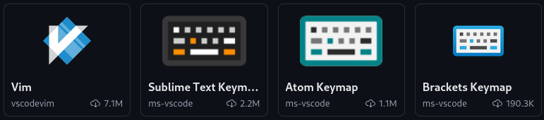


- [Visual Studio Code](https://code.visualstudio.com/)



- **Raccourcis clavier VSCode** [Windows](https://code.visualstudio.com/shortcuts/keyboard-shortcuts-windows.pdf) , [Mac](https://code.visualstudio.com/shortcuts/keyboard-shortcuts-macos.pdf) , [Linux](https://code.visualstudio.com/shortcuts/keyboard-shortcuts-linux.pdf)
- [Video Fireship Productivité VSCode](https://www.youtube.com/watch?v=ifTF3ags0XI)


## Introduction
Visual Studio Code est un éditeur de code open-source très populaire, développé par Microsoft. Il est utilisé par de nombreux développeurs pour sa légèreté, sa rapidité et ses nombreuses fonctionnalités. Cependant, il peut arriver que VSCode devienne lent et peu réactif, surtout lorsque l'on travaille sur de gros projets ou que l'on utilise de nombreuses extensions. Dans ce MON, nous allons voir comment optimiser les performances de VSCode pour gagner en réactivité et en productivité.

### Lancer VSCode rapidement
Pour lancer VSCode rapidement, vous pouvez simplement utiliser la commande `code [/chemin/vers/repertoire (OPTIONNEL)]` dans un terminal. Si vous êtes sur Windows, vous pouvez également créer un raccourci sur le bureau ou dans la barre des tâches pour lancer VSCode en un clic.\
Vous ouvrez alors directement VSCode dans le répertoire spécifié, ce qui peut être très pratique pour démarrer rapidement un projet.

## Raccourcis clavier

### Extensions de raccourcis
Si vous êtes déjà habitué à vos raccourcis d'autres éditeurs de texte (Vim, Sublime Text, Atom, Brackets,...), il existe des extensions VSCode qui réécrivent les configurations de raccourcis pour les rendre compatibles avec celles de ces éditeurs. Vous pouvez les trouver en cherchant "keymap" dans les extensions de VSCode.

## Palette de commandes
La palette de commandes est un outil très pratique de VSCode qui permet d'accéder rapidement à de nombreuses fonctionnalités de l'éditeur. Pour ouvrir la palette de commandes, il suffit d'appuyer sur `Ctrl+Shift+P` (ou `Cmd+Shift+P` sur Mac). Vous pouvez ensuite taper le nom de la commande que vous souhaitez exécuter et appuyer sur `Entrée` pour la sélectionner.

### Qu'est ce qu'une commande ?
Une commande est une fonction ou une action que vous pouvez exécuter dans VSCode. Par exemple, vous pouvez ouvrir un fichier, rechercher du texte, ouvrir un terminal, etc. Les commandes sont accessibles via la palette de commandes ou via des raccourcis clavier.

### Commandes utiles

#### Format Document
La première commande qu'il est important de connaître si l'on veut optimiser sa productivité est **Format Document**. Cette commande s'appuie sur le formatteur de code configuré dans VSCode pour formater le code du document actif. Cela permet de rendre le code plus lisible et de respecter les conventions de style définies dans le projet.

C'est extrêmement utile pour uniformiser le code, notamment au niveau de l'identation et le rendre plus lisible. Pour exécuter cette commande, il suffit d'ouvrir la palette de commandes et de taper "Format Document", puis d'appuyer sur `Entrée`.

## Paramètres de VSCode

## Extensions
