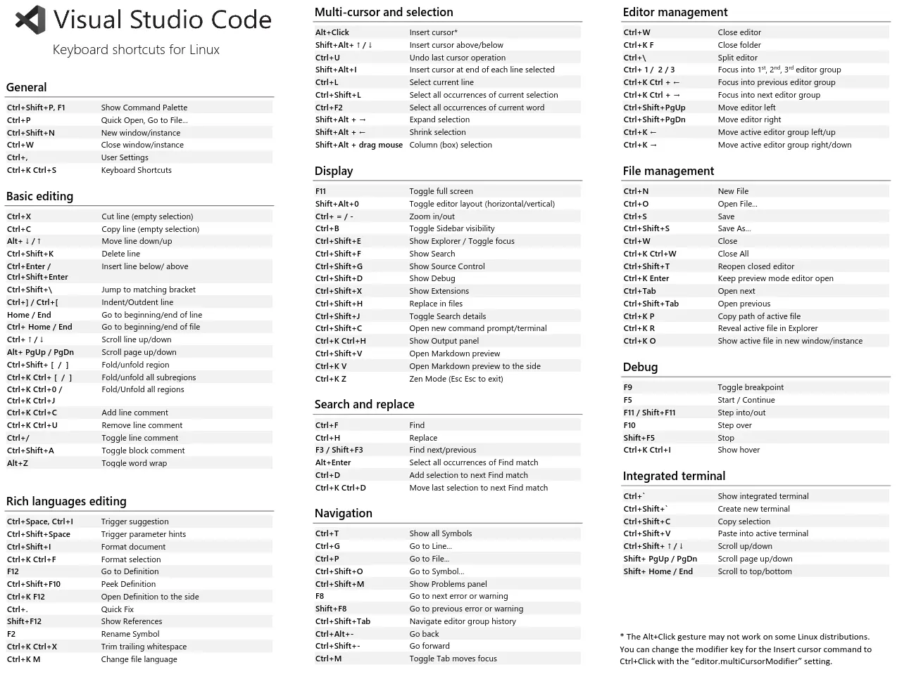
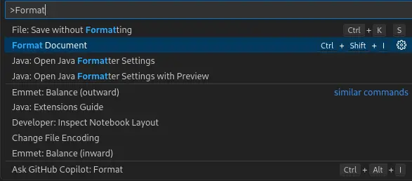
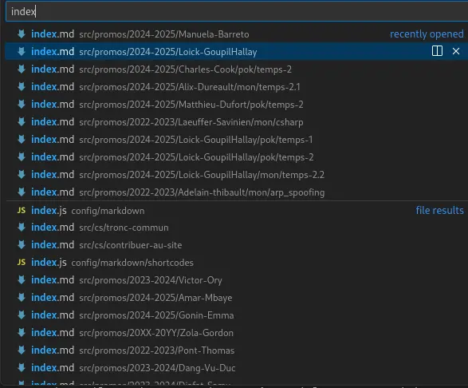
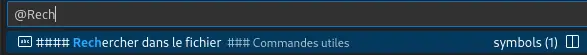
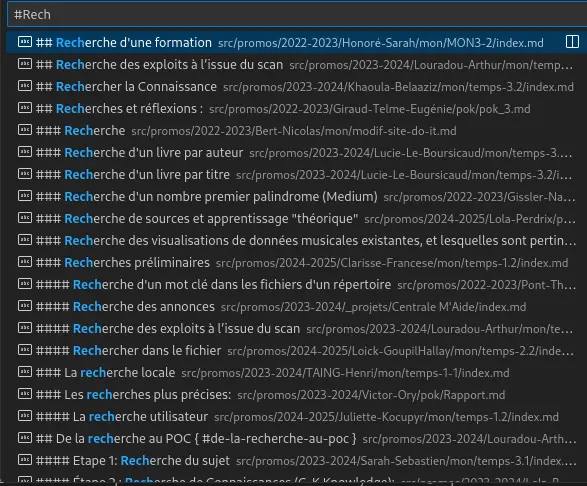
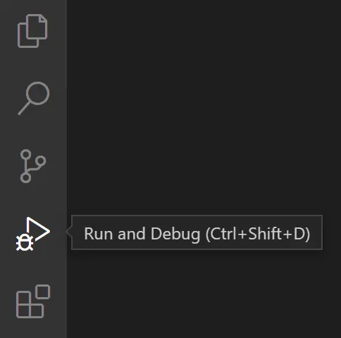
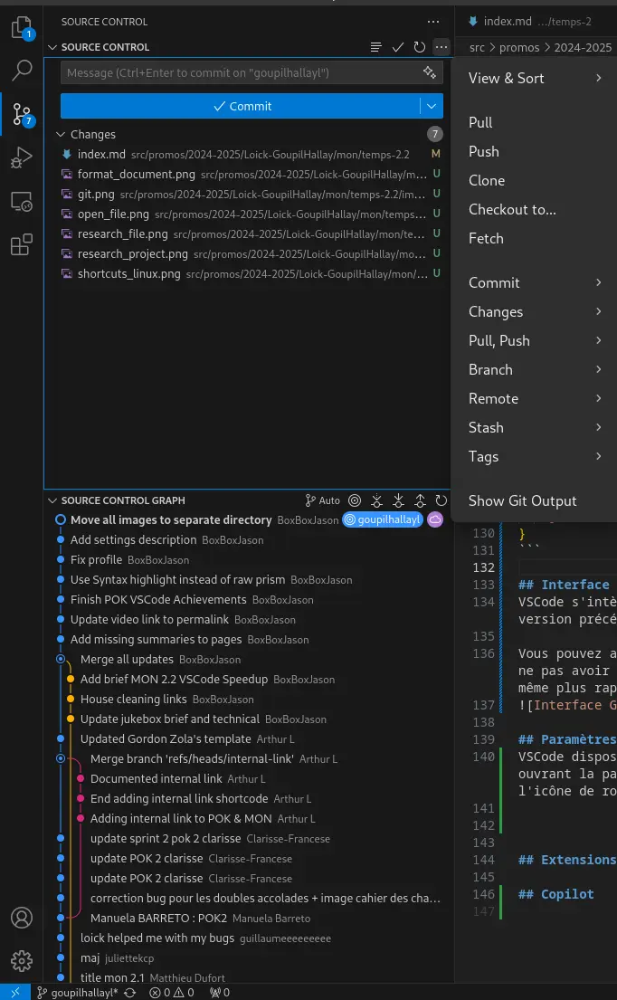
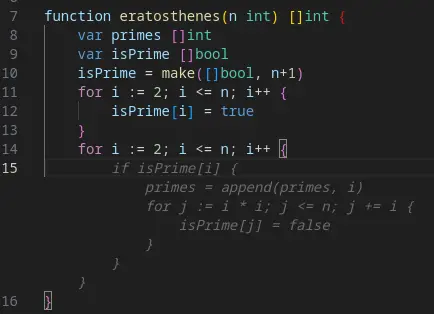


- [Visual Studio Code](https://code.visualstudio.com/)



- [Marketplace VSCode](https://marketplace.visualstudio.com/vscode)
- Raccourcis clavier VSCode [Windows](https://code.visualstudio.com/shortcuts/keyboard-shortcuts-windows.pdf) , [Mac](https://code.visualstudio.com/shortcuts/keyboard-shortcuts-macos.pdf) , [Linux](https://code.visualstudio.com/shortcuts/keyboard-shortcuts-linux.pdf)
- [Video Fireship Productivité VSCode](https://www.youtube.com/watch?v=ifTF3ags0XI)


## Introduction
Visual Studio Code est un éditeur de code open-source très populaire, développé par Microsoft. Il est utilisé par de nombreux développeurs pour sa légèreté, sa rapidité et ses nombreuses fonctionnalités. Malheureusement, *vous n'utilisez que 10% de votre VSCode*. Dans ce MON, nous allons voir comment **optimiser** son utilisation de VSCode pour **gagner** en **réactivité** et en **productivité**.

### Lancer VSCode rapidement
Pour lancer VSCode rapidement, vous pouvez simplement utiliser la commande `code [/chemin/vers/repertoire (OPTIONNEL)]` dans un terminal. Si vous êtes sur Windows, vous pouvez également créer un raccourci sur le bureau ou dans la barre des tâches pour lancer VSCode en un clic.\
Vous ouvrez alors directement VSCode dans le répertoire spécifié, ce qui peut être très pratique pour démarrer rapidement un projet.

## Raccourcis clavier



### Débuter
Je recommande de commencer par apprendre les raccourcis d'édition de texte de base de VSCode (ceux qui restent sur la même page et n'impliquent pas de déplacement dans l'interface):
- `Ctrl+Z` pour annuler (la dernière action)
- **Presse-Papier**
    - `Ctrl+C` pour copier (dans le presse-papier)
    - `Ctrl+X` pour couper (copier dans le presse-papier et supprimer son contenu)
    - `Ctrl+V` pour coller (le contenu du presse-papier)
- **Sélection**
    - `Ctrl+A` pour tout sélectionner
    - `Ctrl+L` pour sélectionner la ligne actuelle
    - `Shift+Flèche` pour étendre la sélection (dans la direction de la flèche)
    - `Alt+clic` pour définir plusieurs curseurs (permet d'éditer à plusieurs endroits en même temps)
- **Commentaires**
    - `Ctrl+/` pour commenter/décommenter la/les ligne(s) sélectionnée(s)
    - `Ctrl+K Ctrl+C` pour commenter la sélection (PAS LA/LES LIGNE(S) ENTIERE(S))
    - `Ctrl+K Ctrl+U` pour décommenter la sélection (PAS LA/LES LIGNE(S) ENTIERE(S))
- **Recherche**
    - `Ctrl+F` pour rechercher dans le fichier
    - `Ctrl+H` pour rechercher et remplacer dans le fichier
    - `Ctrl+Shift+F` pour rechercher dans tous les fichiers du projet
    - `Ctrl+D` pour sélectionner le mot suivant (ou la prochaine occurrence de la sélection actuelle)
- **Navigation**
    - `Ctrl+P` pour ouvrir la palette de commandes
    - `Ctrl+Tab` pour naviguer entre les onglets ouverts
    - `Ctrl+Flèche` pour se déplacer d'un mot à la fois
    - `Ctrl+G` pour se rendre à une ligne spécifique
- **Insertion**
    - `Ctrl+Enter` pour insérer une ligne en dessous
    - `Ctrl+Shift+Enter` pour insérer une ligne au-dessus
    - `Alt+Flèche` pour déplacer la ligne vers le haut ou le bas

### Extensions de raccourcis
Si vous êtes déjà habitué à vos raccourcis d'autres éditeurs de texte (Vim, Sublime Text, Atom, Brackets,...), il existe des extensions VSCode qui réécrivent les configurations de raccourcis pour les rendre compatibles avec celles de ces éditeurs. Vous pouvez les trouver en cherchant "keymap" dans les extensions de VSCode.


## Palette de commandes
La palette de commandes est un outil très pratique de VSCode qui permet d'accéder rapidement à de nombreuses fonctionnalités de l'éditeur. Pour ouvrir la palette de commandes, il suffit d'appuyer sur `Ctrl+Shift+P` (ou `Cmd+Shift+P` sur Mac). Vous pouvez ensuite taper le nom de la commande que vous souhaitez exécuter et appuyer sur `Entrée` pour la sélectionner.\
Il y a une subtile différence entre la palette de commandes (`Ctrl+Shift+P`) et la recherche (`Ctrl+P`), qui permet de rechercher un fichier dans le projet. Cette différence est le `>` pré-inscrit qui permet de filtrer les commandes dans la palette de commandes.

Une commande est une **fonction** ou une **action** que vous pouvez **exécuter dans VSCode**. Par exemple, vous pouvez ouvrir un fichier, rechercher du texte, ouvrir un terminal, etc. Les commandes sont accessibles via la palette de commandes ou via des raccourcis clavier.

### Commandes utiles

#### Format Document
La première commande qu'il est important de connaître si l'on veut optimiser sa productivité est **Format Document**. Cette commande s'appuie sur le formatteur de code configuré dans VSCode pour formater le code du document actif. Cela permet de rendre le code plus lisible et de respecter les conventions de style définies dans le projet.

C'est extrêmement utile pour uniformiser le code, notamment au niveau de l'identation et le rendre plus lisible. Pour exécuter cette commande, il suffit d'ouvrir la palette de commandes (`Ctrl+Shift+P`) et de taper ">Format Document", puis d'appuyer sur `Entrée`.


#### Ouvrir un fichier
Par défaut, la palette de commandes s'ouvre avec le focus sur la barre de recherche. Vous pouvez donc commencer à taper le nom du fichier que vous souhaitez ouvrir et la palette de commandes vous proposera des suggestions en temps réel. Cela permet d'ouvrir rapidement un fichier sans avoir à naviguer dans l'arborescence des fichiers.

Il suffit de taper `Ctrl+P` pour ouvrir la palette de commandes et commencer à taper le nom du fichier.


#### Rechercher dans le fichier
Vous pouvez utiliser la palette de commande avec le symbole `@` pour rechercher des symboles dans le fichier actif. Cela permet de naviguer rapidement dans le fichier en recherchant des fonctions, des classes, des variables, et autres éléments marquans du code.

De la même façon, vous pouvez utiliser le symbole `#` pour rechercher des symboles dans l'intégralité du projet (y compris les dépendances comme les node_modules).

Il suffit de taper `Ctrl+P` pour ouvrir la palette de commandes et commencer à taper `@` ou `#` suivi du nom du symbole que vous recherchez.



## Tâches
Les tâches sont des scripts qui peuvent être exécutés dans VSCode pour automatiser des actions récurrentes. Par exemple, vous pouvez créer une tâche pour lancer un serveur de développement, compiler un projet, ou exécuter des tests. Les tâches sont configurées dans un fichier `tasks.json` dans le répertoire `.vscode` de votre projet.

Une fois que la tâche est configurée, vous pouvez l'exécuter en ouvrant la palette de commandes (`Ctrl+Shift+P`) et en tapant ">Run Task". VSCode vous proposera alors une liste des tâches disponibles dans le fichier `tasks.json` et vous pourrez sélectionner celle que vous souhaitez exécuter.

Il est aussi possible d'utiliser la touche `F5` pour exécuter la dernière tâche exécutée. Cela peut être très pratique pour relancer rapidement une tâche que vous exécutez fréquemment.

```json
{
    "version": "2.0.0",
    "tasks": [
        {
            "label": "Build",
            "type": "shell",
            "command": "npm run build"
        },
        {
            "label": "Start Server",
            "type": "shell",
            "command": "npm start"
        },
        {
            "label": "Run Tests",
            "type": "shell",
            "command": "npm test"
        }
    ]
}
```

## Snippets
Les snippets sont des **bouts de code réutilisables** qui peuvent être insérés dans un fichier en tapant un raccourci clavier. VSCode propose de **nombreux snippets par défaut** pour les langages de programmation les plus courants, mais vous pouvez également **créer vos propres snippets** pour automatiser des tâches récurrentes. Les snippets sont configurés dans un fichier `snippets.json` dans le répertoire `.vscode` de votre projet.

Les snippets peuvent **utiliser des variables** pour remplacer des parties du code par des valeurs spécifiques. Par exemple, vous pouvez créer un snippet pour un entête qui prend en entrée la date et le nom de l'auteur et les insère dans le fichier.

Une fois que le snippet est configuré, vous pouvez l'**insérer dans un fichier** en tapant le préfixe du snippet suivi de la touche `Tab`. VSCode remplacera alors le préfixe par le contenu du snippet.

Cela sert énormément si vous utilisez par exemple un entête de fichier standard, des blocs de code récurrents, des fonctions ou des classes que vous utilisez souvent, ou des structures de code spécifiques à votre projet.

```json
{
    "Write Standard JS Header":  {
        "prefix": "header",
        "body": [
            "/**",
            " * @file $TM_FILENAME",
            " * @author $1",
            " * @date $CURRENT_YEAR-$CURRENT_MONTH-$CURRENT_DATE",
            " */",
            ""
        ],
        "description": "Write Standard JS Header"
    }
}
```

## Debugger
Le debugger de VSCode est un outil tout aussi puissant que craint pour les développeurs. Il permet de **debug** son code en exécutant son code **pas à pas**, avec des **points d'arrêt**. Il permet d'observer l'état et la valeur des variables PENDANT l'exécution du code. Cela permet de **comprendre** le comportement du code et surtout de voir où se trouvent les erreurs.


## Interface Git
VSCode s'intègre parfaitement avec Git et permet d'afficher de manière distincte les modifications apportées à un fichier par rapport à la version précédente. Cela permet de voir rapidement les changements effectués et de les valider ou de les annuler.

Vous pouvez aussi gérer vos branches, effectuer des commits, des pulls et des pushes directement depuis l'interface de VSCode. Cela permet de ne pas avoir à passer par un terminal pour effectuer ces opérations. Cette interface graphique est généralement plus intuitive, plus facile et même plus rapide que la ligne de commande.


## Extensions

### Remote Development
Microsoft a intégré un très grand nombre de fonctionnalités permettant le travail en équipe et la collaboration **à distance** dans VSCode.\
Cela permet de travailler dans des environnements distants tels que des *conteneurs*, des *machines virtuelles*, des *serveurs distants* (via SSH) ou des *environnements de développement en ligne* (comme GitHub Codespaces).\
Cela permet de développer sur des machines plus puissantes, d'**uniformiser** l'environnement de développement de l'équipe, de travailler sur des projets plus volumineux, de **tester** des configurations spécifiques. Cela peut simplement servir à travailler sur un projet depuis un autre ordinateur **sans avoir à tout installer**. Ou encore à **isoler son environnement** de développement pour éviter les conflits avec d'autres projets.

Il existe un ensemble d'extensions appelé **Remote Development** qui permettent de tirer parti de ces fonctionnalités. Vous pouvez les trouver en cherchant "Remote Development" dans les extensions de VSCode.

### Code Suggestions AI
Les études de productivité montrent qu'un développeur **gagne en moyenne 80% de productivité** en intégrant des **suggestions de code par IA** dans son éditeur de code.\
Il existe plusieurs extensions qui permettent d'*intégrer différents modèles de suggestions de code par IA dans VSCode*.

Le principe est toujours le même : l'extension envoie et cache (stocke) les modifications apportées au code au modèle, l'IA analyse le code que vous écrivez et vous **propose des suggestions de code en temps réel**.\
Cela permet de **gagner du temps** en évitant de taper des lignes de code répétitives ou en découvrant des fonctions ou des méthodes que vous ne connaissiez pas.

Les extensions les plus populaires sont :
- [GitHub Copilot](https://marketplace.visualstudio.com/items?itemName=GitHub.copilot) (payant)
- [Continue (CodeStral, Claude)](https://marketplace.visualstudio.com/items?itemName=Continue.continue) (gratuit selon le modèle)
- [Local AI Pilot (Ollama)](https://marketplace.visualstudio.com/items?itemName=nr-codetools.localaipilot) (gratuit, open-source)

Il suffit d'installer l'extension correspondant à votre modèle de suggestion de code par IA et de l'activer dans les paramètres de VSCode.


### Live Share
Live Share est une extension de VSCode qui permet de **collaborer en temps réel** avec d'autres développeurs.\
Cela permet de **partager** son éditeur de code, son terminal, son serveur de développement, et même son debugger avec d'autres personnes.\
Cela permet de **travailler ensemble** sur un même projet, de résoudre des problèmes plus rapidement, de partager des connaissances, et de former des équipes plus efficaces.

Il suffit d'installer l'extension Live Share dans VSCode et de partager un lien avec les personnes avec lesquelles vous souhaitez collaborer. Elles pourront alors rejoindre votre session et travailler avec vous

## Conclusion
Avec toutes ces astuces de productivité, j'estime que vous pouvez **gagner environ 300% de productivité** en utilisant VSCode.\
Il est important de **pratiquer** ces astuces régulièrement pour les **intégrer** dans votre flux de travail et les **utiliser naturellement**.\
N'hésitez pas à **explorer** les **fonctionnalités** de VSCode et à **expérimenter** de nouvelles astuces pour **optimiser** votre utilisation de l'éditeur. Il est régulièrement mis à jour et le marketplace d'extensions aussi !
