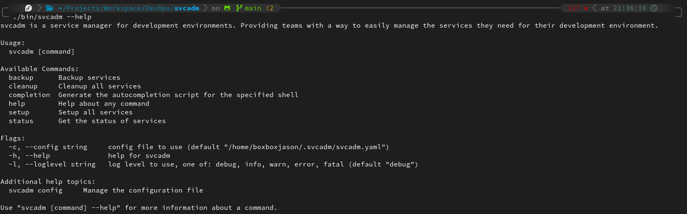
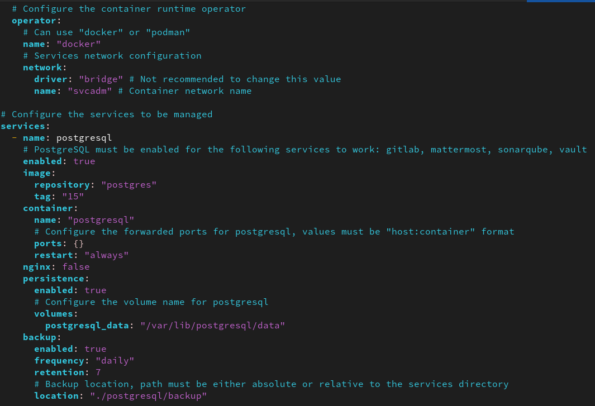
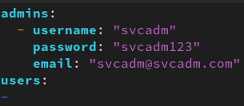


- Conteneurisation
- Golang
- [MON sur l'environnement de développement idéal](../../mon/temps-1.1/)



- [GitHub svcadm](https://github.com/boxboxjason/svcadm)
- [What is a container ?](https://www.redhat.com/en/topics/containers)
- Services déployés
    - [Nginx reverse proxy](https://docs.nginx.com/nginx/admin-guide/web-server/reverse-proxy/)
    - [PostgreSQL](https://www.postgresql.org/)
    - [SonarQube](https://www.sonarqube.org/)
    - [GitLab](https://about.gitlab.com/)
    - [Mattermost](https://mattermost.com/)
    - [Hashicorp Vault](https://www.vaultproject.io/)
    - [Trivy](https://github.com/aquasecurity/trivy)
    - [ClamAV](https://www.clamav.net/)


# svcadm
svcadm est une CLI (command line interface) écrite en golang qui permet de déployer un environnement de développement entier, personnalisable et moderne pour une équipe de développement. Le déploiement ne nécessite aucune connaissance en conteneurisation et est entièrement automatisé (pas mal non ? 😏).

L'utilisateur a seulement besoin de remplir un fichier de configuration pour définir et paramétrer les services à déployer.
Il peut aussi définir les utilisateurs administrateurs (ou pas) à créer automatiquement depuis un autre fichier de configuration.
Ensuite, il n'y a plus qu'à lancer la commande `svcadm setup` et le tour est joué !

## Héritage
Ce POK se base sur un projet déjà existant qui déployait à l'époque des services antivirus de manière automatisée en utilisant des conteneurs accessibles depuis un proxy.\
Le code était écrit en zsh et était peu personnalisable. L'objectif est de reprendre ce projet et de le réécrire en golang pour le rendre plus opérationnel et ajouter des fonctionnalités complexes.

## Contenu

### Code Source
Le code source (disponible sur [GitHub](https://github.com/boxboxjason/svcadm)) d'environ 2500 lignes effectives est divisé en plusieurs modules:
- `pkg`: En go, il s'agit de la bibliothèque de code réemployable par d'autres projets
    - `logger`: Gestion des logs de l'application
    - `containerutils`: Gestion des conteneurs et des commandes qui les concernent
    - `fileutils`: Manipulation des fichiers et des répertoires
    - `formatutils`: Gestion des formats de données, de texte, de json,...
    - `utils`: Autres fonctions utilitaires
- `cmd`: En go, il s'agit des commandes exécutables de l'application, c'est là que sont définies les commandes de la CLI
- `internal`: En go, il s'agit des modules internes de l'application
    - `config`: Gestion de la configuration de l'application
    - `services`: Gère la logique propre à chaque service, de leur création à leur suppression, en passant par les backups, le status,...
        - `svcadm`: Interface pour les services, définit les méthodes de base pour chaque service, contient des fonctions génériques pour les services
        - `gitlabadm`: Gestion de GitLab
        - `mattermostadm`: Gestion de Mattermost
        - `minioadm`: Gestion de Minio
        - `nginxadm`: Gestion de Nginx
        - `psqladm`: Gestion de PostgreSQL
        - `sonaradm`: Gestion de SonarQube
        - `trivyadm`: Gestion de Trivy
        - `vaultadm`: Gestion de Vault

### Services déployés
Les services déployés sont ceux que j'ai mentionné dans mon [MON sur l'environnement de développement idéal](../../mon/temps-1.1/)

#### Nginx
Nginx est un serveur web open-source (la partie que nous utilisons) qui peut également être utilisé comme reverse proxy, load balancer, mail proxy et serveur HTTP cache.\
Dans notre cas, il est utilisé comme reverse proxy pour rediriger les requêtes vers les services déployés. Il est accessible depuis les ports 80 et 443 de la machine hôte.

Concrètement, il permet de rediriger les requêtes HTTP vers les services déployés en fonction de l'URL demandée.\
Il ajoute également une couche de sécurité en masquant les services déployés derrière un seul point d'entrée, qui peut être sécurisé par un certificat SSL. Il garde également les logs des requêtes effectuées sur les services, permettant de les remonter en cas de problème.

#### PostgreSQL
PostgreSQL est un système de gestion de base de données relationnelle et objet. Il est open-source et est très utilisé dans le monde professionnel.

Dans notre cas, il est utilisé pour stocker les données nécessaires à chaque service déployé. Il peut aussi être utilisé pour stocker les données des applications développées par l'équipe.

#### SonarQube
SonarQube est un outil open-source (la partie que nous utilisons) de gestion de la qualité du code source. Il permet de détecter les bugs, les vulnérabilités, les codes dupliqués, les mauvaises pratiques, les tests unitaires manquants et les commentaires de code manquants dans le code source.

#### GitLab
GitLab est une plateforme open-source (la partie que nous utilisons) de gestion de code source, de CI/CD, de collaboration et de gestion de projet. Il permet de stocker le code source, de gérer les versions, de tester & déployer automatiquement les applications, de collaborer sur le code source et de gérer les projets.

#### Mattermost
Mattermost est une plateforme open-source (la partie que nous utilisons) de messagerie et de collaboration. Elle permet de discuter en temps réel, de partager des fichiers, de collaborer sur des projets et de gérer les équipes.

#### Hashicorp Vault
Vault est un outil open-source (la partie que nous utilisons) de gestion des secrets et de protection des données sensibles. Il permet de stocker les secrets, de les distribuer, de les gérer et de les protéger. Il permet également de générer des tokens, des certificats et des clés de chiffrement.

#### Trivy
Trivy est un outil open-source de scan de vulnérabilités pour les conteneurs, les images, les paquets, les fichiers et les systèmes d'exploitation. Il permet de détecter les vulnérabilités, les failles de sécurité et les erreurs dans les applications et les systèmes.

#### MinIO
MinIO est un serveur de stockage d'objets open-source qui permet de stocker des objets, des fichiers et des données non structurées. Il est compatible avec l'API S3 d'Amazon et peut être utilisé pour stocker des données dans le cloud.

### Executable
[L'exécutable (binaire) de svcadm](https://github.com/BoxBoxJason/svcadm/releases/) est généré à partir du code source et est utilisé pour déployer l'environnement de développement.
Pour qu'il puisse fonctionner, la seule condition est que la machine hôte ait installé le moteur d'éxécution de conteneurs qu'elle souhaite utiliser (docker ou podman).

### Comment ça marche ?

<pre class="mermaid" style="background-color: transparent">
%%{init: {'theme': 'forest'}}%%
architecture-beta
    service users(clarity:users-solid)[Utilisateurs]

    group network(internet)[Container Network]

    service nginx(logos:nginx)[Nginx] in network
    service postgres(logos:postgresql)[PostgreSQL] in network
    service sonarqube(devicon:sonarqube)[SonarQube] in network
    service gitlab(devicon:gitlab)[GitLab] in network
    service mattermost(logos:mattermost-icon)[Mattermost] in network
    service vault(devicon:vault)[Vault] in network
    service trivy(simple-icons:trivy)[Trivy] in network
    service minio(simple-icons:minio)[MinIO] in network

    junction row1 in network
    junction row2 in network
    junction row3 in network
    junction line1 in network

    users:R <--> L:nginx

    nginx:R <-- L:row1
    vault:B <-- T:row1
    gitlab:T <-- B:row1

    row1:R -- L:row2
    minio:B <-- T:row2
    sonarqube:T <-- B:row2

    row2:R -- L:row3
    trivy:B <-- T:row3
    mattermost:T <-- B:row3

    gitlab:B --> L:postgres
    sonarqube:B --> T:postgres
    mattermost:B --> R:postgres
</pre>

1. L'utilisateur remplit un fichier de configuration `svcadm.yaml` pour définir les services à déployer et les paramétrer.
    - Il décide des services à activer, des ports à utiliser, des volumes à monter, des variables d'environnement à définir,...
    - Il choisit le moteur de conteneurisation à utiliser (docker ou podman) et le réseau à utiliser.
    - Il définit le TLS certificat et la clé privée à utiliser pour sécuriser les connexions (s'il utilise nginx)

2. L'utilisateur remplit un fichier de configuration `access.yaml` pour définir les utilisateurs à créer et leurs rôles.

3. L'utilisateur lance la commande `svcadm setup` pour déployer les services.
4. Les services sont déployés dans des conteneurs, sur le même réseau et sont accessibles depuis le reverse proxy Nginx (s'il est activé) sur la machine hôte, sur les ports 80 (HTTP) et 443 (HTTPS).
5. Les utilisateurs sont créés avec les rôles définis dans le fichier de configuration `access.yaml`.
6. L'utilisateur peut accéder aux services déployés depuis un navigateur web en se connectant à l'URL de la machine hôte.
7. L'utilisateur peut accéder au status des services déployés en lançant la commande `svcadm status`.

## Planification

### Sprint Planning 1
- Permettre déploiement de:
    - Outil de gestion des codes sources
    - Cluster de base de données
    - Outils de gestion des artefacts
    - Outils de communication
    - Outil d'analyse de qualité de code
    - Outil d'analyse antivirus

### Sprint Planning 2
- Permettre déploiement de:
    - Outil de gestion des secrets
    - Outil de scan de vulnérabilités
    - Outil de gestion des utilisateurs
- Tests complets d'intégrations

## Horodatage

Le sprint ne s'est pas du tout déroulé comme prévu, j'ai trouvé qu'il y avait très peu de plus value à réécrire des scripts non personnalisables en bash.
Cela ne correspond pas du tout au besoin des équipes de développement modernes qui veulent des outils personnalisables et faciles à utiliser.

J'ai donc réorienté le fonctionnement du projet, en offrant la possibilité de customiser les services à déployer et en utilisant un fichier de configuration pour les paramétrer.

Pour m'offrir plus de flexibilité, j'ai décidé d'utiliser golang pour l'intégralité du code car c'est un langage que je maîtrise bien et qui est utilisé pour la plupart des opérateurs de conteneurs & kubernetes.

| Date | Heures passées | Indications |
| -------- | -------- |-------- |
| Samedi 14/09  | 1H  | Rédaction du fichier de configuration avec paramétrage initial des servicess |
| Samedi 14/09  | 5H  | Code du parser & validateur de fichier de configuration |
| Dimanche 15/09  | 1H  | Code du script de déploiement par des conteneurs |
| Dimanche 15/09  | 3H  | Fine tuning pour chaque service (du premier sprint)|
| Samedi 12/10 | 6H (qui ne comptent pas) | Refactor ENORME de la syntaxe des services pour normer tout ça avec des interfaces |
| Dimanche 13/10 | 3H | Refactor ENORME du module de gestion des conteneurs & de la configuration |
| Dimanche 13/10 | 3H | Ajout des services manquants & Correction des scripts de création des utilisateurs pour chaque service |
| Dimanche 13/10 | 1H | Correction des soucis de flags et mise à jour des commandes disponibles |
| Dimanche 13/10 | 1H | Tests d'intégrations complets et corrections pour le déploiement de tous les services |
| Lundi 14/10 | 2H | Implémentation du script de suppression & de status des services |
