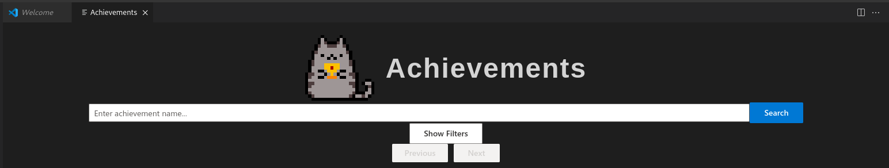

<head>
  <link rel="icon" href="https://github.com/BoxBoxJason/achievements/blob/203309903d67090188814ce491a9d418ab71891e/assets/icons/pusheen_holding_trophy.png?raw=true" type="image/x-icon">
</head>


- [VSCode](https://code.visualstudio.com/)
- [TypeScript](https://www.typescriptlang.org/)



- [Repo Achievements sur GitHub](https://github.com/boxboxjason/achievements)
- [API VSCode](https://code.visualstudio.com/api)
- [Développer son extension VSCode](https://code.visualstudio.com/api/get-started/your-first-extension)


  
  <h1 style="width: fit-content; font-size: 3rem; padding-top: 10px;">Achievements</h1>

## Introduction
Toujours dans l'optique de créer le **meilleur environnement de développement possible**, je me suis demandé ce qui permet au **développeur** d'**être le plus heureux quand il travaille**. C'est alors que je me suis rappelé que la majorité des développeurs a un passif (ou un présent) de joueur de jeux vidéo. Un système de succès pousse les joueurs à **continuer de jouer** et les **récompense** pour leur temps passé sur le jeu. Cela **booste la motivation** et la **satisfaction** du joueur.

Et puis *Qui n'a jamais rêvé de terminer VSCode* ? C'est pourquoi j'ai décidé de développer une extension pour VSCode permettant de débloquer des achievements en fonction de l'utilisation de l'éditeur.

Il existe déjà deux extensions de ce type sur le marché, mais elles ne sont pas complètes du tout et ne sont plus maintenues. J'ai donc décidé de développer la mienne, qui sera plus complète et plus à jour.

## Fonctionnement
L'extension `Achievements` fonctionne de manière assez simple. Le but est de ne pas impacter les performances de l'éditeur et de pouvoir fonctionner hors ligne.

### Workflow
Le workflow de l'extension est le suivant:
1. L'intégrité de la **base de données** est vérifiée à chaque démarrage de l'extension. S'il y a un problème, elle est patchée comme il faut.
2. Des **listeners** sont mis en place pour écouter les événements de l'éditeur (ouverture de fichier, sauvegarde, etc.).
3. Chaque listener déclenche l'**augmentation** d'un ou plusieurs critère de **progression**.
4. Lorsqu'une progression est augmentée, on vérifie si elle permet de **débloquer un succès**.
5. Si un succès est débloqué, on le notifie à l'utilisateur.
6. A tout moment, l'utilisateur peut aller consulter la liste des succès débloqués / en cours sur la Webview de l'extension.

### Webview
L'extension dispose d'une **Webview** qui permet à l'utilisateur de consulter la liste des succès débloqués et en cours. Cela permet de garder un historique des succès débloqués et de voir les succès restants à débloquer.

### Commandes
L'extension ajoute tout un tas de commandes à vscode:
- `achievements.enable`: Active / désactive l'extension
- `achievements.disable`: Désactive l'extension
- `achievements.configuration`: Ouvre la configuration de l'extension
- `achievements.notifications`: Active / désactive les notifications
- `achievements.show`: Ouvre la Webview des succès

Il s'agit de raccourcis pour les actions les plus courantes.

### Base de données
- J'utilise une base de données SQLite pour **stocker les succès**, leurs conditions de déblocage, leur état, la date de complétion, et tout un tas de propriétés.
- Je stocke aussi la **progression de chaque critère** pour débloquer les succès. Cela me permet de savoir si un succès est débloqué ou non.
- Il y a de nombreux achievements qui ne peuvent se débloquer que si certains autres sont débloqués. Pour cela, j'utilise une table qui **stocke les dépendances entre les succès**.
- Enfin, je **stocke les versions de la base de données** pour pouvoir mettre à jour les tables en fonction de la version de l'extension. (C'est utile pour les mises à jour qui vont nécessiter des migrations de bases de données).

<pre class="mermaid">
%%{init: {'theme': 'forest'}}%%
classDiagram
    class schema_version {
      +INTEGER id
      +INTEGER version
      +DATETIME applied_at
    }

    class achievements {
      +INTEGER id
      +TEXT title
      +TEXT icon
      +TEXT category
      +TEXT group
      +TEXT labels
      +TEXT criteria
      +TEXT description
      +INTEGER tier
      +INTEGER points
      +INTEGER hidden
      +INTEGER repeatable
      +BOOLEAN achieved
      +DATETIME achievedAt
    }

    class achievement_requirements {
      +INTEGER achievement_id
      +INTEGER requirement_id
    }
    achievement_requirements --> achievements : achievement_id
    achievement_requirements --> achievements : requirement_id

    class progressions {
      +INTEGER id
      +TEXT name
      +INTEGER value
    }
</pre>

## Développement
VSCode fonctionne grâce à Electron, ce qui signifie qu'il fonctionne exactement comme un site web. Le développement des extensions se fait donc en JavaScript / TypeScript.
J'ai choisi d'utiliser **TypeScript** pour mon extension car il permet de <u>s'assurer que le code est correct</u> avant de l'exécuter. Cela permet de réduire les erreurs et de gagner du temps.

### Dépendances
Pour mon extension, j'ai utilisé les dépendances suivantes :
- Développement
    - `npm` pour le management des dépendances
    - `esbuild` pour le bundling du code (la compilation de TypeScript)
    - `electron-rebuild` pour pouvoir packager mes dépendances avec l'extension
    - `eslint` pour l'analyse statique du code
- Run
    - `vscode` pour l'API de VSCode
    - `better-sqlite3` pour la base de données
    - `react` pour l'interface utilisateur
    - `fluentUI` pour le style des composants UI

## Post-mortem
La documentation de l'API de VSCode concernant les webviews est TRES MAUVAISE, contrairement à ce qu'on pourrait croire, il est très difficile de trouver des exemples concrets pour réaliser des actions relativement peu complexes. On dirait que les développeurs de VSCode ont oublié de documenter leur propre API.

Au niveau de l'extensibilité, qui est un des arguments principaux de VSCode, c'est un peu la déception. Il est très difficile de faire des choses qui sortent de l'ordinaire concernant les webviews. Je suis obligé de passer par de multiples hacks pour arriver à mes fins (afficher des images ?????). La communication extension <-> webview est un véritable calvaire avec 0 documentation mis à par un exemple miteux. Le framework n'est vraiment pas bon pour le développement de vues personnalisées et complexes (ils déconseillent aux utilisateurs de développer des webviews pour des raisons de performances mais ce n'est pas une raison pour ne pas prendre en charge leur ajout).

Le bundle des vues n'est pas prévu par défaut par VSCode, c'est une catastrophe pour packager ses images / icones / css / js. Il faut tout mettre à la main dans le bundle, ce qui est une perte de temps et d'énergie pour des choses qui devraient être automatisées.

### Planning
| Date | Heures passées | Indications |
| -------- | -------- |-------- |
| Mercredi 12/11  | 3H  | Etablissement du projet, création du premier modèle de base de données |
| Jeudi 13/11  | 4H  | Création des premiers succès (1099), standardisation de l'attribution des points, des difficultés,... |
| Samedi 15/11 | 3H | Création de la webview et communication extension <-> webview |
