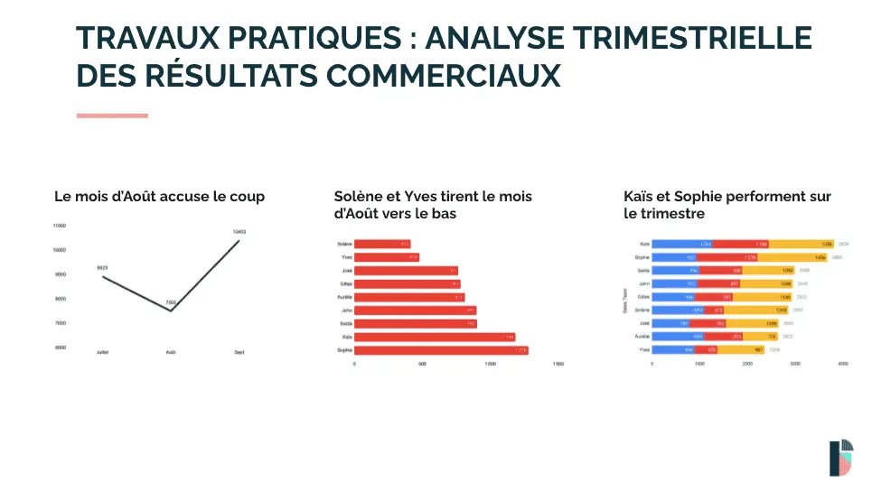
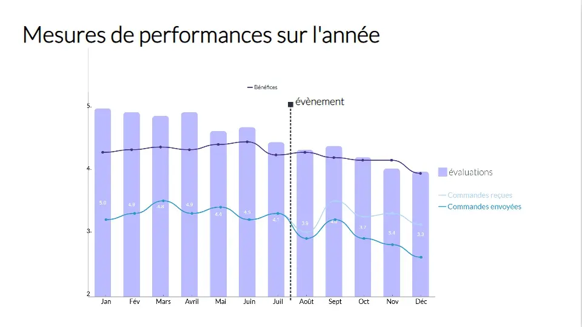
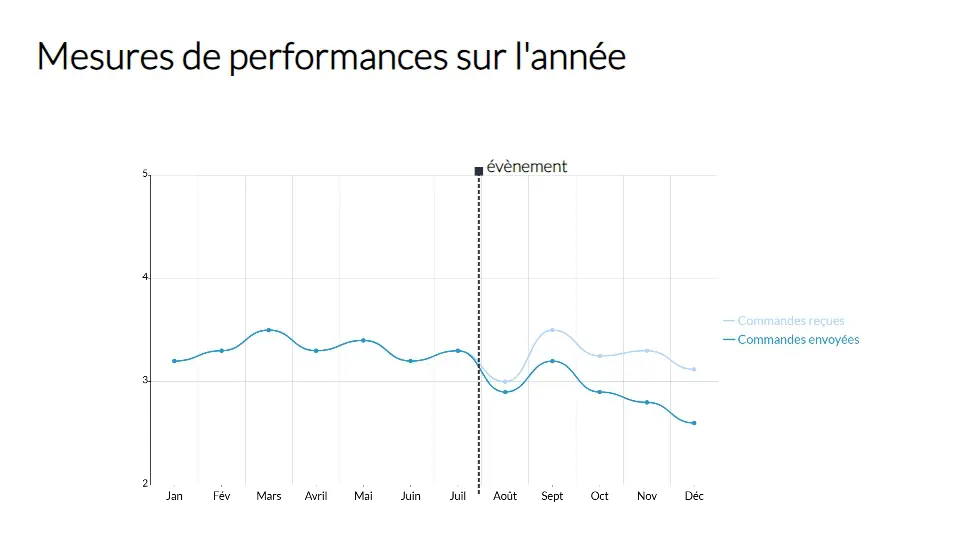
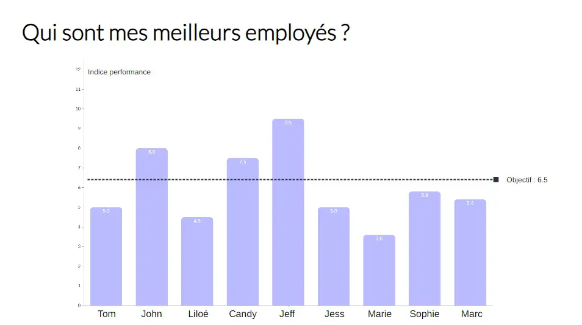
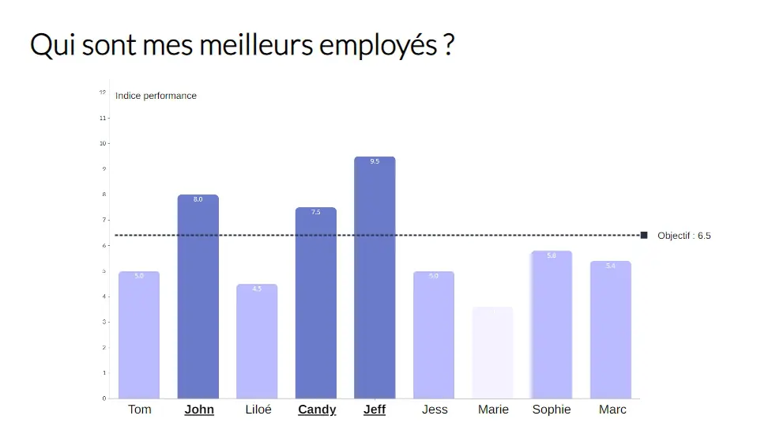
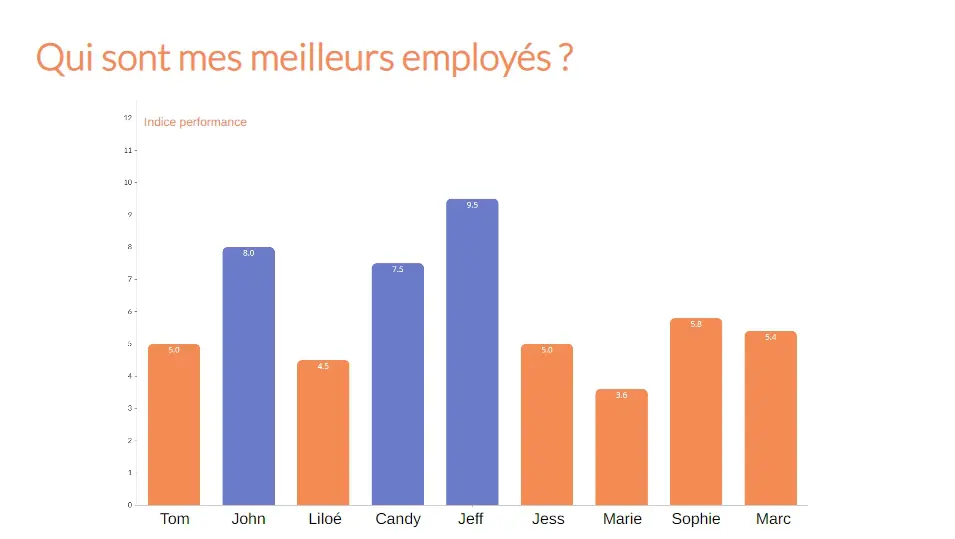
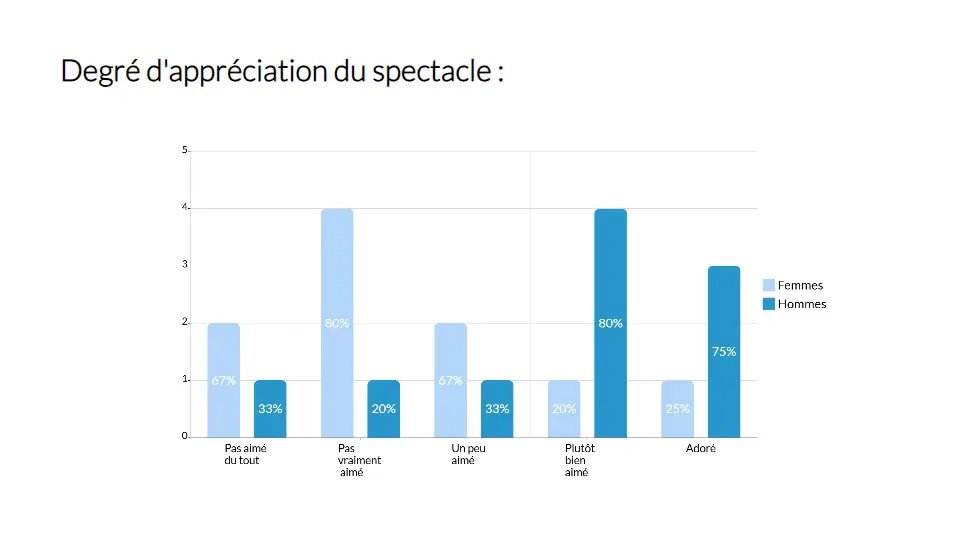
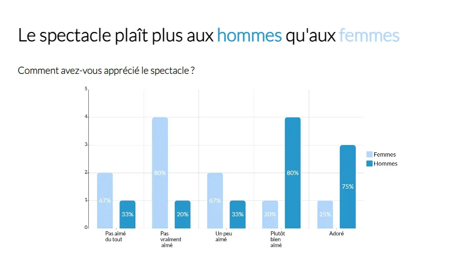
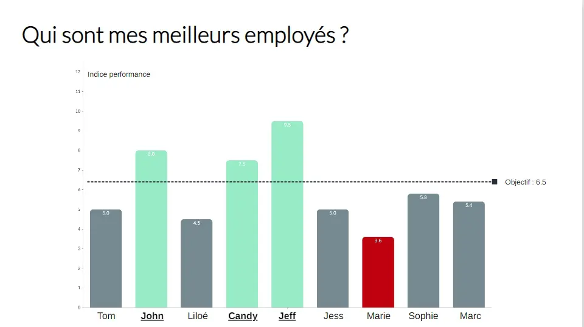
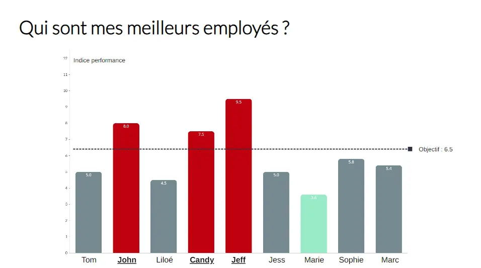



Prérequis : Aucun



## Objectifs

L'objectif de ce MON est de découvrir les différentes techniques de storytelling appliquées aux données. Comment faire parler nos données pour véhiculer des messages clairs ? Et comment est utilisé le Data Storytelling par les entreprises ?

## Sommaire

  1. Introduction : le Data Storytelling, qu'est-ce que c'est vraiment ?
  2. Quel enjeux pour les entreprises ?
  3. Comment ça marche ? Les techniques de Data Storytelling
  4. Les défis du Data Storytelling
  5. Conclusion

## 1. Le Data Storytelling, qu'est-ce que c'est vraiment ?

### Définition

Le **data storytelling**, ou ***l'art de raconter une histoire avec des données***, c’est la capacité de combiner l'analyse de données avec la narration d'une histoire, c'est créer un récit autour des données présentées, avant tout pour leur donner du sens, faciliter leur compréhension, et influencer l'auditeur.

Elle peut donc autant servir à mieux faire comprendre des graphes, ou bien à convaincre toute une assemblée d'adopter telle ou telle stratégie si celle-ci a été bien introduite avec des données solides et un bon storytelling !

### Data Storytelling versus Data Visualization

Ces deux notions sont en réalité complémentaires : le Data Storytelling repose quelque peu sur la Data Visualization, mais va cependant plus loin que cette dernière en y ajoutant des dimensions émotionnelles.

- La Dataviz vise à créer des représentations visuelles pour mettre en valeur des analyses sur un ensemble de données.

- Le data storytelling vise à faire parler ces représentations : c'est une approche basée sur le message à faire passer.

### Pourquoi c'est magique ?

Cette [vidéo](https://www.youtube.com/watch?v=AL-PAzrpqUQ) datant d'il y a déjà plus de 10 ans met bien en valeur les superpouvoirs des histoires.

Par nature, nous sommes depuis bien logntemps habitués à entendre et à raconter des histoires : c'est par ce moyen que les connaissances se sont toujours transmises par le passé.

Les histoires ont la particularité de **capter l'attention** des personnes les écoutant et de les **connecter émotionnellement** : cela rajoute un aspect mémorable à ce qui est raconté, et crée une empathie permettant d'influencer notre perception.

Cette propriété est très utile dans notre cas où appliqué aux données, le Data Storytelling est donc un outil permettant de convaincre mais surtout de **persuader** l'auditeur.

Enfin, **plus la narration est captivante, plus l'information sera mémorisée et partagée.** Lors d'une présentation, on retient généralement l'histoire donnée, non pas les statistiques présentées...

## 2. Quels enjeux pour les entreprises ?

### Contexte : les enjeux du Big Data

Les entreprises font face à des quantités massives de données (qui augmentent très rapidement) dont il est nécessaire de garder le contrôle : c'est un des enjeux majeurs actuels. Lorsque dans ce contexte tout le monde est saturé par les données au quotidien, le Data Storytelling offre un avantage compétitif important en ciblant les messages clés et en les communiquant efficacement.

### Les bienfaits du Data Storytelling

- **Des prises de décisions efficaces**

  Les prises de décisions sont généralement composées d'une part rationelle et d'une autre émotionelle : en combinant un apport intellectuel (avec les données) avec un apport émotionnel (lié à leur histoire), il en résulte des prises de décisions plus **éclairées** et **efficaces**. Cela permet d'augmenter les performances.

- **Des parties prenantes plus engagées et intéressées**
  
  Le Data Storytelling permet une **meilleure compréhension** des parties prenantes dans les entreprises, qui ne sont pas toutes à l'aise avec les chiffres et les analyses brutes, et donc suciter plus d'engagement de leur part. De plus, l'aspect captivant des histoires **renforce l'intérêt** que portent les employés à leur données / résultats.

- **Des données / chiffres plus faciles à mémoriser**
  
  Présentés sous la forme d'histoire, l'auditeur sera plus enclin à retenir ce qui est raconté (comme expliqué précédemment) et donc celui-ci retiendra mieux les chiffres clés qui lui sont présentés. Les employés sont alors **mieux informés**.

- **De meilleurs résultats**

  Lorsque le Data Storytelling est utilisé non pas en interne mais pour communiquer avec des clients, il devient indispensable pour les convaincre !

A ce qu'on dit, ceux qui raconteront le mieux les histoires deviendront les meilleurs dirigeants... à débattre.

Mais on peut quand même conclure que le Data Storytelling est un véritable outil magique pour les entreprises afin de se démarquer et d'augmenter leur efficacité là où le contexte et les enjeux sont importants. Il peut transformer des données obscures en informations utiles pour l’**amélioration constante des processus, des produits et des stratégies d’entreprise**, tout en sachant **persuader de plus en clients !** Bien utilisé, le Data Storytelling donne donc un avantage concurrentiel important et est une **arme stratégique !**

### Quelques domaines d'application

- **Le marketing** est par exemple très lié au data storytelling qui est un outil indispensable pour persuader les consommateurs d'acheter un produit.
- **L'infographie** est du Data Storytelling.
- Certaines **campagnes de publicité** utilisent le Data Storytelling pour influencer les plus naïfs d'entre nous.
- Dans le domaine de la **santé** ou de l'**éducation** par exemple, le Data Storytelling peut être utilisé par les experts pour faire réagir les politiques vis-à-vis des situations actuelles (pandémie ?) ou pour informer la population.
- En fait, ça s'applique partout...

## 3. Comment ça marche ? Les techniques de Data Storytelling

Comme je l'ai mentionné dans la définition, le Data Storytelling peut aussi bien servir à mieux faire comprendre des visualisations graphiques, mais aussi à convaincre des personnes à propos de stratégies plus larges à adopter.

J'ai donc trouvé deux axes de développement du Data Storytelling que j'ai étudié ensuite :

- Savoir manier la Data Visualization pour le Storytelling
- Savoir raconter une histoire pour convaincre son public

Dans tous les cas, la première étape d'un bon Data Storytelling est de savoir **cibler son public** :

- Mes auditeurs sont-ils familiers avec les données ?
- Que veulent-ils savoir ? Quelles questions se posent-ils ?

En allant chercher ces réponses, je saurais alors quelle complexité de représentation choisir selon leur niveau et comment orienter l'histoire selon leurs problématiques.

### Techniques de Data Visualization pour le Storytelling

Rentrons dans le vif du sujet en nous intéressant tout d'abord aux techniques de DataViz pour améliorer son storytelling :

Comment passer de ça :

à ça :

(1)

Je me suis appuyée sur cette [vidéo](https://www.youtube.com/watch?v=IM-r9lEZciM&t=80s) qui m'a bien introduite aux rouages de cette approche, puis j'ai voulu illustrer avec mes propres exemples. Pour cela j'ai utilisé la plateforme web [Visme](https://www.visme.co/fr/) que j'ai découvert en cherchant des outils gratuits pour la DataViz, ce qui m'a permis de pratiquer un peu.

#### 1. Aller à l'essentiel, faire simple

Plus on va mettre d'informations sur notre représentation, moins notre cerveau réussira à repérer l'information essentielle rapidement. L'idéal serait de dédier **une information clé par représentation visuelle**, quitte à faire plusieurs représentations pour présenter les informations étape par étape !

|Exemple 1 | Exemple 2 |
| :-------------: | :-------------: |
|  |  |
| ***Pour une simple présentation, ce graphe contient trop d'informations : mieux vaut les présenter séparément.***  | ***Celui-ci est plus clair***  |


Si le cerveau met plus de 15 secondes à comprendre le message passé par la représentation, c'est que celle-ci est à revoir. On ne veut pas que le public perde le fil de l'histoire !


#### 2. Utiliser les couleurs et les contrastes

Les couleurs utilsées ont une importance sous-estimée : jouer avec les couleurs va permettre de créer des association et mettre en valeur les informations importantes dans notre représentation, tout en créant une harmonie qui rendra le visuel agréable.

Quant aux contrastes, ils sont importants pour **mettre en lumière ce qui est essentiel** car c'est ce que notre oeil va repérer en premier :

| Sans contraste           |  Avec contraste |
| :-------------------------: |:-------------------------:|
|   |  |

***Par exemple, ici le contraste de couleur permet de nous faire prendre conscience plus rapidement de quels employés font les meilleures performances.***


Attention à l'emploi des couleurs qui peut être contre-productif :


***Par exemple, ici on peut facilement associer la couleur orange avec le titre "meilleurs employés" alors que c'est l'inverse !***

#### 3. Choisir un titre reflétant l'histoire

Avec un titre accrocheur désignant immédiatement ce dont il est question, le public saura tout de suite quelles informations rechercher dans les données montrées ce qui faclitera grandement la compréhension.

| Titre descriptif            |  Titre messager |
| :---------------------: |:-------------------------:|
|   |  |

***Par exemple, nous mettons plus de temps à comprendre le message sur l'exemple de gauche tandis que cela est beaucoup plus facile sur l'exemple de droite.***

De plus, c'est aussi un moyen d'inciter à l'action pour influencer / rendre la prise de décsion plus rapide :

#### 4. Respecter les conventions établies

Certaines couleurs sont de manière courante associées à certains principes : comme le rouge est associé à du négatif tandis que le vert est associé à du positif :

|     Conventionnel  |  Pas conventionnel   |
| :-------------------------: |:-------------------------:|
|   |  |

***Notre cerveau est quand même plus à l'aise face aux couleurs qui confirment l'information transmise...***

Il faut donc faire attention à ne pas faire de mauvaises utilisations des couleurs pour garder une cohérence dans notre histoire, mais cela ne concerne pas que les couleurs ! (par exemple, le temps va de gauche à droite)

#### 5. Choisir des données pertinentes

Il faut bien savoir sélectionner les données qui ont un sens pour les questions du public : on veut uniquement voir ce qui nous importe.

De plus, une donnée présentée seule ne veut souvent pas dire grand chose... (mais ça peut arriver cela dit) il ne faut pas oublier d'utiliser des comparaisons et de mettre les données en contexte pour mieux les interpréter.

### Les techniques pour raconter des histoires convaincantes

Raconter une bonne histoire n'est pas à la portée de tous, c'est un savoir-faire qui s'acquiert.

Déjà, toute histoire suit une strcture narrative :

- **L'incipit :** une introduction présentant le contexte et ce dont il s'agit (présentation des données et de leur contexte).
- **Le développement :** Les personnages vivent des aventures (on fait parler les données pour expliquer les tendances mises en valeur par la représentation choisie)
- **Le climax :** Une grande révélation ! (Un problème mis en lumière par l'analyse des données par exemple)
- **Le dénouement :** Il y a finalement une solution, tout va bien qui finit bien (Réflexion et mise en avant de perspectives ou de plan d'actions)

L'important est de garder un **enchaînement logique** dans notre récit pour garder l'interlocuteur accroché tout au long.

Dans le cas d'une présentation en réunion par exemple, le mieux est donc de présenter nos données en suivant cet enchaînement logique, en montrant les données étape par étape, tout en racontant les péripéties de ces données (par exemple en suivant une évolution dans le temps, avec les évènements associés). Ainsi, l'auditeur est réellement embarqué par le discours et peut analyser en même temps.

Mais encore, j'ai découvert des méthodes plutôt orientées pour le management et la proposition d'idées ou de stratégies :

Paul Smith, un leader mondial dans le Storytelling organisationnel (oui ça existe...) suggère 2 méthodes dans son livre "Sell with a Story" que j'ai trouvées intéressantes :

#### The How did we got there method

Cette [vidéo](https://youtu.be/g-rCSinAZf0?si=LDnz10Y16Ouu3Yty) l'explique mais en quelques lignes :

Cette méthode s'applique surtout lorsqu'une décision difficile doit être prise suite à des évènements impactant les affaires de l'entreprise. Paul Smith suggère que le manager ne devrait pas arriver et présenter une solution qu'il a choisi seul, car pensant qu'elle était évidente au vu des données. A la place, celui-ci devrait présenter habilement les données existantes, expliquer **comment ils en sont arrivés à ce point crucial** où il faut prendre une décision, et laisser les membres de l'équipe **se faire leur propre idée de la fin de l'histoire**, en les laissant suggérer des solutions.

- Présenter la situation initiale (Incipit)
- Montrer l'évolution des données et leurs explications (Développement)
- Établir le point d'arrivée, la situation actuelle (Climax)
- Laisser les membres de l'équipe comprendre par eux-mêmes en quoi la situation est problématique (Réaction à l'histoire)
- Laisser les membres de l'équipe suggérer des solutions à cette histoire tragique (Dénouement)

Ainsi, les membres de l'équipe pourront comprendre les motifs qui poussent le manager à devoir prendre une décision difficile, et se sentiront concernés, et écoutés. Et en plus, on arrive à une solution qui convient à tout le monde, peut être même meilleure que celle dont le manager avait en tête intialement !

#### The Discovery Journey method

Cette méthode consiste à partager sa propre histoire avec ses interlocuteurs ! Afin de convaincre le public de la pertinence de ce que l'on souhaite recommander, suggérer, ou simplement annoncer, nous allons essayer de **l'embarquer avec nous dans le raisonnement qui nous a menés jusqu'ici**, à la place de simplement faire notre suggestion puis de l'expliquer dans un second temps. En effet, le public sera beaucoup plus convaincu car on l'emmène à faire exactement les mêmes conclusions que nous.

- Présenter le problème à résoudre
- Expliquer les étapes du raisonnement que l'on a suivi, les questions que l'on s'est posées, et les données que l'on a étudiées
- A chaque question que l'on s'est posée durant l'analyse des données, laisser le public y réfléchir également pour qu'ils vivent réellement le raisonnement, pour qu'il y ait du suspense, pour qu'ils devinent
- Laisser le public trouver la même conclusion que nous (en le guidant si besoin)
- Tout le monde est convaincu


Ces méthodes s'éloignent un peu tout de même du sujet initial mais j'ai trouvé intéressant de séparer la partie Data Visualisation qui permet aux données de raconter des histoires, et la partie "savoir comment raconter une histoire avec des données", qui je pense être utile pour acquérir des compétences managériales.


## 4. Les défis du Data Storytelling

Le Data Storytelling c'est utile, mais il ya tout de même quelques points d'attention à mentionner, notamment il faut rappeler l'importance de :

- Respecter la **qualité des données** (intégrité, fiabilité...)
- Respecter la **confidentialité des données**
- Rester **éthique** : le Data Storytelling ne doit pas être utilisé à des **fins de manipulation**, comme cela pourrait être le cas en créant des histoires influencant les auditeurs de manière abusive.
  
  Par exemple : Cacher des données importantes que l'on ne veut pas voir, et montrer des chiffres insignifiants en racontant que tout va bien. De bonnes histoires peuvent en convaincre plusieurs d'entre nous... Gardez votre esprit critique !

## 5. Conclusion

Et voilà, on vient de démontrer que non, les données ne parlent pas vraiment d'elles mêmes... Mais on peut les faire parler en maniant la Data Visualization à notre avantage, et en apprenant à raconter des histoires captivantes.

Sur une même présentation de données, les personnes peuvent avoir plusieurs analyses différentes : maîtriser le data storytelling va permettre d'une part de mieux se faire comprendre et mieux faire passer notre message, et d'autre part à rallier les gens à notre cause en les convaincant.

### Retour sur le MON

Le sujet me paraissait hyper intéressant, mais finalement plus limité que je ne pensais, et j'ai un peu peur de m'être perdu dans les limites de la définition... Cela dit, j'ai quand même appris des tas choses utiles et ne regrette pas mon choix !

## Sources



- [Blog Ostraca](https://blog.ostraca.fr/blog/guide-data-storytelling-exemple-avec-donnees/)

- [EDHEC](https://online.edhec.edu/fr/blog/dataviz-et-data-storytelling/)

- [Data pour tous](https://datapourtous.fr/comprendre-le-data-storytelling-par-lexemple/) (1)

- [Think with Google](https://www.thinkwithgoogle.com/intl/fr-fr/strategies-marketing/donnees-et-mesure/raconter-une-histoire-pertinente-a-laide-des-donnees/)

- [Persuasion and the Power of Story: Jennifer Aaker (Future of StoryTelling 2013)](https://youtu.be/AL-PAzrpqUQ?si=68bK9ebvK0TcLJWM)


