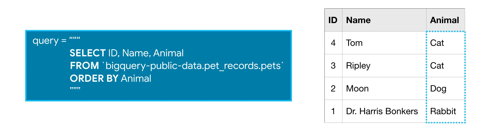



Prérequis : Aucun



## Objectifs

L'objectif de ce MON est de replonger dans le monde de SQL après l'avoir quitté après la prépa, tout simplement car ce langage est toujours très répendu est paraît nécessaire dès lors que l'on souhaite travailler avec des bases de données relationnelles.

## Sommaire

- Introduction
- Les notions de base du langage SQL
- SQL avec BigQuery
- Fonctionnalités principales
  - SELECT... FROM... WHERE...
  - COUNT, GROUP BY, GROUP BY... HAVING
  - ORDER BY
  - EXTRACT
  - WITH... AS
  - JOIN... ON
  - Bilan
- Pour aller plus loin
  - UNION
  - Fonctions analytiques
  - Nested / Repeated data
  - Optimiser des requêtes
- Conclusion
- Sources

## Introduction

Aujourd'hui, la quasi-totalité des entreprises utilise des bases de données relationnelles pour gérer leur données depuis leur apparition sur le marché vers la fin des années 70.

Ces données sont supportées par des **systèmes de gestion de bases de données (SGBD)**, qui jouent un rôle d'interface entre l'utilisateur et la base de données et permettent notamment de créer des bases, de les gérer, de les requêter, ou d'assurer leur sécurité. Il existe plusieurs SGBD relationnels conçus par différentes grandes entreprises dont MySQL, PostgreSQL, SQL Server etc.

**SQL** a alors été conçu en vue d'uniformiser toutes ces variétés de systèmes, et constitue aujourd'hui le **langage standard des bases de données relationnelles**. Tous les SGBD mentionnés précédemment se conforment donc tous sur le langage SQL et diffèrent uniquement par quelques spécifités qui leur sont propres, mais le but n'est pas de les détailler ici.

**Sources :** Pour ce MON je me base sur 3 sources principales (qui sont aussi à la fin de la page) :

- Le livre ***"SQL, les fondamentaux du langage"***, de Anne-Christine BISSON et Eric GODOC
- Le livre ***"Bases de données et systèmes d'information"***, de Saïd BENAÏCHOU
- Les cours intéractifs [***Intro to SQL***](https://www.kaggle.com/learn/intro-to-sql) et [***Advanced SQL***](https://www.kaggle.com/learn/advanced-sql) disponibles gratuitement sur Kaggle et proposant des exercices simples à chaque étape.



Je n'avais pas prévu initialement de faire ce MON au temps 1, mais ce qui m'a fait changer d'avis, c'est surtout que justement beaucoup d'entreprises demandent sur les offres de stages que je regarde de maîtriser (plus ou moins) SQL. Autant se former rapidement pour mettre en avant ces compétences.



## Notions de base du langage SQL

### Le modèle relationnel

Le langage SQL (Structured Query Language) sert à manipuler des **bases de données relationnelles**. Le modèe relationnel vise à représenter les données de manière logique, indépendamment de la manière dont elles sont stockées physiquement.

Les données sont organisées dans différentes **tables** distinctes, qu'on peut aussi appeler **relations**.
Les tables sont constituées de différentes colonnes que l'on appelle **champs**, ou **attributs**, et des lignes contenant les valeurs que l'on appelle **tuples**.

Quelques règles doivent être respectées, comme par exemple l'**unicité** des éléments d'une table, ou la présence d'une **clé primaire** qui sert en tant qu'identifiant unique pour chaque élément de la table.

### Les sous-ensembles du SQL

- Le **DDL** (Data Definition Language) : regroupe les fonctions permettant de créer, modifier ou supprimer des structures de bases de données (CREATE, ALTER, DROP)
- Le **DML** (Data Manipulation Language) : regroupe les fonctions permettant de manipuler les données dans la base (SELECT, INSERT, DELETE, UPDATE...). C'est ça qu'on utilisera principalement dans ce MON.
- Le **DCL** (Data Control Language) : regroupe les fonctions permettant de gérer la sécurité et les accès à la base (GRANT, REVOKE)
- Le **TCL** (Transaction Control Language) : regroupe les fonctions permettant de gérer la validation des mises à jour effectuées sur la base (COMMIT, ROLLBACK)

### Les normes SQL

Il s'agit des différentes versions de SQL qui évoluent au fil du temps. Chaque version de SQL est normalisée. Il s'agit par exemple de :

- SQL-86 ou SQL-87 : première version normalisée
- SQL-2 ou SQL-92 : implémentée dans la majorité des SGBD relationnels
- SQL-3 ou SQL-99 : apporte des fonctionnalités complémentaires (requêtes récursives par ex, etc.)
- SQL:2011 : idem

Chaque fournisseur de SGBD implémnte alors SQL comme il le souhaite dans son système en étant libre de rajouter ses propres extensions, d'où les disparités subtiles d'utilisation de SQL d'une entreprise à l'autre...

## SQL avec BigQuery

### Récupérer un dataset avec bigquery

Le cours que je souhaite réaliser sur Kaggle repose sur l'utilisation de BigQuery avec Python pour permettre de faire des requêtes SQL sur de grands datasets (Google Cloud).

Il faut donc commencer par comprendre comment faire des requêtes avec BigQuery.

***Schéma de la structure de bigquery***


Les premières étapes à suivre sont celles pour aller chercher son dataset choisi au préalable :

- Importer `bigquery`
- Créer un objet `client`qui nous permet d'accéder au dataset avec la méthode `.Client`
- Créer la référence de notre dataset avec la méthode `.dataset()`
- Récupérer notre dataset avec la méthode `.get_dataset` et la référence créée juste avant

```python
from google.cloud import bigquery

# Create a "Client" object
client = bigquery.Client()

# Construct a reference to the "hacker_news" dataset
dataset_ref = client.dataset("hacker_news", project="bigquery-public-data")

# API request - fetch the dataset
dataset = client.get_dataset(dataset_ref)
```

On peut ensuite **lister les tables** que contient le dataset :

```python
# List all the tables in the "hacker_news" dataset
tables = list(client.list_tables(dataset))
for table in tables:  
    print(table.table_id)
```



```python
comments
full
full_201510
stories
```



Puis, de la même manière que l'on récupère notre dataset, on peut **récupérer une table** en particulier, et afficher son **schéma de table** pour pouvoir étudier sa structure :

```python
# Construct a reference to the "full" table
table_ref = dataset_ref.table("full")

# API request - fetch the table
table = client.get_table(table_ref)

table.schema
```



```python
[SchemaField('title', 'STRING', 'NULLABLE', 'Story title', (), None),
 SchemaField('url', 'STRING', 'NULLABLE', 'Story url', (), None),
 SchemaField('text', 'STRING', 'NULLABLE', 'Story or comment text', (), None),
 SchemaField('dead', 'BOOLEAN', 'NULLABLE', 'Is dead?', (), None),
 SchemaField('by', 'STRING', 'NULLABLE', "The username of the item's author.", (), None),
 SchemaField('score', 'INTEGER', 'NULLABLE', 'Story score', (), None),
 SchemaField('time', 'INTEGER', 'NULLABLE', 'Unix time', (), None),
 SchemaField('timestamp', 'TIMESTAMP', 'NULLABLE', 'Timestamp for the unix time', (), None),
 SchemaField('type', 'STRING', 'NULLABLE', 'Type of details (comment, comment_ranking, poll, story, job, pollopt)', (), None),
 SchemaField('id', 'INTEGER', 'NULLABLE', "The item's unique id.", (), None),
 SchemaField('parent', 'INTEGER', 'NULLABLE', 'Parent comment ID', (), None),
 SchemaField('descendants', 'INTEGER', 'NULLABLE', 'Number of story or poll descendants', (), None),
 SchemaField('ranking', 'INTEGER', 'NULLABLE', 'Comment ranking', (), None),
 SchemaField('deleted', 'BOOLEAN', 'NULLABLE', 'Is deleted?', (), None)]
 ```

Chaque ligne représente un champ (une colonne) de la table, et donne davantage d'informations comme le type de données dans ce champ, son titre, sa description, et certains autres paramètres.



Enfin, en connaissant quelques commandes / fonctions, on peut faire quelques petites choses intéressantes telles qu'**afficher les premières lignes du dataset**, c'est plutôt utile pour voir à quoi il ressemble :

```python
# Preview the first five lines of the "full" table
client.list_rows(table, max_results=5).to_dataframe()
```






### Faire des requêtes SQL avec bigquery

Pour faire des requêtes SQL, on va suivre ces différentes étapes :

- Définir la requête SQL dans une variable query
- Configurer la requête, ici on rajoute une `safe_config` pour empêcher de faire des requêtes trop lourdes car sinon ça devient payant...
- On exécute la requête et on la renvoie sous la forme d'un dataframe pour pouvoir le visualiser

```python
- # Query to select prolific commenters and post counts
titles_query = """
                SELECT title
                FROM `bigquery-public-data.hacker_news.full`
                """

# Set up the query (cancel the query if it would use too much of your quota, with the limit set to 1 GB)
safe_config = bigquery.QueryJobConfig(maximum_bytes_billed=10**10)
query_job = client.query(titles_query, job_config=safe_config)

# API request - run the query, and return a pandas DataFrame
titles = query_job.to_dataframe()

# View top few rows of results
print(titles.head())
```

Par la suite, je n'afficherai pas toujours ce code servant à exécuter la requête pour alléger le rendu, mais gardons en tête que les requêtes SQL que j'ai écrites par la suite ne se sont pas exécutées toutes seules.

## Les requêtes SQL de base

Pour cette partie je me suis appuyé sur la formation [Intro to SQL](https://www.kaggle.com/learn/intro-to-sql) du site Kaggle, en prenant le temps de faire chaque exercice proposé sans pour autant les restituer ici.

### SELECT... FROM... WHERE

Ces trois mots clés servent à effectuer les requêtes les plus basiques en SQL.

Rafraîchissons-nous la mémoire :

- **SELECT** permet d'indiquer quel(s) champ(s) de la table on souhaite récupérer
- **FROM** permet d'indiquer depuis quelle(s) table(s) on va chercher ces champs
- **WHERE** permet de spécifier que l'on souhaite retourner uniquement les lignes qui vérifient une certaine condition

Par exemple :

| table : ***pet_records*** | requête |
|:---:|:---:|
|| |
| ^^ ||


Après le FROM, on doit indiquer ici la source entre backticks (``) en mentionnant d'abord le projet auquel fait partie le dataset, puis le nom du dataset, puis le nom de la table, séparés par des points (.)


Remarques :

- On peut sélectionner plusieurs colonnes en les séparant par des virugles après le SELECT



```python
# Query to select cities and countries with units of "ppm"
first_query = """
              SELECT city, country
              FROM `bigquery-public-data.openaq.global_air_quality`
              WHERE unit = 'ppm'
```

Retourne :

|    | city         | country   |
|---|:-------------:|:----------:|
|  0 | Buenos Aires | AR        |
|  1 | Buenos Aires | AR        |
|  2 | Buenos Aires | AR        |
|  3 | Buenos Aires | AR        |
|  4 | Buenos Aires | AR        |



- On peut rajouter `DISTINCT` derrière SELECT afin de n'afficher que des résultats uniques (enlève les occurrences multiples)



```python
# Query to select cities and countries with units of "ppm" (unique)
first_query = """
              SELECT DISTINCT city, country
              FROM `bigquery-public-data.openaq.global_air_quality`
              WHERE unit = 'ppm'
              """ 
```

Retourne :

|     | city                          | country   |
|----|:------------------------------:|:----------:|
|   0 | Buenos Aires                             | AR        |
|   1 | 彰化縣                                   | TW        |
|   2 | מישור החוף הדרומי                        | IL        |
|   3 | אילת                                     | IL        |
|   4 | Bogota                                   | CO        |



- On peut choisir de sélectionner toutes les colonnes de la table en écrivant `SELECT *`



```python
# Query to select all columns where pollution levels are exactly 0
zero_pollution_query = """
                        SELECT *
                        FROM `bigquery-public-data.openaq.global_air_quality`
                        WHERE value = 0
                        """
```

Retourne :

```markdown
|    | location                     | city     | country   | pollutant   |   value | timestamp                 | unit   | source_name   |   latitude |   longitude |   averaged_over_in_hours | location_geom      |
|---:|:-----------------------------|:---------|:----------|:------------|--------:|:--------------------------|:-------|:--------------|-----------:|------------:|-------------------------:|:-------------------|
|  0 | Zielonka, Bory Tucholskie    | Zielonka | PL        | bc          |       0 | 2022-04-29 14:00:00+00:00 | µg/m³  | GIOS          |          1 |     53.6621 |                  17.934  | POINT(53.662136 1) |
|  1 | Toruń, ul. Przy Kaszowniku   | Toruń    | PL        | bc          |       0 | 2022-04-19 04:00:00+00:00 | µg/m³  | GIOS          |          1 |     53.0176 |                  18.6128 | POINT(53.017628 1) |
|  2 | Kielce, ul. Targowa          | Kielce   | PL        | bc          |       0 | 2022-05-07 17:00:00+00:00 | µg/m³  | GIOS          |          1 |     50.879  |                  20.6337 | POINT(50.878998 1) |
|  3 | Zielonka, Bory Tucholskie    | Zielonka | PL        | bc          |       0 | 2022-05-19 14:00:00+00:00 | µg/m³  | GIOS          |          1 |     53.6621 |                  17.934  | POINT(53.662136 1) |
|  4 | Koszalin, ul. Armii Krajowej | Koszalin | PL        | bc          |       0 | 2022-05-12 20:00:00+00:00 | µg/m³  | GIOS          |          1 |     54.194  |                  16.1725 | POINT(54.193986 1) |
```



- On peut utiliser `LIKE` et des `%` pour spécifier une condition après WHERE : cela permet de rechercher des lignes qui ***contiennent*** des mots ou des lettres spécifiques, sans être obligé d'avoir une égalité exacte entre les contenus.



```python
# Query to select all columns where the name contains 'ipl'
query = """
        SELECT * 
        FROM `bigquery-public-data.pet_records.pets` 
        WHERE Name LIKE '%ipl%'
        """
```



### COUNT, GROUP BY, HAVING

- La fonction **COUNT()** est une fonction d'agrégation qui permet de compter le nombre d'entrées dans une colonne. Si on lui dit de compter une clé unique telle qu'une colonne "ID", elle renverra le nombre de lignes, il est donc intéressant de la combiner avec la fonction GROUP BY () ci-dessous.
- **GROUP BY()** prend une ou plusieurs colonnes en entrée, et va permettre de grouper ensemble toutes les lignes ayant la même valeur dans cette colonne, pour que les fonctions d'agrégation telles que COUNT() puissent s'appliquer à des catégories et non sur toutes les lignes. Je pense que c'est plus clair par l'exemple...
- **HAVING()** permet de rajouter une condition sur les groupes créés pour ne pas considérer ceux qui ne correspondent pas à un certain critère.

Par exemple :

| table : ***pet_records*** | requête |
|:---:|:---:|
|| |
| ^^ ||
| ^^ ||

Remarques :

- Il existe d'autres fonctions d'agrégation comme SUM(), AVG(), MIN(), ou MAX(), qui font ce à quoi on peut penser.

- On peut utiliser `COUNT(1)` pour compter le nombre de lignes si on n'est pas certains d'un colonne qui serait clé unique. Cela rend aussi le code plus lisible.



```python
# Count the number of deleted comments
deleted_query="""
                SELECT COUNT(1)
                FROM `bigquery-public-data.hacker_news.full`
                WHERE deleted = True
                """
```

Qui retourne :

|   | f0_ |
|---|:---|
| 0 | 0 |

(Oui ce n'est pas une erreur c'est qu'il y en avait vraiment 0)



- On peut utiliser `AS` pour renommer des colonnes dans notre requête pour faciliter la lecture et la compréhension.



```python
# Count the number of deleted comments
deleted_query="""
                SELECT COUNT(1)as Number_deleted
                FROM `bigquery-public-data.hacker_news.full`
                WHERE deleted = True
                """
```

Qui retourne un tableau avec un joli titre :

|   | Number_deleted |
|---|:---|
| 0 | 0 |



- Si on utilise GROUP BY() ou COUNT(), alors tous les champs appelés doivent passer au moins dans un GROUP BY ou un COUNT, sinon la requête n'est pas valide.

### ORDER BY

La fonction **ORDER BY** va permettre de **trier** les résultats de notre requête. Si on choisit de trier sur un champ numérique, cela renverra le tableau avec les valeurs de la plus petites à la plus grande, et si l'on trie sur un champ textuel, alors cela renverra les lignes dans l'ordre alphabétiquepour ce champ.


On peut inverser l'ordre (décroissant ou alphabétique inverse) en utilisant `DESC` après le ORDER BY


Par exemple :

| table : ***pet_records*** | requête |
|:---:|:---:|
|| |
| ^^ ||

### EXTRACT

On peut utiliser la fonction **EXTRACT** pour extraire **une information d'un champ uniquement**. Par exemple, pour les champs contenant des dates, on peut choisir d'extraire uniquement le jour, le mois, ou l'année du champ.

Par exemple :

| table : ***pet_records2*** | requête |
|:---:|:---:|
|| |

### WITH... AS

La syntaxe **WITH... AS** permet de créer des "tables intermédiaires" que l'on appelle ***common expression table (CTE)*** ou ***expression de table commune***, lorsque les requêtes deviennent plus compliquées, toujours dans le but de fluidifier l'écriture et rendre la requête plus lisible.

Le principe est en quelque sorte de faire un premier filtre sur notre table et ensuite faire une requête sur notre table simplifiée (on divise en deux étapes).

Par exemple :

| table : ***pet_records3*** | requête |
|:---:|:---:|
|| |
| ^^ ||

### JOIN... ON

Enfin, la dernière fonctionnalité que l'on voit dans la formation, est le INNER JOIN. Cette fonction permet de faire des **jointure de tables** lorsque l'information que l'on recherche se trouve non pas dans une seule table mais dans plusieurs à la fois.

Une jointure est une opération qui a pour but de relier deux tables en faisant correspondre des champs entre eux, comme sur l'illustration ci-dessous.


Pour récupérer le nom du propriétaire ET le nom de son animal, on fait une requête utilisant une jointure de cette manière :

- **Dans le FROM**, on mentionne les deux tables en les séparant par le **INNER JOIN**
- On fait un **aliasing** ("AS") pour chaque table pour indiquer plus facilement à quelle table appartiennent les champs que l'on mentionne (bonne pratique qui sert notamment lorsque les deux tables contiennent les mêmes noms de champs)
- On indique après le **ON** les **champs que l'on fait correspondre**




```python
bigquery_experts_query = """
                        SELECT a.owner_user_id AS user_id, COUNT(1) AS number_of_answers
                        FROM `bigquery-public-data.stackoverflow.posts_answers` as a
                            INNER JOIN `bigquery-public-data.stackoverflow.posts_questions` as q
                            ON a.parent_id = q.id
                        WHERE q.tags LIKE '%bigquery%'
                        GROUP BY user_id
                        """
```

Qui retourne les utilisateurs ayant répondu à le plus de questions sur bigquery sur Stackoverflow :

|    |     user_id |   number_of_answers |
|---:|------------:|--------------------:|
|  0 | 5.22194e+06 |                5203 |
|  1 | 1.1337e+07  |                   5 |
|  2 | 1.45928e+07 |                  11 |
|  3 | 1.57505e+07 |                  38 |
|  4 | 1.35943e+06 |                   1 |




Il existe plusieurs types de jointures, ici on utilise le INNER JOIN qui récupère uniquement les lignes où il y a une correspondance des champs dans les deux tables, car c'est peut-être le plus utile / le plus intuitif pour débuter (mais ce n'est pas toujours le cas). Pour mieux comprendre, c'est illustré sur le schéma ci-dessous.



***Source : LearnSQL.fr***

### Bilan

Et voilà ! Après avoir fait le tour de toutes ces fonctionnalités, on est déjà capables de faire tout un tas de requêtes plus ou moins complexes, ce qui était le but pour ce MON.

Le cours que j'ai suivi sur Kaggle et que j'ai essayé de retranscrire ici m'a aussi permis de faire des exercices à la fin de chaque chapitre pour m'entraîner et me familiariser avec toutes les notions, c'est d'ailleurs ce qui a pris le plus de temps pendant le MON.

 

```python
# Write a query that shows, for each hour of the day in the dataset, the corresponding number of trips and average speed.

speeds_query = """
               WITH RelevantRides AS
               (
                   SELECT EXTRACT(HOUR FROM trip_start_timestamp) AS hour_of_day,
                          trip_miles,
                          trip_seconds
                   FROM `bigquery-public-data.chicago_taxi_trips.taxi_trips`
                   WHERE (trip_start_timestamp) > '2016-01-01'
                         AND (trip_start_timestamp) < '2016-04-01'
                        AND trip_seconds > 0
                        AND trip_miles > 0
               )
               SELECT hour_of_day,
                      COUNT(1) AS num_trips,
                      3600 * SUM(trip_miles) / SUM(trip_seconds) AS avg_mph
               FROM RelevantRides
               GROUP BY hour_of_day
               ORDER BY hour_of_day
               """
```

Qui retourne :

|    |   hour_of_day |   num_trips |   avg_mph |
|---:|--------------:|------------:|----------:|
|  0 |             0 |      203092 |   20.1917 |
|  1 |             1 |      178046 |   18.6286 |
|  2 |             2 |      143447 |   18.4444 |
|  3 |             3 |      108899 |   19.2731 |
|  4 |             4 |       80067 |   27.5997 |
|  5 |             5 |       75786 |   33.0656 |
|  6 |             6 |      102254 |   28.5331 |
|  7 |             7 |      187585 |   19.8846 |
|  8 |             8 |      284223 |   16.7879 |
|  9 |             9 |      306854 |   18.4341 |
| 10 |            10 |      279762 |   20.0913 |
| 11 |            11 |      294006 |   20.9263 |
| 12 |            12 |      311522 |   20.0639 |
| 13 |            13 |      317225 |   19.7663 |
| 14 |            14 |      312629 |   19.3097 |
| 15 |            15 |      319953 |   18.5156 |
| 16 |            16 |      349455 |   17.1688 |
| 17 |            17 |      394324 |   14.6414 |
| 18 |            18 |      431991 |   15.382  |
| 19 |            19 |      416743 |   17.795  |
| 20 |            20 |      356279 |   20.3474 |
| 21 |            21 |      318363 |   22.5847 |
| 22 |            22 |      289886 |   21.1298 |
| 23 |            23 |      241690 |   20.2598 |



## Pour aller plus loin

Je mets ici tout ce que j'ai eu le temps de voir dans le deuxième cours de Kaggle : [Advanced SQL](https://www.kaggle.com/learn/advanced-sql). J'ai eu le temps de parcourir rapidement tout le cours sans m'être autant penchée sur les exercices que je ferai plus tard par manque de temps.

### UNION

L'opérateur **UNION** permet de combiner non pas des lignes comme le fait JOIN, mais des colonnes. Ce n'est donc possible qu'entre des champs de même type.

- `UNION ALL` récupère toutes les valeurs du champ qu'on va unir même si cela crée des doublons par la suite
- `UNION DISTINCT` récupère seules les valeurs n'étant pas déjà citées

### Les fonctions analytiques

Aussi appelées **fonctions window**, les fonctions analytiques permettent d'effectuer des **calculs plus poussés** sur les différentes données, en appliquant des formules à une **selection de valeurs** que l'on peut définir dans une fenêtre.

- Ces fonctions sont par exemple `AVG`, `SUM`, `FIRST_VALUE`, `RANK`, etc.
- Chacune de ces fonctions s'appliquent avec une clause **OVER** qui définit comment la fonction doit être appliquée :
  
  - **PARTITION BY** permet de regrouper des lignes à traiter ensemble (par exemple un résultat "pour chaque" utilisateur donnerait `PARTITION BY utilisateur`)
  - **ORDER BY** fait la même chose que ce qu'on a définit avant mais concerne surtout l'ordre dans lequel les calculs vont être effectués
  - La **window frame** définit les lignes qui doivent être considérées en input de la fonction : par exemple, si je souhaite calculer une somme cumulée, je peux indiquer `ROWS BETWEEN UNBOUNDED PRECEDING AND CURRENT ROW` pour sommer sur toutes les lignes précédentes jusqu'à la ligne actuelle (c'est le principal avantage de ces fonctions)



```python
# Query to count the (cumulative) number of trips per day
num_trips_query = """
                  WITH trips_by_day AS
                  (
                  SELECT DATE(start_date) AS trip_date,
                      COUNT(*) as num_trips
                  FROM `bigquery-public-data.san_francisco.bikeshare_trips`
                  WHERE EXTRACT(YEAR FROM start_date) = 2015
                  GROUP BY trip_date
                  )
                  SELECT *,
                      SUM(num_trips) 
                          OVER (
                               ORDER BY trip_date
                               ROWS BETWEEN UNBOUNDED PRECEDING AND CURRENT ROW
                               ) AS cumulative_trips
                      FROM trips_by_day
                  """
```




### Nested / Repeated data

**Nested data** : Si je ne veux pas créer trop de tables inutiles, il est possible de renseigner les informations d'une autre table au sein d'une seule et même colonne grâce à un **type** de données `TRUST` ou `RECORD`. Les données sont alors "emboîtées" dans la colonne d'où le nom de "nested column".

Pour requêter sur ce type de colonne, on renseigne en premier l'attribut principal suivi du sous-attribut contenu dans la case que l'on souhaite, séparés par un point (.).






**Repeated data** : Lorsqu'il arrive de vouloir renseigner plusieurs valeurs dans une seule et même "case" de la table (dans l'exmple ici, quand un animal ne possède pas qu'un seul jouet), on peut alors faire quelque chose de similaire en "listant" les différentes valeurs dans la même case, cette fois-ci grâce au **mode** `REPEATED`.

Pour requêter sur des colonnes de ce type, on utilise la fonction `UNNEST()`.






On peut alors combiner des données de type `RECORD`avec le mode `REPEATED`






### Optimiser des requêtes

L'enjeu de l'optimisation des requêtes est plus ou moins important selon le contexte. Si l'on doit faire des requêtes très fréquemment pour alimenter un site web, ou bien sur des quantités de données très grandes, cela peut vite devenir coûteux, mais aussi long, et on n'aime pas trop ça en général. C'est donc bien de savoir comment optimiser des requêtes par des moyens très faciles dans un premier temps.

- Sélectionner **uniquement les colonnes que l'on souhaite** et non pas toutes les colonnes avec * (la différence peut être significative)
- **Lire le moins de données possible** en essayant d'être efficace sur le choix des colonnes nécessaires
- Éviter les jointures trop inclusives
- Utiliser les fonctions `show_amount_of_data_scanned()` et `show_time_to_run()` pour évaluer nos requêtes ou les comparer afin d'avoir en tête les coûts.

## Conclusion

Ce MON m'a permis dans un premier temps de **mettre au clair tout ce que je ne comprenais pas concernant SQL** : mais pourquoi il existe tant de noms qui contiennent SQL et c'est quoi la différence entre toutes ces choses ? (Je pensais notamment à SQL, vs MySQL, vs SQL3, vs SQL Server, etc...).

Maintenant je me sens beaucoup plus éclairée à ce niveau (même pendant mon stage je me rends compte que je n'avais jamais compris qu'on utilisait SQL Server pour dire).

Dans un second temps, pendant la majeure partie de ce MON, j'ai pu m'entraîner à utiliser SQL en pratiquant sur des exercices proposés. Je suis maintenant plus à l'aise et **ai de bonnes bases pour ensuite aller plus loin** (c'est l'objectif).

Je me sentirais également plus à l'aise lorsque je verrais sur les offres de stages qu'il faut connaître un minimum SQL.

Enfin, les livres que j'ai utilisés se sont révélés être très intéressants à approfondir, en effet je n'ai pas trop eu le temps de les exploiter mise à part pour comprendre un peu mieux les bases de SQL, mais **ils contiennent beaucoup plus de ressources que je souhaite regarder après ce MON**, dans un second MON ou bien sur mon temps libre. Par exemple, j'aimerais approfondir les modèles relationnels, d'autres opérateurs qui ne m'ont pas été présentés jusqu'à maintenant, comment sont implémentées les BDD dans les entreprises, et tout plein d'autres choses.

## Sources

[Intro to SQL](https://www.kaggle.com/learn/intro-to-sql) course, Kaggle

[Advanced SQL](https://www.kaggle.com/learn/advanced-sql) course, Kaggle

Le livre ***"SQL, les fondamentaux du langage"***, de Anne-Christine BISSON et Eric GODOC

Le livre ***"Bases de données et systèmes d'information"***, de Saïd BENAÏCHOU
