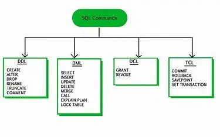



Bases de SQL




[Mon précédent MON sur les bases de SQL](https://francoisbrucker.github.io/do-it/promos/2024-2025/Lola-Perdrix/mon/temps-1.2/)



## Introduction

L'objectif de ce MON est de continuer le travail débuté pendant mon MON 1.2 sur les bases de SQL. Mon premier MON était plus axé sur la réalisation des requêtes et je me suis perfectionnée dessus, mais je souhaite maintenant pouvoir explorer toutes les autres fonctionnalités de SQL afin d'avoir une vue d'ensemble sur tout ce qu'il est possible de faire, pour comprendre un peu mieux cet outil si répandu lié aux bases de données relationnelles, et savoir que cela existe lorsque j'en aurais besoin (ce qui n'est pas impossible).

Ce MON me servira également de ressource lorsque je voudrais me rappeler de certaines notions, c'est pourquoi je lui donnerai la forme d'une grande liste représentant les actions possibles.

## Sources

Pour la majeure partie de ce MON, je me base sur le livre ***SQL : les fondamentaux du langage*** de Anne-Christine BISSON. Le livre est super clair, aborde des notions théoriques et pratiques avec de nombreux exemples, ainsi que des exercices et des corrigés (je recommende si on veut apprendre la même chose que moi). J'ai repris à peu près les grands chapitres du livre pour structurer mon MON, en mettant les pages correspondantes.

## Le modèle relationnel

J'ai pu revoir dans ce premier chapitre du livre les principes de base sur les modèles relationnels. C'est-à-dire les notions de domaines, de relations, ainsi que l'existence de certaines règles comme **l'unicité**, les **clés primaires** et **secondaires**, l'**intégrité référentielle**, la **contrainte d'identité**, etc.

J'ai aussi revu quelques bases de l'algèbre relationnelle, qui permet la manipulation des tables, et qui est d'ailleurs à l'origine de la conception de SQL. Elle utilise des opérateurs basés sur la théorie des ensembles qui sont princialement :

- L'union
- L'intersection
- La différence
- La division (on prend le complément à la 2e table)
- La restriction (répondu par un WHERE)
- La projection (répondu par un SELECT)
- Le produit cartésien
- La jointure : restriction sur le produit cartésien
- Calculs élémentaires et calculs d'aggrégats(fonctions statistiques qui requièrent plusieurs lignes)--> COUNT, SUM, AVG, MAX...

La suite du MON permet de voir comment sont effectuées ces opérations avec SQL.

## LDD : La définition des données

### Types de données (p29-37)

Déjà, 3 types de données principalement : numériques, alphanumériques, et temporelles.
Chaque SGDBR (système de gestion de bases de données relationnelles) peut décliner des types comme il veut pour les adapter à des problématiques de stockage ou de précision etc.

- **Données numériques :** Il y a les entiers (TINYINT, INT, BIT...), les nombres décimaux (DECIMAL, NUMERIC, NUMBER, MONEY...) ou les nombre à virgule flottante(FLOAT, REAL...). La précision et le stockage sont renseignés pour chaque SGBDR mais je passe cette partie. Il existe des propriétés qui complètent le type de données dans les attributs, par exemple : IDENTITY, AUTO_INCREMENT, ZEROFILL... Mais ça c'est pareil ça existe et varie selon les SGDBR.

- **Caractères :** Il y a CHAR ou VARCHAR si la longueur de la chaîne est variable. Aussi NCHAR ou NVARCHAR si contient des caractères spéciaux (chinois etc.). Idem on peut ajouter des propriétés comme ASCII, UNICODE, et autres.

- **Données temporelles :** DATE (format date), TIME (format heure), et TIMESTAMP (format date et heure) principalement. Idem, attention aux divergences entre SGDBR.

- **Autres :** Il peut exister certains autres types comme les données géographiques, spaciales, ou spécifiques comme les URLs.

### Créer, modifier, ou supprimer des objets (p37-77)

- **Créer une table :** `CREATE TABLE`
  - Syntaxe : `CREATE TABLE <nom table> (col_1  Type_1, col_2 Type_2, ...);`
  - On peut créer des tables temporaires (existe que dans une session)
  - On peut ajouter des commentaires sur le contenu des colonnes avec l'ordre `COMMENT`
  - On peut créer une table à partir d'une autre existante : `CREATE TABLE <table> AS SELECT...FROM...WHERE...` ou `CREATE ... LIKE`
  - `CREATE SYNONYM` permet de donner un autre nom à une table (fait une copie)
  - Pour créer un id unique on peut créer une séquence avec `CREATE SEQUENCE` ou ajouter l'option `AUTO_INCREMENT` avec le type de la colonne
- **Créer une vue :** `CREATE VIEW <nom vue> AS SELECT...`
  - La vue est une sorte de table "virtuelle" qui résulte d'une requête pour un besoin spécifique et répété. On peut réaliser nos requêtes directement sur les vues
  - N'est pas stocké sur un disque mais en mémoire, en permanence mis à jour
  - Permet de simplifier les bdd pour les usages métiers
  - Permet de cacher des informations par rapport à des problématiques de confidentialité
- **Modifier une table :** `ALTER`
  - Syntaxe : `ALTER TABLE <nom table> [liste des modifs]`
  - Ajouter colonne : `[ADD <nom col> <type col>]`
  - Supprimer une colonne : `[DROP COLUMN <nom col>]`
  - Ajouter des contraintes : `[ADD CONSTRAINT <nom contrainte>]`
  - Rennomer une table : `RENAME`
  - Modifier une propriété : `[MODIFY <nom col> <propriété>]`
  - Exemple : ajouter une valeur par défaut si pas renseigné dans la création `ALTER TABLE Chambres MODIFY Type DEFAULT 3`
- **Supprimer une table / une vue :** `DROP [TABLE / VIEW] <nom [table / vue]>`
  - Attention car suppression souvent définitive
- **Supprimer le contenu d'une table (la vider) :** `TRUNCATE TABLE <nom table>`

- **Notion d'index :** Il s'agit d'une implémentation physique qui permet d'accélérer les recherche sur une table (et ne pas la parcourir séquentiellement) de manière exponentielle, c'est donc quasiment indispensable. Chaque SGDBR l'implémente comme il le souhaite. Je n'ai pas souhaité rentrer dans le détails des différentes méthodes d'indexation, c'est un peu plus détaillé dans le [MON SQL Avancé](https://francoisbrucker.github.io/do-it/promos/2024-2025/Billa-Valentin/mon/temps-1.1/) de Valentin.
  
- **Contraintes d'intégrité des données :** Il est possible d'indiquer au système des contraintes pour permettre d'assurer a cohérence de la base de données
  - `DEFAULT` : une valeur à renseigner par défaut afin d'éviter les valeurs `NULL` (choix important)
  - `NOT NULL` : une colonne qui ne peut pas avoir de valeurs `NULL`
  - `UNIQUE` : une colonne qui doit être unique
  - `CHECK` : programme un contrôle automatique sur une colonne à chaque màj
  - `PRIMARY KEY` : le système vérifiera que les valeurs de la clé sont uniques (Passer par l'ordre `CONSTRAINT` si plusieurs colonnes)
  - Ces contraintes sont à déclarer après les types de colonnes lorsqu'on crée la table
  - `FOREIGN KEY` : associe la colonne à une table de référence (`CONSTRAINT <nom> FOREIGN KEY (colonne) REFERENCES <table secondaire>`)
  
## LMD : La manipulation des données

Souvent, on peut uniquement faire de la sélection de données, la modification, l'insertion, et la supression des données étant plutôt réservée aux administrateurs de la base. Cependant je tenais à explorer toutes ces notions qui peuvent servir.

### La sélection de données (p81-132)

La majorité de cette partie est constituée de notions que j'ai bien approfondies lors de mon MON 1.2. Je ne reviendrais donc pas sur ce qui a déjà été abordée et me pencherais sur les notions complémentaires.

- **Contrôler les lignes retournées par la requête :**
  - `TOP` (au début) ou `LIMIT` (à la fin) : ne sort que les premières lignes de la requête
  - `OFFSET` pour décaler les lignes qu'on récupère
  - `ROWNUM` avec Oracle par ex pour sélectionner des lignes en particulier

- **Les sous-requêtes** : Peuvent remplacer une variable si ne retourne qu'une ligne. Il existe aussi les **CTE** (common table expression) avec le mot clé `WITH` que j'ai pu voir dans mon premier MON.

- **Autres types de jointures :**
  - Jointure naturelle : le système choisit tout seul d'associer les colonnes du même nom (`NATURAL JOIN`)
  - Jointure croisée : le système réalise au plus simple un produit cartésien (`CROSS JOIN`)
  - On peut faire des jointures en utilisant uniquement un WHERE mais moins conseillé

- **Opérateurs ensemblistes :**
  - `UNION` pour faire l'union de deux tables (avec `ALL` si on veut aussi les doublons) -> nécessite les mêmes structures
  - `INERSECT` pour faire l'intersection (donc les lignes à la fois dans la table 1 et la table 2, en supprimant les doublons par défaut)
  - `EXCEPT` pour faire la différence : sélectionne les lignes de la table 1 qui ne sont pas dans la table 2

### Restreindre la sélection

- **Instruction de conditions :**
  - une espce de match de plusieurs possibilités : `CASE WHEN...THEN/WHEN...THEN/ELSE...END AS`
  - un if tel que l'on imagine : `IIF (<col> <condition> <valeur> <valeur si vrai> <valeur si faux)`

- Je passe la liste des opérateurs arithmétiques et de comparaison car il n'y a rien de particulier. Cependant les **opérateurs logiques** peuvent s'avérer intéressants :
  - `LIKE "__%"` : commence par __
  - `LIKE "%__"` : finit par __
  - `LIKE "%__%"` : contient __
  - `LIKE "_ _ s%"` : "s" en 3e positionµ
  - `BETWEEN` : entre 2 dates par exemple
  - `EXISTS` : test d'une sous-requête (sous-requête corrélée)
  - `IN` : suivi d'une liste d'éléments ou sous-requête (sous-requête imbriquée)
  - `SOME`
  - `ANY`
  - Tous ces opérateurs se retrouvent dans les clauses WHERE principalement

### Insérer, modifier ou supprimer (p140-169)

- **Insérer des données :** pour rajouter des lignes dans la table
  - Souvent ligne par ligne, en respectant l'ordre des colonnes (ou en indiquant les colonnes) : `INSERT INTO <table> VALUES (val1, val2, ...);`
  - Il est possible de récupérer des lignes d'une autre table en remplacant les `VALUES` par un `SELECT`

- **Supprimer des données :** `DELETE FROM <table>` pour tout supprimer, ou ajouter un `WHERE...` pour préciser quoi supprimer en particulier

- **Modifier des lignes :** `UPDATE <table> SET <col1> = <val1>, <col2 = val2>, ...` pour changer toute la colonne, ou ajouter un `WHERE...` pour sélectionner les lignes à modifier

- On peut **agir sur les données d'une table à partir d'une autre table** avec `MERGE INTO` en faisant des `WHEN MATCH THEN UPDATE SET...` mais je ne suis pas sûre que ce soit très utilisé

### Les fonctions (p171-209)

- **Les fonctions principales :** J'ai pu refaire un tour des fonctions basiques existantes dans SQL qui peuvent être pratiques pour faire des calculs qui arrangent. Par exemple pour les chaînes de caractères : les fonctions `CONCAT`, `LOWER`, `UPPER`, `TRIM` (pour supprimer les espaces), `INSTR`, `POSITION` ou `CHARINDEX` (pour trouver la position d'une sous-chaîne), `SUBSTR`, `ASCII`, `CONCAT`, etc. Les fonctions `CAST` ou `CONVERT` peuvent être utiles pour changer le type d'une colonne. Il existe de multiples fonctions propres à chaque système notamment pour les données de type temporelles, je ne vais pas tout énumérer.
- Il y a aussi **les fonctions de fenêtrage**, qui agissent selon les valeurs d'une "fenêtre". Il s'agit par exemple des fonctions `RANK`, `LAG` et `LEAD` (ligne préc. et ligne suiv.), `NVL` ou `ISNULL` (pour remplacer les valeurs nulles), `COALESCE`, etc. J'ai eu l'occasion de voir comment les utiliser de manière générale dans mon premier MON sur SQL.

## DCL : La sécurité des données

Cette partie qu'on retrouve à partir de la page 215 du livre permet d'étudier ce qui permet d'attribuer des droits aux utilisateurs sur les tables. C'est donc plutôt reservé aux administrateurs des tables.

### Pourquoi faire (p215)

Cela permet la gestion de différentes typologies d'utilisateurs au sein d'une entreprise dans laquelle on va retrouver une multitude d'usages métiers différents. Tous ne vont pas faire la même chose et chacun doit pouvoir faire son travail sans risquer de gêner celui des autres.

### Comment faire (p223-241)

En général on classe les utilisateurs par fonction et par métier puis on détermine quelle fonction a besoin de quelle table. De quels accès ont-ils besoin ? Peuvent-ils faire des mises à jour ou lire seulement ? Ce travail doit être fait par l'IT conjointement avec des référents métiers.

Ces infos sont regroupées elles-même dans des tables qui peuvent être mises à jour si besoin (départs / changements de poste...) et qui sont dédiées à les gestion des droits utilisateurs. **Essayer de metre la photo p216**.  On va pouvoir attribuer les droits correspondants aux utilisateurs après cette étude, et aussi créer des rôles pour regrouper des utilisateurs auxquels on va attribuer les mêmes droits.

Après il y a des commandes qui permettent de :

- **Créer un utiisateur** : `CREATE USER <user> IDENTIFIED BY <mdp>` (plus ou moins selon système)
- **Attribuer des droits** avec l'ordre `GRANT` :
  - Syntaxe : `GRANT [SELECT/UPDATE/DELETE/INSERT] ON TABLE <table> TO <user1>, <user2>,... (WITH GRANT OPTION)`
  - On peut spécifier des colonnes de la table
  - On peut désigner tous les users avec `PUBLIC`
  - On peut aussi GRANT sur des commandes du LLD (ex : `GRANT CREATE TABLE TO <user>`)
- **Supprimer des droits** avec l'ordre `REVOKE` :
  - Syntaxe : `REVOKE [SELECT/UPDATE/DELETE/INSERT] ON TABLE <table> FROM <user>`
  - Mêmes principes que pour GRANT
- **Interdire des actions** (SQL Server) avec `DENY`
- **Créer un rôle :** `CREATE ROLE <nom rôle>`
- **Attribuer un rôle :** `GRANT <rôle> TO <user>`
- **Supprimer un rôle :** `ALTER ROLE <nom rôle> DROP MEMBER <user>` ou si plus personne `DROP ROLE <nom rôle>`

## TCL : Le contrôle des transactions

Ce dernier chapitre du livre est un peu plus technique. Elle aborde la problématique des accès simultanés sur une base qui peuvent créer des conflits et comment s'en charger. C'est peut être une partie un peu moins intéressante mais tout de même à connaître dans les grandes lignes.

On a ce qu'on appelle des phénomènes de **lectures répétitives** ou de **lignes fantômes** lorsque les utilisateurs modifient en même temps les mêmes données. Pour éviter cela on a créé la notion de **transaction**, qui permet de borner le début et la fin d'une action dans la base.

**Maintenant comment éviter les incohérences ?** (p248-252)

- Lancer les transactions en séries (peut créer des temps d'attentes importants)
- Bloquer puis libérer les objets impliqués à chaque programme (pose problème si l'utilisateur oublie de valider ou prend son temps car bloque tout)
- Sauvegarder les données lues en mémoire puis relecture juste avant la validation pour vérifier si toujours les bonnes données, sinon refus de l'update
- Différents types de verrouillage : `READ UNCOMMITED`, `READ COMMITED`, `REPEATABLE READ`, et `SERIAZABLE` (du plus libre au plus restrictif, et don donc au plus sécurisant). Ensuite on peut paramétrer le niveau de verrouillage que l'on veut avec `SET SESSION TRASACTION ISOLATION LEVEL`
- Enfin on peut "réserver" une table le temps d'une opération pour empêcher la modification de lignes entre temps : `SELECT col FROM table FOR UPDATE`

J'avoue ne pas avoir tout compris à propos de ces techniques et de leur différences mais je ne suis pas sûre que ce soit très grave à ce niveau.

### Notion de validation des modifications (p258-260)

En SQL il existe aussi la **notion de "commit"** pour la validation de nos modifications, cela permet aussi de libérer les verrous qui ont pu être posés pour notre travail. Il s'agit simplement de l'ordre `COMMIT`.

Si on veut **revenir en arrière**, il existe l'ordre `ROLLBACK` qui invalide la modification et nous ramène au point de sauvegarde précédent.

On peut définir nous même nos **points de sauvegarde** pour pouvoir faire des retours en arrière, il suffit de définir un `SAVEPOINT <nom du savepoint>`.

## Faire des programmes avec SQL

Au delà de faire des requêtes, j'ai aussi vu la possibilité de faire du code avec SQL qui peut servir notamment à créer des **fonctions** et **procédures stockées** ou des déclencheurs qui peuvent faire gagner beaucoup de temps selon les usages. On les appelle avec les ordres `EXECUTE` ou `CALL`.

Il existe des langages de programmation dédiés comme **PL/SQL** ou **TransactSQL**.

J'ai pu explorer un petit peu les méthodes, qui consistent comme en programmation générale en définir des variables, rajouter des requêtes SQL stockées dans des curseurs que l'on peut parcourir avec des boucles, faire des opérations sur des valeurs retournées, et renvoyer des valeurs ou non. Il existe un tas de choses que l'on peut faire et que j'ai un peu parcourues sans rentrer dans le détail car ce n'est pas forcément ce qui était essentiel. Si besoin le [MON SQL Avancé](https://francoisbrucker.github.io/do-it/promos/2024-2025/Billa-Valentin/mon/temps-1.1/) de Valentin aborde un peu plus le sujet.

## Soucis de performance et conseils

Faire des requêtes sur des grandes tables de données peut très vite poser des soucis de performance et des temps d'attente importants. Il est important de savoir optimiser nos calculs, j'ai déjà un peu abordé le sujet dans mon premier MON. J'ai regroupé des informations éparpillées dans le livre que j'ai cru bon de rassembler ici.

- **Mieux comprendre ce avec quoi on travaille**
  - Obtenir la description du schéma d'une table : `DESC <nom table>`

- **Mieux écrire nos requêtes**
  - On peut faire des commentaires dans le code (`/* */` ou `#` ou encore `--`)
  - Vérifier les syntaxes précises dans les clauses WHERE (source d'erreur fréquente)
  - Limiter les jointures

- **Optimiser une requête**
  - Évaluer d'abord la taille de nos requêtes avec COUNT(*) en premier lieu par exemple
  - Privilégier l'utilisation des colonnes indexées
  - Utiliser la commande `EXPLAIN` ou `EXPLAIN PLAN` pour analyser comment le système parvient à réaliser ce qu'on lui demande (cf [MON de Valentin](https://francoisbrucker.github.io/do-it/promos/2024-2025/Billa-Valentin/mon/temps-1.1/))

## Résumé

***Photo : [StackLima.com](https://stacklima.com/sql-ddl-dml-tcl-et-dcl/)***

A la fin du livre on retrouve également le résumé de toutes les syntaxes essentielles.

## Bonus : notions de NoSQL

Après avoir autant été plongée dans l'univers de SQL, j'ai souhaité regarder un petit peu du côté de NoSQL sur mon temps restant pour compléter ces connaissances et prendre du recul (parce qu'il ne faudrait pas que je me dise que SQL règne de partout).

J'ai regardé sur le site d'[Oracle](https://www.oracle.com/fr/database/nosql/what-is-nosql/) quelques défintions et explications.

Le NoSQL sert donc à traiter les bases de données non relationnelles, sur lesquelles on peut quand même faire des requêtes classiques, c'est pourquoi on les appelle les bases "pas seulement SQL". Il a été conçu dans l'objectif de pouvoir s'adapter aux évolutions applicatives et pour faire des requêtes efficaces sur un grand volume.

De ce que j'ai compris :

| Avantages | Inconvénients |
| --------- | ------------- |
| Évolutivité élevée et rapide, s'adapte facilement | Données pas (souvent) normalisées, donc pas terrible pour des secteurs comme la finance ou la comptabilité |
| Haute disponibilité, et haute performance | Bien pour des requêtes simples sur de gros volumes mais se complexifie rapidement si plusieurs tables et requête plus fine |
| Schémas flexibles, stockage non structuré | Syntaxe différente d'une base à l'autre |

Le NoSQL serait donc largement utilisé pour les applications en temps réél, les grands volumes de données. Il exise 4 types de base NoSQL, cela vaudrait le coup de se pencher un peu plus dessus. Enfin, on peut aussi maintenant avoir des modèles "hybrides" en combinant les bases de données relationnelles et non-relationnelles dans une même entreprise.

## Conclusion

Ce MON m'a vraiment permis de **balayer tous l'univers de SQL**. Je ne suis jamais rentrée dans le détail de chacune de ces notions, c'est pourquoi il y en a beaucoup, mais ce n'était pas le but car je ne suis pas sûre que cela aurait été utile. J'ai désormais une bonne connaissance d'ensemble sur le sujet et je suis globalement très satisfaite de ce MON.

**Reste à faire :** S'entraîner sur ces notions en les pratiquant et en les mettant en oeuvre dans un des systèmes de gestion, sans oublier de regarder un peu du côté du fonctionnement un peu plus poussé du NoSQL.

D'un point de vue plus technique par rapport à la rédaction du MON, j'aurais du prendre mes notes directement sur mon ordinateur... cela m'aurait épargné un peu de temps de resaisie (je n'ai pas compté le temps de rédaction dans le MON).

## Bibliographie

- Le livre ***SQL : les fondamentaux du langage*** de Anne-Christine BISSON
- L'article [What is NoSQL](https://www.oracle.com/fr/database/nosql/what-is-nosql/) sur le site d'Oracle.
