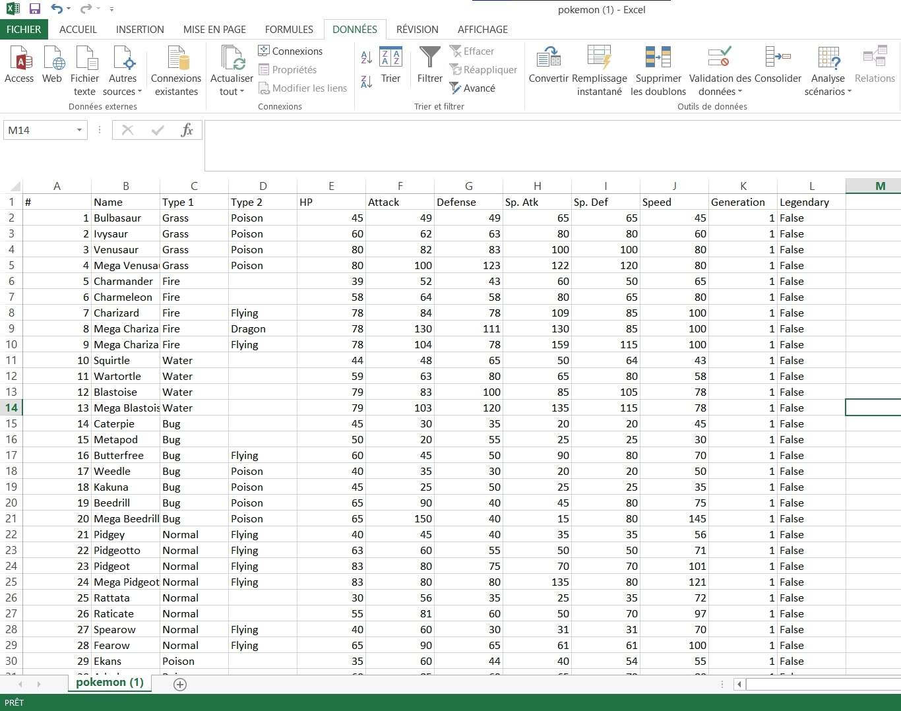
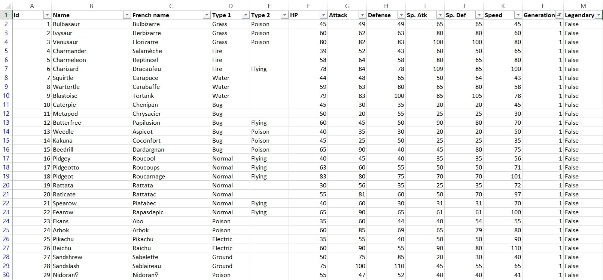
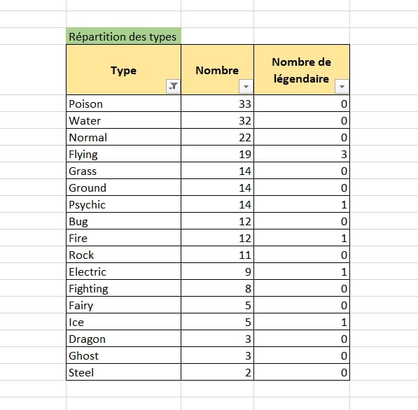
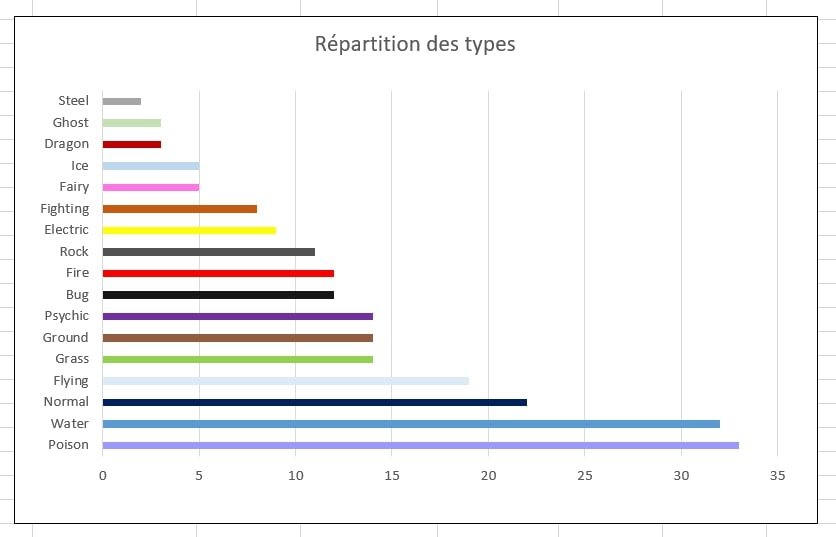
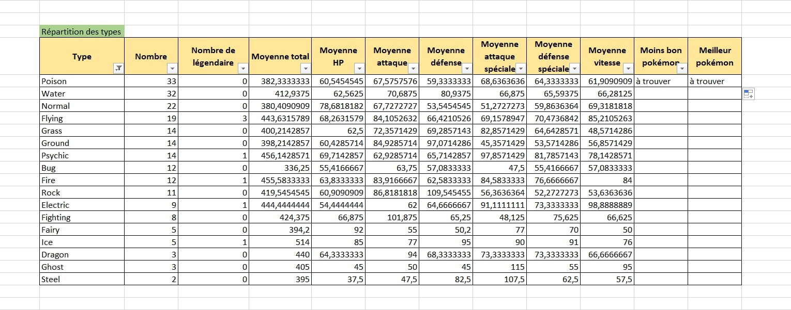
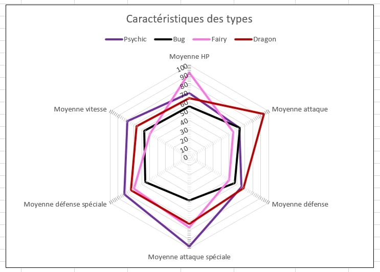
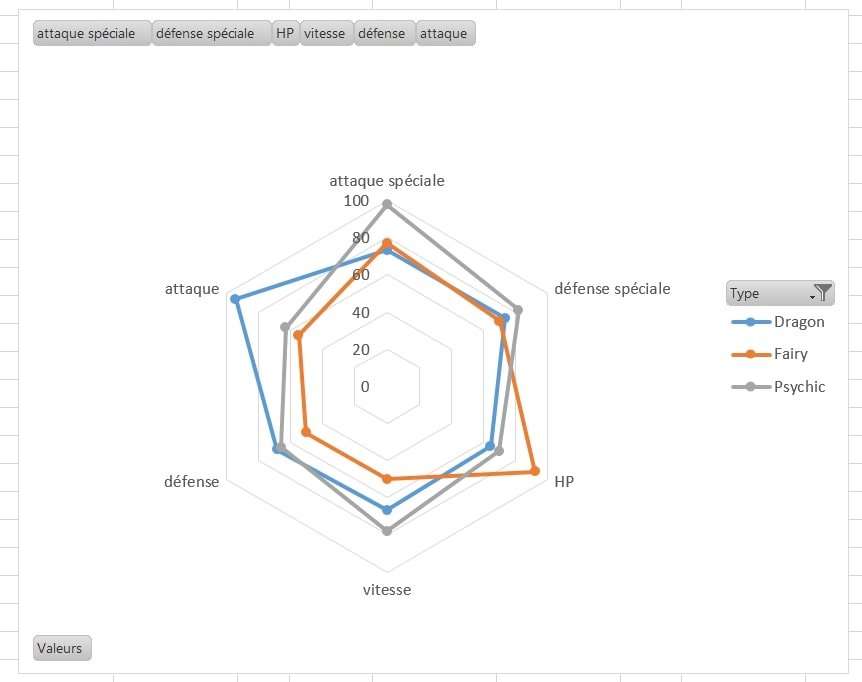
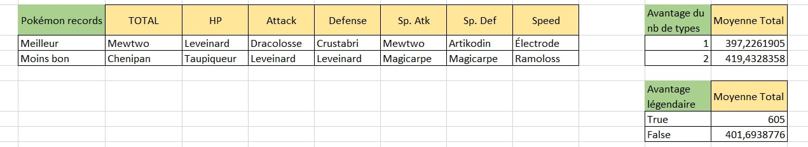



Prérequis : Quelques bases d'Excel





[Maîtrisez les fondamentaux d'Excel](https://openclassrooms.com/fr/courses/7168336-maitrisez-les-fondamentaux-dexcel)



## Objectifs

L'objectif est de prendre en main les outils mis à disposition par Excel pour étudier une base de données et faire de la data visualisation. Pour cela je souhaite étudier des jeux de données sur les caractéristiques des différents Pokemon afin d'aboutir in fine à un dashboard clair et bien réalisé permettant de tout savoir sur les Pokemon et mettre en lumière les différentes tendances.

## Tâches

### Sprint 1

- [x] Téléchargement et import de mon data set dans Excel (estimé 10 min, réalisé 10 min)
- [x] Recherche documentaire sur les fonctionnalités d'Excel qui vont m'être utiles, choix des sources, Apprentissage théorique (estimé 2h, réalisé 1h30)
- [x] Mise en forme et nettoyage des données (estimé 1h, réalisation 4h30)
- [x] Définition de problématiques / questions cibles (estimé 30 min, réalisation 15min)
- [x] Analyse pour la première génération, réponse à chaque problématique (estimé 4h, réalisation 2h30)
- [ ] Visualisation des résultats en comparant les différents outils (estimé 2h30, pas réalisé)

### Sprint 2

- [ ] Apprentissage VBA
- [ ] Macros répétant l'analyse pour les autres générations
- [ ] Réaliser le rapport final
- [ ] Étudier des techniques avancées pour embellir le tout
- [ ] Tester d'autres dataset en étudiant l'adaptabilité
- [ ] Comparer avec d'autres logiciels

à réajuster à la fin du 1er sprint

### Horodatage

Toutes les séances et le nombre d'heure que l'on y a passé.

| Date | Heures passées | Indications |
| -------- | -------- |-------- |
| Jeudi 12/09 matin | 15 min  | Téléchargement des datasets |
| Jeudi 12/09 aprem | 1h30 | Import dataset, OpenClassroom, exploration des fonctions directement via excel |
| | 3h30 | Préparation du dataset |
| Vendredi 13/09 aprem | 1h | Fin de la préparation du Dataset |
| Dimanche 15/09 aprem | 15 min | Réfléchir aux questions cibles|
| Lundi 16/09 aprem | 3h30 | Analyse des données |

## Premier Sprint

### Téléchargement du dataset

J'ai commencé par téléchager mon dataset sur [Kaggle](https://www.kaggle.com/datasets?search=pokemon), qui est une plateforme dédiée à la Data Science et mettant à disposition de nombreux datasets pour apprendre (gratuit).

J'ai choisi deux datasets pour l'instant à étudier, en me basant sur les informations renseignées : liste exhaustive des Pokémons, types, attributs de combat...



- [pokemon.csv](https://www.kaggle.com/code/jonathanbouchet/pokemon-battles/input?select=pokemon.csv)
- [combats.csv](https://www.kaggle.com/code/jonathanbouchet/pokemon-battles/input?select=combats.csv)



### Import du dataset dans Excel

J'ai utilisé la fonction "Convertir" de Excel pour mettre en forme les données brutes de mon fichier csv :

| Avant | Après |
|-------|-------|
|  |  |

***Je répète l'opération pour les autres datasets au format csv.***

### Recherche de sources et apprentissage "théorique"

Lors de mon dernier stage, j'avais pris l'intiative de me former sur les bases d'Excel en suivant la formation d'Open Classrooms [Maîtriser les fondamentaux d'Excel](https://openclassrooms.com/fr/courses/7168336-maitrisez-les-fondamentaux-dexcel), que j'ai alors relue rapidement pour me rafraîchir la mémoire. Je me suis ensuite surtout basée sur la formation suivante [Perfectionnez-vous sur Excel](https://openclassrooms.com/fr/courses/7139456-perfectionnez-vous-sur-excel) en passant plus vite sur quelques points qui n'étaient pas utiles à mon POK, ou qui le seront pour le prochain sprint.

Ensuite, j'ai eu la bonne (ou mauvaise) idée d'étudier la liste des fonctions directement sur Excel, parcourant les différents types de fonctions, leurs variables, leur résultat, pour avoir une meilleure idée finalement de ce qui est à ma disposition (car on ne sait jamais vraiment tout ce qui existe).

Puis je n'ai pas voulu perdre trop de temps avec cette partie car j'ai pensé que le meilleur moyen d'apprendre était de commencer à travailler sur mon fichier directement.



Remarque : J'aurais effectivement du passer à cette étape tout de suite car cela s'est révélé plus efficace et m'aurait fait gagner du temps...



### Préparation du dataset

Je pensais que le dataset que j'avais choisi serait facile à préparer car il m'avait l'air très bien structuré. Finalement, il s'est révélé être un excellent exemple pour m'apprendre à nettoyer / structurer / préparer mes données avec Excel !

Voici les problèmes principaux auxquels j'ai du faire face lors de la préparation des données :

- **Problème n°1 : les méga évolutions**

Dans un objectif de pouvoir associer les pokémons à leur numéro d'identification unique du pokédex (ce qui n'était pas le cas dans le dataset importé, les pokémons étant dans l'ordre mais les nombres ne correspondant pas forcément à leur numéro de pokédex), j'ai tout d'abord compris qu'il fallait que j'enlève les lignes correspondant à des méga évolutions.

Pour cela, j'ai utilisé la formule :

`=ESTNUM(CHERCHE("Méga ";B2))`

qui me dit alors si oui ou non le nom de mon pokémon contient "Méga ", il ne me reste alors plus qu'à supprimer toutes les lignes où c'est le cas.



Attention à ne pas oublier l'espace après "Méga", sinon de pauvres pokémon comme Méganium et Yanméga se retrouvent supprimmés et on met du temps à s'en rendre compte et à revenir en arrière...



- **Problème n°2 : La pluricité des formes**

Certains pokémons possèdent plusieurs formes alternatives ou des formes régionales, qui apparaissent malheureusement dans mon dataset. Par exemple : Ratata d'Alola, Kyurem Dark, Kyurem White,...

Pour les enlever, j'ai utilisé les formules :

  `=SIERREUR(GAUCHE(B2;TROUVE(" ";B2;1));B2)` + `SUPPRESPACE(B2)` pour récupérer le premier mot de la cellule, puis je supprime les doublons.

Même problème à droite : Heat Rotom, Wash Rotom, Frost Rotom...

`=SIERREUR(DROITE(B2;NBCAR(B2)-TROUVE(" ";B2;1));B2)` + `SUPPRESPACE(B2)`

Mais je me suis rendue comtpe que certains pokémons pouvaient avoir le même dernier mot et ne pas être le même pour autant... Je ne pouvais également pas prédire des cellules vides ? ainsi que des pokémons dont le nom était au milieu de mots, bref, ne voulant pas éterniser mon POK sur cette partie difficile, j'ai décidé de finaliser la structure de la colonne "nom" à la main en modifiant directement les cellules posant problème (il n'en restait plus beaucoup), jusqu'à ce que j'en ai le bon nombre et qu'ils correspondent tous bien à leur numéro de pokédex.

- **Problème n°3 : et si je veux les noms des Pokémons en français ?**

Je voulais avoir les noms en français car ils me sont plus familiers et je me suis dit que c'était l'occasion d'apprendre à faire une jointure de tables.

J'ai du faire un copier-coller de [cette page internet](https://www.pokepedia.fr/Liste_des_Pok%C3%A9mon_dans_l%27ordre_du_Pok%C3%A9dex_National)  à défaut de trouver un dataset en français, puis ai utilisé la fonction `RECHERCHEV` pour faire correspondre les noms anglais avec les noms français dans mon tableau principal.

`=RECHERCHEV("B2";'fr-en'!A:B:;2;FAUX)`

#### Dataset prêt pour l'analyse



J'ai largement sous-estimé le temps que nécessiterait la préparation du dataset car le texte était plutôt mal formaté et je découvrais toujours une nouvelle source d'erreur, qui n'était pass toujours évidente à régler quand c'est la première fois qu'on essaie...



### Choix des questions cibles

- [x] Quelle est la répartition des types ?
- [x] Quelle part de pokémon légendaire ?
- [x] Est-ce que chaque type présente des forces et des faiblesses caractéristiques ?
- [x] Est-ce que les pokémons légendaires sont forcément plus forts ?
- [x] Est-ce un avantage de posséder deux types plutôt qu'un seul ?
- [x] Quels pokémons détiennent les records pour chaque atribut ?
- [ ] Quels sont les pokémons les moins bons et les meilleurs par type ? => à faire
- [ ] Peut-on faire une table des types à partir des combats => à faire si temps
- [ ] Les attributs de combat sont-ils bien répartis ? (distributions) => à faire si temps

Ainsi que l'évolution des réponses à ces questions au fil des générations : ces tendances évoluent-elles ? => Deuxième sprint.

### Analyse du dataset

- **Répartition des types**

J'ai utilisé la formule :

`= NB.SI($D$2:$E$152;C157)` avec la liste des types dans la colonne C, le type 1 en colonne D, et le type 2 en colonne E.

Ce qui donne visuellement :

graphe dans lequel je souhaite intégrer encore la proportion de légendaires ainsi que la proportion de pokémon à un seul type.

- **Caractéristiques par type**

J'ai calculé pour chaque type la moyenne de chaque attribut de combat avec la formule :

`=(SOMME.SI($D$2:$D$152;$C172;F$2:F$152)+SOMME.SI($E$2:$E$152;$C172;F$2:F$152))/$D172`

qui je l'admets n'est pas très compréhensible telle quelle, mais je peux faire néanmoins la remarque que le bon positionnement des dollars dans ma formule m'a permis de l'étirer dans tous les sens pour remplir ce tableau :

Ce qui peut donner visuellement ceci bien que je me concentrerai sur la visualisation au prochain sprint :

| Tous les types ensemble | Filtrage dans la source de données | Graphique dynamique |
|:-------:|:-------:|:--------:|
|  |  |  |

-**Est-ce que les pokémons légendaires sont forcément les plus forts ?**

Grâce à des méthodes semblables, je mets une condition sur l'attribut légendaire, et je calcule la moyenne de la statistique totale pour la comparer avec celle des non-légendaires.

- **Est-ce un avantage de posséder deux types plutôt qu'un seul ?**

Je compte le nombre de types, et je calcule la moyenne de la statistique totale pour les pokémons avec 1 type et pour 2 types.

- **Les pokémons détenant les records (qui a la meilleure attaque, qui est le plus rapide, etc.)**

Pour cette question j'utilise les fonctions `INDEX`, `EQUIV`, `MIN` et `MAX` combinées, sur chaque attribut.

`=INDEX(Mes_Pokémons;EQUIV(MIN(F1:F152);F1:F152;0);3)`
`=INDEX(Mes_Pokémons;EQUIV(MAX(F1:F152);F1:F152;0);3)`

et j'ai finalement regroupé ces résultats dans ces tableaux.



Je n'ai pas vraiment eu le temps que je souhaitais pour finir et optimiser l'analyse des données et il me reste encore des manipulations à faire avant de passer aux autres générations. L'estimation de la durée des tâches a été le principal souci sur ce premier sprint.



## Second Sprint

### Ajustement

- [ ] ***Fin de l'analyse***
- [ ] ~~Apprentissage VBA~~ -> en même temps que la réalisation
- [ ] Faire une macro répétant l'analyse pour chaque autre génération
- [ ] Réaliser le rapport final avec toutes les données réunies
- [ ] ***si temps : ajoutez les statistiques laissées pour non prioritaire***
- [ ] ~~Étudier des techniques avancées pour embellir le tout~~
- [ ] ~~Tester d'autres dataset en étudiant l'adaptabilité~~ -> J'aurais assez de quoi m'occuper...
- [ ] ~~Comparer avec d'autres logiciels~~ -> idem
