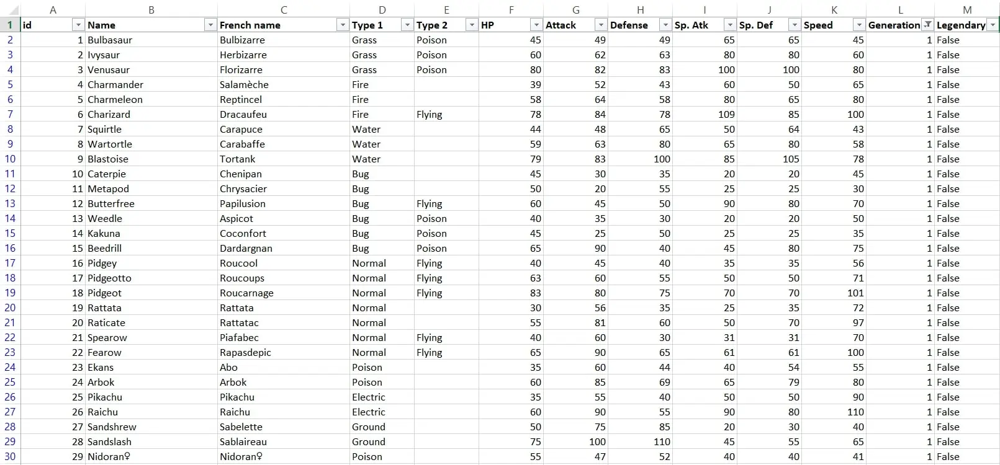



Prérequis : Quelques bases d'Excel





- MON de Lola Bourdon : [Excel - repartir sur de bonnes bases](https://francoisbrucker.github.io/do-it/promos/2023-2024/Lola-Bourdon/mon/temps-1.2/)
- OpenClassrooms : [Maîtrisez les fondamentaux d'Excel](https://openclassrooms.com/fr/courses/7168336-maitrisez-les-fondamentaux-dexcel)



## Objectif

L'objectif est de prendre en main les outils mis à disposition par Excel pour étudier une base de données, de sa structuration à sa visualisation. Pour cela, je souhaite réaliser une étude statistique complète à partir de datasets sur les Pokémons, l'objectif final étant de produire un rapport descriptif complet sous Excel en utilisant au maximum les outils Excel disponibles.

## Tâches

### Sprint 1

- [x] Téléchargement et import de mon dataset dans Excel (estimé 10min, réalisé 10min)
- [x] Recherche documentaire sur les fonctionnalités d'Excel qui vont m'être utiles, choix des sources, apprentissage théorique (estimé 2h, réalisé 1h30)
- [x] Mise en forme et nettoyage des données (estimé 1h, réalisation 4h30)
- [x] Définition de problématiques / questions cibles (estimé 30min, réalisation 15min)
- [x] Analyse de la première génération, réponse à chaque question définie (estimé 4h, réalisation 2h30)
- [ ] Visualisation des résultats en comparant les différents outils (estimé 2h30, pas réalisé)

### Sprint 2

- [ ] Apprentissage VBA
- [ ] Macro répétant l'analyse pour les autres générations
- [ ] Réaliser le rapport final
- [ ] Étudier des techniques avancées pour embellir le tout
- [ ] Tester d'autres datasets en étudiant l'adaptabilité
- [ ] Comparer avec d'autres logiciels

à réajuster à la fin du 1er sprint

### Horodatage

| Date | Heures passées | Indications |
| -------- | -------- |-------- |
| Jeudi 12/09 matin | 15 min  | Téléchargement des datasets |
| Jeudi 12/09 aprem | 1h30 | Import des datasets, OpenClassroom, exploration des fonctions Excel |
| | 3h30 | Préparation du dataset |
| Vendredi 13/09 aprem | 1h | Fin de la préparation du dataset |
| Dimanche 15/09 aprem | 15 min | Définition des questions cibles |
| Lundi 16/09 aprem | 3h30 | Analyse des données |

## Premier Sprint

### Téléchargement des datasets

J'ai commencé par téléchager mes datasets sur [Kaggle](https://www.kaggle.com/datasets?search=pokemon), qui est une plateforme dédiée à la Data Science et mettant à disposition de nombreux datasets pour apprendre (gratuit).

J'ai choisi deux datasets à étudier pour l'instant, en me basant sur les informations fournies par celles-ci : liste exhaustive des Pokémons, types, attributs de combat...



- [pokemon.csv](https://www.kaggle.com/code/jonathanbouchet/pokemon-battles/input?select=pokemon.csv)
- [combats.csv](https://www.kaggle.com/code/jonathanbouchet/pokemon-battles/input?select=combats.csv)



### Import du dataset dans Excel

J'ai utilisé la fonction "Convertir" de Excel pour mettre en forme les données brutes de mon fichier csv :

| Avant | Après |
|-------|-------|
|  |  |

***Je répète l'opération pour les autres datasets au format csv.***

### Recherche de sources et apprentissage "théorique"

Lors de mon dernier stage, j'avais pris l'intiative de me former sur les bases d'Excel en suivant la formation d'Open Classrooms [Maîtriser les fondamentaux d'Excel](https://openclassrooms.com/fr/courses/7168336-maitrisez-les-fondamentaux-dexcel), que j'ai alors relue rapidement pour me rafraîchir la mémoire. Je me suis ensuite surtout basée sur la formation suivante [Perfectionnez-vous sur Excel](https://openclassrooms.com/fr/courses/7139456-perfectionnez-vous-sur-excel) en passant plus vite sur quelques points qui n'étaient pas utiles à mon POK, ou qui le seront pour le prochain sprint.

Ensuite, j'ai eu la bonne (ou mauvaise) idée d'étudier la liste des fonctions directement sur Excel, parcourant les différents types de fonctions, leurs variables, leur résultat, pour avoir une meilleure idée finalement de ce qui est à ma disposition (car on ne sait jamais vraiment tout ce qui existe).

Puis je n'ai pas voulu perdre trop de temps avec cette partie car j'ai pensé que le meilleur moyen d'apprendre était de commencer à travailler sur mon fichier directement.



Remarque : J'aurais effectivement du passer à cette étape plus rapidement car cela s'est révélé plus efficace et m'aurait fait gagner du temps...



### Préparation du dataset

Je pensais que le dataset que j'avais choisi serait facile à préparer car il m'avait l'air déjà bien structuré. Finalement, il s'est révélé être un excellent exemple pour m'apprendre à nettoyer / structurer / préparer mes données avec Excel !

Voici les problèmes principaux auxquels j'ai du faire face lors de la préparation des données :

- **Problème n°1 : les méga évolutions**

Dans un objectif de pouvoir associer les pokémon à leur numéro d'identification unique du pokédex (ce qui n'était pas le cas dans le dataset importé, les pokémon étant dans l'ordre mais les nombres ne correspondant pas forcément à leur numéro de pokédex), j'ai remarqué premièrement qu'il fallait que j'enlève les lignes correspondant à des méga évolutions.

Pour cela, j'ai utilisé la formule :

`=ESTNUM(CHERCHE("Méga ";B2))`

qui me dit alors si oui ou non le nom de mon pokémon contient "Méga ", il ne me reste alors plus qu'à supprimer toutes les lignes où c'est le cas.



Attention à ne pas oublier l'espace après "Méga", sinon de pauvres pokémon comme Méganium et Yanméga se retrouvent supprimmés et on met du temps à s'en rendre compte et à revenir en arrière...



- **Problème n°2 : La pluricité des formes**

Certains pokémon possèdent plusieurs formes alternatives ou des formes régionales, qui apparaissent dans mon dataset contre ma volonté. Par exemple : Ratata d'Alola, Kyurem Dark, Kyurem White,...

Pour les enlever, j'ai utilisé les formules :

  `=SIERREUR(GAUCHE(B2;TROUVE(" ";B2;1));B2)` + `SUPPRESPACE(B2)`
  
pour récupérer le premier mot de la cellule, puis je supprime les doublons.

Même problème à droite : Heat Rotom, Wash Rotom, Frost Rotom...

`=SIERREUR(DROITE(B2;NBCAR(B2)-TROUVE(" ";B2;1));B2)` + `SUPPRESPACE(B2)`

Mais je me suis rendue comtpe que certains pokémon pouvaient avoir le même dernier mot dans son nom et ne pas être le même pokémon pour autant... Je ne pouvais également pas prédire les cellules restées vides, ainsi que des pokémon dont le nom était au milieu d'autres mots, bref, ne voulant pas éterniser mon POK sur cette partie difficile, j'ai décidé de finaliser la structure de la colonne "name" à la main en modifiant directement les cellules posant problème (il n'en restait plus beaucoup), jusqu'à ce que j'en ai le bon nombre et qu'ils correspondent tous bien à leur numéro de pokédex.

- **Problème n°3 : et si je veux les noms des Pokémons en français ?**

Je voulais pouvoir avoir les noms en français car ils me sont plus familiers et je me suis dit que c'était l'occasion d'apprendre à faire une jointure de tables.

J'ai dû faire un copier-coller de [cette page internet](https://www.pokepedia.fr/Liste_des_Pok%C3%A9mon_dans_l%27ordre_du_Pok%C3%A9dex_National)  à défaut de trouver un dataset en français, puis ai utilisé la fonction `RECHERCHEV` pour faire correspondre les noms anglais avec les noms français dans mon tableau principal.

`=RECHERCHEV("B2";'fr-en'!A:B:;2;FAUX)`

#### Dataset prêt pour l'analyse





Remarque : J'ai largement sous-estimé le temps que nécessiterait la préparation du dataset car le texte était plutôt mal formaté et je découvrais toujours une nouvelle source d'erreur, qui n'était pas toujours évidente à régler lors du premier essai...



### Choix des questions cibles

- [x] Quelle est la répartition des types ?
- [x] Quelle part de pokémon légendaire ?
- [x] Est-ce que chaque type présente des forces et des faiblesses caractéristiques ?
- [x] Est-ce que les pokémon légendaires sont forcément plus forts ?
- [x] Est-ce un avantage de posséder deux types plutôt qu'un seul ?
- [x] Quels pokémon détiennent les records pour chaque attribut ?
- [ ] Quels sont les pokémon les moins bons et les meilleurs par type ? => à faire
- [ ] Faire une table des types à partir des combats => à faire si temps
- [ ] Les attributs de combat sont-ils bien répartis ? (distributions) => à faire si temps

Ainsi que l'évolution des réponses à ces questions au fil des générations : ces tendances évoluent-elles ? => Deuxième sprint.

### Analyse du dataset

- **Répartition des types**

J'ai utilisé la formule :

`= NB.SI($D$2:$E$152;C157)`

avec la liste des types dans la colonne C, le type 1 en colonne D, et le type 2 en colonne E.


Ce qui donne visuellement :


graphe dans lequel je souhaite intégrer encore la proportion de légendaires ainsi que la proportion de pokémon à un seul type.

- **Caractéristiques par type**

J'ai calculé pour chaque type la moyenne de chaque attribut de combat avec la formule :

`=(SOMME.SI($D$2:$D$152;$C172;F$2:F$152)+SOMME.SI($E$2:$E$152;$C172;F$2:F$152))/$D172`

qui je l'admets n'est pas très compréhensible telle quelle, mais je peux faire néanmoins la remarque que le bon positionnement des dollars dans ma formule m'a permis de l'étirer dans tous les sens pour remplir ce tableau avec seulement celle-ci :


Ce qui peut donner visuellement ceci bien que je me concentrerai sur la visualisation au prochain sprint :

| Tous les types ensemble | Filtrage dans la source de données | Graphique dynamique avec filtre associé |
|:-------:|:-------:|:--------:|
|  |  |  |

- **Est-ce que les pokémon légendaires sont forcément les plus forts ?**

Grâce à des méthodes semblables, je mets une condition sur l'attribut légendaire, et je calcule la moyenne de la statistique totale pour la comparer avec celle des non-légendaires.

- **Est-ce un avantage de posséder deux types plutôt qu'un seul ?**

Je compte le nombre de types, et je calcule la moyenne de la statistique totale pour les pokémon avec 1 type et pour 2 types.

- **Les pokémon détenant les records**

Pour cette question j'utilise les fonctions `INDEX`, `EQUIV`, `MIN` et `MAX` combinées, sur chaque attribut.

`=INDEX(Mes_Pokémons;EQUIV(MIN(F1:F152);F1:F152;0);3)`
`=INDEX(Mes_Pokémons;EQUIV(MAX(F1:F152);F1:F152;0);3)`

et j'ai finalement regroupé ces résultats dans ces tableaux.




Remarque : Je n'ai pas vraiment eu le temps que je souhaitais pour optimiser et finir l'analyse des données et il me reste encore des manipulations à faire avant de passer aux autres générations. L'estimation de la durée des tâches a été le principal souci sur ce premier sprint.



### Retour Sprint 1

Le principal défi de ce premier sprint a été l'estimation de la durée des tâches à effectuer : alors que l'analyse était peut-être faisable plus rapidement, la préparation du dataset m'a pris beaucoup plus de temps que prévu et me retarde sur le prochain sprint que j'ai dû réajuster. De plus, lorsque l'on apprend en tatônnant face aux problèmes rencontrés, la vitesse de résolution est étonnament très variable car on peut passer à côté de réponses évidentes en voulant faire trop complexe...

## Second Sprint

### Ajustement

- [x] ***Fin de l'analyse***
- [x] ~~Apprentissage VBA~~ -> en même temps que la réalisation
- [x] Faire une macro répétant l'analyse pour chaque autre génération
- [ ] Réaliser le rapport final avec toutes les données réunies
- [ ] ***si temps : ajoutez les statistiques laissées pour non prioritaire***
- [ ] ~~Étudier des techniques avancées pour embellir le tout~~
- [ ] ~~Tester d'autres dataset en étudiant l'adaptabilité~~ -> J'aurais assez de quoi m'occuper...
- [ ] ~~Comparer avec d'autres logiciels~~ -> idem

### Horodatage Sprint 2

| Date | Heures passées | Indications |
| -------- | -------- |-------- |
| Mercredi 25/09 matin | 30 min  | Fin de l'analyse (abandon d'une question) |
| Jeudi 26/09 matin | 1h | Inititation VBA |
| Jeudi 26/09 aprem | 3h30 | Tests non concluants |
| Vendredi 27/09 aprem | 2h | Calcul du tableau par type |
| Samedi 28/09 aprem | 1h30 | Quelques fonctions par ci par là |
| Dimanche 29/09 aprem | 1h30 | Réunion de toutes les fonctions |

### Fin de l'analyse

Au début du sprint, j'ai pris le temps de me repencher sur l'analyse que je n'avais pas terminée complètement pour l'affiner avant de passer à la suite.

J'ai uniquement eu le temps de rajouter les meilleurs et les pires pokémon par type dans mon tableau, à l'aide d'une formule plutôt complexe (peut être aurai-je pu faire plus simple ?) que voici :

`=INDEX(Mes_Pokemons,EQUIV(MIN(SIERREUR(AGREGAT(15,6,1/((R & nb_lignes & C4=RC[-10]))*R2C6:R & nb_lignes & C6,1),1000),IFERROR(AGGREGATE(15,6,1/((R2C5:R & nb_lignes & C5=RC[-10]))*R2C6:R & nb_lignes & C6,1),1000)),R2C6:R & nb_lignes & C6*((R2C5:R & nb_lignes & C5=RC[-10])+(R2C4:R & nb_lignes & C4=RC[-10])),0)+1,3)`



A noter que si la formule dans la cellule contient des conditions matricielles (ce qui était le cas ici pour inclure un filtre avancé), il faut valider en appuyant sur les touches `CTRL + Maj + Entrée` pour ne pas avoir d'erreur `VALEUR?` qui s'affiche (j'aurais aimé trouver cette information plus tôt...).



Ce qui donne ceci pour la génération 1 :


### Macro VBA

Mon idée ici était d'apprendre à coder en VBA tout en créant une automatisation de mon analyse pour chaque génération de pokémon souhaitée.

J'ai conscience que dans mon cas d'étude, ce n'était pas forcément utile car un simple copier-coller des formules aurait rapidement fait l'affaire, mais j'ai appris à travers ce travail les bases du langages et me suis familiarisée avec certaines manipulations donc je pense que ce fut quand même très utile !

#### Automatisation 1 : Création d'une nouvelle page pour la génération voulue

La premire étape du parcours utilisateur que je me suis imaginé serait de pouvoir choisir un numéro de génération en lançant la macro (depuis n'importe quelle page), et que cela me renvoie sur une nouvelle page située à la fin des autres pages contenant la liste des pokémon filtrée sur la génération demandée.

Pour cela j'ai utilisé la fonction AdvancedFilter de Excel.



```vb
  Sub FeuillesParGen()
  
    'Je récupère le numéro de la génération que je veux
    Dim gen As Integer
    gen = Application.InputBox(prompt:="Enter a generation number", Type:=1)
    
    Dim name As String
    name = "Gen" & gen
    
    'Je supprimme l'ancienne feuille SI elle existe
    Application.DisplayAlerts = False
    On Error Resume Next
    Worksheets(name).Delete
    Err.Clear
    
    'J'ajoute la nouvelle
    Application.DisplayAlerts = True
    Sheets.Add(After:=Sheets(Sheets.Count)).name = name
    
    'Je copie dessus mon tableau de pokémon filtré sur la gen en question
    Worksheets("pokemon_formaté").Range("P2").Value = gen
    Worksheets("pokemon_formaté").Range("A:N").AdvancedFilter _
        Action:=xlFilterCopy, CriteriaRange:=Worksheets("pokemon_formaté").Range("P1:P2"), CopyToRange:=ActiveSheet.Range("A1"), Unique:=False
            
End Sub
```



| Input côté utilisateur | Résultat sur une autre feuille |
|:-----:|:--------:|
| | |

#### Automatisation 2 : Ajout de la colonne "NB type"

J'ai voulu ici rajouter une colonne à mon dataset qui contiendrait le nombre de types que chaque pokémon possède. Pour cette fonction j'ai testé la méthode de l'enregistrement de la macro : on démarre l'enregistrement, on effectue les opérations que l'on souhaite directement sur le classeur, puis on l'arrête et tout s'est transcrit en code automatiquement.

J'ai ensuite remanié légérement le code pour le rendre plus lisible et pour l'adapter à toutes mes générations qui ne font pas la même longueur.



```vb
  Sub affiche_nb_type(nb_lignes As Integer)
    
    Range("O1").FormulaR1C1 = "NB type"
    Range("O2").Select
    Selection.FormulaR1C1 = "=IF(ISBLANK(RC[-10]),1,2)"
    Selection.AutoFill Destination:=Range("O2:O" & nb_lignes)
    
End Sub
```





Cette fonctionnalité s'avère bien pratique dans ce cas précis où je l'ai utilisé, mais je ne pouvais pas l'utiliser partout pour plusieurs soucis d'adaptabilité, donc il fallait quand même savoir coder !



#### Automatisation 3 : Initialisation du tableau d'anlyse

Même si ce n'est pas la représentation optimale, par manque de temps, j'ai choisi de représenter le tableau d'analyse par type tel que je l'avais créé lors du premier sprint. Cela facilitait le code dans un premier temps, puis je verrais d'éventuelles améliorations après le second sprint.

Cette partie a juste nécessité d'apprendre à manipuler les références et les formats des cellules, ainsi que les boucles for et for each en VBA.



```vb
  Sub initialisation_tableau(nb_lignes As Integer, ind As Integer)
    
    'Style de la 1e ligne
    Range("C" & ind & ":L" & ind).Font.Bold = True
    Range("C" & ind & ":L" & ind).Interior.ColorIndex = 36
    
    '3 premières colonnes manuelles
    Range("C" & ind).Value = "Type"
    Range("D" & ind).Value = "Nombre"
    Range("E" & ind).Value = "Nombre de légendaires"
    
    'Moyennes reprises des attributs de la 1e ligne du dataset
    Dim rg As Range
    For Each rg In Range("F1:L1")
        Cells(ind, rg.Column).Value = "Moyenne de " & rg.Value
    Next rg
    
    'Deux dernières lignes que je sais pas faire pour l'instant
        'Range("M170").Value = "Pire pokémon"
        'Range("N170").Value = "Meilleur pokémon"
    
    Dim types As Variant
    types = Array("Poison", "Water", "Normal", "Flying", "Grass", "Ground", "Psychic", "Bug", "Fire", "Rock", "Electric", "Fighting", "Fairy", "Ice", "Dragon", "Ghost", "Steel", "Dark")
    
    'J'attribue chaque type à une ligne de mon tableau
    For i = 0 To 17
        Range("C" & (i + ind + 1)).Value = types(i)
    Next i
        
End Sub
```



#### Automatisation 4 : Calcul des valeurs

Je remplis à présent mon tableau d'anlyse avec les bonnes valeurs : pour cela j'ai repris les formules que j'avais écrites dans le sprint 1 et les ai adaptées en VBA, puis intégrées dans des boucles.



```vb
Sub calcul_valeurs(nb_lignes As Integer, ind As Integer)
    
    'On remplit les nombres
    For l = ind + 1 To ind + 18
        Range("D" & l) = WorksheetFunction.CountIf(Range("D2:E" & nb_lignes), Range("C" & l))
        Range("E" & l) = WorksheetFunction.CountIfs(Range("D2:D" & nb_lignes), Range("C" & l), Range("N2:N" & nb_lignes), "VRAI") + WorksheetFunction.CountIfs(Range("E2:E" & nb_lignes), Range("C" & l), Range("N2:N" & nb_lignes), "VRAI")
        'Le compte des légendaires ne marche pas (soucis sur la condition true) à réparer
    Next
        
    'On remplit les moyennes
    Dim col As Variant
    col = Array("F", "G", "H", "I", "J", "K", "L")
 
    For l = ind + 1 To ind + 18
        For Each c In col
            Range(c & l) = (WorksheetFunction.SumIf(Range("D2:D" & nb_lignes), Range("C" & l), Range(c & "2:" & c & nb_lignes)) + WorksheetFunction.SumIf(Range("E2:E" & nb_lignes), Range("C" & l), Range(c & "2:" & c & nb_lignes))) / Range("D" & l).Value
        Next
    Next
        
    'Meilleur et pire pokémon : à trouver car formule trop complexe
    
End Sub
```




#### Automatisation 5 : Création d'un graphe

Ne me restant plus beaucoup de temps à accorder à la visualisation de mes données dans la macro, j'ai décidé d'écourter l'analyse des données incomplète pour avoir au moins un résultat de graphique avec VBA.

J'ai tenté la réalisation du graphique radar représentant les comparaisons des différents types sur chaque atribut, mais me suis rendue compte que ce graphe était d'une complexité trop grande (du moins pour commencer), et me suis vite retrouvée dans l'impasse. J'ai donc décidé de faire uniquement le graphe de la répartition des types :



```vb
Sub graphe(ind As Integer)

    Dim graph As ChartObject
    Set graph = ActiveSheet.ChartObjects.Add(Left:=100, Width:=500, Top:=17 * ind, Height:=400)
    graph.Chart.SetSourceData Source:=ActiveSheet.Range("C" & ind & ":D" & ind + 18)
    graph.Chart.ChartType = xlBarStacked
    graph.Chart.ChartTitle.Text = "Répartition des types"
    
End Sub
```



Ce graphique comporte les paramètres élémentaires dont j'avais besoin mais je pourrais le peaufiner plus tard pour le rendre plus joli.


#### Réunion de toutes les procédures en une

J'ai simplement regroupé toutes les procédures créés en une seule pour n'avoir à cliquer que sur un seul bouton pour avoir toute l'analyse :



```vb
Sub AnalyseParGen()

    'Je crée la nouvelle feuille
    FeuillesParGen
    
    'Je récupère le nombre de pokémon sur la nouvelle feuille active
    Dim nb_lignes As Integer
    nb_lignes = WorksheetFunction.CountA(Range("A:A"))
    
    'Je définis l'endroit où je place mes calculs
    Dim ind As Integer
    ind = nb_lignes + 5
    
    'J'affiche le nombre de types
    affiche_nb_type nb_lignes
    
    'J'initialise mon tableau par type
    initialisation_tableau nb_lignes, ind
    
    'Je rajoute mes valeurs calculées à l'intérieur
    calcul_valeurs nb_lignes, ind
    
    'Je trie du plus grand au plus petit

    Range("D141").Select
    Selection.AutoFilter
    ActiveWorkbook.Worksheets("Gen3").AutoFilter.Sort.SortFields.Clear
    ActiveWorkbook.Worksheets("Gen3").AutoFilter.Sort.SortFields.Add Key:=Range( _
        "D141:D159"), SortOn:=xlSortOnValues, Order:=xlAscending, DataOption:= _
        xlSortNormal
    With ActiveWorkbook.Worksheets("Gen3").AutoFilter.Sort
        .Header = xlYes
        .MatchCase = False
        .Orientation = xlTopToBottom
        .SortMethod = xlPinYin
        .Apply
    End With
    
    'Je trace le graphique de répartition des types
    graphe ind
    
    
End Sub
```



### Conclusion Sprint 2

Il est clair qu'un petit soucis s'est opéré au niveau de l'estimation du temps des tâches, car à la fin du sprint 2, je suis loin d'être arrivée là où je l'imaginais.

- Premièrement, j'ai pris du **retard sur le sprint 1** en sous-estimant le temps que nécessiterait la structuration des données. C'est un retard que j'ai du un peu rattraper au début du sprint 2.

- Puis le deuxième problème est que j'ai probablement surestimé mes capacités à appliquer ce que j'ai appris sur VBA à mon cas particulier : j'ai passé **beaucoup de temps (trop) à débugger des choses dont je ne savais même pas si elles étaient utiles ou pas**.

- Le troisième problème est que j'ai peut-être voulu faire trop compliqué pour l'instant : j'ai été **très rapidement bloquée dès lors que je voulais faire des graphes** (j'aurais quand même pu mais j'ai vu que cela me prendrait beaucoup trop de temps) alors j'ai du abandonner la dernière partie sur la visualisation des données automatisée (je ne suis même pas sûre que cette partie était si intéressante que ça à automatiser).

Mais il n'empêche qu'avec tous ces problèmes cela m'a permis de me plonger **à fond dans la réflexion** et de découvrir **beaucoup de fonctionnalités de VBA** ce qui était finalement le **but** du POK ! J'ai appris énormément de choses à travers ces deux premiers sprints qui me seront forcément utiles, et j'ai décidé de continuer à parfaire mon fichier sur mon temps libre pour m'approcher quand même de ce que je voulais faire.

## Pour aller plus loin : sur mon temps personnel

### Amélioration du code et débuggage

Première chose à améliorer était la **lisibilité du code** et de refaire **certaines fonctions qui ne marchaient pas** comme celle qui devait **compter le nombre de légendaires** : il m'était impossible d'utiliser la formule COUNTIF avec pour condition des cellules contenant `true` et `false` peu importe comment je les remaniais... il existe peut-être une solution, mais je me suis débrouillée en faisant une fonction certes plus longue mais qui cette fois marche :



```vb
Sub nombre_legendaire(nb_lignes As Integer, poktype As String, ligne As Integer)

    'Définir les variables
    Dim leg As Variant
    Dim compteur As Integer
    compteur = 0
    
    For l = 2 To nb_lignes:
        leg = Range("N" & l).Value
        If leg Then
            If (Range("D" & l) = poktype Or Range("E" & l) = poktype) Then
                compteur = compteur + 1
            End If
        End If
    Next
    
    Range("E" & ligne).Value = compteur

End Sub
```



Puis j'ai utilisé le même principe pour écrire la fonction qui permet de **comparer les moyennes de points totales pour les légendaires ou non**, que je n'avais pas eu le temps de faire (de toute façon ça n'allait pas marcher tel que je l'avais commencé).



```vb
Sub influence_legendaire(nb_lignes As Integer, ind3 As Integer)
    
    'Style
    With Range("J" & ind3)
        .Font.Bold = True
        .Interior.ColorIndex = 50
        .Value = "Influence légendaire"
    End With
    
    With Range("K" & ind3)
        .Font.Bold = True
        .Interior.ColorIndex = 36
        .Value = "Moyenne TOTAL"
    End With
    
    Range("J" & ind3 + 1) = "Légendaires"
    Range("J" & ind3 + 2) = "Normaux"
    Range("J" & ind3 & ":K" & ind3 + 2).Borders.Weight = xlThick
    
    'On calcule les valeurs

    'Définir les variables
    Dim leg As Variant
    Dim compteur As Integer
    compteur = 0
    Dim total As Double
    total = 0
    
    For l = 2 To nb_lignes:
        leg = Range("N" & l).Value
        If leg Then
            compteur = compteur + 1
            total = total + Range("F" & l).Value
        End If
    Next
    
    Range("K" & ind3 + 1).Value = WorksheetFunction.Round(total / compteur, 0)
    Range("K" & ind3 + 2).Value = WorksheetFunction.Round((WorksheetFunction.Sum(Range("F2:F" & nb_lignes)) - total) / (nb_lignes - 1 - compteur), 0)

End Sub
```



De même, j'ai ensuite fait la fonction similaire qui devait permettre de **comparer les moyennes de points totales pour des pokémon possédant 1 type ou 2 types**.



```vb
Sub influence_type(nb_lignes As Integer, ind3 As Integer)
    
    'Style
    With Range("G" & ind3)
        .Font.Bold = True
        .Interior.ColorIndex = 50
        .Value = "Influence nb type"
    End With
    
    With Range("H" & ind3)
        .Font.Bold = True
        .Interior.ColorIndex = 36
        .Value = "Moyenne TOTAL"
    End With
    
    Range("G" & ind3 + 1).Value = "1 type"
    Range("G" & ind3 + 2).Value = "2 types"
    
    Range("G" & ind3 & ":H" & ind3 + 2).Borders.Weight = xlThick
    
    'On remplit les valeurs
    Range("H" & ind3 + 1).Value = WorksheetFunction.Round(WorksheetFunction.SumIf(Range("O2:O" & nb_lignes), 1, Range("F2:F" & nb_lignes)) / WorksheetFunction.CountIf(Range("O2:O" & nb_lignes), 1), 0)
    Range("H" & ind3 + 2).Value = WorksheetFunction.Round(WorksheetFunction.SumIf(Range("O2:O" & nb_lignes), 2, Range("F2:F" & nb_lignes)) / WorksheetFunction.CountIf(Range("O2:O" & nb_lignes), 2), 0)
    

End Sub
```



Enfin, j'ai également rajouté l'automatisation du calcul du tableau des **pokémon à chaque fois meilleurs et pires pour chaque attribut**, qui existait déjà à la fin du premier sprint.



```vb
Sub records(nb_lignes As Integer, ind2 As Integer)

    'Reprise des attributs de la 1e ligne du dataset
    Dim rg As Range
    For Each rg In Range("F1:L1")
        Cells(ind2, rg.Column).Value = rg.Value
    Next rg
    
    'Style
    With Range("E" & ind2)
        .Font.Bold = True
        .Interior.ColorIndex = 50
        .Value = "Pokemon records"
    End With
    
    With Range("F" & ind2 & ":L" & ind2)
        .Font.Bold = True
        .Interior.ColorIndex = 36
    End With

    Range("E" & ind2 & ":L" & ind2 + 2).Borders.Weight = xlThick
    
    'titre des lignes
    Range("E" & ind2 + 1).Value = "Meilleur"
    Range("E" & (ind2 + 2)).Value = "Moins bon"
    
    'On remplit les pokémon
    Dim col As Variant
    col = Array("F", "G", "H", "I", "J", "K", "L")
 
    For Each C In col
        Range(C & ind2 + 1) = WorksheetFunction.Index(Range("A1:O" & nb_lignes), WorksheetFunction.Match(WorksheetFunction.Max(Range(C & "1:" & C & nb_lignes)), Range(C & "1:" & C & nb_lignes), 0), 3)
        Range(C & ind2 + 2) = WorksheetFunction.Index(Range("A1:O" & nb_lignes), WorksheetFunction.Match(WorksheetFunction.Min(Range(C & "1:" & C & nb_lignes)), Range(C & "1:" & C & nb_lignes), 0), 3)
    Next

End Sub
```



En ce qui concerne les meilleurs pokémon et pires pokémon pour chaque type, étant donné la complexité déjà rencontrée sans VBA, je ne m'y suis pas aventurée (peut-être que si un petit peu mais j'ai du vite renoncer).

Après **amélioration du design** des tableaux créés et **ajout des dernières fonctions** mentionnées, voici ce que l'on obtenait lors de l'activation de la macro :



```vb
Sub AnalyseParGen()

    'Je crée la nouvelle feuille
    FeuillesParGen
    
    'Je récupère le nombre de pokémon sur la nouvelle feuille active
    Dim nb_lignes As Integer
    nb_lignes = WorksheetFunction.CountA(Range("A:A"))
    
    'Je définis l'endroit où je place mes calculs
    Dim ind As Integer
    ind = nb_lignes + 5
    
    Dim ind2 As Integer
    ind2 = ind + 20
    
    Dim ind3 As Integer
    ind3 = ind2 + 4
    
    'J'affiche le nombre de types
    affiche_nb_type nb_lignes
    
    'J'initialise mon tableau par type
    initialisation_tableau nb_lignes, ind
    
    'Je rajoute mes valeurs calculées à l'intérieur
    calcul_valeurs nb_lignes, ind
    
    'Je trie du plus grand au plus petit
    tri ind

    'Je trace le graphique de répartition des types
    graphe ind
    
    'Je mets les pokémon records
    records nb_lignes, ind2
    
    'Je mets l'influence du type
    influence_type nb_lignes, ind3
    
    'Influence du nomre de legendaires
    influence_legendaire nb_lignes, ind3
    
End Sub
```



| étape 1 | Résultat |
|:-----:|:--------:|
| | |

### Création du rapport d'une génération

Une fois arrivée là, le travail ne semble toujours pas fini. Il reste en effet à faire des visualisations pour les autres générations que je n'ai pas réussi à automatiser, mais surtout je voulais pouvoir **regrouper toutes mes analyses en un seul endroit qui me ferait une sorte de résumé de la génération**.

Par manque de temps, je l'ai donc fait manuellement sur la première génération.

#### Import photos pokémon

Pour faire un visuel sympathique, je tenais à introduire des photos de pokémon sur mon rapport final. J'ai donc téléchargé un dossier contenant des photos de chaque pokémon très pratique car le nom de l'image se résume au numéro de pokédex de chaque pokémon (correspondant aussi à mes index dans Excel).

Vous pouvez retrouver les images ici : [pokemon images](https://www.kaggle.com/datasets/kvpratama/pokemon-images-dataset)

J'ai rajouté des lignes dans mon tableau pour indiquer les numéros de pokédex de chaque pokémon "record" pour pouvoir ensuite retrouver plus facilement leur image dans le dossier et importer toutes les photos.

#### Assemblage

Pour cette étape finale j'ai donc usé de ma créativité afin de faire quelque chose de joli avec tous les éléments à ma disposition.

Voici le résultat final pour la génération 1 :

 

## Conclusion POK

Ce fut un POK beaucoup plus long à faire que prévu mais j'y ai pris **beaucoup de plaisir** ce qui m'a permis de rester **investie** tout du long même si les résultats vis-à-vis du planning étaient **décevants**.

Il y a encore du travail, des fonctions qui ne marchent pas, des visualisations à automatiser, des codes à optimiser...

Je suis peut-être pas passée par les bons chemins, j'ai utilisé des méthodes plutôt naïves, je boucle plein de fois sur toute la liste des pokémon, mais je suis quand même contente d'avoir produit ça étant donné le niveau d'où je suis partie.

## Sources

- Openclassrooms : [Perfectionnez vous sur Excel](https://openclassrooms.com/fr/courses/7139456-perfectionnez-vous-sur-excel)
- Excel-pratique : [VBA](https://excel-pratique.com/fr/vba/)
- Support Microsoft : [Microsoft](https://learn.microsoft.com/fr-fr/)
