

Bases de HTML, CSS, et Javascript. Il y a beaucoup de MON à ce sujet.




[Cours de Développement Web](https://francoisbrucker.github.io/cours_informatique/cours/web/)



L'objectif de ce POK est de reprendre le site web que j'avais commencé à développer pendant le cours de dev web de 2A là où il en était resté. Je souhaite améliorer le style tout en refaisant la mécanique du jeu en javascript.

Il existe un autre POK sur le sujet, [celui de William Lalanne](https://francoisbrucker.github.io/do-it/promos/2023-2024/William%20Lalanne/pok/temps-1/), en revanche je n'ai pas trouvé tant de points communs entre nos deux façons de faire, je ne me suis donc pas vraiment appuyé dessus mais cela peut constituer une ressource complémentaire.

## Lien vers le code du site

Le code est accessible ici : [memory game repository](https://github.com/lolapdx/memory-game/tree/main)

Ou vous pouvez accéder directement au site pour y jouer : [mon site de mémory](https://lolapdx.github.io/memory-game/index.html)

## Planning

### Sprint 1

Reprendre le legacy code, remettre en marche le front.

- [x] Se remettre en mémoire le cours de devweb (ça remonte)
- [x] Remettre à mon goût les pages existantes (html/css)
- [x] Remettre les liaisons et faire l'affichage de la grille de jeu

### Sprint 2

Refaire la mécanique du jeu, gestion des données

- [ ] Constituer une base d'images et de questions pour le jeu
- [ ] Faire une partie back pour la gestion de cette base (?)
- [ ] Faire fonctionner le jeu avec javascript


Mon objectif n'est pas forcément de faire un site magnifique mais fonctionnel pour qu'on puisse y jouer de manière assez plaisante. Ayant déjà la structre du site (pas forcément très complexe cela dit), je souhaite donc ne pas perdre trop de temps sur le style si je vois que cela semble plus chronophage que prévu. Je me concentrerai donc plus sur les fonctionnalités de la page.


## Introduction

Je suis repartie du projet de groupe réalisé en 2e année avec M. Brucker. J'avais un sentiment d'inachevé et cela me motivait à réapprendre à manipuler le javascript. Cela dit, j'ai perdu la majeure partie du projet et n'ai pu récupérer que la structure du site avec le style (c'est déjà ça de gagné).

Voici à quoi ressemble ce que j'ai pu récupérer du projet, ce qui constituera mon point de départ :

| Page d'accueil | Page mémory |
|----------------|-------------|
| 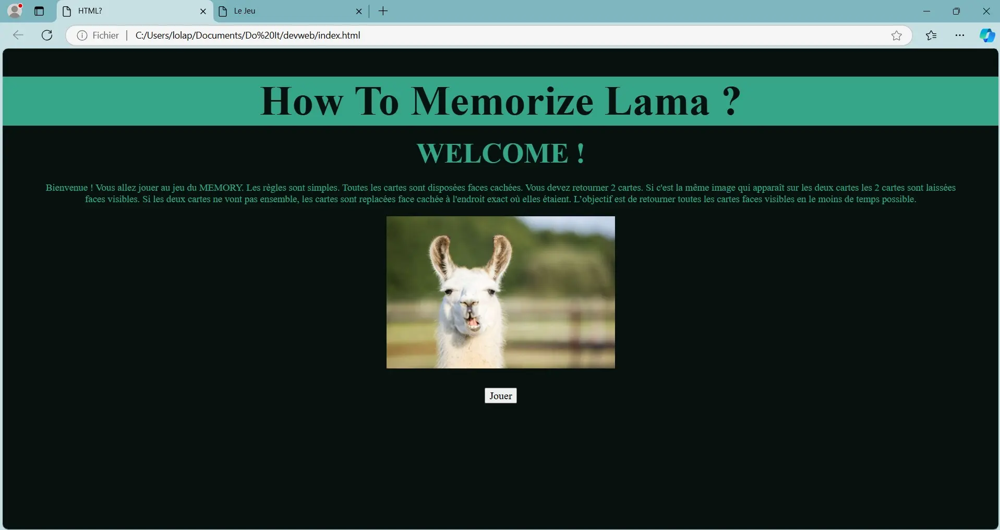 | 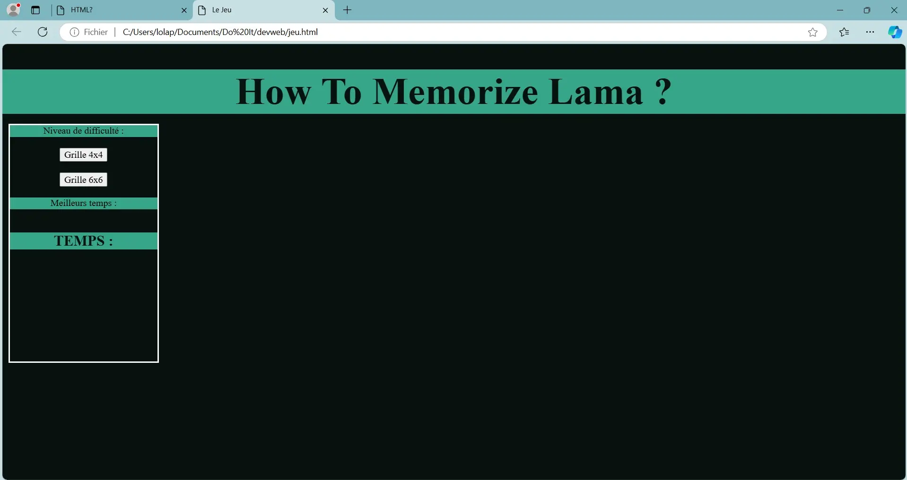 |

## Premier Sprint

### Horodatage

| Date | Heures passées | Indications |
|----|-----|-----|
| Jeudi 31 octobre | 10min | Récupération du projet |
| Samedi 2 novembre | 2h | Remémoration du cours de dev web |
| Mercredi 6 novembre  | 1h30  | Reprise du code, changement du style |
| Jeudi 7 novembre  | 1h | tutos grille |
| Lundi 11 novembre | 2h | Affichage de la grille |
| Lundi 11 novembre | 30min| Génération des id pokémons de la grille |
| Mardi 12 novembre | 1h30 | Tests pour affichage des images (et intensive recherche d'erreur) |
| Mardi 12 novembre | 1h | Modifications style et rédaction |
| lundi 18 novembre | 20min | Affichage des images |

### Style

Après m'être remise la tête dans le cours de 2e année pour me rappeler comment html et css marchent, j'ai commencé par changer le style du site pour le mettre à mon goût et surtout pour l'adapter à mon nouveau thème qui sera les pokémon.

| Nouvelle page d'accueil | Nouvelle page de jeu |
|----------------|-------------|
| 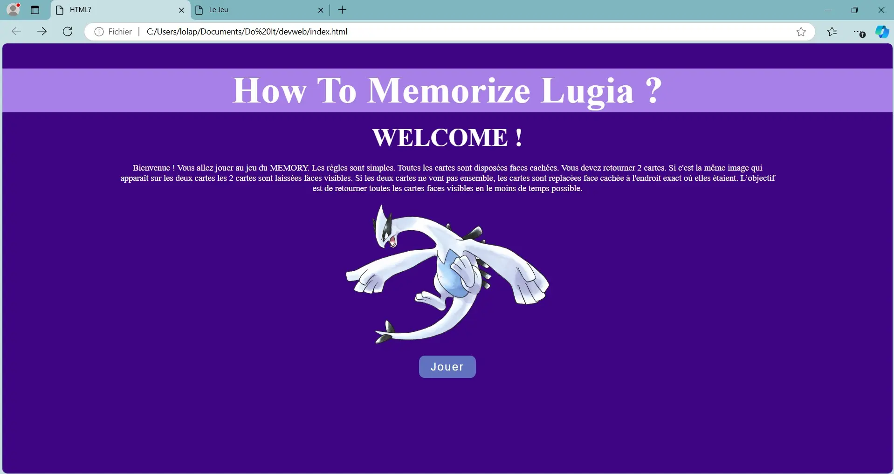 |  |

### Grille

Ensuite pour ce premer sprint j'ai voulu réaliser l'**affichage de la grille**. J'ai choisi de garder les deux options déjà présentes (grille 4x4 et 6x6) pour garder le choix de la diffculté.

Je me suis rappelée que la manière utilisée pour cette tâche il y a deux ans était un peu complexe pour pas grand chose, j'ai donc essayé de trouver de meilleures pratiques en cherchant un peu sur le net comment je pourrais faire. J'ai décidé d'en faire un petit mix.

J'ai procédé avec deux classes de conteneur pour mes tuiles, de type `display : grid`, en différenciant le `grid-template` pour adapter le format, la taille des tuiles et leur nombre, et ai travaillé pas mal de temps sur la disposition de celles-ci pour que ce soit joli dans les deux cas. Je l'affiche au click des boutons avec une fonction javascript et j'obtiens :

| 4x4 | 6x6 |
|----------------|-------------|
| 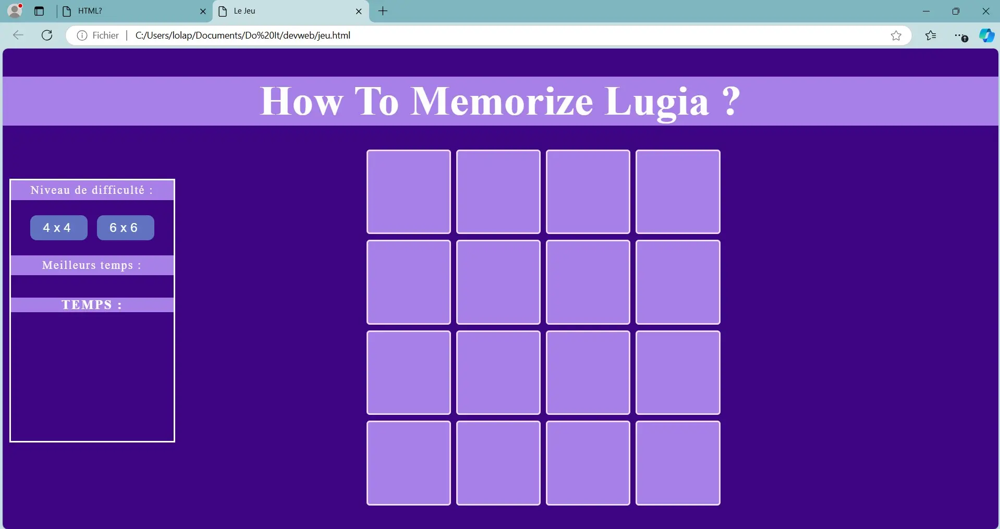 | 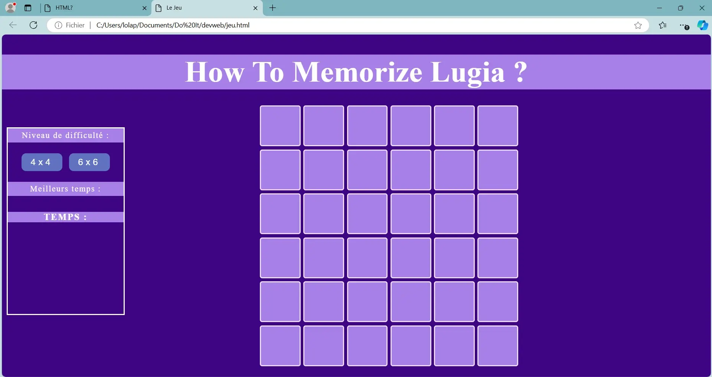 |

### Emplacement des pokémon et affichage des images

Pour constituer ensuite mon jeu de mémory, plusieurs options s'offrent à moi. J'ai décidé de m'appuyer sur les attributs des tuiles pour constituer mon mécanisme. Celui-ci repose sur une fonction qui s'activera au click de chaque tuile.

Lors de la création de chacune de mes tuiles, je vais lui attribuer un attribut 'tile-id' qui contiendra le numéro du pokémon qu'elle représente. J'ai donc fait une fonction qui génère une liste aléatoire de paires de pokémons et les attribue ensuite à mes tuiles.

Sur la fin du sprint, j'ai également réussi à afficher l'image du pokémon correspondant à l'id de la tuile sur le click de celle-ci. J'ai cru ne pas pouvoir y arriver à cause de quelques soucis de débuggage, mais j'y suis parvenue !


J'ai eu des soucis liés à priori au cache de mon ordinateur, problème résolu en passant par un serveur local pour afficher le site (`python -m http.server 3000`).


Voilà où j'en suis donc à la fin du premier sprint :

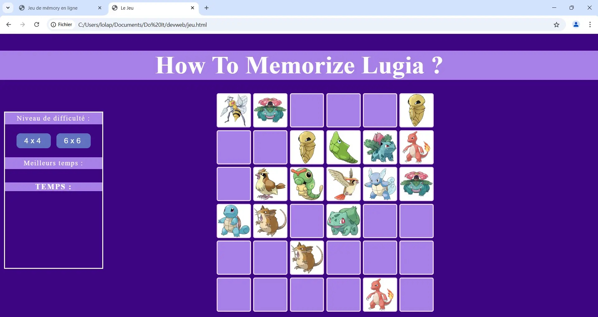

### Conclusion Sprint 1

Cela m'a beaucoup motivée de reprendre ce projet et de refaire un peu de développement web. Je pensais mieux me rappeler des bases d'HTML et de CSS ; mais j'ai finalement du y consacrer plus de temps que prévu. Au contraire, j'ai repris le coup de main assez facilement sur javascript qui me faisait un peu peur, donc j'ai réussi à équilibrer les tâches et produire un résultat satisfaisant par rapport à mes attentes, malgré les inévitables bugs rencontrés.

## Second Sprint

### Réajustement du sprint planning

Refaire la mécanique du jeu, gestion des données

- [ ] Constituer une base ~~d'images et de~~ questions pour le jeu
- [ ] ~~Faire une partie back~~ ***Pas besoin***
- [x] Réaliser la mécanique du jeu
- [x] ***+Effet de retournement des tuiles***
- [x] ***+Ajouter la mécanique de question de validation***
- [x] ***+Reset / Fin de partie***

Je n'ai pas eu à réaliser une base de questions car j'ai modifié mon système de validation des paires.

### Horodatage Sprint 2

| Date | Heures passées | Indications |
|----|-----|-----|
| Jeudi 21 novembre | 1h | Reprise du code du sprint 1 pour le rendre plus propre et adopter de meilleures pratiques (travailler avec des éléments etc.) |
| Vendredi 22 novembre | 1h | Effet de retournement des cartes |
| Samedi 23 novembre  | 1h | Mécanique du jeu au plus simple |
|  | 1h30 | Ajouts de fonctionalités pour améliorer la mécanique (pas évident) |
|  | 30min | Gestion de la fin de partie |
| Dimanche 24 novembre  | 1h | Ajouts des autres choix de difficulté et style des boutons |
|  | 30min | Recherches et tests pour créer des inputs |
| Mercredi 27 novembre | 3h30 | Mise en place du niveau initiate (pas évident) |
| Lundi 02 décembre | 30min | Dernières modifications, optimisation |

### Retournement des cartes

Pour avoir un effet joli et un ressenti de jeu sympathique, je tenais à retourner les cartes d'une manière fluide comme dans si on le faisait en vrai. Pour cela j'ai utilisé les animations CSS. Je me suis aidée de quelques tutos sur internet car j'avais du mal à comprendre le principe au début :

- [CSS Flip Card Effect](https://www.youtube.com/watch?v=OV8MVmtgmoY)
- [Effet de Flip Card CSS](https://www.youtube.com/watch?v=Pt--CNYQmaQ) (globalement la même chose en français)
- [3D Flip Card Effect On Click Using HTML CSS | CSS Flip Card](https://youtu.be/tRT8gJDLXfc?si=GnQsGgAyhydZZL6i)

J'ai repris quelques unes de ces méthodes en les personnalisant à mon site et en essayant de garder les éléments les plus simples.

Malheureusement je n'ai pas réussi à comprendre comment fonctionnait le retournement de cartes dans l'autre sens (quand deux cartes ne matchent pas). C'est donc une fonctionnalité que j'ai laissé finalement de côté (sinon, j'allais y passer des heures...).

### Mécanique du jeu

Pour réaliser la mécanique du jeu, il fallait surtout que je porte mon attenion sur :

- La sauvegarde de la carte retournée en premier et de celle retournée en deuxième, et leur comparaison.
- Le retournement des mauvaises paires après un délai.
- Les cartes déjà retournées ne peuvent pas servir à constituer d'autres paires.
- On ne peut pas cliquer deux fois de suite sur une même carte.
- On ne peut pas cliquer sur d'autres cartes le temps qu'une mauvaise paire se retourne.
  - Ce dernier point m'a pris beaucoup plus de temps que les autres, je cherchais absolument à empêcher le click sur les autres élements de la page sans succès. J'ai du finalement changer de stratégie en passant par une variable qui empêche l'éxecution de la fonction tant qu'elle n'a pas la bonne valeur. Mais j'ai mis du temps à trouver...

Pour réaliser la mécanique, je me suis aussi inspirée de quelques tutos, par exemple :

- [Learn the JavaScript DOM With This Project - Memory Game](https://www.youtube.com/watch?v=bznJPt4t_4s&t=1006s), celui qui m'a le plus servi je pense
- [How to Create Memory Game in JavaScript](https://youtu.be/M0egyNvsN-Y?feature=shared)
- [Memory Game Javascript Project | HTML, CSS, Javascript](https://youtu.be/dqqxkrKhfS4?feature=shared)

Cela m'a donné les guidelines pour réaliser le jeu et j'ai ensuite essayé au maximum de refaire tout moi-même. C'est pour cela que ça a pris un peu de temps malgré les similitudes.

J'ai aussi ajouté à la fin de la partie une petite animation pour nous féliciter et nous proposer de rejouer.

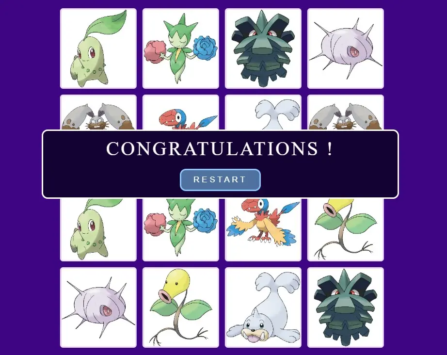

### Implémentation du niveau initié

Mon idée était de réaliser un autre mode de difficulté dans lequel le joueur devrait répondre à une question dès qu'il retourne une paire pour pouvoir la valider. Finalement, à la place des questions, j'ai voulu faire deviner au joueur la génération du pokémon de la paire retournée. Si le joueur devine bien, il valide la paire, sinon la paire est retournée et le joueur doit retenter la paire (s'il se souvient où elle était...).

Pour implémenter ce système, j'ai rencontré **deux grandes difficultés :**

- L'affichage des inputs où l'utilisateur doit rentrer sa réponse.
- Permettre "d'attendre" la réponse de l'utilisateur pour poursuivre la mécanique du jeu.

Pour le deuxième point j'avais de vagues souvenirs de l'utilisation des **fonctions asynchrones et des systèmes de promesses** que j'ai du creuser un bon moment avant de pouvoir l'utiliser ici. Ces vidéos m'ont aidée :

- [Javascript Promises vs Async Await EXPLIQUÉ (en 5 minutes)](https://youtu.be/li7FzDHYZpc?si=lMXmFcFSBecveqW5)
- [Async Await vs. Promises - JavaScript Tutorial for beginners](https://youtu.be/spvYqO_Kp9Q?si=8G5HON0rrkSJrB2p)
- [JavaScript Promises -- Tutorial for Beginners](https://youtu.be/TnhCX0KkPqs?si=F5cc_ZwpgwZura7h)

Je n'ai vraiment pas tout regardé en entier, je recherchais surtout des explications du concept et des exemples de codes (en complétant avec d'autres sites et documentations sur javascript jusqu'à trouver ce qu'il me fallait).

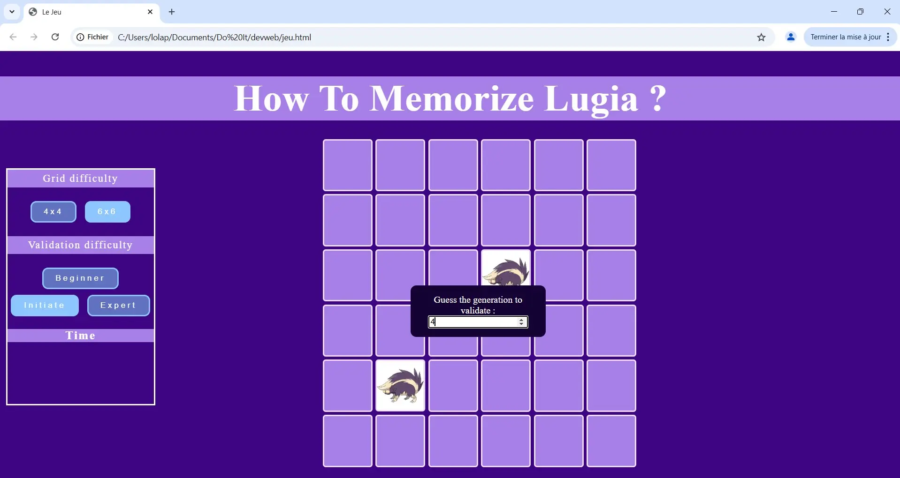

### Conclusion Sprint 2

Durant ce sprint, j'avais réduit la quantité de travail en décidant de faire un site uniquement statique et me débarrassant de l'élaboration de questions de validation. C'était une bonne décision ! Au terme de ce deuxième sprint, je dispose d'un jeu fonctionnel, sans bugs.

En revanche, je me suis rendue compte à la toute fin d'un petit soucis : le site n'était pas du tout responsive... et ne s'affichait pas bien sur les autres ordinateurs. J'ai corrigé ce défaut dans la partie bonus, car c'était essentiel d'avoir ce point là de réglé.

Je suis également consciente que mon code est probablement loin d'être optimal, et j'ai trouvé ça difficile de savoir se positionner vis-à-vis des pratiques à adopter ou non dans le code en travaillant en autonomie, sans expérience, et avec "peu" de temps.

Sinon, les plus grosses difficultées que j'ai rencontrées étaient situées au niveau de l'empêchement du click, l'affichage de l'input box, le style des boutons, les animations des cartes, et l'attente de la réponse de l'utilisateur. J'ai mis beaucoup de temps à trouver des solutions utiles à mes problèmes sur internet malgré la quantité d'infos.

Enfin, il me reste donc quelques fonctionnalités que j'ai laissées de côté pour pouvoir finir à temps : le responsive, le chronomètre, et le niveau expert. C'est une petite déception mais je suis quand même contente de tout ce que j'ai réussi à produire.

## BONUS : améliorations

En bonus, c'est-à-dire au delà des 20h du projet, j'ai passé quelques heures en plus pour améliorer le code et surtout pour implémenter le responsive et le niveau expert que je n'avais pas eu le temps de faire. Pourtant, ce n'était pas si compliqué une fois le niveau initié de fait.

Le principe de ce mode est de valider la paire en devinant le numéro du pokédex du pokemon retourné. Le public est sans doute plus restreint, sans pour autant être inexistant...

Ensuite, quelques modifications, les règles du jeu ainsi que le header.

| Début de la partie | Version initié | Version expert | Jeu gagné ! |
|----|----|----|----|
|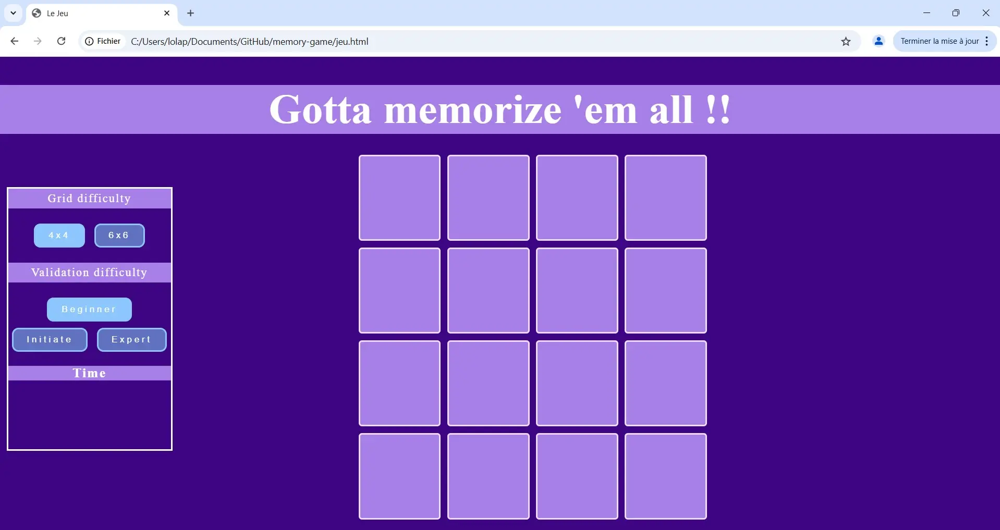|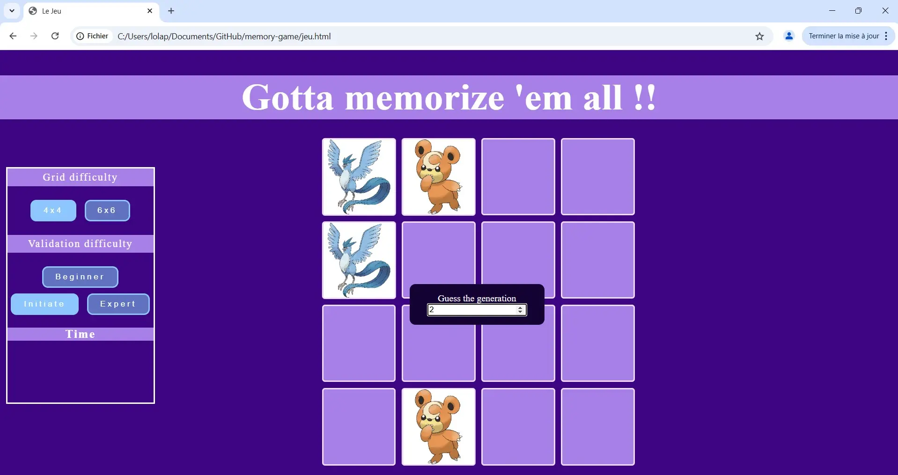|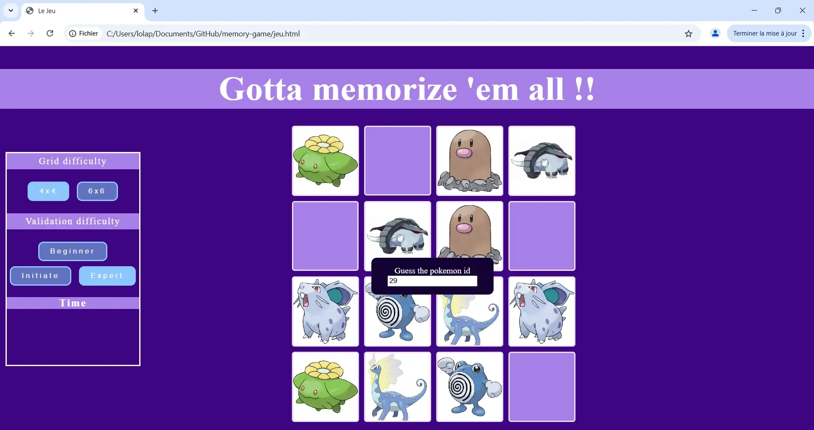|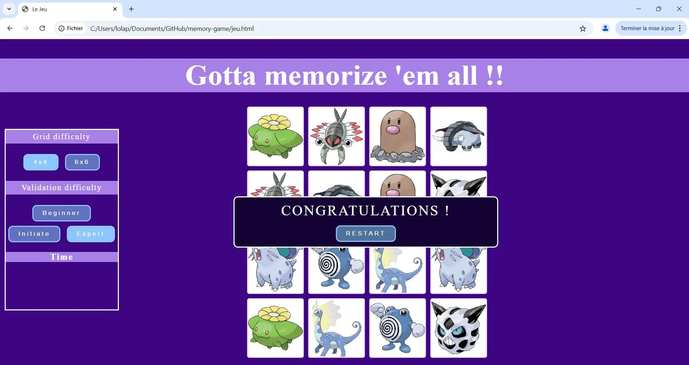|

C'est seulement à cette étape que j'ai compris qu'il fallait que fasse la partie responsive du site, mais désormais ça marche bien !

Il manque donc juste le chronomètre désormais... Mais mon site me plaît bien comme ça.

## Sources

- [w3school](https://www.w3schools.com/)
- [Cours de Développement Web](https://francoisbrucker.github.io/cours_informatique/cours/web/)
- [CSS Flip Card Effect](https://www.youtube.com/watch?v=OV8MVmtgmoY)
- [Effet de Flip Card CSS](https://www.youtube.com/watch?v=Pt--CNYQmaQ)
- [3D Flip Card Effect On Click Using HTML CSS | CSS Flip Card](https://youtu.be/tRT8gJDLXfc?si=GnQsGgAyhydZZL6i)
- [Learn the JavaScript DOM With This Project - Memory Game](https://www.youtube.com/watch?v=bznJPt4t_4s&t=1006s)
- [How to Create Memory Game in JavaScript](https://youtu.be/M0egyNvsN-Y?feature=shared)
- [Memory Game Javascript Project | HTML, CSS, Javascript](https://youtu.be/dqqxkrKhfS4?feature=shared)
- [Javascript Promises vs Async Await EXPLIQUÉ (en 5 minutes)](https://youtu.be/li7FzDHYZpc?si=lMXmFcFSBecveqW5)
- [Async Await vs. Promises - JavaScript Tutorial for beginners](https://youtu.be/spvYqO_Kp9Q?si=8G5HON0rrkSJrB2p)
- [JavaScript Promises -- Tutorial for Beginners](https://youtu.be/TnhCX0KkPqs?si=F5cc_ZwpgwZura7h)
