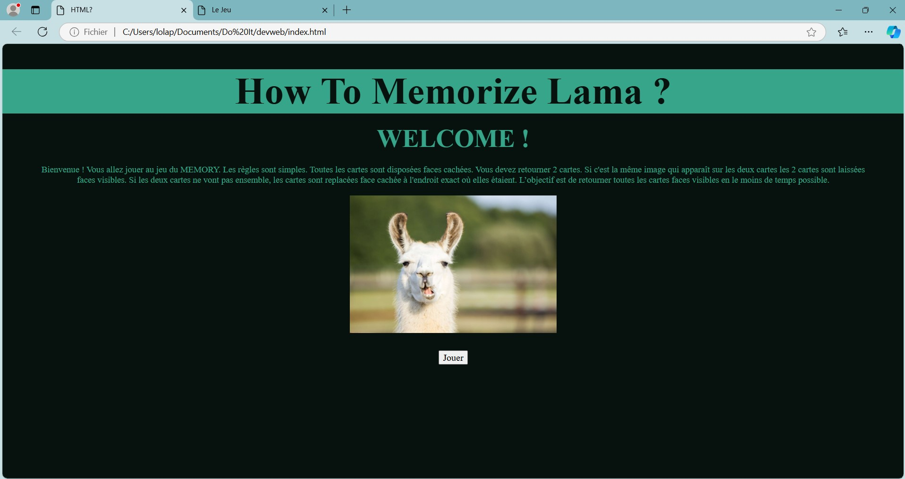
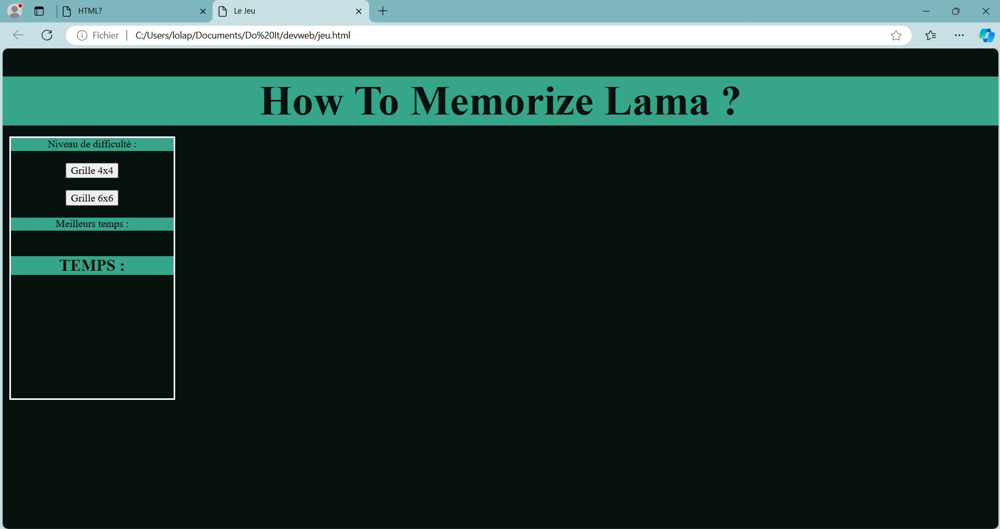
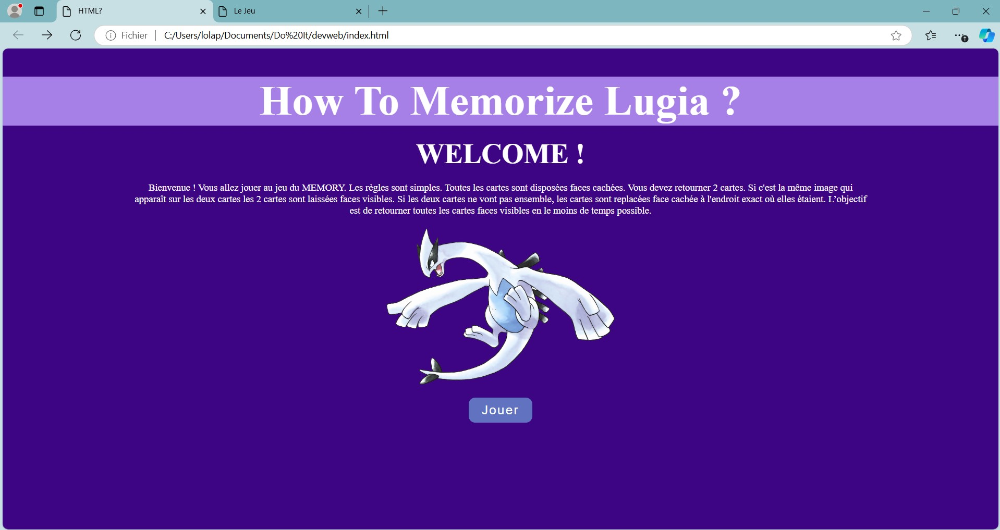
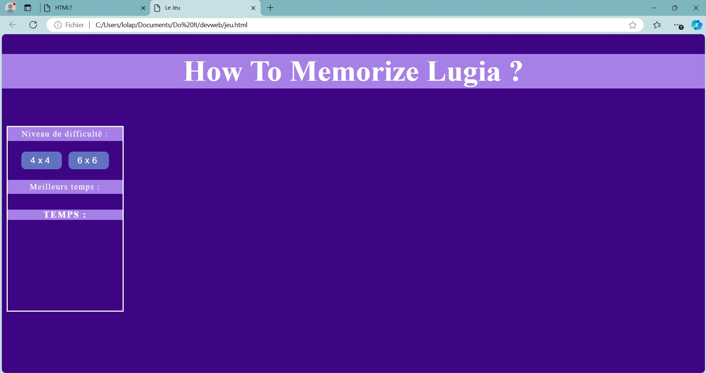
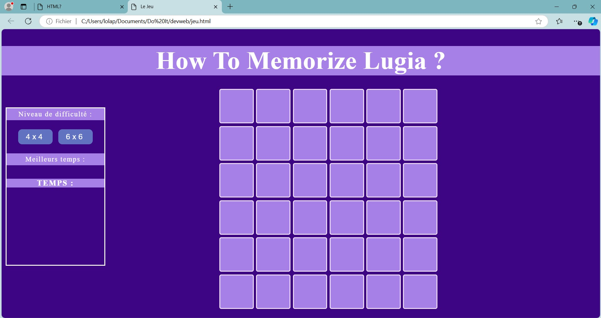



Bases de HTML, CSS, et Javascript. Il y a beaucoup de MON à ce sujet.




[Cours de Développement Web](https://francoisbrucker.github.io/cours_informatique/cours/web/)



L'objectif de ce POK est de reprendre le site web que j'avais commencé à développer pendant le cours de dev web de 2A là où il en était resté. Je souhaite améliorer le style tout en refaisant la mécanique du jeu en javascript.

## Planning

### Sprint 1

Reprendre le legacy code, remettre en marche le front.

- [x] Se remettre en mémoire le cours de devweb (ça remonte)
- [x] Remettre à mon goût les pages existantes (html/css)
- [x] Remettre les liaisons et faire l'affichage de la grille de jeu

### Sprint 2

Refaire la mécanique du jeu, gestion des données

- [ ] Constituer une base d'images et de questions pour le jeu
- [ ] Faire une partie back pour la gestion de cette base (?)
- [ ] Faire fonctionner le jeu avec javascript


Mon objectif n'est pas forcément de faire un site magnifique mais fonctionnel pour qu'on puisse y jouer de manière assez plaisante. Ayant déjà la structre du site (pas forcément très complexe cela dit), je souhaite donc ne pas perdre trop de temps sur le style si je vois que cela semble plus chronophage que prévu. Je me concentrerai donc plus sur les fonctionnalités de la page.


### Horodatage

| Date | Heures passées | Indications |
|----|-----|-----|
| Jeudi 31 novembre | 10min | Récupération du projet |
| Samedi 2 novembre | 2h | Remémoration du cours de dev web |
| Mercredi 6 novembre  | 1h30  | Reprise du code, changement du style |
| Jeudi 7 novembre  | 1h | tutos grille |
| Lundi 11 novembre | 2h | Affichage de la grille |
| Lundi 11 novembre | 30min| Génération des id pokémons de la grille |
| Mardi 12 novembre | 1h30 | Tests pour affichage des images (et intensive recherche d'erreur) |
| Mardi 12 novembre | 1h | Modifications style et rédaction |
| lundi 18 novembre | 20min | Affichage des images |

## Introduction

Je suis repartie du projet de groupe réalisé en 2e année avec M. Brucker. J'avais un sentiment d'inachevé et surtout de peux mieux faire, et cela me motivait à réapprendre à manipuler le javascript. Cela dit, j'ai perdu la majeure partie du projet et n'ai pu récupérer que la structure du site avec le style (c'est déjà ça de gagné).

Voici à quoi ressemble ce que j'ai pu récupérer du projet, ce qui constituera mon point de départ :

| Page d'accueil | Page mémory |
|----------------|-------------|
|  |  |

## Premier Sprint

### Style

Après m'être remise la tête dans le cours de 2e année pour me rappeler comment html et css marchent, j'ai commencé par changer le style du site pour le mettre à mon goût et surtout pour l'adapter à mon nouveau thème qui sera les pokémon.

| Nouvelle page d'accueil | Nouvelle page de jeu |
|----------------|-------------|
|  |  |

### Grille

Ensuite pour ce premer sprint j'ai voulu réaliser l'**affichage de la grille**. J'ai choisi de garder les deux options déjà présentes (grile 4x4 et 6x6) pour garder le choix de la diffculté.

Je me suis rappelée que la manière utilisée pour cette tâche il y a deux ans était un peu complexe pour pas grand chose, j'ai donc essayé de trouver de meilleures pratiques en cherchant un peu sur le net comment je pourrais faire. J'ai décidé d'en faire un petit mix.

J'ai procédé avec deux classes de tuiles (pour l'instant) pour adapter leur taille à leur nombre et ai travaillé pas mal de temps sur la disposition de celles-ci pour que ce soit joli dans les deux cas. Combiné ensuite avec un peu de javascript, j'obtiens :

| 4x4 | 6x6 |
|----------------|-------------|
|  |  |

### Emplacement des pokémon et affichage des images

Pour constituer ensuite mon jeu de mémory, plusieurs options s'offrent à moi, mais à ce stade je ne sais pas encore laquelle sera la meilleure. Pour l'instant je pars donc dans une direction mais je serais peut être amenée à changer tout ça.

Lors de la création de chacune de mes tuiles, je vais lui attribuer un attribut 'tile-id' qui contiendra alors le numéro du pokémon qu'elle représente. Cela sera forcément utile pour après. J'ai donc fait une fonction qui génère une liste aléatoire de paires de pokémons et les attribue ensuite à mes tuiles.

Sur la fin du sprint, j'ai également réussi à afficher l'image du pokémon correspondant à l'id de la tuile sur le click de celle-ci. J'ai cru ne pas pouvoir y arriver à cause de quelques soucis de débuggage, mais j'y suis parvenue ! (après avoir lancé le site sur un serveur local, peut-être des soucis de cache).

Voilà où j'en suis donc à la fin du premier sprint :

### Conclusion Sprint 1

Cela m'a beaucoup motivée de reprendre ce projet et de refaire un peu de développement web. Je pensais mieux me rappeler des bases d'HTML et de CSS ; mais j'ai finalement du y consacrer plus de temps que prévu. Au contraire, j'ai repris le coup de main assez facilement sur javascript qui me faisait un peu peur, donc j'ai réussi à équilibrer les tâches et produire un résultat satisfaisant par rapport à mes attentes, malgré les inévitables bugs rencontrés.

## Second Sprint

### Réajustement du sprint planning

Refaire la mécanique du jeu, gestion des données

- [ ] Constituer une base ~~d'images et de~~ questions pour le jeu
- [ ] ~~Faire une partie back~~ ***Pas besoin***
- [ ] Réaliser la mécanique du jeu
- [ ] ***+Effet de retournement des tuiles***
- [ ] ***+Ajouter la mécanique de question de vérification***
- [ ] ***+Reset / Fin de partie***
