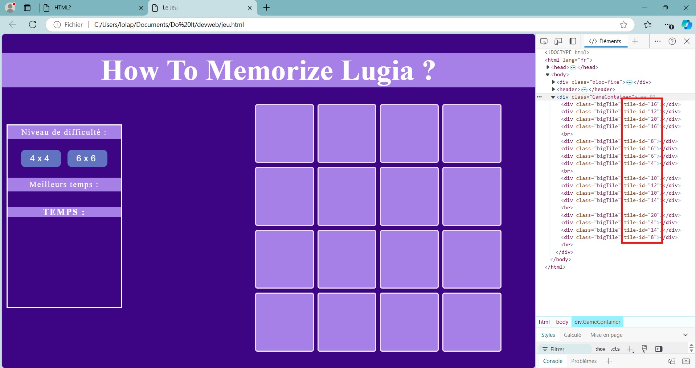



Bases de HTML, CSS, et Javascript




Autres MON



L'objectif de ce POK est de reprendre le site web que j'avais commencé à développer pendant le cours de dev web de 2A là où il en était resté. Je souhaite améliorer l'UI du site tout en refaisant la mécanique du jeu en javascript.

## Tâches

### Sprints

#### Sprint 1

Reprendre le legacy code, remettre en marche le front.

- [x] Se remettre en mémoire le cours de devweb (ça remonte)
- [x] Remettre à mon goût les pages existantes (html/css)
- [x] Remettre les liaisons et faire l'affichage de la grille de jeu (mais pas réussi avec les images)

Mon objectif n'est pas forcément de faire un site magnifique mais fonctionnel pour qu'on puisse y jouer de manière assez plaisante. Ayant déjà la structre du site (pas forcément très complexe), je souhaite donc ne pas perdre trop de temps sur le style si je vois que cela semble plus chronophage que prévu. Je me concentrerai donc plus sur les fonctionnalités de la page.

#### Sprint 2

Refaire la mécanique du jeu, gestion des données

- [ ] Constituer une base d'images et de questions pour le jeu
- [ ] Faire le back pour la gestion de cette base (?)
- [ ] Faire fonctionner le jeu avec javascript

### Horodatage

| Date | Heures passées | Indications |
|----|-----|-----|
| Jeudi 31 novembre | 10min | Récupération du projet |
| Samedi 2 novembre | 2h | Remémoration du cours de dev web |
| Mercredi 6 novembre  | 1h30  | Reprise du code, changement du style |
| Jeudi 7 novembre  | 1h | tutos grille |
| Lundi 11 novembre | 2h | Affichage de la grille |
| Lundi 11 novembre | 30min| Génération des id pokémons de la grille |
| Mardi 12 novembre | 1h30 | Tests pour affichage des images (et intensive recherche d'erreur)|
| Mardi 12 novembre | 1h | Modifications style et rédaction |

## Contenu

### Introduction

Je suis repartie du projet de groupe réalisé en 2e année avec M. Brucker. J'avais un sentiment d'inachevé et surtout de peux mieux faire, et cela me motivait de réapprendre à manipuler le javascript. Cela dit, j'ai perdu la majeure partie du projet et n'ai pu récupérer que la structure du site avec le style (c'est déjà ça de gagné), et cette fois-ci, je suis toute seule...

Voici à quoi ressemble ce que j'ai pu récupérer du projet, ce qui constituera mon point de départ :

| Page d'accueil | Page mémory |
|----------------|-------------|
|  |  |


À noter : aucun des boutons n'est fonctionnel bien sûr, et le jeu de mots est peut-être à revoir


### Premier Sprint

#### Style

Après m'être remise la tête dans le cours pour me rappeler comment html et css marchaient, j'ai commencé par changer le style du site pour le mettre à mon goût et surtout pour l'adapter à mon nouveau thème qui sera les pokémons.

| Nouvelle page d'accueil | Nouvelle page de jeu |
|----------------|-------------|
|  |  |

#### Grille

Ensuite pour ce premer sprint j'ai voulu réaliser l'**affichage de la grille**. J'ai choisi de garder les deux options déjà présentes (grile 4x4 et 6x6) pour garder le choix de la diffculté.

Je me suis rappelée que la manière utilisée pour cette tâche il y a deux ans était un peu complexe et peut être pas optimale, j'ai donc essayé de me renseigner sur différentes méthodes pour afficher ma grille (avec des petits tutos youtube) et ai décidé d'en faire un petit mix.

Pour cela j'ai fait deux classes de tuiles pour adapter la taille et ai travaillé pas mal de temps sur la disposition de celles-ci pour que ce soit joli dans les deux cas.

En réactivant les boutons, et en les associant à une petite fonction javascript, j'obtiens alors ces grilles de jeu :

| 4x4 | 6x6 |
|----------------|-------------|
|  |  |

#### Emplacement des pokémon

Pour constituer ensuite mon jeu de mémory, plusieurs options s'offrent à moi, mais à ce stade je ne sais pas encore laquelle serait la meilleure. Pour l'instant je pars donc dans une direction mais je serais peut être amenée à changer tout ça.

Lors de la création de chacune de mes tuiles, je vais lui attribuer un attribut 'tile-id' qui contiendra alors le numéro du pokémon qu'elle représente.
J'ai alors travaillé sur une fonction qui génère une liste aléatoire de paires de pokémons et les attribue à mes tuiles.

Avant de pouvoir afficher chaque image sur un click, on peut déjà voir l'attribution des identifiants pokémons ici :

#### Affichage des images

J'aimerais que quand on clique sur une tuile, le pokémon correspondant s'affiche.

### Second Sprint

#### Réajustement du sprint planning

Refaire la mécanique du jeu, gestion des données

- [ ] Constituer une base d'images et de questions pour le jeu
- [ ] Faire une partie back
- [ ] Réaliser la mécanique du jeu
- [ ] ***+Effet de retournement des tuiles***
- [ ] ***+Ajouter la mécanique de question de vérification***
- [ ] ***+Reset / Fin de partie***
