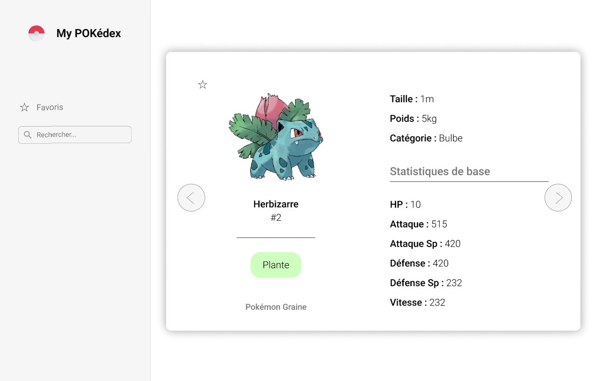



Bases en développement web font-end



MON de Sophia : [Bases du front et du framework Vue](https://francoisbrucker.github.io/do-it/promos/2024-2025/Sophia-Capdevielle/mon/temps-1.1/)


Ce POK me sert de support pour apprendre à utiliser le framework **Vue js**, à travers la réalisation d'un application web sympathique répertoriant tous les pokémons / un pokédex, pour continuer sur ma lancée.

## Lien vers le code du site

Le code et le site seront bientôt accessibles.

## Planning

### Sprint 1

Phase de prise en main et de préparation :

- [x] Découverte générale de Vue
- [x] Prise en main de Vue
- [x] Maquette du site

### Sprint 2

Phase de réalisation :

- [ ] Créer les composants de base qui seront utilisés pour les fiches pokémon
- [ ] Mettre en place les éléments ensemble
- [ ] Styliser
- [ ] Ajouter les fonctionnalités bonus


Au début de ce projet, je n'ai aucune idée de la complexité du framework et de ma capacité à prendre en main la techno, c'est pourquoi la gestion des tâches est très imprévisible...


## Premier Sprint

### Horodatage

| Date | Heures passées | Indications |
|----|-----|-----|
| Jeudi 16 janvier | 1h30 | Découverte des autres MON, de la doc de Vue, et début du tutoriel proposé |
| Vendredi 17 janvier | 1h30 | Fin du tuto, initialisation d'un projet en local |
|  | 30min  | Recherche d'autres tutos et nettoyage du projet installé par défaut |
|  | 2h | Maquette Figma |
| Samedi 18 janvier | 1h | Lecture de la doc PokéAPI, récupération et affichage en vrac des données souhaitées |
|  | 1h | Changement d'API et débugage |
|  | 1h | Structuration du composant "fiche", tests des différentes fonctionnalités de Vue apprises sur mon composant |
|  | 30min | Ajout des boutons permettant de passer au suivant ou au précédent |
|  | 1h | Création d'un composant pour la liste non détaillée |

### Découverte de Vue

Je me suis essentiellement basée sur la [documentation officielle de Vue](https://fr.vuejs.org/guide/introduction.html), pour comprendre le fonctionnement global.

Ce qu'il faut retenir :

- Il y a deux façons d'écrire le code : avec **l'Options API** et la **Composition API**, j'ai choisi d'opter pour l'Options API car elle me semblait moins complexe (ressenti personnel).
- L'intérêt de vue est de rendre le **HTML dynamique** : notamment avec le rendu déclaratif qui associe le HTML avec les états du javascript.
- Le code s'écrit dans un **SFC : Single File Component** (ou composant mono-fichier). Le HTML (équivalent au template), le CSS (style), et le javascript (script), s'écrivent dans le même fichier.
- Le rendu global sera créé à partir de ces différents composants SFC.

Le **tutoriel** est très bien fait et nous fait pratiquer sur toutes les fonctionnalités essentielles : je conseille et je trouve que j'ai appris très vite.

### Initialisation du projet Vue

J'ai choisi de suivre la démarche explicitée sur le site de la doc :  [Quick Start](https://fr.vuejs.org/guide/quick-start.html).

Après avoir effectué les lignes de commandes dans mon terminal, j'obtiens tous les fichiers nécessaires à mon projet avec une page créée par défaut.

J'ai ensuite supprimé tout ce qui était inutile pour repartir d'un projet vide.

### Maquette du site

Avant de me lançer directement dans la conception de mon site, j'ai réuni quelques inspirations et ai réfléchi au rendu voulu, puis j'ai donné vie à tout ça en créant ma maquette Figma.

Je voudrais que mon site présente une liste de tous les pokémons de manière macro sur la page par défaut, avec la possibilité de mettre en favori nos préférés pour pouvoir les filtrer, et d'avoir une fiche détaillée de chaque pokémon en cliquant dessus.

| Page accueil | Filtre | Fiche détaillée |
|----|-----|-----|
|  |  |  |

J'ai en tête bien sûr d'autres fonctionnalités à implémenter si il me reste du temps, notamment la recherche manuelle d'un pokémon en particulier et la sélection des types et / ou de la génération.

### Récupération des données

Pour récupérer les données spécifiques de tous les pokémons, je me suis tout de suite dirigée vers la [PokéAPI](https://pokeapi.co/docs/v2) qui détient toutes les infos (il y en a vraiment plein !!) et les met à disposition gratuitement et simplement. J'ai passé un peu de temps à mettre en place ce que je voulais pour me rendre compte de différents problèmes :

- Bien qu'il y ait toutes les infos, elles n'étaient pas tout le temps accessible par le même lien ou difficilement (je n'ai pas réussi à le faire simplement du moins)
- Les images disponibles n'étaient pas les plus belles, ou ne correspondaient pas au style recherché
- La plupart des données ne se récupérait qu'en anglais (ou alors je n'ai pas réussi)

C'est pourquoi j'ai finalement opté pour une autre API qui résoud tous les problèmes précédents : [Tyradex API](https://tyradex.vercel.app/docs/pokemon/pokedex)

En m'aidant du tuto réalisé et des exemples fournis par la doc de Vue, j'ai été en mesure rapidement de récupérer et d'afficher de manière dynamique toutes les infos que je voulais pour mes fiches descriptives par pokémon. Il est aussi aisément possible grace à la syntaxe de Vue de passer d'un fiche à l'autre par de simple boutons. Cela donne ceci de manière brute :

### Début de pokédex

Enfin, avec une simple boucle et quelques propriétés, j'ai créé la liste de tous les pokémons disposés dans une grille avec uniquement les infos principales pour faire la base de mon site. Et voilà !

### Conclusion Sprint 1

Pour ce sprint, je n'ai pas rencontré de difficultés majeures, et ai même pu prendre un peu d'avance sur le prochain sprint car j'ai pris conscience que celui-ci serait chargé. La syntaxe de Vue a été plus rapidement prise en main que prévue et tant mieux. Je me rends compte que cela permet de faire de grands raccourcis dans le code !

J'ai eu plus de mal avec la récupération des données quand je ne savais pas encore quelle source utiliser, et ai eu pas mal de bugs avec l'affichage des données liés à la requête ou à la syntaxe rigoureuse de Vue pas encore totalement maîtrisée. Je pense rencontrer plus de difficultés dans le prochain sprint quand il faudra imbriquer les composants.

## Second Sprint

### Réajustement du sprint planning

Mettre en place le site final

- [ ] Mettre en place les composants ensemble
- [ ] Styliser
- [ ] Ajouer les logiques de filtre (le plus possible)

### Horodatage Sprint 2

### Conclusion Sprint 2

## BONUS ?

## Sources

- [Documentation de Vue :](https://fr.vuejs.org/guide/introduction.html)
  - [Tutoriel Vue](https://fr.vuejs.org/tutorial/#step-1)
  - [Démarrage d'un projet Vue](https://fr.vuejs.org/guide/quick-start.html)
  - [Exemples de syntaxes Vue](https://fr.vuejs.org/examples/#hello-world)
- [Tyradex API](https://tyradex.vercel.app/docs/pokemon/pokedex)
