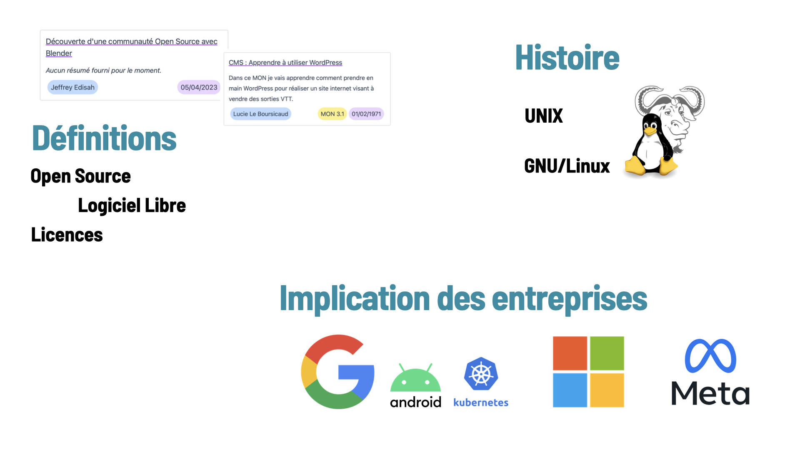
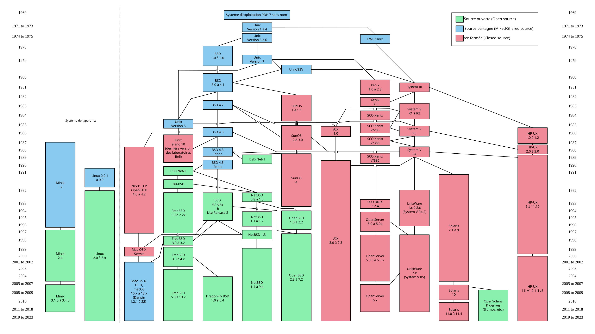
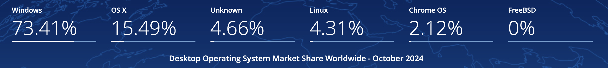
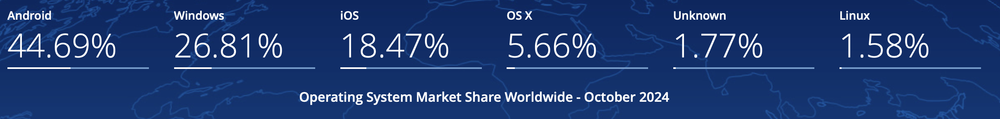
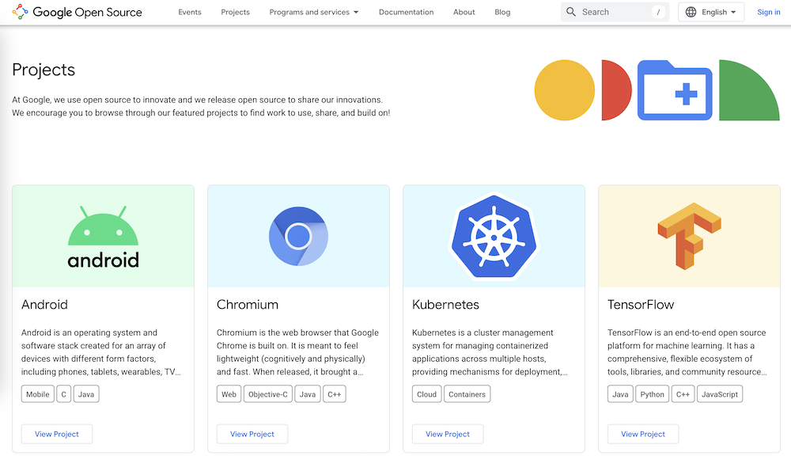

## Introduction

Un an que je rédige des articles sur ce site et je n’ai qu’à peine eu l’occasion d’étudier des sujets axés 
management ou relatifs à l’entreprise de façon approfondie.

L’***Open Source*** est une approche collaborative du développement logiciel qui par opposition au modèle propriétaire 
offre une transparence sur le code ainsi produit. De ce fait, avec un regard de 
développeur, j’aimerais apporter une contribution à l’*Open Source* 
en analysant l’état des **industries du numériques** et la place du **logiciel libre** dans ces dernières, 
avant de **contribuer à un projet** au sein d’une communauté bénévole active.

## Problématique et enjeux



**Comment l'approche *Open Source* influence-t-elle l'innovation et la compétitivité des entreprises du secteur tertiaire ?**

Cette question englobe plusieurs aspects :

- L'impact historique de l'*Open Source* sur le développement logiciel et l'industrie numérique
- L'implication des entreprises dans l'*Open Source* et ses avantages potentiels
- L'influence de l'approche collaborative sur l'innovation et la compétitivité des entreprises



De cette façon, nous verrons le lien avec le sujet dans 
l’industrie tertiaire dans un premier temps ([Partie 1](#partie-1)),
puis avec la gestion de projet en source ouverte et 
le développement logiciel dans un second ([Partie 2](#partie-2)).

## Précédentes contributions

D’une certaine manière, le site Do_It s’inscrit dans les définitions que nous allons décrire plus bas. En effet, son contenu est accessible sur internet librement et ses contributeurs multiples forment un site web collaboratif donc le code est accessible librement sur [GitHub](http://github.com/FrancoisBrucker/do-it).

Lorsque l’on cherche le terme “*Open Source*” sur le site de Do_It, on peut noter une cinquantaine de résultats. C’est l’illustration de l’omniprésence du logiciel en source ouverte dans les apprentissages d’élèves ingénieurs que l’on pourra généraliser ensuite à l’industrie.

Parmi eux certains ont étudié particulièrement d’*Open Source* au travers de ses communautés, comme dans le **MON de Jeffrey** :



ou bien ont simplement détaillé les définitions des outils utilisés comme dans le **MON de Lucie** _(“1. Découverte de WordPress”)_ :


 


Dans l’ensemble, on constate que les POKs et MONs citent beaucoup de logiciels libres qui forment les briques élémentaires à de nombreuses solutions commerciales, comme des languages, des bibliothèques ou des modules applicatifs.


## Définitions { #partie-1 }

**Open source** : désigne un modèle de développement et de distribution de logiciels où le code source est librement accessible et parfois modifiable et distribuable [1](#bibliographie).

**Logiciel libre** : usuellement, on désigne par ce terme un logiciel ou une application développée selon les principes de l’*Open Source*. Le logiciel libre va plus loin garantissant les aspects distribuables et l’appropriation par tous et pour tous les usages, en faisant la promotion de principes définis par la [Free Software Foundation](https://www.fsf.org/?set_language=fr), notamment.


**On retient** - Souvent confondus, il existe une nuance entre **Libre** et ***Open Source***, le premier étant plus ouvert encore que la simple mise à disposition publique du code.
Pour en savoir plus : [Logiciel « libre » et « open source » sont-ils synonymes ?](https://insolus.com/blog/difference-open-source-logiciel-libre) et les débats éthiques de la communauté : [2](#bibliographie).


## Dimension historique de l’*Open Source* dans l’informatique

### Prémisses et enjeux politiques

Les débuts de l’informatique s’accompagnent de la **distribution** conjointe du **logiciel** et du **matériel**. On fait ici référence aux années 50’ à 60’, aux prémisses de l’informatique électronique, faisant suite aux cartes perforées. Par la même occasion, il semble à l’époque tomber sous le sens de donner **accès au code** permettant de générer du code compilé : de ce fait lisible par un humain. Les premiers logiciels sont en ce sens *Open Source* et manipulés principalement par des universitaires.

Ces informations [4](#bibliographie)[5](#bibliographie) montrent que l’industrie s’est en fait approprié des technologies développées dans le cadre de la recherche, bénéficiant d’un vide juridique à propos de la propriété intellectuelle. Ainsi, l’expansion de l’informatique telle que l’on la connait se partage entre deux rapports à la propriété : libre et collaborative ou bien protégée et respectueuse du droit d’auteur. Ce sont bien des visions politiques et économiques qui s’affrontent, ce qui justifie que l’on traite de ce sujet au cours d’un tel article.

Nous allons explorer la première frange : la communauté du libre. Cette communauté, animée par des valeurs de collaboration sans secret industriel, a joué un rôle crucial dans le développement de nombreux outils et technologies que nous utilisons aujourd'hui.

### GNU/Linux

GNU/Linux est un exemple assez emblématique de la puissance de l'*Open Source*. Créé par Linus Torvalds en 1991, le noyau Linux, combiné avec le projet GNU de Richard Stallman, a donné naissance à un **système d'exploitation** complet et libre. Aujourd'hui, GNU/Linux est utilisé dans de nombreux domaines : serveurs web, smartphones, IoT ou même supercalculateurs, démontrant ainsi la force d’impact des modèles de développement collaboratifs.

Fig 1 - Chronologie des systèmes UNIX. Source : Wikipédia

UNIX est une famille de systèmes d’exploitation encadrée par des standards et issue de développements privés. Avant la rédaction de ce MON, j’aurais dit qu’UNIX n’était qu’une base aux systèmes Linux d’aujourd’hui ! Il n’en est rien. En réalité, il s’agit d’un système répondant aux mêmes caractéristiques (multi-utilisateur, multi-programmes, a un système de fichier propre et compatibilité avec de nombreux matériels) mais dérivé de UNIX ou *“**Unix-like**”* [7](#bibliographie). La communauté de hackers rédigeant ainsi le [*GNU Manifesto*](https://www.gnu.org/gnu/manifesto.html) embrassent ainsi pleinement la philosophie du libre et structurent des programmes sous forme de briques logicielles empruntées du fonctionnement de logiciels privés.

> *GNU is not in the public domain. Everyone will be permitted to modify and redistribute GNU, but no distributor will be allowed to restrict its further redistribution.*
> 
> [C’est à dire, en français]
> 
> GNU n’est pas dans le domaine public. Quiconque pourra modifier et redistribuer GNU, mais aucun distributeur ne sera autorisé à en restreindre d’utilisation par des tiers.

_Extrait du *GNU Manifesto*_

La mention de Linux n’est pas anodine puisqu’elle traduit la domination actuelle du marché par ce système d’exploitation pour une raison étonnante. En effet, en 2024 Windows domine toujours le marché des systèmes pour ordinateurs personnels (PC) mais n’occupe que 20% du marché des serveurs.

Fig 2 - Parts de marché des systèmes d'exploitation pour ordinateur de bureau. Source : <a href="https://gs.statcounter.com/os-market-share/desktop/" target="_blank">Statcounter Global</a>


Alors comment Linux domine-t-il le marché puisque personne ne l’utilise ?


Personne ? Pas si vite.

En réalité, il est probable que vous ayez en ce moment même un appareil sous Linux dans votre poche, et presque certain que vous utilisiez tous les jours un appareil assimilé à Unix. Je veux parler de vos smartphones ! En effet, avec l’essor des télécommunications mobiles dans le monde, on trouve désormais bientôt 50% d’appareils liés au noyau Linux. En effet, Android équipe 70% des smartphones en laissant les derniers 30% à Apple avec iOS.

Fig 3 - Parts de marché des systèmes d'exploitation dans le monde. Source : <a href="https://gs.statcounter.com/os-market-share" target="_blank">Statcounter Global</a>

De quoi faire réfléchir…

Google utilise en effet le noyau *Open Source* de Linux pour concevoir et distribuer [Android Open Source Project (AOSP)](https://source.android.com) , lui-même sous licence libre, ce qui nous amène à la partie suivante. À noter tout de même que le projet GNU émet [quelques réserves](https://www.gnu.org/philosophy/android-and-users-freedom.fr.html) quant à la dénomination *Open Source* agitée par la firme Google.

Avec l’exemple de l’essor des systèmes d’exploitation basés sur Unix, nous avons ainsi montré la diversité d’acteurs impliqué dans le développement, le partage ou la récupération de technologies logicielles populaires. Voyons maintenant comment ces acteurs se matérialisent dans le monde de l’entreprise.

### Implication des entreprises dans l’*Open Source*

<figure style="float: right; margin: 0;">
    
    <figcaption class="text-center">Fig 4 - Promotion des projets <i>Open Source</i> de Google
        <a href="https://opensource.google/">https://opensource.google/</a>
    </figcaption>
</figure>

Nous venons de mentionner l’entreprise Google pour sa participation à l’*Open Source* en lien avec le noyau Linux, mais ce n’est pas sa seule contribution. En effet, sur [la page dédiée à la promotion de l’Open Source par la firme](https://opensource.google) on note l’omniprésence de Google sur ce marché, des technologies surprenamment présentes dans les POKs et MONs des uns et des autres. J'ai moi-même travaillé sur plusieurs projets utilisant ces technologies, au point d'en oublier parfois que des solutions comme Kubernetes ou Angular sont issues du géant Google : voir [MON 2.2 - Kubernetes](https://francoisbrucker.github.io/do-it/promos/2023-2024/Louradou-Arthur/mon/temps-2.2/) et [MON 3.1 - Angular](https://francoisbrucker.github.io/do-it/promos/2023-2024/Louradou-Arthur/mon/temps-3.1/).

 

Dès lors, nous pouvons citer d’autres multinationales qui ont investi dans l’*Open Source* comme Microsoft avec *VS Code*, *.NET*, *TypeScript* ou *Azure OpenAI*, puis Meta avec *React*, *PyTorch*, *GraphQL* ou même leur LLM *LLaMa* (voir le [MON 1.1 de Cassandra - Evolution récente des Large Language Models (LLMs)](https://francoisbrucker.github.io/do-it/promos/2023-2024/Ledins-Cassandra/mon/temps-1.1/), soulignant les différences entre modèles propriétaires et *Open Source* dans le domaine des modèles de langage).


Mais quel intérêt pour les GAFAM de voir leur code en libre accès et modifiable par toutes et tous ?


Une partie de la réponse se trouve dans la **vente de services complémentaires**, la **stimulation de l’innovation** et la **réduction des coûts** par le travail de communautés actives d’utilisateurs [9](#bibliographie). J’ajouterai au papier de 2011 ainsi cité que la stratégie d’un géant technologique peut aussi être de **déstabiliser une situation monopolistique** propriétaire, comme le fait Meta avec LLaMa [10](#bibliographie)[11](#bibliographie).


<figure style="float: right; margin: 0 0 0 10px;">
    
    <figcaption class="text-center">Fig 5 - Logo Meta</figcaption>
</figure>

**Ajout suite à la conférence de Christian Keller** à Centrale, Product Lead pour la recherche en IA générative chez **Meta** (et anciennement Product Lead pour PyTorch).

Meta décrit sa contribution à l’Open Source selon trois axes :

- Pour **la communauté** (de chercheurs, de développeurs)
- Pour **Meta** (facilité de recrutement de profils connaissant l’écosystème logiciel)
- Pour **le monde** (volonté philanthropique à laquelle on peut choisir l’adhérer)

Et vous pouvez en savoir plus en suivant le lien ci-dessous.




Ensuite, il faut considérer que les entreprises ont un intérêt significatif à ne pas être dépendantes de solutions propriétaires pour leurs usages, faisant valoir l'importance de leur souveraineté technologique. En adoptant et en contribuant à des solutions *Open Source*, les entreprises peuvent mieux contrôler leur infrastructure informatique, réduire leur dépendance vis-à-vis de prestataires uniques ou encore se rendre plus flexible dans les réponses technologiques aux besoins clients. Par exemple, dans le domaine du marketing numérique, WordPress est un outil *Open Source* omniprésent (presque 43% du web selon les dernières études, en progression par rapport au [MON de Lucie](https://francoisbrucker.github.io/do-it/promos/2023-2024/Lucie-Le-Boursicaud/mon/temps-3.1/) sur le sujet daté d’il y a un an).

Enfin, cette approche favorise l'innovation interne et la collaboration avec d’autres entreprises dans des écosystèmes logiciels partagés. Ici, je dois prendre l’exemple de Kubernetes qui illustre  cette dynamique en entreprise. Cette plateforme d'orchestration de conteneurs est maintenant au cœur de nombreuses infrastructures cloud dans toutes les industries, bénéficiant des contributions d'une vaste communauté d'entreprises et de développeurs indépendants.

Ces exemples montrent que de grandes entreprises multinationales contribuent activement à l’*Open Source* et indiquent comment leur modèle économique est viable au regard des innovations apportées par une partie de la communauté. À leurs échelles, certaines entreprises européennes ont aussi vu dans l’*Open Source* un moyen de développer une philosophie libre en accord avec un modèle économique pérenne. C’est le sujet de la prochaine partie. [12](#bibliographie)

## Des communautés *Open Source* aux enjeux divers

Internet regorge de communautés variées qui partagent leurs codes et génèrent de l’interaction entre utilisateurs. De la plus anecdotique : 


Personnes qui font des [animations pour des croix de pharmacies](https://github.com/MathisHammel/CroixPharmacie)


Aux enjeux les plus sérieux, comme la démocratie représentative :


- [Polis](https://pol.is/home)
- [Le Projet Tournesol](http://tournesol.app/)


<figure style="float: right; margin: 0 0 0 1rem; width: 150px;">
    
    <figcaption class="text-center">Fig 6 - Logo VLC Media Player</figcaption>
</figure>

Ces projets peuvent prendre plusieurs formes comme des **associations à but non lucratif**, prenons l’exemple français de VideoLAN (portant le projet bien connu **VLC**) ou bien **des entreprises en transition** vers des modèles économiques nouveaux. Pour VLC comme pour d’autres associations, les porteurs du projet ont su développer un modèle économique basé sur le sponsoring et les dons, permettant de maintenir une équipe de développeurs dédiés tout en gardant le logiciel gratuit et *Open Source*. En comptant plus de 400 millions d’utilisateurs, cette approche montre qu'il est possible de concilier les valeurs du logiciel libre avec une structure organisationnelle stable. [13](#bibliographie)

<figure style="float: right; margin: 0 0 0 1rem; width: 150px;">
    
    <figcaption class="text-center">Fig 7 - Logo Odoo</figcaption>
</figure>

Je pense ensuite à OpenEPR, devenue **Odoo**, qui est passée d’un modèle de distribution *Open Source*, rémunéré par des services de support, à un modèle à noyau ouvert et une distinction entre leurs logiciels commerciaux et ouverts. C’est ainsi que 80% des développements annoncés servent leur modèle “*Community*” tandis que le reste sont attribués à la version “*Entreprise*”, dégageant l’essentiel de la valeur économique de l’entreprise. [14](#bibliographie)

L’exemple de VideoLAN montre la possibilité d’impact mondial avec une collaboration ouverte, tandis qu’Odoo illustre la force d’un modèle hybride liant communauté et rentabilité. Ces réussites soulignent l’importance stratégique de l’*Open Source* pour l’innovation et l’autonomie numérique en Europe.

Enfin, pour terminer ce MON (ma toute dernière production à Centrale !), j’aimerais vous raconter ma contribution à l’*Open Source*…

## Bibliographie et documentation { #bibliographie }



[1] [L'Open Source, qu'est-ce que c'est ? - RedHat](https://www.redhat.com/fr/topics/open-source/what-is-open-source)

[2] [En quoi l'open source perd de vue l'éthique du logiciel libre - GNU](https://www.gnu.org/philosophy/open-source-misses-the-point.fr.html)

[3] [Les logiciels libres et open source en France : où en sommes-nous ? - Labo Société Numérique](https://labo.societenumerique.gouv.fr/fr/articles/dossier-les-logiciels-libres-et-open-source-en-france-o%C3%B9-en-sommes-nous/)

[4] [History of free and open-source software - Wikipedia [en]](https://www.notion.so/MON-Bonus-1-Le-vaste-monde-de-l-Open-Source-11a91615bf17807ea4b0ed9e281950ec?pvs=21)

[5] [Ordinateur à programme enregistré - Wikipédia [fr]](https://fr.wikipedia.org/wiki/Ordinateur_%C3%A0_programme_enregistr%C3%A9)

[6] [Introduction aux systèmes UNIX - CommentCaMarche.net](https://web.maths.unsw.edu.au/~lafaye/CCM/unix/unixintro.htm)

[7] [UNIX Definition - TechTarget](https://www.techtarget.com/searchdatacenter/definition/Unix)

[8] [Usage de l’open source : 80% des entreprises françaises utilisent des solutions open source ! - IT-Connect FR](https://www.it-connect.fr/etude-utilisation-open-source-en-france-2023/)

[9] **Why do commercial companies contribute to open source software?**

    Morten Andersen-Gott, Gheorghita Ghinea, Bendik Bygstad,

    International Journal of Information Management, Volume 32, Issue 2, 2012, Pages 106-117, ISSN 0268-4012,
    https://doi.org/10.1016/j.ijinfomgt.2011.10.003.

[10] [Why Meta Open Sourced their best LLM but Google didn't - YouTube](https://www.youtube.com/watch?v=NZru7z2r9M8) - [**Devansh**](https://www.youtube.com/@ChocolateMilkCultLeader)

[11] [Llama 2: Meta’s Open-Source Model Shakes Up the AI Industry](https://www.linkedin.com/pulse/llama-2-metas-open-source-model-shakes-up-ai-industry-1f/)

[12] **When does community participation enhance the performance of open source software companies?**

    Wouter Stam, Research Policy, Volume 38, Issue 8, 2009, Pages 1288-1299, ISSN 0048-7333,
    https://doi.org/10.1016/j.respol.2009.06.004.

[13] [VLC, l'histoire extraordinaire du logiciel français le plus téléchargé au monde - Capital](https://www.capital.fr/entreprises-marches/vlc-lhistoire-extraordinaire-du-logiciel-francais-le-plus-telecharge-au-monde-1361858)

[14] [Odoo développe une stratégie Open-Source](https://arkeup.odoo.com/blog/le-blog-arkeup-1/odoo-developpe-une-strategie-open-source-7)

