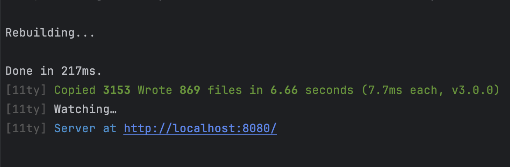
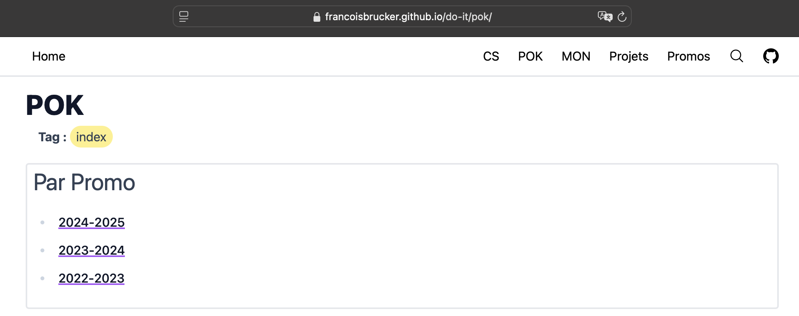
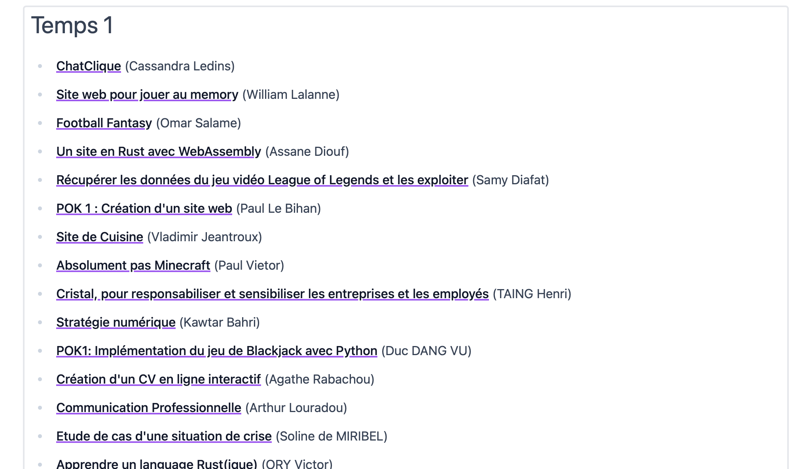
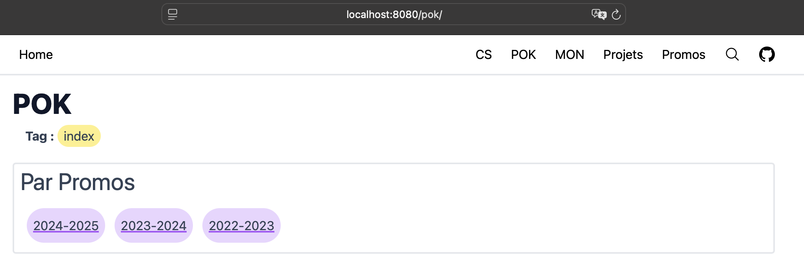
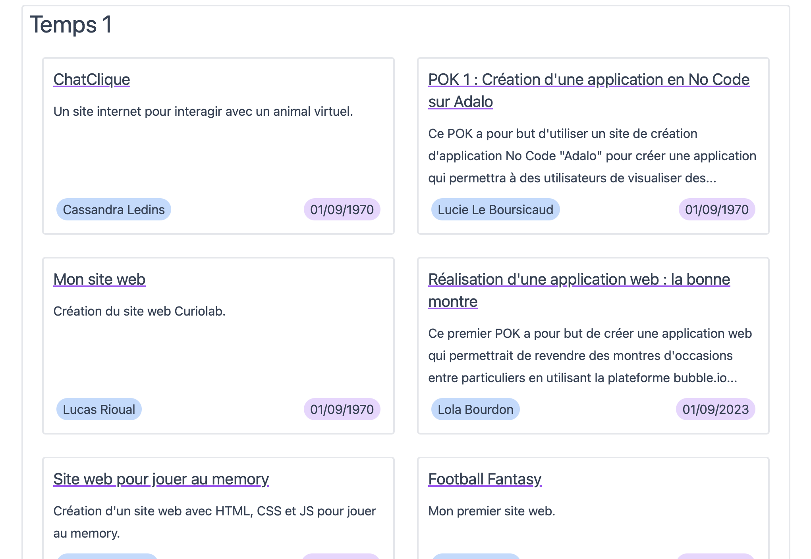

## Mise à jour du site de Do_It



Je renvoie bien entendu vers **le MON de Nicolas** : [Modification du site de Do-It](../../../../2022-2023/Bert-Nicolas/mon/modif-site-do-it)

… qui mentionne des requêtes esthétiques ! 
> _je ne suis pas designer donc ça sera pour quelqu'un d'autre_

On y est peut-être avec ce POK.



### Besoin, problématique

- A priori, problèmes de **lenteur** liés à pagesearch (le menu de recherche) ou au style (css et postcss)
- **Design** améliorable sur certains aspects
- Manque de **centralisation d’informations** (Drive + Site pas forcément pratique)
- **Séparation des années**

### Solutions envisagées

1. Mise à jour majeure de 11ty (3.0 sortis le 2 octobre - voir le changelog)
2. Rechercher les concurrents à 11ty
3. Fix de performance sur pagesearch et sur la compilation des styles
4. Faire des sous repos indépendants chaque année, mais qui peuvent se combiner (chercher comment)
5. Séparer data et statique

### Alternatives

Une analyse de l’existant nous permettra de faire des choix techniques. On comparera la popularité des différents projets concurrents à 11ty (utilisé actuellement) à l’aide du nombre de personnes suivant le projet sur GitHub et représenté avec des étoiles ⭐.

[https://jekyllrb.com](https://jekyllrb.com/) (JS) 49000 ⭐ [GitHub](https://github.com/jekyll/jekyll)

[https://www.11ty.dev](https://www.11ty.dev/) (JS) 17000 ⭐ [GitHub](https://github.com/11ty/eleventy/)

[https://gohugo.io](https://gohugo.io/) (Go) 75000 ⭐ [GitHub](https://github.com/gohugoio/hugo)

[https://getpelican.com](https://getpelican.com/) (Python) 12500 ⭐ [GitHub](https://github.com/getpelican/pelican)

[https://www.getzola.org](https://www.getzola.org/) (JS) 13600 ⭐ [GitHub](https://github.com/getzola/zola)

Comparaison des alternatives :
https://www.abdullahyahya.com/2022/06/generate-a-static-website-with-11ty-eleventy/

### Migration

Pour poursuivre ce travail, j’ai essayé de compiler le site actuel avec GoHugo, l’outil qui semblait le plus prometteur pour construire un site statique. Malheureusement, les fichiers de templating de Eleventy rendent l’opération plus compliquée que de copier un répertoire.

Un inconvénient majeur de GoHugo réside dans le langage de programmation utilisé (Go), qui implique de faire changer à tous les utilisateurs leur environnement d’exécution.

On laissera donc GoHugo de côté pour le moment.

### Réunion avec F. Brucker

Pour continuer, nous avons pu nous entretenir brièvement pour cibler le besoin précis. À l’issue de cette réunion, je note quelques points importants :

- Fork le projet actuel en 11ty 3.0 (Un fork est une branche du projet git que je peux utiliser avec toutes les permissions sur mon propre repository. Voir le MON à suivre sur l’Open Source pour en savoir plus.)
- Deux sites : un pour les ressources communes (CS, contribuer au site, etc.) contenant en plus les archives des autres années et un autre pour la promo courante
- Ou bien un site générique et un petit site par promo, séparés en projets distincts
- Étudier la question des permaliens pour que les redirections ne se brisent pas lors de cette migration

## Améliorer les performances

### Correction du site actuel

Nous l’avons exprimé au départ, deux modules sont suspectés de provoquer des lenteurs dans la compilation du site actuel : soit **pagesearch**, soit le **style**. Pour isoler les causes, nous allons mener des tests de performances en désactivant ces paramètres dans le fichier de configuration `.eleventy.js`. Après la désactivation des modules, on constate que pagesearch a finalement un impact mineur. Nous allons donc enquêter du côté des styles, et un détail retient mon attention : le compilateur postcss copie énormément de fichiers en amont. Changeons la configuration de tailwind pour remédier à ce problème : 



```jsx
module.exports = {
    content: [
        "./src/assets/stylesheets/*.{html,js,njk}",
        "./src/*.{html,js,njk}",
        "./src/_includes/**/*.{html,js,njk}",
        "./src/cs/**/*.{html,js,njk}",
        "./src/mon/**/*.{html,js,njk}",
        "./src/pok/**/*.{html,js,njk}",
        "./config/markdown/shortcodes/quotes/!(index).js"
    ],
    theme: {
      extend: {},
    },
    plugins: [
      require('@tailwindcss/typography'),
    ],
    
  }
```



En réduisant ainsi la quantité de fichiers à compiler avec tailwind, on essaye de limiter les chargements en mémoire impliqués par la compilation.

#### Tests de performance




https://v2.11ty.dev/docs/debugging/

https://v2.11ty.dev/docs/debug-performance/





Avec le site actuel, en tapant ces commandes :

```bash
$ DEBUG=Eleventy:Benchmark* npx @11ty/eleventy
$ grep -v " 0%" benchmark_1.log
```
```
Eleventy:Benchmark Benchmark  14306ms  25%   704× (Configuration) "eleventyNavigationBreadcrumb" Nunjucks Filter +0ms
Eleventy:Benchmark Benchmark  54014ms  95%     3× (Aggregate) Searching the file system (passthrough) +0ms
Eleventy:Benchmark Benchmark    313ms   1%  3668× (Aggregate) Template Compile +0ms
Eleventy:Benchmark Benchmark  38261ms  68%  3664× (Aggregate) Render +0ms
Eleventy:Benchmark Benchmark  54328ms  96%  2776× (Aggregate) Passthrough Copy File +0ms
Eleventy:Benchmark Benchmark  38082ms  67%     1× (Aggregate) > Render > ./src/assets/stylesheets/main.css +0ms
Eleventy:Benchmark Benchmark  14448ms  26%   778× (Aggregate) Template Write +0ms
[11ty] Copied 2776 files / Wrote 778 files in 56.69 seconds (72.9ms each, v2.0.1)
```

En appliquant la correction sur `tailwind.config.js` :

```
Eleventy:Benchmark Benchmark  14581ms  74%   704× (Configuration) "eleventyNavigationBreadcrumb" Nunjucks Filter +0ms
Eleventy:Benchmark Benchmark  16633ms  84%     3× (Aggregate) Searching the file system (passthrough) +1ms
Eleventy:Benchmark Benchmark    116ms   1%   787× (Aggregate) Template Read +0ms
Eleventy:Benchmark Benchmark    411ms   2%  3668× (Aggregate) Template Compile +0ms
Eleventy:Benchmark Benchmark    395ms   2%  3664× (Aggregate) Render +0ms
Eleventy:Benchmark Benchmark    209ms   1%     1× (Aggregate) > Compile > ./src/assets/stylesheets/main.css +0ms
Eleventy:Benchmark Benchmark    209ms   1%     1× (Aggregate) Engine (css) Init +0ms
Eleventy:Benchmark Benchmark  16866ms  85%  2776× (Aggregate) Passthrough Copy File +0ms
Eleventy:Benchmark Benchmark    228ms   1%     1× (Aggregate) > Render > ./src/assets/stylesheets/main.css +0ms
Eleventy:Benchmark Benchmark  14710ms  74%   778× (Aggregate) Template Write +0ms
[11ty] Copied 2776 files / Wrote 778 files in 19.85 seconds (25.5ms each, v2.0.1)
```

Avec la désactivation de pagesearch :

```
Eleventy:Benchmark Benchmark  14681ms  85%   704× (Configuration) "eleventyNavigationBreadcrumb" Nunjucks Filter +0ms
Eleventy:Benchmark Benchmark  16626ms  96%     3× (Aggregate) Searching the file system (passthrough) +0ms
Eleventy:Benchmark Benchmark    110ms   1%   787× (Aggregate) Template Read +0ms
Eleventy:Benchmark Benchmark    379ms   2%  3668× (Aggregate) Template Compile +0ms
Eleventy:Benchmark Benchmark    346ms   2%  3664× (Aggregate) Render +0ms
Eleventy:Benchmark Benchmark    183ms   1%     1× (Aggregate) > Compile > ./src/assets/stylesheets/main.css +0ms
Eleventy:Benchmark Benchmark    183ms   1%     1× (Aggregate) Engine (css) Init +0ms
Eleventy:Benchmark Benchmark  16740ms  97%  2776× (Aggregate) Passthrough Copy File +0ms
Eleventy:Benchmark Benchmark    204ms   1%     1× (Aggregate) > Render > ./src/assets/stylesheets/main.css +0ms
Eleventy:Benchmark Benchmark  14810ms  85%   778× (Aggregate) Template Write +0ms
[11ty] Copied 2776 files / Wrote 778 files in 17.38 seconds (22.3ms each, v2.0.1)
```

Pas de gain significatif pour cette modification. Laissons pagesearch de côté comme prévu.



Réduction de **54** à **17 secondes** sur le passe plat de fichiers et la compilation tailwind.

Dernière étape pour réduire le temps de compilation : supprimer le **système de navigation** lors du développement (n'affectant pas la GitHub Action).

> Ainsi :
> 
> <div class="quote relative  py-2 drop-shadow rounded rounded-tl-none rounded-bl-none border-solid border-l-8 border-purple-500 bg-purple-100">
> <svg class="absolute w-7 h-7 pl-1 pt-0.5 pb-0.5 text-purple-500" xmlns="http://www.w3.org/2000/svg" fill="none" viewBox="0 0 24 24" stroke="currentColor" stroke-width="2">
>  <path stroke-linecap="round" stroke-linejoin="round" d="M5 19a2 2 0 01-2-2V7a2 2 0 012-2h4l2 2h4a2 2 0 012 2v1M5 19h14a2 2 0 002-2v-5a2 2 0 00-2-2H9a2 2 0 00-2 2v5a2 2 0 01-2 2z"></path>
> </svg>
> <div class="pl-8 mr-8">
> <a href="/do-it/promos/">Promotions</a><span class="px-1">/</span><a href="/do-it/promos/2024-2025/">2024-2025</a><span class="px-1">/</span><a href="/do-it/promos/2024-2025/Louradou-Arthur/">Arthur Louradou</a><span class="px-1">/</span><a href="/do-it/promos/2024-2025/Louradou-Arthur/pok/">POKs</a><span class="px-1">/</span><a href="/do-it/promos/2024-2025/Louradou-Arthur/pok/temps-1bis/">Refonte du site de Do_It : Eleventy</a>
> </div></div>
> 
> Devient :
> 
> <div class="quote relative  py-2 drop-shadow rounded rounded-tl-none rounded-bl-none border-solid border-l-8 border-purple-500 bg-purple-100">
> <svg class="absolute w-7 h-7 pl-1 pt-0.5 pb-0.5 text-purple-500" xmlns="http://www.w3.org/2000/svg" fill="none" viewBox="0 0 24 24" stroke="currentColor" stroke-width="2">
>   <path stroke-linecap="round" stroke-linejoin="round" d="M5 19a2 2 0 01-2-2V7a2 2 0 012-2h4l2 2h4a2 2 0 012 2v1M5 19h14a2 2 0 002-2v-5a2 2 0 00-2-2H9a2 2 0 00-2 2v5a2 2 0 01-2 2z"></path>
> </svg>
> <div class="pl-8 mr-8">
>         <span class="px-1">
>             <i>Navigation disponible uniquement en production</i>
>             <a class="relative group cursor-help" target="_blank" href="https://www.11ty.dev/docs/environment-vars/">
>                 <svg class="inline-block h-[1.2em] w-[1em] pb-[3px]" xmlns="http://www.w3.org/2000/svg" x="0px" y="0px" width="100" height="100" viewBox="0 0 32 32"><path d="M 16 3 C 8.832031 3 3 8.832031 3 16 C 3 23.167969 8.832031 29 16 29 C 23.167969 29 29 23.167969 29 16 C 29 8.832031 23.167969 3 16 3 Z M 16 5 C 22.085938 5 27 9.914063 27 16 C 27 22.085938 22.085938 27 16 27 C 9.914063 27 5 22.085938 5 16 C 5 9.914063 9.914063 5 16 5 Z M 15 10 L 15 12 L 17 12 L 17 10 Z M 15 14 L 15 22 L 17 22 L 17 14 Z"></path></svg>
>                 <span id="i-tooltip" class="absolute left-0 bottom-full mb-2 w-max bg-purple-500 text-white text-sm rounded p-1 hidden group-hover:block transition-opacity duration-200">
>                     En local, définir la variable d'environnement `NAV=true` <i>(cliquer pour ouvir la doc)</i>
>                 </span>
>             </a>
>         </span>
>         <script>
>             let tooltip = document.getElementById('i-tooltip');
>             tooltip.preventDefault();
>         </script>
> </div></div>
> 

...mais on tombe à **7 secondes** de compilation du site en ne recalculant pas tous les chemins récursivement pour chaque fichier. 🎉





Pour activer tout de même le système de navigation comme avant, le plus simple est d'exécuter `npm run serve-nav`
(sur Linux et Mac), qui défini la variable d'environnement `NAV=true`.

En production, la compilation se déroule de la même façon que dans la version précédente.




## Mise à jour majeure vers Eleventy 3.0

### Réalisation

La mise à jour vers la **version 3.0 de Eleventy** (sortie le 02/10/2024) implique la remise à zéro de **tous les fichiers de configuration**. Cela inclus le fichier  `.eleventy.js` mais aussi ses diverses dépendances pour les rendre compatibles avec une version plus moderne de javascript : ESM scripts. Les plugins utilisés par le site ont donc été désactivés dans un premier temps pour compiler le tout étape par étape.


**ESM Script**, par opposition à CommonJS, est un ensemble de méthodes récentes sur JavaScript améliorant la façon dont sont gérés les modules. Concrètement, cela impacte la manière dont on importe les fichiers : pour organiser et réutiliser du code via `import` et `export`.


### Le style : Tailwind

La plus grosse difficulté résida dans la mise à jour de Tailwindcss, une bibliothèque CSS permettant de styliser rapidement et efficacement les éléments HTML. La mise à jour vers la version 3.0 d'Eleventy a nécessité une reconfiguration complète de l'intégration de Tailwind dans le projet. Cela a impliqué la modification des fichiers de configuration de Tailwind et l'ajustement des imports dans les fichiers de style principaux.

## La suite… Sprint 2

- Corriger les bugs qui surviennent notamment avec les balises de résumés dans les projets
- Initialiser un nouveau git avec des sous modules
- Voir si on peut rendre autonome en local un sous projet qui ne comprend pas le site complet, mais qui compile avec un projet “hôte”


## Formattage du git


Une étape clé pour ce projet est la faculté pour les utilisateurs de **cloner un projet plus petit** et ne concernant que la **promotion courante**. Nous allons par la même occasion **optimiser** les différentes arborescences des promotions diplômées pour supprimer les fichiers volumineux et inutilisés en particulier.



[Création de sous repos git](./creation_sous_repo_git)


<br />


Pour l’utilisateur, il faut retenir le contenu de ce mémo pour cloner uniquement la promo 2024-2025, par exemple :


```bash
git clone --no-recurse-submodules https://github.com/alouradou/do-it.git
cd do-it
git submodule init src/promos/2024-2025
git submodule update src/promos/2024-2025
```

Il peut ensuite à loisir lancer le projet dont l’arborescence n’a pas changé. Il sera juste plus léger !

## Style

Une partie importante de ce projet concernait la refonte du style, notamment pour la partie POK & MON sur laquelle j’ai remarqué quelques axes d’amélioration.

1. La liste des utilisateurs
2. La liste des POK & MON par temps

Dans l’ensemble, l’affichage des listes de données se complexifie avec le temps, obligeant parfois à faire un `Ctrl + F` pour parvenir à trouver ce que l’on cherche.



Je propose une résolution de cette manière :



|                                              Avant                                               |                                             Après                                             |
|:------------------------------------------------------------------------------------------------:|:---------------------------------------------------------------------------------------------:|
|  |  |

De nombreuses modifications mineures ont été adopées itérativement, notamment dans la structure du projet Eleventy, en profitant des connaissances acquises durant sa migration.

## Conclusions et perspectives



J’ai laissé [un formulaire](https://forms.gle/WB6ozLmFAXgxki7EA) pour toute modification solicitée par les élèves ou les professeurs en ce qui concerne l’expérience et l’interface utilisateur ainsi adoptée.



Ainsi, conformément à l’étude des besoins, ce POK a été l’occasion de résoudre des problèmes majeurs qui freinaient les élèves dans leur utilisation du site Do_It.

J'en retire personnellement une maitrise approfondie d'une technologie pratique : Eleventy.
Je pense utiliser celle-ci pour des petits projets de site statiques à l'avenir, tant l'expérience en JavaScript est devenu fluide.

Finalement, il reste à **migrer le repository git** vers une structure modulaire, 
mais nous avons pris la décision de reporter cette opération à la fin de l’année pour ne pas perturber le fonctionnement de la promotion actuelle. 
À l’issue de l’année, il faudra reprendre les notes sur la [création de sous repos git](./creation_sous_repo_git)
pour migrer le site actuel vers cette nouvelle structure.



| Temps | Tâche                                        |
|-------|----------------------------------------------|
| 2h    | Étude des solutions concurrentes à Eleventy  |
| 1h    | Tentative de migration sur GoHugo            |
| 3h    | Tests de performances                        |
| 3h    | Migration Eleventy 3.0                       |
| 5h    | Étude de la taille du projet git             |
| 1h    | Comprendre Tailwind                          |
| 5h    | Adoption du style par itérations successives |

