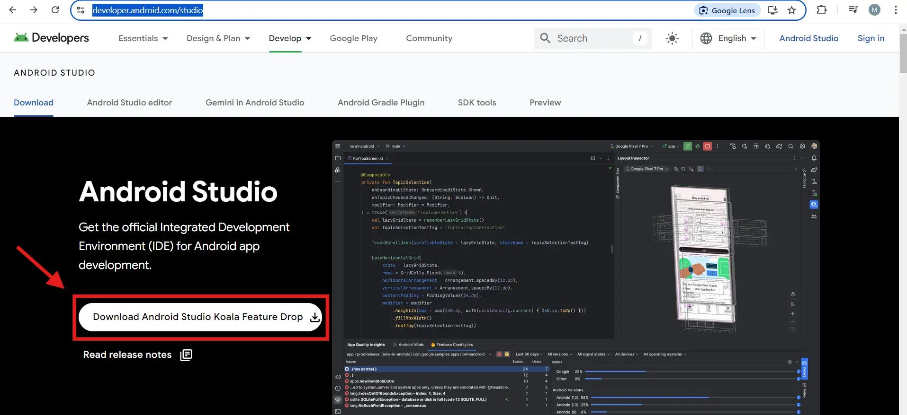
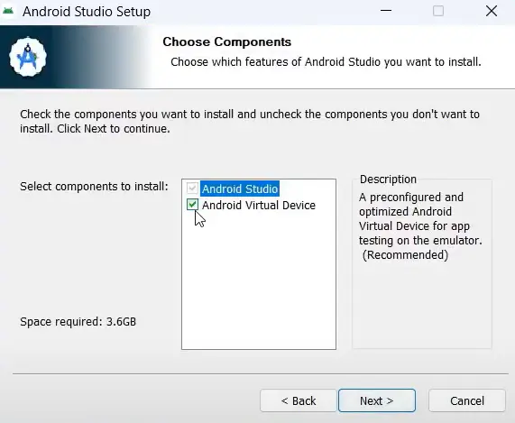
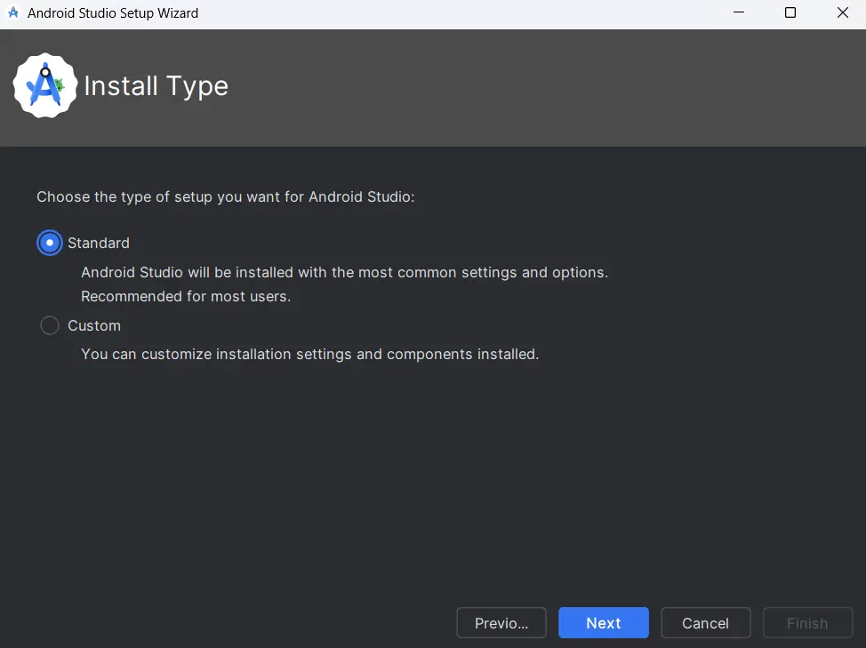
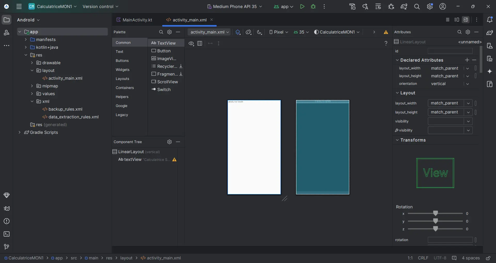



Il n'y a pas de prérequis pour ce MON




Les lien utiles pour la compréhension de celui-ci.



## Sommaire

- [Résumé](#résumé)
- [Qu'est-ce qu'une application ?](#quest-ce-quune-application)
- [Qu'est-ce qu'un système d'exploitation ?](#quest-ce-quun-système-dexploitation)
- [Les Approches de Développement d'Applications Mobiles](#les-approches-de-développement-dapplications-mobiles)
- [Émulateurs](#émulateurs)
- [Cas pratique](#cas-pratique)
- [Bibliographie](#bibliographie)

<a name="résumé">
<h2> Résumé </h2>
</a>

Cette étude a pour but de me lancer dans le monde du développement d'applications mobiles.

Avec le contenu appris tout au long de ce MON, j'espère avoir suffisamment de connaissances pour développer ma propre application mobile sur POK2.

Ce MON couvrira les principes du développement mobile et se terminera par un cas pratique simple : la création d'une calculatrice simplifiée pour additionner, soustraire, multiplier ou diviser deux nombres.

<a name="quest-ce-quune-application">
<h2> Qu'est-ce qu'une application ? </h2>
</a>

Les applications ( souvent appelées « apps ») sont des logiciels qui regroupent certaines fonctionnalités permettant d'**effectuer des tâches spécifiques sur un appareil**, tel qu'un ordinateur, un smartphone ou une tablette. Leur objectif principal est d'appliquer une série d'instructions qui **résolvent des problèmes ou facilitent une activité pour l'utilisateur**.

### Desktop Apps X Web Apps X Mobile Apps

Il existe de nombreux types d'applications, mais les plus courants sont les desktop apps, les web apps et les mobile apps

Chacune d'entre elles présente des caractéristiques spécifiques, ainsi que des avantages et des inconvénients qui doivent être pris en compte lors du choix de l'application à utiliser.

#### Desktop Apps

Les applications desktop sont des « programmes informatiques » qui sont directement installés sur le disque dur et fonctionnent indépendamment d'un navigateur.

Ils sont particulièrement utiles pour le travail hors ligne ou l'utilisation de fonctions spécifiques du [système d'exploitation](#quest-ce-quun-système-dexploitation). Mais elles présentent l'inconvénient d'être limitées à l'appareil sur lequel elles sont installées et d'avoir des mises à jour régulières qui doivent être téléchargées, ce qui peut prendre du temps et s'avérer peu pratique.

#### Web Apps

Les applications web sont exécutées à partir de n'importe quel navigateur internet et n'ont pas besoin d'être téléchargées ou installées. Pour les utiliser, il suffit d'avoir accès à un navigateur web, ce qui signifie qu'elles peuvent être exécutées dans n'importe quel [système d'exploitation](#quest-ce-quun-système-dexploitation), ce qui les rend intrinsèquement multiplateformes (nom que l'on donne aux applications qui fonctionnent dans plus d'un système d'exploitation).

Il est également important de ne pas confondre les applications web et les sites web. De manière simplifiée, les sites web sont principalement informatifs et présentent un contenu statique. Les interactions avec les utilisateurs sont typiquement basiques, comme cliquer sur des liens ou faire défiler la page.

Les applications web, en plus de présenter du contenu, offrent aux utilisateurs des services spécifiques et des possibilités d'interaction. Il peut s'agir d'inscriptions, de réservations, d'achats et de communications. Elles peuvent également s'intégrer à d'autres services (par exemple, les paiements).

Leurs principaux avantages sont qu'ils sont multiplateformes, qu'ils disposent de mises à jour automatiques appliquées côté serveur et qu'ils n'utilisent pas beaucoup de ressources de l'appareil (puisque leurs principales opérations sont effectuées sur le serveur).

En revanche, ils offrent une fonctionnalité hors ligne limitée et ne sont pas totalement intégrés à l'appareil utilisé (ils ont un accès restreint à certaines fonctions telles que le GPS, l'appareil photo, etc.)

#### Mobile Apps

Les applications mobiles sont des **applications projetées et installées sur des appareils mobiles** (smartphones et tablettes). Elles peuvent généralement être téléchargées et installées à partir de plateformes telles que App Store et Google Play. Elles sont conçus pour offrir une expérience conviviale sur les petits écrans et pour les interactions tactiles.

Ses principales avantages sont les suivants :
- **Richesse fonctionnelle** : Les applications mobiles (en particulier les applications natives) ont un accès complet aux ressources de l'appareil, comme la caméra, le GPS, le microfone, etc. Il en résulte une expérience optimale pour l'utilisateur.
- **Performance** : Les applications mobiles peuvent offrir de meilleures performances et des temps de chargement plus rapides puisqu'elles sont installées directement sur l'appareil de l'utilisateur.
- **Accès hors ligne** : Les applications mobiles peuvent fonctionner hors ligne ou avec une connectivité limitée.
- **Possibilités d'interaction avec l'utilisateur** : Les applications mobiles peuvent utiliser divers gestes et interactions tels que le toucher, le glissement, le défilement et la secousse, ce qui permet d'obtenir des interfaces utilisateur plus intuitives et plus avancées.

En revanche, les principaux inconvénients sont les suivants :

- **Coût, temps de développement et complexité de la maintenance** : S'il est nécessaire de développer pour plusieurs plateformes (iOS et Android), le coût, le temps de développement et la complexité de la maintenance augmentent, car elles nécessitent généralement des versions distinctes.
- **Les boutiques d'applications** : Bien que les boutiques d'applications constituent un canal de distribution efficace, elles imposent également des règles strictes, des frais de publication et peuvent rejeter les applications et les mises à jour qui ne répondent pas à leurs normes.
- **Espace de stockage sur l'appareil** : Les utilisateurs doivent télécharger et installer l'application, ce qui prend de la place sur l'appareil et peut décourager l'installation.

<a name="quest-ce-quun-système-dexploitation">
<h2> Qu'est-ce qu'un système d'exploitation ? </h2>
</a>

Les applications s'exécutent dans des système d'exploitation (***Operating Systems* (OS)**), qui sont les logiciels les plus importants à l'intérieur d'un appareil. Un OS **gère la mémoire et les processus de l'appareil, ainsi que l'ensemble de ses softwares et de son hardware.**

### iOS X Android

Les systèmes d'exploitation les plus populaires et les plus utilisés sont Android OS et Apple iOS. Vous trouverez ci-dessous un tableau comparatif simple entre les deux systèmes :

| Système d'Exploitation |	Entreprise/Développeur	| Langues de Développement |	App Store	| Popularité |
| :-----------------: | :-------------------: | :----------------: | :-----------------: | :----------: |
|**Android** | Google	| Java, Kotlin |	Google Play Store	| Élevée (au niveau mondial) |
| **iOS**	| Apple	| Swift, Objective-C	| Apple App Store	| Élevée (États-Unis, Europe) |

Comme vous pouvez le voir dans le tableau ci-dessus, ces systèmes ont des **langages de programmation différents**, ce qui a un impact direct sur le choix du langage à utiliser pour programmer une nouvelle application. Mais plus spécifiquement, le fait que chaque système d'exploitation soit conçu et agisse différemment a un impact direct sur l'**approche de développement d'applications mobiles à adopter par un développeur mobile**.

<a name="les-approches-de-développement-dapplications-mobiles">
<h2> Les Approches de Développement d'Applications Mobiles </h2>
</a>

Dans le développement d'applications mobiles, il existe plusieurs approches que les développeurs peuvent adopter, chacune avec ses avantages et inconvénients. Dans cette étude, je me suis concentré sur les **approches « native » et « cross-platform »**.

### Native Develpment

Le développement natif implique la création d'**applications spécifiques à un système d'exploitation mobile** en utilisant les outils et langages officiels de la plateforme. Cela signifie développer une application distincte pour iOS (en utilisant Swift ou Objective-C et l'IDE Xcode) et une autre pour Android (en utilisant Java ou Kotlin et l'IDE Android Studio).

Ses avantages sont :

- **Performance supérieure** : Les applications natives ont un accès complet aux ressources et API de la plateforme, ce qui se traduit par de meilleures performances et une meilleure intégration.
- **Expérience Utilisateur (UX)** : Amélioration de l'expérience utilisateur, car les applications suivent les directives de conception spécifiques à la plateforme, offrant une interface intuitive et familière.
- **Accès complet aux ressources** : Permet d'utiliser toutes les fonctionnalités de l'appareil, telles que les capteurs et les services natifs, avec une grande efficacité.
  
Mais elle présente également des inconvénients :
- **Coût de développement** : Plus coûteux et plus long, car il nécessite le développement de deux applications distinctes (une pour chaque plateforme). Autrement dit, il est nécessaire d'avoir une équipe pour chaque plateforme afin de développer une même application.
- **Maintenance** : Les mises à jour et la maintenance doivent être effectuées séparément pour chaque plateforme, augmentant ainsi le coût et les efforts.

### Cross-Platform Development

Le développement cross-platform permet de créer des applications fonctionnant sur plusieurs plateformes à partir d'une seule base de code. Cela se fait en utilisant des [frameworks](#frameworks) qui abstraient les différences entre les plateformes.

Ses avantages sont :

- **Code unique** : Réduit le temps et le coût de développement, car un seul code est utilisé pour les deux plateformes.
- **Développement plus rapide** : La capacité de partager une base de code accélère le processus de développement et de lancement.
- **Maintenance facilitée** : Facilite la maintenance et les mises à jour, car les modifications sont apportées à une seule base de code.

Mais ses inconvénients sont :
- **Performance inférieure** : Bien que proche du natif, elle peut ne pas atteindre le même niveau de performance que les applications natives, surtout en cas d'utilisation intensive.
- **Accès limité aux ressources** : Il peut y avoir des limitations dans l'accès à certaines fonctionnalités et API spécifiques de l'appareil.

<a name="frameworks">
<h4> Frameworks </h4>
</a>

Les frameworks sont des structures de développement qui fournissent un **ensemble d'outils, de bibliothèques et de modèles de code prédéfinis pour aider les développeurs à créer des logiciels de manière plus rapide, plus organisée et plus efficace**. Ils offrent une base sur laquelle les développeurs peuvent construire leurs applications ou leurs systèmes, ce qui leur permet de se concentrer davantage sur la logique et la fonctionnalité du logiciel plutôt que d'avoir à tout construire à partir de zéro.

**Ils sont différents des bibliothèques**.
Les bibliothèques sont des collections de codes réutilisables que les développeurs appellent explicitement dans leur code pour exécuter une fonction spécifique. En d'autres termes, le contrôle est entre les mains du développeur, qui décide quand et comment utiliser la bibliothèque.
Quant aux frameworks, ils définissent la structure et contrôlent le flux de l'application. Dans ce cas, c'est le framework qui « appelle » le code du développeur à des moments précis. Au lieu que le développeur contrôle le flux principal du programme, il met en œuvre des parties du code que le framework exécute en réponse à certains événements.

Les deux principaux frameworks utilisés sur le marché pour le développement multiplateforme d'applications mobiles sont **React Native** (développé par FaceBook) et **Flutter** (développé par Google). 

### Comparation Final

Pour conclure, les principales différences entre ces approches de développement mobile se trouvent dans le tableau ci-dessous.

| **Attribut** | **Native (Apple / Google)** | **Cross-Platform (React Native)** | **Cross-Platform (Fultter)** |
| :----------: | :-------------------------: | :-------------------------------: | :---------------: |
| **Framework Owner**      | Apple / Google | Facebook   | Google    |
| **UI / UX**              | Native         | Native     | Bespoke   |
| **Development Speed**    | Slow           | Fast       | Fast      |
| **Maintenance Cost**     | High           | Low        | Medium    |
| **Performance**          | Very High      | High       | High      |
| **Programming Language** | Swift / Java   | JavaScript | Dart      |
| **Maturity**             | Very Mature    | Mature     | Young     |
| **Feature Access**       | Complete       | Complete   | Complete  |
| **Open Source**          | No             | Yes        | Yes       |

<a name="émulateurs">
<h2> Émulateurs </h2>
</a>

Émuler quelque chose, c'est le copier ou le reproduire. Dans l'univers du développement d'applications, un émulateur est un matériel ou un logiciel qui **permet à un ordinateur d'en imiter un autre**. Les applications mobiles sont conçues pour fonctionner sur des appareils mobiles, mais elles sont codées à l'aide d'ordinateurs. Ainsi, afin de tester le code, les développeurs ont besoin d'un moyen d'**émuler les systèmes d'exploitation mobiles comme iOS ou Android sur leurs ordinateurs**.

L'émulateur donne accès à toutes les capacités requises au niveau du système pour reproduire l'appareil mobile, y compris la quantité de RAM ou de mémoire de travail, le type et la vitesse du processeur, la taille et la résolution de l'écran et la quantité de stockage de fichiers locaux disponible. Les émulateurs font gagner du temps et de l'argent à l'équipe de développement en lui permettant de mettre en œuvre différents environnements de test qui reproduisent de manière fiable les appareils de l'utilisateur final. 

Bien que les émulateurs soient une solution puissante, ils ont certaines limites, ce qui signifie que **même les meilleurs émulateurs ne peuvent pas émuler certains aspects de l'environnement mobile natif**. C'est pourquoi il est d'usage que les développeurs testent leurs applications à la fois sur l'environnement émulé et sur des appareils physiques, dans la mesure du possible. 

Généralement, les IDE's et frameworks incluent un émulateur ou en suggèrent un.

<a name="cas-pratique">
<h2> Cas pratique </h2>
</a>

Pour finaliser cette étude, j'ai suivi [ce tutoriel](https://www.youtube.com/watch?v=tnKFHw8LOrM&list=PLcwp2fRcIXJVTScoTrGUmntyygrdXUGWt&index=7) pour créer une simple application en utilisant l'IDE Android Studio. J'ai pu installer les outils nécessaires et me familiariser un peu avec le monde du développement d'applications mobiles.

### Installation d'Android Studio Avec Émulateur

Pour installer cet IDE et certains de ses outils, rendez-vous sur le [site officiel](https://developer.android.com/studio) et cliquez sur le bouton ci-dessous.

Double-cliquez ensuite sur le fichier installé pour lancer le téléchargement. Lorsque vous arrivez à l'onglet « Check Components “, si vous souhaitez également télécharger l'émulateur AndroidStudio standard, cochez ” Android Virtual Device ».

Enfin, choisissez le dossier dans lequel vous souhaitez installer le logiciel et finalisez l'installation.

Une fois l'application installée, lors de la première utilisation, l'utilisateur est invité à choisir le type d'installation qu'il souhaite. Comme je suis encore une débutante et que je ne connais pas les possibilités de configuration, j'ai opté pour la configuration « standard ».

Vous devez ensuite accepter les conditions d'utilisation et voilà, l'IDE Android Studio est installé.

### Création de la Calculatrice

Dans le tutoriel, lorsque vous créez un nouveau projet, deux fichiers sont créés : **MainActivity.java et activity_main.xml**.
Le premier est l'endroit où nous écrivons le code avec les instructions sur ce qu'il faut faire dans chaque événement. Le second est un écran sur lequel nous pouvons ajouter les éléments visuels pour assembler l'application.

Dans mon cas, seul le premier fichier a été créé automatiquement, j'ai donc créé le second fichier manuellement dans un dossier « layouts ».

Une fois cela fait, j'ai simplement suivi les instructions et les codes écrits dans le tutoriel et le résultat final peut être vu dans la vidéo suivante.

### Résultat

<video width="200" controls>
  <source src="./assets/Resultat_MON1.webm" type="video/webm">
</video>

<a name="bibliographie">
<h2> Bibliographie </h2>
</a>

[Coursera : Introduction to Mobile Development (by Meta)](https://www.coursera.org/learn/intro-to-mobile-development) - Pour apprendre les concepts existants et créer une base

[Mobile app, web app, desktop app: know the difference!](https://mobitouch.net/blog/mobile-app-web-app-desktop-app-know-the-difference) - Pour comprendre les différences entre les types d'applications

[What is an operating system?](https://edu.gcfglobal.org/en/computerbasics/understanding-operating-systems/1/) - Pour comprendre ce qu'est un système d'exploitation

[What is the difference between a framework and a library?](https://www.youtube.com/watch?v=D_MO9vIRBcA) - Pour comprendre ce qu'est un Framework

[Choosing the best mobile app framework](https://www.youtube.com/watch?v=4m7msadL5iA) - Pour comprendre la différence entre certains des cadres existants

[Do You Know How Mobile Apps Are Released?](https://www.youtube.com/watch?v=RIX4ufelA58) - Pour comprendre le déroulement général de la publication d'une application mobile et se faire une idée du rôle des boutiques d'applications dans ce processus.