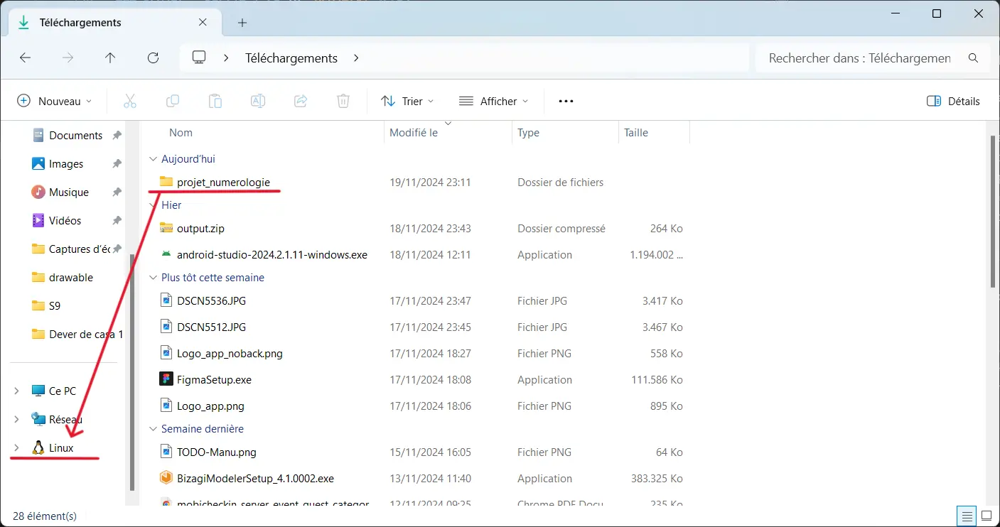
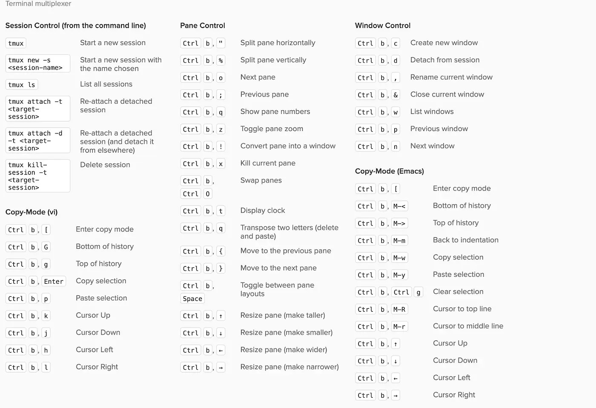



[Projet numérologie](https://francoisbrucker.github.io/cours_informatique/cours/web/projet-num%C3%A9rologie/)



## Sommaire

- [Résumé](#résumé)
- [Comment se Connecter au Serveur](#comment-se-connecter-au-serveur)
- [Configuration Bonus](#configuration-bonus)
- [Projet](#projet)
   - [Projet 1](#projet-1)
   - [Projet 2](#projet-2)
   - [Projet 3](#projet-3)
   - [Projet 4](#projet-4)
   - [Projet 5](#projet-5)


## Comment se Connecter au Serveur <a id="comment-se-connecter-au-serveur"></a>

### Installer WSL <a id="installer-wsl"></a>  

La première étape pour utiliser Linux sur Windows est d’installer WSL (Windows Subsystem for Linux). Pour cela, ouvrez le terminal et exécutez la commande suivante :  

```PowerShell
wsl --install
```  

Cette commande activera les fonctionnalités nécessaires pour exécuter WSL et installera par défaut la distribution Linux **Ubuntu**.  

Une fois l’installation terminée, vous devrez redémarrer votre ordinateur.  

Si vous rencontrez des problèmes pendant l’installation, consultez la [documentation officielle de WSL](https://learn.microsoft.com/en-us/windows/wsl/install) pour obtenir de l’aide.  

Après le redémarrage, Ubuntu se lancera automatiquement. À cette étape, vous pourrez configurer votre nom d’utilisateur. Il est conseillé de choisir un nom simple et qui correspond à votre propre nom.  


### Générer un agent et une clé <a id="generer-un-agent-et-une-cle"></a>  

Une fois le système Linux initialisé, il est nécessaire de configurer un **agent SSH** et de générer une clé pour s'authentifier auprès des serveurs.  

Un **agent SSH** est un programme qui gère vos clés privées et facilite l'authentification sur des serveurs sans avoir à saisir votre mot de passe à chaque fois. Il stocke les clés privées en mémoire de manière sécurisée et les utilise automatiquement lorsque cela est nécessaire.  

Les clés SSH se composent de deux parties :  
- **Clé privée** : Elle doit rester confidentielle, car elle sert à prouver votre identité.  
- **Clé publique** : Elle peut être partagée avec les serveurs pour qu’ils puissent vous authentifier.  

Voici les étapes pour configurer l'agent et générer vos clés :  

1. Lancez l’agent SSH avec la commande suivante :  
   ```bash
   eval "$(ssh-agent -s)"
   ```  
   Cette commande active l’agent, qui commencera à gérer vos clés.  

2. Générez une paire de clés (publique et privée) avec la commande :  
   ```bash
   ssh-keygen
   ```  
   Pendant l’exécution, il vous sera demandé de fournir un nom pour le fichier de clé et, éventuellement, de définir un mot de passe supplémentaire pour sécuriser la clé privée.  

3. Ajoutez la clé privée à l’agent SSH :  
   ```bash
   ssh-add
   ```  
   Cela permet à l’agent de stocker la clé privée en mémoire, ce qui simplifie son utilisation pour les connexions futures.  

Après avoir suivi ces étapes, vos clés seront prêtes à être utilisées pour des connexions sécurisées aux serveurs.  

### Comment se connecter au serveur de l'École <a id="comment-se-connecter-au-serveur-de-l-ecole"></a>

Tout d'abord, nous devons copier notre clé publique qui sera utilisée pour l'authentification. Suivez ces étapes :

1. Accédez au répertoire où vos clés SSH sont stockées :
   ```bash
   cd ~/.ssh
   ```

2. Affichez le contenu de la clé publique :
   ```bash
   cat id_rsa.pub
   ```

3. Copiez la sortie affichée dans le terminal (le contenu de votre clé publique).

Ensuite, nous allons nous connecter au serveur de l'École. Les ordinateurs de l'École ne sont accessibles que si vous êtes déjà connecté au réseau interne de l'établissement. Cependant, pour accéder au serveur à distance (par exemple depuis chez vous), vous devez passer par le serveur intermédiaire `sas1.ec-m.fr`, qui est accessible depuis Internet. Pour vous connecter à ce serveur, vous devrez utiliser votre identifiant de l'École.

La commande est la suivante :
```bash
ssh votre_identifiant@sas1.ec-m.fr
```

Par exemple, dans mon cas :
```bash
ssh mda-silveira@sas1.ec-m.fr
```

En exécutant cette commande, il vous sera demandé d'entrer votre mot de passe et d'accepter d'ajouter le serveur à la liste des hôtes connus (uniquement lors de la première connexion). Une fois la connexion établie avec le serveur `sas1`, nous devrons ajouter notre clé publique à la liste des clés autorisées :

1. Accédez au répertoire `.ssh` sur le serveur :
   ```bash
   cd ~/.ssh
   ```

2. Éditez le fichier `authorized_keys`, qui contient les clés publiques autorisées :
   ```bash
   nano authorized_keys
   ```

3. Dans l'éditeur de texte qui s'ouvre, collez votre clé publique copiée précédemment à la fin du fichier.

4. Pour enregistrer le fichier dans l'éditeur **nano**, suivez ces étapes :
   - Appuyez sur `Ctrl + O` pour sauvegarder.
   - Appuyez sur `Entrée` pour confirmer le nom du fichier.
   - Appuyez sur `Ctrl + X` pour fermer l'éditeur.

Désormais, le serveur `sas1` reconnaîtra votre clé publique, et vous pourrez vous y connecter sans avoir à entrer votre mot de passe.

Après avoir configuré la clé publique sur le serveur `sas1`, vous pouvez l'utiliser comme passerelle pour accéder aux autres ordinateurs de l'École. Par exemple, pour vous connecter à l'ordinateur `vauban43`, vous pouvez exécuter la commande suivante :
```bash
ssh vauban43
```

Notez que vous n’avez pas besoin de spécifier à nouveau votre identifiant, car il est déjà associé à la session active sur le serveur `sas1`. Le SSH utilisera automatiquement le même utilisateur pour établir la connexion avec l’ordinateur cible.

Pour le cours de Linux, nous devons nous connecter au serveur `aioli.ec-m.fr`. Cependant, l'accès à ce serveur nécessite une étape supplémentaire : vous devez envoyer votre **clé publique** (de votre identifiant de l'école) par e-mail à l'administrateur du serveur. L'administrateur utilisera cette clé pour créer un utilisateur associé à votre compte.

Une fois que l'administrateur aura terminé cette configuration, vous pourrez vous connecter directement au serveur `aioli`.

En suivant toutes ces étapes, vous serez prêt à démarrer les projets du cours. Pour commancer, nous allons `exit` des serveurs.


### Configuration Bonus <a id="configuration-bonus"></a>

Il est assez fastidieux de devoir taper tout le chemin pour se connecter à une machine, par exemple `votre_identifiant@sas1.ec-m.fr`. Heureusement, il existe une manière de simplifier ce processus.

Sur votre système Linux, dans votre compte utilisateur (sans être connecté à un serveur), vous pouvez créer un fichier de configuration dans `~/.ssh/config`. Dans ce fichier, ajoutez le code suivant (en personnalisant avec vos informations) :

```bash
Host nom_du_raccourci_souhaité
    HostName nom_de_la_machine
    User nom_de_l_utilisateur

Host nom_du_raccourci_souhaité
    Hostname nom_de_la_machine
    User nom_de_l_utilisateur
    ProxyJump nom_de_la_machine_intermediaire
```

#### Que se passe-t-il dans le fichier `config` ?

- **Host nom_du_raccourci_souhaité** : C'est la configuration d'un raccourci pour une machine distante. Lorsque vous tapez `ssh nom_du_raccourci_souhaité`, SSH utilise les configurations suivantes pour se connecter à la machine spécifiée.

- **HostName nom_de_la_machine** : Ici, vous définissez le nom complet ou l'adresse IP de la machine à laquelle vous souhaitez vous connecter. Lorsque vous utilisez un raccourci dans le champ `Host`, `HostName` est la machine réelle à laquelle vous vous connecterez.

- **User nom_de_l_utilisateur** : Ici, vous définissez le nom de l'utilisateur utilisé pour la connexion SSH. Plutôt que de taper le nom d'utilisateur à chaque fois, vous l'indiquez dans le fichier de configuration, et la connexion utilisera ce nom automatiquement.

- **ProxyJump nom_de_la_machine_intermediaire** : Si vous devez passer par une machine intermédiaire pour accéder à votre destination finale (comme dans le cas de serveurs avec des accès restreints), `ProxyJump` définit le "saut" vers cette machine intermédiaire. Cela signifie que vous pouvez accéder à des serveurs internes qui ne sont pas directement accessibles de l'extérieur en passant par une machine intermédiaire (également appelée "jump host").

Pour rendre cela plus clair, je vais partager mon propre fichier `~/.ssh/config` en exemple :

```bash
Host sas1
    HostName sas1.ec-m.fr
    User mda-silveira

Host aioli
    Hostname aioli.ec-m.fr
    User agastache
    ProxyJump sas1
```

Dans mon exemple :

1. **sas1** : Il s'agit du raccourci que j'ai utilisé pour me connecter au serveur `sas1.ec-m.fr` avec l'utilisateur `mda-silveira`. Lorsque j'exécute `ssh sas1`, le système sait qu'il doit se connecter à `sas1.ec-m.fr` et utiliser l'utilisateur `mda-silveira`.

2. **aioli** : De la même manière, `aioli` est un raccourci qui se connecte au serveur `aioli.ec-m.fr` avec l'utilisateur `agastache`. Cependant, lorsque j'utilise le raccourci `aioli`, le système se connecte d'abord au serveur `sas1.ec-m.fr` (grâce à `ProxyJump`), puis effectue le "saut" vers le serveur `aioli.ec-m.fr`. Cela est utile lorsque certaines machines ne peuvent pas être accessibles directement.

Avec cette configuration, vous simplifiez la vie. Plutôt que de taper `ssh mda-silveira@sas1.ec-m.fr` et `ssh agastache@aioli.ec-m.fr`, je peux simplement taper `ssh sas1` ou `ssh aioli` dans le terminal.


## Projet <a id="projet"></a>

Ce projet consiste à créer un site web qui associe chaque nom à un numéro en se basant sur une table de correspondance. Pour en savoir plus sur les détails du projet, consultez le [site du projet](https://francoisbrucker.github.io/cours_informatique/cours/web/projet-num%C3%A9rologie/).  

Le projet est divisé en cinq étapes, avec une complexité croissante. Chaque étape explore un aspect différent du développement web.

Dans ce **MON**, **je ne détaillerai pas la construction du code**, car cela est déjà bien expliqué sur le site du projet. L'objectif ici est de **montrer comment se connecter o serveur et comment récupérer le code prêt et l'exécuter sur le serveur**, afin qu'il soit mis **en ligne**.

Je recommande vivement, tout au long de la lecture de ce MON, de consulter également l'explication du code, car cela vous permettra de **mieux comprendre les concepts et la structure** du projet. De cette manière, vous aurez une vision complète et claire du fonctionnement du système, depuis sa mise en œuvre jusqu'à sa mise en ligne.


### Projet : Partie 1 <a id="projet-1"></a>  

Dans cette première partie du projet, nous avons mis en place tout ce qui est nécessaire pour le faire fonctionner côté **frontend**. La structure du projet à ce stade est la suivante :  

```
.
├── index.html
├── main.css
├── mes_tests.js
└── numérologie.js
```  

Pour cet exercice, axé sur les **bases du développement de services web** avec un focus particulier sur le **déploiement sur des serveurs**, nous n’allons pas nous concentrer sur la manière dont ce code a été écrit. L'objectif principal est de comprendre comment rendre ce site accessible sur le web.

Pour commencer, rendez-vous sur le [répertoire GitHub de ce projet](https://github.com/FrancoisBrucker/cours_informatique/tree/main/docs/src/cours/web/projet-num%C3%A9rologie/partie-1-front/niveau-1/num%C3%A9rologie) et téléchargez-le sur votre ordinateur.   

La première modification que nous allons effectuer concerne le fichier **`numérologie.js`**. Nous allons :  
1. Retirer l’accent du nom du fichier, en le renommant **`numerologie.js`**.  
2. Mettre à jour la référence à ce fichier dans **`index.html`** pour pointer vers **`numerologie.js`** au lieu de **`numérologie.js`**.  

Une fois ces ajustements faits, déplacez le dossier du projet vers votre environnement Linux.

  

#### Transférer le dossier vers le serveur souhaité 

Suivez les étapes ci-dessous pour transférer et configurer le projet sur le serveur final :  

1. **Compresser le dossier du projet**  
   Avant de transférer, nous allons compresser le dossier pour simplifier l’envoi :  
   ```bash
   tar czvf projet_numerologie.tgz projet_numerologie
   ```  

2. **Transférer le fichier compressé vers le serveur**  
   Dans cet exemple, nous utilisons le serveur **aioli**, mais il est nécessaire de passer par un serveur intermédiaire **sas1** pour y accéder.  

   - Transférez le fichier vers le serveur **aioli** ("directemente" grâce au fichier `~/.ssh/config`) :  
     ```bash
     scp projet_numerologie.tgz aioli:.
     ```  

   
3. **Décompresser le fichier sur le serveur final**  
   - Connectez-vous au serveur final **aioli** :  
     ```bash
     ssh aioli
     ```  

   - Extrayez le contenu du fichier compressé :  
     ```bash
     tar xzvf projet_numerologie.tgz
     ```  

   - Supprimez le fichier compressé du serveur final :  
     ```bash
     rm projet_numerologie.tgz
     ```  

Une fois ces étapes terminées, le projet sera décompressé et prêt à être mis en ligne sur le serveur final.  

Aqui está a versão traduzida e melhorada em francês:  

---

#### Mettre le projet en ligne

1. **Vérifier le port du serveur :**  
   Ouvrez votre navigateur et accédez à l’adresse de votre utilisateur :  
   ```  
   https://votre_utilisateur.aioli.ec-m.fr/  
   ```  
   Vous verrez probablement une erreur **502 Bad Gateway**, car aucun service n’est actuellement actif sur ce port.  

2. **Créer un test basique :**  
   - Connecté au serveur **aioli**, dans le répertoire `~/`, créez un dossier nommé `static` :  
     ```bash
     mkdir static
     ```  
   - Accédez à ce dossier :  
     ```bash
     cd static
     ```  
   - Créez un fichier `index.html` contenant le texte "Hello world" à l’aide d’un éditeur comme `nano` :  
     ```bash
     nano index.html
     ```  

   - Accédez au site statique de votre utilisateur :  
     ```  
     https://votre_utilisateur.aioli.ec-m.fr/static  
     ```  
     Vous devriez maintenant voir le texte **"Hello world"** dans le navigateur. Cela montre que le serveur est configuré pour afficher automatiquement le contenu statique existant.  

Pour afficher votre projet sur le site principal, suivez les étapes suivantes :  

1. **Démarrer le serveur local :**  
   - Accédez au répertoire de votre projet :  
     ```bash
     cd projet_numerologie
     ```  
   - Lancez un serveur HTTP avec la commande suivante :  
     ```bash
     python3 -m http.server --bind ::1 1100
     ```  
     *(Ici, 1100 correspond à ma port. Pour connaître votre port utilisateur, exécutez la commande `id` et regardez votre uid. Il est votre numéro de port.)*  

2. **Vérifier le fonctionnement :**  
   - Accédez au site principal de votre utilisateur :  
     ```  
     https://votre_utilisateur.aioli.ec-m.fr/  
     ```  
     Vous verrez désormais votre projet fonctionner.  

3. **Résoudre le problème de persistance :**  
   Si vous fermez le terminal et rafraîchissez la page, l’erreur **502** réapparaîtra. Cela se produit parce que le serveur doit continuer à fonctionner même lorsque le terminal est fermé.   

Pour que le site reste actif même après avoir quitté le terminal, nous utiliserons **tmux** (ou l’équivalent `screen`). **Tmux** permet d’exécuter des processus en arrière-plan de manière persistante sur le serveur.  

1. **Créer une session tmux :**  
   - Lancez une nouvelle session appelée `serveur_numerologie` :  
     ```bash
     tmux new -s serveur_numerologie
     ```  
     Une nouvelle fenêtre **tmux** s’ouvrira.  

2. **Exécuter le serveur dans tmux :**  
   - Dans la session **tmux**, lancez le serveur avec :  
     ```bash
     python3 -m http.server --bind ::1 1100
     ```  
   - Rafraîchissez le site dans votre navigateur pour vérifier qu’il fonctionne.  

3. **Quitter la session sans arrêter le processus :**  
   - Utilisez le raccourci `Ctrl + b`, suivi de `d` pour détacher la session **tmux** tout en gardant le serveur actif.  

4. **Lister les sessions actives :**  
   - Exécutez cette commande pour afficher les sessions tmux actives :  
     ```bash
     tmux ls
     ```  
     Vous verrez toutes les sessions en cours, y compris `serveur_numerologie`.

Voici une cheat sheet des commandes et raccourcis utiles pour **tmux** :



Avec ces étapes, vous avez mis votre premier site en ligne ! Ce projet est simple et entièrement en **frontend**. La prochaine étape consistera à intégrer un **backend** et à comprendre les ajustements nécessaires pour un site complet.  


### Projet : Partie 2 <a id="projet-2"></a>  

Avec l’ajout du backend, notre projet a maintenant la structure suivante :  

```
.
├── back
│   └── numérologie.js
├── index.js
├── package.json
└── static
    ├── index.html
    └── main.css
```

Nous allons commencer de la même manière que pour le projet précédent. Téléchargez le [projet sur GitHub](https://github.com/FrancoisBrucker/cours_informatique/tree/main/docs/src/cours/web/projet-num%C3%A9rologie/partie-2-serveur/num%C3%A9rologie) et nommez-le `projet_numerologie2`. Ensuite, nous retirerons l’accent sur le fichier `numérologie.js` et nous procéderons aux mêmes étapes que précédemment : compresser le dossier, le transférer sur le serveur **aioli** et le décompresser.

Ensuite, accédez au dossier du projet en exécutant `cd projet_numerologie2` et installez les dépendances nécessaires avec la commande :  
```bash
npm install
```

#### Ajustements dans le fichier `index.js`

Il y a quelques ajustements à faire dans le fichier `index.js` pour pouvoir l’exécuter correctement sur le serveur. Exécutez la commande suivante pour éditer le fichier :  
```bash
nano index.js
```

Voici les modifications à apporter dans le fichier :

1. Changez la ligne `const hostname = '127.0.0.1'` par :  
   ```javascript
   const hostname = '::1';
   ```

2. Changez la ligne `const port = 3000` par :  
   ```javascript
   const port = '1100';  // Notez que 1100 est le nombre de ma port, il est différent pour chacun.
   ```

3. Modifiez la ligne `app.use("/static", express.static(path.join(__dirname, '/static')))` par :  
   ```javascript
   app.use("/numerologie", express.static(path.join(__dirname,'static')));
   ```

Une fois ces modifications effectuées, vous pouvez enregistrer le fichier et tenter d’exécuter la commande :  
```bash
node index.js
```

Cependant, si cela ne fonctionne pas, il est probable que vous ayez un problème, car la **port** est déjà utilisée par votre site précédent. C'est dû au fait que **tmux** est en cours d'exécution et que le serveur de la partie 1 utilise déjà cette port. Pour résoudre ce problème, suivez ces étapes :  

#### Résoudre le problème de la port occupée

1. **Se connecter à la session tmux existante :**  
   Exécutez la commande suivante :  
   ```bash
   tmux a
   ```

2. **Fermer la session tmux en cours :**  
   - Appuyez sur `Ctrl + c` pour arrêter le serveur.
   - Puis, appuyez sur `Ctrl + d` pour quitter tmux.

Maintenant, vous pouvez de nouveau exécuter le serveur avec :  
```bash
node index.js
```

Cela devrait démarrer le serveur et l’afficher sur le site à l’adresse suivante :  
```  
https://votre_utilisateur.aioli.ec-m.fr/numerologie/
```  

Cependant, comme précédemment, si vous fermez le terminal, le site cessera de fonctionner. Pour le maintenir en ligne, suivez à nouveau la procédure avec **tmux** :

#### Garder le serveur en ligne avec tmux

1. **Créer une nouvelle session tmux :**  
   - Lancez une nouvelle session avec le nom `serveur_numerologie` :  
     ```bash
     tmux new -s serveur_numerologie
     ```  
     Une nouvelle fenêtre **tmux** s’ouvrira.  

2. **Exécuter le serveur dans tmux :**  
   - Dans la session tmux, exécutez le serveur avec :  
     ```bash
     node index.js
     ```  
   - Rafraîchissez la page de votre site pour vérifier que le projet fonctionne correctement.  

3. **Quitter la session sans arrêter le serveur :**  
   - Pour détacher la session tmux et la laisser tourner en arrière-plan, appuyez sur `Ctrl + b`, puis sur `d`.  

Une fois cela fait, le projet fonctionnera en permanence, même si vous fermez votre terminal. 

Ainsi, la deuxième partie du projet est terminée. Vous avez réussi à mettre en ligne un projet avec un backend fonctionnel. Vous pouvez maintenant passer à l’étape suivante du projet.


### Projet : Partie 3 <a id="projet-3"></a>

Dans la troisième partie du projet, nous avons ajouté une base de données SQLite. Après les modifications apportées au code, la nouvelle structure du projet est la suivante :

```
.
├── back
│   └── numérologie.js
├── db.init.js
├── db.js
├── index.js
├── package.json
├── readme.md
└── static
    ├── index.html
    ├── main.css
    └── prénoms.html
```

Nous allons commencer de la même manière que dans les parties précédentes :

1. Télécharger le projet depuis [GitHub](https://github.com/FrancoisBrucker/cours_informatique/tree/main/docs/src/cours/web/projet-num%C3%A9rologie/partie-3-donn%C3%A9es/num%C3%A9rologie) ;
2. Modifier le code pour retirer l'accent du nom du fichier `numérologie.js` et effectuer les corrections nécessaires suite à cette modification ;
3. Compresser le dossier du projet, le transférer vers le serveur souhaité, puis le décompresser.

Ensuite, nous effectuerons les mêmes ajustements que dans la partie précédente :

1. Modifiez la ligne `const hostname = '127.0.0.1'` par :  
   ```javascript
   const hostname = '::1';
   ```

2. Modifiez la ligne `const port = 3000` par :  
   ```javascript
   const port = '1100';  // Notez que 1100 est le nombre de ma port, il est différent pour chacun.
   ```

3. Modifiez la ligne `app.use("/static", express.static(path.join(__dirname, '/static')))` par :  
   ```javascript
   app.use("/numerologie", express.static(path.join(__dirname,'static')));
   ```

Une fois ces étapes initiales terminées, nous allons exécuter la commande `npm install` pour installer toutes les dépendances nécessaires, puis exécuter la commande `npm run init` pour initialiser la base de données. Enfin, lancez le projet en exécutant :  
```bash
node index.js
```

N'oubliez pas de fermer les autres sessions tmux utilisées pour les autres parties du projet afin de libérer le port pour ce projet actuel. Maintenant, si vous accédez à votre site à l'adresse `https://votre_utilisateur.aioli.ec-m.fr/numerologie/`, vous verrez que, lors du calcul du chiffre associé à votre nom, le site affiche également une phrase décrivant les caractéristiques des personnes portant ce nom.

Une fois encore, pour maintenir le site en ligne de manière indéfinie, nous utiliserons **tmux** :

#### Garder le serveur en ligne avec tmux

1. **Créer une nouvelle session tmux :**  
   Lancez une nouvelle session tmux appelée `serveur_numerologie` :  
   ```bash
   tmux new -s serveur_numerologie
   ```  
   Une nouvelle fenêtre tmux s’ouvrira.  

2. **Exécuter le serveur dans tmux :**  
   Dans la session tmux, lancez le serveur avec :  
   ```bash
   node index.js
   ```  
   Rafraîchissez la page de votre site pour vérifier que le projet fonctionne correctement.  

3. **Quitter la session sans arrêter le serveur :**  
   Pour détacher la session tmux et laisser le serveur tourner en arrière-plan, appuyez sur `Ctrl + b`, puis sur `d`.  

Ainsi, la troisième partie du projet est terminée. Vous avez réussi à mettre en ligne un projet avec une base de données. Vous pouvez maintenant passer à l’étape suivante du projet.


### Projet : Partie 4 <a id="projet-4"></a>

Après les modifications, la structure finale du projet est la suivante :

```
.
├── back
│   └── numérologie.js
├── db.init.js
├── db.js
├── index.js
├── modèles
│   ├── prénoms.js
│   └── signification.js
├── package.json
├── readme.md
├── routes
│   ├── api
│   │   └── index.js
│   └── signification.js
└── static
    ├── index.html
    ├── main.css
    └── prénoms.html
```

Bien que de nombreuses modifications importantes aient été apportées à la structure et à la maintenance du code, très peu de choses ont changé concernant la manière de mettre ce site en ligne.

Ainsi, nous allons suivre exactement le même processus que dans la Partie 3, avec une seule différence : au lieu d'exécuter `node index.js`, nous allons désormais utiliser la commande `npm start`.

OBS: Le [github du projet](https://github.com/FrancoisBrucker/cours_informatique/tree/main/docs/src/cours/web/projet-num%C3%A9rologie/partie-4-jardinage/num%C3%A9rologie)

Cela conclut la quatrième partie du projet. Vous avez maintenant un projet fonctionnel avec une structure plus complexe et des routes pour gérer différentes parties de l'application. Vous pouvez continuer à l'étendre ou ajouter de nouvelles fonctionnalités.

