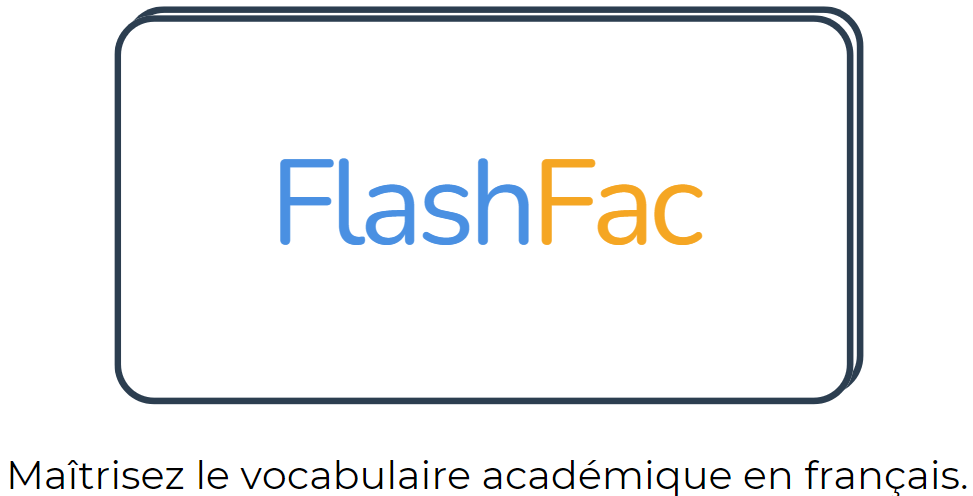
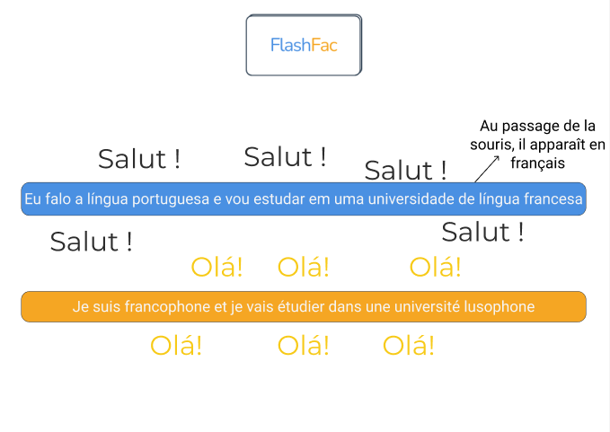
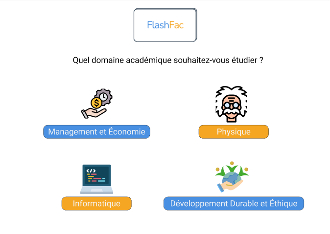
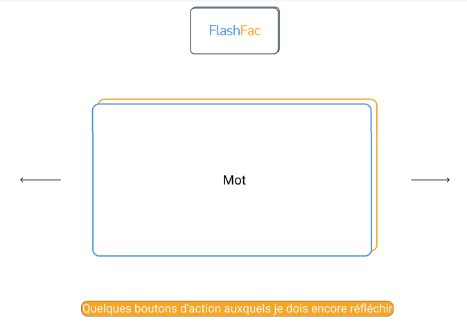
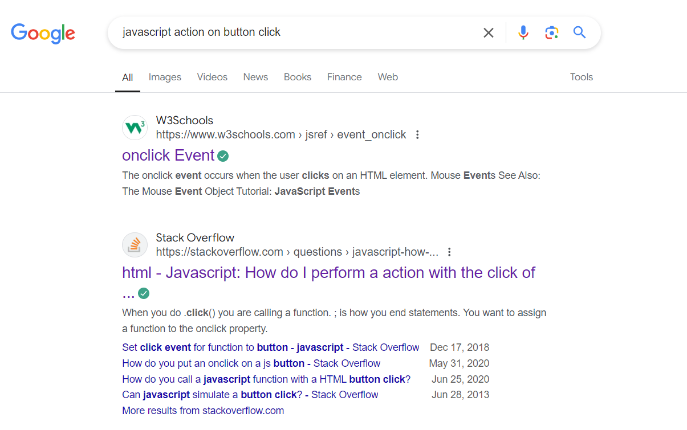
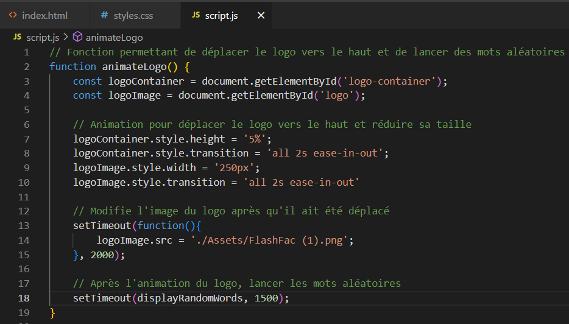
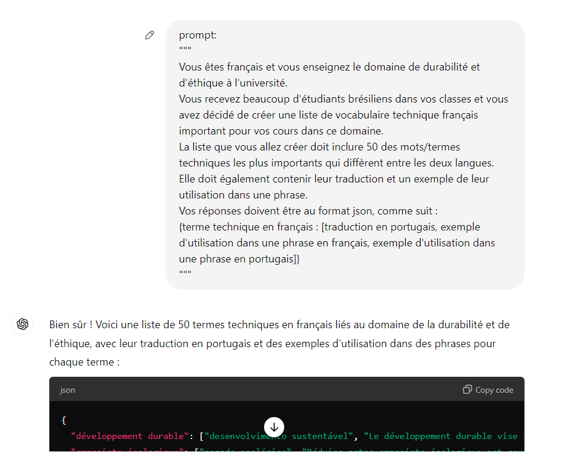



Liste des prérequis du POK ET/OU MON




Les lien utiles pour la compréhension de celui-ci.



Création d'un site web de flashcards de vocabulaire en français pour les universitaires étrangers

## Objectif

Développer un site web simple qui permet aux utilisateurs d'apprendre le vocabulaire français lié aux différents domaines académiques de l'ingénierie (tels que la programmation, la gestion, la physique, etc.) à l'aide de flashcards interactives.

## Tâches

### Sprints

#### Sprint 1

| Tâche | Durée Prévue | Durée Réel | Tâche Réalisée|
| :---: | :----: | :----------: | :--------: |
| Création du design du site web | 3H | 1H30 | X |
| Développement de la Page d'Accueil | 6H | 7H30 | X |
| Création des listes de vocabulaire | 1H | 1H | X |
| Documentation Sprint 1 | - | 1H | X |
| **TOTAL** | **10H** | **11H** |  |

#### Sprint 2

| Tâche | Durée Prévue | Durée Réel | Tâche Réalisée|
| :---: | :----: | :----------: | :--------: |
| Développement de la Page de Flashcards | 6H | - |  |
| Tests et Ajustements | 2H | - |  |
| Documentation et Finalisation | 2H | - |  |
| **TOTAL** | **10H** |  |  |

### Horodatage

| Date | Heures passées | Indications |
| :--: | :------------: | :---------: |
| Dimanche 08/09  | 0:30H  | Travail sur la documentation |
| Lundi 09/09 | 1:30H | Travail sur le design du site web |
| Mercredi 11/09 | 1H30 | Travail sur l'étude préliminaire de JavaScript |
| Mercredi 11/09 | 3H30 | Travail sur l'animation de la page d'accueil |
| Jeudi 12/09 | 1H | Travail sur la création de listes de vocabulaire |
| Jeudi 12/09 | 2H | Travail sur la création de la page de choix du domaine académique|
| Mercredi 18/09 | 1H | Travail sur la documentation |

## Contenu

## Sommaire

- [ Le design du site web](#le-design-du-siteweb)
- [Un Étude Preliminaire de JavaScript](#un-etude-preliminaire-de-javascript)
- [Développement](#développement)
- [Résultats à ce jour](#resultats-a-ce-jour)
- [Post-Mortem Premier Sprint](#post-mortem-premier-sprint)

## Le design du site web 

La première étape dans la conception du site a été de créer le logo. Mon objectif était de concevoir un logo à la fois simple et réfléchi, qui intègre un véritable concept de design. J'ai imaginé un flashcard, avec le nom du site à l'intérieur et une "phrase d'accroche" à l'extérieur.

Pour le nom, je souhaitais allier le terme "flashcard" à l'univers académique. Après avoir échangé avec quelques amies, le nom "**FlashFac**" est apparu comme la meilleure option, combinant la notion de flashcards avec le monde universitaire.

J'ai ensuite réfléchi à une phrase d'accroche qui capterait l'essence du projet. J’ai choisi : "**Maîtrisez le vocabulaire académique en français.**" Cette phrase reflète parfaitement l'objectif du site, qui est d'aider les utilisateurs à développer leur vocabulaire français avec un accent particulier sur le langage académique.

Le choix des couleurs a également été crucial. En m'appuyant sur la théorie des couleurs, j’ai opté pour une combinaison de **bleu et de jaune**. Le bleu évoque le professionnalisme, la confiance et la clarté, tandis que le jaune symbolise l’optimisme et la créativité. Ensemble, ces couleurs créent une identité visuelle à la fois dynamique et sérieuse.

Pour réaliser le logo final, j'ai utilisé l’outil Canva. Voici le résultat final

Une fois le logo finalisé, je me suis concentré sur la création du design global du site web. Pour cela, j'ai utilisé l'application **Figma**, en veillant à maintenir la cohérence des couleurs choisies pour le logo.

La première maquette concerne la page d'accueil du site, où j'ai opté pour un design dynamique. Pour une meilleure compréhension de cette mise en page, un aperçu vidéo du résultat final est disponible à la fin de ce document.

## Un Étude Preliminaire de JavaScript 

Pour la création de ce site web, je souhaitais utiliser **HTML, CSS et JavaScript**. Cela me permettrait de perfectionner mes compétences dans les deux premiers langages et de commencer mes études en JavaScript. Pour ce faire, j’ai entrepris une étude préliminaire de JavaScript.

Mon premier pas a été de demander à ChatGPT : "Quels sont les 20% des concepts qui me permettront d’apprendre 80% de JavaScript ?". Sa réponse a été bien plus complète que ce que je pouvais absorber en 1h30 de travail initial, ce qui m’a amené à chercher une approche plus concise. J’ai trouvé une vidéo sur [YouTube](https://www.youtube.com/watch?v=W6NZfCO5SIk) et me suis concentré sur les sections les plus importantes pour obtenir une compréhension de base du fonctionnement de la langue. Ensuite, j'ai exploré plusieurs projets publiés sur [ce dépôt GitHub](https://github.com/bradtraversy/50projects50days) afin de comprendre comment certaines fonctions plus complexes étaient mises en œuvre. Pendant cette lecture, j’ai parfois sollicité ChatGPT pour m’expliquer certaines lignes de code que je ne comprenais pas.

Bien entendu, 1h30 d’étude sur JavaScript est loin d’être suffisant pour maîtriser réellement cette langue. L’objectif de cette étude préliminaire était simplement d’avoir un premier contact et de comprendre la syntaxe à un niveau débutant. Tout au long du projet, chaque fois que j’avais une question spécifique, je faisais des **recherches sur Google**, en privilégiant des ressources comme **Stack Overflow ou W3Schools** pour trouver des solutions pertinentes et fiables.

## Développement 

### Le Frontend
Pour cette première phase du projet, prévue lors de la première sprint, j'ai choisi de développer **uniquement une page HTML**. Cette décision a été guidée par mes apprentissages durant ma MON 1, où j'ai compris que pour créer un site web avec une seule page, il faudrait utiliser beaucoup de JavaScript. Ainsi, pour atteindre mon objectif de progresser en JavaScript, cette approche s’est imposée comme la plus adaptée.

La création de cette page a nécessité plusieurs divisions (div) HTML, que j'ai ensuite manipulées en utilisant JavaScript. L'idée était de **masquer ou afficher** ces divisions en fonction des actions de l'utilisateur et/ou du temps, notamment pour les animations d'ouverture de la page.

Si la conception du HTML s’est faite sans grande difficulté, je dois admettre que le CSS et JavaScript m’ont posé plus de problèmes. J’ai souvent eu recours à la méthode de l’essai et de l’erreur pour comprendre certains comportements inattendus de la page. En conséquence, je pense que **le code final n’est peut-être pas aussi "clean" que je l’aurais souhaité**. Cependant, une solution pour l'optimiser est abordée dans la section "Post-Mortem".

Vous trouverez ci-joint une image de l'une des fonctions JavaScript que j'ai créées pour l'animation d'ouverture du site.

### Les Liste de Vocabulaire

Étant donné que je ne parle pas couramment français et que je ne maîtrise pas tout le vocabulaire académique pertinent pour chaque domaine de l'ingénierie, j'ai fait appel à ChatGPT pour m'assister dans cette étape du projet. 

Ma première tentative a consisté à demander à ChatGPT de générer une liste de 250 mots pour une section académique. Cependant, cette demande a surchargé mon ordinateur, empêchant la réponse d’être générée correctement. Face à ce problème, j’ai opté pour une approche plus légère : demander 50 mots à la fois. Après avoir récupéré une première liste, j’ai répété le processus pour obtenir une deuxième série de 50 mots, atteignant ainsi un total de 100 mots par domaine ou section.

Le prompt utilisé pour générer ces listes était le suivant : 

Cette méthode m’a permis d’obtenir les mots-clés nécessaires tout en contournant les limitations techniques que j’ai rencontrées.

## Résultats à ce jour 

Vous trouverez ci-joint une vidéo illustrant le résultat final, ainsi qu’une image de l'une des fonctions JavaScript que j'ai créées pour l'animation d'ouverture du site.

<video width="75%" controls>
  <source src="./assets/resultat_partial_pok1.mp4" type="video/webm">
</video>

### Post-Mortem Premier Sprint 

Après la conclusion de la première sprint, je suis globalement satisfaite du travail réalisé, tant au niveau du développement que de la planification, surtout étant donné que c'était la première fois que je m'engageais dans ce processus.

Cependant, même si je suis satisfaite, je reconnais plusieurs **points à améliorer**. Le premier concerne la **planification de la documentation** pour cette première sprint. L'oubli de cette activité a entraîné un **dépassement de 1 heure** par rapport au temps total prévu pour la sprint. Toutefois, ce problème ne se reproduira pas lors de la deuxième sprint, car j'ai déjà intégré cette étape dans la planification.

Le deuxième point concerne l'**organisation du code**. Apprendre JavaScript depuis le début tout en développant les fonctionnalités a été possible uniquement en **sacrifiant la structuration et la propreté du code**. Ainsi, je prévois d'**ajouter une phase dédiée à l'organisation du code dans la deuxième sprint**. Suite à l'exécution de la première sprint, je pense pouvoir finaliser l'activité "Développement de la Page de Flashcards" avec une heure d'avance sur le planning initial. Cette heure sera allouée à l'amélioration et à l'organisation du code.

### Second Sprint
