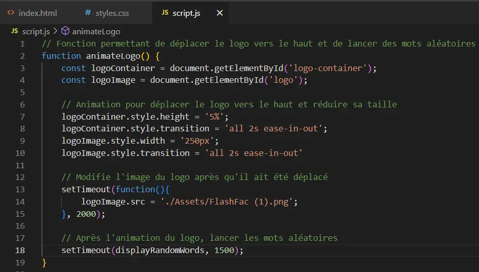



Il n'y a pas de prérequis pour ce POK




GitHub du POK: https://github.com/ManuelaBarreto/S9_POK1_FlashFac



Création d'un site web de flashcards de vocabulaire en français et portuguais pour les universitaires étrangers

## Objectif

Développer un site web simple qui permet aux utilisateurs d'apprendre le vocabulaire français et portugais lié aux différents domaines académiques de l'ingénierie (tels que la programmation, la gestion, la physique, etc.) à l'aide de flashcards interactives. Le site propose des flashcards avec des termes en français traduits en portugais, ainsi que des flashcards de mots en portugais traduits en français.

## Tâches

### Sprints

#### Sprint 1

| Tâche | Durée Prévue | Durée Réel | Tâche Réalisée|
| :---: | :----: | :----------: | :--------: |
| Création du design du site web | 3H | 1H30 | X |
| Développement de la Page d'Accueil | 6H | 7H | X |
| Création des listes de vocabulaire | 1H | 1H | X |
| Documentation Sprint 1 | - | 1H30 | X |
| **TOTAL** | **10H** | **11H** |  |

#### Sprint 2

| Tâche | Durée Prévue | Durée Réel | Tâche Réalisée|
| :---: | :----: | :----------: | :--------: |
| Développement de la Page de Flashcards | 5H | 7H | X |
| Tests et Ajustements | 1H30 | 1H30 | X |
| Organiser le code| 1H30 | 2H15 | X |
| Documentation et Finalisation | 2H | 1H30 | X |
| **TOTAL** | **10H** | 12H15 |  |

### Horodatage

| Date | Heures passées | Indications |
| :--: | :------------: | :---------: |
| Dimanche 08/09  | 0H30  | Travail sur la documentation |
| Lundi 09/09 | 1H30 | Travail sur le design du site web |
| Mercredi 11/09 | 1H30 | Travail sur l'étude préliminaire de JavaScript |
| Mercredi 11/09 | 3H30 | Travail sur l'animation de la page d'accueil |
| Jeudi 12/09 | 1H | Travail sur la création de listes de vocabulaire |
| Jeudi 12/09 | 2H | Travail sur la création de la page de choix du domaine académique|
| Mercredi 18/09 | 1H | Travail sur la documentation |
| Lundi 14/10 | 1H30 | Travail sur l'organisation du code |
| Lundi 14/10 | 2H | Travail sur le développement de la Page de Flashcards |
| Mardi 15/10 | 5H | Travail sur le développement de la Page de Flashcards |
| Mardi 15/10 | 1H30 | Travail sur les tests et Ajustements |
| Mercredi 16/10 | 0H45 | Travail sur l'organisation du code |
| Mercredi 16/10 | 1H30 | Travail sur la documentation et Finalisation |


## Contenu

## Sommaire

- [Le design du site web](#le-design-du-siteweb)
- [Un Étude Preliminaire de JavaScript](#un-etude-preliminaire-de-javascript)
- [Développement - Premier Sprint](#développement-premier-sprint)
- [Post-Mortem - Premier Sprint](#post-mortem-premier-sprint)
- [Développement - Deuxième Sprint](#développement-deuxieme-sprint)
- [Résultat Final](#resultat-final)
- [Post-Mortem - Deuxième Sprint](#post-mortem-deuxieme-sprint)


## Le design du site web <a id="le-design-du-siteweb"></a>

La première étape dans la conception du site a été de créer le logo. Mon objectif était de concevoir un logo à la fois simple et réfléchi, qui intègre un véritable concept de design. J'ai imaginé un flashcard, avec le nom du site à l'intérieur et une "phrase d'accroche" à l'extérieur.

Pour le nom, je souhaitais allier le terme "flashcard" à l'univers académique. Après avoir échangé avec quelques amies, le nom "**FlashFac**" est apparu comme la meilleure option, combinant la notion de flashcards avec le monde universitaire.

J'ai ensuite réfléchi à une phrase d'accroche qui capterait l'essence du projet. J’ai choisi : "**Maîtrisez le vocabulaire académique en français.**" Cette phrase reflète parfaitement l'objectif du site, qui est d'aider les utilisateurs à développer leur vocabulaire français avec un accent particulier sur le langage académique.

Le choix des couleurs a également été crucial. En m'appuyant sur la théorie des couleurs, j’ai opté pour une combinaison de **bleu et de jaune**.


Le bleu évoque le professionnalisme, la confiance et la clarté, tandis que le jaune symbolise l’optimisme et la créativité. Ensemble, ces couleurs créent une identité visuelle à la fois dynamique et sérieuse.

Pour réaliser le logo final, j'ai utilisé l’outil Canva. Voici le résultat final


Une fois le logo finalisé, je me suis concentré sur la création du design global du site web. Pour cela, j'ai utilisé l'application **Figma**, en veillant à maintenir la cohérence des couleurs choisies pour le logo.


La première maquette concerne la page d'accueil du site, où j'ai opté pour un design dynamique. Pour une meilleure compréhension de cette mise en page, un aperçu vidéo du résultat final est disponible à la fin de ce document.

## Un Étude Preliminaire de JavaScript <a id="un-etude-preliminaire-de-javascript"></a>

Pour la création de ce site web, je souhaitais utiliser **HTML, CSS et JavaScript**. Cela me permettrait de perfectionner mes compétences dans les deux premiers langages et de commencer mes études en JavaScript. Pour ce faire, j’ai entrepris une étude préliminaire de JavaScript.

Mon premier pas a été de demander à ChatGPT : "Quels sont les 20% des concepts qui me permettront d’apprendre 80% de JavaScript ?". Sa réponse a été bien plus complète que ce que je pouvais absorber en 1h30 de travail initial, ce qui m’a amené à chercher une approche plus concise. J’ai trouvé une vidéo sur [YouTube](https://www.youtube.com/watch?v=W6NZfCO5SIk) et me suis concentré sur les sections les plus importantes pour obtenir une compréhension de base du fonctionnement de la langue. Ensuite, j'ai exploré plusieurs projets publiés sur [ce dépôt GitHub](https://github.com/bradtraversy/50projects50days) afin de comprendre comment certaines fonctions plus complexes étaient mises en œuvre. Pendant cette lecture, j’ai parfois sollicité ChatGPT pour m’expliquer certaines lignes de code que je ne comprenais pas.

Bien entendu, 1h30 d’étude sur JavaScript est loin d’être suffisant pour maîtriser réellement cette langue. L’objectif de cette étude préliminaire était simplement d’avoir un premier contact et de comprendre la syntaxe à un niveau débutant. Tout au long du projet, chaque fois que j’avais une question spécifique, je faisais des **recherches sur Google**, en privilégiant des ressources comme **Stack Overflow ou W3Schools** pour trouver des solutions pertinentes et fiables.


## Développement - Premier Sprint <a id="développement-premier-sprint"></a>

### Le Code
Pour cette première phase du projet, prévue lors de la première sprint, j'ai choisi de développer **uniquement une page HTML**. Cette décision a été guidée par mes apprentissages durant ma MON 1, où j'ai compris que pour créer un site web avec une seule page, il faudrait utiliser beaucoup de JavaScript. Ainsi, pour atteindre mon objectif de progresser en JavaScript, cette approche s’est imposée comme la plus adaptée.

La création de cette page a nécessité plusieurs divisions (div) HTML, que j'ai ensuite manipulées en utilisant JavaScript. L'idée était de **masquer ou afficher** ces divisions en fonction des actions de l'utilisateur et/ou du temps, notamment pour les animations d'ouverture de la page.

Si la conception du HTML s’est faite sans grande difficulté, je dois admettre que le CSS et JavaScript m’ont posé plus de problèmes. J’ai souvent eu recours à la méthode de l’essai et de l’erreur pour comprendre certains comportements inattendus de la page. En conséquence, je pense que **le code final n’est peut-être pas aussi "clean" que je l’aurais souhaité**. Cependant, une solution pour l'optimiser est abordée dans la section "Post-Mortem".

Vous trouverez ci-joint une image de l'une des fonctions JavaScript que j'ai créées pour l'animation d'ouverture du site.



### Les Liste de Vocabulaire

Étant donné que je ne parle pas couramment français et que je ne maîtrise pas tout le vocabulaire académique pertinent pour chaque domaine de l'ingénierie, j'ai fait appel à ChatGPT pour m'assister dans cette étape du projet.

Ma première tentative a consisté à demander à ChatGPT de générer une liste de 250 mots pour une section académique. Cependant, cette demande a surchargé mon ordinateur, empêchant la réponse d’être générée correctement. Face à ce problème, j’ai opté pour une approche plus légère : demander 50 mots à la fois. Après avoir récupéré une première liste, j’ai répété le processus pour obtenir une deuxième série de 50 mots, atteignant ainsi un total de 100 mots par domaine ou section.

Le prompt utilisé pour générer ces listes était le suivant :


Cette méthode m’a permis d’obtenir les mots-clés nécessaires tout en contournant les limitations techniques que j’ai rencontrées.

### Post-Mortem Premier Sprint <a id="post-mortem-premier-sprint"></a>

Après la conclusion de la première sprint, je suis globalement satisfaite du travail réalisé, tant au niveau du développement que de la planification, surtout étant donné que c'était la première fois que je m'engageais dans ce processus.

Cependant, même si je suis satisfaite, je reconnais plusieurs **points à améliorer**. Le premier concerne la **planification de la documentation** pour cette première sprint. L'oubli de cette activité a entraîné un **dépassement de 1 heure** par rapport au temps total prévu pour la sprint. Toutefois, ce problème ne se reproduira pas lors de la deuxième sprint, car j'ai déjà intégré cette étape dans la planification.

Le deuxième point concerne l'**organisation du code**. Apprendre JavaScript depuis le début tout en développant les fonctionnalités a été possible uniquement en **sacrifiant la structuration et la propreté du code**. Ainsi, je prévois d'**ajouter une phase dédiée à l'organisation du code dans la deuxième sprint**. Suite à l'exécution de la première sprint, je pense pouvoir finaliser l'activité "Développement de la Page de Flashcards" avec une heure d'avance sur le planning initial. Cette heure sera allouée à l'amélioration et à l'organisation du code.

## Développement - Deuxième Sprint <a id="développement-deuxieme-sprint"></a>

J'ai commencé la deuxième étape de ce projet en organisant le code que j'avais développé jusqu'à présent. J'ai ajouté des commentaires explicatifs, amélioré les noms des fonctions pour les rendre plus intuitifs et lisibles, et simplifié la structure du code autant que possible.

Ensuite, je me suis concentré sur l'implémentation de la dernière page restante : la page des flashcards. Cette page, en plus de la structure HTML, nécessitait une intégration avec les listes de vocabulaire créées au format JSON, garantissant la lecture et l'affichage corrects de la liste sélectionnée par l'utilisateur. De plus, des scripts étaient nécessaires pour permettre aux utilisateurs de voir la traduction du mot, d'accéder à une phrase d'aide, et de naviguer entre les flashcards (passer au suivant ou revenir au précédent).

### Le HTML et le CSS

Le développement du HTML a présenté quelques défis. Initialement, j'ai créé la mise en page sans tenir compte de la fonctionnalité d'affichage de la traduction, car j'avais sous-estimé l'impact que cela aurait. Cependant, à la fin, j'ai dû réécrire certaines parties du HTML et du CSS pour implémenter un effet de rotation sur les flashcards lors de la révélation de la traduction. Ce travail supplémentaire a entraîné une perte de temps qui aurait pu être évitée avec une meilleure planification.

### Le JS

La partie la plus complexe, cependant, a été le script pour la page des flashcards. J'ai rencontré des difficultés inattendues, en particulier lors de la manipulation des données. Un facteur aggravant a été la panne de mon ordinateur personnel, ce qui m'a obligé à continuer le développement sur l'ordinateur de l'école, où je n'avais pas la possibilité d'installer Python ou Node.js, outils nécessaires pour exécuter un serveur local.

Le principal obstacle est survenu lorsque j'ai tenté de charger les listes de vocabulaire via le code. La solution nécessitait l'utilisation de la méthode `fetch`, une API native de JavaScript permettant de faire des requêtes HTTP de manière asynchrone. Cependant, j'ai constamment été confronté à l'erreur "file has been blocked by CORS policy". Après des recherches, j'ai découvert que la solution idéale serait d'utiliser Python ou Node.js pour générer un serveur local (`http://localhost:8000/`), afin de contourner la politique CORS.

```bash
python -m http.server
```

Compte tenu des limitations de l'ordinateur que j'utilisais, j'ai tenté diverses alternatives pour résoudre le problème sans ces outils, mais sans succès. Finalement, j'ai pu accéder à un autre ordinateur pour réaliser cette tâche, mais seulement après avoir perdu environ une heure à chercher d'autres solutions.

Une bonne conséquence de ce problème, cependant, est que j'ai appris à utiliser la console et `window.alert` pour essayer d'identifier où se trouvent les erreurs


### Clôture du projet

Enfin, j'ai organisé le code de la deuxième partie du projet, ce qui a pris moins de temps car j'étais plus attentif à cet aspect pendant le développement. J'ai terminé l'implémentation et, par la suite, rédigé ce document final.

## Résultat Final <a id="resultat-final"></a>

Vous trouverez [ici](https://www.loom.com/share/92185a6bc85c4873a7e06dc4428e0a10?sid=40b66261-4ca0-470b-84d7-c2f02505e93f) une vidéo illustrant le résultat final.

### Post-Mortem - Deuxième Sprint <a id="post-mortem-deuxieme-sprint"></a>

Avec la conclusion de cette deuxième sprint, je termine également l'ensemble du projet. Globalement, je suis satisfaite du travail accompli, en particulier dans la réalisation des objectifs définis. La phase finale a été marquée par des défis techniques et des ajustements, mais elle a également permis de mettre en place les principales fonctionnalités du site web, notamment la page des flashcards.

Cependant, il y a plusieurs **leçons à retenir** de cette dernière phase de développement. Le premier point concerne les **imprévus techniques** rencontrés. L'erreur liée à la politique CORS lors de l’utilisation de l’API `fetch` a entraîné un retard d’environ une heure, durant laquelle j’ai exploré plusieurs solutions alternatives sans succès, avant de pouvoir résoudre le problème avec l'accès à un autre ordinateur. Bien que le problème ait été finalement résolu, cela souligne l’importance de prévoir des **temps de contingence pour les imprévus techniques** dans les futures planifications de projets.

Un autre point à améliorer est lié à la **planification des fonctionnalités de la page des flashcards**. Le choix initial de ne pas inclure immédiatement l’option d’affichage de la traduction a conduit à un retravail conséquent sur le HTML et le CSS, notamment pour intégrer un effet de rotation des flashcards lors de l’affichage de la traduction. Ce contretemps a occasionné une perte de temps qui aurait pu être évitée avec une planification plus approfondie dès le départ.

Malgré ces défis, cette deuxième sprint a également montré des **améliorations notables**, notamment en ce qui concerne la **qualité et l'organisation du code**. Contrairement à la première sprint, où l’apprentissage du JavaScript a nécessité de faire des compromis sur la structuration du code, cette phase a intégré une étape dédiée à l’optimisation du code. Cette prévoyance a non seulement facilité le travail final mais a également contribué à un développement plus fluide et à une meilleure lisibilité du projet.

En conclusion, bien que le projet ait connu quelques difficultés, je considère que les **objectifs principaux ont été atteints**. La création du site web avec des flashcards interactives bilingues (français/portugais) et une navigation fluide entre les termes a été réalisée avec succès. Les **principales améliorations pour de futurs projets** incluraient une meilleure anticipation des contraintes techniques et un **détail plus précis des fonctionnalités dès le début du processus**, afin de minimiser le retravail.

Je quitte ce projet avec une meilleure compréhension des **principes de développement web**, des **techniques de gestion des imprévus** et une compétence accrue en **JavaScript et en structuration de code**. Ces apprentissages seront essentiels pour mes futurs projets.
