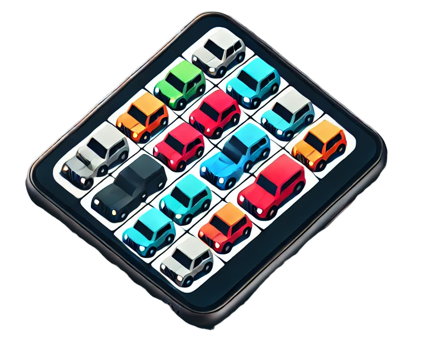
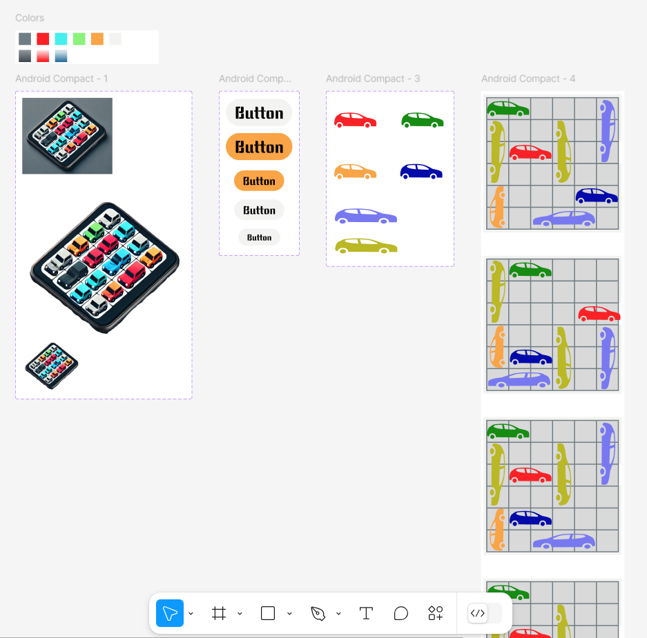
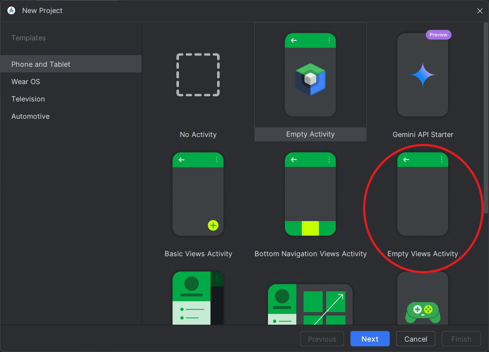
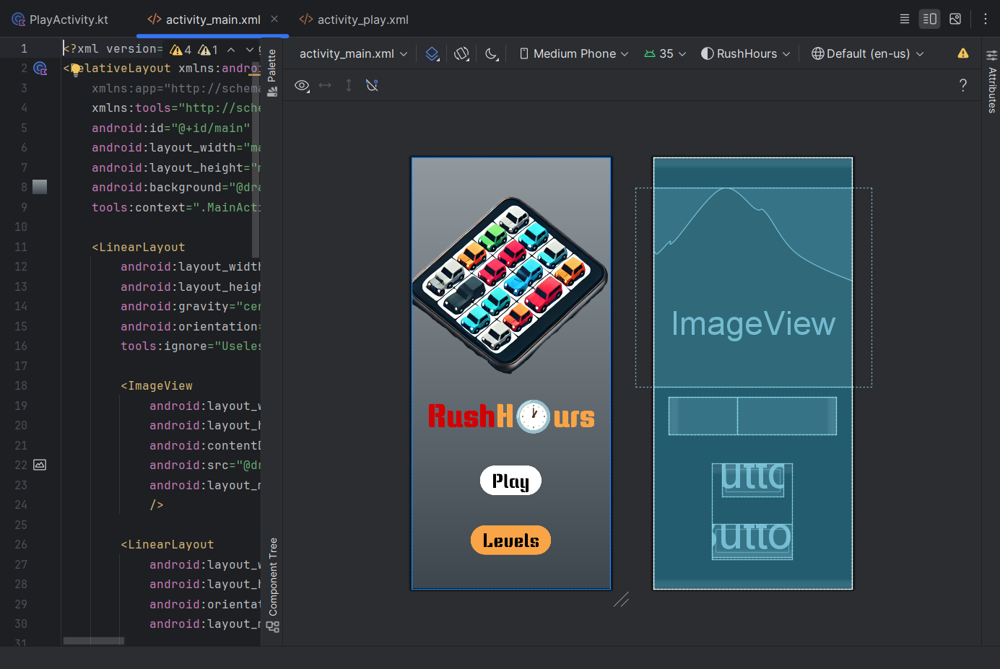
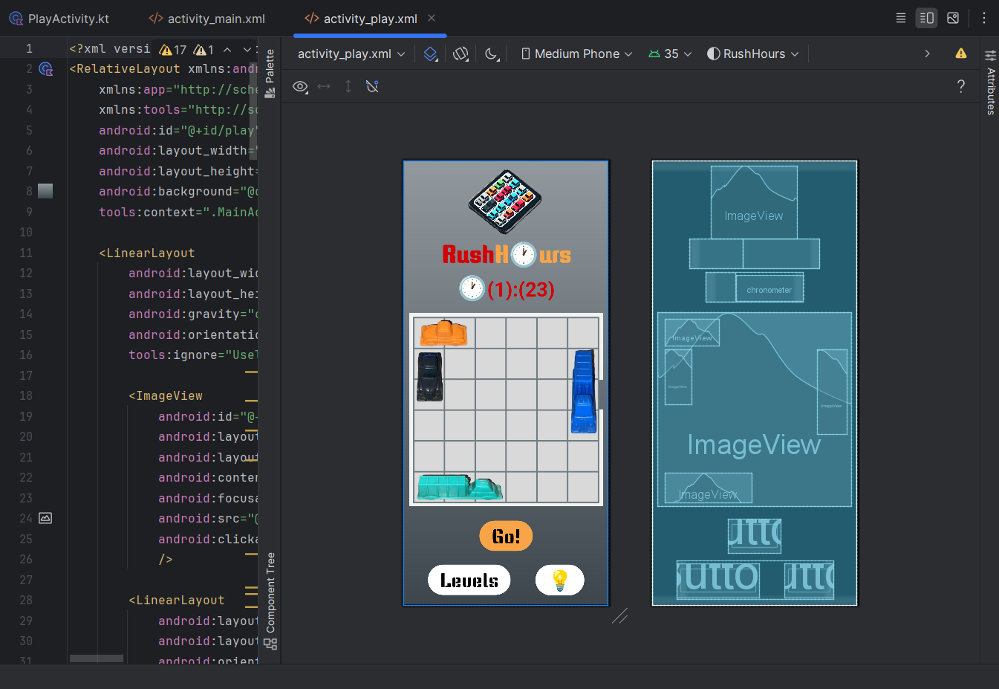



Liste des prérequis du POK ET/OU MON




Les lien utiles pour la compréhension de celui-ci.



Création d'un jeu mobile qui met les joueurs au défi de résoudre des énigmes logiques sur un plateau de 6x6 rempli de voitures stratégiquement placées.

## Objectif

Développer une application mobile pour un jeu simple qui met les joueurs au défi de résoudre des énigmes logiques sur un plateau de 6x6 rempli de voitures stratégiquement placées. L'objectif est de déplacer les véhicules le moins possible pour libérer le passage et permettre à la voiture rouge d'atteindre la sortie. Chaque niveau comporte un modèle et les niveaux deviennent progressivement plus difficiles.

## Tâches

### Sprints

#### Sprint 1

| Tâche | Durée Prévue | Durée Réel | Tâche Réalisée|
| :---: | :----: | :----------: | :--------: |
| Création du design de l'application sur figma            | 2H                  | 2H30                 | X           |
| Développement de l'écran d'accueil                       | 1H30                | 2H                   | X           |
| Créer les objets/personnages                             | 1H                  | 1H                   | X           |
| Créer l'écran de niveau (hardcoded)                      | 3H                  | 2H30                 | X           |
| Mettre en œuvre la logique de base pour déplacer un bloc | 2H                  | **Non Réalisée**     | -           |
| Documentation du sprint 1                                | 1H                  | 1H                   | X           |
| *Résoudre problème de l'emulateur*                       | **Non Pévue**       | *2H*                 | *X*           |
| **TOTAL** | **10H30** | **11H** |  |

#### **Sprint 2**

| **Tâche**                                   | **Durée Prévue** | **Durée Réelle** | **Tâche Réalisée** |
| :------------------------------------------: | :--------------: | :-------------: | :----------------: |
| Mettre en œuvre la logique de base pour déplacer un bloc | 2H               | 7H               | X                 |
| Créer la base des données pour stocker les niveaux      | 2H30             | 2H30             | X                 |
| Mettre les niveaux dans la base des données             | 0H30             | **Non Réalisée** | -                 |
| Créer la page des niveaux                               | 2H               | **Non Réalisée** | -                 |
| Tester et corriger les éventuelles erreurs              | 3H               | **En parallèle** | X                 |
| Logique de conclusion d'un niveau                       | **Non Prévue**   | 1H               | X                 |
| Documentation du sprint 2                               | **Non Prévue**   | 1H               | X |
| **TOTAL**                                               | **10H**          | **11H30**        | -                 |

**Note :** La tâche "Tester et corriger les éventuelles erreurs" a été réalisée **en parallèle** des autres tâches exécutées, ce qui a permis d'intégrer les corrections au fur et à mesure. Les deux dernières tâches n’ont pas été finalisées faute de temps.

### Horodatage

| Date | Heures passées | Indications |
| :--: | :------------: | :---------: |
| Samedi 19/10 | 2H30 | Travail sur le design sur Figma |
| Lundi 21/10 | 1H30 | Travail sur le développement de l'écran d'accueil |
| Lundi 21/10 | 2H |  Travail sur l'émulateur (Il ne fonctionnait pas) |
| Samedi 02/11 | 0H30 |  Travail sur les boutons de l'écran d'accueil |
| Samedi 02/11 | 3H30 |  Travail sur le développement de l'écran des niveaux (y compris la création des objets/personnages)|
| Mardi 19/11 | 1H | Travail sur la documentation |
| Jeudi 28/11 | 3H |  Travail sur les mouvements des voitures |
| Mercredi 11/12 | 4H | Travail sur les mouvements des voitures |
| Vendredi 13/11 | 1H | Travail sur la conclusion d'u niveau (bouton "Go") |
| Vendredi 13/11 | 2H30 | Travail sur la création et implementation de 3 niveaux |
| Mardi 17/11 | 1H | Travail sur la documentation |

| **TOTAL** | **22H30** |  |

## Sommaire

- [Le Design de l'Application](#le-design-de-l-application)
- [Développement - Premier Sprint](#développement-premier-sprint)
- [Post-Mortem - Premier Sprint](#post-mortem-premier-sprint)
- [Développement - Deuxième Sprint](#développement-deuxième-sprint)
- [Post-Mortem - Deuxième Sprint](#post-mortem-deuxième-sprint)
- [Résultat](#resultat)

## Le Design de l'Application 

Pour concevoir le design de l’application, j’ai commencé par expliquer à ChatGPT le concept du jeu que je souhaitais créer et je lui ai demandé de réaliser le logo de mon app. Voici le logo qu’il a conçu :

Ensuite, j’ai commencé à développer l’aspect visuel de l’application sur Figma. La première étape a été de choisir une palette de couleurs, en sélectionnant des tons directement issus du logo. Une fois les couleurs définies, j’ai créé les principaux composants, comme les boutons et le plateau de jeu, tout en avançant dans la conception des écrans. Voici le résultat des composants :

Une fois les écrans finalisés, j’ai créé les liens entre eux pour rendre la navigation fonctionnelle. Le produit final peut être vu dans la vidéo ci-dessous :

<video width="200" controls>
  <source src="./assets/figma.mp4" type="video/mp4">
</video>

## Développement - Premier Sprint 

### La création du projet sur Android Studio

Pour savoir comment installer Android Studio, consultez mon **MON1.1**.  

Une fois Android Studio installé, commencez par créer un nouveau projet. Lors de la configuration initiale, sélectionnez l'option **"Empty Views Activity"**. Cette option génère un projet de base contenant un fichier XML, où vous pourrez concevoir le layout de votre application.  

### La Page d'Accueil  

Pour construire la page d'accueil, j'ai utilisé deux fichiers principaux :  

- **`MainActivity`** : ce fichier définit le fonctionnement de l'écran, notamment les actions associées aux boutons.  
- **`activity_main.xml`** : ce fichier gère le layout de la page.  

En complément, j'ai également utilisé des fichiers de ressources pour définir les textes affichés, les couleurs, la police et les images utilisées. Voici le résultat final du layout :  

  

### La Page du Niveau  

Pour construire la page du niveau, j'ai utilisé les fichiers suivants :  

- **`PlayActivity`** : ce fichier contrôle non seulement les actions des boutons, mais également le fonctionnement du chronomètre et les mouvements des objets présents sur la page.  
- **`activity_play.xml`** : ce fichier s'occupe de créer le layout de la page.

Comme pour la page d'accueil, des fichiers de ressources ont été utilisés pour gérer les textes, les couleurs, la police et les images. Voici le résultat final du layout :  

Il est important de noter que les objets de la voiture à l'écran ont été **hard coded**. Cela signifie que j'ai créé un objet pour chacune de ces voitures avec une image, une taille et un positionnement spécifiques.
Ce n'est pas idéal, mais c'est le moyen que j'ai trouvé pour me familiariser avec le langage et la logique à mettre en œuvre avant d'améliorer la façon dont ces objets sont généré.

### La Création des Objets du Jeu  

Pour créer les objets du jeu utilisés dans la page du niveau, j'ai suivi les étapes suivantes :  
- J'ai capturé une image (screenshot) du plateau de jeu que j'avais conçu dans Figma.  
- J'ai photographié les petites voitures du jeu physique que je possède, puis j'ai supprimé les arrière-plans et retouché les images pour les adapter au design numérique.  

### Problème Rencontré  

Dans Android Studio, nous disposons d’émulateurs permettant de simuler le fonctionnement d’un smartphone pour tester le comportement de l’application. (Pour en savoir plus sur les émulateurs, consultez mon **MON1.1**).  

En essayant d’utiliser l’émulateur, celui-ci fonctionnait correctement, mais mon application refusait de se lancer. Après plusieurs heures de recherches sur Internet (environ 2 heures), j’ai identifié deux problèmes :  

1. **Problème avec le SDK**  
   Le SDK (Software Development Kit) est un ensemble d’outils et de bibliothèques nécessaires pour développer des applications sur une plateforme spécifique. Dans mon cas, le fichier `build.gradle.kts` spécifiait le SDK 34, alors que mon application nécessitait la version 35. J’ai donc modifié cette configuration pour corriger l’erreur.  

2. **Problème d’emplacement du projet**  
   J’avais créé mon projet dans un dossier situé dans OneDrive, ce qui a entraîné des problèmes d’accès pour Android Studio. Pour résoudre cela, j’ai déplacé le projet vers un dossier local sur mon disque dur, éliminant ainsi tout problème d’accès.  

### Post-Mortem Premier Sprint  

#### **Problèmes Rencontrés**  

1. **Incompatibilité du SDK**  
   Le SDK configuré (version 34) n’était pas compatible avec mon application (version 35). Cela a empêché l’application de fonctionner sur l’émulateur.  

2. **Problème de Localisation du Projet**  
   Le projet était enregistré dans un dossier OneDrive, ce qui a causé des problèmes d’accès dans Android Studio. J’ai dû déplacer le projet dans un dossier local pour résoudre ce problème.  

#### **Activités Non Prévues**  

- **Recherche sur les Erreurs Techniques** : Passé plusieurs heures à chercher des solutions en ligne pour résoudre les erreurs liées à l’environnement de développement, ce qui a ralenti l’avancement du projet.  

#### **Leçons Apprises pour la Prochaine Sprint et Projets Futurs**  

1. **Vérification Initiale des Configurations**  
   Avant de commencer, il est important de vérifier les versions du SDK et d’éviter de travailler dans des dossiers synchronisés (comme OneDrive) pour éviter les problèmes d’accès.  

2. **Préparation aux Imprévus**  
   Prévoir un temps supplémentaire pour résoudre les problèmes techniques imprévus, surtout ceux liés à l’environnement de développement.

## Développement - Deuxième Sprint 

### **Déplacement des voitures**  

Cette partie constitue le cœur du jeu, car l’objectif principal est de déplacer les voitures pour dégager le chemin et permettre à la voiture rouge d’atteindre la sortie. Bien que j’étais conscient de l’importance de cette fonctionnalité, j’ai largement sous-estimé le temps nécessaire pour la mettre en place. Cette étape a été de loin la plus chronophage du projet, me demandant un total de **7 heures** de travail. Je vais diviser cette phase en plusieurs sous-étapes, correspondant aux différentes problématiques rencontrées pour implémenter cette fonctionnalité.

#### **1. Mouvement en temps réel des voitures**  

   La première étape a consisté à permettre aux voitures de se déplacer en synchronisation avec le toucher de l’utilisateur sur l’écran. Bien que le langage **Kotlin** facilite cette fonctionnalité, j’ai été confronté à un problème inattendu : la différence entre les unités de mesure **"dp"** et **"px"**. Ce manque de connaissance initial a fait que les voitures se déplaçaient de manière incohérente jusqu’à ce que je comprenne et développe une fonction capable de gérer correctement cette différence.

   **Durée de cette étape : environ 1h30**  

#### **2. Définir les positions d’arrêt des voitures**  

   Il était essentiel que les joueurs ne puissent pas lâcher les voitures n’importe où, mais uniquement sur les **cases spécifiques** du plateau. Pour cela, j’ai développé une fonction **`snapToGrid`** qui, en fonction de la position où le joueur relâche la voiture, calcule la case la plus proche et ajuste la position de la voiture en conséquence.

   Ici encore, j’ai rencontré des difficultés liées aux unités **"dp"** et **"px"**. Toutefois, ayant déjà résolu ce problème à l’étape précédente, la correction a été plus rapide. De nouvelles difficultés sont toutefois apparues, notamment la nécessité de :  
   - Définir un **seuil** pour déterminer si la voiture doit se placer sur la case précédente ou suivante.  
   - Gérer le fait qu’une voiture peut occuper plusieurs cases simultanément.

   **Durée de cette étape : environ 2h**  

#### **3. Vérifier si la nouvelle position est valide**  

   Une règle essentielle du jeu est qu’aucune voiture ne peut occuper une case déjà utilisée par une autre voiture. Pour gérer cela, j’ai dû :  
   1. **Créer une base de données** pour stocker et mettre à jour l’état des cases (libres ou occupées). C’était la première fois que je manipulais des **Data Class** en Kotlin et que je travaillais avec un fichier **JSON** pour structurer les données sur AndroidStudio.  
   2. **Implémenter des fonctions de vérification** :  
      - S’assurer que les cases à occuper sont disponibles.  
      - Si les cases appartiennent déjà à la voiture en cours de déplacement, les considérer comme disponibles.  
      - En cas d’indisponibilité, ramener la voiture à sa position initiale.  

   Il fallait également s’assurer que l’intégralité de la voiture (en fonction de sa longueur) reste dans les limites du **plateau 6x6** pour valider son positionnement.

   **Durée de cette étape : environ 2h45**  

#### **4. Vérifier si le déplacement est valide**  

   En plus de vérifier si les cases cibles sont libres, il était nécessaire de s’assurer que le **chemin** emprunté par la voiture pour s’y rendre n’était pas bloqué par une autre voiture. Si ce n’était pas le cas, le déplacement devait être annulé, et la voiture ramenée à sa position précédente.

   **Durée de cette étape : environ 45 minutes**  

### **Conclusion et réflexion**  

Pour traiter ces différentes conditions, j’ai dû effectuer de nombreux **tests**. En toute honnêteté, lorsque j’ai commencé à implémenter cette fonctionnalité, je n’avais pas anticipé autant de contraintes ni d’aspects à prendre en compte. Cela m’a appris qu’il est crucial de tester minutieusement chaque fonctionnalité afin d’identifier les éventuelles lacunes.  

De plus, il peut être extrêmement utile de faire tester le jeu par une **autre personne**. Celle-ci pourrait adopter un comportement imprévu, révélant des bugs ou des restrictions auxquelles je n’avais pas pensé. Ce retour externe permet de peaufiner davantage la logique et la robustesse du jeu.

### **Validation du niveau et mouvement automatique**  

Une fois que l’utilisateur a déplacé les voitures et appuie sur le bouton **"Go"**, deux actions essentielles doivent être réalisées pour valider la fin du niveau et offrir une expérience fluide :  

1. **Validation de la réussite du niveau**  
   Il est impératif de vérifier qu’aucun véhicule ne bloque le chemin entre la **voiture rouge** et la **sortie**. Pour cela, j’ai implémenté une fonction de validation qui :  
   - Parcourt les **cases** situées entre la position actuelle de la voiture rouge et la sortie.  
   - Vérifie que ces cases sont libres, en se basant sur la base de données des cases occupées générée précédemment.  

   Si toutes les cases sont vides, le niveau est considéré comme **réussi**, et l’animation suivante peut être déclenchée.

2. **Mouvement automatique de la voiture rouge**  
   Une fois la validation effectuée, la voiture rouge se déplace automatiquement jusqu’à la sortie. Pour cela j’ai utilisé une animation pour déplacer la voiture rouge de sa position actuelle jusqu’à la **case de sortie**.

### **Création des niveaux**  

Une fois la mise en place de la **mouvementation des voitures** terminée, il ne me restait plus beaucoup de temps pour réaliser tout ce que j’avais prévu. J’ai donc décidé de trouver au moins une solution pour **créer des niveaux** et passer automatiquement d’un niveau à l’autre une fois l’étape terminée.

#### **Organisation des niveaux**  
Jusqu’à présent, comme mentionné précédemment, le jeu comportait uniquement **un niveau hard codé**. Modifier cela a été assez compliqué, car j’ai dû créer plusieurs nouvelles fonctions. Cependant, cela m’a permis de **mieux organiser mon code** :  
- J’ai déplacé toutes les **fonctions liées à la gestion des déplacements** des voitures vers un fichier séparé nommé **`BoardUtils.kt`**.  
- Ainsi, dans **`PlayActivity`**, seules les fonctions responsables de **l’initialisation de la page**, de **la construction des niveaux** et du **passage automatique d’un niveau à l’autre** ont été conservées.

#### **Enchaînement des niveaux**  
Dans la version actuelle du jeu :  
- Quand un niveau est **terminé**, le suivant démarre **automatiquement**.  
- Si l’utilisateur retourne au menu principal et clique sur le bouton **"Play"**, le jeu **reprend toujours au premier niveau**.  

Je suis conscient que cette solution n’est **pas idéale**. Par exemple, je n’ai pas eu le temps de développer une option permettant au joueur de **choisir un niveau** à partir d’un menu.

#### **Limites et prochaines étapes**  
Ce manque de flexibilité est principalement dû au **temps limité** alloué au projet (j’avais déjà dépassé les **20 heures** prévues). Je pense que cette fonctionnalité de sélection de niveaux, ainsi que la sauvegarde de la progression, nécessiterait une **gestion de base de données** plus avancée, ce que je n’ai pas pu approfondir dans cette version.

Je suis motivé pour continuer à travailler sur ce projet lors de la **POK3**, car je suis convaincu qu’il m’aidera à progresser, en particulier dans les domaines de la **gestion de base de données** et de l’optimisation de la structure du code.

### **Post-Mortem - Deuxième Sprint**   

#### **Problèmes Rencontrés**  

1. **Sous-estimation du temps nécessaire pour implémenter la fonctionnalité de déplacement des voitures**  
   Bien que cette fonctionnalité soit au cœur du jeu, j’ai grandement sous-estimé sa complexité. Entre la gestion des mouvements "en direct", l’alignement sur la grille, la vérification des positions valides et des chemins libres, le processus a été long et laborieux. Cela a pris **7 heures au total**, ce qui a largement dépassé mon estimation initiale.  

2. **Difficultés liées aux unités de mesure "dp" et "px"**  
   Lors de l’implémentation du mouvement des voitures, la différence entre les unités **"dp"** (densité indépendante) et **"px"** (pixels) a causé des dysfonctionnements dans les déplacements, rendant le jeu instable au début. Une compréhension plus approfondie de ces unités a été nécessaire pour corriger ces erreurs.  

3. **Problèmes d’organisation des niveaux**  
   Passer d’un niveau "hard codé" à un système dynamique de création de niveaux a été complexe. Bien que j’aie réussi à automatiser l’enchaînement des niveaux, je n’ai pas eu le temps d’implémenter une fonctionnalité permettant au joueur de **choisir un niveau** ou de sauvegarder sa progression.  

#### **Activités Non Prévues**  

1. **Gestion des erreurs techniques**  
   - Le temps passé à résoudre les problèmes d’unités **dp/px** a été bien plus long que prévu.  
   - J’ai dû effectuer plusieurs ajustements pour que les voitures s’alignent correctement sur les cellules de la grille.  

2. **Refactorisation du code**  
   - Afin de mieux organiser le projet, j’ai déplacé les fonctions de gestion des mouvements dans un fichier **`BoardUtils.kt`**, ce qui n’était pas initialement prévu dans ce sprint. Cette réorganisation a été bénéfique, mais elle a consommé une partie du temps alloué pour d’autres tâches.  

3. **Tests et ajustements supplémentaires**  
   - De nombreux tests ont été nécessaires pour identifier et résoudre des bugs inattendus, comme les collisions entre voitures, les mouvements invalides ou les retours à la position initiale.

#### **Leçons Apprises pour la Prochaine Sprint et Projets Futurs**  

1. **Estimer plus précisément la complexité des fonctionnalités**  
   - Il est important d’évaluer en détail les différentes étapes d’une fonctionnalité complexe avant de commencer, afin d’éviter de sous-estimer le temps nécessaire à son implémentation.  
   - Diviser les fonctionnalités en sous-tâches claires permet de mieux suivre l’avancement du projet.  

2. **Tester régulièrement et impliquer d’autres personnes**  
   - Les tests fréquents pendant le développement permettent d’identifier rapidement les problèmes.  
   - Faire tester l’application par quelqu’un d’autre peut révéler des cas d’usage imprévus ou des bugs non anticipés.  

3. **Prévoir un temps pour les imprévus**  
   - Une marge de temps supplémentaire doit être prévue dans chaque sprint pour gérer les problèmes techniques imprévus, comme les erreurs de compatibilité ou les ajustements d’interface.  

4. **Organiser le code dès le début**  
   - Structurer le code dès le départ permet d’éviter les refactorisations tardives et facilite l’ajout de nouvelles fonctionnalités. Un fichier dédié aux utilitaires comme **`BoardUtils.kt`** aurait pu être créé dès le début pour gagner du temps.

## Résultat 

Dans la vidéo ci-dessous, je présente le **résultat final** de mon projet. J'y démontre certains mouvements **invalides** qui ont dû être traités tout au long du développement, ainsi que le fonctionnement global du jeu.

<video width="200" controls>
  <source src="./assets/resultat.mp4" type="video/mp4">
</video>