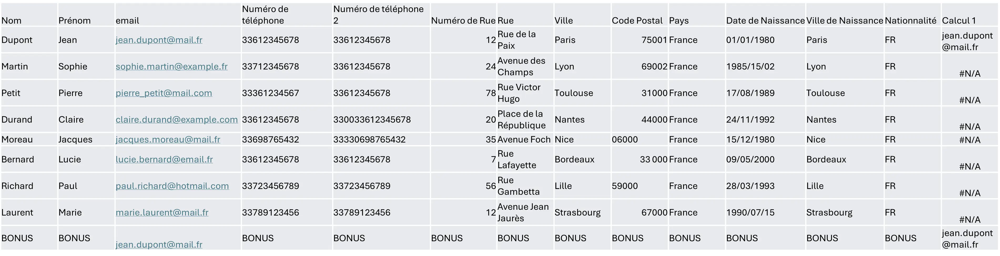



Connaitre les bases d'Excel et les formules standards.




- [Traduction des formules Excel](https://fr.excel-translator.de/fonctions/)
- [Fichier Excel utilisé dans ce MON](BaseDeDonnees.zip)



Dans ce MON, je vais utiliser des formules Excel pour mettre en forme une base de données que j'aurai au préalable volontairement mal remplie, en m'inspirant de ce que l'on peut retrouver dans une base réelle.

## Introduction

Lorsqu'une base de données présente de nombreux formats différents pour un seul et unique champ, cela perturbe l'analyse de données. Pour éviter cela, il est fréquent d'imposer un formatage avec des règles de validation ou des listes de choix imposés. Cependant, il arrive fréquemment que certaines de ces règles ne soient pas conçues dès le début, car on peut de temps en temps oublier à quel point une réponse d'un utilisateur peut varier par rapport à un autre. Et, une fois que l'on ajoute ces règles, il faut alors corriger l'ancienne data. C'est ce que nous allons faire dans ce MON à l'aide d'Excel.

Pour cela, nous allons tout d'abord créer une base de données qui ne suivra aucune bonne pratique. Puis, nous alignerons toutes les données sur des formats communs en travaillant sur des formules Excel que nous expliquerons.

## Constitution d'une base de données non formatées

Nous allons partir d'une base présentant des données standard d'un utilisateur avec comme clé primaire l'email de l'utilisateur (un email étant forcément synonyme d'unicité).

Pour la constitution de cette base de données, j'ai choisi de commencer par demander à ChatGPT un exemple de ce que pourrait donner une base sans aucune contrainte de remplissage. Pour cela, j'ai utilisé le prompt suivant :

*Can you fill this data base with french information that could be not well formatted like a wrong email or different phone number format etc. The data base use this fields and there is for now no rules on how to fill it : Name, Surname, email, phone number, phone number 2, Street number,	Street, City, Postal Code, Country, Birth date,	City of Birth, Nationality*

Je suis ensuite parti de sa réponse en corrigeant légèrement certaine abération afin d'aboutir à ceci :


On peut bien observer sur cette base que certains emails sont faux et ne peuvent pas marcher. Les numéros de téléphone ont absolument tous les formats possibles et imaginables, tout comme les dates de naissance. Certains champs ne sont pas remplis et l'information se trouve ailleurs. Il faut donc remettre tout cela en ordre afin de pouvoir faire du reporting efficace. Mais, avant cela, il faut faire en sorte que ce genre d'erreurs ne se reproduise pas en mettant des règles en place.

## Les nouvelles règles sur la base

En suivant les bonnes pratiques que l'on retrouve dans le  [POK 1](https://francoisbrucker.github.io/do-it/promos/2024-2025/Matthieu-Dufort/pok/temps-1/), nous allons fixer des règles pour chacun des objets.

En premier, pour **l'adresse email**, nous allons fixer une règle de validation d'adresse email en vérifiant le format *---@---.---*

Puis, pour les **numéros de téléphone**, nous allons rajouter une règle sur le format en s'alignant sur un format fixe de la forme *XX........* ; de sorte que les XX reprennent les numéros d'identification du pays et ensuite on ajoute sans espace la suite de chiffre.

Pour le **code Postal** et **la nationalité**, nous le remplaçons par une *liste de choix* permettant l'homogénéité. La ville peut ensuite être déduite du code postal afin de proposer un auto-remplissage. Elle pourra ensuite être modifiée en cas de besoin.

Pour la **rue**, il est difficile de confirmer que l'adresse existe vraiment. On peut donc envisager, afin de réduire au maximum les erreurs potentielles, de se connecter à *l'API de google maps* afin de donner la possibilité à l'utilisateur de rechercher son adresse pour remplir tous les champs automatiquement.

Enfin, nous allons forcer le formatage de la **date** au format *jj/mm/aaaa*.

Grâce à ces nouvelles règles en place, nous pouvons maintenant être sûrs que la donnée sera remplie au mieux, et il est donc temps de corriger l'ancienne donnée grâce à Excel.

## Nettoyage et allignement des données

Pour aligner les données, il est possible d'utiliser Excel avec des formules de niveau intérmédiaire.

### L'email

Tout d'abord l'email étant l'élément essentiel de la base, nous allons supprimer tous les emails qui ont des formats non conforme. Pour cela, il faut d'abord vérifier que chaque email a au moins un "*.*" après "@" et uniquement un "*@*". Nous allons combiner plusieurs fonctions :

- Fonction **MID** (STXT) :
  - *Format* : MID(Texte sur lequel on travail,numéro de caractère où commencer l'extraction, Nombre de caractères à extraire)
  - *Réponse* : La partie de texte extraite sur une longueur du nombre de caractères rentré en paramètre

- Fonction **SEARCH** (CHERCHE) :
  - *Format* : SEARCH("texte à trouver" ; Ou le chercher)
  - *Réponse* : Position du premier caractère à trouver qui est trouvé (premier caractère du texte = 1) ; Renvoie une erreur si le caractère n'est pas dans la liste

- Fonction **ISNUMBER** (ESTNUM) :
  - *Format* : ISNUMBER(Test logique, valeur si c'est un nombre, valeur sinon)
  - *Réponse* : Retourne les valeurs choisies en fonction de ce qu'on a mis en paramètre de la fonction

La fonction **MID** va nous permettre d'extraire tous les caractères trouvés après le premier @ (ou une erreur s'il n'y en a pas). Pour cela nous allons la combiner avec la fonction **SEARCH**. Puis nous allons verifier dans cette extraction qu'il n'y a plus de @ et qu'il y a bien un point en utilisant la fonction **IF** (Si), **NOT** (NON), et **AND** (ET) pour faire nos tests de logique ainsi que **LEN**.

Cela donne :

```
=MID(C2; SEARCH("@";C2)+1; LEN(C2) - SEARCH("@";C2))
```

Pour réaliser l'extraction et on peut maintenant rajouter la logique en rentrant la formule précédente dans la colonne N :

```
=IF(AND(NOT(ISNUMBER(SEARCH("@";N2)));ISNUMBER(SEARCH(".";N2)));"ok";"Wrong")
```

Ce qui donne :


Et on peut donc maintenant supprimer tous ceux qui sont mauvais et passer à la suite.

### Les numéros de téléphone

Pour s'aligner sur le format nouvellement imposé, nous allons commencer par supprimer tout ce qui n'est pas un chiffre. Puis, nous changerons les nombres en fonction des besoins restants.

- Fonction **SUBSTITUTE** (SUBSTITUE) :
  - *Format* : SUBSTITUTE("texte sur lequel on travaille" ; "ancienne valeur à remplacer" ; "Nouvelle Valeur")
  - *Réponse* : Texte sur lequel on travaille avec la nouvelle valeur à la place de l'ancienne.

On fait donc :

```
=SUBSTITUTE(SUBSTITUTE(SUBSTITUTE(SUBSTITUTE(SUBSTITUTE(SUBSTITUTE(D2;" ";"");"+";"");".";"");"-";"");"(";"");")";"")
```

On combine ensuite, en fonction de la longueur de la chaîne, des fonctions logiques et des fonctions qui récupèrent une partie des caractères :

- Fonction **RIGHT** (DROITE) :
  - *Format* : RIGHT("texte sur lequel on travaille" ; "Nombre de caractères à récupérer en partant de la droite")
  - *Réponse* : Nombre de caractères choisis sur le texte indiqué en partant de la droite
- Fonction **TEXT** (TEXT) :
  - *Format* : TEXT("champ à transformer au format texte" ; "format du texte voulue")
  - *Réponse* : Le champ sous forme de texte au format souhaité
  
```
=IF(LEN(N2)=11;N2;IF(LEN(N2)=10;"33" & TEXT(RIGHT(N2;9);"0");"33" & N2))
```

Et on obtient :


On applique ceci au numéro 2 aussi pour passer ensuite au numéro de rue et à l'adresse.

### Adresse

Pour l'adresse, comme observé dans les règles précédemment, on ne peut que fixer le choix du code postal. Nous allons donc aligner les codes postaux. Pour cela, nous réutilisons uniquement des fonctions vues précédemment de la façon suivante :

```
=IF(LEN(I2)=4;"0"&TEXT(I2;"0");IF(LEN(I2)=2;TEXT(I2;"0")&"000";I2))
```

Et cela donne :


### Nationalité

Pour la nationalité, nous allons homogénéiser en passant par une liste de choix avec les abréviations des pays.

```
=IF(LEFT(M2;4)="Fran";"FR"; "Other")
```


### Date de naissance

Pour la date de naissance, il suffit de substituer tout ce qui n'est pas un chiffre par un / afin d'obtenir le format voulu. On utilise donc la fonction **SUBSTITUTE**

```
=IF(ISNUMBER(SEARCH("/";TEXT(K2; "jj/mm/aaaa")))=TRUE;TEXT(K2;"jj/mm/aaaa");SUBSTITUTE(SUBSTITUTE(K2;".";"/");"-";"/"))
```


Et on obtient alors une base de données propre et alignée sur les nouveaux critères afin de repartir sur de bonnes bases pour faire du reporting.

## Bonus : Doublon

En base de données, il y a souvent des doublons. Pour traiter cela dans Excel, on utilise une fonction très pratique :

- Fonction **VLOOKUP** (RECHERCHEV) :
  - *Format* : VLOOKUP("Valeur recherché"; Endroit ou chercher la valeur ; L'indexe de la colonne à retourner, Le type de ressemblance)
    - La valeur recherchée correspond à la cellule sur le test du doublon.
    - L'endroit où chercher est une matrice ; cependant, Excel ne cherchera que dans la première colonne de la matrice. Le fait d'utiliser une matrice permet uniquement d'afficher différentes valeurs si un doublon est trouvé.
    - L'index correspond au numéro de la colonne de la matrice dont on veut retourner la valeur. Si on cherche uniquement sur une colonne simple et qu'on veut retourner la valeur de cette colonne, cela sera *1*.
    - Le type de ressemblance peut être TRUE ou FALSE : FALSE pour une ressemblance exacte et TRUE pour une ressemblance approximative (si aucune ressemblance n'est trouvée, Excel retourne la valeur d'en dessous ; il faut donc bien ordonner la première colonne pour faire ce type de ressemblance).
  - *Réponse* : Retourne la valeur de la colonne choisie en paramètre 3 en fonction du match en paramètre 1.

Exemple :

```
=VLOOKUP(C2;C3:C10;1;FALSE)
```

Ce qui donne :


Il ne reste plus ensuite qu'a combiner les informations des doublons pour les supprimer.
