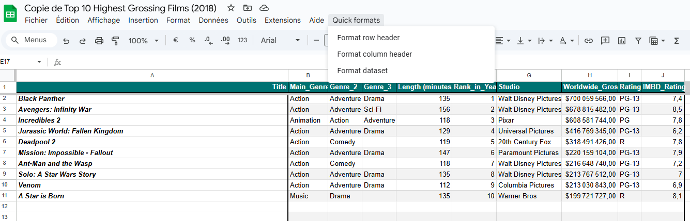



[Premier pas avec Google App script](https://developers.google.com/apps-script/samples/fundamentals-codelabs?hl=fr)
[MON de Abdane Ossama](https://francoisbrucker.github.io/do-it/promos/2022-2023/Abdane-Ossama/mon/mon2.1/)



Pour ce mon, je veux me former sur google script afin de pouvoir optimiser tous mes documents en créant les documents habituels automatiquement ou en faisant des macros.

# Contenu

## Introduction

L'objectif premier de ce MON est de monter en compétences sur Google script afin d'optimiser mon utilisation des outils googles. J'utilise énormément les outils google dans le cadre d'un projet de voile auquel je participe en naviguant mais aussi en gérant la logistique de toutes les régates. Ceci me pousse à par exemple créer des documents de présence qu'il faut ensuite faire remplir en envoyant des mails etc. Créer toujours les mêmes documents après chaque régate pour récupérer des retours et préparer le bateau pour la suite...

En bref, beaucoup de tache répétitive qui me prennent énormément de temps. Mais, la bonne nouvelle et que tous est automatisable ! Je vais donc apprendre à utiliser google script en partant de la documentation que je vais adapter a mon utilisation. Ceci va me permettre de bien prendre en main l'outils.

## Fondamentals

J'ai commencé par voir les principes fondamentals de app script et des macros avec google sheet.

### Macro

Il est possible d'en créer directement par l'app script en écrivant le code puis en l'important dans un sheet. Mais, il est possible aussi d'en faire directement (pour les macros) en enregistrant une série de manipulation que l'on fait souvent. On peut ensuite modifier ces enregistrements dans l'app script si besoin.

Voici quelques exemple de fonction/Instruction basique afin de comprendre la logique :

``` JavaScript
function Header(){ // Permet de définir une fonction
  var spreadsheet = SpreadsheetApp.getActive(); // Initialise une variable avec le document actif
  var sheet = spreadsheet.getActiveSheet();// Initialise une variable avec la feuille actif
  sheet.getRange(  spreadsheet.getCurrentCell().getRow(),1, 1, 10).activate(); // Selectionne les cases à modifier
  spreadsheet.getActiveRangeList().setBackground('#4c1130').setFontWeight('bold'); //change la couleur du fond et le texte en gras
}
```

Ainsi, pour une macro, on détermine le document et l'endroit sur lequel on veut travaille puis on utilise les fonctions de la documentation

### Fonction Sheet

Script permet aussi de créer des nouvelles fonctions. Pour faire cela il est recommandé d'utiliser les commentaire de la façon suivante afin d'aider les futurs utilisateurs à utiliser la fonction :

``` JavaScript
/**
 * Fonction nommmé FONCTION qui fait un calcul
 *
 * @param {number} nombre Un nombre utilisé dans le calcul.
 * @return {number} Je retourne une calcul
 * @customfunction
 */
 ```

Le ``@param`` permet de définir chacun des paramètre en donnant pour savoir comment remplir la fonction. le ``@return`` permet de donner une description de ce que donnera la fonction en enfin le ``@customfunction`` permet e dire que c'est une fonction personnalisé. 

On obtiendra alors sur sheet en commençant à tapper la fonction :

FONCTION(nombre)
*Je retourne un calcul*

### Interface utilisateur

Il est aussi possible avec app script de modifier l'interface des utilisateurs de notre feuille. On peut par exemple ajouter de nouveau menu :

``` JavaScript
function onOpen() { // fonction qui run dès que le sheet s'ouvre ou est rechargé
  var ui = SpreadsheetApp.getUi(); // récupère les objets de l'interface utilisateur
  ui.createMenu('Book-list') // créer un menu
    .addItem('Load Book-list', 'loadBookList') // Ajoute la fonction loadBookList sous le nom Load Book-list dans le menu
    .addToUi(); // Ajoute le menu à l'interface
}
```

On peut ainsi se faire par exemple des automatismes de formating de la feuille Excel : 

 *Screen d'une feuille de calcul formaté avec google app script*

### Interaction entre plusieurs document

Il est possible de récupérer des données d'un document pour faire des actions dans un autre : 

``` Javascript
var bookSS = SpreadsheetApp.openById(1651); // récupère le sheet grace à l'id
var bookSheet = bookSS.getSheetByName("feuille1"); // récupère la feuille voulue
var bookRange = bookSheet.getDataRange(); // récupère la zone voulue
var bookListValues = bookRange.getValues(); // récupère les valeurs
 ```

## Envoie d'emails de rappel pour remplir un document


## Création d'un document, partage des droits et envoie aux utlisateurs

